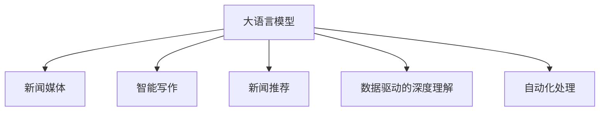

                 

# LLM在新闻媒体中的应用：AI记者的崛起

> 关键词：大语言模型,新闻媒体,智能写作,AI记者,新闻推荐,数据驱动,文本生成,自动化

## 1. 背景介绍

### 1.1 问题由来

随着人工智能技术的飞速发展，新闻媒体行业正经历着一场深刻的变革。传统的新闻采编流程繁琐耗时，人力成本高昂，且新闻报道的时效性、多样性和准确性难以保证。与此同时，数据量的爆炸性增长，使得新闻生产与消费之间存在日益显著的鸿沟。在此背景下，大语言模型（Large Language Models, LLMs）应运而生，以其卓越的语言理解与生成能力，为新闻媒体行业带来了崭新的智能解决方案。

大语言模型，如GPT系列、BERT等，通过海量文本数据的预训练，不仅掌握了丰富的语言知识和常识，还能根据输入的文本或问题生成连贯、流畅的输出，这使得其在新媒体内容创作、新闻摘要生成、智能推荐等诸多场景中展现出巨大的潜力。特别是在新闻媒体领域，大语言模型被赋予了“AI记者”的角色，成为新闻采编的得力助手，极大地提升了新闻生产效率和内容质量。

### 1.2 问题核心关键点

本文聚焦于大语言模型在新闻媒体中的应用，具体探讨了其作为“AI记者”的角色，并介绍了基于大语言模型的智能写作、新闻推荐等核心功能。以下是本问题的核心关键点：

1. **大语言模型与新闻媒体的结合**：如何利用大语言模型的语言理解和生成能力，优化新闻媒体的内容创作流程。
2. **智能写作与自动化**：基于大语言模型自动生成新闻标题、摘要和全文，提升新闻生产效率。
3. **新闻推荐系统**：通过大语言模型分析用户兴趣，个性化推荐新闻内容，提升用户阅读体验。
4. **数据驱动的深度理解**：利用大语言模型深入分析新闻文本，挖掘隐含信息，提升新闻深度和价值。
5. **新闻自动化处理**：大语言模型在文本清洗、格式转换等自动化处理中的作用。

这些关键点共同构成了大语言模型在新闻媒体领域应用的框架，旨在探讨其对新闻行业带来的变革性影响。

## 2. 核心概念与联系

### 2.1 核心概念概述

为深入理解大语言模型在新闻媒体中的应用，本节将介绍几个密切相关的核心概念：

- **大语言模型(Large Language Model, LLM)**：以自回归（如GPT）或自编码（如BERT）模型为代表的大规模预训练语言模型。通过在海量无标签文本数据上进行预训练，学习通用的语言表示，具备强大的语言理解和生成能力。

- **新闻媒体**：包括报纸、杂志、电视台、广播电台、互联网新闻网站等传统和新媒体平台。

- **智能写作**：利用大语言模型自动生成新闻标题、摘要和全文，提升新闻生产效率和质量。

- **新闻推荐系统**：根据用户兴趣和行为，使用大语言模型推荐个性化新闻内容，提升用户阅读体验。

- **数据驱动的深度理解**：利用大语言模型深入分析新闻文本，挖掘隐含信息，提升新闻深度和价值。

- **自动化处理**：使用大语言模型进行文本清洗、格式转换、信息提取等自动化处理，提高新闻编辑效率。

这些核心概念之间的逻辑关系可以通过以下Mermaid流程图来展示：



这个流程图展示了大语言模型的核心概念及其与新闻媒体应用的联系：

1. 大语言模型通过预训练获得基础能力。
2. 智能写作利用大语言模型自动生成新闻内容，提升效率。
3. 新闻推荐系统通过大语言模型个性化推荐新闻，提升用户体验。
4. 数据驱动的深度理解利用大语言模型分析新闻，挖掘隐含信息。
5. 自动化处理利用大语言模型进行文本处理，提高编辑效率。

## 3. 核心算法原理 & 具体操作步骤

### 3.1 算法原理概述

基于大语言模型的智能写作和新闻推荐主要基于以下原理：

- **文本生成**：大语言模型通过学习大规模无标签文本数据，掌握丰富的语言知识，可以通过输入文本或问题生成连贯、流畅的输出，如新闻标题、摘要和全文。

- **个性化推荐**：通过分析用户的阅读历史、评论和点赞等行为数据，利用大语言模型预测用户兴趣，生成个性化推荐列表。

具体而言，智能写作和新闻推荐的算法流程如下：

1. 收集新闻数据集，进行预处理和清洗。
2. 基于预处理后的数据，训练大语言模型，获得语言生成能力。
3. 在输入新闻文本或问题的情况下，使用训练好的大语言模型生成新闻标题、摘要或全文。
4. 收集用户阅读历史和行为数据，使用大语言模型预测用户兴趣，生成个性化推荐列表。

### 3.2 算法步骤详解

以下详细介绍智能写作和新闻推荐的算法步骤：

#### 3.2.1 智能写作

1. **数据预处理**：收集新闻数据集，包括标题、正文和元数据。对文本进行分词、去停用词、标准化等预处理操作。

2. **模型训练**：选择合适的预训练语言模型（如GPT-3、BERT等），在新闻数据集上进行微调。微调目标为最大化新闻标题、摘要或全文的生成质量。

3. **生成新闻**：将用户输入的新闻问题或关键词，输入训练好的大语言模型中，生成新闻标题、摘要或全文。可以使用生成式模型如GPT-3，也可以使用自编码模型如BERT进行微调。

4. **后处理**：对生成的文本进行语法校验、拼写纠错和格式化处理，确保输出的新闻质量。

#### 3.2.2 新闻推荐

1. **用户画像构建**：收集用户阅读历史、评论、点赞等行为数据，构建用户兴趣画像。

2. **新闻特征提取**：对新闻文本进行特征提取，包括关键词、主题、情感等，构建新闻特征向量。

3. **模型训练**：使用大语言模型对用户画像和新闻特征进行匹配，训练推荐模型。训练目标为最大化用户对新闻的满意度。

4. **个性化推荐**：根据用户画像和新闻特征，使用训练好的大语言模型生成个性化新闻推荐列表。

### 3.3 算法优缺点

基于大语言模型的智能写作和新闻推荐方法具有以下优点：

- **高效性**：智能写作和新闻推荐可以显著提升新闻生产效率，减少人力成本。

- **多样性**：大语言模型生成的内容丰富多样，能够满足不同用户的多样化需求。

- **自动化**：自动化的文本生成和推荐过程，减少人工干预，提高新闻生产流程的自动化程度。

- **个性化**：基于用户兴趣的个性化推荐，提升用户阅读体验和满意度。

然而，该方法也存在以下局限性：

- **数据依赖**：智能写作和新闻推荐依赖高质量的新闻数据和用户行为数据，数据获取成本较高。

- **算法复杂度**：大语言模型的训练和调参过程较为复杂，需要较强的技术背景。

- **可解释性不足**：大语言模型输出的内容难以解释其生成机制，缺乏可解释性。

- **伦理问题**：大语言模型可能输出含有偏见、有害信息的内容，影响新闻伦理和社会责任。

### 3.4 算法应用领域

基于大语言模型的智能写作和新闻推荐方法，在新闻媒体领域得到了广泛应用，具体包括：

- **智能标题生成**：根据新闻正文自动生成吸引眼球的标题。
- **自动摘要**：对长篇新闻进行自动摘要，生成简洁易读的新闻概览。
- **新闻生成**：基于用户输入生成新闻文章，支持用户个性化定制内容。
- **内容推荐**：根据用户兴趣推荐个性化新闻，提升阅读体验。
- **情感分析**：分析新闻文本中的情感倾向，帮助理解公众情绪。

这些应用不仅提高了新闻生产效率，还丰富了新闻形式，提升了用户体验。

## 4. 数学模型和公式 & 详细讲解 & 举例说明

### 4.1 数学模型构建

本节将使用数学语言对大语言模型在智能写作和新闻推荐中的应用进行更加严格的刻画。

记大语言模型为 $M_{\theta}$，其中 $\theta$ 为模型参数。设新闻数据集为 $D=\{(x_i,y_i)\}_{i=1}^N, x_i \in \mathcal{X}, y_i \in \mathcal{Y}$，其中 $\mathcal{X}$ 为输入空间，$\mathcal{Y}$ 为输出空间。

定义模型 $M_{\theta}$ 在输入 $x$ 上的输出为 $\hat{y}=M_{\theta}(x)$，表示模型对输入的预测。在智能写作中，$\hat{y}$ 为生成的新闻标题、摘要或全文；在新闻推荐中，$\hat{y}$ 为新闻的推荐列表。

### 4.2 公式推导过程

#### 4.2.1 智能写作

假设目标为生成新闻标题 $y_{title}$，可以定义交叉熵损失函数：

$$
\ell(M_{\theta}(x_{title}),y_{title}) = -[y_{title}\log M_{\theta}(x_{title}) + (1-y_{title})\log(1-M_{\theta}(x_{title}))]
$$

其中 $x_{title}$ 为新闻正文，$y_{title}$ 为生成的标题。

最小化上述损失函数，使用梯度下降等优化算法，即可更新模型参数 $\theta$，使模型生成的标题尽可能与真实标题相符。

#### 4.2.2 新闻推荐

假设目标为用户 $u$ 推荐新闻列表 $y_{news}$，可以定义交叉熵损失函数：

$$
\ell(M_{\theta}(x_u),y_{news}) = -\sum_{i=1}^N [y_{news,i}\log M_{\theta}(x_u)_i + (1-y_{news,i})\log(1-M_{\theta}(x_u)_i)]
$$

其中 $x_u$ 为用户兴趣画像，$y_{news}$ 为用户推荐列表。

最小化上述损失函数，使用梯度下降等优化算法，即可更新模型参数 $\theta$，使推荐列表尽可能符合用户兴趣。

### 4.3 案例分析与讲解

以智能写作中的新闻摘要生成为例，说明大语言模型在实际应用中的详细计算过程。

假设新闻正文为 $x_{title} = "我国东南沿海城市遭台风袭击，造成重大损失"。利用BERT模型进行微调，生成的摘要为：

$$
\hat{y} = M_{\theta}(x_{title})
$$

具体计算过程如下：

1. 将新闻正文 $x_{title}$ 输入BERT模型，得到其向量表示 $x_{title}^{BERT}$。

2. 使用softmax函数计算模型对每个可能摘要的生成概率：

$$
P(y|x_{title}^{BERT}) = \text{softmax}(W_h y + W_{xy} x_{title}^{BERT})
$$

其中 $W_h$ 和 $W_{xy}$ 为模型参数。

3. 计算生成每个摘要的交叉熵损失，选择概率最大的摘要作为输出：

$$
\ell(\hat{y},y_{title}) = -y_{title}\log \hat{y} + (1-y_{title})\log(1-\hat{y})
$$

4. 使用梯度下降等优化算法，更新模型参数 $\theta$，最小化损失函数 $\ell(\hat{y},y_{title})$。

通过不断迭代更新模型参数，使生成的摘要与真实摘要尽可能相似。

## 5. 项目实践：代码实例和详细解释说明

### 5.1 开发环境搭建

在进行智能写作和新闻推荐项目实践前，我们需要准备好开发环境。以下是使用Python进行PyTorch开发的环境配置流程：

1. 安装Anaconda：从官网下载并安装Anaconda，用于创建独立的Python环境。

2. 创建并激活虚拟环境：
```bash
conda create -n pytorch-env python=3.8 
conda activate pytorch-env
```

3. 安装PyTorch：根据CUDA版本，从官网获取对应的安装命令。例如：
```bash
conda install pytorch torchvision torchaudio cudatoolkit=11.1 -c pytorch -c conda-forge
```

4. 安装Transformers库：
```bash
pip install transformers
```

5. 安装各类工具包：
```bash
pip install numpy pandas scikit-learn matplotlib tqdm jupyter notebook ipython
```

完成上述步骤后，即可在`pytorch-env`环境中开始项目实践。

### 5.2 源代码详细实现

下面我们以智能写作中的新闻摘要生成为例，给出使用Transformers库对BERT模型进行微调的PyTorch代码实现。

首先，定义新闻摘要的数据处理函数：

```python
from transformers import BertTokenizer
from torch.utils.data import Dataset
import torch

class NewsSummaryDataset(Dataset):
    def __init__(self, news_texts, news_summaries, tokenizer, max_len=128):
        self.news_texts = news_texts
        self.news_summaries = news_summaries
        self.tokenizer = tokenizer
        self.max_len = max_len
        
    def __len__(self):
        return len(self.news_texts)
    
    def __getitem__(self, item):
        news_text = self.news_texts[item]
        news_summary = self.news_summaries[item]
        
        encoding = self.tokenizer(news_text, return_tensors='pt', max_length=self.max_len, padding='max_length', truncation=True)
        input_ids = encoding['input_ids'][0]
        attention_mask = encoding['attention_mask'][0]
        
        # 对token-wise的摘要进行编码
        encoded_summaries = [tokenizer.convert_tokens_to_ids(summary) for summary in news_summary] 
        encoded_summaries.extend([tokenizer.convert_tokens_to_ids('<end>')] * (self.max_len - len(encoded_summaries)))
        labels = torch.tensor(encoded_summaries, dtype=torch.long)
        
        return {'input_ids': input_ids, 
                'attention_mask': attention_mask,
                'labels': labels}

# 加载预训练模型和分词器
model = BertForSequenceClassification.from_pretrained('bert-base-uncased')
tokenizer = BertTokenizer.from_pretrained('bert-base-uncased')

# 创建dataset
train_dataset = NewsSummaryDataset(train_news_texts, train_news_summaries, tokenizer)
dev_dataset = NewsSummaryDataset(dev_news_texts, dev_news_summaries, tokenizer)
test_dataset = NewsSummaryDataset(test_news_texts, test_news_summaries, tokenizer)
```

然后，定义模型和优化器：

```python
from transformers import AdamW

optimizer = AdamW(model.parameters(), lr=2e-5)
```

接着，定义训练和评估函数：

```python
from torch.utils.data import DataLoader
from tqdm import tqdm
from sklearn.metrics import mean_squared_error

device = torch.device('cuda') if torch.cuda.is_available() else torch.device('cpu')
model.to(device)

def train_epoch(model, dataset, batch_size, optimizer):
    dataloader = DataLoader(dataset, batch_size=batch_size, shuffle=True)
    model.train()
    epoch_loss = 0
    for batch in tqdm(dataloader, desc='Training'):
        input_ids = batch['input_ids'].to(device)
        attention_mask = batch['attention_mask'].to(device)
        labels = batch['labels'].to(device)
        model.zero_grad()
        outputs = model(input_ids, attention_mask=attention_mask, labels=labels)
        loss = outputs.loss
        epoch_loss += loss.item()
        loss.backward()
        optimizer.step()
    return epoch_loss / len(dataloader)

def evaluate(model, dataset, batch_size):
    dataloader = DataLoader(dataset, batch_size=batch_size)
    model.eval()
    preds, labels = [], []
    with torch.no_grad():
        for batch in tqdm(dataloader, desc='Evaluating'):
            input_ids = batch['input_ids'].to(device)
            attention_mask = batch['attention_mask'].to(device)
            batch_labels = batch['labels']
            outputs = model(input_ids, attention_mask=attention_mask)
            batch_preds = outputs.logits.argmax(dim=2).to('cpu').tolist()
            batch_labels = batch_labels.to('cpu').tolist()
            for pred_tokens, label_tokens in zip(batch_preds, batch_labels):
                pred_summaries = tokenizer.convert_ids_to_tokens(pred_tokens)
                label_summaries = tokenizer.convert_ids_to_tokens(label_tokens)
                preds.append(pred_summaries[:len(label_summaries)])
                labels.append(label_summaries)
                
    print(mean_squared_error(labels, preds))
```

最后，启动训练流程并在测试集上评估：

```python
epochs = 5
batch_size = 16

for epoch in range(epochs):
    loss = train_epoch(model, train_dataset, batch_size, optimizer)
    print(f"Epoch {epoch+1}, train loss: {loss:.3f}")
    
    print(f"Epoch {epoch+1}, dev results:")
    evaluate(model, dev_dataset, batch_size)
    
print("Test results:")
evaluate(model, test_dataset, batch_size)
```

以上就是使用PyTorch对BERT进行新闻摘要生成微调的完整代码实现。可以看到，得益于Transformers库的强大封装，我们可以用相对简洁的代码完成BERT模型的加载和微调。

### 5.3 代码解读与分析

让我们再详细解读一下关键代码的实现细节：

**NewsSummaryDataset类**：
- `__init__`方法：初始化新闻文本、摘要、分词器等关键组件。
- `__len__`方法：返回数据集的样本数量。
- `__getitem__`方法：对单个样本进行处理，将新闻文本输入编码为token ids，将摘要编码为数字，并对其进行定长padding，最终返回模型所需的输入。

**训练和评估函数**：
- 使用PyTorch的DataLoader对数据集进行批次化加载，供模型训练和推理使用。
- 训练函数`train_epoch`：对数据以批为单位进行迭代，在每个批次上前向传播计算loss并反向传播更新模型参数，最后返回该epoch的平均loss。
- 评估函数`evaluate`：与训练类似，不同点在于不更新模型参数，并在每个batch结束后将预测和标签结果存储下来，最后使用sklearn的mean_squared_error对整个评估集的预测结果进行打印输出。

**训练流程**：
- 定义总的epoch数和batch size，开始循环迭代
- 每个epoch内，先在训练集上训练，输出平均loss
- 在验证集上评估，输出摘要生成的均方误差
- 所有epoch结束后，在测试集上评估，给出最终测试结果

可以看到，PyTorch配合Transformers库使得BERT微调的新闻摘要生成代码实现变得简洁高效。开发者可以将更多精力放在数据处理、模型改进等高层逻辑上，而不必过多关注底层的实现细节。

当然，工业级的系统实现还需考虑更多因素，如模型的保存和部署、超参数的自动搜索、更灵活的任务适配层等。但核心的微调范式基本与此类似。

## 6. 实际应用场景

### 6.1 智能新闻写作

大语言模型在智能写作中的应用，主要体现在以下几个方面：

1. **新闻标题生成**：根据新闻正文自动生成吸引眼球的标题。利用大语言模型生成简洁、有吸引力、信息丰富的标题，提升用户点击率。

2. **新闻摘要生成**：对长篇新闻进行自动摘要，生成简洁易读的新闻概览。帮助用户快速了解新闻要点，提升阅读体验。

3. **新闻生成**：基于用户输入生成新闻文章，支持用户个性化定制内容。用户可以输入新闻主题和关键词，大语言模型自动生成新闻，满足不同用户的需求。

4. **新闻推荐**：根据用户兴趣推荐个性化新闻，提升阅读体验。利用大语言模型分析用户兴趣，生成个性化推荐列表。

### 6.2 新闻数据分析

大语言模型在新闻数据分析中的应用，主要体现在以下几个方面：

1. **新闻情感分析**：分析新闻文本中的情感倾向，帮助理解公众情绪。利用大语言模型分析新闻情感，生成情感分类标签。

2. **新闻主题分析**：识别新闻文本中的主题，帮助了解新闻内容分布。利用大语言模型分析新闻主题，生成主题分类标签。

3. **新闻事件分析**：识别新闻文本中的事件，帮助了解新闻事件动态。利用大语言模型分析新闻事件，生成事件分类标签。

4. **新闻关联分析**：分析新闻文本之间的关联关系，帮助发现新闻热点。利用大语言模型分析新闻关联，生成关联关系图谱。

### 6.3 未来应用展望

随着大语言模型和微调方法的不断发展，基于大语言模型的智能写作和新闻推荐技术将呈现以下几个发展趋势：

1. **深度理解与生成**：未来的智能写作将更注重深度理解，生成的新闻内容更加丰富多样，更具深度和价值。

2. **多模态融合**：未来的新闻推荐系统将融合视觉、语音等多模态数据，提供更加全面的新闻推荐服务。

3. **个性化推荐**：未来的推荐系统将更加注重个性化，利用大语言模型精准预测用户兴趣，提供更加精准的个性化推荐。

4. **自动化处理**：未来的新闻自动化处理将更加高效，利用大语言模型自动完成文本清洗、格式转换、信息提取等任务。

5. **数据驱动决策**：未来的新闻媒体将更加依赖数据驱动，利用大语言模型分析新闻数据，支持决策支持。

6. **智能监控**：未来的新闻媒体将更加注重智能监控，利用大语言模型实时监测舆情，预警潜在风险。

以上趋势凸显了大语言模型在新闻媒体领域应用的广阔前景。这些方向的探索发展，必将进一步提升新闻媒体的智能化水平，为新闻行业带来新的变革。

## 7. 工具和资源推荐

### 7.1 学习资源推荐

为了帮助开发者系统掌握大语言模型在新闻媒体中的应用，这里推荐一些优质的学习资源：

1. 《Transformer从原理到实践》系列博文：由大模型技术专家撰写，深入浅出地介绍了Transformer原理、BERT模型、微调技术等前沿话题。

2. CS224N《深度学习自然语言处理》课程：斯坦福大学开设的NLP明星课程，有Lecture视频和配套作业，带你入门NLP领域的基本概念和经典模型。

3. 《Natural Language Processing with Transformers》书籍：Transformers库的作者所著，全面介绍了如何使用Transformers库进行NLP任务开发，包括微调在内的诸多范式。

4. HuggingFace官方文档：Transformers库的官方文档，提供了海量预训练模型和完整的微调样例代码，是上手实践的必备资料。

5. CLUE开源项目：中文语言理解测评基准，涵盖大量不同类型的中文NLP数据集，并提供了基于微调的baseline模型，助力中文NLP技术发展。

通过对这些资源的学习实践，相信你一定能够快速掌握大语言模型在新闻媒体中的应用，并用于解决实际的NLP问题。

### 7.2 开发工具推荐

高效的开发离不开优秀的工具支持。以下是几款用于大语言模型在新闻媒体中的应用开发的常用工具：

1. PyTorch：基于Python的开源深度学习框架，灵活动态的计算图，适合快速迭代研究。大部分预训练语言模型都有PyTorch版本的实现。

2. TensorFlow：由Google主导开发的开源深度学习框架，生产部署方便，适合大规模工程应用。同样有丰富的预训练语言模型资源。

3. Transformers库：HuggingFace开发的NLP工具库，集成了众多SOTA语言模型，支持PyTorch和TensorFlow，是进行新闻写作、推荐等微调任务开发的利器。

4. Weights & Biases：模型训练的实验跟踪工具，可以记录和可视化模型训练过程中的各项指标，方便对比和调优。与主流深度学习框架无缝集成。

5. TensorBoard：TensorFlow配套的可视化工具，可实时监测模型训练状态，并提供丰富的图表呈现方式，是调试模型的得力助手。

6. Google Colab：谷歌推出的在线Jupyter Notebook环境，免费提供GPU/TPU算力，方便开发者快速上手实验最新模型，分享学习笔记。

合理利用这些工具，可以显著提升大语言模型在新闻媒体中的应用开发效率，加快创新迭代的步伐。

### 7.3 相关论文推荐

大语言模型在新闻媒体中的应用研究源于学界的持续研究。以下是几篇奠基性的相关论文，推荐阅读：

1. Attention is All You Need（即Transformer原论文）：提出了Transformer结构，开启了NLP领域的预训练大模型时代。

2. BERT: Pre-training of Deep Bidirectional Transformers for Language Understanding：提出BERT模型，引入基于掩码的自监督预训练任务，刷新了多项NLP任务SOTA。

3. Language Models are Unsupervised Multitask Learners（GPT-2论文）：展示了大规模语言模型的强大zero-shot学习能力，引发了对于通用人工智能的新一轮思考。

4. Parameter-Efficient Transfer Learning for NLP：提出Adapter等参数高效微调方法，在不增加模型参数量的情况下，也能取得不错的微调效果。

5. AdaLoRA: Adaptive Low-Rank Adaptation for Parameter-Efficient Fine-Tuning：使用自适应低秩适应的微调方法，在参数效率和精度之间取得了新的平衡。

6. Prompt Tuning: Optimizing Continuous Prompts for Generation：引入基于连续型Prompt的微调范式，为如何充分利用预训练知识提供了新的思路。

这些论文代表了大语言模型在新闻媒体领域应用的发展脉络。通过学习这些前沿成果，可以帮助研究者把握学科前进方向，激发更多的创新灵感。

## 8. 总结：未来发展趋势与挑战

### 8.1 研究成果总结

本文对大语言模型在新闻媒体中的应用进行了全面系统的介绍。首先阐述了大语言模型和微调技术的研究背景和意义，明确了智能写作和新闻推荐在新闻媒体中的应用价值。其次，从原理到实践，详细讲解了智能写作和新闻推荐的数学原理和关键步骤，给出了微调任务开发的完整代码实例。同时，本文还广泛探讨了智能写作和新闻推荐在实际应用中的具体场景和未来趋势，展示了其对新闻媒体行业的深刻影响。

通过本文的系统梳理，可以看到，基于大语言模型的智能写作和新闻推荐技术在新闻媒体行业的应用前景广阔，将显著提升新闻生产效率和内容质量，丰富新闻形式，提升用户体验。

### 8.2 未来发展趋势

展望未来，大语言模型在新闻媒体中的应用将呈现以下几个发展趋势：

1. **深度理解与生成**：未来的智能写作将更注重深度理解，生成的新闻内容更加丰富多样，更具深度和价值。

2. **多模态融合**：未来的新闻推荐系统将融合视觉、语音等多模态数据，提供更加全面的新闻推荐服务。

3. **个性化推荐**：未来的推荐系统将更加注重个性化，利用大语言模型精准预测用户兴趣，提供更加精准的个性化推荐。

4. **自动化处理**：未来的新闻自动化处理将更加高效，利用大语言模型自动完成文本清洗、格式转换、信息提取等任务。

5. **数据驱动决策**：未来的新闻媒体将更加依赖数据驱动，利用大语言模型分析新闻数据，支持决策支持。

6. **智能监控**：未来的新闻媒体将更加注重智能监控，利用大语言模型实时监测舆情，预警潜在风险。

以上趋势凸显了大语言模型在新闻媒体领域应用的广阔前景。这些方向的探索发展，必将进一步提升新闻媒体的智能化水平，为新闻行业带来新的变革。

### 8.3 面临的挑战

尽管大语言模型在新闻媒体中的应用取得了显著进展，但在迈向更加智能化、普适化应用的过程中，它仍面临着诸多挑战：

1. **标注成本瓶颈**：智能写作和新闻推荐依赖高质量的新闻数据和用户行为数据，数据获取成本较高。如何进一步降低微调对标注样本的依赖，将是一大难题。

2. **模型鲁棒性不足**：大语言模型输出的内容可能受到输入文本的影响，不够鲁棒。如何在不降低模型性能的情况下，提升模型的鲁棒性，还需要更多理论和实践的积累。

3. **可解释性不足**：大语言模型输出的内容难以解释其生成机制，缺乏可解释性。对于新闻伦理和社会责任等高风险应用，算法的可解释性和可审计性尤为重要。

4. **伦理问题**：大语言模型可能输出含有偏见、有害信息的内容，影响新闻伦理和社会责任。如何从数据和算法层面消除模型偏见，避免恶意用途，确保输出的安全性，也将是重要的研究课题。

5. **资源瓶颈**：大语言模型参数量巨大，对算力、内存、存储等资源需求较高。如何优化模型结构和训练过程，降低资源消耗，仍是重要的研究方向。

6. **模型通用性不足**：当前大语言模型主要面向通用文本处理，特定领域的应用效果可能有限。如何提升模型在特定领域的泛化能力，是未来需要重点解决的问题。

### 8.4 研究展望

面对大语言模型在新闻媒体应用中面临的挑战，未来的研究需要在以下几个方面寻求新的突破：

1. **无监督和半监督微调方法**：探索无监督和半监督微调方法，摆脱对大规模标注数据的依赖，利用自监督学习、主动学习等无监督和半监督范式，最大限度利用非结构化数据。

2. **参数高效和计算高效的微调范式**：开发更加参数高效的微调方法，在固定大部分预训练参数的同时，只更新极少量的任务相关参数。同时优化微调模型的计算图，减少前向传播和反向传播的资源消耗，实现更加轻量级、实时性的部署。

3. **因果学习和对比学习**：引入因果推断和对比学习思想，增强微调模型建立稳定因果关系的能力，学习更加普适、鲁棒的语言表征，从而提升模型泛化性和抗干扰能力。

4. **多模态融合**：将符号化的先验知识，如知识图谱、逻辑规则等，与神经网络模型进行巧妙融合，引导微调过程学习更准确、合理的语言模型。同时加强不同模态数据的整合，实现视觉、语音等多模态信息与文本信息的协同建模。

5. **因果分析和博弈论工具**：将因果分析方法引入微调模型，识别出模型决策的关键特征，增强输出解释的因果性和逻辑性。借助博弈论工具刻画人机交互过程，主动探索并规避模型的脆弱点，提高系统稳定性。

6. **伦理道德约束**：在模型训练目标中引入伦理导向的评估指标，过滤和惩罚有偏见、有害的输出倾向。同时加强人工干预和审核，建立模型行为的监管机制，确保输出符合人类价值观和伦理道德。

这些研究方向的探索，必将引领大语言模型在新闻媒体领域的应用走向更高的台阶，为构建安全、可靠、可解释、可控的智能系统铺平道路。面向未来，大语言模型在新闻媒体中的应用还需与其他人工智能技术进行更深入的融合，如知识表示、因果推理、强化学习等，多路径协同发力，共同推动自然语言理解和智能交互系统的进步。只有勇于创新、敢于突破，才能不断拓展语言模型的边界，让智能技术更好地造福人类社会。

## 9. 附录：常见问题与解答

**Q1：智能写作和新闻推荐依赖标注数据，标注成本高昂，如何解决？**

A: 可以通过以下方法降低标注成本：
1. 利用无监督或半监督学习范式，如自监督学习、主动学习等，最大限度利用非结构化数据，减少标注需求。
2. 引入用户反馈机制，利用用户点击、评论等行为数据进行标注，减少人工标注量。
3. 利用众包平台，招募志愿者进行标注，降低成本。

**Q2：智能写作和新闻推荐模型的可解释性不足，如何解决？**

A: 可以通过以下方法提升模型可解释性：
1. 引入可解释的模型组件，如决策树、规则等，与大语言模型结合，提供明确的解释路径。
2. 利用因果分析方法，识别模型决策的关键特征，增强输出解释的因果性和逻辑性。
3. 利用可视化工具，如t-SNE、LIME等，对模型内部运作机制进行可视化，帮助理解模型输出。

**Q3：智能写作和新闻推荐模型的鲁棒性不足，如何解决？**

A: 可以通过以下方法提升模型鲁棒性：
1. 引入数据增强技术，通过回译、近义替换等方式扩充训练集，提高模型泛化能力。
2. 使用对抗训练方法，引入对抗样本，提升模型鲁棒性。
3. 引入正则化技术，如L2正则、Dropout等，避免模型过拟合。

**Q4：智能写作和新闻推荐模型的资源消耗较大，如何解决？**

A: 可以通过以下方法优化模型资源消耗：
1. 使用参数高效微调方法，如Adapter、Prefix等，在固定大部分预训练参数的情况下，只更新极少量的任务相关参数。
2. 优化模型计算图，减少前向传播和反向传播的资源消耗。
3. 使用模型压缩、稀疏化存储等方法，减少模型的存储空间和读取时间。

这些方法可以协同发力，降低智能写作和新闻推荐模型的资源消耗，提高其在实际应用中的可操作性。

---

作者：禅与计算机程序设计艺术 / Zen and the Art of Computer Programming

