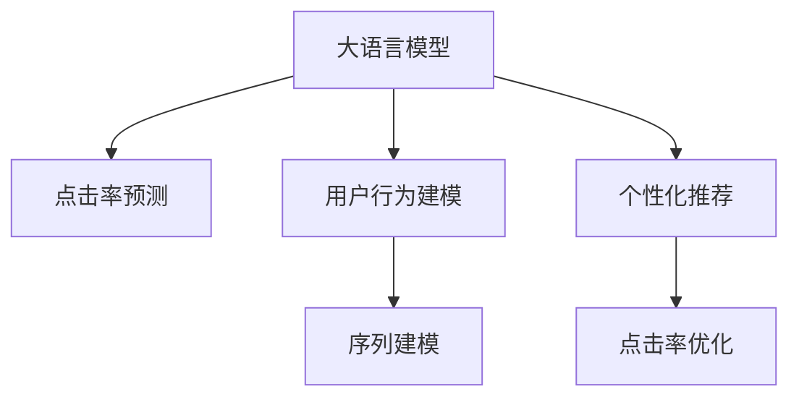

                 

# LLM在智能广告投放中的应用

> 关键词：大语言模型,广告投放,点击率预测,用户行为建模,序列建模,个性化推荐,点击率优化

## 1. 背景介绍

### 1.1 问题由来
在现代数字营销中，广告投放是非常关键的一环。良好的广告投放策略不仅能显著提升品牌曝光和用户参与，还能有效控制成本，实现ROI最大化。然而，广告投放面临的挑战也愈发严峻，比如用户偏好不断变化、广告投放平台众多、广告素材丰富等，都需要广告主精准地进行投放决策。

近年来，大语言模型（Large Language Models, LLMs）在自然语言处理（NLP）领域取得了突破性进展，其强大的语言理解能力和生成能力，使得其在广告投放领域也展现出巨大的应用潜力。

### 1.2 问题核心关键点
大语言模型在智能广告投放中的应用，主要体现在以下几个方面：

1. **点击率预测（CTR Prediction）**：通过分析用户的浏览历史、行为数据，预测用户点击广告的概率，以优化广告投放策略。

2. **用户行为建模（User Behavior Modeling）**：构建用户画像，理解用户的兴趣偏好，进行个性化广告推荐，提高广告投放的精准度。

3. **序列建模（Sequence Modeling）**：利用用户的浏览序列数据，预测用户的下一步行为，从而优化广告展示时机。

4. **个性化推荐（Personalized Recommendation）**：基于用户的历史行为和兴趣，进行定制化广告展示，提升广告的吸引力和转化率。

5. **点击率优化（CTR Optimization）**：通过不断优化广告投放参数，提升广告点击率，实现成本控制和收益最大化。

本文将系统性地介绍大语言模型在智能广告投放中的应用，包括算法原理、具体操作步骤、数学模型等，并通过案例分析，展示其实际应用效果。

## 2. 核心概念与联系

### 2.1 核心概念概述

为更好地理解大语言模型在广告投放中的应用，本节将介绍几个核心概念：

- **大语言模型（LLMs）**：基于自回归（如GPT）或自编码（如BERT）架构，在大量无标签文本数据上进行预训练的语言模型。其强大的语言理解和生成能力，使得其在各种NLP任务中表现出色。

- **点击率预测（CTR Prediction）**：预测用户点击广告的概率，是广告投放优化的核心指标。

- **用户行为建模（User Behavior Modeling）**：通过分析用户的行为数据，构建用户画像，理解其兴趣和偏好，进行个性化广告推荐。

- **序列建模（Sequence Modeling）**：利用用户的浏览序列数据，预测用户的下一步行为，优化广告展示时机。

- **个性化推荐（Personalized Recommendation）**：基于用户的历史行为和兴趣，进行定制化广告展示，提升广告的吸引力和转化率。

- **点击率优化（CTR Optimization）**：通过不断优化广告投放参数，提升广告点击率，实现成本控制和收益最大化。

这些核心概念之间的逻辑关系可以通过以下Mermaid流程图来展示：



这个流程图展示了大语言模型在广告投放中的应用路径：

1. 利用大语言模型进行点击率预测，指导广告投放策略。
2. 通过用户行为建模，构建用户画像，实现个性化推荐。
3. 结合序列建模，优化广告展示时机。
4. 最后，通过点击率优化，不断提升广告投放效果。

## 3. 核心算法原理 & 具体操作步骤

### 3.1 算法原理概述

大语言模型在智能广告投放中的应用，主要基于其强大的语言理解和生成能力，通过点击率预测、用户行为建模、序列建模和个性化推荐等任务，优化广告投放效果。

点击率预测任务的目标是，给定用户浏览历史和广告特征，预测用户点击广告的概率。大语言模型可以通过阅读广告文本和用户行为数据，理解广告内容与用户兴趣之间的关系，从而进行精准的点击率预测。

用户行为建模任务的目标是，分析用户的浏览历史、点击记录等行为数据，构建用户画像，理解其兴趣和偏好，进行个性化广告推荐。大语言模型可以通过阅读用户的点击日志，预测用户的下一步行为，从而实现更加精准的广告投放。

序列建模任务的目标是，利用用户的浏览序列数据，预测用户的下一步行为，优化广告展示时机。大语言模型可以通过分析用户的浏览记录，预测其下一时刻的行为，从而选择最佳的广告展示时机。

个性化推荐任务的目标是，基于用户的历史行为和兴趣，进行定制化广告展示，提升广告的吸引力和转化率。大语言模型可以通过阅读用户的行为数据，生成与用户兴趣相关的广告内容，实现个性化推荐。

### 3.2 算法步骤详解

基于大语言模型在广告投放中的应用，以下是详细的算法步骤：

**Step 1: 数据准备**
- 收集用户的历史浏览数据、点击记录、行为数据等，构建训练集。
- 将广告文本、广告特征等信息转化为模型可接受的格式。

**Step 2: 模型选择与适配**
- 选择合适的预训练语言模型，如GPT、BERT等。
- 设计任务适配层，将预训练模型适配到广告投放任务。

**Step 3: 模型训练**
- 将训练集数据输入模型，进行有监督的微调训练。
- 设置学习率、批大小、迭代轮数等超参数。

**Step 4: 点击率预测**
- 输入用户浏览历史和广告特征，计算预测点击率。
- 根据预测结果进行广告投放策略优化。

**Step 5: 用户行为建模**
- 分析用户的浏览历史和行为数据，构建用户画像。
- 根据用户画像进行个性化广告推荐。

**Step 6: 序列建模**
- 利用用户的浏览序列数据，预测其下一步行为。
- 根据预测结果优化广告展示时机。

**Step 7: 点击率优化**
- 不断调整广告投放参数，优化广告点击率。
- 根据点击率优化结果，调整投放策略。

### 3.3 算法优缺点

使用大语言模型进行广告投放，具有以下优点：

1. **精准度高**：通过阅读广告文本和用户行为数据，大语言模型能够精准预测点击率和用户行为，提升广告投放效果。
2. **灵活性强**：大语言模型可以处理不同类型的广告和用户行为数据，适应多种广告投放场景。
3. **实时性好**：基于大语言模型的预测和推荐算法，可以实时优化广告投放策略，快速应对市场变化。

然而，也存在以下缺点：

1. **数据依赖性强**：广告投放的准确性依赖于高质量的训练数据，获取大量标注数据成本较高。
2. **模型复杂度高**：大语言模型的复杂度高，训练和推理成本较高。
3. **可解释性差**：大语言模型通常是一个黑盒系统，难以解释其决策过程，限制了模型的应用范围。

### 3.4 算法应用领域

大语言模型在广告投放中的应用，已经广泛应用于各类在线广告平台，如搜索引擎广告、社交媒体广告、电商广告等。其核心应用包括：

- **搜索引擎广告**：通过点击率预测和用户行为建模，优化搜索结果页广告的投放策略。
- **社交媒体广告**：利用序列建模和个性化推荐，提升社交平台广告的展示效果和点击率。
- **电商广告**：结合用户行为数据和点击率预测，优化电商广告的展示时机和投放策略。

此外，大语言模型还在其他广告投放场景中展现出了广泛的应用潜力，如智能广告创意生成、广告内容优化等，为广告主提供了更多的创意素材和投放策略。

## 4. 数学模型和公式 & 详细讲解 & 举例说明

### 4.1 数学模型构建

本节将使用数学语言对基于大语言模型的广告投放过程进行更加严格的刻画。

假设广告文本为 $A$，用户行为数据为 $B$，模型的目标是预测用户点击广告的概率 $p(y=1|A,B)$。这里 $y$ 为二元随机变量，表示用户是否点击广告。

设预训练语言模型为 $M_{\theta}$，则点击率预测任务的数学模型可以表示为：

$$
p(y=1|A,B) = \sigma(\langle M_{\theta}(A), M_{\theta}(B) \rangle)
$$

其中 $\sigma(\cdot)$ 为sigmoid函数，$\langle \cdot, \cdot \rangle$ 表示向量的内积，$\theta$ 为预训练模型的参数。

### 4.2 公式推导过程

为了简化公式推导，我们以点击率预测为例进行详细讲解。

假设广告文本为 $A$，用户行为数据为 $B$，模型的目标是预测用户点击广告的概率 $p(y=1|A,B)$。这里 $y$ 为二元随机变量，表示用户是否点击广告。

设预训练语言模型为 $M_{\theta}$，则点击率预测任务的数学模型可以表示为：

$$
p(y=1|A,B) = \sigma(\langle M_{\theta}(A), M_{\theta}(B) \rangle)
$$

其中 $\sigma(\cdot)$ 为sigmoid函数，$\langle \cdot, \cdot \rangle$ 表示向量的内积，$\theta$ 为预训练模型的参数。

首先，我们需要将广告文本 $A$ 和用户行为数据 $B$ 转换为向量表示，记为 $a$ 和 $b$。然后将这两个向量输入到预训练语言模型 $M_{\theta}$ 中，得到输出向量 $m_a$ 和 $m_b$。

模型的输出即为向量 $m_a$ 和 $m_b$ 的内积，经过sigmoid函数归一化，得到点击率的概率：

$$
p(y=1|A,B) = \sigma(\langle m_a, m_b \rangle)
$$

其中 $\langle \cdot, \cdot \rangle$ 表示向量内积，$\sigma(\cdot)$ 表示sigmoid函数。

### 4.3 案例分析与讲解

下面我们以一个简单的案例来解释大语言模型在广告投放中的应用：

假设有一家电商平台的广告投放系统，需要预测用户点击商品广告的概率。平台收集了用户的历史浏览记录和点击记录，以及广告的标题、描述、价格等信息。平台希望通过大语言模型进行点击率预测，优化广告投放策略。

具体步骤如下：

1. **数据准备**：收集用户的历史浏览记录和点击记录，将广告标题和描述信息转换为向量表示，构建训练集。

2. **模型选择与适配**：选择GPT-3模型，设计任务适配层，将GPT-3模型适配到点击率预测任务。

3. **模型训练**：将训练集数据输入GPT-3模型，进行有监督的微调训练。设置学习率、批大小、迭代轮数等超参数。

4. **点击率预测**：输入用户浏览记录和广告特征，计算预测点击率。根据预测结果进行广告投放策略优化。

5. **用户行为建模**：分析用户的浏览历史和行为数据，构建用户画像。根据用户画像进行个性化广告推荐。

6. **序列建模**：利用用户的浏览序列数据，预测其下一步行为。根据预测结果优化广告展示时机。

7. **点击率优化**：不断调整广告投放参数，优化广告点击率。根据点击率优化结果，调整投放策略。

通过这些步骤，电商平台能够实现精准的广告投放，提高广告点击率和转化率，提升用户体验和平台收益。

## 5. 项目实践：代码实例和详细解释说明

### 5.1 开发环境搭建

在进行广告投放系统开发前，我们需要准备好开发环境。以下是使用Python进行PyTorch开发的环境配置流程：

1. 安装Anaconda：从官网下载并安装Anaconda，用于创建独立的Python环境。

2. 创建并激活虚拟环境：
```bash
conda create -n pytorch-env python=3.8 
conda activate pytorch-env
```

3. 安装PyTorch：根据CUDA版本，从官网获取对应的安装命令。例如：
```bash
conda install pytorch torchvision torchaudio cudatoolkit=11.1 -c pytorch -c conda-forge
```

4. 安装Transformers库：
```bash
pip install transformers
```

5. 安装各类工具包：
```bash
pip install numpy pandas scikit-learn matplotlib tqdm jupyter notebook ipython
```

完成上述步骤后，即可在`pytorch-env`环境中开始广告投放系统开发。

### 5.2 源代码详细实现

下面我们以点击率预测任务为例，给出使用Transformers库对GPT模型进行广告投放微调的PyTorch代码实现。

首先，定义点击率预测任务的训练数据处理函数：

```python
from transformers import GPT2Tokenizer, GPT2Model

class ClickRateDataset(Dataset):
    def __init__(self, ads, clicks, tokenizer, max_len=128):
        self.ads = ads
        self.clicks = clicks
        self.tokenizer = tokenizer
        self.max_len = max_len
        
    def __len__(self):
        return len(self.ads)
    
    def __getitem__(self, item):
        ad = self.ads[item]
        click = self.clicks[item]
        
        encoding = self.tokenizer(ad, return_tensors='pt', max_length=self.max_len, padding='max_length', truncation=True)
        input_ids = encoding['input_ids'][0]
        attention_mask = encoding['attention_mask'][0]
        
        # 构建二元向量表示点击结果
        label = click
        label = [1 if label else 0]
        
        return {'input_ids': input_ids, 
                'attention_mask': attention_mask,
                'labels': label}

# 创建dataset
tokenizer = GPT2Tokenizer.from_pretrained('gpt2')

train_dataset = ClickRateDataset(train_ads, train_clicks, tokenizer)
dev_dataset = ClickRateDataset(dev_ads, dev_clicks, tokenizer)
test_dataset = ClickRateDataset(test_ads, test_clicks, tokenizer)
```

然后，定义模型和优化器：

```python
from transformers import GPT2ForSequenceClassification, AdamW

model = GPT2ForSequenceClassification.from_pretrained('gpt2', num_labels=2)

optimizer = AdamW(model.parameters(), lr=2e-5)
```

接着，定义训练和评估函数：

```python
from torch.utils.data import DataLoader
from tqdm import tqdm
from sklearn.metrics import roc_auc_score

device = torch.device('cuda') if torch.cuda.is_available() else torch.device('cpu')
model.to(device)

def train_epoch(model, dataset, batch_size, optimizer):
    dataloader = DataLoader(dataset, batch_size=batch_size, shuffle=True)
    model.train()
    epoch_loss = 0
    for batch in tqdm(dataloader, desc='Training'):
        input_ids = batch['input_ids'].to(device)
        attention_mask = batch['attention_mask'].to(device)
        labels = batch['labels'].to(device)
        model.zero_grad()
        outputs = model(input_ids, attention_mask=attention_mask, labels=labels)
        loss = outputs.loss
        epoch_loss += loss.item()
        loss.backward()
        optimizer.step()
    return epoch_loss / len(dataloader)

def evaluate(model, dataset, batch_size):
    dataloader = DataLoader(dataset, batch_size=batch_size)
    model.eval()
    preds, labels = [], []
    with torch.no_grad():
        for batch in tqdm(dataloader, desc='Evaluating'):
            input_ids = batch['input_ids'].to(device)
            attention_mask = batch['attention_mask'].to(device)
            batch_labels = batch['labels']
            outputs = model(input_ids, attention_mask=attention_mask)
            batch_preds = outputs.logits.argmax(dim=2).to('cpu').tolist()
            batch_labels = batch_labels.to('cpu').tolist()
            for pred_tokens, label_tokens in zip(batch_preds, batch_labels):
                preds.append(pred_tokens)
                labels.append(label_tokens)
                
    auc = roc_auc_score(labels, preds)
    print(f"AUC: {auc:.3f}")
```

最后，启动训练流程并在测试集上评估：

```python
epochs = 5
batch_size = 16

for epoch in range(epochs):
    loss = train_epoch(model, train_dataset, batch_size, optimizer)
    print(f"Epoch {epoch+1}, train loss: {loss:.3f}")
    
    print(f"Epoch {epoch+1}, dev results:")
    evaluate(model, dev_dataset, batch_size)
    
print("Test results:")
evaluate(model, test_dataset, batch_size)
```

以上就是使用PyTorch对GPT模型进行广告投放微调的完整代码实现。可以看到，得益于Transformers库的强大封装，我们可以用相对简洁的代码完成GPT模型的加载和微调。

### 5.3 代码解读与分析

让我们再详细解读一下关键代码的实现细节：

**ClickRateDataset类**：
- `__init__`方法：初始化广告文本、点击记录、分词器等关键组件。
- `__len__`方法：返回数据集的样本数量。
- `__getitem__`方法：对单个样本进行处理，将广告文本输入编码为token ids，将点击记录转换为二元标签，并对其进行定长padding，最终返回模型所需的输入。

**模型和优化器**：
- 使用GPT-2模型进行点击率预测。
- 设置AdamW优化器及其参数，以控制学习率等超参数。

**训练和评估函数**：
- 使用PyTorch的DataLoader对数据集进行批次化加载，供模型训练和推理使用。
- 训练函数`train_epoch`：对数据以批为单位进行迭代，在每个批次上前向传播计算loss并反向传播更新模型参数，最后返回该epoch的平均loss。
- 评估函数`evaluate`：与训练类似，不同点在于不更新模型参数，并在每个batch结束后将预测和标签结果存储下来，最后使用sklearn的roc_auc_score计算AUC指标。

**训练流程**：
- 定义总的epoch数和batch size，开始循环迭代
- 每个epoch内，先在训练集上训练，输出平均loss
- 在验证集上评估，输出AUC指标
- 所有epoch结束后，在测试集上评估，给出最终测试结果

可以看到，PyTorch配合Transformers库使得GPT微调的代码实现变得简洁高效。开发者可以将更多精力放在数据处理、模型改进等高层逻辑上，而不必过多关注底层的实现细节。

当然，工业级的系统实现还需考虑更多因素，如模型的保存和部署、超参数的自动搜索、更灵活的任务适配层等。但核心的微调范式基本与此类似。

## 6. 实际应用场景

### 6.1 电商广告投放

在电商广告投放中，大语言模型通过点击率预测和用户行为建模，能够实现精准的广告投放，提升广告点击率和转化率。具体应用包括：

- **点击率预测**：基于用户浏览历史和广告特征，预测用户点击广告的概率。平台根据预测结果进行广告投放策略优化。
- **用户行为建模**：分析用户的浏览历史和行为数据，构建用户画像。根据用户画像进行个性化广告推荐。
- **序列建模**：利用用户的浏览序列数据，预测其下一步行为。根据预测结果优化广告展示时机。
- **点击率优化**：不断调整广告投放参数，优化广告点击率。根据点击率优化结果，调整投放策略。

### 6.2 搜索引擎广告

在搜索引擎广告中，大语言模型通过点击率预测和用户行为建模，优化搜索结果页广告的投放策略。具体应用包括：

- **点击率预测**：基于用户搜索记录和广告特征，预测用户点击广告的概率。平台根据预测结果进行广告投放策略优化。
- **用户行为建模**：分析用户的搜索历史和行为数据，构建用户画像。根据用户画像进行个性化广告推荐。
- **序列建模**：利用用户的搜索序列数据，预测其下一步行为。根据预测结果优化广告展示时机。
- **点击率优化**：不断调整广告投放参数，优化广告点击率。根据点击率优化结果，调整投放策略。

### 6.3 社交媒体广告

在社交媒体广告中，大语言模型通过序列建模和个性化推荐，提升社交平台广告的展示效果和点击率。具体应用包括：

- **序列建模**：利用用户的浏览序列数据，预测其下一步行为。根据预测结果优化广告展示时机。
- **个性化推荐**：基于用户的历史行为和兴趣，进行定制化广告展示。提升广告的吸引力和转化率。

### 6.4 未来应用展望

随着大语言模型和微调方法的不断发展，基于微调范式将在更多领域得到应用，为传统行业带来变革性影响。

在智能广告投放领域，未来的发展趋势包括：

1. **深度学习与强化学习的结合**：利用深度学习和强化学习的思想，构建更加智能的广告投放策略。
2. **跨模态信息融合**：结合视觉、语音等多模态信息，提升广告投放的精准度和效果。
3. **在线学习与实时优化**：通过在线学习算法，实时优化广告投放策略，适应市场变化。
4. **用户隐私保护**：在广告投放过程中，加强用户隐私保护，确保数据安全和用户隐私。
5. **自动化广告创意生成**：利用大语言模型自动生成广告创意，提升广告设计的效率和质量。

这些趋势将使得大语言模型在智能广告投放领域发挥更大的作用，进一步提升广告投放的效果和用户体验。

## 7. 工具和资源推荐

### 7.1 学习资源推荐

为了帮助开发者系统掌握大语言模型在广告投放中的应用，这里推荐一些优质的学习资源：

1. **《深度学习与NLP》课程**：由斯坦福大学开设的NLP经典课程，详细讲解了深度学习在NLP中的应用，包括广告投放等。
2. **《Transformers: From Self-Attention to State-of-the-Art Models》书籍**：详细介绍了Transformer模型的原理和应用，包括广告投放等。
3. **HuggingFace官方文档**：提供了丰富的预训练语言模型资源，包括广告投放等任务。
4. **CLUE开源项目**：提供了一系列中文NLP数据集，包括广告投放等任务。
5. **Kaggle竞赛**：平台上的广告投放竞赛提供了大量的数据集和模型，是学习和实践的好资源。

通过对这些资源的学习实践，相信你一定能够快速掌握大语言模型在广告投放中的应用，并用于解决实际的广告投放问题。

### 7.2 开发工具推荐

高效的开发离不开优秀的工具支持。以下是几款用于广告投放系统开发的常用工具：

1. **PyTorch**：基于Python的开源深度学习框架，灵活动态的计算图，适合快速迭代研究。
2. **TensorFlow**：由Google主导开发的开源深度学习框架，生产部署方便，适合大规模工程应用。
3. **Transformers库**：HuggingFace开发的NLP工具库，集成了众多SOTA语言模型，支持PyTorch和TensorFlow，是进行广告投放微调任务开发的利器。
4. **Weights & Biases**：模型训练的实验跟踪工具，可以记录和可视化模型训练过程中的各项指标，方便对比和调优。
5. **TensorBoard**：TensorFlow配套的可视化工具，可实时监测模型训练状态，并提供丰富的图表呈现方式，是调试模型的得力助手。

合理利用这些工具，可以显著提升广告投放系统的开发效率，加快创新迭代的步伐。

### 7.3 相关论文推荐

大语言模型在广告投放中的应用源于学界的持续研究。以下是几篇奠基性的相关论文，推荐阅读：

1. **Adversarial Training Methods for Semi-Supervised Text Classification**：利用对抗训练方法，提升广告点击率预测的性能。
2. **Sequence to Sequence Learning with Neural Networks**：详细介绍了基于序列模型的广告投放策略，包括点击率预测和用户行为建模。
3. **Attention is All You Need**：提出了Transformer模型，开启了NLP领域的预训练大模型时代，为广告投放提供了新的范式。
4. **CTR Prediction with Deep Learning**：详细介绍了利用深度学习进行广告点击率预测的方法，包括点击率预测和用户行为建模。
5. **Semi-Supervised Sequence to Sequence Learning with Lossy Alignment for Sequence Generation**：利用序列模型和半监督学习，提升了广告内容生成的效果。

这些论文代表了大语言模型在广告投放领域的研究进展。通过学习这些前沿成果，可以帮助研究者把握学科前进方向，激发更多的创新灵感。

## 8. 总结：未来发展趋势与挑战

### 8.1 总结

本文对大语言模型在智能广告投放中的应用进行了全面系统的介绍。首先阐述了广告投放的背景和问题，明确了广告投放优化的核心指标。其次，从原理到实践，详细讲解了基于大语言模型的广告投放方法，包括点击率预测、用户行为建模、序列建模和个性化推荐等任务，并通过案例分析，展示其实际应用效果。

通过本文的系统梳理，可以看到，基于大语言模型的广告投放方法正在成为智能广告投放的重要范式，极大地提升了广告投放的精准度和效果。未来，伴随大语言模型和微调方法的持续演进，广告投放技术还将继续发展，推动广告主实现更高的ROI，提升用户体验和平台收益。

### 8.2 未来发展趋势

展望未来，大语言模型在广告投放中的应用将呈现以下几个发展趋势：

1. **深度学习与强化学习的结合**：利用深度学习和强化学习的思想，构建更加智能的广告投放策略。
2. **跨模态信息融合**：结合视觉、语音等多模态信息，提升广告投放的精准度和效果。
3. **在线学习与实时优化**：通过在线学习算法，实时优化广告投放策略，适应市场变化。
4. **用户隐私保护**：在广告投放过程中，加强用户隐私保护，确保数据安全和用户隐私。
5. **自动化广告创意生成**：利用大语言模型自动生成广告创意，提升广告设计的效率和质量。

这些趋势将使得大语言模型在智能广告投放领域发挥更大的作用，进一步提升广告投放的效果和用户体验。

### 8.3 面临的挑战

尽管大语言模型在广告投放中的应用取得了显著成果，但在迈向更加智能化、普适化应用的过程中，它仍面临诸多挑战：

1. **数据依赖性强**：广告投放的准确性依赖于高质量的训练数据，获取大量标注数据成本较高。如何进一步降低微调对标注样本的依赖，将是一大难题。
2. **模型复杂度高**：大语言模型的复杂度高，训练和推理成本较高。如何优化模型结构和计算图，提高计算效率，是未来的研究方向。
3. **可解释性差**：大语言模型通常是一个黑盒系统，难以解释其决策过程，限制了模型的应用范围。如何赋予模型更强的可解释性，将是亟待攻克的难题。
4. **用户隐私保护**：在广告投放过程中，如何保护用户隐私，避免数据泄露和滥用，是未来需要重点关注的问题。
5. **广告创意生成**：虽然自动化广告创意生成是一个前沿方向，但如何在保证创意质量的前提下，自动生成多样化的广告内容，仍然是一个技术难题。

正视这些挑战，积极应对并寻求突破，将是大语言模型广告投放走向成熟的必由之路。相信随着学界和产业界的共同努力，这些挑战终将一一被克服，大语言模型在广告投放中的应用将更加广泛和深入。

### 8.4 研究展望

面对大语言模型在广告投放中所面临的挑战，未来的研究需要在以下几个方面寻求新的突破：

1. **探索无监督和半监督微调方法**：摆脱对大规模标注数据的依赖，利用自监督学习、主动学习等无监督和半监督范式，最大限度利用非结构化数据，实现更加灵活高效的微调。
2. **研究参数高效和计算高效的微调范式**：开发更加参数高效的微调方法，在固定大部分预训练参数的同时，只更新极少量的任务相关参数。同时优化微调模型的计算图，减少前向传播和反向传播的资源消耗，实现更加轻量级、实时性的部署。
3. **融合因果和对比学习范式**：通过引入因果推断和对比学习思想，增强广告投放模型的建立稳定因果关系的能力，学习更加普适、鲁棒的语言表征，从而提升模型泛化性和抗干扰能力。
4. **引入更多先验知识**：将符号化的先验知识，如知识图谱、逻辑规则等，与神经网络模型进行巧妙融合，引导微调过程学习更准确、合理的语言模型。同时加强不同模态数据的整合，实现视觉、语音等多模态信息与文本信息的协同建模。
5. **结合因果分析和博弈论工具**：将因果分析方法引入广告投放模型，识别出模型决策的关键特征，增强输出解释的因果性和逻辑性。借助博弈论工具刻画人机交互过程，主动探索并规避模型的脆弱点，提高系统稳定性。
6. **纳入伦理道德约束**：在模型训练目标中引入伦理导向的评估指标，过滤和惩罚有偏见、有害的输出倾向。同时加强人工干预和审核，建立模型行为的监管机制，确保输出符合人类价值观和伦理道德。

这些研究方向的探索，必将引领大语言模型在广告投放技术迈向更高的台阶，为广告主实现更高的ROI，提升用户体验和平台收益，提供更多创新解决方案。

## 9. 附录：常见问题与解答

**Q1：大语言模型在广告投放中的应用效果如何？**

A: 大语言模型在广告投放中的应用效果显著，能够显著提升广告点击率和转化率，优化广告投放策略。特别是在点击率预测、用户行为建模、序列建模和个性化推荐等任务上，大语言模型表现出色，能够实现精准的广告投放。

**Q2：大语言模型在广告投放中需要多少标注数据？**

A: 大语言模型在广告投放中需要大量的标注数据来训练模型。虽然基于微调的模型可以大幅降低对标注数据的依赖，但对于特定任务和广告平台，仍然需要获取高质量的标注数据。通常情况下，需要至少数千到数万条标注数据，才能获得较好的性能。

**Q3：大语言模型在广告投放中如何进行实时优化？**

A: 大语言模型在广告投放中进行实时优化，主要通过在线学习算法实现。在广告投放过程中，系统不断收集新的广告数据和用户行为数据，实时更新模型参数，优化广告投放策略。这种方法能够快速适应市场变化，提升广告投放效果。

**Q4：大语言模型在广告投放中如何进行个性化推荐？**

A: 大语言模型在广告投放中进行个性化推荐，主要通过分析用户的浏览历史和行为数据，构建用户画像。然后根据用户画像进行定制化广告展示，提升广告的吸引力和转化率。具体的实现方式包括点击率预测和用户行为建模等。

**Q5：大语言模型在广告投放中如何进行序列建模？**

A: 大语言模型在广告投放中进行序列建模，主要通过利用用户的浏览序列数据，预测其下一步行为。这种方法能够优化广告展示时机，提高广告的展示效果和点击率。具体的实现方式包括构建序列模型、利用循环神经网络（RNN）等。

---

作者：禅与计算机程序设计艺术 / Zen and the Art of Computer Programming

