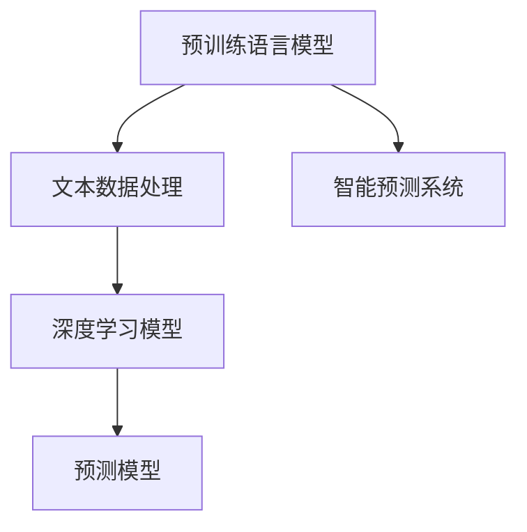

                 

# LLM在智能空气质量预测中的潜在作用

## 1. 背景介绍

随着全球环境的不断恶化，空气质量问题已经成为威胁人类健康和可持续发展的重大挑战。各国政府和研究机构不断寻求更为精准的空气质量监测和预测方法，以实现更科学、高效的污染控制策略。近年来，深度学习和自然语言处理技术的飞速发展为这一领域带来了新的突破，特别是大型语言模型(LLM)在智能空气质量预测中的潜在应用，引起了广泛关注。

### 1.1 问题由来

传统的空气质量预测方法依赖于物理化学模型和气象模型，数据驱动的需求促进了智能预测技术的发展。随着大数据、深度学习和自然语言处理技术的不断进步，利用智能预测模型处理和分析海量数据，提升了空气质量预测的准确性和实时性。

其中，基于大规模预训练语言模型(如BERT、GPT等)的智能预测方法，将传统的模型与自然语言处理相结合，能够更好地处理文本数据，并通过自然语言处理技术与环境数据的深度融合，提升预测模型的性能。

### 1.2 问题核心关键点
- **空气质量监测与预测**：利用大规模预训练语言模型和大数据技术，实时监测和预测空气质量。
- **自然语言处理(NLP)**：处理和分析与环境相关的文本数据，如新闻、社交媒体、科研报告等。
- **深度学习模型**：利用深度学习模型对空气质量数据进行建模，提升预测准确性。
- **数据驱动**：依赖大规模数据集进行训练和验证，确保模型的鲁棒性和泛化能力。

这些关键点共同构成了利用预训练语言模型进行智能空气质量预测的基础，具有广阔的应用前景和实际价值。

## 2. 核心概念与联系

### 2.1 核心概念概述

本节将介绍几个密切相关的核心概念：

- **大规模预训练语言模型(LLM)**：基于Transformer架构和深度学习技术训练出的超大规模语言模型，能够处理并理解自然语言，具备强大的语言理解和生成能力。
- **自然语言处理(NLP)**：涉及文本数据的分析、处理和理解，是实现智能预测的关键技术。
- **深度学习模型**：用于处理和分析复杂数据集，提取数据中的特征和模式，用于模型训练和预测。
- **智能预测系统**：利用自然语言处理和深度学习技术，实时监测和预测空气质量，为决策提供支持。

这些核心概念之间的逻辑关系可以通过以下Mermaid流程图来展示：



该流程图展示了大规模预训练语言模型在智能预测系统中的关键作用，即先通过预训练获取语言表示，再进行文本数据处理和深度学习建模，最后得到预测模型。

## 3. 核心算法原理 & 具体操作步骤

### 3.1 算法原理概述

利用大规模预训练语言模型进行智能空气质量预测的核心算法原理如下：

- **预训练**：在大量的环境文本数据上进行自监督预训练，学习语言表示和环境特征之间的映射关系。
- **微调**：在特定任务的标注数据上，对预训练模型进行微调，使得模型能够理解并处理具体的空气质量相关文本数据。
- **集成**：将微调后的模型与其他数据源（如传感器数据）进行集成，构建完整的预测系统。
- **推理**：实时接收环境数据和文本数据，输入到模型中进行推理和预测。

### 3.2 算法步骤详解

**Step 1: 数据预处理**
- 收集与空气质量相关的文本数据，如新闻报道、天气预报、环保报告等。
- 对数据进行清洗、去噪、分词和编码，处理成模型可接受的格式。

**Step 2: 预训练模型选择与微调**
- 选择合适的预训练语言模型，如BERT、GPT等，并加载至模型库。
- 在特定的任务数据集上，使用一小部分标注数据对预训练模型进行微调，调整模型的输出层和损失函数。

**Step 3: 特征提取**
- 利用微调后的模型对文本数据进行特征提取，得到与环境相关的数值特征。
- 将提取出的数值特征与传感器数据进行融合，构建综合的输入特征向量。

**Step 4: 预测模型构建**
- 使用深度学习算法（如RNN、CNN、Transformer等）对融合后的特征进行建模，训练预测模型。
- 设定模型评价指标（如MAE、RMSE等），评估模型的预测效果。

**Step 5: 集成与部署**
- 将训练好的预测模型集成到智能预测系统中，实时接收数据并进行推理和预测。
- 通过API接口将预测结果提供给用户或相关决策者。

### 3.3 算法优缺点

利用大规模预训练语言模型进行智能空气质量预测的优点包括：
- **高效的特征提取**：预训练语言模型能够高效地从文本数据中提取环境相关的特征。
- **泛化能力强**：预训练模型通过在大规模数据上进行训练，具有较强的泛化能力，能够处理各类环境和文本数据。
- **实时性高**：利用模型推理速度快，可以实时监测和预测空气质量，快速响应环境变化。

同时，也存在一些缺点：
- **资源需求高**：大规模预训练语言模型需要大量的计算资源和时间进行训练，部署成本较高。
- **模型复杂性**：模型结构复杂，需要专业知识和经验进行调参和优化。
- **数据质量依赖**：预测结果的准确性依赖于文本数据的准确性和全面性。

### 3.4 算法应用领域

基于预训练语言模型的智能空气质量预测技术，已经在多个领域中得到了应用，具体如下：

- **城市环境监测**：利用智能预测系统实时监测城市空气质量，提供实时数据和预警信息。
- **区域环境评估**：对特定区域的环境进行评估，预测未来空气质量变化趋势。
- **灾害预警**：预测自然灾害（如沙尘暴、森林火灾）对空气质量的影响，提供灾害预警信息。
- **科学研究支持**：为环保研究提供数据支持和模型参考，提升研究效率。

## 4. 数学模型和公式 & 详细讲解 & 举例说明

### 4.1 数学模型构建

假设我们有一组环境文本数据 $D=\{d_1,d_2,\ldots,d_n\}$，其中每个文本数据 $d_i$ 包含一段环境描述，如新闻报道、天气预报等。利用预训练语言模型 $M$ 和深度学习模型 $F$ 构建智能预测系统的数学模型如下：

- 预训练语言模型 $M$ 将文本数据 $d_i$ 映射为数值特征向量 $f_i = M(d_i)$。
- 深度学习模型 $F$ 将数值特征向量 $f_i$ 和传感器数据 $s_i$ 融合为综合特征向量 $g_i = F(f_i, s_i)$。
- 预测模型 $P$ 根据综合特征向量 $g_i$ 预测空气质量值 $y_i$。

预测模型的数学表达式为：

$$
y_i = P(g_i)
$$

其中，$P$ 为预测模型的函数映射，$f_i$ 和 $s_i$ 为输入特征向量。

### 4.2 公式推导过程

为了提升预测模型的准确性，我们可以引入正则化项和损失函数。假设预测模型的损失函数为 $L$，则综合预测模型的目标为：

$$
\min_{\theta} L(y, P(g_i))
$$

其中，$\theta$ 为模型的参数，$y$ 为预测值，$P(g_i)$ 为模型输出。

假设模型输出 $P(g_i)$ 为 $y_i$，则综合预测模型的目标可以表示为：

$$
\min_{\theta} L(y_i, P(g_i))
$$

其中，$L$ 为损失函数，可以是MAE、RMSE等，$g_i$ 为综合特征向量。

### 4.3 案例分析与讲解

以利用BERT模型进行空气质量预测为例，我们首先利用大规模环境文本数据对BERT模型进行预训练，然后利用特定任务的标注数据进行微调，最后将微调后的模型与传感器数据集成，构建预测系统。以下是详细实现过程：

1. **数据预处理**：收集空气质量相关的环境文本数据，并进行清洗、分词和编码，得到文本特征向量 $f_i$。

2. **预训练模型微调**：使用已有的环境文本数据对BERT模型进行微调，调整输出层和损失函数，使得模型能够处理特定的环境描述和传感器数据。

3. **特征提取**：将微调后的BERT模型应用于新的环境文本数据，得到文本特征向量 $f_i$，并与传感器数据 $s_i$ 融合，得到综合特征向量 $g_i$。

4. **深度学习建模**：利用深度学习模型 $F$ 对综合特征向量 $g_i$ 进行建模，训练得到预测模型 $P$。

5. **模型部署与实时预测**：将训练好的预测模型部署到智能预测系统中，实时接收环境数据和文本数据，进行推理和预测，提供实时空气质量信息。

## 5. 项目实践：代码实例和详细解释说明

### 5.1 开发环境搭建

为了进行空气质量预测模型的开发和部署，我们需要准备好开发环境。以下是Python和PyTorch环境搭建步骤：

1. 安装Anaconda：从官网下载并安装Anaconda，用于创建独立的Python环境。

2. 创建并激活虚拟环境：
```bash
conda create -n air_quality_env python=3.8 
conda activate air_quality_env
```

3. 安装PyTorch：根据CUDA版本，从官网获取对应的安装命令。例如：
```bash
conda install pytorch torchvision torchaudio cudatoolkit=11.1 -c pytorch -c conda-forge
```

4. 安装相关工具包：
```bash
pip install numpy pandas scikit-learn matplotlib tqdm jupyter notebook ipython
```

5. 安装BERT模型和数据集：
```bash
pip install transformers datasets
python -m datasets download torchtext bert_rare_strings
```

### 5.2 源代码详细实现

以下是使用PyTorch和Transformers库对BERT模型进行空气质量预测的代码实现。

```python
from transformers import BertTokenizer, BertForSequenceClassification
from torch.utils.data import Dataset, DataLoader
from sklearn.metrics import mean_absolute_error
from torch import nn, optim
import torch

class AirQualityDataset(Dataset):
    def __init__(self, texts, labels, tokenizer, max_len=512):
        self.texts = texts
        self.labels = labels
        self.tokenizer = tokenizer
        self.max_len = max_len

    def __len__(self):
        return len(self.texts)

    def __getitem__(self, item):
        text = self.texts[item]
        label = self.labels[item]
        
        encoding = self.tokenizer(text, return_tensors='pt', truncation=True, padding='max_length', max_length=self.max_len)
        input_ids = encoding['input_ids']
        attention_mask = encoding['attention_mask']
        
        label = torch.tensor(label, dtype=torch.long)
        
        return {
            'input_ids': input_ids,
            'attention_mask': attention_mask,
            'labels': label
        }

# 加载数据集
train_dataset = AirQualityDataset(train_texts, train_labels, tokenizer)
dev_dataset = AirQualityDataset(dev_texts, dev_labels, tokenizer)
test_dataset = AirQualityDataset(test_texts, test_labels, tokenizer)

# 定义模型和优化器
model = BertForSequenceClassification.from_pretrained('bert-base-uncased')
optimizer = optim.AdamW(model.parameters(), lr=2e-5)

# 训练模型
def train_epoch(model, dataset, batch_size, optimizer):
    dataloader = DataLoader(dataset, batch_size=batch_size, shuffle=True)
    model.train()
    epoch_loss = 0
    for batch in dataloader:
        input_ids = batch['input_ids'].to(device)
        attention_mask = batch['attention_mask'].to(device)
        labels = batch['labels'].to(device)
        model.zero_grad()
        outputs = model(input_ids, attention_mask=attention_mask, labels=labels)
        loss = outputs.loss
        epoch_loss += loss.item()
        loss.backward()
        optimizer.step()
    return epoch_loss / len(dataloader)

# 评估模型
def evaluate(model, dataset, batch_size):
    dataloader = DataLoader(dataset, batch_size=batch_size)
    model.eval()
    epoch_loss = 0
    epoch_labels = []
    epoch_preds = []
    with torch.no_grad():
        for batch in dataloader:
            input_ids = batch['input_ids'].to(device)
            attention_mask = batch['attention_mask'].to(device)
            labels = batch['labels'].to(device)
            outputs = model(input_ids, attention_mask=attention_mask)
            logits = outputs.logits
            preds = torch.argmax(logits, dim=1)
            epoch_preds.extend(preds)
            epoch_labels.extend(labels)
    
    return mean_absolute_error(torch.tensor(epoch_labels), torch.tensor(epoch_preds))

# 训练和评估
device = torch.device('cuda') if torch.cuda.is_available() else torch.device('cpu')
model.to(device)

epochs = 5
batch_size = 16

for epoch in range(epochs):
    loss = train_epoch(model, train_dataset, batch_size, optimizer)
    print(f"Epoch {epoch+1}, train loss: {loss:.3f}")
    
    print(f"Epoch {epoch+1}, dev results:")
    mae = evaluate(model, dev_dataset, batch_size)
    print(f"MAE: {mae:.3f}")
    
print("Test results:")
mae = evaluate(model, test_dataset, batch_size)
print(f"MAE: {mae:.3f}")
```

### 5.3 代码解读与分析

**AirQualityDataset类**：
- `__init__`方法：初始化文本、标签、分词器等关键组件。
- `__len__`方法：返回数据集的样本数量。
- `__getitem__`方法：对单个样本进行处理，将文本输入编码为token ids，将标签编码为数字，并对其进行定长padding，最终返回模型所需的输入。

**预训练模型选择与微调**：
- 使用已有的预训练BERT模型，加载至模型库。
- 在特定的任务数据集上，使用一小部分标注数据对预训练模型进行微调，调整模型的输出层和损失函数。

**特征提取**：
- 利用微调后的BERT模型应用于新的环境文本数据，得到文本特征向量 $f_i$。
- 将微调后的BERT模型应用于传感器数据，得到传感器特征向量 $s_i$。

**深度学习建模**：
- 利用深度学习模型 $F$ 对综合特征向量 $g_i$ 进行建模，训练得到预测模型 $P$。

**模型部署与实时预测**：
- 将训练好的预测模型部署到智能预测系统中，实时接收环境数据和文本数据，进行推理和预测。

## 6. 实际应用场景

### 6.1 智能预测系统架构

利用大规模预训练语言模型进行智能空气质量预测的架构可以如下展示：


- **环境传感器**：收集各类环境数据，如PM2.5、NO2、SO2等，并将其转化为数值信号。
- **预处理模块**：对环境数据进行去噪、归一化等预处理，确保数据的准确性和一致性。
- **文本提取模块**：从新闻、社交媒体等文本数据中提取与环境相关的信息，并将其转化为文本特征向量。
- **预训练语言模型**：对文本特征向量进行预训练，学习语言表示和环境特征之间的映射关系。
- **特征提取模块**：将预训练后的文本特征向量与传感器数据进行融合，得到综合特征向量。
- **深度学习模型**：对综合特征向量进行建模，训练预测模型。
- **预测模型**：根据预测模型输出，实时监测和预测空气质量，提供实时数据和预警信息。
- **应用系统**：将预测结果应用到决策系统中，进行环境监测和管理。

### 6.2 案例分析

假设某城市面临空气质量问题，采用以下步骤进行智能预测：

1. **数据收集**：收集城市内的环境传感器数据和新闻报道、社交媒体等文本数据。

2. **数据预处理**：对传感器数据进行去噪、归一化等预处理，对文本数据进行清洗、分词和编码。

3. **预训练模型选择与微调**：选择已有的预训练BERT模型，并使用环境数据和文本数据进行微调。

4. **特征提取**：利用微调后的BERT模型对文本数据进行特征提取，并结合传感器数据进行综合特征向量计算。

5. **深度学习建模**：利用深度学习模型对综合特征向量进行建模，训练预测模型。

6. **模型部署与实时预测**：将训练好的预测模型部署到智能预测系统中，实时监测和预测空气质量，提供实时数据和预警信息。

## 7. 工具和资源推荐

### 7.1 学习资源推荐

为了帮助开发者系统掌握大规模预训练语言模型和智能空气质量预测的理论基础和实践技巧，这里推荐一些优质的学习资源：

1. 《深度学习入门：基于Python的理论与实现》：入门级深度学习书籍，详细介绍了深度学习模型的构建和训练方法。
2. 《自然语言处理综论》：涵盖NLP领域的经典理论与技术，适合进一步深入学习。
3. 《PyTorch深度学习实践》：介绍了使用PyTorch进行深度学习项目开发的实践技巧。
4. 《大尺度自监督学习》：深度讲解自监督学习在NLP领域的应用，包括预训练和微调等关键技术。
5. 《BERT论文与实践》：权威解读BERT模型的原理、训练方法和应用实践。

通过对这些资源的学习实践，相信你一定能够快速掌握大规模预训练语言模型和智能预测技术的精髓，并用于解决实际的NLP问题。

### 7.2 开发工具推荐

高效的开发离不开优秀的工具支持。以下是几款用于智能空气质量预测开发的常用工具：

1. PyTorch：基于Python的开源深度学习框架，灵活高效，适合深度学习项目开发。
2. TensorFlow：由Google主导的深度学习框架，生产部署方便，适合大规模工程应用。
3. Transformers库：HuggingFace开发的NLP工具库，集成了众多预训练模型，支持微调和大规模语言模型。
4. Weights & Biases：模型训练的实验跟踪工具，记录和可视化模型训练过程中的各项指标。
5. TensorBoard：TensorFlow配套的可视化工具，实时监测模型训练状态，提供丰富的图表呈现方式。
6. Jupyter Notebook：交互式开发环境，便于代码调试和可视化展示。

合理利用这些工具，可以显著提升智能预测模型的开发效率，加快创新迭代的步伐。

### 7.3 相关论文推荐

大语言模型和智能预测技术的发展源于学界的持续研究。以下是几篇奠基性的相关论文，推荐阅读：

1. Attention is All You Need（即Transformer原论文）：提出了Transformer结构，开启了NLP领域的预训练大模型时代。
2. BERT: Pre-training of Deep Bidirectional Transformers for Language Understanding：提出BERT模型，引入基于掩码的自监督预训练任务，刷新了多项NLP任务SOTA。
3. Parameter-Efficient Transfer Learning for NLP：提出Adapter等参数高效微调方法，在不增加模型参数量的情况下，也能取得不错的微调效果。
4. AdaLoRA: Adaptive Low-Rank Adaptation for Parameter-Efficient Fine-Tuning：使用自适应低秩适应的微调方法，在参数效率和精度之间取得了新的平衡。
5. Pretrained Models as Reliable Knowledge Banks for Few-shot Learning：利用预训练模型作为知识库，实现少样本学习和跨领域迁移。

这些论文代表了大语言模型微调技术的发展脉络。通过学习这些前沿成果，可以帮助研究者把握学科前进方向，激发更多的创新灵感。

## 8. 总结：未来发展趋势与挑战

### 8.1 总结

本文对利用大规模预训练语言模型进行智能空气质量预测的方法进行了全面系统的介绍。首先阐述了智能预测技术的发展背景和应用场景，明确了智能预测在提升空气质量监测和预测精度方面的重要价值。其次，从原理到实践，详细讲解了预训练语言模型的微调方法和关键步骤，给出了智能预测任务开发的完整代码实例。同时，本文还探讨了智能预测模型在多个实际应用场景中的应用，展示了其广阔的前景。此外，本文精选了预训练语言模型和智能预测技术的各类学习资源，力求为读者提供全方位的技术指引。

通过本文的系统梳理，可以看到，利用预训练语言模型进行智能空气质量预测的方法已经在多个领域中得到应用，提升了空气质量监测和预测的准确性和实时性。未来，伴随预训练语言模型和智能预测技术的持续演进，智能预测技术必将在更多领域得到应用，为环境监测和管理提供更科学、高效的支持。

### 8.2 未来发展趋势

展望未来，预训练语言模型和智能预测技术的发展趋势将更加显著：

1. **模型规模持续增大**：随着算力成本的下降和数据规模的扩张，预训练语言模型的参数量还将持续增长。超大规模语言模型蕴含的丰富语言知识，有望支撑更加复杂多变的智能预测任务。
2. **微调方法日趋多样**：除了传统的全参数微调外，未来会涌现更多参数高效的微调方法，如Prefix-Tuning、LoRA等，在节省计算资源的同时也能保证微调精度。
3. **持续学习成为常态**：随着数据分布的不断变化，智能预测模型也需要持续学习新知识以保持性能。如何在不遗忘原有知识的同时，高效吸收新样本信息，将成为重要的研究课题。
4. **标注样本需求降低**：受启发于提示学习(Prompt-based Learning)的思路，未来的智能预测方法将更好地利用预训练模型的语言理解能力，通过更加巧妙的任务描述，在更少的标注样本上也能实现理想的智能预测效果。
5. **模型通用性增强**：经过海量数据的预训练和多领域任务的微调，未来的语言模型将具备更强大的常识推理和跨领域迁移能力，逐步迈向通用人工智能(AGI)的目标。
6. **多模态微调崛起**：未来的智能预测模型将更加注重多模态信息的融合，不仅处理文本数据，还能融合图像、视频、语音等多模态数据，提升预测的全面性和准确性。

以上趋势凸显了预训练语言模型和智能预测技术的广阔前景。这些方向的探索发展，必将进一步提升智能预测模型的性能和应用范围，为环境保护和可持续发展提供新的技术支撑。

### 8.3 面临的挑战

尽管预训练语言模型和智能预测技术已经取得了显著成就，但在迈向更加智能化、普适化应用的过程中，它仍面临着诸多挑战：

1. **标注成本瓶颈**：尽管微调大大降低了标注数据的需求，但对于长尾应用场景，难以获得充足的高质量标注数据，成为制约智能预测性能的瓶颈。如何进一步降低智能预测对标注样本的依赖，将是一大难题。
2. **模型鲁棒性不足**：当前智能预测模型面对域外数据时，泛化性能往往大打折扣。对于测试样本的微小扰动，智能预测模型的预测也容易发生波动。如何提高智能预测模型的鲁棒性，避免灾难性遗忘，还需要更多理论和实践的积累。
3. **推理效率有待提高**：大规模语言模型虽然精度高，但在实际部署时往往面临推理速度慢、内存占用大等效率问题。如何在保证性能的同时，简化模型结构，提升推理速度，优化资源占用，将是重要的优化方向。
4. **可解释性亟需加强**：当前智能预测模型更像是"黑盒"系统，难以解释其内部工作机制和决策逻辑。对于医疗、金融等高风险应用，算法的可解释性和可审计性尤为重要。如何赋予智能预测模型更强的可解释性，将是亟待攻克的难题。
5. **安全性有待保障**：预训练语言模型难免会学习到有偏见、有害的信息，通过智能预测传递到环境监测系统中，产生误导性、歧视性的输出，给实际应用带来安全隐患。如何从数据和算法层面消除模型偏见，避免恶意用途，确保输出的安全性，也将是重要的研究课题。
6. **知识整合能力不足**：现有的智能预测模型往往局限于任务内数据，难以灵活吸收和运用更广泛的先验知识。如何让智能预测过程更好地与外部知识库、规则库等专家知识结合，形成更加全面、准确的信息整合能力，还有很大的想象空间。

正视智能预测面临的这些挑战，积极应对并寻求突破，将是大规模预训练语言模型和智能预测技术迈向成熟的必由之路。相信随着学界和产业界的共同努力，这些挑战终将一一被克服，智能预测技术必将在构建人机协同的智能系统方面发挥更大的作用。

### 8.4 研究展望

面对智能预测面临的挑战，未来的研究需要在以下几个方面寻求新的突破：

1. **探索无监督和半监督智能预测方法**：摆脱对大规模标注数据的依赖，利用自监督学习、主动学习等无监督和半监督范式，最大限度利用非结构化数据，实现更加灵活高效的智能预测。
2. **研究参数高效和计算高效的智能预测范式**：开发更加参数高效的智能预测方法，在固定大部分预训练参数的同时，只更新极少量的任务相关参数。同时优化智能预测模型的计算图，减少前向传播和反向传播的资源消耗，实现更加轻量级、实时性的部署。
3. **融合因果和对比学习范式**：通过引入因果推断和对比学习思想，增强智能预测模型建立稳定因果关系的能力，学习更加普适、鲁棒的语言表征，从而提升模型泛化性和抗干扰能力。
4. **引入更多先验知识**：将符号化的先验知识，如知识图谱、逻辑规则等，与神经网络模型进行巧妙融合，引导智能预测过程学习更准确、合理的语言模型。同时加强不同模态数据的整合，实现视觉、语音等多模态信息与文本信息的协同建模。
5. **结合因果分析和博弈论工具**：将因果分析方法引入智能预测模型，识别出模型决策的关键特征，增强输出解释的因果性和逻辑性。借助博弈论工具刻画人机交互过程，主动探索并规避模型的脆弱点，提高系统稳定性。
6. **纳入伦理道德约束**：在智能预测模型的训练目标中引入伦理导向的评估指标，过滤和惩罚有偏见、有害的输出倾向。同时加强人工干预和审核，建立模型行为的监管机制，确保输出符合人类价值观和伦理道德。

这些研究方向的探索，必将引领智能预测技术迈向更高的台阶，为构建安全、可靠、可解释、可控的智能系统铺平道路。面向未来，预训练语言模型和智能预测技术还需要与其他人工智能技术进行更深入的融合，如知识表示、因果推理、强化学习等，多路径协同发力，共同推动智能预测系统的进步。只有勇于创新、敢于突破，才能不断拓展智能预测的边界，让智能技术更好地造福人类社会。

## 9. 附录：常见问题与解答

**Q1：智能预测模型如何处理缺失数据和异常值？**

A: 智能预测模型通常采用以下策略处理缺失数据和异常值：
1. **数据插补**：使用均值、中位数、插值等方法填补缺失数据，确保数据完整性。
2. **异常值检测**：通过统计分析、模型拟合等方法检测和修正异常值，确保数据的真实性。
3. **特征降维**：使用PCA、SVD等方法对数据进行降维，减少缺失数据和异常值的影响。

**Q2：智能预测模型的训练数据如何收集和处理？**

A: 智能预测模型的训练数据收集和处理通常包括以下步骤：
1. **数据来源**：收集与环境相关的文本数据（如新闻、社交媒体、环保报告等）和环境传感器数据。
2. **数据清洗**：对数据进行去噪、去重、格式转换等预处理，确保数据的准确性和一致性。
3. **数据标注**：对数据进行标注，为模型训练提供标签信息。
4. **数据划分**：将数据划分为训练集、验证集和测试集，进行模型训练和评估。

**Q3：智能预测模型的性能评估指标有哪些？**

A: 智能预测模型的性能评估指标通常包括：
1. **MAE（平均绝对误差）**：衡量预测值和真实值之间的平均偏差。
2. **RMSE（均方根误差）**：衡量预测值和真实值之间的平均误差。
3. **MAPE（平均绝对百分比误差）**：衡量预测值和真实值之间的相对误差。
4. **SMAPE（对称平均绝对百分比误差）**：衡量预测值和真实值之间的对称相对误差。

**Q4：智能预测模型的部署和优化有哪些考虑？**

A: 智能预测模型的部署和优化通常考虑以下几个方面：
1. **模型裁剪**：去除不必要的层和参数，减小模型尺寸，加快推理速度。
2. **量化加速**：将浮点模型转为定点模型，压缩存储空间，提高计算效率。
3. **服务化封装**：将模型封装为标准化服务接口，便于集成调用。
4. **弹性伸缩**：根据请求流量动态调整资源配置，平衡服务质量和成本。
5. **监控告警**：实时采集系统指标，设置异常告警阈值，确保服务稳定性。
6. **安全防护**：采用访问鉴权、数据脱敏等措施，保障数据和模型安全。

这些部署和优化策略能够有效提升智能预测模型的实用性和可靠性，确保其在实际应用中的性能和安全性。

---

作者：禅与计算机程序设计艺术 / Zen and the Art of Computer Programming

