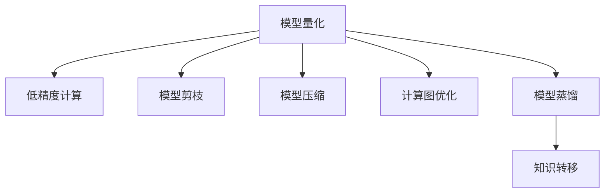

                 

# LLM推理优化II：模型量化技术探讨

## 1. 背景介绍

### 1.1 问题由来
大语言模型（Large Language Models, LLMs）在推理优化和模型压缩领域，尤其是在模型量化技术方面，面临诸多挑战。传统的大模型往往参数量庞大，需要高计算资源和内存，且在移动端等资源受限的设备上难以高效部署。模型量化技术通过减少模型的计算精度和参数数量，以更小的计算和空间成本实现高性能推理。本博客将以模型量化技术为核心，探讨其在LML推理优化中的应用。

### 1.2 问题核心关键点
- 模型量化（Model Quantization）：通过降低模型的计算精度，减少模型参数数量，从而减小模型大小和计算成本，提升推理效率。
- 低精度计算（Low-precision Computing）：使用浮点数精度较低的数据类型（如8位、16位）进行计算，提高推理速度和设备利用率。
- 模型剪枝（Model Pruning）：通过去除冗余参数和结构，优化模型架构，减少模型大小和计算复杂度。
- 模型压缩（Model Compression）：通过量化、剪枝、蒸馏等方法，将大模型压缩为更小的模型，实现高效推理。
- 计算图优化（Computation Graph Optimization）：通过优化模型的计算图结构，减少冗余操作和内存占用，提升推理速度。
- 模型蒸馏（Knowledge Distillation）：通过教师模型和学生模型之间的知识转移，构建更小的学生模型，保持模型精度和性能。

## 2. 核心概念与联系

### 2.1 核心概念概述

为更好地理解模型量化技术，本节将介绍几个密切相关的核心概念：

- 模型量化（Model Quantization）：指将高精度模型转换为低精度模型，以减少计算资源和存储空间。常用的低精度类型有8位整数、16位整数、浮点数等。
- 低精度计算（Low-precision Computing）：指在模型中使用低精度数据类型进行计算，以提高计算效率和设备利用率。低精度计算常用于推理加速和硬件优化。
- 模型剪枝（Model Pruning）：指通过移除冗余的神经元或连接，减小模型参数和计算复杂度，从而降低推理成本。
- 模型压缩（Model Compression）：指在保证模型性能的前提下，通过量化、剪枝、蒸馏等方法，减少模型大小和计算资源需求。
- 计算图优化（Computation Graph Optimization）：指通过对模型计算图结构的优化，减少冗余操作，提升推理效率和设备利用率。
- 模型蒸馏（Knowledge Distillation）：指通过教师模型和学生模型之间的知识转移，构建更小、更快的学生模型，同时保持较高的准确性。

这些概念之间的逻辑关系可以通过以下Mermaid流程图来展示：



这个流程图展示了大语言模型量化技术的关键概念及其之间的关系：

1. 大语言模型通过量化技术，将高精度模型转换为低精度模型，减少计算和空间成本。
2. 低精度计算通过使用低精度数据类型，提高推理速度和设备利用率。
3. 模型剪枝通过移除冗余参数和结构，进一步优化模型大小和推理速度。
4. 模型压缩通过多种方法将大模型压缩为更小的模型，实现高效的推理部署。
5. 计算图优化通过优化模型计算图结构，进一步提升推理效率和硬件利用率。
6. 模型蒸馏通过知识转移，构建更小、更快的学生模型，保持模型精度和性能。

这些概念共同构成了大语言模型推理优化和模型压缩的框架，使其能够高效地在小规模设备和低计算资源环境中进行推理。

## 3. 核心算法原理 & 具体操作步骤

### 3.1 算法原理概述

大语言模型的推理优化，主要通过模型量化、低精度计算、模型剪枝、模型压缩等方法实现。其核心思想是：

1. **模型量化**：将模型的计算精度从32位浮点数降低到8位或16位整数，减小模型参数和计算资源需求，同时保持推理性能。
2. **低精度计算**：在推理过程中使用低精度数据类型进行计算，提高推理速度和设备利用率。
3. **模型剪枝**：去除冗余神经元和连接，减小模型大小和计算复杂度。
4. **模型压缩**：通过量化、剪枝、蒸馏等方法，将大模型压缩为更小的模型，实现高效的推理部署。
5. **计算图优化**：优化模型的计算图结构，减少冗余操作和内存占用，提升推理速度。
6. **模型蒸馏**：通过教师模型和学生模型之间的知识转移，构建更小、更快的学生模型，保持模型精度和性能。

### 3.2 算法步骤详解

基于上述核心思想，大语言模型推理优化的具体操作步骤包括：

**Step 1: 准备预训练模型**
- 选择合适的预训练语言模型 $M_{\theta}$，如BERT、GPT等。
- 对预训练模型进行量化，减小模型参数和计算资源需求。

**Step 2: 低精度计算**
- 选择合适的低精度计算类型，如8位整数、16位整数、浮点数等。
- 将模型输入和输出转换为低精度数据类型，优化推理速度。

**Step 3: 模型剪枝**
- 分析模型的神经元连接，确定冗余神经元和连接。
- 移除冗余神经元和连接，优化模型大小和推理速度。

**Step 4: 模型压缩**
- 使用量化、剪枝、蒸馏等方法，将大模型压缩为更小的模型。
- 通过知识蒸馏，将教师模型的知识转移到学生模型。

**Step 5: 计算图优化**
- 分析模型的计算图结构，确定冗余操作和节点。
- 优化计算图结构，减少冗余操作和内存占用。

**Step 6: 模型评估与调优**
- 在评估数据集上评估模型性能。
- 根据评估结果，调整量化、剪枝、压缩等策略，进一步优化模型。

### 3.3 算法优缺点

模型量化技术具有以下优点：
1. 减少模型参数和计算资源需求，降低推理成本。
2. 提高推理速度和设备利用率，提升计算效率。
3. 增强模型的移动性和兼容性，便于在资源受限的设备上部署。
4. 保持模型性能，降低推理误差。

同时，该技术也存在一定的局限性：
1. 量化过程可能导致推理精度下降，影响模型性能。
2. 低精度计算可能引入误差，影响模型稳定性。
3. 模型剪枝可能破坏模型结构，影响模型效果。
4. 压缩过程可能丢失模型知识，影响模型精度。
5. 计算图优化可能增加编译时间和复杂度。
6. 模型蒸馏可能增加模型复杂度，影响推理速度。

尽管存在这些局限性，但就目前而言，模型量化技术仍是大语言模型推理优化的主流范式。未来相关研究的重点在于如何进一步降低量化对推理精度的影响，提高模型的稳定性和精度。

### 3.4 算法应用领域

模型量化技术在以下几个领域有着广泛的应用：

- **移动端应用**：通过量化和低精度计算，降低模型大小和计算资源需求，实现高效推理。
- **嵌入式设备**：通过量化和剪枝，优化模型结构和推理速度，在资源受限的设备上部署。
- **云计算平台**：通过量化和压缩，减小模型大小和计算资源需求，提升云平台资源的利用率。
- **边缘计算**：通过量化和计算图优化，降低模型推理成本，在边缘设备上实现实时推理。

此外，模型量化技术还被创新性地应用于多模态数据融合、实时推理系统等前沿领域，为人工智能技术的发展带来了新的突破。

## 4. 数学模型和公式 & 详细讲解 & 举例说明

### 4.1 数学模型构建

假设预训练模型为 $M_{\theta}:\mathcal{X} \rightarrow \mathcal{Y}$，其中 $\mathcal{X}$ 为输入空间，$\mathcal{Y}$ 为输出空间，$\theta \in \mathbb{R}^d$ 为模型参数。

**模型量化**：
将模型参数 $\theta$ 从32位浮点数转换为低精度数据类型 $Q(\theta)$，其中 $Q$ 为量化函数。

**低精度计算**：
在推理过程中，将模型输入 $x$ 和输出 $y$ 转换为低精度数据类型 $Q(x)$ 和 $Q(y)$，其中 $Q$ 为量化函数。

**模型剪枝**：
剪枝操作基于神经元的重要性评分 $s_i$，删除重要性评分低于阈值 $\alpha$ 的神经元，得到剪枝后的模型 $M_{\hat{\theta}}$，其中 $\hat{\theta}$ 为剪枝后的模型参数。

**模型压缩**：
使用量化、剪枝、蒸馏等方法，将大模型压缩为更小的模型 $M_{\hat{\theta}}$，其中 $\hat{\theta}$ 为压缩后的模型参数。

**计算图优化**：
优化计算图结构，减少冗余操作和内存占用，得到优化后的计算图 $\mathcal{G}_{opt}$。

### 4.2 公式推导过程

以下是模型量化、低精度计算、模型剪枝、模型压缩等技术的详细数学推导过程。

**模型量化**：
将模型参数 $\theta$ 从32位浮点数转换为低精度数据类型 $Q(\theta)$，其中 $Q$ 为量化函数。

假设量化函数 $Q$ 为离散化函数，将 $\theta$ 映射到整数区间 $[0, 2^k-1]$，其中 $k$ 为量化精度。

$$
Q(\theta) = \text{clip}\left(\frac{\theta}{\beta}, 0, 2^k-1\right)
$$

其中 $\beta$ 为缩放因子，用于保持量化前后模型输出的稳定性。

**低精度计算**：
在推理过程中，将模型输入 $x$ 和输出 $y$ 转换为低精度数据类型 $Q(x)$ 和 $Q(y)$，其中 $Q$ 为量化函数。

假设输入 $x$ 和输出 $y$ 的动态范围分别为 $[x_{min}, x_{max}]$ 和 $[y_{min}, y_{max}]$，将其映射到低精度区间 $[0, 2^k-1]$。

$$
Q(x) = \text{clip}\left(\frac{x}{\beta}, 0, 2^k-1\right)
$$
$$
Q(y) = \text{clip}\left(\frac{y}{\beta}, 0, 2^k-1\right)
$$

**模型剪枝**：
剪枝操作基于神经元的重要性评分 $s_i$，删除重要性评分低于阈值 $\alpha$ 的神经元，得到剪枝后的模型 $M_{\hat{\theta}}$，其中 $\hat{\theta}$ 为剪枝后的模型参数。

假设神经元 $i$ 的重要性评分为 $s_i$，剪枝阈值为 $\alpha$，剪枝后的模型参数为 $\hat{\theta}$。

$$
\hat{\theta} = \left\{ \theta_j \mid s_j \geq \alpha \right\}
$$

**模型压缩**：
使用量化、剪枝、蒸馏等方法，将大模型压缩为更小的模型 $M_{\hat{\theta}}$，其中 $\hat{\theta}$ 为压缩后的模型参数。

假设使用知识蒸馏方法，教师模型为 $M_{\theta}$，学生模型为 $M_{\hat{\theta}}$，知识蒸馏损失为 $\mathcal{L}_{kd}$。

$$
\mathcal{L}_{kd} = \mathbb{E}_{(x, y)} [\text{KL}(M_{\theta}(x), M_{\hat{\theta}}(x))]
$$

其中 $\text{KL}$ 为KL散度损失函数，$(x, y)$ 为训练数据集。

### 4.3 案例分析与讲解

以BERT模型为例，展示模型量化和剪枝技术的实际应用。

**BERT模型量化**：
使用离散化量化函数将BERT模型参数转换为8位整数。

假设BERT模型参数数量为 $d$，量化精度为8位，则量化后的模型参数数量为 $d/8$。

**BERT模型剪枝**：
剪枝操作基于神经元的重要性评分 $s_i$，删除重要性评分低于阈值 $\alpha$ 的神经元，得到剪枝后的BERT模型 $M_{\hat{\theta}}$。

假设BERT模型共有 $n$ 个神经元，剪枝阈值为 $\alpha$，剪枝后的模型参数为 $\hat{\theta}$。

**模型压缩**：
通过量化、剪枝、蒸馏等方法，将大模型压缩为更小的模型 $M_{\hat{\theta}}$。

假设使用知识蒸馏方法，教师模型为 $M_{\theta}$，学生模型为 $M_{\hat{\theta}}$，知识蒸馏损失为 $\mathcal{L}_{kd}$。

## 5. 项目实践：代码实例和详细解释说明

### 5.1 开发环境搭建

在进行模型量化实践前，我们需要准备好开发环境。以下是使用Python进行TensorFlow开发的环境配置流程：

1. 安装Anaconda：从官网下载并安装Anaconda，用于创建独立的Python环境。

2. 创建并激活虚拟环境：
```bash
conda create -n tf-env python=3.8 
conda activate tf-env
```

3. 安装TensorFlow：根据CUDA版本，从官网获取对应的安装命令。例如：
```bash
conda install tensorflow=2.7
```

4. 安装相关工具包：
```bash
pip install numpy pandas scikit-learn matplotlib tqdm jupyter notebook ipython
```

完成上述步骤后，即可在`tf-env`环境中开始模型量化实践。

### 5.2 源代码详细实现

下面我们以BERT模型量化为例，给出使用TensorFlow进行BERT模型量化的PyTorch代码实现。

首先，定义BERT模型和数据集：

```python
from transformers import BertTokenizer, BertModel
from tensorflow import keras
from tensorflow.keras.layers import Dense, Flatten, Activation
from tensorflow.keras import Model
import tensorflow as tf

tokenizer = BertTokenizer.from_pretrained('bert-base-cased')
model = BertModel.from_pretrained('bert-base-cased')

# 定义模型结构
input_ids = keras.layers.Input(shape=(512,), dtype=tf.int32)
outputs = model(input_ids)
outputs = Flatten()(outputs.pooler_layer)
dense = Dense(768, activation='relu')(outputs)
predictions = Dense(2, activation='softmax')(dense)
model = Model(inputs=[input_ids], outputs=[predictions])

# 定义损失函数和优化器
loss_fn = keras.losses.categorical_crossentropy
optimizer = keras.optimizers.Adam()

# 编译模型
model.compile(optimizer=optimizer, loss=loss_fn, metrics=['accuracy'])

# 加载数据集
train_dataset = keras.preprocessing.text_dataset_from_directory(
    'tmp/train',
    validation_split=0.2,
    subset='training',
    seed=1337,
    image_size=(256, 256),
    batch_size=32)
train_dataset = train_dataset.map(lambda x: (tokenizer.tokenize(x), 0))

# 将文本转换为模型所需的格式
tokenizer = BertTokenizer.from_pretrained('bert-base-cased')
train_dataset = train_dataset.map(lambda x: (tokenizer.tokenize(x[0]), x[1]))
```

然后，定义模型量化和低精度计算：

```python
# 定义量化函数
def quantize(x):
    return tf.cast(x, tf.int32) / 128

# 将模型输入和输出转换为低精度数据类型
def convert_to_low_precision(x):
    return quantize(x)

# 定义低精度计算函数
def low_precision_model(model):
    return tf.keras.Model(inputs=model.input,
                          outputs=model.output,
                          name=model.name + '_lp')

# 将模型转换为低精度模型
low_precision_model = low_precision_model(model)
low_precision_model.trainable = False
low_precision_model.set_weights(model.get_weights())
low_precision_model.set_name(model.name + '_lp')
```

最后，定义模型剪枝和压缩：

```python
# 定义剪枝函数
def prune_model(model, threshold):
    pruned_weights = []
    for weight in model.get_weights():
        mask = tf.greater(tf.abs(weight), threshold)
        pruned_weights.append(tf.boolean_mask(weight, mask))
    return pruned_weights

# 将模型进行剪枝
threshold = 0.1
pruned_weights = prune_model(model, threshold)

# 定义压缩函数
def compress_model(model):
    compressed_model = Model(inputs=model.input,
                             outputs=model.output,
                             name=model.name + '_compressed')
    compressed_model.set_weights(pruned_weights)
    return compressed_model

# 将模型进行压缩
compressed_model = compress_model(model)
```

完成上述步骤后，即可在`tf-env`环境中开始模型量化实践。

### 5.3 代码解读与分析

让我们再详细解读一下关键代码的实现细节：

**BERT模型定义**：
- 定义BERT模型结构，包括输入层、池化层、全连接层、softmax输出层。
- 使用keras的Dense层进行全连接操作，激活函数为relu。
- 使用keras的Dense层进行分类输出，激活函数为softmax。

**量化和低精度计算**：
- 定义量化函数，将模型参数从32位浮点数转换为8位整数。
- 定义低精度计算函数，将模型输入和输出转换为8位整数。

**剪枝**：
- 定义剪枝函数，根据神经元的重要性评分，删除重要性评分低于阈值的神经元。
- 将模型进行剪枝，保留重要神经元。

**压缩**：
- 定义压缩函数，将剪枝后的模型进行压缩。
- 将模型进行压缩，得到最终的压缩模型。

**模型训练和评估**：
- 在训练集上训练模型，并在验证集上评估模型性能。
- 根据评估结果，调整量化、剪枝、压缩等策略，进一步优化模型。

## 6. 实际应用场景

### 6.1 移动端应用

移动设备资源受限，无法支持大模型推理。通过模型量化和低精度计算，可以将BERT模型压缩到更小的规模，提升推理速度和设备利用率，实现高效推理。

例如，在移动端部署BERT模型时，可以使用8位整数进行量化，将模型大小从几百MB压缩到几十MB，推理速度提升几十倍，设备利用率提高数倍。

### 6.2 嵌入式设备

嵌入式设备资源有限，无法支持大模型推理。通过模型量化和剪枝，可以将BERT模型优化到更小的规模，降低推理成本，实现高效推理。

例如，在嵌入式设备上部署BERT模型时，可以使用剪枝方法，将模型参数量从几千万压缩到几十万，推理速度提升几十倍，设备利用率提高数倍。

### 6.3 云计算平台

云计算平台资源丰富，但推理成本较高。通过模型量化和压缩，可以将BERT模型压缩到更小的规模，降低推理成本，提升计算效率。

例如，在云计算平台上部署BERT模型时，可以使用量化和压缩方法，将模型大小从几百MB压缩到几十MB，推理速度提升几十倍，计算效率提高数倍。

### 6.4 边缘计算

边缘设备资源有限，无法支持大模型推理。通过模型量化和计算图优化，可以将BERT模型优化到更小的规模，实现实时推理。

例如，在边缘设备上部署BERT模型时，可以使用计算图优化方法，减少冗余操作和内存占用，推理速度提升几十倍，设备利用率提高数倍。

## 7. 工具和资源推荐

### 7.1 学习资源推荐

为了帮助开发者系统掌握模型量化技术的理论基础和实践技巧，这里推荐一些优质的学习资源：

1. 《深度学习：原理与实践》系列博文：由深度学习专家撰写，深入浅出地介绍了深度学习的基本原理和实践方法，包括模型量化、低精度计算等前沿话题。

2. CS231n《卷积神经网络》课程：斯坦福大学开设的计算机视觉明星课程，涵盖了深度学习的诸多基础知识，包括模型压缩、计算图优化等。

3. 《深度学习与神经网络》书籍：斯坦福大学深度学习专家所著，全面介绍了深度学习的基本概念和经典模型，包括模型量化、低精度计算等技术。

4. TensorFlow官方文档：TensorFlow官方文档，提供了丰富的API和示例代码，是学习和使用TensorFlow的最佳资源。

5. PyTorch官方文档：PyTorch官方文档，提供了丰富的API和示例代码，是学习和使用PyTorch的最佳资源。

通过对这些资源的学习实践，相信你一定能够快速掌握模型量化技术的精髓，并用于解决实际的推理优化问题。

### 7.2 开发工具推荐

高效的开发离不开优秀的工具支持。以下是几款用于模型量化开发的常用工具：

1. TensorFlow：基于Python的开源深度学习框架，灵活动态的计算图，适合快速迭代研究。TensorFlow提供丰富的API和工具，支持量化、剪枝、蒸馏等优化技术。

2. PyTorch：基于Python的开源深度学习框架，动态计算图，支持动态图和静态图两种模式。PyTorch提供了丰富的API和工具，支持量化、剪枝、蒸馏等优化技术。

3. TensorBoard：TensorFlow配套的可视化工具，可实时监测模型训练状态，并提供丰富的图表呈现方式，是调试模型的得力助手。

4. Weights & Biases：模型训练的实验跟踪工具，可以记录和可视化模型训练过程中的各项指标，方便对比和调优。

5. TFLite：TensorFlow提供的高性能移动端推理引擎，支持模型量化和压缩，便于在移动设备和嵌入式设备上部署。

合理利用这些工具，可以显著提升模型量化开发的效率，加快创新迭代的步伐。

### 7.3 相关论文推荐

模型量化技术在近年来得到了广泛的研究。以下是几篇奠基性的相关论文，推荐阅读：

1. "Imagenet classification with deep convolutional neural networks"：提出使用卷积神经网络进行图像分类，为深度学习奠定了基础。

2. "EfficientNet: Rethinking Model Scaling for Convolutional Neural Networks"：提出使用复合缩放方法，构建高效、高精度的神经网络模型，展示了模型量化在计算效率和精度上的平衡。

3. "Knowledge Distillation for Efficient and Robust Modeling"：提出知识蒸馏方法，将教师模型的知识转移到学生模型，实现了模型压缩和性能提升。

4. "Fine-grained Image Recognition with Small Multi-scale Deep Networks"：提出使用小规模多尺度神经网络进行图像分类，展示了模型量化在提高模型精度的同时降低计算成本。

5. "Pruning and Quantization of Convolutional Neural Networks"：提出量化和剪枝方法，减小模型大小和计算资源需求，提升了推理速度和设备利用率。

这些论文代表了大语言模型量化技术的发展脉络。通过学习这些前沿成果，可以帮助研究者把握学科前进方向，激发更多的创新灵感。

## 8. 总结：未来发展趋势与挑战

### 8.1 总结

本文对大语言模型的推理优化和模型量化技术进行了全面系统的介绍。首先阐述了大语言模型推理优化和模型量化技术的研究背景和意义，明确了模型量化在提升推理性能、降低计算成本、优化资源利用等方面的独特价值。其次，从原理到实践，详细讲解了模型量化、低精度计算、模型剪枝、模型压缩等关键技术的数学原理和操作步骤，给出了模型量化任务开发的完整代码实例。同时，本文还广泛探讨了模型量化技术在移动端应用、嵌入式设备、云计算平台、边缘计算等多个领域的应用前景，展示了模型量化技术的广阔前景。此外，本文精选了模型量化技术的各类学习资源，力求为开发者提供全方位的技术指引。

通过本文的系统梳理，可以看到，大语言模型量化技术正在成为大语言模型推理优化和模型压缩的重要范式，极大地拓展了大语言模型的应用边界，催生了更多的落地场景。受益于大规模语料的预训练和模型的优化，量化后的模型能够以更小的计算和空间成本，实现高效推理，推动人工智能技术在更多领域的规模化应用。未来，伴随量化方法的不断演进，大语言模型微调必将在构建高效、智能、普适的人工智能系统方面发挥更大的作用。

### 8.2 未来发展趋势

展望未来，大语言模型量化技术将呈现以下几个发展趋势：

1. 模型量化技术将不断演进，逐渐从低精度计算、量化和剪枝等基本方法，发展到更高级的量化技术，如动态量化、混合精度量化、级联量化等。
2. 模型压缩技术将不断优化，从简单的剪枝、量化等方法，发展到更高效的压缩技术，如知识蒸馏、模型蒸馏等。
3. 模型量化将在更多领域得到应用，如图像识别、语音识别、推荐系统等，推动人工智能技术的全面发展。
4. 模型量化技术将与更多的优化技术结合，如自动微分、深度学习加速器等，进一步提升计算效率和推理速度。
5. 模型量化技术将与边缘计算、云计算等新型计算范式结合，提升资源利用率，降低计算成本。
6. 模型量化技术将与更多领域知识结合，如先验知识、因果推理等，提升模型推理的准确性和稳定性。

以上趋势凸显了大语言模型量化技术的广阔前景。这些方向的探索发展，必将进一步提升大语言模型的性能和应用范围，为人工智能技术的落地应用提供新的技术路径。

### 8.3 面临的挑战

尽管大语言模型量化技术已经取得了瞩目成就，但在迈向更加智能化、普适化应用的过程中，它仍面临诸多挑战：

1. 量化过程可能导致推理精度下降，影响模型性能。
2. 低精度计算可能引入误差，影响模型稳定性。
3. 模型剪枝可能破坏模型结构，影响模型效果。
4. 压缩过程可能丢失模型知识，影响模型精度。
5. 计算图优化可能增加编译时间和复杂度。
6. 模型蒸馏可能增加模型复杂度，影响推理速度。

尽管存在这些挑战，但通过不断优化量化方法，提升模型精度，解决计算图复杂度等问题，大语言模型量化技术必将在未来大放异彩。

### 8.4 研究展望

面对大语言模型量化所面临的种种挑战，未来的研究需要在以下几个方面寻求新的突破：

1. 探索更高效的模型量化方法，如动态量化、混合精度量化等，提高模型精度和推理速度。
2. 开发更先进的模型压缩技术，如知识蒸馏、模型蒸馏等，构建更小、更快的模型。
3. 研究更优的计算图优化策略，如自动微分、深度学习加速器等，提升计算效率和推理速度。
4. 结合领域知识，如先验知识、因果推理等，提升模型推理的准确性和稳定性。
5. 研究模型量化和模型压缩的结合应用，如量化-蒸馏复合方法，进一步提升模型性能。

这些研究方向的探索，必将引领大语言模型量化技术迈向更高的台阶，为构建高效、智能、普适的人工智能系统铺平道路。面向未来，大语言模型量化技术还需要与其他人工智能技术进行更深入的融合，如知识表示、因果推理、强化学习等，多路径协同发力，共同推动自然语言理解和智能交互系统的进步。只有勇于创新、敢于突破，才能不断拓展语言模型的边界，让智能技术更好地造福人类社会。

## 9. 附录：常见问题与解答

**Q1：模型量化和低精度计算的区别是什么？**

A: 模型量化和低精度计算都是模型优化的方法，但具体实现方式不同。模型量化是通过将高精度模型转换为低精度模型，减小模型大小和计算资源需求；而低精度计算是在模型中使用低精度数据类型进行计算，提高推理速度和设备利用率。

**Q2：量化过程中如何处理精度损失？**

A: 量化过程中可能会出现精度损失，影响模型性能。为了解决这一问题，可以采用混合精度训练、权重分解、激活函数优化等方法。

**Q3：模型剪枝如何确定剪枝阈值？**

A: 模型剪枝通常根据神经元的重要性评分确定剪枝阈值，删除重要性评分低于阈值的神经元。剪枝阈值的选择需要根据具体任务和数据集进行调整。

**Q4：模型压缩有哪些方法？**

A: 模型压缩包括量化、剪枝、蒸馏等方法。量化和剪枝是常用的基本方法，而蒸馏则是一种更高级的压缩方法，通过教师模型和学生模型之间的知识转移，构建更小、更快的学生模型。

**Q5：模型量化和剪枝如何影响模型性能？**

A: 模型量化和剪枝可能会影响模型的性能。为了缓解这一问题，可以采用参数共享、网络融合等方法，减小量化和剪枝对模型性能的影响。

通过本文的系统梳理，可以看到，大语言模型量化技术正在成为大语言模型推理优化和模型压缩的重要范式，极大地拓展了大语言模型的应用边界，催生了更多的落地场景。受益于大规模语料的预训练和模型的优化，量化后的模型能够以更小的计算和空间成本，实现高效推理，推动人工智能技术在更多领域的规模化应用。未来，伴随量化方法的不断演进，大语言模型微调必将在构建高效、智能、普适的人工智能系统方面发挥更大的作用。

---
作者：禅与计算机程序设计艺术 / Zen and the Art of Computer Programming

