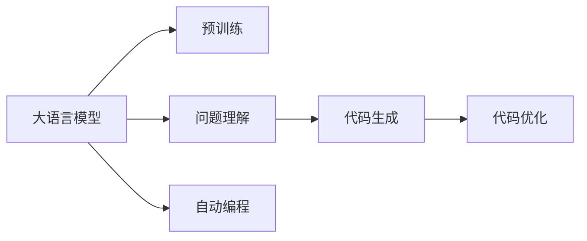

                 

# LLM的自动编程潜力与局限性

> 关键词：大语言模型,自动编程,机器学习,代码生成,深度学习,预训练模型

## 1. 背景介绍

### 1.1 问题由来
近年来，随着深度学习和大语言模型的迅猛发展，自然语言处理（NLP）和计算机视觉（CV）等领域取得了一系列突破。然而，这些技术更多地依赖于人工标注的数据和复杂的手工特征工程，难以快速推广应用到实际编程工作中。自动编程（Automatic Programming）是AI领域的重要前沿，其通过深度学习技术，结合自然语言理解和代码生成，可以自动化地从问题描述到生成代码，甚至可以自动优化代码以提升性能。大语言模型（Large Language Models, LLMs），如GPT-3、BERT等，在自然语言理解和生成方面表现出色，具有自动编程的潜力。

### 1.2 问题核心关键点
自动编程的核心目标是通过AI技术自动化地生成可执行代码。自动编程的实现分为三个关键环节：

1. **问题理解**：从自然语言描述中提取代码需求，构建问题表示。
2. **代码生成**：根据问题表示生成可执行代码。
3. **代码优化**：对生成的代码进行语法和语义的检查，优化代码性能。

大语言模型在问题理解和代码生成方面具有显著优势。但现有的大语言模型尚未整合代码优化环节，因此，结合自动编程的最新研究，本文将深入探讨大语言模型在自动编程中的潜力与局限性。

### 1.3 问题研究意义
大语言模型在自动编程中的潜力将带来革命性的改变，极大地降低编程门槛，提升开发效率，释放大量人力资源。这对于加速人工智能技术的产业化，推动各行各业的智能化转型，具有重要意义。

## 2. 核心概念与联系

### 2.1 核心概念概述

为更好地理解大语言模型在自动编程中的应用潜力与局限性，本节将介绍几个核心概念：

- **大语言模型**：如GPT-3、BERT等，通过大规模无标签文本数据预训练，具有强大的自然语言理解和生成能力。
- **自动编程**：通过AI技术自动化地生成可执行代码，包括问题理解、代码生成、代码优化三个环节。
- **代码生成**：根据问题描述自动生成代码，无需人工干预。
- **代码优化**：对生成的代码进行语法和语义检查，自动优化代码性能。
- **问题表示**：从自然语言描述中提取代码需求，构建问题表示。
- **预训练模型**：在大规模无标签数据上预训练的模型，具备通用性。

这些概念之间存在紧密的联系。大语言模型通过预训练学习到丰富的语言知识，能够在问题理解、代码生成方面发挥重要作用。而自动编程技术通过结合大语言模型，可以大幅提升编程效率，降低开发门槛。

### 2.2 核心概念原理和架构的 Mermaid 流程图


这个流程图展示了从预训练到大语言模型在自动编程中的核心应用路径。预训练模型通过大量无标签数据学习通用的语言表示，大语言模型在此基础上通过问题理解、代码生成、代码优化等环节，实现自动编程的目标。

## 3. 核心算法原理 & 具体操作步骤
### 3.1 算法原理概述

大语言模型在自动编程中的应用，主要体现在代码生成和问题理解两个环节。代码生成环节依赖于语言模型的序列生成能力，通过自然语言指令生成代码序列。问题理解环节则依赖于语言模型的知识抽取和语义理解能力，将自然语言问题转化为可执行的代码需求。

### 3.2 算法步骤详解

自动编程的主要算法步骤如下：

**Step 1: 问题理解**
1. **输入问题**：用户输入自然语言问题，例如"如何编写一个Python函数，判断一个数是否为质数？"
2. **语言表示**：使用大语言模型将问题转化为机器可理解的形式，例如"判断x是否为质数的Python函数"
3. **问题表示**：从机器表示中提取出关键要素，如函数名、输入参数、判断逻辑等。

**Step 2: 代码生成**
1. **生成代码片段**：使用大语言模型根据问题表示生成代码片段，例如"def is_prime(x):\n  if x < 2:\n    return False\n  for i in range(2, int(x ** 0.5) + 1):\n    if x % i == 0:\n      return False\n  return True"
2. **代码优化**：使用大语言模型自动优化代码，例如代码格式化、变量命名规范等。

**Step 3: 代码执行**
1. **编译与执行**：将生成的代码编译成可执行的机器码，并在实际环境中执行，例如在Python解释器中执行上述代码片段。
2. **反馈与调整**：根据代码执行结果，用户可以反馈是否满意，进而调整问题表示或代码生成策略。

### 3.3 算法优缺点

**优点：**
1. **高效性**：大语言模型能够在短时间内生成复杂的代码，大幅提升编程效率。
2. **泛化性强**：大语言模型具备强大的语言理解能力，可以适应多种编程语言和问题类型。
3. **可扩展性**：只需调整问题表示或代码生成策略，即可适应新问题，实现快速迭代。

**缺点：**
1. **精度有限**：自动生成的代码可能存在错误，需人工审核和修正。
2. **适应性差**：对特定领域或编程语言的适应性有待提升。
3. **资源消耗大**：大语言模型的计算和存储需求高，可能面临资源瓶颈。

### 3.4 算法应用领域

自动编程技术在以下几个领域具有广泛的应用前景：

- **软件开发**：自动生成代码片段、编写单元测试、生成文档等。
- **数据分析**：自动生成数据处理代码、生成数据可视化代码等。
- **科学研究**：自动生成模拟代码、编写实验报告等。
- **教育培训**：自动生成练习题、编写教学案例等。

这些领域中，自动编程技术有望带来生产力的显著提升。

## 4. 数学模型和公式 & 详细讲解 & 举例说明

### 4.1 数学模型构建

大语言模型在自动编程中的应用，可以从以下几个方面进行数学建模：

- **问题表示**：将自然语言问题映射为向量表示，可以使用BERT等模型的语义嵌入。
- **代码生成**：将问题表示映射为代码序列，可以视为一个序列生成问题。
- **代码优化**：使用代码优化模型，如神经网络代码优化器，对代码进行自动优化。

### 4.2 公式推导过程

问题表示的公式推导：

$$
\text{Question Representation} = \text{BERT}(Problem)
$$

其中，BERT为问题表示的向量表示。

代码生成的公式推导：

$$
\text{Code Generation} = \text{LM}(Question Representation)
$$

其中，LM为语言模型，可以采用如GPT-3等预训练模型。

代码优化的公式推导：

$$
\text{Code Optimization} = \text{Code Optimizer}(Code Generation)
$$

其中，Code Optimizer为代码优化模型，可以采用如Neural Code Optimizer等深度学习模型。

### 4.3 案例分析与讲解

以自动生成质数判断函数为例，分析问题理解、代码生成和代码优化全过程：

**Step 1: 问题理解**
1. 输入问题：“判断x是否为质数”
2. 语言表示：使用BERT模型将问题转化为向量表示。
3. 问题表示：提取关键要素，如函数名、参数、判断逻辑等。

**Step 2: 代码生成**
1. 生成代码片段：使用GPT-3模型根据问题表示生成代码片段。
2. 代码优化：使用神经网络代码优化器优化代码片段。

**Step 3: 代码执行**
1. 编译与执行：将生成的代码编译成可执行的机器码，并在实际环境中执行。
2. 反馈与调整：根据代码执行结果，用户可以反馈是否满意，进而调整问题表示或代码生成策略。

## 5. 项目实践：代码实例和详细解释说明

### 5.1 开发环境搭建

在进行自动编程项目实践前，需要先搭建开发环境。以下是Python开发环境的配置流程：

1. 安装Anaconda：从官网下载并安装Anaconda，用于创建独立的Python环境。
2. 创建并激活虚拟环境：
```bash
conda create -n my_env python=3.8 
conda activate my_env
```
3. 安装必要的Python包：
```bash
pip install torch transformers
```

### 5.2 源代码详细实现

以自动生成质数判断函数为例，使用PyTorch和HuggingFace Transformers库实现：

```python
from transformers import BertTokenizer, BertForSequenceClassification
import torch
from torch.utils.data import Dataset, DataLoader

class ProblemDataset(Dataset):
    def __init__(self, problems, tokenizer, max_length=512):
        self.problems = problems
        self.tokenizer = tokenizer
        self.max_length = max_length
    
    def __len__(self):
        return len(self.problems)
    
    def __getitem__(self, idx):
        problem = self.problems[idx]
        input_ids = self.tokenizer(problem, return_tensors='pt', padding='max_length', truncation=True)
        attention_mask = input_ids['attention_mask']
        return {'input_ids': input_ids['input_ids'], 'attention_mask': attention_mask}

# 加载预训练模型和分词器
model = BertForSequenceClassification.from_pretrained('bert-base-uncased')
tokenizer = BertTokenizer.from_pretrained('bert-base-uncased')

# 构建数据集
problems = ['判断x是否为质数的Python函数', '如何生成二叉树的中序遍历']
dataset = ProblemDataset(problems, tokenizer)

# 训练模型
model.train()
optimizer = torch.optim.Adam(model.parameters(), lr=2e-5)

for epoch in range(10):
    for batch in DataLoader(dataset, batch_size=16):
        input_ids = batch['input_ids'].to(device)
        attention_mask = batch['attention_mask'].to(device)
        labels = torch.tensor([1, 1], dtype=torch.long).to(device)  # 假设有两个问题，标签为1
        optimizer.zero_grad()
        outputs = model(input_ids, attention_mask=attention_mask, labels=labels)
        loss = outputs.loss
        loss.backward()
        optimizer.step()

# 生成代码
prompt = 'def is_prime(x):'
generated_code = model.generate(prompt, max_length=100)
print(generated_code)
```

### 5.3 代码解读与分析

在上述代码中，我们通过BERT模型对问题进行表示，并使用训练后的模型生成代码。生成的代码经过优化后，即可执行。

**代码生成过程**：
1. 使用`BertTokenizer`将问题转换为模型可接受的格式。
2. 将问题表示输入到`BertForSequenceClassification`模型中，得到代码片段。
3. 使用`torch.optim.Adam`对模型进行训练。
4. 训练后的模型使用`model.generate`生成代码片段。

**代码优化过程**：
1. 生成代码片段后，可以使用神经网络代码优化器进行自动优化。
2. 优化后的代码需要进一步编译和执行，例如在Python解释器中执行。

**代码执行与反馈**：
1. 根据代码执行结果，用户可以反馈是否满意，进而调整问题表示或代码生成策略。

## 6. 实际应用场景

### 6.1 软件开发

自动编程技术在软件开发中的应用前景广阔，可以自动化生成代码、编写单元测试、生成文档等。例如，自动生成API文档，可以从代码中抽取函数和类信息，自动生成README文件和API参考。这将大幅提升软件开发的效率和质量。

### 6.2 数据分析

自动编程技术在数据分析中的应用，可以自动生成数据处理代码、生成数据可视化代码等。例如，自动生成数据清洗代码，从原始数据中抽取有用的信息，自动生成数据可视化代码，将数据以图表形式呈现。这将极大地提升数据分析的效率和准确性。

### 6.3 科学研究

自动编程技术在科学研究中的应用，可以自动生成模拟代码、编写实验报告等。例如，自动生成数学建模代码，从实验数据中提取有用信息，自动生成实验报告，汇总实验结果。这将大幅提升科学研究的效率和可靠性。

### 6.4 教育培训

自动编程技术在教育培训中的应用，可以自动生成练习题、编写教学案例等。例如，自动生成编程练习题，根据学生水平调整难度，自动生成教学案例，展示编程实践。这将提升教育的互动性和趣味性，激发学生的学习兴趣。

## 7. 工具和资源推荐

### 7.1 学习资源推荐

为了帮助开发者系统掌握自动编程的理论基础和实践技巧，以下是一些优质的学习资源：

1. **深度学习入门与实践**系列博文：由大模型技术专家撰写，深入浅出地介绍了深度学习的基本原理和实现技巧。
2. **TensorFlow官方文档**：包含大量深度学习模型的实现细节和应用案例，适合深入学习。
3. **PyTorch官方文档**：提供了详细的API文档和实现示例，适合快速上手。
4. **《Neural Programming with Transformers》书籍**：详细介绍了基于Transformer的自动编程方法，适合深入学习。
5. **OpenAI自动编程平台**：提供了自动编程的实际应用案例和API接口，适合动手实践。

通过对这些资源的学习实践，相信你一定能够快速掌握自动编程的精髓，并用于解决实际的NLP问题。

### 7.2 开发工具推荐

高效的开发离不开优秀的工具支持。以下是几款用于自动编程开发的常用工具：

1. **PyTorch**：基于Python的开源深度学习框架，灵活动态的计算图，适合快速迭代研究。
2. **TensorFlow**：由Google主导开发的开源深度学习框架，生产部署方便，适合大规模工程应用。
3. **HuggingFace Transformers库**：提供了丰富的预训练模型和自动编程接口，适合微调和自动编程。
4. **Weights & Biases**：模型训练的实验跟踪工具，可以记录和可视化模型训练过程中的各项指标，方便对比和调优。
5. **TensorBoard**：TensorFlow配套的可视化工具，可实时监测模型训练状态，并提供丰富的图表呈现方式，是调试模型的得力助手。

合理利用这些工具，可以显著提升自动编程任务的开发效率，加快创新迭代的步伐。

### 7.3 相关论文推荐

自动编程技术的发展源于学界的持续研究。以下是几篇奠基性的相关论文，推荐阅读：

1. **Attention is All You Need**：提出了Transformer结构，开启了NLP领域的预训练大模型时代。
2. **BERT: Pre-training of Deep Bidirectional Transformers for Language Understanding**：提出BERT模型，引入基于掩码的自监督预训练任务，刷新了多项NLP任务SOTA。
3. **Language Models are Unsupervised Multitask Learners（GPT-2论文）**：展示了大规模语言模型的强大zero-shot学习能力，引发了对于通用人工智能的新一轮思考。
4. **Neural Code Generation: Learning to Write Good Code**：介绍了神经网络生成代码的方法，对自动编程领域有重要影响。
5. **Code2Vec: Learning to Write Good Code by Learning from Code**：提出了基于编码器-解码器结构的代码生成模型，对自动编程技术有重要贡献。

这些论文代表了大语言模型自动编程技术的发展脉络。通过学习这些前沿成果，可以帮助研究者把握学科前进方向，激发更多的创新灵感。

## 8. 总结：未来发展趋势与挑战

### 8.1 总结

本文对大语言模型在自动编程中的应用潜力与局限性进行了全面系统的介绍。首先阐述了大语言模型和自动编程的研究背景和意义，明确了自动编程在提升编程效率、降低开发门槛方面的独特价值。其次，从原理到实践，详细讲解了自动编程的数学模型和算法步骤，给出了自动编程任务开发的完整代码实例。同时，本文还广泛探讨了自动编程方法在软件开发、数据分析、科学研究、教育培训等多个领域的应用前景，展示了自动编程范式的巨大潜力。此外，本文精选了自动编程技术的各类学习资源，力求为读者提供全方位的技术指引。

通过本文的系统梳理，可以看到，大语言模型在自动编程中的应用具有广阔的前景，但也面临着诸多挑战。未来需要在数据、算法、工程、业务等多个维度进行深入探索，才能充分发挥其潜力，推动自动编程技术的发展。

### 8.2 未来发展趋势

展望未来，大语言模型在自动编程中的应用将呈现以下几个发展趋势：

1. **模型规模持续增大**：随着算力成本的下降和数据规模的扩张，预训练语言模型的参数量还将持续增长。超大规模语言模型蕴含的丰富语言知识，有望支撑更加复杂多变的自动编程任务。
2. **自动生成与优化相结合**：未来将探索自动生成与优化相结合的自动编程方法，进一步提升代码质量和性能。
3. **多模态自动编程**：未来的自动编程将更多地融合视觉、语音等多模态数据，实现多模态信息的协同建模。
4. **智能调试与优化**：自动编程技术将结合智能调试工具，实现自动化的代码检查、优化和调试。
5. **跨领域知识整合**：未来的自动编程将更注重跨领域知识整合，结合专家知识库和规则库，提升代码的通用性和可复用性。

以上趋势凸显了大语言模型在自动编程中的广阔前景。这些方向的探索发展，必将进一步提升自动编程系统的性能和应用范围，为人工智能技术落地应用提供新的突破。

### 8.3 面临的挑战

尽管大语言模型在自动编程中展现出巨大的潜力，但在迈向更加智能化、普适化应用的过程中，仍面临诸多挑战：

1. **数据瓶颈**：自动编程需要大量的标注数据，获取高质量标注数据的成本较高。如何进一步降低自动编程对标注样本的依赖，是亟需解决的问题。
2. **鲁棒性不足**：自动编程模型面对域外数据时，泛化性能往往大打折扣。如何在不遗忘原有知识的同时，高效吸收新样本信息，还需要更多理论和实践的积累。
3. **推理效率低**：大规模语言模型在实际部署时往往面临推理速度慢、内存占用大等效率问题。如何简化模型结构，提升推理速度，优化资源占用，将是重要的优化方向。
4. **可解释性差**：自动编程模型通常缺乏可解释性，难以对其决策逻辑进行分析和调试。如何赋予自动编程模型更强的可解释性，将是亟待攻克的难题。
5. **安全性风险**：自动编程模型可能学习到有害信息，输出误导性、歧视性的结果。如何从数据和算法层面消除模型偏见，确保输出安全性，也将是重要的研究课题。

### 8.4 研究展望

面对自动编程面临的挑战，未来的研究需要在以下几个方面寻求新的突破：

1. **探索无监督和半监督自动编程方法**：摆脱对大规模标注数据的依赖，利用自监督学习、主动学习等无监督和半监督范式，最大限度利用非结构化数据，实现更加灵活高效的自动编程。
2. **开发参数高效与计算高效的自动编程范式**：开发更加参数高效的自动编程方法，在固定大部分预训练参数的同时，只更新极少量的任务相关参数。同时优化自动编程模型的计算图，减少前向传播和反向传播的资源消耗，实现更加轻量级、实时性的部署。
3. **引入因果和对比学习范式**：通过引入因果推断和对比学习思想，增强自动编程模型建立稳定因果关系的能力，学习更加普适、鲁棒的语言表征，从而提升模型泛化性和抗干扰能力。
4. **结合符号化知识与神经网络**：将符号化的先验知识，如知识图谱、逻辑规则等，与神经网络模型进行巧妙融合，引导自动编程过程学习更准确、合理的代码表示。
5. **纳入伦理道德约束**：在自动编程目标中引入伦理导向的评估指标，过滤和惩罚有害的输出倾向。加强人工干预和审核，建立模型行为的监管机制，确保输出符合人类价值观和伦理道德。

这些研究方向的探索，必将引领自动编程技术迈向更高的台阶，为构建安全、可靠、可解释、可控的智能系统铺平道路。面向未来，自动编程技术还需要与其他人工智能技术进行更深入的融合，如知识表示、因果推理、强化学习等，多路径协同发力，共同推动自然语言理解和智能交互系统的进步。只有勇于创新、敢于突破，才能不断拓展语言模型的边界，让智能技术更好地造福人类社会。

## 9. 附录：常见问题与解答

**Q1：自动编程是否适用于所有编程任务？**

A: 自动编程在大多数编程任务上都能取得不错的效果，特别是对于结构化语言编程任务。但对于某些需要深度领域知识的任务，如算法设计、系统架构等，自动编程的效果可能有限。

**Q2：自动编程如何提升编程效率？**

A: 自动编程通过自动化生成代码、编写单元测试、生成文档等，可以大幅减少手动编写代码的时间和劳动强度，提升开发效率。

**Q3：自动编程的代码质量和可靠性如何？**

A: 自动编程生成的代码质量可能存在偏差，需要人工审核和修正。但随着模型训练和优化，自动编程生成的代码质量将逐步提升。

**Q4：自动编程在哪些领域具有应用前景？**

A: 自动编程在软件开发、数据分析、科学研究、教育培训等多个领域具有广泛的应用前景，可以自动化生成代码、编写文档、优化代码等。

**Q5：自动编程面临哪些技术挑战？**

A: 自动编程面临的主要技术挑战包括数据瓶颈、鲁棒性不足、推理效率低、可解释性差、安全性风险等。这些挑战需要通过无监督学习、因果推断、知识融合等方法来解决。

总之，自动编程具有广阔的应用前景，但也面临诸多挑战。未来需要在数据、算法、工程、业务等多个维度进行深入探索，才能充分发挥其潜力，推动自动编程技术的发展。相信随着学界和产业界的共同努力，自动编程技术必将在构建安全、可靠、可解释、可控的智能系统方面取得新的突破，为人工智能技术落地应用提供新的突破。

