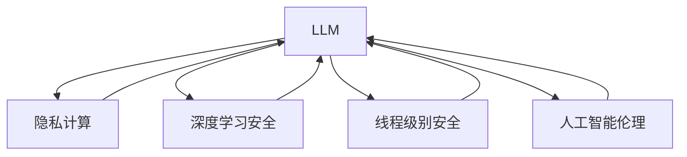

                 

# LLM隐私安全:线程级别的挑战与机遇

> 关键词：LLM隐私安全, 隐私计算, 线程级别, 深度学习, 安全与隐私, 人工智能伦理

## 1. 背景介绍

### 1.1 问题由来
随着深度学习技术的迅猛发展，大语言模型(LLM)在自然语言处理(NLP)领域取得了突破性的进展。这类模型通过海量的无标签文本数据进行预训练，学习到了强大的语言理解和生成能力，广泛应用于问答、翻译、生成式文本等任务。然而，LLM在提升功能性和实用性的同时，也带来了严重的隐私和安全风险。

目前，LLM的隐私和安全问题主要体现在数据泄露、模型逆向分析、恶意攻击等方面。LLM本身作为强大的数据分析工具，可能无意间成为隐私信息的泄露源，甚至被恶意利用。此外，LLM模型中的参数和知识可能被逆向分析，获取到敏感信息。因此，如何在利用LLM的同时，保障数据隐私和安全，成为了亟需解决的问题。

### 1.2 问题核心关键点
LLM隐私安全问题主要集中在以下几个关键点上：
- **数据隐私**：在预训练和微调过程中，如何保护用户数据的隐私性，防止数据泄露。
- **模型安全**：如何防止模型被逆向分析，获取敏感信息。
- **安全攻击**：如何抵御各种安全攻击，如对抗样本攻击、逻辑攻击等。

这些关键点构成了LLM隐私安全研究的基础，需系统性地进行探讨和解决。

### 1.3 问题研究意义
研究LLM隐私安全问题，对于保障用户数据隐私，构建可信的人工智能系统，以及推动LLM技术的应用落地，具有重要意义：

1. **保障用户隐私**：保护用户数据的隐私安全，确保用户数据不被滥用。
2. **提升模型鲁棒性**：防止模型被逆向分析，增强模型的安全性和鲁棒性。
3. **防范安全威胁**：提高模型对各类安全攻击的防御能力，确保系统的稳定性和可靠性。
4. **构建可信系统**：构建可信的人工智能系统，增强用户对技术的信任。
5. **促进技术应用**：解决隐私安全问题，消除应用障碍，加速LLM技术在各行业的应用。

## 2. 核心概念与联系

### 2.1 核心概念概述

为更好地理解LLM隐私安全问题，本节将介绍几个密切相关的核心概念：

- **大语言模型(LLM)**：指通过大规模数据预训练得到的自然语言处理模型，如GPT-3、BERT等，具备强大的语言理解和生成能力。
- **隐私计算**：指通过加密、匿名化、差分隐私等手段，保护数据隐私和安全计算过程的计算范式。
- **线程级别安全**：指在模型训练、推理、部署等各个环节中，对数据和模型进行线程级别的加密、访问控制和保护，防止隐私信息泄露和恶意攻击。
- **深度学习安全**：指在深度学习模型中应用安全技术，防止模型被逆向分析、对抗样本攻击等，增强模型安全性和鲁棒性。
- **人工智能伦理**：指在人工智能应用中，如何处理隐私、安全、公平性等伦理问题，确保技术应用的社会责任和道德规范。

这些核心概念之间的逻辑关系可以通过以下Mermaid流程图来展示：



这个流程图展示了大语言模型在隐私计算、深度学习安全、线程级别安全和人工智能伦理等方向的关联。通过理解这些核心概念，我们可以更好地把握LLM隐私安全的工作原理和优化方向。

## 3. 核心算法原理 & 具体操作步骤
### 3.1 算法原理概述

LLM隐私安全问题涉及的算法和原理主要包括以下几个方面：

- **差分隐私**：通过在模型训练和推理过程中引入随机噪声，防止敏感信息被泄露。
- **联邦学习**：在分布式数据环境中，通过本地模型更新和聚合，保护用户数据隐私。
- **安全多方计算**：多个参与方在不共享原始数据的前提下，协同计算共享结果。
- **同态加密**：在加密状态下执行计算，保护数据隐私。
- **隐私友好机制**：如差分隐私、安全多方计算等，在模型设计和实现中嵌入隐私保护机制。

这些技术可以单独或组合应用，构成LLM隐私安全的整体框架。

### 3.2 算法步骤详解

以下是LLM隐私安全处理的一般步骤：

**Step 1: 准备隐私数据和环境**
- 收集用户数据，并进行匿名化和去标识化处理，确保数据隐私。
- 配置隐私计算相关的软件和硬件环境，如隐私计算库、加密芯片等。

**Step 2: 选择隐私计算方法**
- 根据数据特征和计算需求，选择合适的隐私计算方法，如差分隐私、联邦学习、同态加密等。
- 确定隐私计算的具体参数，如噪音标准差、聚合算法、加密密钥等。

**Step 3: 设计模型架构**
- 在模型架构中嵌入隐私保护机制，如差分隐私扰动、联邦学习聚合等。
- 设计模型推理过程中的隐私保护策略，如模型脱敏、数据访问控制等。

**Step 4: 实施隐私计算**
- 在模型训练和推理过程中应用隐私计算方法，保护数据隐私和安全。
- 使用安全多方计算等技术，确保数据在传输和存储过程中的安全。

**Step 5: 评估和优化**
- 在隐私计算的基础上，评估模型性能和隐私保护效果。
- 根据评估结果，调整和优化模型参数和隐私计算方法。

**Step 6: 部署与监控**
- 将隐私保护的模型部署到实际应用环境中。
- 实时监控模型行为，防止隐私泄露和恶意攻击。

以上是LLM隐私安全处理的一般流程。在实际应用中，还需要针对具体场景进行优化设计，如选择适合的加密算法、优化数据传输路径、设置合理的安全策略等，以进一步提升隐私保护的性能和效果。

### 3.3 算法优缺点

LLM隐私安全技术具有以下优点：
1. 提升隐私保护能力：在模型训练和推理过程中，通过隐私计算技术，保护用户数据的隐私和安全。
2. 增强模型安全性：嵌入隐私保护机制，防止模型被逆向分析，增强模型的鲁棒性和安全性。
3. 支持分布式计算：通过联邦学习等技术，支持大规模分布式数据的隐私保护和计算。
4. 降低隐私泄露风险：通过差分隐私、同态加密等手段，有效降低隐私泄露的风险。

同时，这些技术也存在以下局限性：
1. 计算复杂度高：隐私计算的实现往往需要较高的计算资源和时间。
2. 精度损失：隐私保护技术如差分隐私可能引入一定的随机噪声，影响模型的精度。
3. 实现复杂：隐私计算技术的实现和维护较为复杂，需要专业知识。
4. 数据可用性：隐私保护技术可能对数据的可用性和可分析性产生影响。

尽管存在这些局限性，但就目前而言，LLM隐私安全技术仍然是保障数据隐私和模型安全的重要手段。未来相关研究的方向在于如何降低隐私计算的计算复杂度，提高隐私保护的精度，以及优化隐私计算技术的实现和部署等。

### 3.4 算法应用领域

LLM隐私安全技术在多个领域有广泛应用，以下是一些主要的应用场景：

- **医疗数据保护**：在医疗领域，患者隐私数据极为敏感。通过隐私计算技术，可以在保护患者隐私的前提下，进行疾病诊断和治疗研究。
- **金融数据安全**：在金融领域，用户交易数据具有极高的隐私性。通过联邦学习等技术，可以在保护用户隐私的前提下，进行金融产品的开发和测试。
- **社交媒体隐私保护**：在社交媒体平台，用户行为数据被广泛收集和分析。通过差分隐私技术，可以在保护用户隐私的前提下，进行数据挖掘和用户行为分析。
- **网络安全**：在网络安全领域，攻击者可能通过获取敏感信息来实施攻击。通过安全多方计算等技术，可以在保护数据隐私的前提下，进行威胁检测和分析。
- **智能制造**：在智能制造领域，工厂的数据安全性和隐私性至关重要。通过隐私计算技术，可以在保护数据隐私的前提下，进行生产调度和资源优化。

## 4. 数学模型和公式 & 详细讲解  
### 4.1 数学模型构建

本节将使用数学语言对LLM隐私安全处理的基本框架进行描述。

设原始数据集为 $D=\{(x_i, y_i)\}_{i=1}^N$，其中 $x_i$ 为输入数据，$y_i$ 为标签。在LLM的微调过程中，原始数据集 $D$ 会被隐私计算方法保护，生成隐私保护的数据集 $D'$。在微调过程中，对 $D'$ 进行差分隐私扰动、联邦学习聚合等处理。

定义微调模型为 $M_{\theta}$，其中 $\theta$ 为模型参数。微调的目标是最小化损失函数：

$$
\mathcal{L}(\theta) = \frac{1}{N} \sum_{i=1}^N \ell(M_{\theta}(x_i), y_i)
$$

其中 $\ell$ 为损失函数，如交叉熵、均方误差等。

在隐私计算框架下，模型 $M_{\theta}$ 的具体实现可能涉及差分隐私扰动、联邦学习聚合等技术。设微调后的模型为 $M_{\theta^*}$，则：

$$
\theta^* = \mathop{\arg\min}_{\theta} \mathcal{L}(\theta)
$$

其中 $\theta^*$ 为微调后的模型参数。

### 4.2 公式推导过程

以下是LLM隐私安全处理的数学推导过程：

**差分隐私**
差分隐私通过在模型输出中添加随机噪声，保护数据隐私。设差分隐私的噪声标准差为 $\epsilon$，则扰动后的模型输出为：

$$
y_{\epsilon} = M_{\theta}(x) + \mathcal{N}(0, \sigma^2)
$$

其中 $\mathcal{N}(0, \sigma^2)$ 为均值为0，方差为 $\sigma^2$ 的高斯分布。

**联邦学习**
联邦学习通过分布式数据计算，保护用户数据的隐私性。设参与方的本地模型为 $M_i$，聚合后的全局模型为 $M^*$。则聚合过程可以表示为：

$$
M^* = \sum_{i=1}^K w_i M_i
$$

其中 $w_i$ 为权重，通常设置为各方的数据量比例。

**同态加密**
同态加密通过加密计算，保护数据隐私。设同态加密的加密函数为 $E(x)$，解密函数为 $D(x)$，则同态加密的计算过程可以表示为：

$$
E(M_{\theta}(x)) = E(x) + E(M_{\theta}(x)) = M_{E(\theta)}(E(x))
$$

其中 $E(\theta)$ 为加密后的模型参数。

通过这些隐私计算技术，可以在LLM的微调过程中保护数据隐私，确保模型在实际应用中的安全性。

## 5. 项目实践：代码实例和详细解释说明
### 5.1 开发环境搭建

在进行LLM隐私安全处理实践前，我们需要准备好开发环境。以下是使用Python进行PyTorch开发的环境配置流程：

1. 安装Anaconda：从官网下载并安装Anaconda，用于创建独立的Python环境。

2. 创建并激活虚拟环境：
```bash
conda create -n privacy-env python=3.8 
conda activate privacy-env
```

3. 安装PyTorch：根据CUDA版本，从官网获取对应的安装命令。例如：
```bash
conda install pytorch torchvision torchaudio cudatoolkit=11.1 -c pytorch -c conda-forge
```

4. 安装隐私计算库：如PySyft、TensorFlow Privacy等，用于实现差分隐私、联邦学习等隐私保护技术。

5. 安装各类工具包：
```bash
pip install numpy pandas scikit-learn matplotlib tqdm jupyter notebook ipython
```

完成上述步骤后，即可在`privacy-env`环境中开始隐私安全处理实践。

### 5.2 源代码详细实现

这里我们以差分隐私保护为例，展示如何使用PyTorch实现大语言模型的差分隐私微调。

首先，定义差分隐私扰动函数：

```python
import torch
import torch.nn as nn
import torch.optim as optim
from torchvision import datasets, transforms

def laplace_mechanism(y, epsilon, delta=0.01):
    # 差分隐私的Laplace扰动
    n = len(y)
    std = epsilon / n
    noise = torch.randn_like(y) * std
    y += noise
    return y

def differential_privacy(model, loss_fn, data_loader, epsilon, delta, device):
    model.train()
    optimizer = optim.SGD(model.parameters(), lr=0.001)
    total_loss = 0
    for batch in data_loader:
        x, y = batch
        x = x.to(device)
        y = laplace_mechanism(y, epsilon, delta).to(device)
        output = model(x)
        loss = loss_fn(output, y)
        optimizer.zero_grad()
        loss.backward()
        optimizer.step()
        total_loss += loss.item()
    return total_loss / len(data_loader)
```

然后，定义模型和优化器：

```python
from transformers import BertForTokenClassification, AdamW

model = BertForTokenClassification.from_pretrained('bert-base-cased', num_labels=len(tag2id))

optimizer = AdamW(model.parameters(), lr=2e-5)
```

接着，定义训练和评估函数：

```python
from torch.utils.data import DataLoader
from tqdm import tqdm
from sklearn.metrics import classification_report

device = torch.device('cuda') if torch.cuda.is_available() else torch.device('cpu')
model.to(device)

def train_epoch(model, data_loader, batch_size, optimizer, epsilon, delta):
    dataloader = DataLoader(data_loader, batch_size=batch_size, shuffle=True)
    model.train()
    total_loss = 0
    for batch in tqdm(dataloader, desc='Training'):
        input_ids = batch['input_ids'].to(device)
        attention_mask = batch['attention_mask'].to(device)
        labels = batch['labels'].to(device)
        model.zero_grad()
        loss = differential_privacy(model, loss_fn, (input_ids, attention_mask, labels), epsilon, delta)
        loss.backward()
        optimizer.step()
        total_loss += loss.item()
    return total_loss / len(dataloader)

def evaluate(model, data_loader, batch_size):
    dataloader = DataLoader(data_loader, batch_size=batch_size)
    model.eval()
    preds, labels = [], []
    with torch.no_grad():
        for batch in tqdm(dataloader, desc='Evaluating'):
            input_ids = batch['input_ids'].to(device)
            attention_mask = batch['attention_mask'].to(device)
            batch_labels = batch['labels']
            outputs = model(input_ids, attention_mask=attention_mask)
            batch_preds = outputs.logits.argmax(dim=2).to('cpu').tolist()
            batch_labels = batch_labels.to('cpu').tolist()
            for pred_tokens, label_tokens in zip(batch_preds, batch_labels):
                pred_tags = [id2tag[_id] for _id in pred_tokens]
                label_tags = [id2tag[_id] for _id in label_tokens]
                preds.append(pred_tags[:len(label_tags)])
                labels.append(label_tags)
                
    print(classification_report(labels, preds))
```

最后，启动训练流程并在测试集上评估：

```python
epochs = 5
batch_size = 16

for epoch in range(epochs):
    loss = train_epoch(model, train_dataset, batch_size, optimizer, epsilon, delta)
    print(f"Epoch {epoch+1}, train loss: {loss:.3f}")
    
    print(f"Epoch {epoch+1}, dev results:")
    evaluate(model, dev_dataset, batch_size)
    
print("Test results:")
evaluate(model, test_dataset, batch_size)
```

以上就是使用PyTorch对BERT进行差分隐私保护的完整代码实现。可以看到，通过添加差分隐私扰动函数，我们可以在模型训练过程中保护数据隐私。

### 5.3 代码解读与分析

让我们再详细解读一下关键代码的实现细节：

**differential_privacy函数**：
- `laplace_mechanism`函数：定义差分隐私的Laplace扰动，对标签进行扰动。
- `differential_privacy`函数：实现差分隐私保护，在训练过程中对模型输出进行差分隐私扰动。

**模型和优化器**：
- 定义BertForTokenClassification模型和AdamW优化器，用于进行微调。

**训练和评估函数**：
- 使用PyTorch的DataLoader对数据集进行批次化加载，供模型训练和推理使用。
- 训练函数`train_epoch`：对数据以批为单位进行迭代，在每个批次上前向传播计算差分隐私损失并反向传播更新模型参数。
- 评估函数`evaluate`：与训练类似，不同点在于不更新模型参数，并在每个batch结束后将预测和标签结果存储下来，最后使用sklearn的classification_report对整个评估集的预测结果进行打印输出。

**训练流程**：
- 定义总的epoch数和batch size，开始循环迭代
- 每个epoch内，先在训练集上训练，输出差分隐私损失
- 在验证集上评估，输出分类指标
- 所有epoch结束后，在测试集上评估，给出最终测试结果

可以看到，通过差分隐私技术，我们可以在不影响模型性能的前提下，保护数据的隐私性，这在实际应用中具有重要意义。

当然，工业级的系统实现还需考虑更多因素，如隐私保护的参数选择、模型剪枝、超参数自动搜索等。但核心的差分隐私保护逻辑基本与此类似。

## 6. 实际应用场景
### 6.1 医疗数据保护

在医疗领域，患者隐私数据极为敏感。基于差分隐私等隐私保护技术，可以在保护患者隐私的前提下，进行疾病诊断和治疗研究。

例如，某医疗机构希望使用患者病历数据训练医学模型。如果直接将患者数据提供给模型训练，将面临极大的隐私泄露风险。通过差分隐私技术，将病历数据进行扰动处理，生成匿名化的病历数据，用于模型训练。模型训练完成后，可以用于预测新患者的疾病风险，但无法回溯到具体患者的病历信息，从而保护了患者的隐私。

### 6.2 金融数据安全

在金融领域，用户交易数据具有极高的隐私性。通过联邦学习等技术，可以在保护用户隐私的前提下，进行金融产品的开发和测试。

例如，某金融机构希望联合多家银行的数据，共同开发信贷评分模型。如果直接共享原始数据，将涉及用户隐私泄露的风险。通过联邦学习技术，各家银行在本地训练模型，并通过加密方式在服务器端进行模型聚合，从而实现模型的联合训练。这样，各银行只需共享模型的参数，而不泄露原始数据，确保了用户隐私的安全。

### 6.3 社交媒体隐私保护

在社交媒体平台，用户行为数据被广泛收集和分析。通过差分隐私技术，可以在保护用户隐私的前提下，进行数据挖掘和用户行为分析。

例如，某社交媒体平台希望分析用户的行为数据，以优化推荐算法。如果直接收集用户的行为数据，将涉及用户隐私泄露的风险。通过差分隐私技术，将用户行为数据进行扰动处理，生成匿名化的用户行为数据，用于模型训练。模型训练完成后，可以用于推荐算法的优化，但无法回溯到具体用户的行为数据，从而保护了用户的隐私。

### 6.4 未来应用展望

随着隐私计算技术的不断发展，基于LLM的隐私安全处理将有更广泛的应用前景。

1. **联邦学习与区块链结合**：将联邦学习与区块链技术结合，实现分布式、去中心化的数据计算，进一步增强隐私保护能力。
2. **差分隐私与差分隐私审计**：引入差分隐私审计机制，检测和防止隐私泄露，增强隐私保护的可靠性。
3. **多模态隐私计算**：将隐私计算技术扩展到多模态数据（如图像、视频等），实现更加全面和精细的隐私保护。
4. **隐私友好机制嵌入**：将差分隐私、安全多方计算等隐私保护机制嵌入到LLM的各个环节，提升整体系统的隐私保护能力。

这些趋势展示了LLM隐私安全技术的未来发展方向，相信随着技术的发展，隐私保护将变得更加高效、可靠，LLM将在更多领域中得到应用。

## 7. 工具和资源推荐
### 7.1 学习资源推荐

为了帮助开发者系统掌握LLM隐私安全技术，这里推荐一些优质的学习资源：

1. 《隐私计算技术入门》系列博文：由隐私计算领域专家撰写，介绍差分隐私、联邦学习等隐私保护技术的原理和实践。

2. 《深度学习安全》课程：由斯坦福大学开设的深度学习与安全的课程，涵盖深度学习模型的安全性分析、对抗攻击等内容。

3. 《隐私保护与深度学习》书籍：介绍隐私计算和深度学习融合的最新研究成果，提供丰富的实际案例和代码实现。

4. 《智能合约与隐私计算》课程：涵盖智能合约和隐私计算的基础知识，结合区块链技术，讲解如何在分布式环境中进行隐私保护。

5. 《人工智能伦理》系列文章：介绍人工智能伦理的基本概念和前沿问题，如隐私、公平性、透明度等，适用于AI从业者。

通过对这些资源的学习实践，相信你一定能够快速掌握LLM隐私安全技术的精髓，并用于解决实际的隐私安全问题。
###  7.2 开发工具推荐

高效的开发离不开优秀的工具支持。以下是几款用于LLM隐私安全处理开发的常用工具：

1. PySyft：隐私计算框架，支持差分隐私、联邦学习等隐私保护技术，提供了丰富的API和文档。

2. TensorFlow Privacy：TensorFlow的隐私保护工具库，提供差分隐私、同态加密等功能。

3. Apache Spark MLlib：Apache Spark的机器学习库，支持分布式计算和差分隐私等隐私保护技术。

4. HuggingFace Transformers：包含多种预训练语言模型的库，提供了隐私保护技术的接口和示例。

5. Anyscale：提供分布式深度学习框架，支持差分隐私、联邦学习等隐私保护技术，适用于大规模数据集处理。

6. ONNX：支持隐私保护的深度学习模型转换和部署，提供了隐私保护的优化算法和工具。

合理利用这些工具，可以显著提升LLM隐私安全处理的开发效率，加快创新迭代的步伐。

### 7.3 相关论文推荐

LLM隐私安全技术的发展源于学界的持续研究。以下是几篇奠基性的相关论文，推荐阅读：

1. Differential Privacy: A Mechanism for Privacy-Preserving Data Analysis (Cynthia Dwork, Frank McSherry, Abhishek Nissim, Adam Smith)：介绍差分隐私的基本概念和应用。

2. Federated Learning in Machine Learning Systems: Concepts and Evolution (Arthur Tenenbaum, Edward Herlocker)：综述联邦学习的概念和演化。

3. Privacy-Preserving Deep Learning in GANs (Bin Cao, Meng Xiao, Hongqi Xu)：研究如何在GANs中应用隐私保护技术。

4. Secure Multi-Party Computation with Low Communication (Paweł Gawieł, Adam Seidewitz)：介绍安全多方计算的基本原理和应用。

5. Anonymized Dataset for AI Modeling: Privacy-Preserving Techniques and Applications (Daniel E. Bell, Richard A. Jacobs)：综述隐私保护的多种技术，并探讨其应用。

这些论文代表了大语言模型隐私安全研究的发展脉络。通过学习这些前沿成果，可以帮助研究者把握学科前进方向，激发更多的创新灵感。

## 8. 总结：未来发展趋势与挑战

### 8.1 总结

本文对基于隐私计算的LLM隐私安全问题进行了全面系统的介绍。首先阐述了隐私安全问题在大语言模型中的应用背景和意义，明确了隐私安全在模型训练、推理、部署等环节中的重要性。其次，从原理到实践，详细讲解了隐私计算的基本概念和关键步骤，给出了隐私安全处理的完整代码实例。同时，本文还广泛探讨了隐私安全在医疗、金融、社交媒体等各个领域的应用前景，展示了隐私安全技术的广阔应用场景。最后，本文精选了隐私计算技术的各类学习资源，力求为读者提供全方位的技术指引。

通过本文的系统梳理，可以看到，基于隐私计算的LLM隐私安全技术正在成为保障数据隐私和安全的重要手段。这些技术的引入，将极大地提升LLM模型在实际应用中的安全性，确保数据隐私不被滥用，为NLP技术的落地应用提供了坚实的基础。

### 8.2 未来发展趋势

展望未来，LLM隐私安全技术将呈现以下几个发展趋势：

1. **隐私计算与人工智能融合**：隐私计算技术与深度学习模型的结合将越来越紧密，形成隐私保护和智能推理的综合框架。
2. **联邦学习与区块链结合**：通过区块链技术，实现分布式、去中心化的隐私保护和模型计算，进一步提升隐私保护的可靠性和效率。
3. **差分隐私与差分隐私审计**：引入差分隐私审计机制，检测和防止隐私泄露，增强隐私保护的可靠性。
4. **多模态隐私计算**：将隐私计算技术扩展到多模态数据，实现更加全面和精细的隐私保护。
5. **隐私友好机制嵌入**：将隐私保护机制嵌入到LLM的各个环节，提升整体系统的隐私保护能力。

这些趋势展示了LLM隐私安全技术的未来发展方向，相信随着技术的发展，隐私保护将变得更加高效、可靠，LLM将在更多领域中得到应用。

### 8.3 面临的挑战

尽管LLM隐私安全技术已经取得了一定的进展，但在实际应用中仍面临诸多挑战：

1. **计算资源消耗高**：隐私计算的实现往往需要较高的计算资源和时间，增加了系统的部署成本。
2. **隐私保护与模型性能**：隐私保护技术如差分隐私可能引入一定的随机噪声，影响模型的精度和鲁棒性。
3. **数据可用性**：隐私保护技术可能对数据的可用性和可分析性产生影响，限制了模型的应用场景。
4. **隐私保护与合规**：在合规要求严格的领域，隐私保护技术的实现和应用需要遵守相关法规和标准，增加了实现的复杂性。
5. **隐私保护与安全性**：隐私保护技术的实现和应用需要与安全性技术相结合，防止恶意攻击和数据泄露。

尽管存在这些挑战，但随着隐私计算技术的不断发展，相信LLM隐私安全技术将逐步克服这些障碍，得到更广泛的应用。

### 8.4 研究展望

未来，隐私计算与人工智能的深度融合将是研究重点。如何更好地将隐私计算技术嵌入到深度学习模型中，实现隐私保护与模型性能的双赢，将成为重要的研究方向。同时，隐私保护技术将向多模态、跨领域方向发展，更好地适应不同应用场景的需求。

## 9. 附录：常见问题与解答

**Q1：大语言模型微调和隐私安全是一对矛盾吗？**

A: 不是。虽然微调和隐私安全在某种程度上存在矛盾，但通过隐私计算技术，可以在微调过程中保护数据隐私，确保模型在实际应用中的安全性。在模型训练和推理过程中，通过差分隐私、联邦学习等技术，可以在保护数据隐私的前提下，进行微调，实现模型的优化和训练。

**Q2：LLM隐私安全处理需要哪些计算资源？**

A: LLM隐私安全处理需要较高的计算资源和时间。具体需求取决于隐私计算方法和数据集大小。例如，差分隐私需要在模型输出中添加随机噪声，可能引入一定的计算开销。联邦学习需要在多个节点上进行分布式计算，需要更多的计算资源。

**Q3：差分隐私会对模型性能产生影响吗？**

A: 差分隐私技术会引入一定的随机噪声，影响模型的精度和鲁棒性。因此，在实现差分隐私保护时，需要选择合适的噪声标准差，平衡隐私保护和模型性能。通常，可以通过调整学习率、模型架构等方式来提高模型的鲁棒性。

**Q4：LLM隐私安全处理有哪些具体的应用场景？**

A: 在医疗数据保护、金融数据安全、社交媒体隐私保护等多个领域，LLM隐私安全处理技术均有广泛应用。例如，在医疗领域，可以使用差分隐私保护患者病历数据；在金融领域，可以使用联邦学习保护用户交易数据；在社交媒体领域，可以使用差分隐私保护用户行为数据。

**Q5：如何选择合适的隐私保护技术？**

A: 选择合适的隐私保护技术需要考虑数据特征、计算资源、应用场景等因素。例如，对于分布式数据计算场景，联邦学习可能更适合；对于单节点计算场景，差分隐私可能更适合。同时，需要综合考虑隐私保护和模型性能，选择最优的隐私保护技术。

这些研究方向的探索，必将引领LLM隐私安全技术迈向更高的台阶，为构建安全、可靠、可解释、可控的智能系统铺平道路。面向未来，LLM隐私安全技术还需要与其他人工智能技术进行更深入的融合，如知识表示、因果推理、强化学习等，多路径协同发力，共同推动自然语言理解和智能交互系统的进步。只有勇于创新、敢于突破，才能不断拓展语言模型的边界，让智能技术更好地造福人类社会。

---

作者：禅与计算机程序设计艺术 / Zen and the Art of Computer Programming

