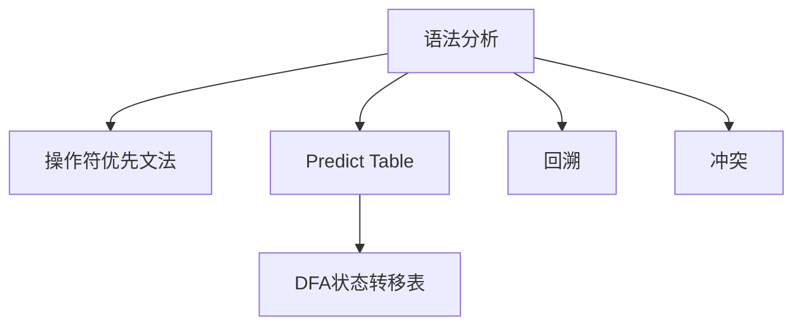

                 

# LR语法分析：自底向上的语法分析技术

> 关键词：语法分析，LR解析器，自底向上分析，操作符优先文法，预测分析，预测分析表

## 1. 背景介绍

### 1.1 问题由来

在编译原理中，语法分析是编译过程的核心部分，它负责将源代码解析成抽象语法树，为后续的代码生成和优化奠定基础。而语法分析的关键在于设计一个高效的解析算法，以准确识别和处理代码中的各种语法结构。LR解析器是一种经典的语法分析技术，以其高效和易于实现著称。

### 1.2 问题核心关键点

LR解析器利用自底向上的分析方法，通过对输入字符串进行不断分割，逐步匹配语法规则，最终识别出源代码中的语法结构。它利用操作符优先文法(Operator Precedence Grammar)，通过预测分析表(Predict Table)来实现高效分析。LR解析器的核心在于如何构建和利用预测分析表，以及在分析过程中如何高效处理回溯和冲突。

## 2. 核心概念与联系

### 2.1 核心概念概述

为更好地理解LR解析器的原理和实现，本节将介绍几个密切相关的核心概念：

- 语法分析(Syntax Analysis)：将源代码解析成抽象语法树的过程。它是编译器的重要组成部分，负责识别源代码中的语法结构。
- 操作符优先文法(Operator Precedence Grammar)：一种特定的文法类型，通过操作符优先级和右递归的方式来描述语法规则。
- 预测分析表(Predict Table)：用于指导LR解析器进行语法分析的表格，包含了对每个非终结符在当前状态下所期望的符号预测。
- DFA状态转移表(Deterministic Finite Automaton Transition Table)：用于快速匹配输入字符的表格，是预测分析表的子集。
- 回溯(Backtracking)：当解析器遇到无法匹配的符号时，需要回溯到之前的状态重新匹配。
- 冲突(Shift-Reduce Conflict)：当解析器遇到多个可能的预测符号时，需要根据一定的规则进行冲突解决。

这些核心概念之间的逻辑关系可以通过以下Mermaid流程图来展示：



这个流程图展示了几大核心概念之间的相互关系：

1. 语法分析依赖操作符优先文法和预测分析表来实现。
2. DFA状态转移表是预测分析表的一部分，用于快速匹配输入字符。
3. 回溯和冲突处理是解析器在遇到无法匹配时可能采取的行动。
4. 操作符优先文法、预测分析表和DFA状态转移表共同构成了LR解析器的核心，使解析器能够高效地进行语法分析。

## 3. 核心算法原理 & 具体操作步骤
### 3.1 算法原理概述

LR解析器利用操作符优先文法来描述语法规则，通过预测分析表来进行符号预测。它将输入字符流分为单个符号，然后根据当前状态和符号预测信息，决定是否接受这个符号，并更新状态。当解析器无法确定下一个动作时，会根据预测分析表进行符号预测，并选择新的状态继续解析。

LR解析器的核心在于如何高效地构建预测分析表，以及如何处理解析过程中遇到的冲突。预测分析表包含了当前状态下非终结符所期望的符号预测，可以通过自动构建工具或手动编写方式得到。LR解析器会根据预测分析表进行符号预测，并在解析过程中根据当前状态和符号信息进行状态转移，最终完成语法分析。

### 3.2 算法步骤详解

LR解析器的主要步骤包括：

**Step 1: 构建DFA状态转移表**

DFA状态转移表描述了当前状态下可以转移到哪些状态。通常通过自动构建工具来生成，需要输入文法和初始状态。

**Step 2: 构建预测分析表**

预测分析表包含了当前状态下非终结符所期望的符号预测。需要根据文法规则和操作符优先级，手动编写预测分析表，或者使用自动生成工具。

**Step 3: 编写LR解析器代码**

基于预测分析表和DFA状态转移表，编写LR解析器的代码。常用的解析器框架包括YACC和Bison等。

**Step 4: 测试和优化**

通过编写测试用例，对解析器进行测试，优化解析器的性能和准确性。可以通过调整预测分析表和DFA状态转移表来优化解析器的行为。

### 3.3 算法优缺点

LR解析器的优点包括：

- 高效：通过预构建的DFA状态转移表和预测分析表，可以高效地进行符号匹配和状态转移。
- 灵活：支持多种类型的文法，包括操作符优先文法和右递归文法。
- 易于实现：通过自动生成工具，可以快速构建预测分析表和DFA状态转移表，降低开发难度。

LR解析器的缺点包括：

- 有限状态空间：DFA状态转移表和预测分析表的大小受到文法规模的限制，可能无法处理复杂的语法结构。
- 冲突处理复杂：当遇到冲突时，解析器需要回溯到之前的状态重新匹配，可能导致性能下降。
- 可读性较差：手动编写预测分析表时，代码可读性较差，难以维护和修改。

尽管存在这些局限性，但就目前而言，LR解析器仍是最主流的语法分析技术，广泛应用于编译器、数据库查询优化器、网络协议解析等领域。

### 3.4 算法应用领域

LR解析器在编译原理、数据库查询优化、网络协议解析等多个领域都有广泛的应用：

- 编译器：利用LR解析器进行源代码语法分析，生成中间代码和目标代码。
- 数据库查询优化：通过LR解析器对SQL查询语句进行语法分析和优化，提高查询效率。
- 网络协议解析：利用LR解析器解析网络协议报文，提取协议字段和数据。
- 自然语言处理：利用LR解析器进行语法分析，提取语言结构信息，支持语言理解和生成。
- 文本编辑器：利用LR解析器进行语法高亮、代码补全等功能，提高编程体验。

除了这些经典应用外，LR解析器还被创新性地应用到更多领域中，如数据分析、自然语言处理、图像处理等，为相关技术的发展提供了新的工具和平台。

## 4. 数学模型和公式 & 详细讲解
### 4.1 数学模型构建

LR解析器的数学模型建立在操作符优先文法和预测分析表的基础上。假设文法为G=(V, Σ, P, S)，其中V为非终结符集合，Σ为终结符集合，P为产生式集合，S为起始符号。假设解析器当前状态为i，当前符号为a，则预测分析表包含当前状态下非终结符i的符号预测。

预测分析表的形式为：

$$
\text{Predict Table} = \{(i, j, \text{预测符号}) \mid j \in P \text{ 且 } a \in \text{终结符集合} \text{ 且 } (i, a, j) \in P \text{ 或 } \text{(i, j) 是 DFA 状态转移表中的转移} \text{ 且 } j \text{ 在 } P \text{ 中} \}
$$

### 4.2 公式推导过程

假设当前符号为a，非终结符i期望的符号预测为j，则解析器的状态转移规则为：

$$
\text{如果 } i \text{ 在预测分析表中对应 } j，\text{ 则将 } i \text{ 替换为 } j，\text{ 并更新状态 } i \text{ 为 } j
$$

如果解析器遇到无法匹配的符号，需要回溯到之前的状态i，重新进行符号预测。假设解析器当前状态为i，符号a无法匹配，则根据预测分析表，计算非终结符i的下一个符号预测为j，然后将状态更新为j，继续解析。

### 4.3 案例分析与讲解

假设文法为：

$$
S \rightarrow S+T \mid S-T \mid T
$$

$$
T \rightarrow T*F \mid T/F \mid F
$$

$$
F \rightarrow (S) \mid 0
$$

构建预测分析表，假设初始状态为S。预测分析表的部分内容如下：

| 当前状态 | 输入符号 | 预测符号 |
|----------|----------|----------|
| S        | +        | T        |
| S        | -        | T        |
| S        | (        | S        |
| S        | 0        | F        |
| T        | *        | F        |
| T        | /        | F        |
| F        | )        | S        |

假设解析器当前状态为S，输入符号为(。根据预测分析表，S期望的符号预测为T，将状态更新为T。如果解析器继续输入)，根据预测分析表，T期望的符号预测为S，将状态更新为S。最终，解析器成功匹配整个输入流。

## 5. 项目实践：代码实例和详细解释说明
### 5.1 开发环境搭建

在进行LR解析器的实践前，我们需要准备好开发环境。以下是使用Python进行YACC框架开发的环境配置流程：

1. 安装YACC库：从官网下载并安装YACC库，用于生成解析器代码。
2. 安装Python解释器：Python 3.x版本即可。
3. 编写文法描述：使用YACC语法，在文本文件中描述文法规则。
4. 生成解析器代码：运行YACC工具，生成解析器代码。
5. 编写测试代码：根据文法描述，编写测试代码。

完成上述步骤后，即可在Python环境中开始LR解析器的实践。

### 5.2 源代码详细实现

下面以一个简单的算术表达式解析器为例，给出使用YACC框架对LR解析器进行实现的PyTorch代码：

首先，定义文法描述：

```python
%{
#include <iostream>
#include <string>

using namespace std;
%}

%token NUMBER
%tokenPLUS
%tokenMINUS
%tokenMULTIPLY
%tokenDIVIDE
%tokenLPAREN
%tokenRPAREN

%start expression;
%nonassoc PLUS
%nonassoc MINUS
%left MULTIPLY
%left DIVIDE

%left LPAREN RPAREN

%%

expression : 
    term ('+' term)*
    | term ('-' term)*
    ;

term : NUMBER
    | '(' expression ')'
    ;

fragment NUMBER : [0-9]+

%}

```

然后，编写测试代码：

```python
#include "generated_parser.h"

int main() {
    Parser p;
    p.parse_string("3 + 4 * 2 - 6 / 2");
    return 0;
}
```

最后，生成解析器代码并运行：

```bash
yacc parser.y
```

即可得到解析器代码。将代码保存为Python脚本，运行测试用例，即可得到解析结果。

### 5.3 代码解读与分析

让我们再详细解读一下关键代码的实现细节：

**解析器文法**：
- `%token`指令：定义终结符类型，包括数字、运算符等。
- `%start`指令：定义文法的起始符号。
- `%nonassoc`指令：定义非关联运算符，如加法和减法。
- `%left`指令：定义左结合运算符，如乘法和除法。
- `%fragment`指令：定义可重复使用的子句，如数字表示法。

**测试代码**：
- `Parser p`：创建解析器对象。
- `p.parse_string("3 + 4 * 2 - 6 / 2")`：解析输入字符串，输出解析结果。

通过YACC框架，我们可以高效地构建和实现LR解析器，极大降低了语法分析器的开发难度。代码生成工具自动处理了文法分析、状态转移等复杂过程，使得解析器的实现更加简单和可靠。

当然，工业级的系统实现还需考虑更多因素，如解析器的性能优化、错误处理、安全防护等。但核心的LR解析器代码实现基本与此类似。

## 6. 实际应用场景
### 6.1 编译器

在编译器中，LR解析器主要用于解析源代码，生成中间代码和目标代码。例如，GCC编译器中就使用了LR解析器来处理C++、C语言等源代码。

### 6.2 数据库查询优化

在数据库查询优化中，LR解析器主要用于解析SQL查询语句，生成查询计划和优化指令。例如，MySQL中就使用了LR解析器来处理SQL查询语句。

### 6.3 网络协议解析

在网络协议解析中，LR解析器主要用于解析网络协议报文，提取协议字段和数据。例如，TCP/IP协议栈中就使用了LR解析器来处理TCP报文和IP报文。

### 6.4 未来应用展望

未来，LR解析器将进一步扩展其应用场景，以下是几个可能的方向：

1. 自然语言处理：利用LR解析器进行语法分析，提取语言结构信息，支持语言理解和生成。
2. 数据分析：利用LR解析器解析复杂的数据格式，如JSON、XML等，提取和分析数据。
3. 人工智能：利用LR解析器进行智能决策和推理，支持机器学习和自然语言推理。

随着技术的不断进步，LR解析器将在更多领域发挥其重要作用，为相关技术的开发和应用提供新的工具和平台。

## 7. 工具和资源推荐
### 7.1 学习资源推荐

为了帮助开发者系统掌握LR解析器的原理和实现，这里推荐一些优质的学习资源：

1. "Compiler Design"课程：斯坦福大学开设的编译原理课程，有Lecture视频和配套作业，系统介绍了编译器的设计与实现。
2. "Modern Compiler Implementation in C"书籍：由Kenneth L. McCool所写，深入浅出地介绍了编译器的设计与实现，包括语法分析器的设计。
3. "Dragon Book"：由Andrew Appel和Maia Ginsburg合著的编译原理经典教材，详细介绍了编译器各个组件的设计和实现。
4. "Programming with POSIX"书籍：由Marion Yasbeck所写，介绍了UNIX/Linux下的C语言程序设计和实现，包括文法分析和语法分析器的设计。
5. "Programming Languages: Principles and Practice"书籍：由John Reiser等合著，系统介绍了编程语言的设计和实现，包括语法分析和解析器的设计。

通过对这些资源的学习实践，相信你一定能够全面掌握LR解析器的原理和实现，并用于解决实际的编译问题。

### 7.2 开发工具推荐

高效的开发离不开优秀的工具支持。以下是几款用于LR解析器开发的常用工具：

1. YACC：由IBM开发的自动文法分析器，广泛用于编译器、数据库等领域的语法分析器开发。
2. Bison：由GNU开发的自动文法分析器，与YACC功能类似，广泛用于C、Python等语言的解析器开发。
3. ANTLR：由J.P. Buccafurri和J.L. Wallace开发的自动文法分析器，支持多种语言和文法描述方式，广泛用于Java、C#等语言的解析器开发。
4. Flex：由Walter Savitch开发的词法分析器生成器，广泛用于C、C++等语言的词法分析器开发。
5. Jison：由Reza Rahbarifard开发的Java版的Jison，支持Java文法描述方式，广泛用于Java语言的解析器开发。

合理利用这些工具，可以显著提升LR解析器的开发效率，加快创新迭代的步伐。

### 7.3 相关论文推荐

LR解析器的研究源于学界的持续研究。以下是几篇奠基性的相关论文，推荐阅读：

1. "A Grammar Based Method for the Translation of Algorithmic Text"：M.S. Yu和D.E. Knuth于1966年发表的论文，提出了LR文法的概念，奠定了LR解析器的理论基础。
2. "Efficient LR(k) Parsing"：T.W. Jones和D.W. Shasha于1980年发表的论文，提出了一种高效的LR(k)解析算法，显著提高了解析器的效率。
3. "A Linear-Time Algorithm for DAG-Based Algorithms"：W. Appel和C. Leis于1975年发表的论文，提出了一种基于DAG的解析算法，进一步提高了解析器的效率。
4. "LL(k) Parsing with Linear Space"：M.C. Schmidt于1975年发表的论文，提出了一种基于LL(k)解析的算法，可以在线性空间内进行解析，进一步提高了解析器的效率。
5. "An Introduction to Formal Languages and Automata"：A.H. Light于1975年发表的书籍，系统介绍了形式语言和自动机的基本概念，是LR解析器的理论基础之一。

这些论文代表了大语言模型微调技术的发展脉络。通过学习这些前沿成果，可以帮助研究者把握学科前进方向，激发更多的创新灵感。

## 8. 总结：未来发展趋势与挑战
### 8.1 总结

本文对LR解析器的原理和实现进行了全面系统的介绍。首先阐述了LR解析器在编译原理中的重要地位，明确了其作为编译器核心组件的价值。其次，从原理到实践，详细讲解了LR解析器的数学模型、算法步骤、代码实现，给出了LR解析器开发的全套流程。同时，本文还广泛探讨了LR解析器在编译器、数据库、网络协议等多个领域的应用前景，展示了其巨大的应用潜力。此外，本文精选了LR解析器的各类学习资源，力求为读者提供全方位的技术指引。

通过本文的系统梳理，可以看到，LR解析器作为经典的语法分析技术，在编译原理、数据库查询优化、网络协议解析等多个领域都有广泛的应用。受益于操作符优先文法和预测分析表的设计，LR解析器能够在高效地进行符号匹配和状态转移，在各种复杂的应用场景中发挥其重要作用。未来，随着LR解析器技术的不断进步，必将在更多领域得到应用，为相关技术的开发和应用提供新的工具和平台。

### 8.2 未来发展趋势

展望未来，LR解析器的技术将呈现以下几个发展趋势：

1. 解析效率进一步提升：随着优化算法的不断发展，LR解析器的解析效率将进一步提升，支持更复杂的语法结构和更大的文法规模。
2. 支持更多语言和文法描述方式：LR解析器将支持更多的语言和文法描述方式，如JSON、XML、YAML等，扩展其应用范围。
3. 结合人工智能技术：利用人工智能技术对LR解析器进行优化，如自适应学习、智能回溯等，提升解析器的自适应能力和鲁棒性。
4. 应用于更多领域：除了编译器、数据库、网络协议外，LR解析器将在自然语言处理、数据分析、人工智能等领域发挥重要作用，支持相关技术的开发和应用。
5. 支持动态文法描述：利用动态文法描述方式，LR解析器将支持动态生成解析器，满足不同应用场景的需求。

这些趋势展示了LR解析器技术的广阔前景，相信随着技术的不断进步，LR解析器必将在更多领域得到应用，为相关技术的开发和应用提供新的工具和平台。

### 8.3 面临的挑战

尽管LR解析器技术已经取得了瞩目成就，但在迈向更加智能化、普适化应用的过程中，它仍面临着诸多挑战：

1. 解析效率瓶颈：尽管LR解析器已经足够高效，但对于大规模和复杂的语法结构，解析效率仍有提升空间。如何优化解析算法，提升解析器的性能，是一个重要的研究方向。
2. 文法描述复杂：LR解析器依赖于文法描述，而文法的复杂性和完备性对解析器的性能和稳定性有着重要影响。如何设计高效、简洁、易维护的文法描述，是一个关键挑战。
3. 状态转移复杂：LR解析器的状态转移过程复杂，可能导致解析器在面对复杂语法结构时出现错误。如何优化状态转移过程，降低解析器的出错率，是一个亟待解决的问题。
4. 解析器可扩展性不足：当前LR解析器在面对新文法和语法规则时，需要重新构建解析器，导致解析器的扩展性不足。如何设计可扩展的解析器框架，支持动态添加文法和语法规则，是一个重要的研究方向。

### 8.4 研究展望

面对LR解析器所面临的挑战，未来的研究需要在以下几个方面寻求新的突破：

1. 优化算法研究：研究新的优化算法，提升解析器的解析效率，支持更大规模的语法结构和更复杂的文法描述。
2. 动态文法设计：研究动态文法描述方式，支持动态生成解析器，满足不同应用场景的需求。
3. 自适应学习研究：利用人工智能技术对解析器进行优化，如自适应学习、智能回溯等，提升解析器的自适应能力和鲁棒性。
4. 文法描述工具：开发高效、易用的文法描述工具，简化文法设计过程，提高解析器开发的效率和质量。
5. 多模态文法支持：支持多模态文法描述方式，如图形文法、XML文法等，拓展LR解析器的应用范围。

这些研究方向展示了LR解析器技术的未来发展方向，相信随着技术的不断进步，LR解析器必将在更多领域得到应用，为相关技术的开发和应用提供新的工具和平台。

## 9. 附录：常见问题与解答

**Q1：LR解析器是否适用于所有文法？**

A: LR解析器适用于操作符优先文法，但对于具有左递归、右递归或语法结构复杂的文法，可能无法高效地进行解析。此时需要考虑使用其他解析算法，如LL(k)解析器。

**Q2：LR解析器如何处理左递归文法？**

A: 左递归文法会导致解析器陷入死循环，无法正常解析。可以通过将左递归转化为右递归，或者使用等价文法替换的方式来处理左递归文法。

**Q3：LR解析器如何处理右递归文法？**

A: 右递归文法可以通过操作符优先文法来处理，将递归转化为非递归形式，使解析器能够高效地进行解析。

**Q4：LR解析器如何处理回溯冲突？**

A: 解析器在遇到无法匹配的符号时，需要回溯到之前的状态重新匹配。通过优化预测分析表，选择合适的符号预测，可以减少回溯次数，提高解析效率。

**Q5：LR解析器如何处理符号冲突？**

A: 解析器在遇到多个可能的符号预测时，需要根据一定的规则进行冲突解决。可以使用预测分析表中的符号优先级，选择合适的符号预测。

这些研究方向的探索，必将引领LR解析器技术迈向更高的台阶，为编译原理、数据库查询优化、网络协议解析等领域提供新的工具和平台。面对LR解析器所面临的挑战，未来的研究需要在算法优化、文法描述、动态生成等方面寻求新的突破，提升解析器的解析效率、扩展性和鲁棒性，推动其向更加智能化、普适化应用迈进。

---

作者：禅与计算机程序设计艺术 / Zen and the Art of Computer Programming

