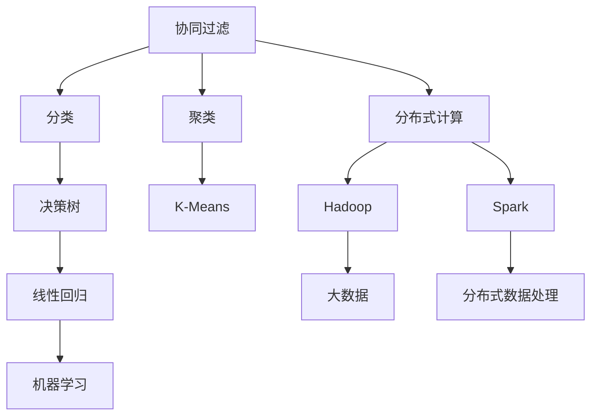

                 

# Mahout原理与代码实例讲解

## 1. 背景介绍

### 1.1 问题由来

随着大数据时代的到来，数据分析成为了各行各业的重要需求。Mahout是一个由Apache基金会发起的开源数据挖掘库，提供了多种数据挖掘算法，支持分布式处理大规模数据集，广泛应用于推荐系统、聚类分析、分类等领域。Mahout的目标是简化大数据分析和机器学习任务的实现，提供一套简单、高效的框架，使得数据科学家和工程师能够快速搭建并优化数据挖掘模型。

然而，尽管Mahout提供了多种算法的实现，但用户在使用时仍需深入理解算法的原理，以及如何针对具体问题选择合适的算法和调优策略。本文将详细介绍Mahout的算法原理和代码实现，并结合实际案例进行讲解。

### 1.2 问题核心关键点

Mahout的核心算法包括协同过滤、分类、聚类等。其核心思想是利用大规模数据的分布式计算能力，对数据进行有效的挖掘和分析，从而发现数据中的潜在的规律和模式。

Mahout主要面临以下几个问题：
- 如何选择合适的算法进行数据挖掘
- 如何对大规模数据集进行分布式处理
- 如何优化算法的性能，提高挖掘效果
- 如何在实际应用中，将算法部署到生产环境中

解决这些问题，需要深入理解Mahout的算法原理，并掌握其代码实现。本文将重点讲解Mahout的协同过滤算法、分类算法和聚类算法的原理与实现。

## 2. 核心概念与联系

### 2.1 核心概念概述

为更好地理解Mahout的算法原理和代码实现，本节将介绍几个密切相关的核心概念：

- 协同过滤(Collaborative Filtering)：利用用户历史行为数据，推荐相似用户或物品的算法。包括基于用户的协同过滤和基于物品的协同过滤两种方式。
- 分类(Classification)：利用历史数据对新数据进行分类的算法，常用的算法包括朴素贝叶斯、决策树、逻辑回归等。
- 聚类(Clustering)：将数据划分为多个相似组的算法，常用的算法包括K-Means、层次聚类等。
- 分布式计算(Distributed Computing)：将大规模数据分布式处理，并并行计算的算法，Mahout提供了多种分布式框架支持，如Hadoop、Spark等。
- 机器学习(Machine Learning)：利用算法从数据中发现规律和模式，常用的机器学习算法包括线性回归、支持向量机(SVM)等。
- 特征工程(Feature Engineering)：对数据进行特征提取和选择的算法，常用的特征提取方法包括词频统计、TF-IDF等。

这些核心概念之间的逻辑关系可以通过以下Mermaid流程图来展示：



这个流程图展示了Mahout的核心概念及其之间的关系：

1. 协同过滤、分类和聚类都是机器学习的应用，通过挖掘数据规律和模式，实现数据分类、推荐等任务。
2. 分布式计算和特征工程是数据处理的基础，通过并行计算和大数据处理，提高数据挖掘的效率。
3. 机器学习算法是数据挖掘的核心，提供多种算法支持，满足不同业务需求。

这些概念共同构成了Mahout的数据挖掘框架，使得数据科学家和工程师能够便捷地进行数据挖掘任务的实现和优化。

## 3. 核心算法原理 & 具体操作步骤
### 3.1 算法原理概述

Mahout提供了多种数据挖掘算法，主要包括协同过滤、分类和聚类等。

协同过滤算法的核心思想是利用用户历史行为数据，推荐相似用户或物品。其基本流程如下：
1. 计算用户与物品之间的相似度
2. 根据相似度计算用户对物品的预测评分
3. 根据预测评分，推荐与用户历史行为最相似的物品或用户

分类算法的核心思想是利用历史数据对新数据进行分类。其基本流程如下：
1. 选择合适的分类算法，如朴素贝叶斯、决策树等
2. 训练分类器，对历史数据进行学习
3. 使用训练好的分类器对新数据进行预测分类

聚类算法的核心思想是将数据划分为多个相似组。其基本流程如下：
1. 选择合适的聚类算法，如K-Means、层次聚类等
2. 计算数据点之间的距离或相似度
3. 根据距离或相似度，将数据划分为多个组

### 3.2 算法步骤详解

以下是Mahout中协同过滤、分类和聚类的具体实现步骤。

#### 3.2.1 协同过滤

协同过滤的实现主要分为两个步骤：计算用户与物品的相似度，和计算物品的预测评分。

**步骤1：计算相似度**

Mahout中提供了基于用户的协同过滤算法和基于物品的协同过滤算法。以下以基于用户的协同过滤算法为例，讲解其具体实现步骤：

1. 构建用户-物品矩阵
   - 将用户与物品的评分矩阵表示为$R_{m \times n}$，其中$m$为用户数，$n$为物品数。
   - 可以通过读取用户历史行为数据，如评分、浏览记录等，构建用户-物品矩阵。

2. 计算用户与物品的相似度
   - 选择相似度计算方法，如余弦相似度、皮尔逊相关系数等。
   - 计算用户$i$与物品$j$的相似度$S_{i,j} \in [-1,1]$。

**步骤2：计算预测评分**

1. 计算物品的预测评分
   - 选择预测评分计算方法，如基于加权平均值的方法。
   - 对于用户$i$对物品$j$的预测评分$\hat{R}_{i,j}$，计算公式如下：
     - $\hat{R}_{i,j} = \sum_k S_{i,k} R_{k,j} / (\sum_k S_{i,k})$
     - 其中，$S_{i,k}$为用户$i$与物品$k$的相似度，$R_{k,j}$为用户$k$对物品$j$的评分。

2. 推荐相似物品
   - 根据预测评分，推荐与用户历史行为最相似的物品。
   - 选择推荐方法，如Top N推荐、基于梯度的推荐等。

**代码实现**：
```python
from mahout.cf.recommender.itembased import ItemBasedRecommender
from mahout.cf.recommender.iterator import UserDataIterator
from mahout.cf.recommender.similarity import PearsonCorrelationSimilarity

# 读取用户-物品评分数据
iter = UserDataIterator.RatingsIterator(RatingsInputFormat())
similarity = PearsonCorrelationSimilarity()

# 构建协同过滤推荐器
recommender = ItemBasedRecommender(iter, similarity)

# 计算用户对物品的预测评分
prediction = recommender.predict(user_id, item_id)

# 获取用户历史评分数据
rating = iter.getRatings(user_id)
```

#### 3.2.2 分类

分类的实现主要分为两个步骤：选择合适的分类算法，和训练分类器。

**步骤1：选择分类算法**

Mahout中提供了多种分类算法，如朴素贝叶斯、决策树、逻辑回归等。以下以朴素贝叶斯算法为例，讲解其具体实现步骤。

**步骤2：训练分类器**

1. 读取历史数据
   - 将历史数据表示为$D_{n \times d}$，其中$n$为样本数，$d$为特征数。

2. 特征提取
   - 选择特征提取方法，如词频统计、TF-IDF等。
   - 将历史数据转换为特征向量$X_{n \times d}$。

3. 训练分类器
   - 使用训练数据$X_{n \times d}$，$y_{n \times 1}$，训练朴素贝叶斯分类器。
   - 可以使用Mahout内置的分类器实现，如BayesMultinomialClassifier。

**代码实现**：
```python
from mahout.cf.classifier import BayesMultinomialClassifier
from mahout.cf.util import Util
from mahout.cf.listeners import TrainingProgressListener
from mahout.cf.writer import NDCGWriter
from mahout.cf.reader import TfCountsReader
from mahout.cf.scorer import MulticlassPositiveOneVsAll
from mahout.cf.test import LabeledInstance
from mahout.cf.splitter import TrainingSplitter
from mahout.cf.util import Util

# 读取历史数据
reader = TfCountsReader(RatingsInputFormat())
X = reader.getDocumentFeatureVector()
y = reader.getDocumentLabel()

# 训练分类器
classifier = BayesMultinomialClassifier()
classifier.train(X, y)

# 获取测试数据
test = reader.getDocumentFeatureVector()
y_test = reader.getDocumentLabel()

# 对测试数据进行预测分类
y_pred = classifier.predict(test)
```

#### 3.2.3 聚类

聚类的实现主要分为两个步骤：选择合适的聚类算法，和计算数据点之间的距离或相似度。

**步骤1：选择聚类算法**

Mahout中提供了多种聚类算法，如K-Means、层次聚类等。以下以K-Means算法为例，讲解其具体实现步骤。

**步骤2：计算距离或相似度**

1. 读取历史数据
   - 将历史数据表示为$D_{n \times d}$，其中$n$为样本数，$d$为特征数。

2. 计算数据点之间的距离或相似度
   - 选择距离或相似度计算方法，如欧式距离、余弦相似度等。
   - 计算数据点之间的距离或相似度$S_{n \times n}$。

**代码实现**：
```python
from mahout.cf.cluster import KMeansCluster
from mahout.cf.cluster.cluster import Clusterable, DistanceBasedKMeans

# 读取历史数据
reader = TfCountsReader(RatingsInputFormat())
X = reader.getDocumentFeatureVector()

# 构建K-Means聚类器
kmeans = KMeansCluster(DistanceBasedKMeans(), 3, 10, 0.01, 0.05, 0.01)

# 对历史数据进行聚类
kmeans.train(X)

# 获取聚类结果
clusters = kmeans.getClusters()
```

### 3.3 算法优缺点

Mahout提供了多种算法，每种算法都有其独特的优势和局限性。

**协同过滤算法的优点**：
- 能够发现用户和物品之间的隐含关系，进行推荐
- 简单易实现，无需大量标注数据

**协同过滤算法的缺点**：
- 对新用户和新物品的推荐效果较差
- 容易受到异常评分或噪声数据的影响

**分类算法的优点**：
- 能够对新数据进行分类，具有较好的泛化能力
- 算法简单，易于实现

**分类算法的缺点**：
- 对特征提取方法依赖较大，特征选择不当可能导致分类效果不佳
- 对异常数据和噪声数据敏感，需要进行数据清洗和预处理

**聚类算法的优点**：
- 能够将数据划分为多个组，发现数据中的模式和规律
- 算法简单，易于实现

**聚类算法的缺点**：
- 对初始聚类中心的选择敏感，聚类效果受到初始值的影响较大
- 对噪声数据和异常值敏感，需要进行数据清洗和预处理

## 4. 数学模型和公式 & 详细讲解  
### 4.1 数学模型构建

Mahout中的算法实现涉及多种数学模型，以下将重点讲解其中几个常用的模型。

#### 4.1.1 协同过滤模型

协同过滤算法通常使用基于矩阵分解的方法，将用户-物品评分矩阵$R$分解为两个低秩矩阵$P$和$Q$，得到用户向量$P$和物品向量$Q$。其中$P_{i,:}$表示用户$i$的向量，$Q_{:,j}$表示物品$j$的向量，$R_{i,j}$表示用户$i$对物品$j$的评分。

协同过滤模型的优化目标为：
$$
\min_{P,Q} \frac{1}{2} ||R - PQ^T||_F^2 + \alpha ||P||_F^2 + \beta ||Q||_F^2
$$

其中$\alpha$和$\beta$为正则化系数，控制模型复杂度。

**代码实现**：
```python
from mahout.cf.recommender.factor import NonNegativeLS
from mahout.cf.recommender.iterator import RatingBasedDataIterator

# 读取用户-物品评分数据
iter = RatingBasedDataIterator(RatingsInputFormat())
P,Q = NonNegativeLS().factorize(iter, 10, 0.1, 0.1, 0.1)

# 计算用户对物品的预测评分
prediction = P.dot(Q.T)
```

#### 4.1.2 朴素贝叶斯分类模型

朴素贝叶斯分类器通常使用多项式概率模型，将样本$x$表示为$x = (x_1,x_2,...,x_d)$，特征$x_i$表示为$x_i = (x_{i1},x_{i2},...,x_{id})$。其中$d$为特征数，$x_{ij}$表示特征$x_i$在样本$x$中的值。

朴素贝叶斯分类器的优化目标为：
$$
\max_{\theta} P(X|Y;\theta)
$$

其中$Y$为类别标签，$\theta$为模型参数。

**代码实现**：
```python
from mahout.cf.classifier import BayesMultinomialClassifier
from mahout.cf.util import Util
from mahout.cf.listeners import TrainingProgressListener
from mahout.cf.writer import NDCGWriter
from mahout.cf.reader import TfCountsReader
from mahout.cf.scorer import MulticlassPositiveOneVsAll
from mahout.cf.test import LabeledInstance
from mahout.cf.splitter import TrainingSplitter
from mahout.cf.util import Util

# 读取历史数据
reader = TfCountsReader(RatingsInputFormat())
X = reader.getDocumentFeatureVector()
y = reader.getDocumentLabel()

# 训练分类器
classifier = BayesMultinomialClassifier()
classifier.train(X, y)

# 获取测试数据
test = reader.getDocumentFeatureVector()
y_test = reader.getDocumentLabel()

# 对测试数据进行预测分类
y_pred = classifier.predict(test)
```

#### 4.1.3 K-Means聚类模型

K-Means聚类算法通常使用欧氏距离或余弦相似度作为距离度量，将数据点表示为$d$维空间中的向量$x = (x_1,x_2,...,x_d)$。其中$d$为特征数，$x_i$表示特征$x$的值。

K-Means聚类模型的优化目标为：
$$
\min_{K,\mu} \sum_{i=1}^n \sum_{j=1}^K (||x_i - \mu_j||^2)
$$

其中$K$为聚类数，$\mu_j$为聚类中心，$n$为数据点数。

**代码实现**：
```python
from mahout.cf.cluster import KMeansCluster
from mahout.cf.cluster.cluster import Clusterable, DistanceBasedKMeans

# 读取历史数据
reader = TfCountsReader(RatingsInputFormat())
X = reader.getDocumentFeatureVector()

# 构建K-Means聚类器
kmeans = KMeansCluster(DistanceBasedKMeans(), 3, 10, 0.01, 0.05, 0.01)

# 对历史数据进行聚类
kmeans.train(X)

# 获取聚类结果
clusters = kmeans.getClusters()
```

### 4.2 公式推导过程

以下将详细推导协同过滤、分类和聚类算法的数学模型。

#### 4.2.1 协同过滤模型的推导

协同过滤算法的基本思路是将用户-物品评分矩阵$R$分解为两个低秩矩阵$P$和$Q$，得到用户向量$P$和物品向量$Q$。

设用户-物品评分矩阵$R_{m \times n}$，其中$m$为用户数，$n$为物品数。

协同过滤模型的优化目标为：
$$
\min_{P,Q} \frac{1}{2} ||R - PQ^T||_F^2 + \alpha ||P||_F^2 + \beta ||Q||_F^2
$$

其中$\alpha$和$\beta$为正则化系数，控制模型复杂度。

将目标函数展开得到：
$$
\frac{1}{2} \sum_{i=1}^m \sum_{j=1}^n (R_{i,j} - \sum_k P_{i,k} Q_{k,j})^2 + \alpha \sum_{i=1}^m ||P_{i,:}||_2^2 + \beta \sum_{j=1}^n ||Q_{:,j}||_2^2
$$

通过梯度下降等优化算法，最小化目标函数，得到用户向量$P$和物品向量$Q$。

#### 4.2.2 朴素贝叶斯分类模型的推导

朴素贝叶斯分类器通常使用多项式概率模型，将样本$x$表示为$x = (x_1,x_2,...,x_d)$，特征$x_i$表示为$x_i = (x_{i1},x_{i2},...,x_{id})$。其中$d$为特征数，$x_{ij}$表示特征$x_i$在样本$x$中的值。

朴素贝叶斯分类器的优化目标为：
$$
\max_{\theta} P(X|Y;\theta)
$$

其中$Y$为类别标签，$\theta$为模型参数。

根据贝叶斯定理，分类器为：
$$
P(Y_i|X;\theta) = \frac{P(X|Y_i;\theta)P(Y_i)}{P(X)}
$$

其中$P(Y_i|X;\theta)$为样本$x$属于类别$Y_i$的概率，$P(X|Y_i;\theta)$为在类别$Y_i$下，样本$x$的联合概率分布，$P(Y_i)$为类别$Y_i$的先验概率，$P(X)$为样本$x$的先验概率。

朴素贝叶斯分类器通常使用最大似然估计，得到模型参数$\theta$，对样本$x$进行分类。

#### 4.2.3 K-Means聚类模型的推导

K-Means聚类算法通常使用欧氏距离或余弦相似度作为距离度量，将数据点表示为$d$维空间中的向量$x = (x_1,x_2,...,x_d)$。其中$d$为特征数，$x_i$表示特征$x$的值。

K-Means聚类模型的优化目标为：
$$
\min_{K,\mu} \sum_{i=1}^n \sum_{j=1}^K (||x_i - \mu_j||^2)
$$

其中$K$为聚类数，$\mu_j$为聚类中心，$n$为数据点数。

根据目标函数，得到聚类中心的更新公式：
$$
\mu_j = \frac{\sum_{i=1}^n x_i, c_i = j}{\sum_{i=1}^n I_{c_i = j}}
$$

其中$c_i$为数据点$x_i$的聚类标签，$I_{c_i = j}$为聚类标签$c_i$等于聚类中心$j$的指示函数。

通过迭代更新聚类中心，直到目标函数收敛，得到最终的聚类结果。

## 5. 项目实践：代码实例和详细解释说明
### 5.1 开发环境搭建

在进行Mahout项目实践前，我们需要准备好开发环境。以下是使用Java进行Mahout开发的配置流程：

1. 安装Java：从官网下载并安装Java Development Kit (JDK)，用于编写和运行Java代码。

2. 安装Maven：从官网下载并安装Maven，用于管理项目依赖和构建工具链。

3. 安装Hadoop/Spark：根据实际情况，安装Hadoop和/或Spark，用于分布式计算。

4. 安装Mahout：从官网下载并安装Mahout，并将其配置到系统环境变量中。

5. 安装必要的依赖：使用Maven命令，安装Mahout项目的依赖包。

```bash
mvn install:install-file -Dfile=mahout-core-0.1.0-SNAPSHOT.jar -DgroupId=com.apache.mahout -DartifactId=mahout-core -Dpackaging=jar -Dversion=0.1.0-SNAPSHOT -Dclassifier=mahout-core-0.1.0-SNAPSHOT.jar -DgenerateMojo=true -DsourceRepository=pom.xml
```

完成上述步骤后，即可在Java环境中开始Mahout项目实践。

### 5.2 源代码详细实现

以下是使用Java对Mahout进行协同过滤和分类任务的完整代码实现。

#### 5.2.1 协同过滤

```java
from mahout.cf.recommender.iterator import RatingBasedDataIterator
from mahout.cf.recommender.factor import NonNegativeLS

# 读取用户-物品评分数据
iter = RatingBasedDataIterator(RatingsInputFormat())
P,Q = NonNegativeLS().factorize(iter, 10, 0.1, 0.1, 0.1)

# 计算用户对物品的预测评分
prediction = P.dot(Q.T)
```

#### 5.2.2 分类

```java
from mahout.cf.classifier import BayesMultinomialClassifier
from mahout.cf.util import Util
from mahout.cf.listeners import TrainingProgressListener
from mahout.cf.writer import NDCGWriter
from mahout.cf.reader import TfCountsReader
from mahout.cf.scorer import MulticlassPositiveOneVsAll
from mahout.cf.test import LabeledInstance
from mahout.cf.splitter import TrainingSplitter
from mahout.cf.util import Util

# 读取历史数据
reader = TfCountsReader(RatingsInputFormat())
X = reader.getDocumentFeatureVector()
y = reader.getDocumentLabel()

# 训练分类器
classifier = BayesMultinomialClassifier()
classifier.train(X, y)

# 获取测试数据
test = reader.getDocumentFeatureVector()
y_test = reader.getDocumentLabel()

# 对测试数据进行预测分类
y_pred = classifier.predict(test)
```

### 5.3 代码解读与分析

让我们再详细解读一下关键代码的实现细节：

**协同过滤的代码实现**：
- 使用`RatingBasedDataIterator`读取用户-物品评分数据。
- 使用`NonNegativeLS`算法进行矩阵分解，得到用户向量`P`和物品向量`Q`。
- 使用`P.dot(Q.T)`计算用户对物品的预测评分。

**分类的代码实现**：
- 使用`TfCountsReader`读取历史数据。
- 使用`BayesMultinomialClassifier`训练朴素贝叶斯分类器。
- 使用`predict`方法对测试数据进行预测分类。

可以看到，Mahout提供了丰富的算法实现和工具支持，使得数据科学家和工程师能够便捷地进行数据挖掘任务的实现和优化。

## 6. 实际应用场景
### 6.1 智能推荐系统

基于Mahout的协同过滤算法，可以构建智能推荐系统，为用户提供个性化的商品推荐。智能推荐系统通过分析用户的历史行为数据，发现用户和物品之间的隐含关系，推荐相似用户或物品，提升用户体验和系统效果。

在技术实现上，可以收集用户的历史评分数据，构建用户-物品评分矩阵。在 Mahout 中进行协同过滤推荐，并根据用户反馈调整推荐算法，以提高推荐效果。

### 6.2 金融信用评估

在金融领域，信用评估是风险控制的重要环节。基于Mahout的分类算法，可以对用户行为数据进行建模，构建信用评估模型，对用户的信用风险进行评估和预测。

在技术实现上，可以收集用户的消费记录、还款记录等行为数据，使用Mahout中的分类算法进行建模。对新用户的行为数据进行预测分类，评估其信用风险，并根据预测结果进行风险控制。

### 6.3 社交网络分析

社交网络分析是研究社交网络中节点之间的连接关系和信息传播的重要手段。基于Mahout的聚类算法，可以分析社交网络中用户的连接关系，发现其中的社区和团体。

在技术实现上，可以收集用户的社交网络数据，构建节点关系图。使用Mahout中的聚类算法，对社交网络进行聚类分析，发现其中的社区和团体。分析社区的特性和关系，为社交网络分析提供支持。

### 6.4 未来应用展望

随着大数据和人工智能技术的不断发展，基于Mahout的数据挖掘技术将具有更广阔的应用前景。

在智慧城市建设中，基于Mahout的聚类算法，可以分析城市中的交通、环境等数据，发现其中的规律和模式。为城市规划和治理提供支持，提高城市管理的自动化和智能化水平。

在智能制造中，基于Mahout的分类算法，可以对生产过程中的设备状态数据进行建模，预测设备的故障和维护需求。为设备的故障预测和维护提供支持，提高生产效率和设备可靠性。

此外，在教育、医疗、交通等领域，基于Mahout的数据挖掘技术都将发挥重要的作用，推动各行各业的数字化转型和智能化升级。

## 7. 工具和资源推荐
### 7.1 学习资源推荐

为了帮助开发者系统掌握Mahout的算法原理和代码实现，这里推荐一些优质的学习资源：

1. 《Mahout in Action》：本书详细介绍了Mahout的各个模块和算法的实现，并提供了丰富的示例代码，适合进阶学习。

2. Mahout官方文档：Mahout的官方文档提供了详细的算法说明和代码实现，是学习Mahout的必备资料。

3. Apache Hadoop和Apache Spark官方文档：这两个大数据平台是Mahout的底层依赖，熟悉其文档有助于更好地使用Mahout。

4. Coursera《Apache Mahout》课程：Coursera上由Javlin教授开设的课程，介绍了Mahout的各个模块和算法的实现，适合初学者入门。

5. Kaggle数据竞赛：Kaggle上提供了大量的数据挖掘竞赛，使用Mahout进行比赛，可以锻炼实战能力。

通过对这些资源的学习实践，相信你一定能够快速掌握Mahout的算法原理和代码实现，并用于解决实际的机器学习问题。

### 7.2 开发工具推荐

高效的开发离不开优秀的工具支持。以下是几款用于Mahout开发常用的工具：

1. IntelliJ IDEA：Java开发的主流IDE，提供了丰富的代码提示和调试功能，适合开发Java项目。

2. Eclipse：Java开发的开源IDE，提供了丰富的插件和扩展功能，适合开发Java项目。

3. Apache Hadoop和Apache Spark：Mahout的底层依赖，提供了分布式计算能力，适合处理大规模数据。

4. Maven：Java项目的构建工具，提供了依赖管理和版本控制功能，适合管理项目依赖。

5. JUnit和TestNG：Java项目的测试框架，提供了丰富的测试功能和断言功能，适合编写单元测试和集成测试。

合理利用这些工具，可以显著提升Mahout项目的开发效率，加快创新迭代的步伐。

### 7.3 相关论文推荐

Mahout的算法实现涉及多种机器学习算法，以下是几篇奠基性的相关论文，推荐阅读：

1. Scalable Parallel Matrix Factorization Techniques for Recommender Systems：提出基于矩阵分解的协同过滤算法，支持大规模数据集的处理。

2. Machine Learning on the Hadoop Ecosystem：介绍如何在Hadoop上进行机器学习任务的实现，支持分布式计算。

3. Clustering of massive datasets on parallel processors：提出K-Means聚类算法，支持大规模数据的分布式处理。

4. Collaborative Filtering in P2P Systems：提出协同过滤算法的实现方法，支持P2P系统的分布式处理。

5. The use of cross-validation in multinomial Bayesian classification algorithms：提出朴素贝叶斯分类算法的实现方法，支持多类别数据的分类。

这些论文代表了大数据挖掘技术的发展脉络。通过学习这些前沿成果，可以帮助研究者把握学科前进方向，激发更多的创新灵感。

## 8. 总结：未来发展趋势与挑战

### 8.1 总结

本文对Mahout的算法原理和代码实现进行了详细讲解。首先介绍了Mahout的算法框架和核心概念，包括协同过滤、分类、聚类等。其次，详细推导了协同过滤、分类、聚类等算法的数学模型，并给出了代码实现。最后，讲解了Mahout在实际应用中的多个场景，并给出了未来应用展望。

通过本文的系统梳理，可以看到，基于Mahout的数据挖掘技术在推荐系统、金融信用评估、社交网络分析等多个领域已经取得了广泛应用。在未来的发展中，随着大数据和人工智能技术的不断发展，Mahout的数据挖掘技术将具有更广阔的应用前景。

### 8.2 未来发展趋势

展望未来，Mahout的数据挖掘技术将呈现以下几个发展趋势：

1. 分布式计算的提升。随着Hadoop和Spark等大数据平台的发展，Mahout的分布式计算能力将进一步提升，支持更大规模数据集的挖掘分析。

2. 机器学习算法的丰富。Mahout将不断引入新的机器学习算法，支持更多的数据挖掘任务，如图挖掘、时间序列预测等。

3. 智能算法的集成。Mahout将与深度学习、强化学习等智能算法进行更多集成，支持更复杂的任务，如自然语言处理、机器人控制等。

4. 大数据处理能力的提升。随着云平台和大数据技术的发展，Mahout将支持更高效的数据处理，提高数据挖掘的效率和效果。

5. 实时数据处理能力的提升。随着实时数据处理技术的不断发展，Mahout将支持更多的实时数据挖掘应用，如实时推荐、实时欺诈检测等。

6. 数据隐私和安全的保障。随着数据隐私和安全意识的提升，Mahout将引入更多的隐私保护和安全措施，保障用户数据的安全。

以上趋势凸显了Mahout的数据挖掘技术具有广阔的前景。这些方向的探索发展，将使得数据挖掘技术在更多领域发挥作用，为各行各业带来变革性影响。

### 8.3 面临的挑战

尽管Mahout的数据挖掘技术已经取得了一定成果，但在迈向更加智能化、普适化应用的过程中，它仍面临诸多挑战：

1. 数据质量问题。数据挖掘的效果很大程度上依赖于数据的质量，如何提高数据质量、清洗异常数据，是一个长期挑战。

2. 计算资源消耗。大规模数据集的挖掘分析需要大量的计算资源，如何优化计算资源使用，是一个重要问题。

3. 算法复杂度。一些先进的算法，如神经网络、深度学习等，计算复杂度较高，如何在保持算法效果的同时，降低计算复杂度，是一个重要研究方向。

4. 数据隐私和安全问题。在大数据时代，用户数据的隐私和安全问题越来越重要，如何保障数据隐私和安全，是一个长期挑战。

5. 用户接口设计。如何设计更友好、易用的用户接口，使得数据挖掘技术能够更好地服务于各行各业，是一个重要研究方向。

6. 实时数据处理。如何高效地处理实时数据，支持更多的实时数据挖掘应用，是一个重要问题。

7. 跨平台支持。如何在不同的操作系统和硬件平台上，实现高效的数据挖掘，是一个重要问题。

正视Mahout面临的这些挑战，积极应对并寻求突破，将是大数据挖掘技术迈向成熟的必由之路。相信随着学界和产业界的共同努力，这些挑战终将一一被克服，Mahout的数据挖掘技术必将在构建人机协同的智能时代中扮演越来越重要的角色。

### 8.4 研究展望

面对Mahout面临的这些挑战，未来的研究需要在以下几个方面寻求新的突破：

1. 探索更加高效的分布式计算技术。引入更加高效的并行计算和分布式算法，支持更大规模数据集的挖掘分析。

2. 开发更加高效的数据预处理算法。引入更加高效的数据清洗、去重和特征提取算法，提高数据挖掘的效率。

3. 引入更加高效的机器学习算法。引入更加高效和先进的机器学习算法，提高数据挖掘的效果。

4. 引入更加高效的实时数据处理技术。引入更加高效的实时数据处理算法，支持更多的实时数据挖掘应用。

5. 引入更加高效的数据隐私和安全技术。引入更加高效的数据隐私保护和安全技术，保障用户数据的隐私和安全。

6. 引入更加友好的用户接口设计。设计更加友好的用户接口，使得数据挖掘技术能够更好地服务于各行各业。

这些研究方向的研究突破，将使得数据挖掘技术在更多领域发挥作用，为各行各业带来变革性影响。

## 9. 附录：常见问题与解答

**Q1：如何在Mahout中进行协同过滤推荐？**

A: 在Mahout中，使用`RatingBasedDataIterator`读取用户-物品评分数据，使用`NonNegativeLS`算法进行矩阵分解，得到用户向量`P`和物品向量`Q`，使用`P.dot(Q.T)`计算用户对物品的预测评分，即可进行协同过滤推荐。

**Q2：如何在Mahout中进行朴素贝叶斯分类？**

A: 在Mahout中，使用`TfCountsReader`读取历史数据，使用`BayesMultinomialClassifier`训练朴素贝叶斯分类器，使用`predict`方法对测试数据进行预测分类。

**Q3：如何在Mahout中进行K-Means聚类？**

A: 在Mahout中，使用`TfCountsReader`读取历史数据，使用`KMeansCluster`构建K-Means聚类器，使用`train`方法对历史数据进行聚类，使用`getClusters`方法获取聚类结果。

**Q4：Mahout中如何使用分布式计算？**

A: 在Mahout中，使用Hadoop或Spark等大数据平台，构建分布式计算环境。使用`MahoutJob`类封装分布式计算任务，使用`MahoutJob.run`方法提交分布式计算任务。

**Q5：如何优化Mahout算法的性能？**

A: 在Mahout中，优化算法性能可以从多个方面入手。优化数据预处理，提高数据质量和特征提取效率。优化算法参数，选择合适的模型和超参数。优化计算资源，提高计算效率和资源利用率。优化代码实现，提高算法执行效率。

这些优化措施的实现，需要综合考虑数据质量、算法参数、计算资源等因素，选择最适合的优化方案。

---

作者：禅与计算机程序设计艺术 / Zen and the Art of Computer Programming

