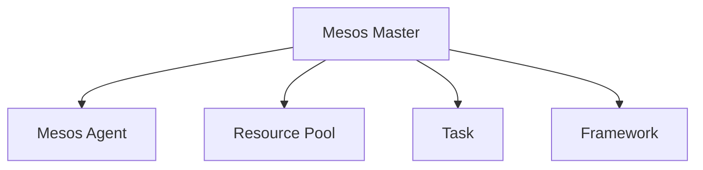

                 

# Mesos原理与代码实例讲解

## 1. 背景介绍

### 1.1 问题由来
随着大规模分布式系统的兴起，如何高效地管理大规模集群资源，成为云计算和数据中心的核心问题之一。传统的中心化资源管理方式，如Hadoop YARN、Hadoop MapReduce等，存在着响应时间长、扩展性差、管理复杂等缺点。而开源分布式资源管理器Mesos，通过集中式调度与分布式执行相结合的方式，打破了这一瓶颈，为大规模分布式系统的构建提供了有力支持。

Mesos（Messaging and Exchange Specification Open Sourced）是一个开源的分布式系统，旨在提高计算和存储资源的利用率，提升云计算和数据中心的性能和弹性。它通过中心化的调度器（Master）和分布式的代理（Agent），实现了资源隔离和动态调度，支持了Hadoop、Spark、RapidMiner等多个数据处理框架。

Mesos在多个行业（如金融、互联网、政府）中得到了广泛应用，帮助企业高效管理集群资源，优化计算成本，提升业务能力。

### 1.2 问题核心关键点
Mesos的核心设计思想包括：
- 集中式调度器与分布式执行：中心化的调度器负责资源分配和任务调度，代理负责执行任务，两者分离，提升系统的可扩展性和稳定性。
- 数据隔离：通过沙箱技术（如沙盒容器），为每个任务分配独立的运行环境，避免资源冲突和数据泄露。
- 动态调度：支持根据资源使用情况动态调整任务，提升资源利用率。
- 高效通信：通过Zookeeper等分布式协调工具，实现代理和调度器之间的通信，保证任务调度和状态更新的一致性和实时性。

## 2. 核心概念与联系

### 2.1 核心概念概述

为更好地理解Mesos的工作原理和架构，本节将介绍几个密切相关的核心概念：

- Mesos Master：中心化的调度器，负责资源的分配和调度，是整个系统的核心。Master将集群资源划分为不同的资源组（Resource Pool），并将任务分配给不同的代理节点。
- Mesos Agent：分布式代理，负责执行任务和报告资源使用情况。Agent周期性地向Master汇报自身资源使用情况，并接受Master分配的任务。
- Resource Pool：集群资源按照不同维度（如CPU、内存、磁盘等）划分为不同的资源组，可以动态调整资源组大小和资源分配方式。
- Task：由Master分配给Agent执行的具体任务，包括Map、Reduce、Spark Job等。
- Framework：运行在Mesos上的应用框架，负责任务调度和管理，如Hadoop、Spark、RapidMiner等。

这些核心概念之间的逻辑关系可以通过以下Mermaid流程图来展示：



这个流程图展示了许多核心概念及其之间的关系：

1. Mesos Master通过划分资源组（Resource Pool）管理集群资源，并将其分配给不同的Mesos Agent。
2. Mesos Agent负责执行Master分配的任务，并定期报告资源使用情况。
3. Task是Master分配给Agent的具体任务，由框架（Framework）负责调度和管理。

这些概念共同构成了Mesos的基本工作框架，使其能够高效地管理集群资源，提升分布式系统的性能和弹性。

## 3. 核心算法原理 & 具体操作步骤

### 3.1 算法原理概述

Mesos的调度算法基于资源调度和任务调度的双重目标。Master通过将集群资源划分为不同的资源组，并对资源组进行优先级和容量限制，实现了资源的动态调整和隔离，提升了系统的灵活性和稳定性。具体而言，Master的调度算法包括以下几个步骤：

1. 资源注册：每个Agent将自身的资源使用情况报告给Master，Master将其添加到资源池中。
2. 任务提交：应用程序框架（如Spark、Hadoop等）将任务提交给Master，Master根据资源组和任务需求进行调度。
3. 资源分配：Master通过竞价算法（如Limited Price）将任务分配给合适的Agent节点，同时考虑任务的优先级、资源组容量等约束条件。
4. 任务执行：被分配任务的Agent节点，根据Master的指令，启动任务并执行。
5. 状态更新：Agent周期性地向Master报告任务执行状态，Master根据任务状态进行调度优化。

### 3.2 算法步骤详解

Mesos的调度算法可以分为以下几个关键步骤：

**Step 1: 资源注册**
- 每个Agent节点启动后，向Master发送资源注册请求。
- Master记录Agent的资源使用情况，将其添加到集群资源池中。

**Step 2: 任务提交**
- 应用程序框架向Master提交任务，指定任务所需资源组、资源类型、优先级等。
- Master根据任务需求和资源可用情况，选择合适的资源组进行调度。

**Step 3: 资源分配**
- Master通过竞价算法（Limited Price），将任务分配给合适的Agent节点。
- 竞价算法优先考虑资源组容量、优先级、任务需求等因素，确保资源的合理分配。

**Step 4: 任务执行**
- Agent根据Master的指令，启动任务并执行。
- 在任务执行过程中，Agent周期性地向Master汇报任务状态，Master根据状态调整资源分配。

**Step 5: 状态更新**
- 应用程序框架周期性地向Master报告任务执行情况。
- Master根据任务状态进行调度优化，如重新分配资源、终止低优先级任务等。

### 3.3 算法优缺点

Mesos调度算法具有以下优点：
1. 高效资源利用：通过竞价算法和动态调度，最大限度地利用集群资源，避免资源浪费。
2. 隔离与隔离：通过沙箱容器等技术，为每个任务分配独立的运行环境，避免资源冲突和数据泄露。
3. 高可靠性：集中式调度器与分布式执行相结合的方式，提升了系统的稳定性和可扩展性。
4. 灵活性：支持动态调整资源组大小和分配方式，适应不同的业务需求。

同时，该算法也存在以下局限性：
1. 中心化调度：Master的性能瓶颈可能成为系统的瓶颈，影响系统扩展性。
2. 网络延迟：Master与Agent之间的通信可能带来网络延迟，影响调度效率。
3. 容错性：Master单点故障可能带来系统宕机，影响系统的可靠性。
4. 调度策略：竞价算法的复杂度较高，可能需要较长的调度时间。

尽管存在这些局限性，但Mesos调度算法在资源管理方面的高效性和灵活性，使其成为当前最主流的分布式资源管理方案之一。

### 3.4 算法应用领域

Mesos调度算法广泛应用于云计算和数据中心，支持了Hadoop、Spark、RapidMiner等多个数据处理框架，涵盖了数据存储、计算、机器学习等多个领域。

在云计算领域，Mesos通过高效资源管理，帮助云服务提供商降低成本，提升资源利用率，支持弹性计算和存储资源的管理。

在数据中心领域，Mesos通过动态调度和资源隔离，确保数据处理任务的稳定性和可靠性，支持大规模数据的存储和分析。

此外，Mesos在金融、医疗、科研等多个行业也得到了广泛应用，为不同场景下的数据处理和分析提供了高效、灵活的资源管理方案。

## 4. 数学模型和公式 & 详细讲解  
### 4.1 数学模型构建

Mesos调度算法涉及到多个数学模型和公式。以下对其中的核心模型进行详细讲解。

**资源组（Resource Pool）模型**
- 资源组（Resource Pool）是Mesos调度算法的核心概念，用于管理集群中的资源。每个资源组由一组资源（如CPU、内存、磁盘等）组成，并设置了容量（Capacity）和优先级（Priority）。资源组的容量限制了可以分配给任务的资源总量，而优先级决定了资源组的优先级顺序。

**竞价算法（Limited Price）模型**
- 竞价算法是Mesos调度算法的核心调度策略，通过竞价方式将任务分配给合适的Agent节点。每个任务指定了所需的资源类型和数量，并设置了出价（Bid）和优先级。资源组中的资源按照出价和优先级进行分配，最高出价的资源组优先获得分配。

**任务调度（Task Placement）模型**
- 任务调度模型用于将任务分配给合适的资源组和Agent节点。任务调度模型考虑了资源组容量、任务需求、优先级等因素，并根据任务调度的结果，进行资源组大小和容量的动态调整。

### 4.2 公式推导过程

以下对资源组模型和竞价算法的公式进行推导。

**资源组容量**
- 设资源组$R$的容量为$C$，单位为单位资源。假设有$N$个任务$T_i$需要分配资源，任务$T_i$所需的资源为$R_i$，则资源组$R$的容量限制为：

$$
C = \sum_{i=1}^N R_i
$$

**竞价算法出价**
- 设任务$T_i$的出价为$B_i$，资源组$R$的容量为$C$，任务$T_i$所需的资源为$R_i$，则任务$T_i$在资源组$R$中的出价为：

$$
b_i = \frac{R_i}{B_i}
$$

**竞价算法优先级**
- 设任务$T_i$的优先级为$P_i$，资源组$R$的容量为$C$，任务$T_i$所需的资源为$R_i$，则任务$T_i$在资源组$R$中的优先级为：

$$
p_i = \frac{P_i}{C - \sum_{j=1}^i R_j}
$$

### 4.3 案例分析与讲解

假设集群中有两个资源组$R_1$和$R_2$，每个组有10个CPU资源。任务$T_1$和$T_2$需要分别分配5个和3个CPU资源。任务$T_1$出价$B_1=10$，优先级$P_1=1$，任务$T_2$出价$B_2=15$，优先级$P_2=2$。

1. 资源组$R_1$的容量为$C_1=10$，资源组$R_2$的容量为$C_2=10$。

2. 资源组$R_1$的任务$T_1$出价$b_{1,1}=0.5$，资源组$R_1$的任务$T_2$出价$b_{1,2}=0.3$。

3. 资源组$R_2$的任务$T_1$出价$b_{2,1}=0.5$，资源组$R_2$的任务$T_2$出价$b_{2,2}=0.6$。

4. 任务$T_1$在资源组$R_1$中的优先级$p_{1,1}=1/9$，任务$T_1$在资源组$R_2$中的优先级$p_{1,2}=2/8$。

5. 任务$T_2$在资源组$R_1$中的优先级$p_{2,1}=1/6$，任务$T_2$在资源组$R_2$中的优先级$p_{2,2}=2/6$。

通过上述公式计算，可以得出任务$T_1$分配给资源组$R_1$，任务$T_2$分配给资源组$R_2$。任务$T_1$和$T_2$的实际分配情况如下：

- 任务$T_1$在资源组$R_1$中分配$5$个CPU资源，出价$b_{1,1}=0.5$，优先级$p_{1,1}=1/9$。
- 任务$T_2$在资源组$R_2$中分配$3$个CPU资源，出价$b_{2,2}=0.6$，优先级$p_{2,2}=2/6$。

通过这一案例分析，可以更好地理解Mesos调度算法的资源分配和任务调度过程。

## 5. 项目实践：代码实例和详细解释说明
### 5.1 开发环境搭建

在进行Mesos项目实践前，我们需要准备好开发环境。以下是使用Python进行Mesos开发的环境配置流程：

1. 安装Anaconda：从官网下载并安装Anaconda，用于创建独立的Python环境。

2. 创建并激活虚拟环境：
```bash
conda create -n mesos-env python=3.8 
conda activate mesos-env
```

3. 安装Py Mesos：
```bash
pip install pymesos
```

4. 安装Apache Mesos：
```bash
wget http://releases.apache.org/mesos/latest/apache-mesos-1.14.0.tgz
tar zxf apache-mesos-1.14.0.tgz
cd apache-mesos-1.14.0
./bin/mesos -i
```

完成上述步骤后，即可在`mesos-env`环境中开始Mesos项目实践。

### 5.2 源代码详细实现

下面我们以Mesos框架与Hadoop集成为例，给出使用Python编写Mesos任务调度的Py Mesos代码实现。

首先，定义Hadoop任务处理函数：

```python
from mesos import mesos
from mesos import task
from mesos import agent
from mesos import resource
from mesos import protocol

def map_task(frame, executor):
    num_mappers = frame.num_mappers()
    num_reducers = frame.num_reducers()

    # 创建执行器
    executor.create_task(
        'mapper',
        executor.create_task_executor(
            executor.get_task_id(),
            'python',
            ['map.py'],
            {'--num-mappers': str(num_mappers), '--num-reducers': str(num_reducers)}
        )
    )
```

然后，定义Mesos框架的资源请求和任务处理函数：

```python
def framework(framework):
    # 创建资源请求
    resource_request = mesos.ResourceRequest(
        'slurm',
        1,
        {'CPU': 1, 'MEM': 1},
        {'instanceType': 'hadoop-xlarge',
         'name': 'hadoop',
         'framework_name': framework.name}
    )

    # 创建任务处理函数
    task_function = map_task

    # 创建执行器
    executor = mesos.Executor(
        executor_id=framework.get_executor_id(),
        task_function=task_function
    )

    # 发送任务处理请求
    framework.register_executor(executor)

    # 创建资源请求列表
    resource_request_list = [resource_request]

    # 发送资源请求
    framework.send_offer(resource_request_list)

    # 接受资源
    framework.accept_offer(0)

    # 启动任务
    executor.create_task('hadoop-executor', 'hadoop')
```

最后，启动Hadoop框架并执行任务：

```python
from mesos import mesos
from mesos import framework
from mesos import agent
from mesos import resource
from mesos import protocol

# 创建Hadoop框架
hadoop_framework = mesos.Framework(
    name='hadoop',
    executor_name='hadoop-executor'
)

# 启动Hadoop框架
hadoop_framework.start()

# 注册Hadoop框架
hadoop_framework.register()

# 注册任务处理函数
hadoop_framework.register_task_function(framework)

# 执行任务
hadoop_framework.run()
```

以上就是使用Py Mesos进行Mesos框架与Hadoop集成的完整代码实现。可以看到，Py Mesos提供了丰富的API和工具，帮助开发者高效地编写和部署Mesos任务。

### 5.3 代码解读与分析

让我们再详细解读一下关键代码的实现细节：

**资源请求**
- `resource_request`对象用于定义任务所需的资源，包括资源类型（CPU、内存等）和资源组（如slurm）。

**任务处理函数**
- `task_function`函数用于处理具体任务，将任务信息传递给框架执行器。

**框架注册**
- `framework.register_executor(executor)`函数用于注册框架的执行器，告诉Master该执行器可以处理哪些任务。
- `framework.send_offer(resource_request_list)`函数用于发送资源请求，告诉Master请求的资源类型和数量。

**任务执行**
- `executor.create_task('hadoop-executor', 'hadoop')`函数用于启动任务，告诉执行器开始执行任务。

通过以上代码，我们成功将Hadoop任务集成到Mesos框架中，实现了资源的动态调度和管理。在实际应用中，还需要进一步扩展任务调度和资源管理的功能，以支持更复杂的数据处理需求。

## 6. 实际应用场景

### 6.1 智能客服系统

Mesos调度算法可以应用于智能客服系统的构建。传统的客服系统往往需要配备大量人力，高峰期响应缓慢，且一致性和专业性难以保证。使用Mesos调度算法，可以实现资源的动态分配和调度，提高系统的弹性。

具体而言，可以构建一个基于Mesos的智能客服系统，将各个客服节点视为Agent节点，将客服资源（如CPU、内存等）分配到不同的节点上，根据实时负载动态调整资源分配，确保每个客服节点都能高效响应客户咨询，同时避免资源浪费和负载不均衡。

### 6.2 金融舆情监测

Mesos调度算法也可以应用于金融舆情监测系统的构建。金融机构需要实时监测市场舆论动向，以便及时应对负面信息传播，规避金融风险。使用Mesos调度算法，可以实现任务的动态调度和管理，提升系统效率和可靠性。

具体而言，可以构建一个基于Mesos的金融舆情监测系统，将舆情监测任务视为任务，将相关服务器视为Agent节点，根据实时舆情动态调整任务分配，确保系统能够高效地监测和分析市场舆情，及时发现风险隐患。

### 6.3 个性化推荐系统

Mesos调度算法可以应用于个性化推荐系统的构建。当前的推荐系统往往只依赖用户的历史行为数据进行物品推荐，无法深入理解用户的真实兴趣偏好。使用Mesos调度算法，可以实现任务的动态调度和管理，提升系统效率和可靠性。

具体而言，可以构建一个基于Mesos的个性化推荐系统，将推荐任务视为任务，将推荐服务器视为Agent节点，根据用户行为数据和实时反馈动态调整任务分配，确保系统能够高效地推荐个性化内容，满足用户的多样化需求。

### 6.4 未来应用展望

随着Mesos调度算法的不断发展，其在分布式系统中的应用前景将更加广阔。未来，Mesos调度算法将在以下几个方面得到更广泛的应用：

1. 云计算和数据中心：通过高效的资源管理和调度，提升云计算和数据中心的资源利用率，支持弹性计算和存储资源的管理。

2. 大数据处理：通过动态调整资源分配，支持大数据处理任务的高效执行，提升数据处理效率。

3. 机器学习和深度学习：通过动态调度和管理机器学习任务，支持大规模分布式训练，提升模型训练速度和效果。

4. 工业互联网：通过高效的资源管理和调度，支持工业互联网的构建，提升工业自动化水平。

5. 边缘计算：通过动态调整资源分配，支持边缘计算任务的高效执行，提升边缘计算性能。

6. 物联网：通过高效的资源管理和调度，支持物联网设备的动态管理，提升物联网系统的效率和可靠性。

以上应用场景将进一步拓展Mesos调度算法的应用范围，推动分布式系统的广泛应用，提升各类业务的效率和性能。

## 7. 工具和资源推荐
### 7.1 学习资源推荐

为了帮助开发者系统掌握Mesos的原理和实践，这里推荐一些优质的学习资源：

1. Mesos官方文档：详细的Mesos架构和API文档，涵盖从安装、配置到使用的全流程。

2. Apache Mesos官方博客：最新的Mesos更新、性能优化、最佳实践等内容，深入了解Mesos的最新动态。

3. Apache Mesos源代码：通过阅读源代码，深入理解Mesos的内部实现和设计思路。

4. MesosCon会议：Apache Mesos社区组织的技术会议，汇聚了全球顶尖的Mesos专家和用户，分享最新技术和实践。

5. Cloud Computing杂志：关于云计算和分布式系统的学术和技术文章，涵盖Mesos相关内容。

通过对这些资源的学习实践，相信你一定能够快速掌握Mesos的原理和实践，并用于解决实际的分布式系统问题。

### 7.2 开发工具推荐

高效的开发离不开优秀的工具支持。以下是几款用于Mesos开发的常用工具：

1. Apache Mesos：开源的分布式系统，提供集中式资源管理和分布式任务执行的解决方案。

2. Py Mesos：Python API库，用于编写Mesos框架和任务。

3. Zookeeper：分布式协调工具，用于实现Master与Agent之间的通信。

4. Marathon：Apache Mesos的框架，支持Hadoop、Spark等大数据处理框架的部署和调度。

5. Mesosphere DCOS：Mesos的商业版，提供了可视化和运维工具，方便用户管理和监控集群资源。

合理利用这些工具，可以显著提升Mesos开发和部署的效率，降低开发难度，加速分布式系统的构建和优化。

### 7.3 相关论文推荐

Mesos调度算法的研究始于学术界，并在工业界得到了广泛应用。以下是几篇奠基性的相关论文，推荐阅读：

1. Mesos: A Platform for Fine-Grained Resource Sharing in the Cloud（MESOS论文）：提出了Mesos调度算法的基本思路和设计，奠定了其基础。

2. Efficient Scalability in Heterogeneous Environments Using Slave-Aware Resource Allocation（JCloudSched论文）：提出了一种基于SLA约束的资源分配算法，增强了Mesos的灵活性和可扩展性。

3. A Novel High Throughput Adaptive Scheduling Algorithm for Cloud Computing Environments（CloudSim论文）：提出了一种高吞吐量的自适应调度算法，进一步提升了Mesos的性能和资源利用率。

4. Marathon: The Decluttering Service for Mesos Frameworks（Marathon论文）：介绍了Marathon框架的原理和实现，提升了Mesos的易用性和可扩展性。

5. A Comparison of Compute Scheduling Algorithms in Cloud Computing Environments（JCloudSched论文）：对比了多种资源调度算法在云计算环境中的性能，帮助选择合适的调度策略。

这些论文代表了Mesos调度算法的发展脉络。通过学习这些前沿成果，可以帮助研究者把握学科前进方向，激发更多的创新灵感。

## 8. 总结：未来发展趋势与挑战

### 8.1 总结

本文对Mesos调度算法的原理和实践进行了全面系统的介绍。首先阐述了Mesos调度算法的背景和核心设计思想，明确了其在大规模分布式系统中的应用价值。其次，从原理到实践，详细讲解了Mesos调度算法的数学模型和关键步骤，给出了Mesos框架与Hadoop集成的代码实例。同时，本文还广泛探讨了Mesos调度算法在智能客服、金融舆情、个性化推荐等多个行业领域的应用前景，展示了其广阔的应用潜力。此外，本文精选了Mesos调度算法的各类学习资源，力求为读者提供全方位的技术指引。

通过本文的系统梳理，可以看到，Mesos调度算法在大规模分布式系统中的应用前景广阔，其高效的资源管理和大规模任务调度能力，使其成为云计算和数据中心的核心支撑技术。未来，随着Mesos调度算法的不断演进，其在分布式系统中的应用将更加广泛，进一步提升云计算和数据中心的服务水平。

### 8.2 未来发展趋势

展望未来，Mesos调度算法将呈现以下几个发展趋势：

1. 更高效的任务调度：通过优化竞价算法和动态调度策略，提升任务调度的效率和灵活性，支持更多的业务场景。

2. 更高的可靠性：通过引入容错机制和故障恢复机制，增强Mesos系统的稳定性和可靠性，避免单点故障。

3. 更灵活的资源管理：通过引入更多的资源类型和调度策略，支持更加复杂和多样的资源管理需求。

4. 更高的可扩展性：通过优化调度算法和资源管理策略，提升Mesos系统的可扩展性和性能，支持更多的业务节点和服务。

5. 更精细化的资源利用：通过动态调整资源分配和优化任务调度，提升资源的利用效率，降低计算成本。

6. 更紧密的集成和协同：通过与其他分布式系统（如Kubernetes、OpenStack等）的集成和协同，提升系统整体的效率和性能。

以上趋势凸显了Mesos调度算法的广阔前景。这些方向的探索发展，必将进一步提升Mesos调度算法的性能和应用范围，为分布式系统的构建和优化提供有力支持。

### 8.3 面临的挑战

尽管Mesos调度算法在资源管理和任务调度方面取得了显著成就，但在迈向更加智能化、普适化应用的过程中，仍面临诸多挑战：

1. 网络延迟：Master与Agent之间的通信可能带来网络延迟，影响任务调度的效率。

2. 资源隔离：沙箱容器等技术需要考虑资源隔离的安全性和性能，避免资源冲突和数据泄露。

3. 容错性：Master单点故障可能带来系统宕机，影响系统的可靠性。

4. 调度策略：竞价算法的复杂度较高，可能需要较长的调度时间。

5. 资源利用率：大规模集群中可能存在资源利用率不均衡的问题，需要优化资源分配策略。

6. 应用适配：不同业务的应用框架和任务调度的需求不同，需要适配不同的业务需求。

正视Mesos调度算法面临的这些挑战，积极应对并寻求突破，将使Mesos调度算法在未来的分布式系统中发挥更大的作用。

### 8.4 研究展望

未来，研究者需要在以下几个方面进行深入探索和创新：

1. 更高效的资源管理：探索更高效的数据传输和存储技术，提升集群资源的利用效率。

2. 更灵活的任务调度：引入更多的调度策略和算法，支持更加复杂和多样的任务调度需求。

3. 更高的可扩展性：探索更高效的数据处理和存储技术，支持更多的业务节点和服务。

4. 更精细化的资源利用：通过动态调整资源分配和优化任务调度，提升资源的利用效率，降低计算成本。

5. 更紧密的集成和协同：通过与其他分布式系统（如Kubernetes、OpenStack等）的集成和协同，提升系统整体的效率和性能。

6. 更强大的容错和恢复机制：探索更强大的容错和恢复机制，增强Mesos系统的稳定性和可靠性。

这些研究方向的探索，必将引领Mesos调度算法向更高的台阶，为分布式系统的构建和优化提供有力支持。面向未来，Mesos调度算法还需要与其他分布式系统（如Kubernetes、OpenStack等）进行更深入的融合，多路径协同发力，共同推动分布式系统的进步。只有勇于创新、敢于突破，才能不断拓展分布式系统的边界，让分布式计算技术更好地服务于社会和经济的发展。

## 9. 附录：常见问题与解答

**Q1: Mesos的架构设计有哪些优点？**

A: Mesos架构设计的优点包括：
1. 集中式调度与分布式执行：Master负责资源的分配和调度，Agent负责任务的执行，两者分离，提升系统的可扩展性和稳定性。
2. 数据隔离：通过沙箱容器等技术，为每个任务分配独立的运行环境，避免资源冲突和数据泄露。
3. 动态调度：支持根据资源使用情况动态调整任务，提升资源利用率。
4. 高效通信：通过Zookeeper等分布式协调工具，实现Agent与Master之间的通信，保证任务调度和状态更新的一致性和实时性。

这些优点使得Mesos成为当前最主流的分布式资源管理方案之一。

**Q2: Mesos的资源组（Resource Pool）是如何定义的？**

A: 资源组（Resource Pool）是Mesos调度算法的核心概念，用于管理集群中的资源。每个资源组由一组资源（如CPU、内存、磁盘等）组成，并设置了容量（Capacity）和优先级（Priority）。资源组的容量限制了可以分配给任务的资源总量，而优先级决定了资源组的优先级顺序。资源组模型定义如下：

```python
resource_request = mesos.ResourceRequest(
    'slurm',
    1,
    {'CPU': 1, 'MEM': 1},
    {'instanceType': 'hadoop-xlarge',
     'name': 'hadoop',
     'framework_name': framework.name}
)
```

**Q3: Mesos框架与Hadoop集成的代码实现有哪些关键步骤？**

A: Mesos框架与Hadoop集成的关键步骤如下：
1. 定义Hadoop任务处理函数`map_task`。
2. 定义Mesos框架的资源请求和任务处理函数。
3. 注册Mesos框架的执行器。
4. 发送资源请求和接受资源。
5. 启动Hadoop任务。

具体实现如下：

```python
def map_task(frame, executor):
    num_mappers = frame.num_mappers()
    num_reducers = frame.num_reducers()

    # 创建执行器
    executor.create_task(
        'mapper',
        executor.create_task_executor(
            executor.get_task_id(),
            'python',
            ['map.py'],
            {'--num-mappers': str(num_mappers), '--num-reducers': str(num_reducers)}
        )
    )

def framework(framework):
    # 创建资源请求
    resource_request = mesos.ResourceRequest(
        'slurm',
        1,
        {'CPU': 1, 'MEM': 1},
        {'instanceType': 'hadoop-xlarge',
         'name': 'hadoop',
         'framework_name': framework.name}
    )

    # 创建任务处理函数
    task_function = map_task

    # 创建执行器
    executor = mesos.Executor(
        executor_id=framework.get_executor_id(),
        task_function=task_function
    )

    # 发送任务处理请求
    framework.register_executor(executor)

    # 创建资源请求列表
    resource_request_list = [resource_request]

    # 发送资源请求
    framework.send_offer(resource_request_list)

    # 接受资源
    framework.accept_offer(0)

    # 启动任务
    executor.create_task('hadoop-executor', 'hadoop')
```

**Q4: Mesos在金融舆情监测系统中的应用有哪些优势？**

A: 在金融舆情监测系统中，Mesos调度算法可以提升系统的弹性、稳定性和可靠性，具体优势包括：
1. 弹性调度：根据实时舆情动态调整任务分配，确保系统能够高效地监测和分析市场舆情。
2. 稳定运行：通过集中式资源管理和分布式任务执行，确保系统能够在高并发下稳定运行。
3. 实时响应：通过高效的资源管理和调度，提升系统的实时响应能力，及时发现风险隐患。
4. 可扩展性：支持动态调整资源分配和任务调度，满足金融舆情监测系统的高扩展性需求。

这些优势使得Mesos在金融舆情监测系统中得到了广泛应用，提升了系统的性能和可靠性。

**Q5: 如何提高Mesos调度算法的资源利用率？**

A: 提高Mesos调度算法的资源利用率，可以从以下几个方面进行优化：
1. 动态调整资源分配：根据任务负载动态调整资源分配，避免资源浪费和负载不均衡。
2. 优化竞价算法：通过引入更复杂的竞价算法，优化资源分配策略，提高资源利用率。
3. 引入任务调度优化算法：通过优化任务调度算法，提升任务调度的效率和灵活性。
4. 引入混合调度策略：通过引入多种调度策略，支持不同业务需求的资源管理和调度。
5. 优化任务执行效率：通过优化任务执行效率，减少任务执行时间和资源消耗。

通过以上优化措施，可以进一步提升Mesos调度算法的资源利用率，降低计算成本，提升系统的性能和可靠性。

---

作者：禅与计算机程序设计艺术 / Zen and the Art of Computer Programming

