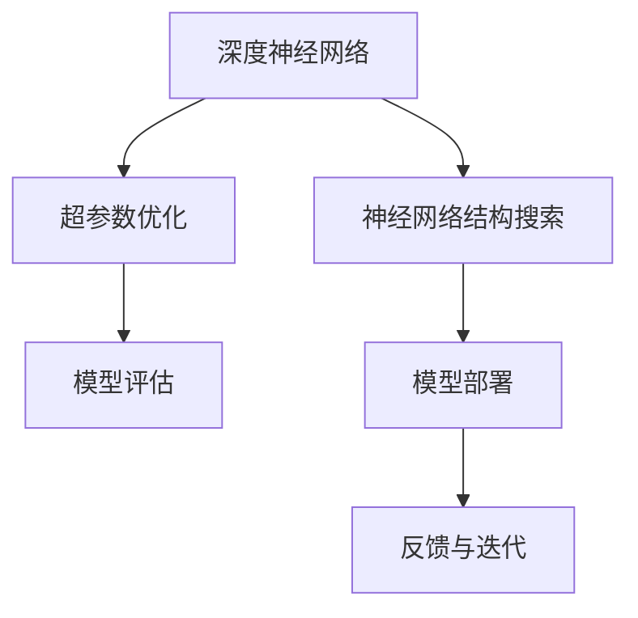

                 

## 1. 背景介绍

### 1.1 问题由来
随着深度学习技术的迅猛发展，计算机视觉(CV)领域取得了显著的进展。传统的机器学习算法已被复杂的深度神经网络所取代，其具备强大的特征提取和分类能力。然而，深度神经网络的设计通常需要大量的手工调参和专家知识，使得设计过程耗时耗力且易产生过拟合。此外，在大规模数据和复杂网络结构下，训练和推理的计算开销巨大，资源消耗较大。

### 1.2 问题核心关键点
1. 深度学习模型的设计通常依赖大量手工调参，设计效率低下，且难以保证模型的泛化能力。
2. 在大规模数据和复杂网络结构下，训练和推理计算开销大，资源消耗高。
3. 神经网络结构搜索成为解决以上问题的有效方法，通过自动化搜索优化的网络结构，能够快速设计出高效率、低资源消耗的模型。

### 1.3 问题研究意义
研究神经网络结构搜索方法，对于提高深度学习模型的设计效率，降低资源消耗，提升模型泛化能力具有重要意义：

1. 提高模型设计效率：通过自动化搜索优化的网络结构，可以显著降低模型设计成本，缩短开发周期。
2. 降低资源消耗：优化后的网络结构能够显著减少计算资源和存储需求，降低模型训练和推理的开销。
3. 提升模型泛化能力：优化的网络结构往往能更好地适应新数据，提升模型泛化能力。
4. 加速模型部署：轻量级模型在硬件资源有限的场景中也能快速部署和运行。
5. 促进AI技术落地：优化后的模型能够更广泛地应用于工业界，推动AI技术的产业化进程。

## 2. 核心概念与联系

### 2.1 核心概念概述

为更好地理解神经网络结构搜索方法，本节将介绍几个密切相关的核心概念：

- 神经网络结构搜索(Neural Architecture Search, NAS)：一种用于自动发现网络结构的方法。通过自动化搜索优化的网络结构，能够快速设计出高效、低资源的模型。
- 深度神经网络(Deep Neural Network, DNN)：包括卷积神经网络(Convolutional Neural Network, CNN)、循环神经网络(Recurrent Neural Network, RNN)等，广泛应用于图像识别、语音识别等计算机视觉和自然语言处理领域。
- 超参数优化(Hyperparameter Optimization, HPO)：通过优化模型超参数，如学习率、批大小、激活函数等，来提升模型性能。
- 自动化机器学习(Automatic Machine Learning, AutoML)：一种自动化寻找模型结构、超参数配置和特征工程的方法，以减少手工调参的工作量。

这些核心概念之间的逻辑关系可以通过以下Mermaid流程图来展示：



这个流程图展示了大语言模型的核心概念及其之间的关系：

1. 深度神经网络通过超参数优化和神经网络结构搜索进行优化设计。
2. 优化的网络结构用于模型评估和部署，进入实际应用场景。
3. 通过反馈与迭代，进一步优化网络结构和超参数配置。

这些概念共同构成了深度学习模型的优化框架，使其能够在大规模数据和复杂场景中快速设计出高性能的模型。通过理解这些核心概念，我们可以更好地把握神经网络结构搜索的工作原理和优化方向。

## 3. 核心算法原理 & 具体操作步骤
### 3.1 算法原理概述

神经网络结构搜索(NAS)的本质是通过自动化方法寻找最优的网络结构，其核心思想是通过对网络结构的搜索空间进行搜索和评估，以选择最佳的子结构。常见的NAS算法包括遗传算法、贝叶斯优化、强化学习等，这些方法通过引入搜索策略和评估指标，自动探索和选择最优的网络结构。

NAS通常包括以下几个关键步骤：

- 定义网络结构搜索空间：包括节点类型、连接方式、激活函数等，通常通过预定义的超网络结构来构建。
- 搜索算法：通过遗传算法、贝叶斯优化、强化学习等方法对搜索空间进行搜索。
- 模型评估：通过验证集上的表现来评估网络结构，选择性能最优的子结构。
- 反馈与迭代：根据模型评估结果，对搜索策略进行调整，继续迭代优化网络结构。

### 3.2 算法步骤详解

以强化学习为基础的NAS算法为例，其主要步骤包括：

**Step 1: 定义超网络结构和搜索空间**
- 构建超网络结构，包含不同种类的节点（如卷积层、池化层、激活函数等）和不同的连接方式。
- 定义搜索空间，包括节点的选择概率、连接方式的概率等超参数。

**Step 2: 设计策略和评估指标**
- 设计强化学习策略，如Q-learning、PPO等，用于指导搜索算法选择网络结构。
- 设计评估指标，如准确率、推理时间、内存占用等，用于衡量网络结构的性能。

**Step 3: 执行搜索算法**
- 在搜索空间内随机生成初始网络结构。
- 使用训练数据进行前向传播和损失计算，更新网络结构参数。
- 根据评估指标对当前网络结构进行评分，作为选择下一次搜索的依据。

**Step 4: 迭代优化**
- 重复执行Step 3，直到找到性能最优的网络结构。
- 对找到的结构进行微调，提升模型性能。

### 3.3 算法优缺点

NAS的优点在于：
1. 自动化设计网络结构，降低手工调参的工作量，加快模型设计速度。
2. 优化网络结构，提升模型性能和泛化能力。
3. 降低计算资源消耗，适应资源受限的设备和应用场景。

同时，NAS也存在一些局限性：
1. 需要大量计算资源和时间进行搜索，尤其是大规模网络结构的搜索，消耗大。
2. 搜索空间往往难以完全覆盖，可能遗漏最优结构。
3. 搜索过程可能过于复杂，难以解释和调试。
4. 网络结构可能过于复杂，导致模型难以部署和优化。

尽管存在这些局限性，但就目前而言，NAS方法仍然是深度学习模型设计的重要范式，通过自动化和优化，显著提升了深度学习模型的设计效率和性能。未来相关研究的重点在于如何进一步降低搜索复杂度，提高搜索效率，同时兼顾模型性能和可解释性等因素。

### 3.4 算法应用领域

神经网络结构搜索在计算机视觉领域已经得到了广泛的应用，覆盖了图像分类、目标检测、语义分割等多个任务，并且取得了显著的效果。例如：

- 图像分类：使用NAS搜索优化的卷积神经网络(CNN)结构，在CIFAR-10、ImageNet等数据集上取得了SOTA的性能。
- 目标检测：通过NAS搜索优化的Faster R-CNN、YOLO等目标检测模型，提升了检测精度和速度。
- 语义分割：使用NAS搜索优化的U-Net等语义分割模型，提高了图像分割的准确度和鲁棒性。
- 超分辨率：通过NAS搜索优化的生成对抗网络(GAN)，实现了超分辨率图像的生成。
- 增强现实(AR)：通过NAS搜索优化的AR模型，提升了现实世界的图像识别和交互能力。

除了上述这些经典任务外，NAS还被创新性地应用于更多的计算机视觉场景中，如遥感图像分析、医学影像诊断、自动驾驶等，为计算机视觉技术带来了新的突破。

## 4. 数学模型和公式 & 详细讲解  
### 4.1 数学模型构建

神经网络结构搜索的数学模型通常包括两部分：超网络结构和搜索算法。

以强化学习为基础的NAS算法为例，假设超网络结构为 $\mathcal{G}=\{C_1, C_2, ..., C_n\}$，其中 $C_i$ 为第 $i$ 种节点类型，其超参数为 $\theta_i$。则搜索算法的目标是在搜索空间 $\mathcal{S}$ 中，找到最优的网络结构 $\mathcal{G}^*$，使得在数据集 $D$ 上的损失函数 $L(\mathcal{G}^*)$ 最小化。

### 4.2 公式推导过程

在强化学习中，通常定义状态空间 $\mathcal{S}$、动作空间 $\mathcal{A}$、奖励函数 $R(\mathcal{G})$。其中，状态空间 $\mathcal{S}$ 表示当前网络结构的状态，动作空间 $\mathcal{A}$ 表示当前网络结构的动作（如选择节点类型、连接方式等），奖励函数 $R(\mathcal{G})$ 表示网络结构的性能。

假设我们使用Q-learning算法，则Q值函数 $Q(s, a)$ 定义为：

$$
Q(s, a) = \mathbb{E}[R(\mathcal{G}) + \gamma \max_a Q(s', a')] 
$$

其中，$R(\mathcal{G})$ 为网络结构 $\mathcal{G}$ 的奖励，$\gamma$ 为折扣因子，$s'$ 和 $a'$ 为下一个状态和动作。

通过Q-learning算法，可以最大化Q值函数，从而选择最优的网络结构。在每个状态 $s$ 下，选择动作 $a$ 的策略为：

$$
\pi(s) = \arg\max_a Q(s, a)
$$

### 4.3 案例分析与讲解

以搜索优化卷积神经网络(CNN)为例，假设超网络结构为 $\mathcal{G}$，其中包含三种类型的节点：卷积层、池化层、激活函数层。节点类型为 $C_1, C_2, C_3$，其超参数分别为 $\theta_1, \theta_2, \theta_3$。通过NAS算法，可以搜索得到最优的网络结构 $\mathcal{G}^*$。

假设当前网络结构为 $\mathcal{G}_t$，其超参数为 $\theta_t$，则下一时刻的超参数 $\theta_{t+1}$ 更新策略为：

$$
\theta_{t+1} = \theta_t + \alpha[Q(\mathcal{G}_t, \mathcal{A}_t) - Q(\mathcal{G}_t, \pi(\mathcal{G}_t))]
$$

其中，$\alpha$ 为学习率，$\mathcal{A}_t$ 为当前网络结构的动作（如选择节点类型、连接方式等）。通过不断迭代，直到找到性能最优的网络结构 $\mathcal{G}^*$。

## 5. 项目实践：代码实例和详细解释说明
### 5.1 开发环境搭建

在进行NAS项目实践前，我们需要准备好开发环境。以下是使用Python进行PyTorch开发的环境配置流程：

1. 安装Anaconda：从官网下载并安装Anaconda，用于创建独立的Python环境。

2. 创建并激活虚拟环境：
```bash
conda create -n nas-env python=3.8 
conda activate nas-env
```

3. 安装PyTorch：根据CUDA版本，从官网获取对应的安装命令。例如：
```bash
conda install pytorch torchvision torchaudio cudatoolkit=11.1 -c pytorch -c conda-forge
```

4. 安装TensorBoard：用于可视化模型训练过程和结果。
```bash
pip install tensorboard
```

5. 安装PyTorch的NAS库：如Nyax等，用于自动化搜索优化的网络结构。
```bash
pip install nyax
```

完成上述步骤后，即可在`nas-env`环境中开始NAS实践。

### 5.2 源代码详细实现

这里以Nyax库为例，介绍使用PyTorch进行NAS实践的代码实现。

首先，定义NAS的超网络和搜索空间：

```python
import nyax

# 定义超网络结构
search_space = {
    'input': {
        'type': 'Conv3D',
        'channels': [32, 64, 128],
        'kernel_size': [3, 5, 7],
        'stride': [1, 2, 3]
    },
    'hidden': {
        'type': 'Conv3D',
        'channels': [128, 256, 512],
        'kernel_size': [3, 5, 7],
        'stride': [1, 2, 3]
    },
    'output': {
        'type': 'Conv3D',
        'channels': [1024],
        'kernel_size': [3, 5, 7],
        'stride': [1, 2, 3]
    }
}

# 定义超网络结构
hypernet = {
    'input': {
        'channels': [32, 64, 128],
        'kernel_size': [3, 5, 7],
        'stride': [1, 2, 3]
    },
    'hidden': {
        'channels': [128, 256, 512],
        'kernel_size': [3, 5, 7],
        'stride': [1, 2, 3]
    },
    'output': {
        'channels': [1024],
        'kernel_size': [3, 5, 7],
        'stride': [1, 2, 3]
    }
}
```

然后，定义NAS的搜索空间和评估指标：

```python
# 定义搜索空间
search_space.add('hidden', {
    'type': 'Conv3D',
    'channels': [32, 64, 128],
    'kernel_size': [3, 5, 7],
    'stride': [1, 2, 3],
    'p': 0.5
})

search_space.add('output', {
    'type': 'Conv3D',
    'channels': [32, 64, 128],
    'kernel_size': [3, 5, 7],
    'stride': [1, 2, 3],
    'p': 0.5
})

# 定义评估指标
evaluation_metric = {
    'metric': 'accuracy',
    'threshold': 0.5
}
```

接着，定义NAS的搜索算法：

```python
from nyax.utils import search_cifar

# 定义搜索算法
search_algorithm = search_cifar(hypernet, search_space, 
                                validation_fraction=0.1, 
                                num_search_iter=10, 
                                batch_size=64, 
                                epochs=100)
```

最后，启动搜索流程并评估结果：

```python
# 启动搜索
search_algorithm.search()

# 评估结果
search_algorithm.evaluate()
```

以上就是使用Nyax库进行NAS实践的完整代码实现。可以看到，Nyax库封装了NAS算法的核心流程，只需通过简单的配置即可启动搜索过程，并得到最优网络结构。

### 5.3 代码解读与分析

让我们再详细解读一下关键代码的实现细节：

**NAS的定义与配置**：
- 通过Nyax库，可以方便地定义超网络结构和搜索空间，通过简单配置即可完成搜索。
- 超网络结构包含输入层、隐藏层和输出层，每个层的节点类型、通道数、核大小和步长等超参数均为可配置项。
- 通过添加不同的节点类型和超参数，可以构建不同的搜索空间。

**NAS的搜索算法**：
- 通过搜索算法，自动搜索优化的网络结构。搜索算法包括遗传算法、贝叶斯优化、强化学习等，Nyax库支持多种搜索算法。
- 在搜索过程中，通过评估指标对当前网络结构进行评分，选择性能最优的结构进行微调。
- 搜索算法可以自动迭代，直到找到最优的网络结构。

**NAS的评估与部署**：
- 在搜索完成后，通过评估算法对最优网络结构进行评估，验证其性能。
- 评估结果可以用于指导模型的微调和部署，确保其在新数据上表现优异。
- 可以将NAS搜索得到的网络结构集成到实际应用中，加速模型部署和优化。

可以看到，Nyax库使得NAS的实践过程变得简单高效，大大降低了研究人员的手工调参工作量，加快了模型设计的速度。

当然，在工业级的系统实现中，还需要考虑更多因素，如超网络结构的优化、搜索算法的调优、超参数的自动化选择等。但核心的NAS范式基本与此类似。

## 6. 实际应用场景
### 6.1 智能安防系统

基于NAS优化的计算机视觉模型，可以广泛应用于智能安防系统的构建。传统安防系统往往需要大量人力进行实时监控和异常检测，无法应对复杂场景中的各类突发事件。使用NAS优化的目标检测和行为识别模型，可以24小时不间断地对监控视频进行实时分析和异常检测，提高安防系统的智能化水平和应急响应速度。

在技术实现上，可以收集各类监控视频数据，将视频帧作为输入，将检测结果作为监督信号，在NAS优化的网络结构上微调，提升目标检测和行为识别的精度和鲁棒性。对于异常行为或事件，系统能够自动生成报警信息，通知安保人员及时处理。通过优化后的安防系统，可以显著提高安防工作的自动化和智能化水平。

### 6.2 自动驾驶

自动驾驶技术的发展离不开高精度的环境感知和决策能力。通过NAS优化的语义分割和行为预测模型，可以实时对道路环境进行准确感知和行为预测，为驾驶决策提供重要参考。

在技术实现上，可以收集自动驾驶车辆的外部摄像头和雷达数据，通过NAS优化出高精度的语义分割和行为预测模型，对车辆周围环境进行实时分析。对于行人、车辆等重要对象，系统能够自动生成报警信息，提醒驾驶员及时采取措施。通过优化后的自动驾驶系统，可以提高驾驶安全和效率，推动自动驾驶技术的产业化进程。

### 6.3 医疗影像分析

医疗影像分析是计算机视觉在医疗领域的重要应用之一。通过NAS优化的语义分割和对象检测模型，可以对医疗影像进行自动化分析，辅助医生进行诊断和治疗。

在技术实现上，可以收集各类医疗影像数据，将影像作为输入，将医生的诊断结果作为监督信号，在NAS优化的网络结构上微调，提升影像分析的准确性和鲁棒性。对于异常影像或病灶，系统能够自动生成提示信息，辅助医生进行进一步诊断和治疗。通过优化后的医疗影像分析系统，可以提高医生的诊断效率和治疗质量，推动医疗行业的智能化转型。

### 6.4 未来应用展望

随着NAS技术的不断发展，基于NAS优化的计算机视觉模型将在更多领域得到应用，为各行各业带来变革性影响。

在智慧城市治理中，基于NAS优化的语义分割和行为识别模型，可以实时对城市事件进行监测和分析，提高城市管理的自动化和智能化水平。

在工业制造中，基于NAS优化的对象检测和质量检测模型，可以实时对生产线和产品质量进行监控，提高生产效率和产品质量。

在智能家居中，基于NAS优化的目标检测和行为分析模型，可以实现对家庭成员行为的自动化监控和分析，提升家庭生活的便捷性和安全性。

此外，在娱乐、教育、金融等众多领域，基于NAS优化的计算机视觉模型也将不断涌现，为各行各业带来新的创新应用。

## 7. 工具和资源推荐
### 7.1 学习资源推荐

为了帮助开发者系统掌握NAS技术的基础知识和实践技巧，这里推荐一些优质的学习资源：

1. 《Neural Architecture Search: A Survey》系列博文：由NAS领域的权威专家撰写，全面介绍了NAS的基本概念、发展历程和最新进展。

2. CS231n《卷积神经网络》课程：斯坦福大学开设的深度学习课程，涵盖计算机视觉基础和高级技术，包括NAS等前沿话题。

3. 《NAS: A Comprehensive Survey》书籍：全面介绍了NAS技术的最新发展，涵盖了NAS的基本原理、算法和应用实例。

4. Google AI Blog：谷歌AI团队发布的一系列技术博客，介绍了NAS在Google Brain中的最新研究成果和应用实践。

5. PyTorch官方文档：PyTorch官方文档提供了丰富的NAS样例代码，帮助开发者快速上手。

通过对这些资源的学习实践，相信你一定能够快速掌握NAS技术的精髓，并用于解决实际的计算机视觉问题。

### 7.2 开发工具推荐

高效的开发离不开优秀的工具支持。以下是几款用于NAS开发的常用工具：

1. PyTorch：基于Python的开源深度学习框架，灵活动态的计算图，适合快速迭代研究。Nyax库提供了对PyTorch的封装，便于快速搜索优化网络结构。

2. TensorFlow：由Google主导开发的开源深度学习框架，生产部署方便，适合大规模工程应用。TensorFlow提供了丰富的优化器选择，支持NAS算法优化网络结构。

3. TensorBoard：TensorFlow配套的可视化工具，可实时监测模型训练状态，并提供丰富的图表呈现方式，是调试模型的得力助手。

4. Hyperopt：由Hyperopt团队开发的正则化优化器，支持贝叶斯优化算法，用于搜索最优的网络结构和超参数配置。

5. Spearmint：由Airbnb团队开发的超参数优化工具，支持多种优化算法，用于自动化搜索优化的网络结构和超参数配置。

合理利用这些工具，可以显著提升NAS开发的效率，加快模型设计的速度。

### 7.3 相关论文推荐

NAS技术的发展源于学界的持续研究。以下是几篇奠基性的相关论文，推荐阅读：

1. Evolving Neural Networks for Image Recognition：首次提出NAS的概念，通过遗传算法搜索优化网络结构。

2. A Baseline for the Design Space of Neural Network Architectures：使用超网络搜索优化的网络结构，提出NAS的基本框架。

3. Large-Scale Automated Model Design Search with Neural Architecture Search (NAS)：详细介绍了NAS在图像识别任务中的应用，展示了NAS算法的强大能力。

4. Neural Architecture Search Space with Network Pruning and Filtering：通过网络剪枝和过滤方法，优化NAS的搜索空间，提高搜索效率。

5. Scalable Neural Architecture Search via Neural Module Networks：提出神经模块网络(Neural Module Networks, N-MNs)方法，用于自动搜索优化的网络结构。

这些论文代表了大语言模型NAS技术的发展脉络。通过学习这些前沿成果，可以帮助研究者把握学科前进方向，激发更多的创新灵感。

## 8. 总结：未来发展趋势与挑战

### 8.1 总结

本文对神经网络结构搜索方法进行了全面系统的介绍。首先阐述了NAS在计算机视觉领域的应用背景和研究意义，明确了NAS在模型设计效率、资源消耗和模型性能提升方面的独特价值。其次，从原理到实践，详细讲解了NAS的数学模型和核心步骤，给出了NAS任务开发的完整代码实例。同时，本文还广泛探讨了NAS方法在智能安防、自动驾驶、医疗影像等多个行业领域的应用前景，展示了NAS范式的巨大潜力。此外，本文精选了NAS技术的各类学习资源，力求为读者提供全方位的技术指引。

通过本文的系统梳理，可以看到，NAS技术正在成为计算机视觉模型设计的重要范式，极大地拓展了深度学习模型的设计效率和性能。未来，伴随NAS技术的持续演进，基于NAS优化的模型必将在更广泛的计算机视觉场景中大放异彩，深刻影响人工智能技术的发展。

### 8.2 未来发展趋势

展望未来，NAS技术将呈现以下几个发展趋势：

1. 搜索空间自动化：搜索空间的自动构建和优化，减少手工调参的工作量，提高搜索效率。
2. 多模态融合：将NAS与视觉、语音、文本等多种模态数据结合，提升模型的综合感知能力。
3. 超参数自动化：通过自动化的超参数搜索，减少手工调参的工作量，提高模型性能。
4. 迁移学习应用：在预训练模型上使用NAS进行迁移学习，进一步优化网络结构，提升模型泛化能力。
5. 轻量化模型设计：通过NAS搜索优化的轻量化模型，适应资源受限的场景，如移动设备、嵌入式系统等。
6. 实时性优化：通过NAS搜索优化的实时性模型，提升响应速度和用户体验。

以上趋势凸显了NAS技术的广阔前景。这些方向的探索发展，必将进一步提升计算机视觉模型的设计效率和性能，为计算机视觉技术带来新的突破。

### 8.3 面临的挑战

尽管NAS技术已经取得了瞩目成就，但在迈向更加智能化、普适化应用的过程中，它仍面临诸多挑战：

1. 搜索空间过小：搜索空间的大小直接影响到模型的性能和泛化能力，过小的搜索空间可能导致模型的性能不足。
2. 搜索算法复杂度：现有的NAS算法往往需要大量计算资源和时间，搜索复杂度高。
3. 可解释性不足：NAS模型难以解释其内部工作机制和决策逻辑，对应用场景的理解和调试较为困难。
4. 模型泛化能力有限：现有的NAS模型在特定领域的应用效果有限，需要进一步提升模型泛化能力。
5. 数据依赖度高：NAS模型的训练和优化依赖大量标注数据，对数据的质量和数量要求较高。
6. 资源消耗大：NAS模型的计算和存储需求大，需要优化资源利用效率。

尽管存在这些挑战，但通过不断优化搜索算法和搜索空间，引入更多先验知识，优化模型设计，NAS技术必将在未来的计算机视觉领域中发挥更大的作用。

### 8.4 研究展望

面向未来，NAS技术的研究方向包括：

1. 搜索空间自动化：通过自动化构建和优化搜索空间，减少手工调参的工作量，提高搜索效率。
2. 多模态融合：将NAS与视觉、语音、文本等多种模态数据结合，提升模型的综合感知能力。
3. 超参数自动化：通过自动化的超参数搜索，减少手工调参的工作量，提高模型性能。
4. 迁移学习应用：在预训练模型上使用NAS进行迁移学习，进一步优化网络结构，提升模型泛化能力。
5. 轻量化模型设计：通过NAS搜索优化的轻量化模型，适应资源受限的场景，如移动设备、嵌入式系统等。
6. 实时性优化：通过NAS搜索优化的实时性模型，提升响应速度和用户体验。

这些研究方向的探索，必将引领NAS技术迈向更高的台阶，为计算机视觉技术带来新的突破。面向未来，NAS技术还需要与其他人工智能技术进行更深入的融合，如知识表示、因果推理、强化学习等，多路径协同发力，共同推动计算机视觉技术的发展。只有勇于创新、敢于突破，才能不断拓展NAS技术的边界，让计算机视觉技术更好地服务于人类社会。

## 9. 附录：常见问题与解答

**Q1：NAS是否适用于所有计算机视觉任务？**

A: NAS方法适用于大多数计算机视觉任务，但在某些特殊任务上可能需要进一步优化。对于数据量较大的任务，如大规模物体检测和图像分类，NAS能够显著提升模型性能。但对于某些特定任务，如人体姿态估计、光学字符识别等，可能需要引入更多先验知识和预训练模型。

**Q2：NAS搜索过程中如何避免过拟合？**

A: 在NAS搜索过程中，通过正则化技术、数据增强等手段可以避免过拟合。具体来说，可以通过L2正则、Dropout、Early Stopping等方法防止模型过度拟合训练数据。数据增强方法，如旋转、裁剪、缩放等，可以丰富训练数据的多样性，提高模型的泛化能力。

**Q3：NAS搜索空间应该如何选择？**

A: 搜索空间的选择应该根据具体任务的特点和资源限制进行权衡。对于资源受限的场景，可以选择较小的搜索空间，以减少搜索时间和计算开销。对于复杂任务，需要构建更丰富的搜索空间，以确保模型性能。同时，搜索空间的构建需要结合领域专家的知识和经验，以提高搜索效率和模型性能。

**Q4：NAS搜索过程是否需要大量标注数据？**

A: NAS搜索过程需要一定的标注数据来评估模型的性能。标注数据的数量和质量对搜索结果有重要影响。通常来说，更多的标注数据可以提高搜索效率和模型性能。但在某些场景下，如自动驾驶、安防监控等，标注数据获取成本较高，可以采用半监督学习和自监督学习等方法来减少对标注数据的依赖。

**Q5：NAS模型如何部署和优化？**

A: NAS模型的部署和优化需要考虑资源利用效率和推理速度。通常来说，轻量化模型在资源受限的场景中表现更好，但性能可能略逊于大规模模型。因此，需要在模型性能和资源消耗之间进行权衡，选择最优的部署方案。在部署后，可以通过微调和优化策略，进一步提升模型性能和推理速度。

这些问题的解答，可以帮助开发者更好地理解和应用NAS技术，推动计算机视觉技术的进步。总之，NAS技术正在成为计算机视觉模型设计的重要范式，其广泛的应用前景令人期待。相信随着技术的不断发展，NAS方法必将在更多的计算机视觉场景中大放异彩，为计算机视觉技术的发展注入新的动力。

---

作者：禅与计算机程序设计艺术 / Zen and the Art of Computer Programming

