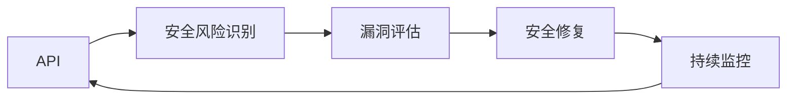

                 

# OWASP API 安全风险清单的详细解读

> 关键词：API安全, 安全风险, 漏洞, OWASP, 安全实践, 安全策略

## 1. 背景介绍

随着Web应用和微服务的普及，API成为了连接前后端的重要桥梁。然而，API安全问题也随之增多，诸如注入攻击、跨站请求伪造、身份验证漏洞等安全风险，使得API成为Web安全防护的重点。为了帮助开发者和安全团队有效识别和防护API安全风险，OWASP（开放Web应用安全计划）发布了《API Security Top 10 Project》，简称为OWASP API Top 10。

本文将详细解读OWASP API Top 10中的十大风险，解释它们的原理和防护策略，为开发者和安全专家提供宝贵的参考。

## 2. 核心概念与联系

### 2.1 核心概念概述

在深入分析OWASP API Top 10之前，我们先梳理几个核心概念：

- **API (Application Programming Interface)**：应用程序编程接口，是一组定义了软件组件之间交互的协议和工具，用于促进不同系统之间的通信和数据交换。
- **OWASP (Open Web Application Security Project)**：开放Web应用安全计划，是一个非营利组织，致力于提升Web应用的安全性。
- **安全风险**：安全漏洞或威胁，可能导致数据泄露、服务中断、身份盗窃等安全问题。
- **漏洞**：应用程序或系统的弱点或缺陷，可以被攻击者利用。

这些概念构成了API安全的基础框架。以下是一个简单的Mermaid流程图，展示了API安全风险的识别、评估和防护流程：



## 3. 核心算法原理 & 具体操作步骤

### 3.1 算法原理概述

OWASP API Top 10基于对大量真实世界的API安全案例分析，提炼出最普遍和严重的安全威胁，旨在指导开发者和系统管理员建立健全的安全防护措施。

### 3.2 算法步骤详解

1. **威胁识别**：通过安全审计和渗透测试，识别API中的潜在威胁。
2. **漏洞评估**：使用自动化工具和手动测试，评估威胁的严重性和可利用性。
3. **修复策略**：根据威胁等级，制定相应的修复策略，并实施。
4. **持续监控**：建立监控系统，实时检测新的安全威胁，并及时响应。

### 3.3 算法优缺点

**优点**：
- **权威性**：由国际知名安全组织OWASP发布，内容权威，被广泛认可。
- **全面性**：覆盖了API安全的多个方面，包括身份验证、授权、数据保护等。
- **实践性**：每个风险都提供了详细的防护措施和案例分析。

**缺点**：
- **复杂性**：涵盖的风险较多，需要全面掌握，适合有经验的开发和安全专家。
- **技术依赖**：部分防护措施依赖特定的工具和配置，可能需要额外投资。

### 3.4 算法应用领域

OWASP API Top 10适用于各类API的开发和维护，包括公共API、内部API、IoT API等。无论是B2B、B2C还是企业内部的微服务架构，都能从中受益。

## 4. 数学模型和公式 & 详细讲解 & 举例说明

### 4.1 数学模型构建

在API安全领域，常用的数学模型包括概率模型和风险评估模型。

- **概率模型**：用于评估攻击成功的概率，通常包括攻击成功概率和攻击失败概率。
- **风险评估模型**：结合风险的严重性和可利用性，计算总风险。

### 4.2 公式推导过程

假设攻击成功的概率为$P_s$，攻击失败的概率为$P_f$，攻击的严重性为$S$，攻击的可利用性为$A$。则风险$R$可以表示为：

$$ R = P_s \times S \times A $$

其中：
- $S$表示攻击的严重性，可以量化为损失的严重程度，如$100,000$
- $A$表示攻击的可利用性，表示攻击的难易程度，如$10$

### 4.3 案例分析与讲解

以SQL注入攻击为例：

- **攻击成功概率**：假设攻击者成功注入SQL注入代码的概率为$P_s = 0.1$。
- **攻击严重性**：如果攻击成功，可能导致数据泄露或系统瘫痪，假设其严重性$S = 100,000$。
- **攻击可利用性**：假设攻击成功需要特定的条件和技能，其可利用性$A = 10$。

根据上述模型，计算风险$R$：

$$ R = P_s \times S \times A = 0.1 \times 100,000 \times 10 = 1,000,000 $$

## 5. 项目实践：代码实例和详细解释说明

### 5.1 开发环境搭建

在进行API安全实践前，需要先配置好开发环境。以下是使用Python和Flask框架搭建API服务的步骤：

1. 安装Flask：`pip install flask`
2. 创建Flask应用程序：`python flask_app.py`
3. 启动Web服务器：`python flask_app.py`

### 5.2 源代码详细实现

以下是一个简单的API服务代码示例，展示了如何实现身份验证和授权：

```python
from flask import Flask, request, jsonify
from functools import wraps

app = Flask(__name__)

# 模拟数据库中的用户信息
users = [
    {"id": 1, "username": "user1", "password": "pass1"},
    {"id": 2, "username": "user2", "password": "pass2"}
]

# 装饰器实现身份验证
def requires_auth(f):
    @wraps(f)
    def decorated(*args, **kwargs):
        auth = request.authorization
        if not auth or not check_password(auth.password, users[0]["password"]):
            return jsonify({"message": "Invalid credentials"}), 401
        return f(*args, **kwargs)
    return decorated

# 实现获取用户信息的API
@app.route('/user', methods=['GET'])
@requires_auth
def get_user():
    return jsonify(users[0])

if __name__ == '__main__':
    app.run(debug=True)
```

### 5.3 代码解读与分析

- **Flask框架**：轻量级Web框架，适合快速搭建API服务。
- **身份验证**：使用`require_auth`装饰器实现基于用户名和密码的身份验证。
- **用户信息管理**：简单模拟数据库中的用户信息，使用`jsonify`返回用户信息。

### 5.4 运行结果展示

启动应用程序后，在浏览器中输入`http://localhost:5000/user`，如果提供了正确的用户名和密码，则会返回用户信息。

```json
{"id": 1, "username": "user1", "password": "pass1"}
```

## 6. 实际应用场景

### 6.1 智能客服系统

智能客服系统中的API需要处理大量的用户请求，包括文本输入、语音输入等。为了确保系统的安全性，可以应用OWASP API Top 10中的安全措施，如身份验证、输入验证等。

### 6.2 金融交易平台

金融交易平台中的API需要处理敏感的金融数据，如账户余额、交易记录等。因此，必须严格控制API的访问权限，使用安全的传输协议（如HTTPS），并对输入数据进行严格验证。

### 6.3 企业内部管理系统

企业内部管理系统中的API需要保证数据的隐私性和完整性，因此必须采用多层次的身份验证、访问控制和数据加密等措施。

### 6.4 未来应用展望

未来，随着API的普及，API安全将更加重要。预计以下趋势将推动API安全技术的发展：

- **自动化工具**：使用自动化工具和持续集成/持续部署(CI/CD)流程，自动发现和修复API漏洞。
- **零信任架构**：基于零信任原则，每个API请求都需要经过严格的身份验证和授权。
- **区块链技术**：利用区块链的不可篡改性和透明性，提升API数据的可信度。
- **AI驱动的安全**：使用机器学习和人工智能技术，自动化发现和应对API威胁。

## 7. 工具和资源推荐

### 7.1 学习资源推荐

- **OWASP API Top 10文档**：官方文档详细介绍了每个风险的防护措施和案例分析。
- **OWASP API Security Cheat Sheet**：快速参考API安全的最佳实践。
- **API Security Best Practices**：最新的API安全技术趋势和最佳实践。

### 7.2 开发工具推荐

- **Postman**：API测试和调试工具，支持自动化测试和监控。
- **JIRA**：项目管理工具，帮助安全团队跟踪和处理漏洞。
- **GitLab**：CI/CD平台，支持自动化测试和部署。

### 7.3 相关论文推荐

- **OWASP API Security Top 10 Project**：官方发布的API安全风险评估标准。
- **API Security in Practice**：关于API安全的实际应用和防护策略的论文。

## 8. 总结：未来发展趋势与挑战

### 8.1 研究成果总结

本文详细解读了OWASP API Top 10中的十大风险，帮助开发者和安全专家识别和防护API安全威胁。通过学习这些风险和防护措施，可以有效提升API的安全性和可靠性。

### 8.2 未来发展趋势

- **自动化**：自动化工具和流程将进一步提高API安全的效率和准确性。
- **零信任**：基于零信任原则的API安全模型将成为主流。
- **AI驱动**：利用机器学习和人工智能技术，提高API安全的智能化水平。

### 8.3 面临的挑战

- **技术复杂性**：API安全的防护措施较多，需要全面掌握。
- **资源投入**：部分防护措施需要额外的硬件和软件资源。
- **持续更新**：API安全的威胁不断变化，需要持续更新防护措施。

### 8.4 研究展望

未来的API安全研究将更多关注以下几个方面：
- **综合防护**：结合身份验证、访问控制、数据加密等措施，构建全面的安全防护体系。
- **自动化工具**：开发更智能、更高效的自动化工具，提升API安全的防护能力。
- **模型化研究**：将API安全问题模型化，使用数学和统计方法进行深入分析。

## 9. 附录：常见问题与解答

**Q1：如何确保API的访问控制安全？**

A: 使用OAuth、JWT等身份验证和授权机制，确保只有授权用户才能访问API。同时，使用API密钥和IP白名单等手段，进一步限制访问。

**Q2：如何防止SQL注入攻击？**

A: 使用参数化查询或ORM框架，确保输入数据不直接拼接到SQL语句中。同时，使用白名单验证输入数据，限制特殊字符的使用。

**Q3：API中的身份验证应该如何实现？**

A: 可以使用OAuth2.0协议进行身份验证，结合JWT或Token进行授权。或者使用基本认证或摘要认证，但需要注意安全性问题。

**Q4：API中的数据加密应该如何实现？**

A: 使用HTTPS协议进行数据加密传输，确保数据在传输过程中不被篡改或窃取。同时，对敏感数据进行加密存储，确保数据在存储过程中不被泄露。

**Q5：API中的数据验证应该如何实现？**

A: 使用正则表达式、白名单验证等手段，确保输入数据符合预期格式和范围。同时，使用API网关进行输入过滤和异常处理，确保API服务稳定可靠。

总之，API安全是Web应用和微服务架构中不可或缺的一部分，开发者和安全专家需要不断学习和应用最新的安全技术和策略，构建安全、可靠的API服务。

---

作者：禅与计算机程序设计艺术 / Zen and the Art of Computer Programming

