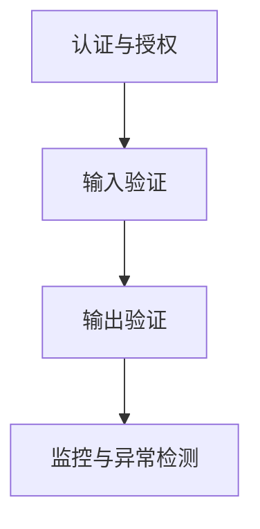

                 

# OWASP API 安全风险清单的重要性

在当今的数字化时代，API（应用程序编程接口）成为了连接不同系统、服务及应用的桥梁。API不仅在Web服务、云计算、移动应用、物联网等多个领域发挥着关键作用，也使得开发人员能够以模块化和组件化的方式构建复杂的软件系统。然而，API的广泛应用也带来了诸多安全风险。为了应对这些风险，OWASP（开放式网络应用安全项目）发布了一系列API安全风险清单，帮助开发者更好地理解API面临的安全威胁，并制定相应的防护措施。本文将系统性地介绍OWASP API安全风险清单的内容，并探讨其对API安全的重要意义。

## 1. 背景介绍

### 1.1 问题由来

API安全问题日益凸显，已成为数字化生态中的重大隐患。近年来，由于API接口设计不当或安全漏洞导致的数据泄露、系统瘫痪、服务滥用等问题频繁爆发，造成了巨大的经济损失和用户信任的损失。例如，2019年，欧洲某航空公司由于API管理不善，遭遇大规模数据泄露事件，影响数百万用户；2020年，某知名社交平台API接口被攻击，导致大规模用户账号被盗。因此，API安全问题亟需得到充分的重视和解决。

### 1.2 问题核心关键点

API安全问题主要包括以下几个方面：

- **身份认证和授权**：确保只有经过验证的用户才能访问API接口。
- **输入验证**：确保API接收到的数据符合预期，防止SQL注入、跨站脚本攻击等。
- **防止重放攻击**：保证请求的唯一性和时效性。
- **保护敏感数据**：防止敏感信息泄露。
- **API防火墙**：防止恶意攻击。

## 2. 核心概念与联系

### 2.1 核心概念概述

为了帮助开发者更好地理解API面临的安全威胁，OWASP API安全风险清单列出了常见的API安全威胁类型，并提出了相应的防护建议。这份清单分为四个部分：**认证与授权**、**输入验证**、**输出验证**和**监控与异常检测**，涵盖了API安全的所有关键环节。

- **认证与授权**：确保API请求来自可信来源，且仅允许经过授权的用户访问。
- **输入验证**：对API接收到的输入数据进行检查，确保其符合预期，防止恶意输入导致的安全问题。
- **输出验证**：确保API返回的数据经过充分验证，防止未经验证的数据泄露。
- **监控与异常检测**：实时监控API请求和响应，及时发现异常行为并进行处理。

### 2.2 核心概念原理和架构的 Mermaid 流程图(Mermaid 流程节点中不要有括号、逗号等特殊字符)



这个流程图展示了API安全风险清单的四个关键部分及其相互关系：

- **认证与授权**：是API安全的第一步，确保只有可信来源和经过授权的用户能够访问。
- **输入验证**：在API接收输入数据后，对其进行检查和过滤，防止恶意输入。
- **输出验证**：对API返回的数据进行验证，防止未经验证的数据泄露。
- **监控与异常检测**：对API的使用情况进行实时监控，及时发现并处理异常行为。

## 3. 核心算法原理 & 具体操作步骤

### 3.1 算法原理概述

API安全风险清单的原理基于信息安全领域的基本原则，包括最小权限原则、数据加密、输入验证、输出验证等。通过系统性地评估API面临的安全威胁，并提出相应的防护措施，这份清单帮助开发者构建安全的API系统。

### 3.2 算法步骤详解

API安全风险清单的制定步骤主要包括以下几个环节：

1. **风险评估**：识别API面临的各种安全威胁，包括SQL注入、跨站脚本攻击、DDoS攻击等。
2. **风险分类**：将威胁分为不同的类别，如认证与授权、输入验证、输出验证和监控与异常检测。
3. **风险评估**：对每种威胁的严重程度和发生概率进行评估。
4. **防护措施**：针对每种威胁，提出具体的防护建议，如使用HTTPS、限制API速率、强制输入验证等。
5. **实践指导**：提供详细的实践指导，包括最佳实践、工具推荐和配置建议。

### 3.3 算法优缺点

**优点**：

- **全面性**：涵盖了API安全的所有关键环节，提供了一站式的安全防护方案。
- **易用性**：以清晰易懂的语言和流程图形式呈现，便于开发者理解和实施。
- **可扩展性**：针对不同的API场景，提供了多种防护策略，适应性强。

**缺点**：

- **冗余性**：某些防护措施可能存在冗余，需要开发者自行优化。
- **复杂性**：一些高级防护措施可能需要较高的技术水平才能实现。
- **动态变化**：API安全威胁不断变化，清单需要定期更新以保持时效性。

### 3.4 算法应用领域

API安全风险清单广泛应用于Web应用、云计算平台、物联网、移动应用等多个领域，适用于各类开发者和IT安全专家。特别是在API安全性要求较高的金融、医疗、政府等行业，该清单的应用价值尤为显著。

## 4. 数学模型和公式 & 详细讲解 & 举例说明

### 4.1 数学模型构建

API安全风险清单的数学模型主要基于信息安全的基本原理和统计学方法。例如，使用风险评估矩阵来量化不同安全威胁的严重程度和发生概率，使用防护措施矩阵来推荐相应的安全防护策略。

### 4.2 公式推导过程

1. **风险评估矩阵**：将API面临的安全威胁分为四个等级：严重程度（High, Medium, Low）和发生概率（Very High, High, Medium, Low），构建如下矩阵：

   $$
   \begin{array}{ccc}
   & Very High & High & Medium & Low \\
   High & Very High & High & Medium & Low \\
   Medium & High & Medium & High & Low \\
   Low & Medium & High & Medium & Low \\
   \end{array}
   $$

2. **防护措施矩阵**：根据不同的风险等级，推荐相应的防护措施，如强制输入验证、使用HTTPS、限制API速率等。例如，对于高风险等级，推荐强制输入验证和API速率限制：

   $$
   \begin{array}{ccc}
   & Very High & High & Medium & Low \\
   & Input Validation & Rate Limiting & API Rate Limiting & Input Validation \\
   High & Input Validation & HTTPS & API Rate Limiting & Input Validation \\
   Medium & API Rate Limiting & Input Validation & HTTPS & API Rate Limiting \\
   Low & Input Validation & API Rate Limiting & Input Validation & Rate Limiting \\
   \end{array}
   $$

### 4.3 案例分析与讲解

**案例：使用API安全风险清单进行防护**

假设我们正在开发一个公共API，用于提供股票市场数据。以下是使用API安全风险清单进行防护的详细步骤：

1. **认证与授权**：
   - 使用HTTPS进行数据传输，防止中间人攻击。
   - 实施基于令牌的认证机制，确保只有经过授权的用户才能访问。

2. **输入验证**：
   - 使用JSON Schema验证API输入数据格式，防止SQL注入和跨站脚本攻击。
   - 对敏感参数进行输入验证，确保数据符合预期。

3. **输出验证**：
   - 使用CORS（跨域资源共享）机制，防止未经验证的数据泄露。
   - 对API返回的数据进行加密处理，确保数据安全。

4. **监控与异常检测**：
   - 实时监控API请求和响应，使用API防火墙检测异常行为。
   - 设置告警机制，及时发现并处理异常请求。

## 5. 项目实践：代码实例和详细解释说明

### 5.1 开发环境搭建

在实践API安全风险清单时，需要先搭建相应的开发环境。以下是使用Python进行Flask框架的开发环境配置流程：

1. 安装Flask：
```
pip install Flask
```

2. 创建API项目：
```
mkdir api_project
cd api_project
```

3. 创建Flask应用：
```
flask init
```

4. 安装Flask-RESTful扩展：
```
pip install Flask-RESTful
```

### 5.2 源代码详细实现

以下是一个使用Flask框架实现API的示例代码：

```python
from flask import Flask, request, jsonify
from flask_restful import Resource, Api

app = Flask(__name__)
api = Api(app)

# 定义API路由
class HelloWorld(Resource):
    def get(self):
        return jsonify({"message": "Hello, World!"})

# 添加API路由
api.add_resource(HelloWorld, '/')

if __name__ == '__main__':
    app.run(debug=True)
```

### 5.3 代码解读与分析

**代码解读**：

- 导入Flask和Flask-RESTful模块，创建Flask应用和API。
- 定义一个API路由`HelloWorld`，返回"Hello, World!"的JSON响应。
- 使用`api.add_resource`将`HelloWorld`路由映射到`/`路径。
- 运行应用，并在本地启动服务器。

**代码分析**：

- **认证与授权**：可以使用Flask-JWT-Extended扩展实现基于令牌的认证机制。
- **输入验证**：可以使用Flask-Inputs扩展验证API输入数据。
- **输出验证**：可以使用Flask-CORS扩展设置CORS机制，确保API响应数据安全。
- **监控与异常检测**：可以使用Flask-Request-Validation扩展，实时监控API请求和响应，检测异常行为。

## 6. 实际应用场景

### 6.1 金融行业

在金融行业中，API安全风险清单具有重要的应用价值。例如，银行和金融机构需要保护客户的敏感数据，如账户信息、交易记录等。通过API安全风险清单的指导，可以有效防止SQL注入、跨站脚本攻击等威胁，确保数据传输和存储的安全性。

### 6.2 医疗行业

医疗行业对API安全的需求同样迫切。医疗机构需要确保患者信息的隐私和安全，防止数据泄露和滥用。通过API安全风险清单的防护措施，可以有效防止未授权访问和数据篡改，确保医疗数据的完整性和机密性。

### 6.3 政府行业

政府行业也需要使用API安全风险清单来保护公共数据和公民隐私。例如，政府网站提供公共服务API，如交通规划、环境监测、公共安全等。通过API安全风险清单的防护措施，可以防止恶意攻击和数据篡改，确保API的安全性和可靠性。

### 6.4 未来应用展望

未来，API安全风险清单将进一步发展和完善，以应对不断变化的威胁环境。以下是对未来发展的几点展望：

1. **自动化检测**：利用机器学习算法和人工智能技术，实现API安全风险的自动化检测和防护。
2. **多维度防护**：结合身份认证、输入验证、输出验证等多种防护手段，构建多维度防护体系。
3. **持续监控**：建立持续监控系统，实时监测API的使用情况，及时发现和处理异常行为。
4. **隐私保护**：引入隐私保护机制，确保API处理数据的隐私和安全。
5. **合规性检查**：引入合规性检查机制，确保API符合行业标准和法律法规要求。

## 7. 工具和资源推荐

### 7.1 学习资源推荐

为了帮助开发者系统掌握API安全风险清单的原理和实践技巧，以下是一些优质的学习资源：

1. OWASP API Security Project（https://owasp.org/www-project-api-security/）：OWASP官方发布的API安全项目，提供系统化的API安全指南和最佳实践。
2. Flask Security Guide（https://flask.palletsprojects.com/en/2.x/security/）：Flask官方提供的安全性指南，涵盖认证、授权、输入验证等安全措施。
3. Flask-RESTful Documentation（https://flask-restful.readthedocs.io/en/stable/）：Flask-RESTful扩展的官方文档，提供详细的API开发指导。
4. Flask-JWT-Extended Documentation（https://flask-jwt-extended.readthedocs.io/en/stable/）：Flask-JWT-Extended扩展的官方文档，提供基于令牌的认证机制。
5. Flask-Inputs Documentation（https://flask-inputs.readthedocs.io/en/latest/）：Flask-Inputs扩展的官方文档，提供输入验证功能。

通过这些资源的学习实践，相信你一定能够快速掌握API安全风险清单的精髓，并用于解决实际的API安全问题。

### 7.2 开发工具推荐

高效的开发离不开优秀的工具支持。以下是几款用于API开发和防护的工具：

1. Postman：流行的API测试工具，支持自动化测试和数据交换。
2. Swagger：API文档生成工具，帮助开发者创建和使用API文档。
3. Insomnia：轻量级的API测试工具，支持HTTP请求的发送和响应。
4. Apiary：API设计和文档工具，提供交互式API设计和可视化。
5. Postman Threatpost：API安全测试工具，提供自动化安全测试和防护功能。

合理利用这些工具，可以显著提升API开发和防护的效率，加快创新迭代的步伐。

### 7.3 相关论文推荐

API安全风险清单的研究源于学界的持续研究。以下是几篇奠基性的相关论文，推荐阅读：

1. "OWASP API Security Top 10"（https://owasp.org/www-project-api-security-top-ten/）：OWASP发布的API安全十大风险指南，提供系统的API安全防护方案。
2. "API Security Threat Modeling"（https://www.journalofsecurityresearch.org/2018/7/API-security-threat-modeling.html）：讨论API安全威胁建模的方法和技术。
3. "Flask Security Best Practices"（https://flask.palletsprojects.com/en/2.x/security/）：Flask官方提供的API安全最佳实践，涵盖认证、授权、输入验证等。
4. "OWASP API Security Project"（https://owasp.org/www-project-api-security/）：OWASP官方发布的API安全项目，提供系统化的API安全指南和最佳实践。

这些论文代表了大规模API安全防护技术的发展脉络。通过学习这些前沿成果，可以帮助研究者把握学科前进方向，激发更多的创新灵感。

## 8. 总结：未来发展趋势与挑战

### 8.1 总结

本文对OWASP API安全风险清单进行了全面系统的介绍。首先阐述了API安全问题的重要性和当前面临的挑战，明确了API安全风险清单在构建安全API系统中的关键作用。其次，从原理到实践，详细讲解了API安全风险清单的构建过程和主要组成部分，给出了API安全风险清单的代码实现和实际应用场景。最后，本文还探讨了API安全风险清单在未来发展的趋势和面临的挑战。

通过本文的系统梳理，可以看到，API安全风险清单在保障API安全方面具有重要的价值。它不仅提供了一站式的防护方案，还通过详细和易懂的指导，帮助开发者构建安全的API系统。未来，随着API安全威胁的不断演变，API安全风险清单也需不断更新和完善，以应对新的安全挑战。

### 8.2 未来发展趋势

展望未来，API安全风险清单将呈现以下几个发展趋势：

1. **自动化防护**：利用机器学习和人工智能技术，实现API安全风险的自动化检测和防护。
2. **多维度防护**：结合身份认证、输入验证、输出验证等多种防护手段，构建多维度防护体系。
3. **持续监控**：建立持续监控系统，实时监测API的使用情况，及时发现和处理异常行为。
4. **隐私保护**：引入隐私保护机制，确保API处理数据的隐私和安全。
5. **合规性检查**：引入合规性检查机制，确保API符合行业标准和法律法规要求。

以上趋势凸显了API安全风险清单在保障API安全方面的广阔前景。这些方向的探索发展，必将进一步提升API系统的安全性，为API生态系统的健康发展提供有力保障。

### 8.3 面临的挑战

尽管API安全风险清单已经取得了一定的进展，但在迈向更加智能化、普适化应用的过程中，它仍面临诸多挑战：

1. **动态威胁变化**：API安全威胁不断变化，清单需要定期更新以保持时效性。
2. **复杂防护措施**：某些防护措施可能需要较高的技术水平才能实现。
3. **系统兼容性**：API安全风险清单需要与不同API框架和技术栈兼容。
4. **资源消耗**：防护措施的实施可能带来一定的资源消耗，如计算资源、内存占用等。
5. **开发成本**：实施API安全风险清单可能需要投入较大的人力和物力。

这些挑战需要开发者在实践中不断优化和调整，才能实现API系统的安全性和可扩展性。

### 8.4 研究展望

面对API安全风险清单面临的种种挑战，未来的研究需要在以下几个方面寻求新的突破：

1. **自动化检测**：利用机器学习和人工智能技术，实现API安全风险的自动化检测和防护。
2. **多维度防护**：结合身份认证、输入验证、输出验证等多种防护手段，构建多维度防护体系。
3. **持续监控**：建立持续监控系统，实时监测API的使用情况，及时发现和处理异常行为。
4. **隐私保护**：引入隐私保护机制，确保API处理数据的隐私和安全。
5. **合规性检查**：引入合规性检查机制，确保API符合行业标准和法律法规要求。

这些研究方向的探索，必将引领API安全风险清单技术迈向更高的台阶，为构建安全、可靠、可解释、可控的API系统铺平道路。面向未来，API安全风险清单还需要与其他API安全技术和方法进行更深入的融合，共同推动API系统的安全性和可靠性。

## 9. 附录：常见问题与解答

**Q1：API安全风险清单是否适用于所有API场景？**

A: 大部分API场景都适用于API安全风险清单，但清单的适用性需要根据具体的API环境和业务需求进行调整。例如，一些需要高度定制化和特定安全要求的API，可能需要结合实际情况进行调整。

**Q2：API安全风险清单的防护措施是否具有普遍适用性？**

A: API安全风险清单提供的防护措施具有较高的普遍适用性，但具体的防护措施需要根据API的安全需求进行细化。例如，对于某些需要特定业务逻辑的API，可能需要在清单的基础上增加额外的防护措施。

**Q3：API安全风险清单的更新频率是否需要保持同步？**

A: 是的，API安全风险清单需要定期更新以保持时效性。API安全威胁不断演变，清单需要及时更新以反映最新的安全趋势和技术。

**Q4：API安全风险清单是否适用于API开发和运营的所有阶段？**

A: 是的，API安全风险清单适用于API开发和运营的所有阶段，包括需求分析、设计、实现、测试、部署和维护。清单提供了从设计到运营的全面防护方案。

**Q5：API安全风险清单是否适用于所有类型的API？**

A: 是的，API安全风险清单适用于各种类型的API，包括RESTful API、SOAP API、GraphQL API等。清单提供了通用的安全防护措施，适用于不同类型的API。

---

作者：禅与计算机程序设计艺术 / Zen and the Art of Computer Programming

