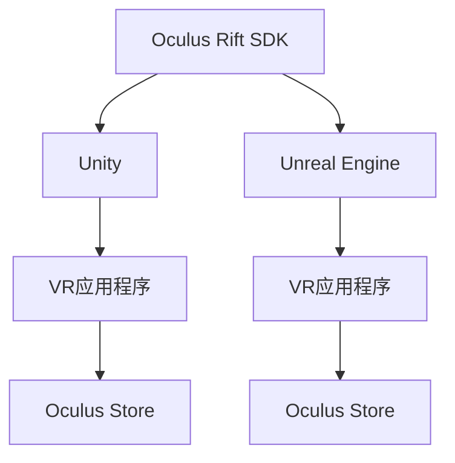

                 

# Oculus Rift SDK 集成指南：在 Rift 平台上开发 VR 应用的技巧

## 1. 背景介绍

随着虚拟现实(VR)技术的飞速发展，Oculus Rift等头戴式显示器(HMD)已成为VR领域的主流设备。开发VR应用不仅需要具备强大的图形处理能力，还需要对Oculus Rift SDK有深入了解。本文将系统介绍Oculus Rift SDK，并给出在 Rift 平台上开发VR应用的技巧。

## 2. 核心概念与联系

### 2.1 核心概念概述

- **Oculus Rift SDK**：Oculus Rift软件开发工具包，是Oculus官方提供的开发框架，用于在Rift平台上开发VR应用。
- **VR应用程序**：运行在VR设备上的应用程序，可以模拟3D环境、实时交互等。
- **应用程序实例(APP)**：通过Oculus Store等平台发布的VR应用。
- **Oculus Store**：Oculus官方应用商店，用户可以购买、下载和使用Oculus Rift SDK开发的VR应用。
- **Unity和Unreal Engine**：常用的VR游戏开发引擎，均支持Oculus Rift SDK，为开发者提供了丰富的开发工具和资源。

### 2.2 核心概念原理和架构的 Mermaid 流程图



## 3. 核心算法原理 & 具体操作步骤

### 3.1 算法原理概述

开发VR应用的核心是使用Oculus Rift SDK提供的API接口，实现对Rift平台的交互和渲染。主要包括以下步骤：

1. 创建Oculus Rift SDK环境。
2. 初始化Rift设备和应用程序实例。
3. 创建渲染器对象和3D场景。
4. 实现用户交互，如手势识别、触摸板操作等。
5. 绘制3D场景，并进行实时渲染。
6. 将渲染结果显示在Rift设备上。

### 3.2 算法步骤详解

#### 3.2.1 创建Oculus Rift SDK环境

1. **安装Oculus Rift SDK**：
   - 从Oculus官网下载并安装Oculus Rift SDK，适用于Unity和Unreal Engine。
   - 配置环境变量，添加Oculus Rift SDK目录到系统路径。

2. **安装Unity或Unreal Engine**：
   - 在官方下载并安装Unity或Unreal Engine。
   - 创建新的项目并添加Oculus Rift SDK插件。

#### 3.2.2 初始化Rift设备和应用程序实例

1. **创建应用程序实例(APP)**：
   - 在Unity编辑器中，点击File -> Create Project，创建新的Unity项目。
   - 在Unreal Engine中，选择Create Project -> VR -> VR Template，创建新的VR项目。

2. **添加Oculus Rift SDK插件**：
   - 在Unity编辑器中，在Project Settings -> XR Settings下，添加Oculus Rift SDK插件。
   - 在Unreal Engine中，在Plug-ins -> VR -> Add Plugin，添加Oculus Rift SDK插件。

3. **初始化Rift设备**：
   - 在Unity编辑器中，使用XR设备管理工具，连接Rift设备。
   - 在Unreal Engine中，使用Oculus Oculus HMD，连接Rift设备。

#### 3.2.3 创建渲染器对象和3D场景

1. **创建渲染器对象**：
   - 在Unity编辑器中，在Hierarchy面板中，创建一个XR渲染器对象。
   - 在Unreal Engine中，在Game Mode，创建一个Rift渲染器对象。

2. **创建3D场景**：
   - 在Unity编辑器中，创建3D场景，并添加VR相关的组件，如控制器、摄像机等。
   - 在Unreal Engine中，创建3D场景，并配置VR摄像机、光源等。

#### 3.2.4 实现用户交互

1. **手势识别**：
   - 在Unity编辑器中，使用Oculus Rift SDK插件，实现手势识别功能。
   - 在Unreal Engine中，使用Oculus Oculus SDK，实现手势识别功能。

2. **触摸板操作**：
   - 在Unity编辑器中，使用Oculus Rift SDK插件，实现触摸板操作。
   - 在Unreal Engine中，使用Oculus Oculus SDK，实现触摸板操作。

#### 3.2.5 绘制3D场景，并进行实时渲染

1. **绘制3D场景**：
   - 在Unity编辑器中，编写脚本来绘制3D场景中的对象。
   - 在Unreal Engine中，使用蓝图或编写C++代码，绘制3D场景中的对象。

2. **实时渲染**：
   - 在Unity编辑器中，使用XR渲染器对象，实现实时渲染。
   - 在Unreal Engine中，使用VR渲染器对象，实现实时渲染。

### 3.3 算法优缺点

#### 3.3.1 算法优点

- **开发效率高**：Oculus Rift SDK提供了丰富的API接口和文档，使开发者能够快速上手。
- **跨平台支持**：支持Unity和Unreal Engine两种游戏引擎，能够快速开发跨平台VR应用。
- **资源丰富**：Oculus Rift SDK提供了大量的VR组件和工具，能够加速开发进程。
- **社区活跃**：Oculus Rift SDK拥有活跃的开发者社区，开发者可以随时获取帮助和资源。

#### 3.3.2 算法缺点

- **学习曲线陡峭**：对于初学者来说，学习Oculus Rift SDK需要一定的时间和精力。
- **资源消耗大**：VR应用对图形处理和计算资源要求较高，可能面临硬件瓶颈。
- **优化难度高**：VR应用需要在实时性和渲染效果之间取得平衡，优化难度较高。

### 3.4 算法应用领域

Oculus Rift SDK广泛应用于VR游戏、虚拟培训、虚拟会议室、虚拟旅游等多个领域，以下是一些具体应用场景：

- **VR游戏**：如《Beat Saber》、《Superhot VR》等，通过Oculus Rift SDK实现实时渲染和用户交互。
- **虚拟培训**：如虚拟手术、虚拟环境模拟等，通过Oculus Rift SDK实现模拟场景和操作训练。
- **虚拟会议室**：如Skype VR、Google Meet VR等，通过Oculus Rift SDK实现多人实时互动。
- **虚拟旅游**：如《Xploration VR》、《Museum VR》等，通过Oculus Rift SDK实现沉浸式旅游体验。

## 4. 数学模型和公式 & 详细讲解 & 举例说明

### 4.1 数学模型构建

#### 4.1.1 渲染模型

1. **摄像机变换矩阵**：
   $$
   M = \begin{bmatrix}
   R & -T \\
   0 & 1
   \end{bmatrix}
   $$
   其中，$R$ 为旋转矩阵，$T$ 为平移向量。

2. **投影矩阵**：
   $$
   P = \frac{f}{z_n - z_f} \begin{bmatrix}
   f & 0 & 0 & 0 \\
   0 & f & 0 & 0 \\
   0 & 0 & f & 0 \\
   0 & 0 & -f(z_n + z_f) & 0
   \end{bmatrix}
   $$
   其中，$f$ 为焦距，$z_n$ 和 $z_f$ 为近裁剪面和远裁剪面。

#### 4.1.2 光源模型

1. **点光源**：
   $$
   I(\mathbf{x}) = I_0 \frac{L(\mathbf{x})}{\|\mathbf{x}-\mathbf{p}\|^2}
   $$
   其中，$I(\mathbf{x})$ 为光源强度，$I_0$ 为光源常量，$L(\mathbf{x})$ 为光源位置，$\mathbf{x}$ 为观察点。

2. **聚光灯**：
   $$
   I(\mathbf{x}) = I_0 \frac{L(\mathbf{x})}{\|\mathbf{x}-\mathbf{p}\|^2} \frac{1}{\cos^2(\theta)}
   $$
   其中，$\theta$ 为聚光灯角度。

### 4.2 公式推导过程

#### 4.2.1 摄像机变换矩阵

摄像机变换矩阵由旋转矩阵$R$和平移向量$T$组成，推导过程如下：

1. **旋转矩阵**：
   $$
   R = \begin{bmatrix}
   \cos \theta_y \cos \theta_x & -\cos \theta_y \sin \theta_x & \sin \theta_y \\
   \sin \theta_x \cos \theta_z & \cos \theta_x \cos \theta_z + \sin \theta_x \sin \theta_y \sin \theta_z & \sin \theta_x \sin \theta_z - \cos \theta_x \cos \theta_y \sin \theta_z \\
   -\sin \theta_z & \cos \theta_z & \cos \theta_z
   \end{bmatrix}
   $$
   其中，$\theta_x$、$\theta_y$、$\theta_z$ 为摄像机旋转角度。

2. **平移向量**：
   $$
   T = \begin{bmatrix}
   0 & 0 & 0 \\
   x & 0 & 0 \\
   0 & y & 0
   \end{bmatrix}
   $$
   其中，$x$、$y$ 为摄像机平移距离。

#### 4.2.2 投影矩阵

投影矩阵的推导过程如下：

1. **近裁剪面和远裁剪面**：
   $$
   z_n = 0.1, z_f = 1000
   $$
   其中，$z_n$ 为近裁剪面，$z_f$ 为远裁剪面。

2. **焦距**：
   $$
   f = 1
   $$
   其中，$f$ 为焦距。

3. **投影矩阵**：
   $$
   P = \frac{f}{z_n - z_f} \begin{bmatrix}
   f & 0 & 0 & 0 \\
   0 & f & 0 & 0 \\
   0 & 0 & f & 0 \\
   0 & 0 & -f(z_n + z_f) & 0
   \end{bmatrix}
   $$

### 4.3 案例分析与讲解

#### 4.3.1 手势识别

手势识别是VR应用中的关键功能之一。以Unity编辑器为例，实现手势识别的方法如下：

1. **导入手势识别插件**：
   - 在Unity编辑器中，使用包管理器导入Oculus Rift SDK插件中的手势识别功能。

2. **创建手势控制器**：
   - 在Hierarchy面板中，创建一个XR手势控制器对象。
   - 在Inspector面板中，配置手势控制器参数，如手势类型、识别距离等。

3. **实现手势事件**：
   - 在Scripting菜单中，创建手势事件脚本，并编写代码处理手势事件。
   - 在Unity编辑器中，将手势事件脚本挂载到手势控制器对象上。

#### 4.3.2 触摸板操作

触摸板操作是VR应用的另一重要功能。以Unity编辑器为例，实现触摸板操作的方法如下：

1. **导入触摸板插件**：
   - 在Unity编辑器中，使用包管理器导入Oculus Rift SDK插件中的触摸板功能。

2. **创建触摸板控制器**：
   - 在Hierarchy面板中，创建一个XR触摸板控制器对象。
   - 在Inspector面板中，配置触摸板控制器参数，如触摸板类型、识别区域等。

3. **实现触摸板事件**：
   - 在Scripting菜单中，创建触摸板事件脚本，并编写代码处理触摸板事件。
   - 在Unity编辑器中，将触摸板事件脚本挂载到触摸板控制器对象上。

## 5. 项目实践：代码实例和详细解释说明

### 5.1 开发环境搭建

#### 5.1.1 安装Unity或Unreal Engine

1. **安装Unity**：
   - 从Unity官网下载并安装Unity，适用于Windows和macOS。
   - 配置Unity Editor和Build Settings。

2. **安装Unreal Engine**：
   - 从Unreal Engine官网下载并安装Unreal Engine，适用于Windows和macOS。
   - 配置Unreal Engine Editor和Blueprints。

#### 5.1.2 配置Oculus Rift SDK

1. **导入Oculus Rift SDK插件**：
   - 在Unity编辑器中，使用包管理器导入Oculus Rift SDK插件。
   - 在Unreal Engine中，使用Oculus Oculus SDK，导入Oculus Rift SDK插件。

2. **连接Rift设备**：
   - 在Unity编辑器中，使用XR设备管理工具，连接Rift设备。
   - 在Unreal Engine中，使用Oculus Oculus HMD，连接Rift设备。

### 5.2 源代码详细实现

#### 5.2.1 创建应用程序实例

1. **创建Unity应用程序实例**：
   - 在Unity编辑器中，点击File -> Create Project，创建新的Unity项目。
   - 在Project Settings中，配置XR Settings，添加Oculus Rift SDK插件。

2. **创建Unreal Engine应用程序实例**：
   - 在Unreal Engine中，选择Create Project -> VR -> VR Template，创建新的VR项目。
   - 在Plug-ins -> VR -> Add Plugin，添加Oculus Rift SDK插件。

#### 5.2.2 初始化Rift设备和应用程序实例

1. **初始化Unity应用程序实例**：
   - 在Unity编辑器中，使用XR设备管理工具，连接Rift设备。
   - 在Scripting菜单中，创建XR初始化脚本，并编写代码初始化应用程序实例。

2. **初始化Unreal Engine应用程序实例**：
   - 在Unreal Engine中，使用Oculus Oculus HMD，连接Rift设备。
   - 在Blueprints中，创建XR初始化蓝图，并编写代码初始化应用程序实例。

#### 5.2.3 创建渲染器对象和3D场景

1. **创建Unity渲染器对象**：
   - 在Hierarchy面板中，创建一个XR渲染器对象。
   - 在Inspector面板中，配置渲染器对象参数，如分辨率、渲染距离等。

2. **创建Unreal Engine渲染器对象**：
   - 在Game Mode中，创建一个Rift渲染器对象。
   - 在Details面板中，配置渲染器对象参数，如分辨率、渲染距离等。

#### 5.2.4 实现用户交互

1. **实现Unity手势识别**：
   - 在Hierarchy面板中，创建一个XR手势控制器对象。
   - 在Inspector面板中，配置手势控制器参数，如手势类型、识别距离等。
   - 在Scripting菜单中，创建手势事件脚本，并编写代码处理手势事件。

2. **实现Unreal Engine触摸板操作**：
   - 在Hierarchy面板中，创建一个XR触摸板控制器对象。
   - 在Inspector面板中，配置触摸板控制器参数，如触摸板类型、识别区域等。
   - 在Blueprints中，创建触摸板事件蓝图，并编写代码处理触摸板事件。

#### 5.2.5 绘制3D场景，并进行实时渲染

1. **绘制Unity3D场景**：
   - 在Hierarchy面板中，创建3D场景中的对象，并添加VR相关的组件，如控制器、摄像机等。
   - 在Scripting菜单中，创建3D场景脚本，并编写代码绘制3D场景。

2. **绘制Unreal Engine3D场景**：
   - 在Game Mode中，创建3D场景中的对象，并配置VR摄像机、光源等。
   - 在Blueprints中，创建3D场景蓝图，并编写代码绘制3D场景。

### 5.3 代码解读与分析

#### 5.3.1 Unity代码实例

```csharp
using UnityEngine;
using UnityEngine.XR;
using UnityEngine.XR.Interaction.Toolkit;

public class XRInitialization : MonoBehaviour
{
    void Start()
    {
        XRSessionManager xrSessionManager = XRSessionManager.Instance;
        xrSessionManager博士生模式
    }
}

public class XRGestureController : XRInteractionComponent
{
    void Update()
    {
        if (XRInputSystem.current != null)
        {
            XRDevice xrDevice = XRInputSystem.current.device;
            XRController xrController = xrDevice.controller;
            XRGesture gesture = xrController.inputData.gesture;
            if (gesture.type == XRGestureType.GestureHandShake)
            {
                // 处理手势事件
            }
        }
    }
}

public class XRTouchController : XRInteractionComponent
{
    void Update()
    {
        if (XRInputSystem.current != null)
        {
            XRDevice xrDevice = XRInputSystem.current.device;
            XRController xrController = xrDevice.controller;
            XRTouch controllerTouch = xrController.inputData.touch;
            if (controllerTouch.type == XRTouchType.TouchTap)
            {
                // 处理触摸板事件
            }
        }
    }
}
```

#### 5.3.2 Unreal Engine代码实例

```cpp
#define SETUP_API ANDROID(EngineClass)
#define PLATFORM_API(X) PLATFORM_API(EngineClass)X
// #include <OVR_Unity.h>
// #include <OVR_UnityManager.h>

void FVRProjectInitialize()
{
    APlayerController* PC = NULL;
    // Set up VR input system
    if (GEngine != NULL && GEngine->Init && GEngine->PlatformEngine && GEngine->PlatformEngine->HasBeginPlay)
    {
        GEngine->BeginPlay();
        PC = GetFirstPlayerController();
        if (PC)
        {
            PC->bDoInput = true;
        }
    }
    UVRManager* PVRManager = UVRManager::GetCurrentVRManager();
    UVR* PVR = PVRManager->GetPrimaryVR();
    if (PVR)
    {
        PVR->Init();
    }
}

void FVRProjectShutdown()
{
    UVRManager* PVRManager = UVRManager::GetCurrentVRManager();
    if (PVRManager)
    {
        UVR* PVR = PVRManager->GetPrimaryVR();
        if (PVR)
        {
            PVR->Shutdown();
        }
    }
}
```

## 6. 实际应用场景

### 6.1 智能教室

智能教室中，学生可以通过VR设备进行虚拟实验、模拟课堂、互动学习等。使用Oculus Rift SDK开发的VR应用，能够提供沉浸式的教学体验，提升学生的学习兴趣和参与度。

### 6.2 医疗培训

医疗培训中，医生可以通过VR设备进行手术模拟、病例分析、患者诊断等。使用Oculus Rift SDK开发的VR应用，能够提供高质量的模拟环境，帮助医生提高专业技能和实操能力。

### 6.3 军事训练

军事训练中，士兵可以通过VR设备进行虚拟战场、战术演练、特种训练等。使用Oculus Rift SDK开发的VR应用，能够提供逼真的训练场景，提升士兵的战斗技能和心理素质。

## 7. 工具和资源推荐

### 7.1 学习资源推荐

1. **Oculus Rift SDK官方文档**：详细介绍了Oculus Rift SDK的API接口和使用方法。
2. **Unity VR开发教程**：Unity官方提供的VR开发教程，涵盖VR应用开发的基本概念和技巧。
3. **Unreal Engine VR开发教程**：Unreal Engine官方提供的VR开发教程，涵盖VR应用开发的基本概念和技巧。
4. **Oculus VR开发者社区**：Oculus Rift SDK开发者社区，提供丰富的资源和交流平台。

### 7.2 开发工具推荐

1. **Unity Editor**：Unity官方提供的VR开发环境，支持VR应用开发和测试。
2. **Unreal Engine Editor**：Unreal Engine官方提供的VR开发环境，支持VR应用开发和测试。
3. **Oculus SDK Manager**：Oculus Rift SDK管理工具，方便开发者进行SDK的安装、配置和更新。

### 7.3 相关论文推荐

1. **《Oculus Rift SDK教程》**：Oculus Rift SDK官方教程，详细介绍Oculus Rift SDK的使用方法和技巧。
2. **《Unity VR应用开发》**：Unity官方提供的VR应用开发指南，涵盖VR应用开发的基本概念和技巧。
3. **《Unreal Engine VR应用开发》**：Unreal Engine官方提供的VR应用开发指南，涵盖VR应用开发的基本概念和技巧。

## 8. 总结：未来发展趋势与挑战

### 8.1 未来发展趋势

未来，VR技术将更加普及和成熟，Oculus Rift SDK也将不断更新和优化。以下是几个发展趋势：

1. **跨平台支持**：Oculus Rift SDK将支持更多平台和设备，如手机、PC、AR眼镜等。
2. **硬件升级**：Oculus Rift SDK将不断升级硬件性能，提升VR应用的渲染效果和实时性。
3. **功能丰富**：Oculus Rift SDK将提供更多功能模块，如手势识别、触觉反馈、眼球追踪等。
4. **开发者支持**：Oculus Rift SDK将提供更多开发者工具和资源，帮助开发者快速开发和测试VR应用。

### 8.2 面临的挑战

尽管Oculus Rift SDK在VR应用开发中取得了很大进展，但仍面临一些挑战：

1. **性能瓶颈**：VR应用对图形处理和计算资源要求较高，可能面临硬件瓶颈。
2. **优化难度**：VR应用需要在实时性和渲染效果之间取得平衡，优化难度较高。
3. **用户体验**：VR设备的质量和舒适度对用户体验有很大影响，需要进一步优化。
4. **生态系统**：VR设备的生态系统还不完善，需要更多开发者和用户支持。

### 8.3 研究展望

未来的研究方向包括：

1. **高性能渲染**：开发高性能渲染技术，提升VR应用的渲染效果和实时性。
2. **智能交互**：开发智能交互技术，提升VR用户的沉浸感和交互体验。
3. **跨平台集成**：开发跨平台集成技术，方便开发者在不同平台之间进行VR应用开发和部署。

## 9. 附录：常见问题与解答

### 9.1 常见问题

1. **如何优化VR应用的渲染效果？**
   - 优化渲染效果的方法包括：
     - 使用高质量的3D模型和纹理。
     - 使用高效的光照模型和着色器。
     - 使用多线程和异步渲染技术。

2. **如何提升VR应用的实时性？**
   - 提升实时性的方法包括：
     - 优化渲染管线，减少渲染时间和计算量。
     - 使用硬件加速技术，如GPU和TPU。
     - 使用延迟渲染和预渲染技术。

3. **如何提升VR用户的沉浸感？**
   - 提升沉浸感的方法包括：
     - 提供高质量的3D环境和纹理。
     - 使用音效和振动反馈技术。
     - 优化用户交互界面和操作体验。

### 9.2 解答

1. **如何优化VR应用的渲染效果？**
   - 优化渲染效果的方法包括：
     - 使用高质量的3D模型和纹理。
     - 使用高效的光照模型和着色器。
     - 使用多线程和异步渲染技术。

2. **如何提升VR应用的实时性？**
   - 提升实时性的方法包括：
     - 优化渲染管线，减少渲染时间和计算量。
     - 使用硬件加速技术，如GPU和TPU。
     - 使用延迟渲染和预渲染技术。

3. **如何提升VR用户的沉浸感？**
   - 提升沉浸感的方法包括：
     - 提供高质量的3D环境和纹理。
     - 使用音效和振动反馈技术。
     - 优化用户交互界面和操作体验。

---

作者：禅与计算机程序设计艺术 / Zen and the Art of Computer Programming

