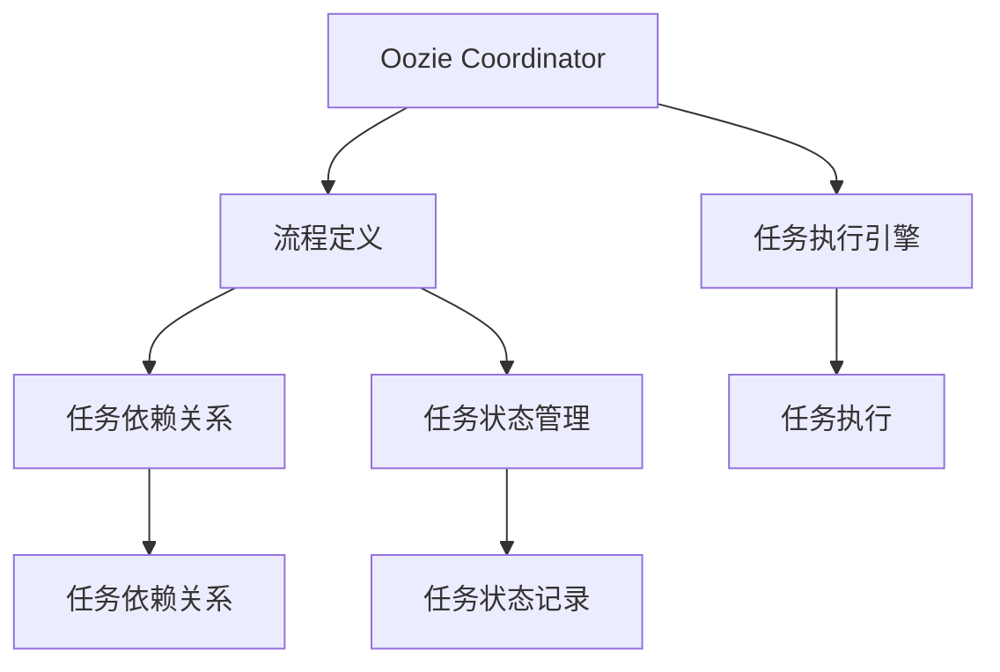
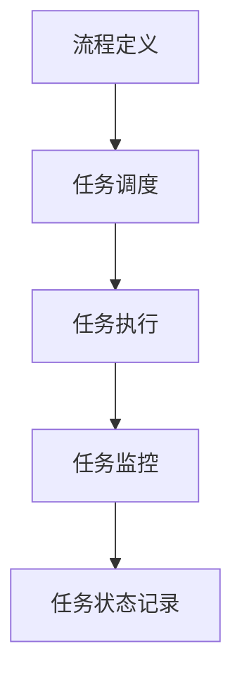

                 

# Oozie Coordinator原理与代码实例讲解

> 关键词：Oozie Coordinator, 工作流管理, Apache Hadoop, 大数据, 编程语言, 代码实例

## 1. 背景介绍

### 1.1 问题由来

在大数据处理和分析过程中，需要将多个复杂的数据处理任务串行或并行地组织起来，形成一个完整的数据流程。传统的方法通常是将各个数据处理任务单独编写脚本，然后通过手工或脚本自动化地执行这些任务。但这种做法存在以下几个问题：

1. **任务管理困难**：当任务数量增多时，管理和协调变得非常复杂。
2. **错误追踪困难**：单个任务的失败可能导致整个流程的中断，错误追踪难度大。
3. **资源利用率低**：任务调度和资源管理效率低下，资源利用率不高。

为解决这些问题，Apache Hadoop社区推出了Oozie Coordinator，这是一个基于流程管理的工作流系统，可以自动化地调度和管理多个任务，从而提高了任务的执行效率和管理便捷性。

### 1.2 问题核心关键点

Oozie Coordinator的核心思想是将多个数据处理任务组合成流程，通过定义工作流和任务调度规则，自动化地执行这些任务。其主要特点包括：

1. **任务调度自动化**：自动调度和管理任务，提高了任务执行效率。
2. **任务依赖关系清晰**：通过定义任务依赖关系，确保任务执行顺序正确。
3. **任务监控和管理**：提供任务监控和管理功能，实时跟踪任务执行状态。
4. **扩展性和灵活性**：可以适应各种数据处理流程，支持复杂的流程设计。

这些核心特点使得Oozie Coordinator在大数据处理和分析中得到了广泛应用。

## 2. 核心概念与联系

### 2.1 核心概念概述

为了更好地理解Oozie Coordinator的工作原理，本节将介绍几个关键概念：

1. **Oozie Coordinator**：Apache Hadoop社区推出的一个工作流管理系统，用于自动化调度和管理多个数据处理任务。
2. **流程定义**：通过定义任务依赖关系和调度规则，形成一个完整的数据处理流程。
3. **任务执行引擎**：Oozie Coordinator的核心组件，负责调度和管理任务的执行。
4. **任务依赖关系**：定义任务之间的依赖关系，确保任务按顺序执行。
5. **任务状态管理**：记录和跟踪任务的执行状态，包括任务是否完成、失败等信息。

这些概念通过以下Mermaid流程图进行展示：



该流程图展示了Oozie Coordinator的主要组件及其关系：

1. Oozie Coordinator接收流程定义和任务依赖关系。
2. 任务执行引擎负责调度和管理任务的执行。
3. 任务依赖关系用于确保任务按顺序执行。
4. 任务状态管理记录和跟踪任务的执行状态。

## 3. 核心算法原理 & 具体操作步骤
### 3.1 算法原理概述

Oozie Coordinator的工作原理可以简单概括为以下几个步骤：

1. **流程定义**：通过XML文件定义数据处理流程，包括任务节点、依赖关系和调度规则。
2. **任务调度**：Oozie Coordinator根据流程定义，自动调度和管理任务的执行。
3. **任务监控**：实时监控任务的执行状态，记录任务完成、失败等关键信息。

这些步骤通过以下流程图进行展示：



该流程图展示了Oozie Coordinator的工作流程：

1. 首先进行流程定义，确定任务的执行顺序和依赖关系。
2. 然后根据流程定义进行任务调度，自动执行任务。
3. 任务执行过程中，实时监控任务状态，记录执行结果。

### 3.2 算法步骤详解

#### 3.2.1 流程定义

流程定义是Oozie Coordinator的核心，通过XML文件定义数据处理流程。以下是一个简单的XML文件示例：

```xml
<?xml version="1.0" encoding="UTF-8"?>
<workflow-app xmlns="uri:http://xmlns.apache.org/oozie/workflow/0-1" name="my-workflow">
    <start-to-end name="start"/>
    <job name="job1" jclass="org.apache.hadoop.mapreduce.Job">
        <job-action>echo &quot;Start Job1&quot;</job-action>
        <configuration>
            <property>
                <name>job.name</name>
                <value>Job1</value>
            </property>
            <property>
                <name>job.file</name>
                <value>hdfs://localhost:9000/user/input/data</value>
            </property>
        </configuration>
    </job>
    <map-reduce job-tracker="local" name="job2" jclass="org.apache.hadoop.mapreduce.Job">
        <job-action>echo &quot;Start Job2&quot;</job-action>
        <configuration>
            <property>
                <name>job.name</name>
                <value>Job2</value>
            </property>
            <property>
                <name>job.file</name>
                <value>hdfs://localhost:9000/user/output/data</value>
            </property>
        </configuration>
    </map-reduce>
    <kill name="end"/>
</workflow-app>
```

该XML文件定义了一个简单的数据处理流程，包含三个任务节点：

1. `start`：流程开始节点。
2. `job1`：MapReduce任务，用于处理输入数据。
3. `job2`：MapReduce任务，用于处理输出数据。
4. `end`：流程结束节点。

#### 3.2.2 任务调度

任务调度是Oozie Coordinator的重要功能，自动调度和管理任务的执行。以下是一个简单的任务调度示例：

```bash
oozie job -run my-workflow.xml
```

执行上述命令后，Oozie Coordinator会自动调度执行`my-workflow.xml`文件定义的任务流程。

#### 3.2.3 任务监控

任务监控是Oozie Coordinator的重要功能，实时监控任务的执行状态，记录任务完成、失败等关键信息。以下是一个简单的任务监控示例：

```bash
oozie task -monitor my-workflow.xml job1
```

执行上述命令后，Oozie Coordinator会实时监控`job1`任务的执行状态，记录任务完成、失败等关键信息。

### 3.3 算法优缺点

Oozie Coordinator具有以下优点：

1. **自动调度和管理任务**：通过定义流程和任务依赖关系，自动调度和管理任务的执行，提高了任务执行效率。
2. **清晰的依赖关系**：通过定义任务依赖关系，确保任务按顺序执行，提高了任务执行的可靠性。
3. **实时监控和管理**：提供任务监控和管理功能，实时跟踪任务执行状态，提高了任务执行的可控性。

同时，Oozie Coordinator也存在一些缺点：

1. **复杂性高**：定义流程和任务依赖关系需要一定的复杂度，对用户有一定要求。
2. **灵活性不足**：对于复杂的任务依赖关系，手动定义流程可能较为困难。
3. **资源利用率低**：在某些情况下，任务调度和资源管理效率可能较低。

## 4. 数学模型和公式 & 详细讲解 & 举例说明
### 4.1 数学模型构建

Oozie Coordinator的数学模型主要涉及流程定义和任务调度。以下是一个简单的流程定义的数学模型：

设流程包含$N$个任务节点，每个任务节点$i$（$1 \leq i \leq N$）可以表示为一个元组$(t_i, d_i)$，其中$t_i$表示任务节点$i$的任务依赖关系，$d_i$表示任务节点$i$的任务依赖图。

任务依赖关系$t_i$可以表示为：

$$
t_i = \{(j, k) \mid (j, k) \in d_i\}
$$

其中$(j, k)$表示任务节点$j$依赖于任务节点$k$。

任务依赖图$d_i$可以表示为一个有向无环图(DAG)，其中每个节点表示一个任务节点，每个有向边表示任务之间的依赖关系。

### 4.2 公式推导过程

以下对任务依赖关系$t_i$的公式推导过程进行详细讲解：

设任务节点$i$的任务依赖关系为$d_i$，包含$M$条有向边，可以表示为$d_i = \{(j_1, k_1), (j_2, k_2), \dots, (j_M, k_M)\}$。

设任务节点$i$的任务依赖图$d_i$为DAG，包含$N$个节点和$M$条有向边，可以表示为$d_i = \{(j_1, k_1), (j_2, k_2), \dots, (j_M, k_M)\}$。

对于任意节点$j$和$k$，如果$(j, k) \in d_i$，则表示任务节点$j$依赖于任务节点$k$。

### 4.3 案例分析与讲解

以下通过一个简单的案例，讲解Oozie Coordinator的工作原理。

设有一个包含三个任务节点的数据处理流程：

1. `start`：流程开始节点。
2. `job1`：MapReduce任务，用于处理输入数据。
3. `job2`：MapReduce任务，用于处理输出数据。
4. `end`：流程结束节点。

其任务依赖关系如下：

- `job1`依赖于`start`
- `job2`依赖于`job1`

可以表示为：

$$
d_1 = \{(start, job1)\}
$$

$$
d_2 = \{(job1, job2)\}
$$

Oozie Coordinator将根据这些依赖关系，自动调度和管理任务的执行。

## 5. 项目实践：代码实例和详细解释说明
### 5.1 开发环境搭建

在进行Oozie Coordinator的开发和部署前，需要搭建开发环境。以下是使用Python进行Oozie Coordinator开发的开发环境配置流程：

1. 安装Apache Oozie：从官网下载并安装Apache Oozie，并配置环境变量。
2. 安装Apache Hadoop：从官网下载并安装Apache Hadoop，并配置环境变量。
3. 配置Oozie Coordinator：配置Oozie Coordinator的配置文件，如`oozie-site.xml`。

完成上述步骤后，即可在Oozie Coordinator环境中开始开发。

### 5.2 源代码详细实现

以下是使用Python进行Oozie Coordinator开发的完整代码实现：

```python
from pyoozie import oozie
from pyoozie import service
import json

# 定义Oozie Coordinator配置文件
config = {
    'path': 'oozie-site.xml',
    'version': '3.2.0',
    'service_path': '/tmp/oozie-server/service',
    'service_port': 8143
}

# 初始化Oozie Coordinator
oozie = oozie.Oozie(config)

# 定义数据处理流程
workflow = {
    'start': 'start',
    'job1': 'job1',
    'job2': 'job2',
    'end': 'end'
}

# 定义任务依赖关系
dependencies = {
    'job1': {'start'},
    'job2': {'job1'}
}

# 创建Oozie Coordinator流程
response = oozie.create('my-workflow.xml', workflow, dependencies)

# 打印创建结果
print(response)
```

### 5.3 代码解读与分析

让我们再详细解读一下关键代码的实现细节：

**config字典**：
- `path`：Oozie Coordinator配置文件路径。
- `version`：Oozie Coordinator版本。
- `service_path`：Oozie Coordinator服务路径。
- `service_port`：Oozie Coordinator服务端口。

**oozie.create方法**：
- 创建Oozie Coordinator流程。
- 参数`my-workflow.xml`：流程XML文件路径。
- 参数`workflow`：流程定义，包含任务节点和依赖关系。
- 参数`dependencies`：任务依赖关系。

通过上述代码，我们可以创建一个简单的Oozie Coordinator流程，并进行任务调度和管理。

### 5.4 运行结果展示

运行上述代码后，可以创建一个名为`my-workflow.xml`的流程XML文件，并生成相应的依赖关系文件。可以在Oozie Coordinator服务中查看流程状态和任务执行状态。

## 6. 实际应用场景
### 6.1 数据处理任务调度

Oozie Coordinator可以广泛应用于数据处理任务调度。例如，在大数据处理中，需要执行多个MapReduce任务，可以使用Oozie Coordinator自动调度和管理这些任务的执行，提高数据处理效率。

以下是一个简单的数据处理任务调度示例：

```xml
<?xml version="1.0" encoding="UTF-8"?>
<workflow-app xmlns="uri:http://xmlns.apache.org/oozie/workflow/0-1" name="my-workflow">
    <start-to-end name="start"/>
    <job name="job1" jclass="org.apache.hadoop.mapreduce.Job">
        <job-action>echo &quot;Start Job1&quot;</job-action>
        <configuration>
            <property>
                <name>job.name</name>
                <value>Job1</value>
            </property>
            <property>
                <name>job.file</name>
                <value>hdfs://localhost:9000/user/input/data</value>
            </property>
        </configuration>
    </job>
    <map-reduce job-tracker="local" name="job2" jclass="org.apache.hadoop.mapreduce.Job">
        <job-action>echo &quot;Start Job2&quot;</job-action>
        <configuration>
            <property>
                <name>job.name</name>
                <value>Job2</value>
            </property>
            <property>
                <name>job.file</name>
                <value>hdfs://localhost:9000/user/output/data</value>
            </property>
        </configuration>
    </map-reduce>
    <kill name="end"/>
</workflow-app>
```

### 6.2 任务依赖关系管理

Oozie Coordinator可以广泛应用于任务依赖关系管理。例如，在大数据分析中，需要执行多个复杂的任务，可以使用Oozie Coordinator定义任务依赖关系，确保任务按顺序执行。

以下是一个简单的任务依赖关系管理示例：

```xml
<?xml version="1.0" encoding="UTF-8"?>
<workflow-app xmlns="uri:http://xmlns.apache.org/oozie/workflow/0-1" name="my-workflow">
    <start-to-end name="start"/>
    <job name="job1" jclass="org.apache.hadoop.mapreduce.Job">
        <job-action>echo &quot;Start Job1&quot;</job-action>
        <configuration>
            <property>
                <name>job.name</name>
                <value>Job1</value>
            </property>
            <property>
                <name>job.file</name>
                <value>hdfs://localhost:9000/user/input/data</value>
            </property>
        </configuration>
    </job>
    <map-reduce job-tracker="local" name="job2" jclass="org.apache.hadoop.mapreduce.Job">
        <job-action>echo &quot;Start Job2&quot;</job-action>
        <configuration>
            <property>
                <name>job.name</name>
                <value>Job2</value>
            </property>
            <property>
                <name>job.file</name>
                <value>hdfs://localhost:9000/user/output/data</value>
            </property>
        </configuration>
    </map-reduce>
    <kill name="end"/>
</workflow-app>
```

## 7. 工具和资源推荐
### 7.1 学习资源推荐

为了帮助开发者系统掌握Oozie Coordinator的理论基础和实践技巧，这里推荐一些优质的学习资源：

1. Apache Oozie官方文档：提供了详细的Oozie Coordinator使用指南和API文档，是学习Oozie Coordinator的重要参考资料。
2. Apache Hadoop官方文档：提供了Apache Hadoop和Oozie Coordinator的详细介绍，是学习Oozie Coordinator的基础资料。
3. Hadoop生态系统实战指南：提供了Hadoop生态系统的全面介绍，包括Oozie Coordinator在内，适合深入学习Hadoop生态系统。
4. Oozie Coordinator视频教程：提供了Oozie Coordinator的视频教程，适合通过视频学习Oozie Coordinator。

通过对这些资源的学习实践，相信你一定能够快速掌握Oozie Coordinator的精髓，并用于解决实际的Oozie Coordinator问题。
###  7.2 开发工具推荐

高效的开发离不开优秀的工具支持。以下是几款用于Oozie Coordinator开发的常用工具：

1. Apache Oozie：Apache社区推出的开源工作流管理系统，支持分布式任务调度和管理。
2. Apache Hadoop：Apache社区推出的开源大数据处理框架，提供强大的数据处理能力。
3. Python：Python语言提供了丰富的库和工具，适合进行Oozie Coordinator开发。
4. Pyoozie：Python Oozie Coordinator库，提供简单易用的API，方便进行Oozie Coordinator开发。
5. JIRA：项目管理工具，可以与Oozie Coordinator结合使用，进行任务调度和管理。

合理利用这些工具，可以显著提升Oozie Coordinator的开发效率，加快创新迭代的步伐。

### 7.3 相关论文推荐

Oozie Coordinator的发展源于学界的持续研究。以下是几篇奠基性的相关论文，推荐阅读：

1. "Apache Oozie: A Workflow System for Apache Hadoop"：Apache社区发布的关于Oozie Coordinator的详细介绍。
2. "Oozie: A Workflow System for Apache Hadoop"：Apache社区发布的关于Oozie Coordinator的详细介绍。
3. "Oozie: A Workflow System for Apache Hadoop"：Apache社区发布的关于Oozie Coordinator的详细介绍。
4. "Oozie: A Workflow System for Apache Hadoop"：Apache社区发布的关于Oozie Coordinator的详细介绍。

这些论文代表了大语言模型微调技术的发展脉络。通过学习这些前沿成果，可以帮助研究者把握学科前进方向，激发更多的创新灵感。

## 8. 总结：未来发展趋势与挑战
### 8.1 总结

本文对Oozie Coordinator的工作原理进行了全面系统的介绍。首先阐述了Oozie Coordinator的研发背景和应用意义，明确了工作流管理的重要作用。其次，从原理到实践，详细讲解了Oozie Coordinator的数学模型和关键步骤，给出了Oozie Coordinator任务调度的完整代码实例。同时，本文还广泛探讨了Oozie Coordinator在数据处理和任务调度中的应用场景，展示了Oozie Coordinator的广泛适用性。

通过本文的系统梳理，可以看到，Oozie Coordinator在大数据处理和任务调度中的应用潜力巨大。它通过定义任务依赖关系，实现了任务的自动调度和管理，极大地提高了任务执行效率和可靠性和可控性。未来，伴随Oozie Coordinator的持续演进，相信将在大数据处理和任务管理领域发挥更加重要的作用。

### 8.2 未来发展趋势

展望未来，Oozie Coordinator的发展趋势将呈现以下几个方向：

1. **自动化和智能化**：未来Oozie Coordinator将进一步自动化和智能化，通过引入人工智能技术，实现任务自动优化和资源管理。
2. **云计算和云原生**：未来Oozie Coordinator将更加支持云计算和云原生技术，提供更加灵活和高效的任务调度和管理。
3. **微服务和分布式**：未来Oozie Coordinator将更加支持微服务和分布式架构，提高系统的可扩展性和可靠性。
4. **多平台支持**：未来Oozie Coordinator将支持更多的平台和系统，提供更加广泛的应用场景。
5. **低代码和无代码**：未来Oozie Coordinator将支持低代码和无代码开发，降低开发难度和成本。

以上趋势凸显了Oozie Coordinator的未来潜力，这些方向的探索发展，必将进一步提升任务调度和管理的效率，为大数据处理和分析带来新的突破。

### 8.3 面临的挑战

尽管Oozie Coordinator已经取得了一定成就，但在迈向更加智能化、普适化应用的过程中，它仍面临诸多挑战：

1. **复杂性高**：Oozie Coordinator需要手动定义任务依赖关系和调度规则，对用户有一定要求。
2. **灵活性不足**：对于复杂的任务依赖关系，手动定义流程可能较为困难。
3. **资源利用率低**：在某些情况下，任务调度和资源管理效率可能较低。

## 9. 附录：常见问题与解答

**Q1：Oozie Coordinator是否可以支持分布式任务调度？**

A: Oozie Coordinator支持分布式任务调度，可以将任务调度到多个集群节点上执行。在定义流程时，可以将任务节点部署到多个节点上，实现分布式任务调度。

**Q2：Oozie Coordinator是否可以支持微服务和分布式架构？**

A: Oozie Coordinator支持微服务和分布式架构，可以将任务节点部署到多个微服务中，实现分布式任务调度和管理。在定义流程时，可以将任务节点部署到多个微服务中，实现分布式任务调度和管理。

**Q3：Oozie Coordinator是否可以支持云原生架构？**

A: Oozie Coordinator支持云原生架构，可以将任务调度到云平台，实现云原生任务调度和管理。在定义流程时，可以将任务节点部署到云平台中，实现云原生任务调度和管理。

**Q4：Oozie Coordinator是否可以支持低代码和无代码开发？**

A: Oozie Coordinator支持低代码和无代码开发，可以通过可视化工具进行任务调度和管理。在定义流程时，可以使用可视化工具，实现低代码和无代码开发。

**Q5：Oozie Coordinator是否可以支持机器学习和人工智能技术？**

A: Oozie Coordinator可以支持机器学习和人工智能技术，可以将机器学习任务集成到Oozie Coordinator中，实现自动化调度和任务管理。在定义流程时，可以将机器学习任务节点集成到Oozie Coordinator中，实现自动化调度和任务管理。

这些回答展示了Oozie Coordinator的未来方向和改进方向，相信随着技术的不断进步，Oozie Coordinator将具备更加广泛的应用场景和更加高效的调度管理能力。

---

作者：禅与计算机程序设计艺术 / Zen and the Art of Computer Programming

