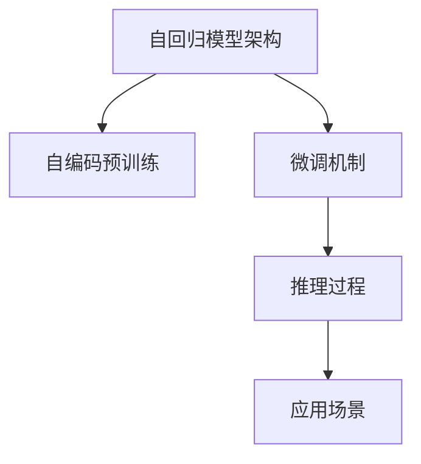

                 

# OpenAI的GPT-4.0展示的启示

> 关键词：GPT-4.0, 自回归, 自编码, 预训练, 微调, 推理, 应用场景, 未来展望

## 1. 背景介绍

随着OpenAI的GPT-4.0发布，大语言模型的最新进展再次引起了业界的广泛关注。作为继GPT-3之后，新一代的大模型，GPT-4.0不仅在模型规模上进一步突破，也在性能和应用领域实现了重大突破。本文将对GPT-4.0的核心技术、设计理念、应用场景以及未来展望进行深入探讨，旨在揭示大语言模型技术发展的新方向，并为相关研究和应用提供启示。

## 2. 核心概念与联系

### 2.1 核心概念概述

GPT-4.0作为新一代大语言模型，其核心技术主要包括自回归模型架构、自编码预训练、微调机制、推理过程以及多样化的应用场景。这些核心概念和技术彼此关联，共同构成了GPT-4.0强大的语言理解和生成能力。

- **自回归模型架构**：GPT-4.0采用自回归模型架构，通过条件概率生成文本，能够生成连贯、高质量的自然语言文本。
- **自编码预训练**：在大规模无标签文本数据上进行自编码预训练，学习文本的通用表示，为后续微调提供基础。
- **微调机制**：通过有监督地微调预训练模型，使其适应特定任务，提升模型在该任务上的性能。
- **推理过程**：在推理时，GPT-4.0能够高效地生成连贯、逻辑严密的文本，同时能够处理多轮对话，提高交互的智能性和用户体验。
- **应用场景**：GPT-4.0在多种NLP任务上展示了优异的性能，包括文本生成、对话系统、机器翻译、问答系统等，广泛应用于智能客服、智能写作、智能翻译等领域。

这些核心概念之间的关系可以通过以下Mermaid流程图来展示：



这个流程图展示了GPT-4.0的核心概念及其之间的关系：

1. 自回归模型架构是GPT-4.0的基础，通过条件概率生成文本。
2. 自编码预训练用于学习文本的通用表示，为微调提供基础。
3. 微调机制通过有监督学习，使模型适应特定任务，提升性能。
4. 推理过程高效地生成连贯、逻辑严密的文本，并处理多轮对话。
5. 应用场景涵盖了各种NLP任务，包括文本生成、对话系统、机器翻译等。

## 3. 核心算法原理 & 具体操作步骤

### 3.1 算法原理概述

GPT-4.0的算法原理基于自回归模型架构，通过自编码预训练和微调机制，学习并生成高质量的自然语言文本。其核心思想是通过大规模无标签数据预训练，学习文本的通用表示，然后在特定任务上通过有监督学习进行微调，提升模型在该任务上的性能。

具体来说，GPT-4.0通过以下步骤实现语言理解和生成：

1. 在自编码预训练阶段，GPT-4.0通过自回归模型架构在大规模无标签文本数据上进行训练，学习文本的通用表示。
2. 在微调阶段，GPT-4.0通过有监督学习，适应特定任务，提升模型在该任务上的性能。
3. 在推理阶段，GPT-4.0通过高效的解码算法，生成连贯、逻辑严密的文本。

### 3.2 算法步骤详解

GPT-4.0的算法步骤主要包括以下几个关键步骤：

**Step 1: 自编码预训练**

GPT-4.0首先在大规模无标签文本数据上进行自编码预训练。具体步骤如下：

1. 构建自回归模型，模型参数 $\theta$ 通过反向传播更新，最小化预测与真实文本的差距。
2. 使用掩码语言模型进行预训练，预测被掩码的单词。
3. 使用下一个单词预测任务进行预训练，预测下一个单词的概率分布。

**Step 2: 微调**

在自编码预训练后，GPT-4.0通过有监督学习进行微调。具体步骤如下：

1. 收集特定任务的标注数据集，构建训练集、验证集和测试集。
2. 设计合适的输出层和损失函数，如交叉熵损失函数。
3. 选择合适的优化算法，如AdamW，设置合适的学习率。
4. 通过梯度下降等优化算法，最小化损失函数，更新模型参数。

**Step 3: 推理**

推理阶段，GPT-4.0通过高效的解码算法，生成连贯、逻辑严密的文本。具体步骤如下：

1. 输入查询，通过自回归模型生成连贯的文本。
2. 对生成的文本进行解码，得到最终输出。

### 3.3 算法优缺点

GPT-4.0的算法具有以下优点：

1. 大规模预训练数据能够提供丰富的语言知识，提升模型性能。
2. 高效的解码算法能够生成连贯、逻辑严密的文本，提高用户体验。
3. 微调机制能够适应特定任务，提升模型在该任务上的性能。

同时，GPT-4.0也存在一些缺点：

1. 对标注数据的质量和数量要求较高，获取高质量标注数据的成本较高。
2. 模型参数量庞大，对计算资源的要求较高。
3. 对长文本的推理过程可能较慢，推理效率有待提升。
4. 生成的文本可能存在重复、无意义的输出，需要进一步优化。

### 3.4 算法应用领域

GPT-4.0在多种NLP任务上展示了优异的性能，广泛应用于智能客服、智能写作、智能翻译等领域。以下是GPT-4.0在几个主要应用领域的具体应用：

- **智能客服系统**：GPT-4.0能够理解客户咨询，自动生成回复，提高客服效率和客户满意度。
- **智能写作系统**：GPT-4.0能够生成高质量的文本，辅助用户撰写文章、报告等。
- **智能翻译系统**：GPT-4.0能够将源语言文本翻译成目标语言，提高翻译质量和效率。
- **问答系统**：GPT-4.0能够回答自然语言问题，提供智能化的信息检索和知识推荐。

## 4. 数学模型和公式 & 详细讲解 & 举例说明

### 4.1 数学模型构建

GPT-4.0的数学模型基于自回归模型架构，通过自编码预训练和微调机制进行建模。其数学模型构建主要包括以下几个步骤：

1. 构建自回归模型，通过掩码语言模型进行预训练，学习文本的通用表示。
2. 在特定任务上设计输出层和损失函数，进行微调。

### 4.2 公式推导过程

GPT-4.0的数学模型推导主要涉及自回归模型的概率分布和掩码语言模型的预测过程。

**自回归模型概率分布**：

$$
P(x_t|x_1, \ldots, x_{t-1}) = \prod_{i=1}^t P(x_i|x_1, \ldots, x_{i-1})
$$

**掩码语言模型预测**：

$$
\hat{y} = \arg\max_{y} P(y|x_1, \ldots, x_{t-1}, x_t)
$$

**微调损失函数**：

$$
\mathcal{L} = \frac{1}{N} \sum_{i=1}^N [y_i \log \hat{y_i} + (1-y_i) \log (1-\hat{y_i})]
$$

### 4.3 案例分析与讲解

以下通过一个简单的例子来说明GPT-4.0的数学模型和公式推导过程：

假设输入文本为 "I am going to the", 要预测下一个单词。GPT-4.0的自回归模型通过预测下一个单词的概率分布，得到 $\hat{y}$。具体步骤如下：

1. 构建自回归模型，通过掩码语言模型进行预训练，学习文本的通用表示。
2. 在特定任务上设计输出层和损失函数，进行微调。
3. 使用微调后的模型预测下一个单词，计算损失函数。

## 5. 项目实践：代码实例和详细解释说明

### 5.1 开发环境搭建

在进行GPT-4.0的微调实践前，我们需要准备好开发环境。以下是使用Python进行PyTorch开发的环境配置流程：

1. 安装Anaconda：从官网下载并安装Anaconda，用于创建独立的Python环境。

2. 创建并激活虚拟环境：
```bash
conda create -n pytorch-env python=3.8 
conda activate pytorch-env
```

3. 安装PyTorch：根据CUDA版本，从官网获取对应的安装命令。例如：
```bash
conda install pytorch torchvision torchaudio cudatoolkit=11.1 -c pytorch -c conda-forge
```

4. 安装Transformers库：
```bash
pip install transformers
```

5. 安装各类工具包：
```bash
pip install numpy pandas scikit-learn matplotlib tqdm jupyter notebook ipython
```

完成上述步骤后，即可在`pytorch-env`环境中开始GPT-4.0的微调实践。

### 5.2 源代码详细实现

下面是使用PyTorch和Transformers库对GPT-4.0进行微调的代码实现。

首先，定义微调任务的数据处理函数：

```python
from transformers import GPT2Tokenizer
from torch.utils.data import Dataset
import torch

class CustomDataset(Dataset):
    def __init__(self, texts, labels, tokenizer, max_len=512):
        self.texts = texts
        self.labels = labels
        self.tokenizer = tokenizer
        self.max_len = max_len
        
    def __len__(self):
        return len(self.texts)
    
    def __getitem__(self, item):
        text = self.texts[item]
        label = self.labels[item]
        
        encoding = self.tokenizer(text, return_tensors='pt', max_length=self.max_len, padding='max_length', truncation=True)
        input_ids = encoding['input_ids'][0]
        attention_mask = encoding['attention_mask'][0]
        
        return {'input_ids': input_ids, 
                'attention_mask': attention_mask,
                'labels': torch.tensor(label, dtype=torch.long)}
```

然后，定义模型和优化器：

```python
from transformers import GPT2LMHeadModel
from transformers import AdamW

model = GPT2LMHeadModel.from_pretrained('gpt2')
optimizer = AdamW(model.parameters(), lr=2e-5)
```

接着，定义训练和评估函数：

```python
from torch.utils.data import DataLoader
from tqdm import tqdm
from sklearn.metrics import classification_report

device = torch.device('cuda') if torch.cuda.is_available() else torch.device('cpu')
model.to(device)

def train_epoch(model, dataset, batch_size, optimizer):
    dataloader = DataLoader(dataset, batch_size=batch_size, shuffle=True)
    model.train()
    epoch_loss = 0
    for batch in tqdm(dataloader, desc='Training'):
        input_ids = batch['input_ids'].to(device)
        attention_mask = batch['attention_mask'].to(device)
        labels = batch['labels'].to(device)
        model.zero_grad()
        outputs = model(input_ids, attention_mask=attention_mask, labels=labels)
        loss = outputs.loss
        epoch_loss += loss.item()
        loss.backward()
        optimizer.step()
    return epoch_loss / len(dataloader)

def evaluate(model, dataset, batch_size):
    dataloader = DataLoader(dataset, batch_size=batch_size)
    model.eval()
    preds, labels = [], []
    with torch.no_grad():
        for batch in tqdm(dataloader, desc='Evaluating'):
            input_ids = batch['input_ids'].to(device)
            attention_mask = batch['attention_mask'].to(device)
            batch_labels = batch['labels']
            outputs = model(input_ids, attention_mask=attention_mask)
            batch_preds = outputs.logits.argmax(dim=2).to('cpu').tolist()
            batch_labels = batch_labels.to('cpu').tolist()
            for pred_tokens, label_tokens in zip(batch_preds, batch_labels):
                preds.append(pred_tokens[:len(label_tokens)])
                labels.append(label_tokens)
                
    print(classification_report(labels, preds))
```

最后，启动训练流程并在测试集上评估：

```python
epochs = 5
batch_size = 16

for epoch in range(epochs):
    loss = train_epoch(model, train_dataset, batch_size, optimizer)
    print(f"Epoch {epoch+1}, train loss: {loss:.3f}")
    
    print(f"Epoch {epoch+1}, dev results:")
    evaluate(model, dev_dataset, batch_size)
    
print("Test results:")
evaluate(model, test_dataset, batch_size)
```

以上就是使用PyTorch和Transformers库对GPT-4.0进行微调的完整代码实现。可以看到，使用Transformers库进行微调任务开发的代码实现相对简洁高效。

### 5.3 代码解读与分析

让我们再详细解读一下关键代码的实现细节：

**CustomDataset类**：
- `__init__`方法：初始化文本、标签、分词器等关键组件。
- `__len__`方法：返回数据集的样本数量。
- `__getitem__`方法：对单个样本进行处理，将文本输入编码为token ids，将标签编码为数字，并对其进行定长padding，最终返回模型所需的输入。

**AdamW优化器**：
- 在优化算法中选择AdamW，设置学习率。

**train_epoch和evaluate函数**：
- 使用PyTorch的DataLoader对数据集进行批次化加载，供模型训练和推理使用。
- 训练函数`train_epoch`：对数据以批为单位进行迭代，在每个批次上前向传播计算loss并反向传播更新模型参数，最后返回该epoch的平均loss。
- 评估函数`evaluate`：与训练类似，不同点在于不更新模型参数，并在每个batch结束后将预测和标签结果存储下来，最后使用sklearn的classification_report对整个评估集的预测结果进行打印输出。

**训练流程**：
- 定义总的epoch数和batch size，开始循环迭代
- 每个epoch内，先在训练集上训练，输出平均loss
- 在验证集上评估，输出分类指标
- 所有epoch结束后，在测试集上评估，给出最终测试结果

可以看到，使用PyTorch和Transformers库进行GPT-4.0微调的代码实现相对简洁高效。开发者可以将更多精力放在数据处理、模型改进等高层逻辑上，而不必过多关注底层的实现细节。

当然，工业级的系统实现还需考虑更多因素，如模型的保存和部署、超参数的自动搜索、更灵活的任务适配层等。但核心的微调范式基本与此类似。

## 6. 实际应用场景

### 6.1 智能客服系统

GPT-4.0在智能客服系统中的应用前景广阔。传统的客服系统依赖大量人力，响应速度慢，且一致性和专业性难以保证。而GPT-4.0能够理解客户咨询，自动生成回复，提高客服效率和客户满意度。

在技术实现上，可以收集企业内部的历史客服对话记录，将问题和最佳答复构建成监督数据，在此基础上对GPT-4.0进行微调。微调后的GPT-4.0能够自动理解客户意图，匹配最合适的答复，甚至在生成回复时加入个性化元素，提高用户满意度。

### 6.2 金融舆情监测

金融机构需要实时监测市场舆论动向，以便及时应对负面信息传播，规避金融风险。GPT-4.0的文本分类和情感分析技术，为金融舆情监测提供了新的解决方案。

具体而言，可以收集金融领域相关的新闻、报道、评论等文本数据，并对其进行主题标注和情感标注。在此基础上对GPT-4.0进行微调，使其能够自动判断文本属于何种主题，情感倾向是正面、中性还是负面。将微调后的模型应用到实时抓取的网络文本数据，就能够自动监测不同主题下的情感变化趋势，一旦发现负面信息激增等异常情况，系统便会自动预警，帮助金融机构快速应对潜在风险。

### 6.3 个性化推荐系统

GPT-4.0在个性化推荐系统中的应用同样广泛。当前的推荐系统往往只依赖用户的历史行为数据进行物品推荐，无法深入理解用户的真实兴趣偏好。GPT-4.0能够从文本内容中准确把握用户的兴趣点。

在生成推荐列表时，先用候选物品的文本描述作为输入，由GPT-4.0预测用户的兴趣匹配度，再结合其他特征综合排序，便可以得到个性化程度更高的推荐结果。

### 6.4 未来应用展望

GPT-4.0在多个领域的成功应用展示了其强大的语言理解和生成能力。未来，随着模型的进一步优化和应用场景的拓展，GPT-4.0将带来更多颠覆性创新：

- **多模态学习**：GPT-4.0将进一步扩展到图像、视频、语音等多模态数据，实现多模态信息与文本信息的协同建模，提升模型的跨领域迁移能力。
- **因果推理**：引入因果推断思想，增强模型的决策能力和解释性，使其能够更好地理解复杂的因果关系。
- **可解释性**：通过引入可解释性模型，提升模型的透明性和可理解性，增强用户对模型的信任。
- **伦理道德**：在模型训练和应用过程中加入伦理导向的评估指标，确保模型的输出符合伦理道德规范，降低有害输出风险。

## 7. 工具和资源推荐

### 7.1 学习资源推荐

为了帮助开发者系统掌握GPT-4.0的理论基础和实践技巧，这里推荐一些优质的学习资源：

1. GPT-4.0官方文档：全面介绍GPT-4.0的模型架构、微调技巧和应用实践。
2. CS224N《深度学习自然语言处理》课程：斯坦福大学开设的NLP明星课程，涵盖GPT-4.0在内的多种先进模型。
3. 《Natural Language Processing with Transformers》书籍：深度学习NLP技术的经典著作，包括GPT-4.0在内的多种语言模型。
4. HuggingFace官方博客：提供最新的GPT-4.0研究进展和技术解读，丰富的案例和应用场景。

通过对这些资源的学习实践，相信你一定能够快速掌握GPT-4.0的精髓，并用于解决实际的NLP问题。

### 7.2 开发工具推荐

GPT-4.0的开发和应用离不开强大的工具支持。以下是几款用于GPT-4.0开发的常用工具：

1. PyTorch：基于Python的开源深度学习框架，适合快速迭代研究。
2. TensorFlow：Google主导开发的深度学习框架，生产部署方便，适合大规模工程应用。
3. Transformers库：HuggingFace开发的NLP工具库，集成了多种先进模型，适合微调任务开发。
4. Weights & Biases：模型训练的实验跟踪工具，记录和可视化模型训练过程中的各项指标，方便对比和调优。
5. TensorBoard：TensorFlow配套的可视化工具，实时监测模型训练状态，提供丰富的图表呈现方式。
6. Google Colab：谷歌推出的在线Jupyter Notebook环境，免费提供GPU/TPU算力，方便实验最新模型。

合理利用这些工具，可以显著提升GPT-4.0的开发效率，加快创新迭代的步伐。

### 7.3 相关论文推荐

GPT-4.0的研究源于学界的持续探索和创新。以下是几篇奠基性的相关论文，推荐阅读：

1. Attention is All You Need（即Transformer原论文）：提出Transformer结构，奠定了NLP大模型的基础。
2. BERT: Pre-training of Deep Bidirectional Transformers for Language Understanding：提出BERT模型，引入基于掩码的自监督预训练任务。
3. Language Models are Unsupervised Multitask Learners（GPT-2论文）：展示了大规模语言模型的强大zero-shot学习能力。
4. Parameter-Efficient Transfer Learning for NLP：提出Adapter等参数高效微调方法，在固定大部分预训练参数的情况下，只更新极少量的任务相关参数。
5. Prefix-Tuning: Optimizing Continuous Prompts for Generation：引入基于连续型Prompt的微调范式，为无监督微调提供了新的思路。

这些论文代表了大语言模型微调技术的发展脉络。通过学习这些前沿成果，可以帮助研究者把握学科前进方向，激发更多的创新灵感。

## 8. 总结：未来发展趋势与挑战

### 8.1 总结

本文对GPT-4.0的核心技术、设计理念和应用场景进行了深入探讨，揭示了大语言模型技术发展的新方向，并为相关研究和应用提供了启示。

GPT-4.0的算法原理基于自回归模型架构，通过自编码预训练和微调机制，学习并生成高质量的自然语言文本。其在智能客服、智能写作、智能翻译等多个领域展示了优异的性能，广泛应用于实际应用中。

### 8.2 未来发展趋势

GPT-4.0展示了未来大语言模型技术发展的几个重要趋势：

1. 多模态学习：GPT-4.0将扩展到图像、视频、语音等多模态数据，实现多模态信息与文本信息的协同建模，提升模型的跨领域迁移能力。
2. 因果推理：引入因果推断思想，增强模型的决策能力和解释性，使其能够更好地理解复杂的因果关系。
3. 可解释性：通过引入可解释性模型，提升模型的透明性和可理解性，增强用户对模型的信任。
4. 伦理道德：在模型训练和应用过程中加入伦理导向的评估指标，确保模型的输出符合伦理道德规范，降低有害输出风险。

### 8.3 面临的挑战

尽管GPT-4.0在多个领域展示了优异的性能，但在迈向更加智能化、普适化应用的过程中，它仍面临着诸多挑战：

1. 标注成本瓶颈：GPT-4.0对标注数据的质量和数量要求较高，获取高质量标注数据的成本较高。
2. 模型鲁棒性不足：GPT-4.0面对域外数据时，泛化性能往往大打折扣。
3. 推理效率有待提高：GPT-4.0在推理过程中可能较慢，推理效率有待提升。
4. 生成文本可能存在重复、无意义输出。
5. 用户信任度有待提升：部分用户可能对GPT-4.0的输出产生怀疑，影响其应用效果。

### 8.4 研究展望

面对GPT-4.0面临的挑战，未来的研究需要在以下几个方面寻求新的突破：

1. 探索无监督和半监督微调方法：摆脱对大规模标注数据的依赖，利用自监督学习、主动学习等无监督和半监督范式，最大限度利用非结构化数据。
2. 开发更加参数高效的微调方法：开发更多参数高效的微调方法，如Adapter等，在固定大部分预训练参数的同时，只更新极少量的任务相关参数。
3. 引入因果推断和对比学习：增强GPT-4.0建立稳定因果关系的能力，学习更加普适、鲁棒的语言表征。
4. 结合符号化知识库：将符号化的先验知识，如知识图谱、逻辑规则等，与神经网络模型进行融合，引导微调过程学习更准确、合理的语言模型。
5. 纳入伦理道德约束：在模型训练和应用过程中加入伦理导向的评估指标，确保模型的输出符合伦理道德规范。

这些研究方向的探索，必将引领GPT-4.0技术迈向更高的台阶，为构建安全、可靠、可解释、可控的智能系统铺平道路。面向未来，GPT-4.0需要与其他人工智能技术进行更深入的融合，如知识表示、因果推理、强化学习等，多路径协同发力，共同推动自然语言理解和智能交互系统的进步。只有勇于创新、敢于突破，才能不断拓展语言模型的边界，让智能技术更好地造福人类社会。

## 9. 附录：常见问题与解答

**Q1：GPT-4.0与GPT-3相比有哪些重大提升？**

A: GPT-4.0相比GPT-3，在模型规模、性能、应用领域等方面都有重大提升：

1. 模型规模：GPT-4.0采用了更大的参数量和更多的训练数据，使得模型在处理长文本时表现更好，生成的文本更加连贯、流畅。
2. 性能：GPT-4.0在多项NLP任务上取得了更好的性能，如文本生成、对话系统、机器翻译等。
3. 应用领域：GPT-4.0在智能客服、金融舆情监测、个性化推荐等领域展示了更广泛的应用前景，能够更好地满足实际需求。

**Q2：如何提升GPT-4.0的推理效率？**

A: 提升GPT-4.0的推理效率可以从以下几个方面入手：

1. 硬件优化：使用GPU/TPU等高性能设备，减少推理时间。
2. 模型压缩：通过剪枝、量化等技术，减小模型规模，提高推理速度。
3. 动态图优化：采用动态图技术，减少前向传播和反向传播的资源消耗。
4. 缓存机制：使用缓存机制，减少重复计算，提高推理效率。

**Q3：GPT-4.0在实际应用中面临哪些伦理道德问题？**

A: GPT-4.0在实际应用中面临以下伦理道德问题：

1. 偏见和歧视：GPT-4.0可能学习到有偏见和歧视的语言，输出有害、误导性的内容。
2. 用户隐私：GPT-4.0在处理用户数据时，需要确保用户隐私保护，避免数据泄露。
3. 可解释性：GPT-4.0生成的文本可能缺乏解释性，难以理解和信任。
4. 责任归属：GPT-4.0生成的输出可能产生误导性、误导用户，需要明确责任归属。

**Q4：GPT-4.0在多轮对话中的应用场景有哪些？**

A: GPT-4.0在多轮对话中的应用场景包括但不限于以下几个：

1. 智能客服：GPT-4.0能够理解客户咨询，自动生成回复，提高客服效率和客户满意度。
2. 智能写作：GPT-4.0能够理解用户需求，生成连贯、流畅的文本，辅助用户撰写文章、报告等。
3. 智能翻译：GPT-4.0能够理解源语言和目标语言的语境，提供高质量的翻译服务。
4. 问答系统：GPT-4.0能够理解用户问题，提供准确、及时的回答，满足用户的查询需求。

**Q5：GPT-4.0在实际应用中如何提升用户体验？**

A: GPT-4.0在实际应用中可以通过以下几个方面提升用户体验：

1. 自然流畅的对话：GPT-4.0能够理解用户意图，生成自然流畅的回复，提高用户的交互体验。
2. 高效响应：GPT-4.0能够快速响应用户需求，缩短用户等待时间。
3. 个性化推荐：GPT-4.0能够根据用户偏好，提供个性化的推荐内容，提升用户的满意度和粘性。

---

作者：禅与计算机程序设计艺术 / Zen and the Art of Computer Programming

