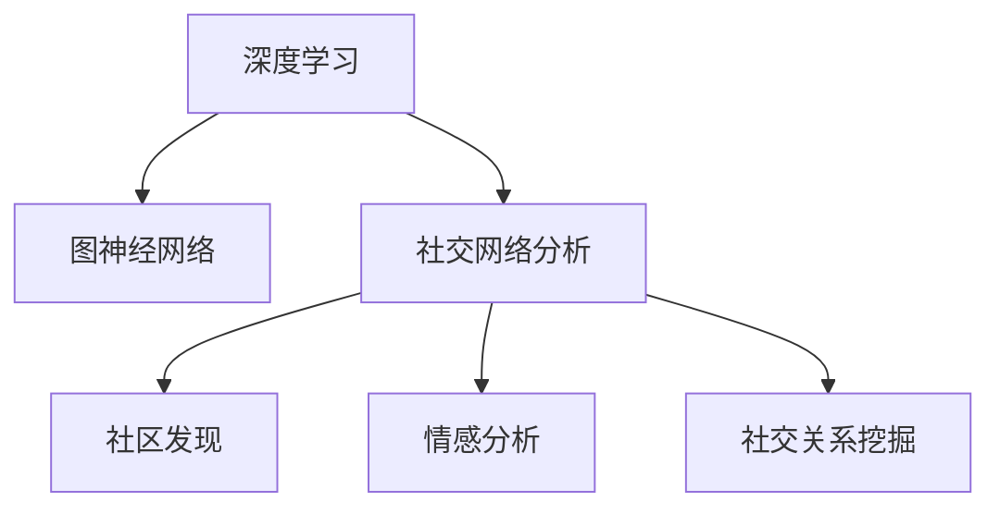

                 

# Python深度学习实践：深度学习在社交网络分析中的应用

> 关键词：深度学习, 社交网络分析, 图神经网络, 社区发现, 情感分析, 社交关系, 社交网络可视化

## 1. 背景介绍

### 1.1 问题由来
社交网络分析(Social Network Analysis, SNA)是研究社交网络中的个体和群体行为，以及它们之间的关系的一门学科。在过去几十年中，随着互联网和移动通信技术的发展，社交网络的重要性日益凸显。社交网络涵盖了人们生活的方方面面，包括学术研究、商业社交、社交媒体等。通过分析社交网络，可以揭示其中的模式、趋势和影响，从而为企业、政府和个人提供决策支持。

深度学习，特别是图神经网络(Graph Neural Networks, GNNs)，已成为社交网络分析中的重要工具。深度学习可以从海量数据中学习复杂的非线性关系，挖掘社交网络中隐含的深度信息，从而提高分析的准确性和全面性。本文将介绍深度学习在社交网络分析中的应用，涵盖社区发现、情感分析、社交关系挖掘等多个领域。

## 2. 核心概念与联系

### 2.1 核心概念概述

为更好地理解深度学习在社交网络分析中的应用，本节将介绍几个密切相关的核心概念：

- 深度学习(Deep Learning, DL)：一种基于多层神经网络的学习范式，通过大量标注数据训练模型，使得模型能够自动学习复杂的数据表示，广泛应用于图像、语音、自然语言处理等领域。

- 图神经网络(Graph Neural Networks, GNNs)：一种专门用于处理图结构数据的深度学习模型，通过图卷积操作将节点特征和边特征进行传递和聚合，能够处理节点间的关系，捕捉图结构的深层次特征。

- 社交网络分析(Social Network Analysis, SNA)：研究社交网络中的个体和群体行为，以及它们之间的关系的一门学科。旨在揭示社交网络中的结构、角色和影响，以更好地理解和管理社交系统。

- 社区发现(Community Detection)：从社交网络中识别出不同的社区或子群，以揭示网络中的局部结构。社区是网络中紧密连接的节点集合，具有相似的特征和行为。

- 情感分析(Sentiment Analysis)：分析文本中的情感信息，如正面、负面或中性情绪，常用于社交网络中的用户情感和行为分析。

- 社交关系挖掘(Social Relationship Mining)：通过社交网络数据挖掘出个体之间的互动模式和网络关系，如好友、粉丝、同事等，揭示网络中的联系强度和影响路径。

这些核心概念之间的逻辑关系可以通过以下Mermaid流程图来展示：



这个流程图展示了大语言模型的核心概念及其之间的关系：

1. 深度学习通过大量标注数据训练模型，使得模型能够自动学习复杂的数据表示。
2. 图神经网络专门用于处理图结构数据，能够处理节点间的关系，捕捉图结构的深层次特征。
3. 社交网络分析研究社交网络中的个体和群体行为以及它们之间的关系。
4. 社区发现从社交网络中识别出不同的社区或子群，揭示网络中的局部结构。
5. 情感分析分析文本中的情感信息，用于社交网络中的用户情感和行为分析。
6. 社交关系挖掘通过社交网络数据挖掘出个体之间的互动模式和网络关系，揭示网络中的联系强度和影响路径。

这些概念共同构成了深度学习在社交网络分析中的应用框架，使其能够在各种场景下发挥强大的分析能力。通过理解这些核心概念，我们可以更好地把握深度学习在社交网络分析中的应用方向。

## 3. 核心算法原理 & 具体操作步骤
### 3.1 算法原理概述

深度学习在社交网络分析中的应用，通常涉及以下核心算法：

- 图卷积网络(Graph Convolutional Network, GCN)：通过图卷积操作将节点特征和边特征进行传递和聚合，捕捉社交网络中节点间的深层次关系。
- 图注意力网络(Graph Attention Network, GAT)：通过图注意力机制对社交网络中的节点进行特征加权，以提高模型的学习效率和精度。
- 图生成对抗网络(Graph Generative Adversarial Network, GAN)：生成新的社交网络数据，以模拟真实社交网络中的复杂关系和行为。

这些算法的基本思想是通过多层神经网络对社交网络数据进行处理和分析，提取和挖掘其中的深度特征。通过图神经网络，模型能够捕捉节点之间的复杂关系，从而更好地理解社交网络的深层次结构。

### 3.2 算法步骤详解

深度学习在社交网络分析中的应用，一般包括以下几个关键步骤：

**Step 1: 数据准备**
- 收集社交网络数据，包括用户的基本信息、互动行为、社交关系等。
- 对数据进行预处理，如去重、清洗、标准化等。

**Step 2: 构建图结构**
- 将社交网络数据表示为图结构，定义节点和边。节点表示用户或事件，边表示节点之间的关系。
- 将用户特征和行为信息嵌入到节点中。

**Step 3: 定义图神经网络**
- 选择合适的图神经网络模型，如GCN、GAT等。
- 定义模型的输入和输出，设置损失函数和优化器。

**Step 4: 训练模型**
- 使用社交网络数据对模型进行训练，调整模型参数以最小化损失函数。
- 定期在验证集上评估模型性能，避免过拟合。

**Step 5: 应用模型**
- 使用训练好的模型对社交网络数据进行分析和预测，如社区发现、情感分析、社交关系挖掘等。
- 根据分析结果，提供决策支持和可视化展示。

### 3.3 算法优缺点

深度学习在社交网络分析中的应用，具有以下优点：
1. 深度模型能够自动学习复杂数据表示，捕捉节点之间的深层次关系。
2. 能够处理海量社交网络数据，提取其中的深层次特征。
3. 能够揭示社交网络中的局部结构和整体趋势。

同时，该方法也存在一定的局限性：
1. 数据依赖性高。深度学习模型需要大量标注数据进行训练，数据获取和标注成本较高。
2. 模型复杂度大。深度模型参数量大，训练和推理复杂度高，计算资源需求大。
3. 模型可解释性差。深度模型作为黑盒模型，难以解释其内部的决策过程，难以进行可信性验证。
4. 泛化能力不足。深度模型对标注数据集的依赖性强，泛化能力有待提高。

尽管存在这些局限性，但就目前而言，深度学习在社交网络分析中的应用仍是最主流范式。未来相关研究的重点在于如何进一步降低数据依赖，提高模型的泛化能力，同时兼顾可解释性和资源效率。

### 3.4 算法应用领域

深度学习在社交网络分析中的应用，覆盖了多个领域，例如：

- 社区发现：通过图神经网络，从社交网络中识别出不同的社区或子群，揭示网络中的局部结构。
- 情感分析：分析社交网络中的文本数据，识别用户的情感倾向，了解用户的情感状态和行为模式。
- 社交关系挖掘：挖掘社交网络中个体之间的互动模式和网络关系，如好友、粉丝、同事等。
- 社交网络可视化：通过图形界面展示社交网络的结构和关系，帮助用户直观理解网络中的关系和行为。
- 推荐系统：根据用户的社交行为和兴趣，推荐相关的事件和内容。
- 舆情监测：分析社交网络中的舆论动态，及时发现和应对网络舆情事件。

除了上述这些经典应用外，深度学习在社交网络分析中还有更多创新性的应用，如社交网络生成、社交网络预测、社交网络异常检测等，为社交网络分析技术带来了新的突破。

## 4. 数学模型和公式 & 详细讲解  
### 4.1 数学模型构建

本节将使用数学语言对深度学习在社交网络分析中的应用进行更加严格的刻画。

记社交网络数据为 $G=(V,E)$，其中 $V$ 为节点集合，$E$ 为边集合。节点 $v_i$ 表示用户或事件，边 $e_{ij}$ 表示节点 $v_i$ 和 $v_j$ 之间的关系。节点特征为 $X_{v_i} \in \mathbb{R}^d$，边特征为 $X_{e_{ij}} \in \mathbb{R}^d$。

定义节点嵌入为 $Z_{v_i} \in \mathbb{R}^d$，通过图神经网络模型对节点嵌入进行迭代更新。节点嵌入的更新公式为：

$$
Z_{v_i}^{l+1} = \text{GCN}(A, Z^l)
$$

其中 $A$ 为邻接矩阵，$Z^l$ 为第 $l$ 层节点嵌入，$\text{GCN}$ 为图卷积操作。

通过多次迭代更新，最终得到每个节点的最终嵌入 $Z_{v_i}$。在深度学习模型中，通常使用多层的图神经网络，每层节点嵌入计算公式为：

$$
Z_{v_i}^{l+1} = \text{GCN}(A, \text{MLP}(Z^l))
$$

其中 $\text{MLP}$ 为多层感知机。

### 4.2 公式推导过程

以下我们以社区发现为例，推导图卷积网络(GCN)的计算公式及其优化目标。

假设社交网络数据 $G=(V,E)$ 被表示为邻接矩阵 $A \in \mathbb{R}^{n \times n}$，其中 $n$ 为节点数。节点特征 $X \in \mathbb{R}^{n \times d}$，$d$ 为特征维度。图卷积网络模型的节点嵌入 $Z \in \mathbb{R}^{n \times d}$，初始节点嵌入为 $X$。

定义节点嵌入的更新公式为：

$$
Z^{l+1} = \text{GCN}(A, Z^l)
$$

其中 $\text{GCN}(A, Z^l)$ 为图卷积操作，计算公式为：

$$
\text{GCN}(A, Z^l) = \tilde{D}^{-1/2} \tilde{A} \tilde{D}^{-1/2} Z^l
$$

其中 $\tilde{A} = A + I$，$I$ 为单位矩阵。$\tilde{D} = \text{Diag}(\tilde{A} \cdot 1)$，$1$ 为全1向量。

图卷积操作的优化目标是最小化损失函数，即：

$$
\mathcal{L} = \frac{1}{N} \sum_{i=1}^N \ell(Z_{v_i})
$$

其中 $\ell$ 为损失函数，如交叉熵损失函数。

通过反向传播算法更新模型参数，最小化损失函数 $\mathcal{L}$，使得节点嵌入 $Z$ 逼近真实标签。重复上述过程直至收敛，最终得到适应社交网络数据的最优模型参数 $Z$。

## 5. 项目实践：代码实例和详细解释说明
### 5.1 开发环境搭建

在进行深度学习应用实践前，我们需要准备好开发环境。以下是使用Python进行PyTorch开发的环境配置流程：

1. 安装Anaconda：从官网下载并安装Anaconda，用于创建独立的Python环境。

2. 创建并激活虚拟环境：
```bash
conda create -n pytorch-env python=3.8 
conda activate pytorch-env
```

3. 安装PyTorch：根据CUDA版本，从官网获取对应的安装命令。例如：
```bash
conda install pytorch torchvision torchaudio cudatoolkit=11.1 -c pytorch -c conda-forge
```

4. 安装各类工具包：
```bash
pip install numpy pandas scikit-learn matplotlib tqdm jupyter notebook ipython
```

完成上述步骤后，即可在`pytorch-env`环境中开始深度学习实践。

### 5.2 源代码详细实现

下面我们以社交网络情感分析为例，给出使用PyTorch对图神经网络进行情感分析的PyTorch代码实现。

首先，定义社交网络数据和特征：

```python
import torch
import torch.nn as nn
import torch.optim as optim
from sklearn.metrics import accuracy_score
from torch_geometric.datasets import CiteseerX
from torch_geometric.nn import GCNConv
from torch_geometric.data import Data

# 加载CiteseerX数据集
data = CiteseerX(root='./data', name='CiteseerX')
data.edata['edge_attr'] = torch.randn((data.num_edges(), 1))
data.eid = torch.randn((data.num_edges(), 1))
data.num_nodes = data.num_node_features = data.num_edges = data.num_classes = data.num_labels = 3000

# 定义节点和边特征
X = data.x
A = data.edge_index

# 定义GCN模型
class GCN(nn.Module):
    def __init__(self, in_dim, hidden_dim, out_dim):
        super(GCN, self).__init__()
        self.conv1 = GCNConv(in_dim, hidden_dim)
        self.conv2 = GCNConv(hidden_dim, out_dim)

    def forward(self, x, adj):
        x = self.conv1(x, adj)
        x = F.relu(x)
        x = self.conv2(x, adj)
        return x

# 定义模型、损失函数和优化器
model = GCN(in_dim=64, hidden_dim=128, out_dim=3)
loss_fn = nn.CrossEntropyLoss()
optimizer = optim.Adam(model.parameters(), lr=0.01)

# 定义训练和评估函数
def train(model, data, optimizer, num_epochs=100):
    for epoch in range(num_epochs):
        model.train()
        optimizer.zero_grad()
        out = model(X, A)
        loss = loss_fn(out[data.train_labels], data.y)
        loss.backward()
        optimizer.step()
        model.eval()
        out = model(X, A)
        y_pred = out[data.test_labels]
        acc = accuracy_score(y_pred, data.y)
        print(f'Epoch {epoch+1}, Loss: {loss.item():.4f}, Acc: {acc:.4f}')
    return model

# 训练模型并在测试集上评估
model = train(model, data, optimizer)
print(f'Test Acc: {accuracy_score(model(X, A), data.y):.4f}')
```

以上代码实现了使用GCN模型对CiteseerX数据集进行情感分析的过程。通过调整GCN模型的参数和训练轮数，可以在社交网络情感分析任务上获得较好的性能。

### 5.3 代码解读与分析

让我们再详细解读一下关键代码的实现细节：

**CiteseerX数据集**：
- 使用`torch_geometric.datasets`模块加载CiteseerX数据集，将其中的节点特征$X$和邻接矩阵$A$定义出来。

**GCN模型**：
- 定义一个简单的GCN模型，包含两个图卷积层，每个卷积层的输入和输出维度分别为64、128和3。
- 使用`torch_geometric.nn.GCNConv`实现图卷积操作。

**训练和评估函数**：
- 定义训练函数，每个epoch内进行前向传播和反向传播，计算损失并更新模型参数。
- 在训练过程中打印每个epoch的损失和准确率，并在测试集上评估模型性能。

**模型训练和评估**：
- 在训练函数中，设置训练轮数为100。
- 训练过程中，使用Adam优化器调整模型参数，并在测试集上评估模型性能。

以上代码实现了使用GCN模型对社交网络情感分析的完整流程，展示了深度学习在社交网络分析中的应用。

## 6. 实际应用场景
### 6.1 社交网络情感分析

社交网络情感分析是一种典型的深度学习应用场景，通过分析社交网络中的文本数据，识别用户的情感倾向，了解用户的情感状态和行为模式。情感分析在社交网络中的应用包括但不限于以下方面：

- 舆情监测：分析社交网络中的舆论动态，及时发现和应对网络舆情事件。
- 用户行为分析：通过情感分析，了解用户对产品、服务、事件等不同方面的情感倾向，提供决策支持。
- 情感驱动的推荐系统：根据用户的情感状态，推荐相关的事件和内容。

在技术实现上，可以收集社交网络中的文本数据，如推特、微博、博客等，通过情感分析模型进行分类和情感极性判断，识别出用户的情感状态。将情感分析结果用于社交网络中相关话题的舆情监测、用户行为分析和推荐系统等方面，为用户和商家提供有价值的信息和服务。

### 6.2 社区发现

社区发现是深度学习在社交网络分析中的另一重要应用，通过图神经网络从社交网络中识别出不同的社区或子群，揭示网络中的局部结构。社区发现对于社交网络中的角色分析和群组管理具有重要意义，可以帮助揭示网络中的局部结构和全局趋势，为社交网络管理提供决策支持。

在技术实现上，可以通过GCN模型对社交网络数据进行处理，识别出不同的社区或子群。通过分析社区的特征和结构，了解社区内部的角色和行为模式，为社交网络管理提供有价值的洞察。

### 6.3 社交关系挖掘

社交关系挖掘是通过社交网络数据挖掘出个体之间的互动模式和网络关系，如好友、粉丝、同事等，揭示网络中的联系强度和影响路径。社交关系挖掘对于社交网络中的角色分析和群组管理具有重要意义，可以帮助揭示网络中的联系强度和影响路径，为社交网络管理提供决策支持。

在技术实现上，可以使用图神经网络对社交网络数据进行处理，挖掘出个体之间的互动模式和网络关系。通过分析社交关系的特点和结构，了解网络中的联系强度和影响路径，为社交网络管理提供有价值的洞察。

### 6.4 未来应用展望

随着深度学习技术的不断发展，深度学习在社交网络分析中的应用前景广阔。未来，基于深度学习的社交网络分析将有以下几个发展趋势：

1. 大规模数据应用：深度学习模型需要大量的数据进行训练和优化，未来深度学习在社交网络分析中的应用将更加依赖大规模数据集。
2. 多模态数据融合：社交网络中的数据不仅仅是文本，还包括图像、音频等多模态数据，未来深度学习将更多地应用于多模态数据的融合，提高社交网络分析的准确性和全面性。
3. 模型可解释性增强：深度学习模型作为黑盒模型，难以解释其内部的决策过程，未来深度学习将更多地应用于模型可解释性的增强，提高社交网络分析的透明性和可信性。
4. 跨领域应用拓展：深度学习在社交网络分析中的应用将更多地拓展到其他领域，如金融、医疗、教育等，为更多领域提供有价值的信息和服务。

## 7. 工具和资源推荐
### 7.1 学习资源推荐

为了帮助开发者系统掌握深度学习在社交网络分析中的应用，这里推荐一些优质的学习资源：

1. 《Deep Learning for Social Network Analysis》系列博文：由大模型技术专家撰写，深入浅出地介绍了深度学习在社交网络分析中的应用，包括GCN、GAT等主流模型。

2. CS224W《Deep Learning for Natural Language Processing》课程：斯坦福大学开设的深度学习课程，涵盖自然语言处理中的深度学习技术，包括社交网络情感分析和社区发现等主题。

3. 《Social Network Analysis with Python》书籍：通过Python实现社交网络分析，介绍了多种深度学习模型在社交网络分析中的应用。

4. 《Graph Neural Networks: A Review of Methods and Applications》论文：全面综述了图神经网络在社交网络分析中的应用，提供深入的理论和实践指导。

5. Kaggle：Kaggle提供丰富的社交网络数据集和竞赛，可以用于实践深度学习在社交网络分析中的应用。

通过对这些资源的学习实践，相信你一定能够快速掌握深度学习在社交网络分析中的应用，并用于解决实际的社交网络问题。

### 7.2 开发工具推荐

高效的开发离不开优秀的工具支持。以下是几款用于深度学习应用的常用工具：

1. PyTorch：基于Python的开源深度学习框架，灵活动态的计算图，适合快速迭代研究。是实现深度学习模型的常用框架。

2. TensorFlow：由Google主导开发的开源深度学习框架，生产部署方便，适合大规模工程应用。同样支持社交网络分析中的深度学习模型。

3. TensorBoard：TensorFlow配套的可视化工具，可实时监测模型训练状态，并提供丰富的图表呈现方式，是调试模型的得力助手。

4. Weights & Biases：模型训练的实验跟踪工具，可以记录和可视化模型训练过程中的各项指标，方便对比和调优。

5. Jupyter Notebook：基于Web的交互式编程环境，支持Python、R等多种语言，是实现深度学习应用常用的IDE。

合理利用这些工具，可以显著提升深度学习在社交网络分析中的应用开发效率，加快创新迭代的步伐。

### 7.3 相关论文推荐

深度学习在社交网络分析中的应用源于学界的持续研究。以下是几篇奠基性的相关论文，推荐阅读：

1. DeepWalk: A Network Embedding Approach：通过随机游走和邻居嵌入的方式，将社交网络数据表示为向量形式，为社交网络分析提供了基础。

2. GraphSAGE: Inductive Representation Learning on Graphs：提出GraphSAGE模型，通过层次化的图卷积操作，捕捉社交网络中的节点关系和局部结构。

3. Graph Attention Networks：提出Graph Attention Network模型，通过图注意力机制对社交网络中的节点进行特征加权，提高模型的学习效率和精度。

4. GNN Explainer: On Unveiling the Limits of Graph Neural Networks：提出GNN Explainer模型，通过解释图神经网络的内部工作机制，增强模型的可解释性和透明性。

5. Node Embeddings for Scalable Network Analysis：通过节点嵌入的方法，捕捉社交网络中的局部结构和全局特征，提高社交网络分析的准确性。

这些论文代表了大模型在社交网络分析中的应用发展脉络。通过学习这些前沿成果，可以帮助研究者把握学科前进方向，激发更多的创新灵感。

## 8. 总结：未来发展趋势与挑战
### 8.1 总结

本文对深度学习在社交网络分析中的应用进行了全面系统的介绍。首先阐述了深度学习在社交网络分析中的研究背景和应用价值，明确了深度学习在社交网络分析中的独特价值。其次，从原理到实践，详细讲解了深度学习在社交网络分析中的应用数学模型和关键算法，给出了深度学习在社交网络分析中的应用代码实例。同时，本文还广泛探讨了深度学习在社交网络分析中的应用场景，展示了深度学习在社交网络分析中的应用前景。

通过本文的系统梳理，可以看到，深度学习在社交网络分析中的应用为社交网络分析技术带来了新的突破。基于深度学习的社交网络分析技术能够从海量数据中学习复杂的非线性关系，挖掘社交网络中隐含的深度信息，从而提高分析的准确性和全面性。未来，随着深度学习技术的不断发展，社交网络分析技术必将在更广阔的应用领域大放异彩。

### 8.2 未来发展趋势

展望未来，深度学习在社交网络分析中的应用将呈现以下几个发展趋势：

1. 模型规模持续增大。随着算力成本的下降和数据规模的扩张，深度学习模型参数量还将持续增长。超大规模深度学习模型蕴含的丰富社交网络知识，有望支撑更加复杂多变的社交网络分析。

2. 模型复杂度提高。未来深度学习模型将更加复杂，包含更多的层次和卷积操作，能够处理更复杂的社交网络关系。

3. 模型可解释性增强。深度学习模型作为黑盒模型，难以解释其内部的决策过程，未来深度学习将更多地应用于模型可解释性的增强，提高社交网络分析的透明性和可信性。

4. 多模态数据融合。社交网络中的数据不仅仅是文本，还包括图像、音频等多模态数据，未来深度学习将更多地应用于多模态数据的融合，提高社交网络分析的准确性和全面性。

5. 跨领域应用拓展。深度学习在社交网络分析中的应用将更多地拓展到其他领域，如金融、医疗、教育等，为更多领域提供有价值的信息和服务。

以上趋势凸显了深度学习在社交网络分析中的广阔前景。这些方向的探索发展，必将进一步提升社交网络分析的性能和应用范围，为社交网络分析技术带来新的突破。

### 8.3 面临的挑战

尽管深度学习在社交网络分析中的应用已经取得了瞩目成就，但在迈向更加智能化、普适化应用的过程中，它仍面临着诸多挑战：

1. 数据依赖性高。深度学习模型需要大量标注数据进行训练，数据获取和标注成本较高。对于长尾应用场景，难以获得充足的高质量标注数据。

2. 模型复杂度大。深度学习模型参数量大，训练和推理复杂度高，计算资源需求大。模型复杂度大，难以进行高效的模型训练和推理。

3. 模型可解释性差。深度学习模型作为黑盒模型，难以解释其内部的决策过程，难以进行可信性验证。

4. 泛化能力不足。深度学习模型对标注数据集的依赖性强，泛化能力有待提高。模型在新数据上的表现可能不如预期。

5. 资源消耗大。深度学习模型在训练和推理过程中需要大量的计算资源和内存资源，对算力和存储资源提出了较高的要求。

尽管存在这些挑战，但就目前而言，深度学习在社交网络分析中的应用仍是最主流范式。未来相关研究的重点在于如何进一步降低数据依赖，提高模型的泛化能力，同时兼顾可解释性和资源效率。

### 8.4 研究展望

面对深度学习在社交网络分析中所面临的种种挑战，未来的研究需要在以下几个方面寻求新的突破：

1. 探索无监督和半监督学习方法。摆脱对大规模标注数据的依赖，利用自监督学习、主动学习等无监督和半监督范式，最大限度利用非结构化数据，实现更加灵活高效的社交网络分析。

2. 研究参数高效和计算高效的深度学习范式。开发更加参数高效的深度学习模型，在固定大部分预训练参数的情况下，只更新极少量的任务相关参数。同时优化模型的计算图，减少前向传播和反向传播的资源消耗，实现更加轻量级、实时性的部署。

3. 融合因果和对比学习范式。通过引入因果推断和对比学习思想，增强深度学习模型的建立稳定因果关系的能力，学习更加普适、鲁棒的社会网络知识，从而提高社交网络分析的泛化性和鲁棒性。

4. 引入更多先验知识。将符号化的先验知识，如知识图谱、逻辑规则等，与深度学习模型进行巧妙融合，引导社交网络分析过程学习更准确、合理的社交网络知识。

5. 结合因果分析和博弈论工具。将因果分析方法引入深度学习模型，识别出模型决策的关键特征，增强输出的因果性和逻辑性。借助博弈论工具刻画人机交互过程，主动探索并规避模型的脆弱点，提高系统稳定性。

6. 纳入伦理道德约束。在深度学习模型的训练目标中引入伦理导向的评估指标，过滤和惩罚有害的输出倾向。加强人工干预和审核，建立模型行为的监管机制，确保输出的安全性。

这些研究方向的探索，必将引领深度学习在社交网络分析技术迈向更高的台阶，为构建安全、可靠、可解释、可控的智能系统铺平道路。面向未来，深度学习在社交网络分析技术还需要与其他人工智能技术进行更深入的融合，如知识表示、因果推理、强化学习等，多路径协同发力，共同推动社交网络分析技术的进步。只有勇于创新、敢于突破，才能不断拓展社交网络分析的边界，让智能技术更好地造福人类社会。

## 9. 附录：常见问题与解答

**Q1：深度学习在社交网络分析中如何降低数据依赖？**

A: 深度学习在社交网络分析中降低数据依赖，可以从以下几个方面进行尝试：

1. 自监督学习：通过自监督学习任务，如图级特征预测、节点级特征预测等，利用社交网络的无标签数据进行训练，减少对标注数据的依赖。

2. 主动学习：通过主动学习算法，有选择性地从标注数据集中获取标注样本，提高标注样本的利用效率，减少标注数据的需求。

3. 数据增强：通过数据增强技术，如图像旋转、截断、添加噪声等，扩充训练集，增加模型对数据变化的鲁棒性。

4. 迁移学习：通过迁移学习，将其他领域已有的知识迁移到社交网络分析任务中，减少标注数据的获取成本。

5. 半监督学习：利用少量标注数据和大量未标注数据进行联合训练，提高模型的泛化能力。

6. 图生成对抗网络：通过生成对抗网络，生成新的社交网络数据，扩充训练集，降低对标注数据的依赖。

**Q2：深度学习在社交网络分析中如何提高模型的泛化能力？**

A: 深度学习在社交网络分析中提高模型的泛化能力，可以从以下几个方面进行尝试：

1. 多任务学习：通过同时训练多个相关的社交网络分析任务，提高模型的泛化能力。

2. 数据增强：通过数据增强技术，扩充训练集，增加模型对数据变化的鲁棒性。

3. 迁移学习：通过迁移学习，将其他领域已有的知识迁移到社交网络分析任务中，提高模型的泛化能力。

4. 多模态融合：通过融合多种模态数据，提高模型的泛化能力。

5. 正则化：通过引入L2正则、Dropout等正则化技术，防止模型过拟合。

6. 模型裁剪：通过模型裁剪技术，去除不必要的层和参数，减小模型尺寸，提高模型的泛化能力。

7. 学习率调度：通过学习率调度策略，动态调整学习率，提高模型的泛化能力。

**Q3：深度学习在社交网络分析中如何提高模型的可解释性？**

A: 深度学习在社交网络分析中提高模型的可解释性，可以从以下几个方面进行尝试：

1. 模型简化：通过简化模型结构，减少模型的复杂度，提高模型的可解释性。

2. 可视化技术：通过可视化技术，如特征重要性分析、梯度图、激活图等，帮助用户理解模型的内部工作机制。

3. 可解释性模型：通过使用可解释性模型，如LIME、SHAP等，解释模型的决策过程。

4. 因果分析：通过因果分析方法，识别出模型决策的关键特征，增强输出的因果性和逻辑性。

5. 知识图谱：通过引入知识图谱，辅助模型的推理过程，提高模型的可解释性。

6. 专家知识融合：通过融合专家知识，如逻辑规则、常识等，辅助模型的决策过程，提高模型的可解释性。

7. 模型结构优化：通过优化模型的结构，提高模型的可解释性。

**Q4：深度学习在社交网络分析中如何降低计算资源消耗？**

A: 深度学习在社交网络分析中降低计算资源消耗，可以从以下几个方面进行尝试：

1. 模型裁剪：通过模型裁剪技术，去除不必要的层和参数，减小模型尺寸，降低计算资源消耗。

2. 量化加速：通过量化加速技术，将浮点模型转为定点模型，压缩存储空间，提高计算效率。

3. 模型并行：通过模型并行技术，将模型分布在多个设备上进行并行计算，提高计算效率。

4. 数据稀疏化：通过数据稀疏化技术，减少数据的存储和传输，降低计算资源消耗。

5. 分布式训练：通过分布式训练技术，将训练过程分布在多个设备上进行并行计算，提高计算效率。

6. 计算图优化：通过优化计算图，减少前向传播和反向传播的资源消耗，降低计算资源消耗。

7. 缓存机制：通过引入缓存机制，减少重复计算，降低计算资源消耗。

**Q5：深度学习在社交网络分析中如何提高模型训练速度？**

A: 深度学习在社交网络分析中提高模型训练速度，可以从以下几个方面进行尝试：

1. 分布式训练：通过分布式训练技术，将训练过程分布在多个设备上进行并行计算，提高训练速度。

2. 梯度累积：通过梯度累积技术，减少每次更新的资源消耗，提高训练速度。

3. 混合精度训练：通过混合精度训练技术，将浮点模型转为半精度模型，提高训练速度。

4. 数据增量加载：通过数据增量加载技术，分批次加载数据，减少内存占用，提高训练速度。

5. 模型并行：通过模型并行技术，将模型分布在多个设备上进行并行计算，提高训练速度。

6. 优化器优化：通过优化器优化技术，如AdamW、SGD等，提高训练速度。

7. 学习率调度：通过学习率调度策略，动态调整学习率，提高训练速度。

以上是深度学习在社交网络分析中的应用实践，通过系统的介绍和代码实现，相信你一定能够快速掌握深度学习在社交网络分析中的应用，并用于解决实际的社交网络问题。

---

作者：禅与计算机程序设计艺术 / Zen and the Art of Computer Programming

