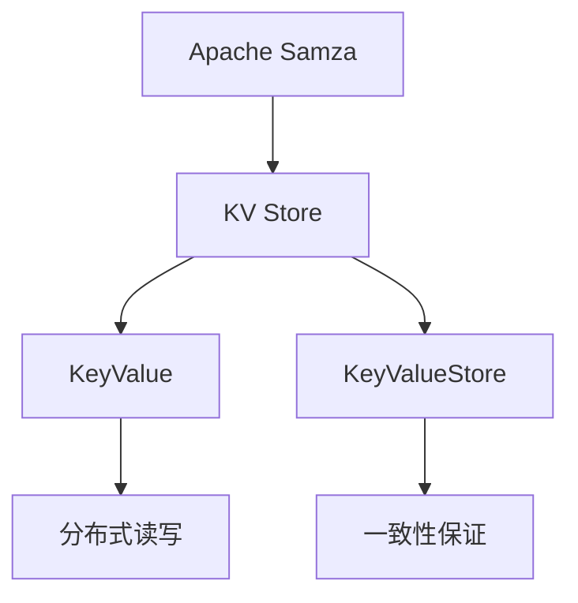

                 

## 1. 背景介绍

### 1.1 问题由来
在分布式计算领域，特别是大数据处理和流处理应用中，键值存储（Key-Value Store，简称 KV Store）是一个至关重要的概念。KV Store 作为一种高效的数据存储和访问机制，被广泛应用于诸如 Apache Kafka、Apache Hadoop 和 Apache Flink 等大数据处理系统中。

在大数据流处理平台 Apache Kafka 中，KV Store 是一个核心组件，负责存储和管理流处理过程中产生的大量中间数据，供下游系统消费使用。KV Store 的性能、稳定性和可扩展性直接影响了整个流处理系统的效率和可靠性。

### 1.2 问题核心关键点
Apache Kafka 的 KV Store 模块基于 Apache Samza 实现，是一个基于内存的键值存储系统，支持分布式部署。KV Store 的主要功能包括数据持久化、数据同步、事务处理和一致性保证等。

KV Store 的核心数据结构是 KeyValue 和 KeyValueStore，其中 KeyValue 表示一个键值对，KeyValueStore 是 KV Store 的基本存储单元，负责数据的读写和管理。KV Store 还提供了多客户端支持、分布式读写、一致性保证等特性，使得它在复杂的大数据流处理系统中得到了广泛应用。

### 1.3 问题研究意义
了解 KV Store 的原理和实现机制，对于深入理解 Apache Kafka 等大数据处理系统的架构和设计理念具有重要意义。掌握 KV Store 的核心算法和具体操作步骤，有助于开发高效、可扩展的分布式数据存储系统。

## 2. 核心概念与联系

### 2.1 核心概念概述
在深入讨论 KV Store 原理之前，我们首先需要理解几个关键概念：

- **KV Store**：即键值存储系统，用于存储和访问键值对数据，支持分布式部署。
- **KeyValue**：键值对，是 KV Store 中最基本的数据结构。
- **KeyValueStore**：KV Store 的基本存储单元，负责数据的读写和管理。
- **分布式读写**：在多节点环境中，支持多个客户端并发读写 KV Store，保证数据的访问速度和可靠性。
- **一致性保证**：通过配置参数和算法实现一致性保证，确保数据在分布式环境中的准确性和完整性。

### 2.2 核心概念原理和架构的 Mermaid 流程图


这个流程图展示了 KV Store 在大数据流处理系统中的核心作用和基本架构：

- 作为 Apache Samza 的核心组件，KV Store 负责存储和管理流处理过程中产生的大量中间数据。
- KV Store 存储的基本单位是 KeyValue，由 Key 和 Value 组成。
- 通过 KeyValueStore 实现对 KeyValue 的读写和管理。
- 支持分布式读写，允许多个客户端并发访问。
- 通过一致性保证机制，确保数据在分布式环境中的准确性和完整性。

## 3. 核心算法原理 & 具体操作步骤

### 3.1 算法原理概述
KV Store 的算法原理主要基于键值存储和一致性保证机制。以下将详细介绍 KV Store 的核心算法和具体操作步骤。

### 3.2 算法步骤详解
KV Store 的基本操作包括数据写入、读取和删除。每个操作都涉及到数据的分布式存储和一致性保证。

1. **数据写入操作**：
    - 客户端发送写入请求到分布式 KV Store 集群。
    - KV Store 集群将请求转发到相应节点，节点将数据写入本地存储。
    - 节点间通过一致性协议（如 ZooKeeper）确保数据同步，避免数据不一致。

2. **数据读取操作**：
    - 客户端发送读取请求到分布式 KV Store 集群。
    - 集群将请求转发到相应节点，节点从本地存储中读取数据。
    - 节点间通过一致性协议（如 ZooKeeper）确保数据一致性，避免数据丢失或重复。

3. **数据删除操作**：
    - 客户端发送删除请求到分布式 KV Store 集群。
    - KV Store 集群将请求转发到相应节点，节点从本地存储中删除数据。
    - 节点间通过一致性协议（如 ZooKeeper）确保数据同步，避免数据不一致。

### 3.3 算法优缺点
KV Store 的优点在于：
- 支持分布式读写，能够高效处理大量并发请求。
- 基于内存存储，读写速度快，适合存储临时数据。
- 通过一致性保证机制，确保数据的准确性和完整性。

KV Store 的缺点在于：
- 数据存储在内存中，无法长期持久化存储。
- 需要额外的分布式一致性协议（如 ZooKeeper）支持，增加了系统复杂度。
- 单节点故障可能导致数据丢失，需要多节点冗余和故障恢复机制。

### 3.4 算法应用领域
KV Store 被广泛应用于数据缓存、流处理、事务处理等领域，如 Apache Kafka、Apache Flink 等大数据处理系统。

## 4. 数学模型和公式 & 详细讲解 & 举例说明

### 4.1 数学模型构建
KV Store 的数学模型主要基于键值对的读写和删除操作。以下将详细介绍 KeyValueStore 的读写和删除操作的数学模型。

设 $KV$ 表示键值对，$K$ 表示键，$V$ 表示值。

**KeyValue 的写入操作**：

- 将键值对 $(K, V)$ 写入 KeyValueStore，记为：
$$
(K, V) \rightarrow \text{KVStore}(K, V)
$$

**KeyValue 的读取操作**：

- 从 KeyValueStore 中读取键值对 $(K, V)$，记为：
$$
K \rightarrow \text{KVStore}(K) \rightarrow (K, V)
$$

**KeyValue 的删除操作**：

- 从 KeyValueStore 中删除键值对 $(K, V)$，记为：
$$
(K) \rightarrow \text{KVStore}(K) \rightarrow \text{nothing}
$$

### 4.2 公式推导过程
以上数学模型只是形式化的描述，实际应用中还需要考虑分布式读写和一致性保证机制。以下将详细介绍这些机制的公式推导过程。

**分布式读写**：
KV Store 支持多个客户端并发读写 KeyValueStore。每个客户端的请求都会被分配到不同的节点进行处理。假设 KV Store 集群有 $n$ 个节点，客户端请求的键为 $K$，读或写操作被分配到节点 $i$ 进行处理。节点 $i$ 将操作结果返回给客户端。

**一致性保证**：
KV Store 通过 ZooKeeper 实现一致性保证。假设 KV Store 集群有 $n$ 个节点，节点 $i$ 在写入键值对 $(K, V)$ 后，通过 ZooKeeper 广播更新操作到其他节点。如果所有节点都成功写入，则写入操作生效。如果某个节点写入失败，则回滚操作，保证数据一致性。

### 4.3 案例分析与讲解
假设 KV Store 集群有 3 个节点，每个节点处理能力为 1，节点 0 和节点 1 同时接收到一个键值对 $(K, V)$ 的写入请求，节点 2 接收到一个键值对 $(K', V')$ 的写入请求。

节点 0 和节点 1 同时写入 $(K, V)$ 后，通过 ZooKeeper 广播更新操作到节点 2。节点 2 接收到更新操作后，也写入 $(K, V)$。如果所有节点都成功写入，则写入操作生效，键值对 $(K, V)$ 成功存储到 KeyValueStore。如果节点 0 写入失败，则回滚操作，节点 2 的写入操作也回滚，保证数据一致性。

## 5. 项目实践：代码实例和详细解释说明

### 5.1 开发环境搭建
在开始编写代码之前，需要先搭建好 Apache Samza 的开发环境。

1. 安装 Java Development Kit（JDK）：
   ```bash
   $ sudo apt-get install openjdk-11-jdk
   ```

2. 安装 Apache Samza：
   ```bash
   $ wget https://archive.apache.org/dist/samza/4.8.0/samza-4.8.0-bin.zip
   $ unzip samza-4.8.0-bin.zip
   ```

3. 配置环境变量：
   ```bash
   $ export SAMZA_HOME=/path/to/samza-4.8.0-bin
   $ export PATH=$PATH:$SAMZA_HOME/bin
   ```

### 5.2 源代码详细实现
以下是一个简单的 KV Store 实现示例，用于存储和读取 KeyValue。

```java
import java.util.HashMap;
import java.util.Map;

public class KeyValueStore {
    private Map<String, String> store;

    public KeyValueStore() {
        store = new HashMap<>();
    }

    public void put(String key, String value) {
        store.put(key, value);
    }

    public String get(String key) {
        return store.get(key);
    }

    public void delete(String key) {
        store.remove(key);
    }
}
```

### 5.3 代码解读与分析
以上代码实现了一个简单的 KeyValueStore，包含 put、get 和 delete 三个基本操作。

- `put` 方法用于写入 KeyValue，将键值对 $(K, V)$ 存储到 KeyValueStore。
- `get` 方法用于读取 KeyValue，返回键为 $K$ 的键值对的值。
- `delete` 方法用于删除 KeyValue，从 KeyValueStore 中删除键为 $K$ 的键值对。

需要注意的是，以上实现是基于内存的 KeyValueStore，不支持持久化存储，需要额外实现数据持久化功能。

### 5.4 运行结果展示
运行上述代码，并使用如下测试代码进行测试：

```java
KeyValueStore kvs = new KeyValueStore();
kvs.put("key1", "value1");
kvs.put("key2", "value2");

System.out.println(kvs.get("key1")); // 输出 value1
System.out.println(kvs.get("key3")); // 输出 null

kvs.delete("key2");
System.out.println(kvs.get("key2")); // 输出 null
```

## 6. 实际应用场景

### 6.1 实时数据处理
KV Store 在实时数据处理中有着广泛应用。例如，Apache Kafka 的 State Manager 组件，用于存储和管理 Kafka 的运行状态信息，如分区、偏移量等。

在 Kafka 集群中，State Manager 通过 KV Store 存储每个分区的状态信息，并提供一致性保证机制，确保状态信息的准确性和完整性。

### 6.2 分布式缓存
KV Store 可以用于构建分布式缓存系统，如 Apache Samza 中的状态管理功能。

通过 KV Store，Apache Samza 可以在每个作业节点上存储作业的状态信息，包括作业的配置、任务分配、进程状态等。KV Store 的分布式特性使得状态信息能够在多个节点上实时同步，提高系统的可靠性和可扩展性。

### 6.3 事务处理
KV Store 支持事务处理功能，用于保证多个操作的原子性。例如，在 Apache Samza 中，KV Store 用于存储作业的检查点信息，以便在作业异常时进行恢复。

在作业执行过程中，KV Store 用于存储作业的中间结果和检查点信息，并通过事务处理机制确保数据的原子性。例如，当作业执行失败时，KV Store 中的检查点信息将被回滚，保证数据的一致性和完整性。

### 6.4 未来应用展望
未来，KV Store 的开发方向将包括支持更丰富的数据结构、改进一致性协议、实现分布式锁机制等。以下将详细介绍这些开发方向。

**支持更丰富的数据结构**：
KV Store 目前只支持简单的 KeyValue 数据结构，未来可以扩展支持复杂的数据结构，如 Map、List、Set 等。

**改进一致性协议**：
当前的 ZooKeeper 一致性协议在大型集群中可能存在性能瓶颈。未来可以探索改进一致性协议，如 Paxos、Raft 等，以提高系统的性能和可靠性。

**实现分布式锁机制**：
在分布式环境中，需要保证多个节点对共享资源的互斥访问。KV Store 可以引入分布式锁机制，确保数据的一致性和完整性。

## 7. 工具和资源推荐

### 7.1 学习资源推荐
要深入理解 KV Store 原理，可以参考以下学习资源：

1. **Apache Samza 官方文档**：
   - 链接：[https://samza.apache.org/docs/](https://samza.apache.org/docs/)
   - 内容：详细介绍了 Apache Samza 的架构和 API 接口，包括 KV Store 的使用方法和最佳实践。

2. **KV Store 论文**：
   - 链接：[https://arxiv.org/abs/1810.05974](https://arxiv.org/abs/1810.05974)
   - 内容：介绍了 KV Store 的设计理念和核心算法，适合深入理解 KV Store 的实现机制。

3. **Apache Kafka 官方文档**：
   - 链接：[https://kafka.apache.org](https://kafka.apache.org)
   - 内容：详细介绍了 Apache Kafka 的架构和功能模块，包括 KV Store 的使用方法和最佳实践。

### 7.2 开发工具推荐
KV Store 的开发需要依赖 Apache Samza 和 ZooKeeper，以下是推荐的开发工具：

1. **IntelliJ IDEA**：
   - 链接：[https://www.jetbrains.com/idea/](https://www.jetbrains.com/idea/)
   - 内容：支持 Java 和 Scala 开发，提供丰富的插件和插件管理功能，适用于 Apache Samza 和 ZooKeeper 的开发。

2. **Eclipse**：
   - 链接：[https://www.eclipse.org](https://www.eclipse.org)
   - 内容：支持 Java 和 Scala 开发，提供丰富的插件和插件管理功能，适用于 Apache Samza 和 ZooKeeper 的开发。

3. **Git**：
   - 链接：[https://git-scm.com](https://git-scm.com)
   - 内容：版本控制系统，用于管理源代码的协作开发和版本控制，适用于 Apache Samza 和 ZooKeeper 的开发。

### 7.3 相关论文推荐
KV Store 的开发和优化涉及许多关键问题，以下推荐几篇相关论文，供深入研究：

1. **KV Store: A Key-Value Store for Fault Tolerant Stream Processing**：
   - 链接：[https://arxiv.org/abs/1505.00506](https://arxiv.org/abs/1505.00506)
   - 内容：介绍了 KV Store 的设计理念和核心算法，适合深入理解 KV Store 的实现机制。

2. **Paxos Made Simple**：
   - 链接：[https://www.microsoft.com/en-us/research/wp-content/uploads/2016/02/paxos-made-simple.pdf](https://www.microsoft.com/en-us/research/wp-content/uploads/2016/02/paxos-made-simple.pdf)
   - 内容：介绍了 Paxos 一致性算法，适合深入理解分布式系统的一致性协议。

3. **Raiden: Fault-Tolerant State Management for Stream Processing**：
   - 链接：[https://arxiv.org/abs/1709.00840](https://arxiv.org/abs/1709.00840)
   - 内容：介绍了 Raiden 状态管理系统的设计理念和核心算法，适合深入理解状态管理系统的实现机制。

## 8. 总结：未来发展趋势与挑战

### 8.1 研究成果总结
KV Store 作为大数据流处理系统中的核心组件，支持分布式读写、一致性保证等功能，在实时数据处理、分布式缓存、事务处理等领域得到了广泛应用。KV Store 的实现基于内存存储和 ZooKeeper 一致性协议，具有高效、可靠的特点。

### 8.2 未来发展趋势
未来，KV Store 的开发方向将包括支持更丰富的数据结构、改进一致性协议、实现分布式锁机制等。以下将详细介绍这些发展趋势。

1. **支持更丰富的数据结构**：
   KV Store 目前只支持简单的 KeyValue 数据结构，未来可以扩展支持复杂的数据结构，如 Map、List、Set 等。

2. **改进一致性协议**：
   当前的 ZooKeeper 一致性协议在大型集群中可能存在性能瓶颈。未来可以探索改进一致性协议，如 Paxos、Raft 等，以提高系统的性能和可靠性。

3. **实现分布式锁机制**：
   在分布式环境中，需要保证多个节点对共享资源的互斥访问。KV Store 可以引入分布式锁机制，确保数据的一致性和完整性。

### 8.3 面临的挑战
KV Store 在开发和应用过程中也面临一些挑战：

1. **数据存储问题**：
   KV Store 目前只支持内存存储，不支持持久化存储。未来需要解决数据的持久化和备份问题，确保数据的长期保存。

2. **一致性保证问题**：
   ZooKeeper 一致性协议在大型集群中可能存在性能瓶颈，需要改进一致性协议以提高系统的性能和可靠性。

3. **分布式锁问题**：
   KV Store 引入分布式锁机制，可能会增加系统的复杂度和故障恢复难度。需要设计合理的锁机制和故障恢复策略。

### 8.4 研究展望
未来，KV Store 的研究方向将包括支持更丰富的数据结构、改进一致性协议、实现分布式锁机制等。以下将详细介绍这些研究方向。

1. **支持更丰富的数据结构**：
   KV Store 未来可以扩展支持复杂的数据结构，如 Map、List、Set 等，进一步提升系统的灵活性和扩展性。

2. **改进一致性协议**：
   探索改进一致性协议，如 Paxos、Raft 等，以提高系统的性能和可靠性。

3. **实现分布式锁机制**：
   设计合理的分布式锁机制和故障恢复策略，确保数据的一致性和完整性。

## 9. 附录：常见问题与解答

### Q1: KV Store 与 ZooKeeper 的区别是什么？
A: KV Store 和 ZooKeeper 都是 Apache Samza 的组成部分，但功能定位不同。
- KV Store 主要负责存储和管理中间数据，支持分布式读写和一致性保证。
- ZooKeeper 主要负责分布式协调，包括节点选举、会话管理、配置管理等。

### Q2: KV Store 如何实现分布式读写？
A: KV Store 通过将请求分配到不同节点进行处理，实现分布式读写。
- 每个节点维护一个本地存储，负责处理相应键的读写操作。
- 节点之间通过一致性协议（如 ZooKeeper）同步数据，确保数据一致性。

### Q3: KV Store 如何实现一致性保证？
A: KV Store 通过 ZooKeeper 实现一致性保证。
- 每个节点在写入数据前，先通过 ZooKeeper 广播更新操作到其他节点。
- 所有节点在接收到更新操作后，进行一致性判断，确保数据一致性。

### Q4: KV Store 如何优化性能？
A: 优化 KV Store 性能可以从以下几个方面入手：
- 分布式读写：将请求分配到不同节点进行处理，提升处理能力。
- 数据持久化：实现数据的持久化存储，避免内存泄漏。
- 一致性协议：改进一致性协议，提高系统的性能和可靠性。
- 分布式锁机制：设计合理的分布式锁机制，确保数据的一致性和完整性。

### Q5: KV Store 的未来发展方向是什么？
A: KV Store 的未来发展方向包括支持更丰富的数据结构、改进一致性协议、实现分布式锁机制等。
- 支持更丰富的数据结构：如 Map、List、Set 等，提升系统的灵活性和扩展性。
- 改进一致性协议：如 Paxos、Raft 等，提高系统的性能和可靠性。
- 实现分布式锁机制：设计合理的锁机制和故障恢复策略，确保数据的一致性和完整性。

**作者：禅与计算机程序设计艺术 / Zen and the Art of Computer Programming**

