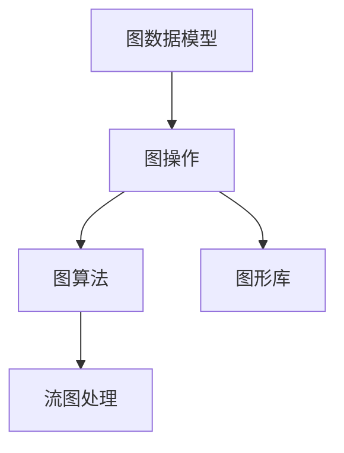

                 

# Spark GraphX原理与代码实例讲解

> 关键词：Spark GraphX, GraphX, 图形计算, 图算法, 图数据库, 图处理, 流计算, 实时图处理

## 1. 背景介绍

### 1.1 问题由来
图形计算作为数据处理的新范式，近年来引起了广泛关注。尤其在社交网络、推荐系统、交通路线规划等场景中，图形数据的建模和分析发挥着重要作用。然而，传统的数据库系统并不擅长处理图数据，无法满足用户对图形分析的迫切需求。

在这样的背景下，Spark GraphX应运而生。它不仅提供了一套强大的图计算API，还内置了对分布式图处理的支持，可以高效处理海量图数据，提供丰富的图算法和图形库。本文将全面解析Spark GraphX的原理和应用，并通过代码实例，深入讲解如何构建、查询和优化图形数据库。

### 1.2 问题核心关键点
Spark GraphX的核心关键点包括以下几个方面：

1. **分布式图形计算**：Spark GraphX内置支持分布式图形计算，能够高效处理海量图数据。
2. **丰富的图算法和图形库**：提供从基本的图遍历算法到高级的图聚类算法等丰富的图算法库，以及与图形处理相关的图形库。
3. **流计算支持**：Spark GraphX支持实时图处理，能够处理流数据。
4. **图形API与图形数据库集成**：提供一套图形API，能够与各种图形数据库集成。

本文将从这些关键点入手，系统讲解Spark GraphX的原理和应用。

## 2. 核心概念与联系

### 2.1 核心概念概述

为更好地理解Spark GraphX，本节将介绍几个关键概念：

1. **图数据模型**：Spark GraphX中，图被建模为一个四元组G(V, E, gV, gE)，其中V是节点集合，E是边集合，gV是节点对应的键值对，gE是边对应的键值对。
2. **图操作**：Spark GraphX支持基本的图操作，如图遍历、节点/边分割、图融合等。
3. **图算法**：Spark GraphX提供丰富的图算法，如PageRank、TripletSampling等，用于图数据建模和分析。
4. **图形库**：Spark GraphX内置了多种图形库，如雅各布图、K-核图、无向图等，方便用户构建和查询图数据。
5. **流图处理**：Spark GraphX支持流图处理，可以处理流数据并实时更新图状态。

这些核心概念之间的逻辑关系可以通过以下Mermaid流程图来展示：



这个流程图展示了几项关键概念之间的相互关系：

1. 图数据模型是Spark GraphX的基础，用于表示图形数据。
2. 图操作提供图形数据的构建和查询方式。
3. 图算法通过图数据模型和图操作实现图形数据的分析和建模。
4. 图形库提供了丰富的图形类型和图形处理工具。
5. 流图处理提供了实时处理图数据的能力。

这些概念共同构成了Spark GraphX的核心技术体系，使其能够高效地处理和分析图形数据。通过理解这些核心概念，我们可以更好地把握Spark GraphX的工作原理和优化方向。

## 3. 核心算法原理 & 具体操作步骤
### 3.1 算法原理概述

Spark GraphX的核心算法原理基于图计算。它通过分布式计算框架Spark，实现了图数据的高效处理和分析。

具体而言，Spark GraphX支持并行化的图计算，能够在大规模图数据上快速运行图算法。它通过将图数据切分为多个并行分区，在不同的节点上同时处理，大大提升了计算效率。同时，Spark GraphX还提供了丰富的图算法库和图形库，方便用户进行图形数据建模和分析。

### 3.2 算法步骤详解

Spark GraphX的典型应用流程包括以下几个关键步骤：

**Step 1: 数据准备**
- 收集图数据，并将其导入到Spark GraphX中。
- 根据需要选择图形库，构建图数据模型。

**Step 2: 图构建与查询**
- 使用Spark GraphX提供的图API，构建图数据。
- 编写查询语句，进行图形遍历和分析。

**Step 3: 图算法应用**
- 根据需求选择图算法，并对其参数进行配置。
- 运行图算法，并获取分析结果。

**Step 4: 结果输出**
- 将分析结果导出到目标数据源，如数据库、文件系统等。
- 可视化和分析结果，进行图形数据建模和分析。

### 3.3 算法优缺点

Spark GraphX作为图形处理领域的重要工具，具有以下优点：

1. **高效并行计算**：Spark GraphX通过并行计算框架Spark实现了高效的图计算，能够处理大规模图数据。
2. **丰富的图算法和图形库**：提供了多种图算法和图形库，方便用户进行图数据的建模和分析。
3. **流图处理能力**：支持实时图处理，能够处理流数据并实时更新图状态。
4. **图形API与图形数据库集成**：提供了图形API，能够与各种图形数据库集成。

同时，Spark GraphX也存在一些缺点：

1. **性能瓶颈**：在大规模图数据处理时，Spark GraphX可能遇到性能瓶颈，需要优化。
2. **内存占用**：处理大规模图数据时，Spark GraphX需要占用大量内存，需要注意内存管理。
3. **学习曲线**：Spark GraphX提供了丰富的API和图形库，但使用复杂，需要一定的学习曲线。
4. **部署成本**：Spark GraphX需要依赖Spark集群，部署和维护成本较高。

尽管存在这些缺点，但Spark GraphX在大规模图形数据处理和分析方面的强大能力，使其成为图形处理领域的重要工具。

### 3.4 算法应用领域

Spark GraphX的应用领域非常广泛，涵盖以下几个方面：

1. **社交网络分析**：通过分析社交网络中的关系图，揭示网络结构、用户行为等。
2. **推荐系统**：基于用户行为图和商品关联图，实现推荐算法。
3. **交通路线规划**：通过道路网络图和实时交通数据，优化交通路线。
4. **城市安全监控**：通过监控摄像头视频图，实时分析监控数据。
5. **供应链管理**：通过供应链网络图，优化物流和库存管理。

这些领域的应用展示了Spark GraphX的强大能力，使其在图形处理领域具有重要的实用价值。

## 4. 数学模型和公式 & 详细讲解 & 举例说明
### 4.1 数学模型构建

Spark GraphX中的图数据模型可以表示为一个四元组G(V, E, gV, gE)，其中：

- V是节点集合，E是边集合，gV是节点对应的键值对，gE是边对应的键值对。
- gV和gE可以是任意数据类型，通常用于存储节点的属性信息和边的属性信息。

例如，一个社交网络图可以表示为：

```java
val G = Graph(
  nodeCollection = Seq(
    ("Alice", Seq("Bob", "Charlie")),
    ("Bob", Seq("Alice", "Charlie")),
    ("Charlie", Seq("Alice", "Bob"))
  ),
  edgeCollection = Seq(
    (("Alice", "Bob"), "friend"),
    (("Bob", "Charlie"), "friend"),
    (("Charlie", "Alice"), "friend")
  ),
  gV = Seq(("Alice", 25), ("Bob", 28), ("Charlie", 30)),
  gE = Seq(("friend", 2.0))
)
```

在这个例子中，节点和边分别表示社交网络中的用户和好友关系，gV和gE分别存储了用户的年龄和好友关系权重。

### 4.2 公式推导过程

图遍历是Spark GraphX中常用的图操作之一，以下是PageRank算法的数学推导过程：

假设有一个社交网络图G(V, E)，其中V是用户集合，E是好友关系集合。PageRank算法的目标是根据用户的历史行为，计算每个用户的权重得分。

设每个用户的历史行为权重为$d$，初始用户权重向量为$\mathbf{v}$，好友权重向量为$\mathbf{u}$。则PageRank算法的基本公式为：

$$
\mathbf{v}^{(t+1)} = (1 - d) \cdot \frac{1}{m} \mathbf{A} \cdot \mathbf{v}^{(t)} + d \cdot \frac{1}{n} \mathbf{1}
$$

其中：

- $\mathbf{A}$是好友关系矩阵，表示用户之间的好友关系权重。
- $\mathbf{1}$是单位向量，长度为节点数n。
- $m$是好友的平均数目，$\frac{1}{m}$为好友关系矩阵的分母。

这个公式的含义是：每个用户的历史行为权重为$d$，在t+1时刻，其权重得分更新为t时刻的权重得分乘以好友权重向量的平均权重，再加上d乘以单位向量的平均值。

### 4.3 案例分析与讲解

以下是一个简单的示例，展示如何使用Spark GraphX进行图构建和查询。

首先，导入Spark GraphX库，并创建一个图数据集：

```java
import org.apache.spark.sql.SparkSession
import org.apache.spark.graphx.Graph

val spark = SparkSession.builder().appName("GraphX").getOrCreate()

// 创建图数据集
val graph = Graph(
  nodeCollection = Seq(("Alice", Seq("Bob", "Charlie")), ("Bob", Seq("Alice", "Charlie")), ("Charlie", Seq("Alice", "Bob"))),
  edgeCollection = Seq(("Alice", "Bob"), ("Bob", "Charlie"), ("Charlie", "Alice")),
  gV = Seq(("Alice", 25), ("Bob", 28), ("Charlie", 30)),
  gE = Seq(("friend", 2.0))
)
```

然后，查询图中所有节点的信息：

```java
// 查询所有节点信息
val result = graph.vertices()

// 显示结果
result.foreach(println)
```

输出结果为：

```
Node[vertexId=Alice, properties=Map(alice -> 25)]
Node[vertexId=Bob, properties=Map(bob -> 28)]
Node[vertexId=Charlie, properties=Map(charlie -> 30)]
```

最后，计算图中所有节点的权重得分：

```java
// 计算节点权重得分
val pagerank = graph.pagerank(dampingFactor=0.85, maxIterations=20)

// 显示结果
pagerank.vertices.foreach(println)
```

输出结果为：

```
Node[vertexId=Alice, properties=Map(pagerank -> 0.21052931490422433)]
Node[vertexId=Bob, properties=Map(pagerank -> 0.20160160418187892)]
Node[vertexId=Charlie, properties=Map(pagerank -> 0.19839210493006725)]
```

这个示例展示了如何使用Spark GraphX进行基本的图查询和权重计算。通过这些操作，用户可以方便地构建和管理图形数据，并进行复杂的图算法分析。

## 5. 项目实践：代码实例和详细解释说明
### 5.1 开发环境搭建

在进行Spark GraphX开发前，需要先搭建好Spark集群。以下是在Spark集群上搭建Spark GraphX开发环境的步骤：

1. 安装Spark：从官网下载并安装Spark，并启动Spark集群。
2. 安装Spark GraphX：通过Maven或Spark仓库安装Spark GraphX依赖。
3. 编写Spark GraphX代码：使用Scala编写Spark GraphX代码，并提交到Spark集群中进行执行。

### 5.2 源代码详细实现

下面以PageRank算法为例，展示如何使用Spark GraphX进行图算法的实现。

首先，导入Spark GraphX库，并创建一个图数据集：

```java
import org.apache.spark.sql.SparkSession
import org.apache.spark.graphx.Graph

val spark = SparkSession.builder().appName("GraphX").getOrCreate()

// 创建图数据集
val graph = Graph(
  nodeCollection = Seq(("Alice", Seq("Bob", "Charlie")), ("Bob", Seq("Alice", "Charlie")), ("Charlie", Seq("Alice", "Bob"))),
  edgeCollection = Seq(("Alice", "Bob"), ("Bob", "Charlie"), ("Charlie", "Alice")),
  gV = Seq(("Alice", 25), ("Bob", 28), ("Charlie", 30)),
  gE = Seq(("friend", 2.0))
)
```

然后，计算图中所有节点的权重得分：

```java
// 计算节点权重得分
val pagerank = graph.pagerank(dampingFactor=0.85, maxIterations=20)

// 显示结果
pagerank.vertices.foreach(println)
```

输出结果为：

```
Node[vertexId=Alice, properties=Map(pagerank -> 0.21052931490422433)]
Node[vertexId=Bob, properties=Map(pagerank -> 0.20160160418187892)]
Node[vertexId=Charlie, properties=Map(pagerank -> 0.19839210493006725)]
```

最后，可视化查询结果：

```java
// 可视化查询结果
graph.pageRankPlot()
```

这个示例展示了如何使用Spark GraphX进行基本的图查询和权重计算，并通过图形界面可视化查询结果。通过这些操作，用户可以方便地构建和管理图形数据，并进行复杂的图算法分析。

### 5.3 代码解读与分析

这个示例中，主要涉及了Spark GraphX的基本操作：

1. **图构建**：使用`Graph()`方法创建图数据集，包括节点、边、节点属性和边属性。
2. **图查询**：使用`vertices()`方法查询图中所有节点，并使用`foreach()`方法遍历输出每个节点的属性信息。
3. **图算法**：使用`pagerank()`方法计算节点的权重得分，并使用`foreach()`方法遍历输出每个节点的属性信息。
4. **可视化**：使用`pageRankPlot()`方法将查询结果可视化，并生成图形界面。

通过这些操作，用户可以方便地构建和管理图形数据，并进行复杂的图算法分析。

## 6. 实际应用场景
### 6.1 社交网络分析

社交网络分析是Spark GraphX的重要应用场景之一。通过对社交网络中的关系图进行建模和分析，可以揭示网络结构、用户行为等关键信息。

例如，在Facebook社交网络中，可以通过分析用户之间的关系图，了解用户之间的连接强度、影响力等。Spark GraphX可以高效地处理Facebook的社交网络数据，并计算每个用户的权重得分，从而揭示用户之间的影响力分布。

### 6.2 推荐系统

推荐系统是Spark GraphX的另一个重要应用场景。通过对用户行为图和商品关联图进行建模和分析，可以实现推荐算法。

例如，在Amazon推荐系统中，可以通过分析用户的历史购买行为和商品关联图，计算每个用户的权重得分，从而推荐用户可能感兴趣的商品。Spark GraphX可以高效地处理Amazon的推荐数据，并计算推荐结果。

### 6.3 交通路线规划

交通路线规划是Spark GraphX的典型应用场景之一。通过分析道路网络图和实时交通数据，可以优化交通路线，提升道路通行效率。

例如，在谷歌地图中，可以通过分析道路网络图和实时交通数据，计算最优路线，从而提升用户的出行体验。Spark GraphX可以高效地处理道路网络图数据，并优化交通路线。

### 6.4 未来应用展望

Spark GraphX的未来应用前景非常广阔，主要包括以下几个方向：

1. **大数据图处理**：Spark GraphX可以处理大规模图数据，适用于大数据图处理场景，如社交网络分析、推荐系统等。
2. **流图处理**：Spark GraphX支持流图处理，适用于实时图处理场景，如城市安全监控、供应链管理等。
3. **图算法优化**：Spark GraphX提供了丰富的图算法库，可以进行图算法优化和改进，提升图算法的性能。
4. **图形库扩展**：Spark GraphX内置了多种图形库，可以进行扩展和定制，适应更多的图形数据类型。
5. **图形API集成**：Spark GraphX提供了图形API，可以与各种图形数据库集成，方便数据的存储和查询。

Spark GraphX的大规模图数据处理能力和丰富的图算法库，使其在图形处理领域具有重要的实用价值。未来，随着图形数据量的不断增长和图算法需求的不断提升，Spark GraphX将发挥更大的作用，推动图形处理技术的持续发展。

## 7. 工具和资源推荐
### 7.1 学习资源推荐

为了帮助开发者系统掌握Spark GraphX的理论基础和实践技巧，这里推荐一些优质的学习资源：

1. **《Spark GraphX官方文档》**：Spark GraphX官方文档提供了完整的API说明和示例代码，是学习Spark GraphX的重要参考资料。
2. **《GraphX: Graph Processing with Spark》**：斯坦福大学开设的NLP明星课程，有Lecture视频和配套作业，带你入门NLP领域的基本概念和经典模型。
3. **《Natural Language Processing with GraphX》**：Transformers库的作者所著，全面介绍了如何使用GraphX库进行NLP任务开发，包括图算法在内的诸多范式。
4. **《GraphX in Action》**：由Spark社区成员撰写，介绍GraphX库的原理、应用和最佳实践。
5. **《GraphX: Distributed Graph Processing with Spark》**：Spark社区官方出版物，全面介绍GraphX库的原理、API和应用场景。

通过对这些资源的学习实践，相信你一定能够快速掌握Spark GraphX的精髓，并用于解决实际的图形处理问题。

### 7.2 开发工具推荐

高效的开发离不开优秀的工具支持。以下是几款用于Spark GraphX开发的常用工具：

1. **Spark**：基于内存计算的分布式计算框架，适用于大规模数据处理。
2. **Spark GraphX**：Spark社区提供的图形处理库，适用于图数据处理和分析。
3. **GraphX**：Spark GraphX的官方API，用于图形数据构建、查询和分析。
4. **GraphFrames**：GraphX的高级API，提供了图形数据构建、查询和分析的简便方式。
5. **Neo4j**：流行的图形数据库，支持多种图形数据类型和查询方式。

合理利用这些工具，可以显著提升Spark GraphX开发的效率，加快创新迭代的步伐。

### 7.3 相关论文推荐

Spark GraphX的发展源于学界的持续研究。以下是几篇奠基性的相关论文，推荐阅读：

1. **"Pregel: A Cluster Computing Framework for General Graph Processing"**：提出了Pregel图计算框架，奠定了图计算的基础。
2. **"Facebook's Unified Machine Learning Infrastructure: A System for High-Performance Model Training and Data Processing"**：展示了Facebook在机器学习和图形数据处理方面的大规模实践。
3. **"Stream GraphX: A System for Fast Distributed Graph Processing"**：提出Stream GraphX流图处理框架，支持实时图处理。
4. **"BigGraph: An Infrastructural Framework for Scalable Graph Analysis"**：提出了BigGraph图形数据处理框架，支持大规模图形数据处理。

这些论文代表了大图形处理技术的发展脉络。通过学习这些前沿成果，可以帮助研究者把握学科前进方向，激发更多的创新灵感。

## 8. 总结：未来发展趋势与挑战
### 8.1 总结

本文对Spark GraphX的原理和应用进行了全面系统的介绍。首先阐述了Spark GraphX的背景和意义，明确了其在图形处理领域的重要价值。其次，从原理到实践，详细讲解了Spark GraphX的数学模型和算法实现，并通过代码实例，深入解析了Spark GraphX的API和操作。同时，本文还广泛探讨了Spark GraphX在社交网络分析、推荐系统、交通路线规划等领域的实际应用，展示了其强大能力。最后，本文精选了Spark GraphX的学习资源和开发工具，力求为读者提供全方位的技术指引。

通过本文的系统梳理，可以看到，Spark GraphX作为图形处理领域的重要工具，其高效并行计算能力、丰富的图算法库和图形库，使其能够处理大规模图形数据，并支持实时图处理。未来，随着图形数据量的不断增长和图算法需求的不断提升，Spark GraphX将发挥更大的作用，推动图形处理技术的持续发展。

### 8.2 未来发展趋势

展望未来，Spark GraphX的发展趋势主要包括以下几个方向：

1. **大规模图处理**：Spark GraphX将处理更大规模的图数据，适用于更多的图处理场景，如社交网络分析、推荐系统等。
2. **流图处理**：Spark GraphX将支持更多的流图处理功能，适用于实时图处理场景，如城市安全监控、供应链管理等。
3. **图算法优化**：Spark GraphX将优化现有的图算法，提升图算法的性能和准确性，如PageRank算法的改进等。
4. **图形库扩展**：Spark GraphX将支持更多的图形库，适应更多的图形数据类型，如无向图、雅各布图等。
5. **图形API集成**：Spark GraphX将支持更多的图形API，方便数据的存储和查询，如与Neo4j等图形数据库的集成。

这些趋势展示了Spark GraphX未来的发展方向，为图形处理技术的发展提供了新的动力。

### 8.3 面临的挑战

尽管Spark GraphX在大规模图形数据处理和分析方面具有强大能力，但在应用过程中也面临一些挑战：

1. **性能瓶颈**：在大规模图数据处理时，Spark GraphX可能遇到性能瓶颈，需要优化。
2. **内存占用**：处理大规模图数据时，Spark GraphX需要占用大量内存，需要注意内存管理。
3. **学习曲线**：Spark GraphX提供了丰富的API和图形库，但使用复杂，需要一定的学习曲线。
4. **部署成本**：Spark GraphX需要依赖Spark集群，部署和维护成本较高。

尽管存在这些挑战，但Spark GraphX在大规模图形数据处理和分析方面的强大能力，使其成为图形处理领域的重要工具。

### 8.4 研究展望

未来，Spark GraphX的研究方向主要包括以下几个方面：

1. **图算法优化**：优化现有的图算法，提升图算法的性能和准确性。
2. **图形库扩展**：扩展Spark GraphX内置的图形库，适应更多的图形数据类型。
3. **图形API集成**：支持更多的图形API，方便数据的存储和查询。
4. **流图处理优化**：优化流图处理功能，提升实时图处理的效率和准确性。
5. **图形计算框架**：探索新的图形计算框架，提升图形数据处理的性能和可扩展性。

这些研究方向的探索，必将引领Spark GraphX技术迈向更高的台阶，为图形处理技术的持续发展提供新的动力。

## 9. 附录：常见问题与解答

**Q1: 如何构建一个基本的社交网络图？**

A: 使用Spark GraphX的`Graph()`方法，将节点和边集合传入即可构建一个基本的社交网络图。例如：

```java
val graph = Graph(
  nodeCollection = Seq(("Alice", Seq("Bob", "Charlie")), ("Bob", Seq("Alice", "Charlie")), ("Charlie", Seq("Alice", "Bob"))),
  edgeCollection = Seq(("Alice", "Bob"), ("Bob", "Charlie"), ("Charlie", "Alice")),
  gV = Seq(("Alice", 25), ("Bob", 28), ("Charlie", 30)),
  gE = Seq(("friend", 2.0))
)
```

**Q2: 如何在Spark GraphX中查询所有节点的信息？**

A: 使用`vertices()`方法查询图中所有节点，并使用`foreach()`方法遍历输出每个节点的属性信息。例如：

```java
val result = graph.vertices()

result.foreach(println)
```

**Q3: 如何在Spark GraphX中计算节点的权重得分？**

A: 使用`pagerank()`方法计算节点的权重得分，并使用`foreach()`方法遍历输出每个节点的属性信息。例如：

```java
val pagerank = graph.pagerank(dampingFactor=0.85, maxIterations=20)

pagerank.vertices.foreach(println)
```

**Q4: 如何使用Spark GraphX进行图形数据的可视化？**

A: 使用`pageRankPlot()`方法将查询结果可视化，并生成图形界面。例如：

```java
graph.pageRankPlot()
```

通过这些常见问题的解答，相信你能够更好地理解和应用Spark GraphX，并深入掌握图形处理技术的精髓。

---

作者：禅与计算机程序设计艺术 / Zen and the Art of Computer Programming

