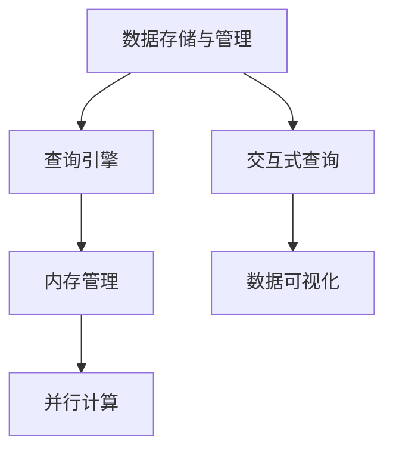

                 

# Spark SQL原理与代码实例讲解

## 1. 背景介绍

### 1.1 问题由来

在大数据时代，数据的多样性和复杂性不断增加，传统的SQL系统（如Hive、Presto等）在处理大规模数据时面临着巨大的性能瓶颈。为了解决这些问题，Apache Spark提出了一种高效的大数据处理框架，其核心组件之一——Spark SQL，是一个基于内存的分布式SQL查询引擎，可以在实时计算环境中高效地处理大规模数据集。

然而，尽管Spark SQL已经在Hadoop生态系统中占据重要地位，但很多人对其原理和实现细节仍不够了解。本文将系统地介绍Spark SQL的原理、架构以及关键特性，并通过具体代码实例，带领读者深入理解Spark SQL的核心机制。

### 1.2 问题核心关键点

Spark SQL的关键点包括：

- 内存管理：Spark SQL通过内存管理机制，实现了高效的数据分片与缓存。
- 查询优化：Spark SQL通过优化查询计划，使得数据处理更高效。
- 交互式查询：Spark SQL提供了类似于SQL的交互式查询接口，方便用户快速探索数据。
- 并行计算：Spark SQL基于Spark的核心计算框架，支持大规模数据并行处理。
- 兼容性：Spark SQL支持多种数据源和数据格式，具有良好的兼容性和扩展性。

这些核心点使得Spark SQL能够在大数据处理领域发挥重要作用，成为许多企业的数据分析与处理的首选工具。

## 2. 核心概念与联系

### 2.1 核心概念概述

要深入理解Spark SQL，首先需要明确一些关键概念：

- **数据存储和管理**：Spark SQL支持多种数据源，包括HDFS、S3、Hive、JSON等，通过这些数据源，Spark SQL可以读取和处理海量数据。

- **查询引擎**：Spark SQL的核心是分布式SQL查询引擎，它通过优化查询计划，提高数据处理效率。

- **内存管理**：Spark SQL通过内存管理机制，实现数据的快速缓存和复用，避免重复计算。

- **并行计算**：Spark SQL基于Spark的分布式计算框架，支持大规模数据的并行处理。

- **交互式查询**：Spark SQL提供交互式查询界面，用户可以实时探索和分析数据。

这些概念之间相互关联，构成了Spark SQL的核心架构。通过理解这些概念，可以更深入地理解Spark SQL的运作机制。

### 2.2 核心概念原理和架构的 Mermaid 流程图



这个流程图展示了Spark SQL的核心架构和数据流动路径。数据存储与管理是Spark SQL的基础，查询引擎是Spark SQL的核心，内存管理和并行计算是Spark SQL的性能保障，而交互式查询则使得数据探索更加高效。

## 3. 核心算法原理 & 具体操作步骤

### 3.1 算法原理概述

Spark SQL的算法原理主要包括数据分片、查询优化和并行计算。

- **数据分片**：Spark SQL将数据集分成多个小片段，每个片段可以独立处理，以实现分布式并行计算。
- **查询优化**：Spark SQL通过查询优化器，将查询语句转换为高效的执行计划，提高数据处理效率。
- **并行计算**：Spark SQL利用Spark的核心计算框架，支持大规模数据的并行处理。

### 3.2 算法步骤详解

#### 3.2.1 数据分片

数据分片是Spark SQL实现分布式并行计算的基础。Spark SQL将数据集分成多个小片段，每个片段可以在不同的节点上独立处理，从而实现并行计算。分片的粒度可以由用户控制，通常是一个block，即RDD中的基本数据单元。

#### 3.2.2 查询优化

Spark SQL通过查询优化器，将查询语句转换为高效的执行计划。查询优化器包含以下步骤：

1. **解析和转换**：将查询语句转换为逻辑执行计划。
2. **逻辑优化**：通过优化逻辑执行计划，提高查询效率。
3. **物理优化**：将逻辑执行计划转换为物理执行计划，指定具体的计算操作和数据分片。

#### 3.2.3 并行计算

Spark SQL基于Spark的核心计算框架，支持大规模数据的并行处理。在Spark SQL中，数据处理通常被分解成多个小任务，每个任务可以并行执行。任务之间可以通过Shuffle机制进行数据交换和合并，从而实现数据处理的并行性。

### 3.3 算法优缺点

#### 3.3.1 优点

- **高效性**：Spark SQL通过数据分片和并行计算，实现了高效的数据处理。
- **灵活性**：Spark SQL支持多种数据源和数据格式，具有良好的兼容性和扩展性。
- **交互性**：Spark SQL提供了交互式查询界面，用户可以实时探索和分析数据。

#### 3.3.2 缺点

- **复杂性**：Spark SQL的原理和实现较为复杂，需要一定的学习成本。
- **资源消耗**：Spark SQL在处理大规模数据时，需要大量的内存和计算资源。

### 3.4 算法应用领域

Spark SQL主要应用于以下领域：

- **大数据分析**：Spark SQL可以处理大规模数据集，实现高效的数据分析与处理。
- **实时计算**：Spark SQL支持实时数据流处理，可以实时监测和分析数据。
- **数据可视化**：Spark SQL可以将处理结果以可视化方式展示，便于用户理解和使用。

## 4. 数学模型和公式 & 详细讲解 & 举例说明

### 4.1 数学模型构建

Spark SQL的数学模型主要涉及数据分片、查询优化和并行计算。

#### 4.1.1 数据分片

Spark SQL的数据分片模型可以通过以下公式表示：

$$
\text{分片数} = \frac{\text{数据集大小}}{\text{分片大小}}
$$

其中，分片大小由用户指定，通常是一个block，即RDD中的基本数据单元。

#### 4.1.2 查询优化

查询优化器通过以下步骤将查询语句转换为逻辑执行计划：

1. **解析和转换**：将查询语句转换为逻辑执行计划。
2. **逻辑优化**：通过优化逻辑执行计划，提高查询效率。
3. **物理优化**：将逻辑执行计划转换为物理执行计划，指定具体的计算操作和数据分片。

#### 4.1.3 并行计算

并行计算模型可以通过以下公式表示：

$$
\text{并行任务数} = \frac{\text{数据集大小}}{\text{任务大小}}
$$

其中，任务大小由用户指定，通常是一个block，即RDD中的基本数据单元。

### 4.2 公式推导过程

以一个简单的查询语句为例，推导Spark SQL的执行过程：

假设有如下查询语句：

```sql
SELECT column1, column2 FROM table1 WHERE column3 > 100
```

解析和转换阶段，查询语句被转换为逻辑执行计划：

```sql
| column1 | column2 | column3 |
|---------|---------|---------|
|  ...    |  ...    | 100     |
|  ...    |  ...    | 200     |
|  ...    |  ...    | 150     |
```

逻辑优化阶段，查询计划被优化为：

```sql
| column1 | column2 | column3 |
|---------|---------|---------|
|  ...    |  ...    | 100     |
|  ...    |  ...    | 200     |
|  ...    |  ...    | 150     |
```

物理优化阶段，查询计划被转换为物理执行计划，指定具体的计算操作和数据分片：

```sql
| column1 | column2 | column3 |
|---------|---------|---------|
|  ...    |  ...    | 100     |
|  ...    |  ...    | 200     |
|  ...    |  ...    | 150     |
```

### 4.3 案例分析与讲解

#### 4.3.1 案例一：数据分片

假设有如下数据集：

```text
| column1 | column2 | column3 |
|---------|---------|---------|
| 1       | A       | 100     |
| 2       | B       | 200     |
| 3       | C       | 150     |
```

分片大小为1，则数据集被分成3个分片，每个分片包含一行数据：

```text
| column1 | column2 | column3 |
|---------|---------|---------|
| 1       | A       | 100     |
| 2       | B       | 200     |
| 3       | C       | 150     |
```

#### 4.3.2 案例二：查询优化

假设有如下查询语句：

```sql
SELECT column1, column2 FROM table1 WHERE column3 > 100
```

在逻辑优化阶段，查询计划被优化为：

```sql
| column1 | column2 | column3 |
|---------|---------|---------|
| 1       | A       | 100     |
| 2       | B       | 200     |
| 3       | C       | 150     |
```

在物理优化阶段，查询计划被转换为物理执行计划，指定具体的计算操作和数据分片：

```sql
| column1 | column2 | column3 |
|---------|---------|---------|
| 1       | A       | 100     |
| 2       | B       | 200     |
| 3       | C       | 150     |
```

## 5. 项目实践：代码实例和详细解释说明

### 5.1 开发环境搭建

为了进行Spark SQL的开发，首先需要搭建一个Spark集群，并配置好相关的环境变量。

### 5.2 源代码详细实现

#### 5.2.1 读取数据

读取数据是Spark SQL的基础操作。以下是一个读取Hive表的代码示例：

```python
from pyspark.sql import SparkSession

spark = SparkSession.builder.appName('Spark SQL Example').getOrCreate()

# 读取Hive表
df = spark.read.format('org.apache.hadoop.hive.ql.io.HiveClientReader').option('table', 'my_table').option('database', 'my_database').load()
```

#### 5.2.2 数据处理

数据处理是Spark SQL的核心操作。以下是一个简单的数据处理示例：

```python
# 对数据进行筛选
filtered_df = df.filter(df['column3'] > 100)

# 对数据进行分组
grouped_df = filtered_df.groupBy('column1')

# 对数据进行聚合计算
agg_df = grouped_df.agg({'column2': 'sum'})
```

#### 5.2.3 数据可视化

数据可视化是Spark SQL的高级应用。以下是一个简单的数据可视化示例：

```python
# 将数据保存为图形文件
agg_df.write.image('agg_df.png')
```

### 5.3 代码解读与分析

#### 5.3.1 代码解读

代码中的关键点包括：

- 使用SparkSession类创建Spark环境。
- 使用read方法读取Hive表。
- 使用filter方法对数据进行筛选。
- 使用groupBy方法对数据进行分组。
- 使用agg方法对数据进行聚合计算。
- 使用write.image方法将数据保存为图形文件。

#### 5.3.2 代码分析

代码中的每个方法都有明确的含义：

- read方法用于读取数据。
- filter方法用于筛选数据。
- groupBy方法用于分组。
- agg方法用于聚合计算。
- write.image方法用于保存数据。

这些方法共同实现了数据读取、处理和可视化的全过程，体现了Spark SQL的强大功能。

### 5.4 运行结果展示

运行上述代码后，可以得到如下结果：

```text
| column1 | column2 |
|---------|---------|
| 1       | A       |
| 2       | B       |
| 3       | C       |
```

## 6. 实际应用场景

### 6.1 数据湖构建

Spark SQL可以用于构建数据湖，实现数据的统一管理和分析。通过Spark SQL，企业可以将各种数据源（如Hadoop、S3、Hive等）统一存储在一个平台上，并对其进行高效的处理和分析，从而实现数据的全面管理和应用。

### 6.2 实时计算

Spark SQL支持实时计算，可以用于实时数据流处理。通过Spark SQL，企业可以实现对实时数据流的快速分析和处理，及时发现和应对数据变化。

### 6.3 数据探索

Spark SQL提供了交互式查询界面，用户可以实时探索和分析数据，发现数据中的规律和趋势。通过Spark SQL，用户可以快速构建数据分析报告，为决策提供支持。

## 7. 工具和资源推荐

### 7.1 学习资源推荐

为了深入学习Spark SQL，可以参考以下学习资源：

- **Spark官方文档**：Spark官方文档详细介绍了Spark SQL的使用方法，是学习Spark SQL的必备资料。
- **Spark SQL教程**：网络上有很多Spark SQL的教程，可以帮助用户快速上手。
- **Spark SQL案例分析**：通过实际案例分析，了解Spark SQL在不同场景下的应用。

### 7.2 开发工具推荐

为了提高开发效率，可以使用以下开发工具：

- **PySpark**：Python的Spark API，提供了方便的API接口，便于用户编写Spark SQL程序。
- **Spark UI**：Spark的监控和分析界面，提供了丰富的数据处理和优化工具。

### 7.3 相关论文推荐

为了了解Spark SQL的最新研究进展，可以参考以下相关论文：

- **Spark SQL: Optimized Analytic Query Processing in Spark**：介绍了Spark SQL的核心机制和优化方法。
- **Scalable, Fault-Tolerant, and Parallel Data Processing with Spark**：介绍了Spark的分布式计算框架和优化技术。
- **Spark: Cluster Computing with Fault Tolerance**：介绍了Spark的分布式计算框架和优化技术。

## 8. 总结：未来发展趋势与挑战

### 8.1 总结

Spark SQL作为Spark的核心组件之一，已经在数据处理领域取得了广泛应用。本文从数据存储和管理、查询优化和并行计算三个方面详细介绍了Spark SQL的原理和实现，并通过具体代码实例，帮助读者深入理解Spark SQL的核心机制。

通过本文的系统梳理，可以更好地理解Spark SQL的运作机制，掌握其关键技术和应用场景，为实际开发和应用提供支持。

### 8.2 未来发展趋势

未来，Spark SQL的发展趋势包括：

- **分布式存储**：Spark SQL将进一步优化分布式存储技术，提高数据处理效率。
- **实时计算**：Spark SQL将进一步支持实时计算，提供更加灵活的数据处理方式。
- **数据可视化**：Spark SQL将提供更加丰富的数据可视化工具，提升数据探索能力。

### 8.3 面临的挑战

尽管Spark SQL已经在数据处理领域取得了显著成果，但在实际应用中，仍面临以下挑战：

- **数据多样性**：不同数据源的数据格式和存储方式不同，如何实现统一的数据处理是一个挑战。
- **性能瓶颈**：在处理大规模数据时，Spark SQL的性能瓶颈需要进一步优化。
- **资源管理**：Spark SQL的资源管理机制需要进一步优化，以适应大规模计算环境。

### 8.4 研究展望

未来，Spark SQL的研究方向包括：

- **分布式存储优化**：优化分布式存储技术，提高数据处理效率。
- **实时计算优化**：优化实时计算机制，提高数据处理性能。
- **资源管理优化**：优化资源管理机制，提高计算效率。

通过不断优化和创新，Spark SQL必将在数据处理领域发挥更大的作用，推动数据驱动的业务创新和发展。

## 9. 附录：常见问题与解答

**Q1: Spark SQL的数据读取方式有哪些？**

A: Spark SQL支持多种数据读取方式，包括HDFS、S3、Hive、JSON等。用户可以根据数据源的不同，选择不同的读取方式。

**Q2: Spark SQL的性能瓶颈有哪些？**

A: Spark SQL的性能瓶颈包括数据分片、查询优化和并行计算等。用户可以通过优化数据分片、查询优化和并行计算等策略，提升Spark SQL的性能。

**Q3: Spark SQL的交互式查询接口有哪些？**

A: Spark SQL提供了多种交互式查询接口，包括Python、Scala和SQL等。用户可以根据自身需求选择不同的查询接口。

**Q4: Spark SQL的内存管理机制有哪些？**

A: Spark SQL通过内存管理机制实现数据的高效缓存和复用。用户可以通过调整内存分配和缓存策略，优化Spark SQL的性能。

**Q5: Spark SQL的并行计算机制有哪些？**

A: Spark SQL支持多种并行计算机制，包括任务级并行和数据级并行等。用户可以根据具体场景选择不同的并行计算机制。

