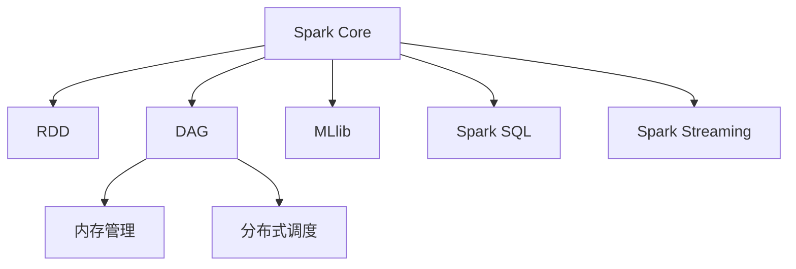

                 

# Spark原理与代码实例讲解

> 关键词：Spark, 分布式计算, 弹性调度, RDD, DAG, 内存管理, 大数据处理, 机器学习, 数据仓库

## 1. 背景介绍

### 1.1 问题由来
随着互联网和大数据技术的发展，全球数据量呈爆炸式增长。传统单节点处理方式已难以满足大规模数据计算需求。为了应对海量数据的挑战，Apache Hadoop项目于2006年诞生，开启了大数据处理的新纪元。然而，Hadoop的MapReduce计算模型存在“数据本地化”和“数据串行化”两大瓶颈，使得数据处理效率难以提升，且易受硬件性能限制。

为了解决上述问题，Apache Spark于2010年被提出。Spark通过一种新的内存计算模型，实现了比Hadoop更快的处理速度，且无需数据移动，降低了延迟。此外，Spark还具备强大的扩展性和兼容性，支持多种编程语言和数据处理任务，逐步成为大数据处理的主流框架之一。

## 2. 核心概念与联系

### 2.1 核心概念概述

为更好地理解Spark原理和代码实现，本文将介绍几个密切相关的核心概念：

- **Spark**：一种快速、通用的大数据处理框架，支持内存计算，通过Spark Core引擎实现高效的批处理和实时处理。Spark具备强大的扩展性和兼容性，支持多种编程语言和数据处理任务。

- **RDD（弹性分布式数据集）**：Spark的基本数据抽象，表示一个不可变的分布式集合。RDD具备弹性分布、容错性、并行处理等特性，支持多种数据源和数据操作。

- **DAG（有向无环图）**：Spark作业执行的计算图表示，用于优化任务执行流程，提高处理效率。DAG节点包括数据读取、转换、计算、存储等操作。

- **内存管理**：Spark采用内存计算模型，通过内存存储中间结果，显著减少磁盘IO，提升计算效率。Spark的内存管理涉及缓存策略、存储模式、内存分配等关键机制。

- **分布式调度**：Spark通过弹性调度框架实现资源自动管理和任务调度，支持多种计算引擎（如Spark Core、Spark SQL、Spark Streaming、MLlib等）和多种资源类型（如CPU、GPU、FPGA等）。

- **机器学习（MLlib）**：Spark内置的机器学习库，提供丰富的算法和模型，支持分布式训练和预测。MLlib可应用于分类、回归、聚类、协同过滤等多种任务。

- **数据仓库（Spark SQL）**：Spark提供的数据仓库功能，支持SQL查询、数据管理和元数据管理，实现数据统一存储和查询。Spark SQL还支持混合数据源处理，如Hive、HBase、JSON等。

- **流处理（Spark Streaming）**：Spark的实时处理组件，支持流式数据处理和实时分析。Spark Streaming提供RDD流、批量处理、窗口聚合等功能，适合处理实时数据流。

这些核心概念之间通过数据流、内存管理、调度策略等环节紧密联系，共同构成了Spark计算框架的完整体系。

### 2.2 核心概念原理和架构的 Mermaid 流程图



该图展示了Spark主要组件之间的联系和数据流向。Spark Core是Spark的基础，通过RDD数据抽象和DAG计算图实现数据流处理。内存管理通过缓存和存储策略，提高数据处理效率。分布式调度通过自动资源管理，确保任务高效执行。MLlib提供机器学习功能，支持分布式训练和预测。Spark SQL实现数据仓库功能，支持SQL查询。Spark Streaming提供实时处理能力，适合处理流式数据。

## 3. 核心算法原理 & 具体操作步骤
### 3.1 算法原理概述

Spark的计算模型基于内存计算，通过DAG有向无环图实现任务调度。DAG图由多个节点组成，每个节点表示一个数据操作，如数据读取、转换、计算等。Spark通过优化DAG图结构，将计算图进行分解和并行执行，实现高效的分布式计算。

Spark的核心数据抽象是RDD，即弹性分布式数据集。RDD通过内存和磁盘两级存储，实现高效的数据访问和操作。RDD具备弹性分布、容错性、并行处理等特性，支持多种数据源和数据操作。

Spark的内存管理通过缓存和存储策略，提高数据处理效率。Spark的缓存策略包括内存优先和磁盘优先两种模式，根据数据的大小和特性选择缓存策略。Spark的存储模式包括持久化（Persistence）和存储级别（Storage Levels），实现对RDD的精细化存储管理。

Spark的分布式调度通过弹性调度框架实现资源自动管理和任务调度。Spark支持多种计算引擎（如Spark Core、Spark SQL、Spark Streaming等）和多种资源类型（如CPU、GPU、FPGA等）。Spark通过动态任务分配和资源管理，实现高效的任务调度。

### 3.2 算法步骤详解

Spark的计算流程主要包括数据读取、转换、计算、存储等步骤。以下以Spark Streaming为例，详细讲解Spark的计算流程和具体步骤：

1. **数据读取**：Spark Streaming通过Kafka、Flume等数据源，实时读取数据流。Spark将数据流拆分为多个小批量数据（Batch），每个Batch通常为1秒或更短。

2. **数据转换**：Spark对每个Batch进行数据转换操作。Spark提供丰富的数据转换操作，如过滤、映射、聚合、窗口等。通过RDD转换操作，将数据流转换为可计算的中间结果。

3. **数据计算**：Spark对中间结果进行计算操作，实现各种数据处理任务。Spark提供多种计算操作，如Map、Reduce、Join、GroupBy等。Spark通过优化DAG图结构，实现高效的分布式计算。

4. **数据存储**：Spark将计算结果存储到内存或磁盘，实现持久化存储。Spark支持多种存储模式，如持久化、存储级别、存储目录等。Spark还支持数据仓库和数据湖等高级数据存储功能。

### 3.3 算法优缺点

Spark具备以下优点：

1. **高效内存计算**：Spark通过内存计算模型，显著提升数据处理效率。Spark的内存管理通过缓存和存储策略，实现高效的内存使用。

2. **弹性分布式计算**：Spark通过DAG计算图和弹性调度框架，实现高效的分布式计算。Spark支持多种计算引擎和资源类型，实现灵活的资源管理和任务调度。

3. **丰富数据操作**：Spark提供丰富的数据操作，如过滤、映射、聚合、窗口等，支持多种数据源和数据处理任务。

4. **高度可扩展性**：Spark支持大规模数据处理，通过弹性扩展实现高性能计算。Spark还支持多种计算引擎和资源类型，实现灵活的资源管理和任务调度。

5. **易于使用和集成**：Spark支持多种编程语言（如Scala、Java、Python等）和多种数据源（如Hadoop、Hive、HBase等），实现高效的开发和集成。

Spark也存在一些缺点：

1. **内存限制**：Spark的内存计算模型依赖于内存存储中间结果，当数据量过大时，内存限制可能导致任务失败。

2. **复杂配置**：Spark的配置参数较多，需要根据具体情况进行优化。Spark的性能和资源管理依赖于参数设置，参数设置不当可能导致性能下降。

3. **学习曲线陡峭**：Spark的计算模型和操作较为复杂，需要一定的学习成本和开发经验。

4. **不适合实时低延迟**：Spark的计算模型基于内存计算，适用于批处理和大规模数据处理，但对于实时低延迟任务（如实时流处理）可能不够理想。

### 3.4 算法应用领域

Spark的应用领域非常广泛，涵盖数据仓库、机器学习、大数据处理等多个领域。以下是Spark的主要应用场景：

1. **数据仓库**：Spark支持数据仓库功能，通过Spark SQL进行SQL查询和数据管理。Spark SQL支持多种数据源和数据存储，实现高效的数据管理和分析。

2. **机器学习**：Spark内置机器学习库（MLlib），提供丰富的算法和模型，支持分布式训练和预测。Spark MLlib可应用于分类、回归、聚类、协同过滤等多种任务。

3. **大数据处理**：Spark支持大规模数据处理，通过Spark Core进行高效的数据流处理。Spark Core提供丰富的数据操作和计算引擎，实现高效的分布式计算。

4. **实时流处理**：Spark支持实时流处理功能，通过Spark Streaming进行实时数据处理。Spark Streaming提供RDD流、批量处理、窗口聚合等功能，适合处理实时数据流。

5. **图处理**：Spark支持图处理功能，通过GraphX进行图计算和分析。GraphX提供丰富的图操作和算法，支持大规模图计算和分析。

6. **交互式查询**：Spark支持交互式查询功能，通过Spark Shell进行交互式数据处理。Spark Shell提供Jupyter Notebook等交互式环境，支持实时数据处理和调试。

## 4. 数学模型和公式 & 详细讲解  
### 4.1 数学模型构建

Spark的核心是DAG有向无环图，用于优化任务执行流程。DAG图的节点表示数据操作，包括数据读取、转换、计算、存储等操作。Spark通过优化DAG图结构，实现高效的分布式计算。

Spark的DAG计算图由多个节点组成，每个节点表示一个数据操作，如数据读取、转换、计算等。DAG节点之间通过边连接，表示数据依赖关系。Spark通过优化DAG图结构，将计算图进行分解和并行执行，实现高效的分布式计算。

Spark的内存管理通过缓存和存储策略，提高数据处理效率。Spark的缓存策略包括内存优先和磁盘优先两种模式，根据数据的大小和特性选择缓存策略。Spark的存储模式包括持久化（Persistence）和存储级别（Storage Levels），实现对RDD的精细化存储管理。

Spark的分布式调度通过弹性调度框架实现资源自动管理和任务调度。Spark支持多种计算引擎（如Spark Core、Spark SQL、Spark Streaming等）和多种资源类型（如CPU、GPU、FPGA等）。Spark通过动态任务分配和资源管理，实现高效的任务调度。

### 4.2 公式推导过程

Spark的计算流程可以通过数学模型进行描述。假设数据流由多个Batch组成，每个Batch大小为B。Spark通过DAG计算图进行数据处理，每个DAG节点表示一个数据操作，如过滤、映射、聚合等。Spark的内存管理通过缓存和存储策略，实现高效的内存使用。Spark的分布式调度通过弹性调度框架实现资源自动管理和任务调度。

以下给出Spark计算流程的数学模型：

1. **数据读取**：Spark通过Kafka、Flume等数据源，实时读取数据流。数据读取操作可以表示为：

$$
RDD = \text{Read}(\text{DataSource}, \text{BatchSize}, \text{PartitionNum})
$$

其中，$\text{DataSource}$表示数据源，$\text{BatchSize}$表示每个Batch的大小，$\text{PartitionNum}$表示数据分片的数量。

2. **数据转换**：Spark对每个Batch进行数据转换操作。数据转换操作可以表示为：

$$
RDD_{\text{Trans}} = \text{Transform}(\text{RDD}, \text{TransformFunc})
$$

其中，$\text{TransformFunc}$表示数据转换函数，如过滤、映射、聚合等。

3. **数据计算**：Spark对中间结果进行计算操作，实现各种数据处理任务。数据计算操作可以表示为：

$$
RDD_{\text{Calc}} = \text{Calculate}(\text{RDD}_{\text{Trans}}, \text{CalculateFunc})
$$

其中，$\text{CalculateFunc}$表示数据计算函数，如Map、Reduce、Join、GroupBy等。

4. **数据存储**：Spark将计算结果存储到内存或磁盘，实现持久化存储。数据存储操作可以表示为：

$$
RDD_{\text{Store}} = \text{Store}(\text{RDD}_{\text{Calc}}, \text{StorageLevel}, \text{StorageDir})
$$

其中，$\text{StorageLevel}$表示存储级别，$\text{StorageDir}$表示存储目录。

### 4.3 案例分析与讲解

以Spark Streaming为例，分析其计算流程和具体步骤：

1. **数据读取**：Spark Streaming通过Kafka等数据源，实时读取数据流。Spark将数据流拆分为多个小批量数据（Batch），每个Batch通常为1秒或更短。

2. **数据转换**：Spark对每个Batch进行数据转换操作。Spark提供丰富的数据转换操作，如过滤、映射、聚合、窗口等。通过RDD转换操作，将数据流转换为可计算的中间结果。

3. **数据计算**：Spark对中间结果进行计算操作，实现各种数据处理任务。Spark提供多种计算操作，如Map、Reduce、Join、GroupBy等。Spark通过优化DAG图结构，实现高效的分布式计算。

4. **数据存储**：Spark将计算结果存储到内存或磁盘，实现持久化存储。Spark支持多种存储模式，如持久化、存储级别、存储目录等。Spark还支持数据仓库和数据湖等高级数据存储功能。

## 5. 项目实践：代码实例和详细解释说明
### 5.1 开发环境搭建

在进行Spark项目实践前，我们需要准备好开发环境。以下是使用Python进行Spark开发的环境配置流程：

1. 安装Python：从官网下载并安装Python，确保版本在3.5以上。

2. 安装PySpark：从官网下载并安装PySpark，确保与Hadoop版本兼容。

3. 安装相关库：安装Pyspark所需的相关库，如numpy、pandas等。

4. 配置Hadoop环境：确保Hadoop已安装并配置正确，可在Spark中使用Hadoop分布式文件系统（HDFS）。

完成上述步骤后，即可在Python环境中进行Spark项目开发。

### 5.2 源代码详细实现

以下是一个简单的Spark Streaming示例代码，演示如何实现实时流处理：

```python
from pyspark import SparkConf, SparkContext, StreamingContext

# 配置Spark环境
conf = SparkConf().setAppName("Spark Streaming Example").setMaster("local[2]")
sc = SparkContext(conf=conf)
ssc = StreamingContext(sc, 1)

# 读取Kafka数据流
lines = ssc.socketTextStream("localhost", 9999)

# 将数据流转换为RDD
parsed_lines = lines.map(lambda line: line.split("\n"))

# 过滤掉空行
filtered_lines = parsed_lines.filter(lambda line: line != "")

# 计算每个单词出现的次数
word_counts = filtered_lines.flatMap(lambda line: line.split(" ")) \
                          .map(lambda word: (word, 1)) \
                          .reduceByKey(lambda a, b: a + b)

# 打印结果
word_counts.pprint()

# 停止Spark Streaming
ssc.stop()
```

以上代码实现了以下步骤：

1. 配置Spark环境，启动Spark Streaming。
2. 从Kafka数据流中读取数据。
3. 将数据流转换为RDD，并过滤掉空行。
4. 计算每个单词出现的次数。
5. 打印结果。
6. 停止Spark Streaming。

### 5.3 代码解读与分析

让我们再详细解读一下关键代码的实现细节：

**配置Spark环境**：
- `SparkConf`：用于配置Spark环境，包括应用名称和运行模式。
- `SparkContext`：用于创建Spark上下文，进行Spark计算操作。
- `StreamingContext`：用于创建Spark Streaming上下文，进行实时数据处理。

**读取Kafka数据流**：
- `socketTextStream`：用于从Socket中读取文本数据流。
- `map`：将数据流转换为RDD，并进行映射操作。
- `filter`：过滤掉空行，只保留非空数据。

**数据处理**：
- `flatMap`：将数据流拆分为多个单词，并展开为多个RDD。
- `map`：将每个单词映射为(key, value)形式，其中key为单词，value为1。
- `reduceByKey`：按照key进行聚合，计算每个单词出现的次数。

**打印结果**：
- `pprint`：将结果打印输出，方便调试和监控。

**停止Spark Streaming**：
- `stop`：停止Spark Streaming，释放资源。

## 6. 实际应用场景
### 6.1 数据仓库

Spark在数据仓库领域的应用非常广泛，通过Spark SQL进行SQL查询和数据管理。Spark SQL支持多种数据源和数据存储，实现高效的数据管理和分析。Spark SQL可以连接各种数据源，如Hive、HBase、JSON等，进行数据统一存储和查询。

### 6.2 机器学习

Spark内置机器学习库（MLlib），提供丰富的算法和模型，支持分布式训练和预测。Spark MLlib可应用于分类、回归、聚类、协同过滤等多种任务。Spark MLlib提供了多种常用的机器学习算法，如逻辑回归、随机森林、K-Means等，支持大规模数据处理和分布式训练。

### 6.3 大数据处理

Spark支持大规模数据处理，通过Spark Core进行高效的数据流处理。Spark Core提供丰富的数据操作和计算引擎，实现高效的分布式计算。Spark Core支持多种数据操作，如Map、Reduce、Join、GroupBy等，适合处理大规模数据集。

### 6.4 实时流处理

Spark支持实时流处理功能，通过Spark Streaming进行实时数据处理。Spark Streaming提供RDD流、批量处理、窗口聚合等功能，适合处理实时数据流。Spark Streaming支持多种数据源，如Kafka、Flume等，实现高效的数据流处理。

### 6.5 图处理

Spark支持图处理功能，通过GraphX进行图计算和分析。GraphX提供丰富的图操作和算法，支持大规模图计算和分析。GraphX支持多种数据源，如Spark RDD、TGraphX等，实现高效的图计算和分析。

## 7. 工具和资源推荐
### 7.1 学习资源推荐

为了帮助开发者系统掌握Spark的原理和实践技巧，这里推荐一些优质的学习资源：

1. **《Spark权威指南》**：由Spark专家撰写，全面介绍了Spark的核心原理和应用实践，是了解Spark的必读书籍。

2. **Spark官方文档**：Spark官网提供的官方文档，包含详细的API文档、示例代码和用户手册，是Spark学习的最佳资源。

3. **《Python Spark编程实战》**：一本实战型书籍，通过大量示例代码，帮助读者快速上手Spark。

4. **Coursera《Apache Spark》课程**：由John Snow Labs提供的Spark在线课程，讲解Spark的核心原理和应用实践。

5. **Kaggle《Apache Spark》竞赛**：Kaggle提供的Spark竞赛项目，帮助读者通过实战提升Spark技能。

通过对这些资源的学习实践，相信你一定能够快速掌握Spark的精髓，并用于解决实际的Spark问题。

### 7.2 开发工具推荐

高效的Spark开发离不开优秀的工具支持。以下是几款用于Spark开发的常用工具：

1. PySpark：Python接口的Spark API，提供便捷的开发环境和丰富的API，适合Python开发者使用。

2. Spark IDE：适用于Spark开发和调试的集成开发环境，提供Spark交互式Shell、代码高亮、自动补全等功能。

3. DataGrip：适用于大数据开发的IDE，支持Spark、Hadoop、Hive等多种数据处理框架，提供高效的数据管理和查询功能。

4. PyCharm：适用于Python开发的IDE，支持Spark、Scala、Java等多种语言，提供丰富的开发工具和插件。

5. Jupyter Notebook：适用于数据科学和机器学习的交互式开发环境，支持Spark Shell、Python、R等多种语言，方便调试和分享代码。

合理利用这些工具，可以显著提升Spark开发的效率和质量，加快创新迭代的步伐。

### 7.3 相关论文推荐

Spark的发展源于学界的持续研究。以下是几篇奠基性的相关论文，推荐阅读：

1. **Spark: Cluster Computing with Fault Tolerance**：Spark的奠基论文，介绍Spark的核心原理和计算模型。

2. **Spark: Fast and General Distributed Data Processing**：Spark的核心论文，详细介绍Spark的计算模型、数据流处理和内存管理。

3. **Spark Streaming: A Real-Time Distributed Computing System**：Spark Streaming的核心论文，介绍Spark Streaming的实时数据处理和流式计算。

4. **Resilient Distributed Datasets: A Fault-Tolerant Abstraction for In-Memory Cluster Computing**：Spark RDD的核心论文，介绍RDD的数据抽象和分布式计算。

5. **GraphX: A Graph Processing Framework for Big Data**：Spark GraphX的核心论文，介绍GraphX的图处理算法和数据结构。

这些论文代表了大数据处理框架的发展脉络。通过学习这些前沿成果，可以帮助研究者把握学科前进方向，激发更多的创新灵感。

## 8. 总结：未来发展趋势与挑战

### 8.1 总结

本文对Spark原理和代码实现进行了全面系统的介绍。首先阐述了Spark框架的背景和意义，明确了Spark在分布式计算和大数据处理中的重要地位。其次，从原理到实践，详细讲解了Spark的核心概念和算法步骤，给出了Spark代码实现的完整示例。同时，本文还广泛探讨了Spark在数据仓库、机器学习、大数据处理等多个领域的应用前景，展示了Spark的强大能力和广泛适用性。此外，本文精选了Spark的学习资源，力求为读者提供全方位的技术指引。

通过本文的系统梳理，可以看到，Spark作为一种高效、通用的大数据处理框架，已经广泛应用于各个领域。Spark具备内存计算、弹性分布式计算、丰富数据操作等诸多优势，大大提升了数据处理效率和灵活性。未来，随着Spark的持续演进和优化，相信Spark将会在更多领域得到应用，为大数据处理和人工智能技术带来新的突破。

### 8.2 未来发展趋势

展望未来，Spark的发展趋势将呈现以下几个方向：

1. **弹性计算**：Spark将继续优化弹性调度框架，实现更加灵活的资源管理和任务调度。Spark支持多种计算引擎和资源类型，适应不同应用场景的需求。

2. **高性能计算**：Spark将继续优化内存计算模型，提升数据处理效率。Spark的内存管理通过缓存和存储策略，实现高效的内存使用。

3. **混合计算**：Spark将支持更多计算引擎和数据源，实现多种计算方式的融合。Spark支持Spark Core、Spark SQL、Spark Streaming、GraphX等多种计算引擎，适合不同数据处理需求。

4. **大数据生态**：Spark将继续拓展大数据生态系统，整合更多数据处理框架和工具。Spark支持多种数据源和数据处理工具，实现数据统一管理和分析。

5. **机器学习**：Spark将继续优化机器学习库，提升分布式训练和预测性能。Spark MLlib提供丰富的算法和模型，支持多种数据处理任务。

6. **实时流处理**：Spark将继续优化实时流处理功能，提升数据流处理的性能和稳定性。Spark Streaming提供高效的RDD流处理和窗口聚合功能，适合实时数据处理。

7. **图处理**：Spark将继续优化图处理功能，提升大规模图计算和分析的性能。Spark GraphX提供丰富的图操作和算法，支持大规模图计算和分析。

### 8.3 面临的挑战

尽管Spark具备诸多优点，但在迈向更加智能化、普适化应用的过程中，它仍面临着诸多挑战：

1. **性能瓶颈**：Spark的内存计算模型依赖于内存存储中间结果，当数据量过大时，内存限制可能导致任务失败。

2. **复杂配置**：Spark的配置参数较多，需要根据具体情况进行优化。Spark的性能和资源管理依赖于参数设置，参数设置不当可能导致性能下降。

3. **学习曲线陡峭**：Spark的计算模型和操作较为复杂，需要一定的学习成本和开发经验。

4. **实时低延迟**：Spark的计算模型基于内存计算，适用于批处理和大规模数据处理，但对于实时低延迟任务（如实时流处理）可能不够理想。

5. **大数据存储**：Spark的大数据存储依赖于分布式文件系统（如HDFS），可能面临存储容量和网络带宽的限制。

6. **数据安全**：Spark的大数据处理可能涉及敏感数据，需要加强数据安全管理和隐私保护。

### 8.4 研究展望

面向未来，Spark的发展需要在以下几个方面进行深入研究：

1. **优化内存计算**：进一步优化Spark的内存计算模型，提升数据处理效率。通过改进缓存策略和存储模式，实现高效的数据处理。

2. **优化分布式调度**：进一步优化Spark的弹性调度框架，实现更加灵活的资源管理和任务调度。通过改进任务分配和调度算法，实现高效的任务执行。

3. **优化机器学习库**：进一步优化Spark的机器学习库，提升分布式训练和预测性能。通过改进算法和模型，支持更多数据处理任务。

4. **优化实时流处理**：进一步优化Spark的实时流处理功能，提升数据流处理的性能和稳定性。通过改进RDD流处理和窗口聚合算法，实现高效的数据流处理。

5. **优化图处理**：进一步优化Spark的图处理功能，提升大规模图计算和分析的性能。通过改进图操作和算法，支持更多图计算任务。

6. **优化大数据存储**：进一步优化Spark的大数据存储机制，提升存储容量和网络带宽。通过改进分布式文件系统和存储策略，实现高效的数据存储和访问。

7. **加强数据安全**：加强Spark的数据安全管理和隐私保护，确保数据处理的安全性和可靠性。通过改进数据加密和访问控制，实现高效的数据安全管理。

通过在这些方向的研究，Spark有望在未来的发展中，实现更加智能化、普适化的应用，为大数据处理和人工智能技术带来新的突破。

## 9. 附录：常见问题与解答

**Q1：Spark和Hadoop的区别是什么？**

A: Spark和Hadoop都是大数据处理框架，但它们在计算模型、存储机制、编程接口等方面存在显著区别。Spark基于内存计算，采用DAG计算图进行任务调度，适合大规模数据处理和实时数据流处理。Hadoop基于磁盘计算，采用MapReduce计算模型进行任务调度，适合批处理和离线数据处理。Spark的内存计算模型和弹性调度框架，使得它在数据处理效率和灵活性上优于Hadoop。

**Q2：Spark的存储模式有哪些？**

A: Spark支持多种存储模式，包括持久化（Persistence）和存储级别（Storage Levels）。持久化是将RDD数据缓存到内存或磁盘，实现高效的内存使用和快速访问。存储级别包括MEMORY_ONLY、MEMORY_AND_DISK、DISK_ONLY等多种级别，根据数据特性选择合适的存储模式。Spark还支持HDFS、S3等多种分布式文件系统，实现数据的高效存储和访问。

**Q3：Spark的内存管理策略有哪些？**

A: Spark的内存管理策略包括缓存策略和存储策略。缓存策略包括内存优先和磁盘优先两种模式，根据数据的大小和特性选择缓存策略。存储策略包括持久化（Persistence）和存储级别（Storage Levels），实现对RDD的精细化存储管理。Spark通过缓存和存储策略，实现高效的内存使用和数据处理。

**Q4：Spark的弹性调度框架有哪些关键机制？**

A: Spark的弹性调度框架实现资源自动管理和任务调度，支持多种计算引擎和资源类型。Spark的弹性调度框架通过动态任务分配和资源管理，实现高效的任务调度。Spark的弹性调度框架包括任务提交、调度器、执行器、管理器等多个组件，实现任务的自动管理和调度。

**Q5：Spark的数据源有哪些？**

A: Spark支持多种数据源，包括Hadoop、Hive、HBase、JSON等。Spark的数据源接口提供丰富的数据操作和API，方便数据处理和分析。Spark的数据源支持多种数据格式和存储系统，实现数据统一管理和分析。

通过以上回答，相信你对Spark的原理、应用和挑战有了更全面的了解。Spark作为一种高效、通用的大数据处理框架，已经在多个领域得到广泛应用，并不断扩展其功能和优化性能。未来，随着Spark的持续演进和优化，相信Spark将会在更多领域得到应用，为大数据处理和人工智能技术带来新的突破。

---

作者：禅与计算机程序设计艺术 / Zen and the Art of Computer Programming

