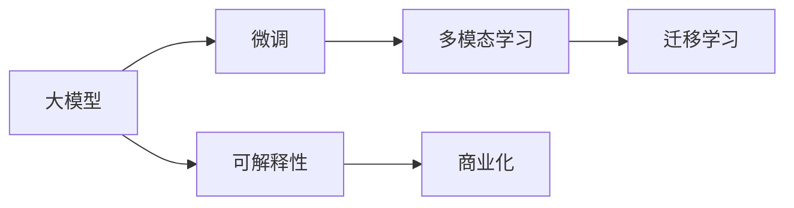

                 

## 1. 背景介绍

在人工智能领域，创业公司的起起伏伏屡见不鲜，每一次失败都为后来者提供了宝贵的经验和教训。其中，Stability AI的失败更是引起了广泛关注和深刻反思。Stability AI原本希望凭借其大模型的能力，在医疗、教育、金融等多个领域取得突破。然而，其复杂的商业模式、不切实际的预期以及错误的市场定位，最终导致公司以失败告终。本文将深入分析Stability AI的失败教训，为正在或即将从事大模型创业的公司提供一些启示和建议。

## 2. 核心概念与联系

### 2.1 核心概念概述

在探讨Stability AI的失败之前，我们先要了解几个核心概念及其联系：

- **大模型（Large Models）**：指使用大量的训练数据和计算资源训练出的深度学习模型，具有强大的表示能力和通用性。
- **微调（Fine-Tuning）**：在大模型基础上，针对特定任务进行有监督的训练，优化模型以适应新的任务需求。
- **迁移学习（Transfer Learning）**：使用在大规模数据上预训练的模型，在小规模数据上进行微调，以提高模型的泛化能力。
- **多模态学习（Multi-Modal Learning）**：结合多种数据类型的信息，如文本、图像、声音等，进行更加全面和准确的模型训练。
- **可解释性（Explainability）**：确保模型的决策过程透明、可理解，满足业务和法律的要求。
- **商业化（Commercialization）**：将技术转化为实际的商业应用，获取收入和市场份额。

这些概念之间有着密切的联系。大模型作为基础，通过微调和迁移学习提升其在特定任务上的表现，结合多模态学习丰富信息来源，最终通过可解释性确保商业化的成功。

### 2.2 核心概念原理和架构的 Mermaid 流程图



这个流程图展示了从基础大模型到最终商业化的完整路径，其中每个环节都是相辅相成的。

## 3. 核心算法原理 & 具体操作步骤

### 3.1 算法原理概述

大模型的成功依赖于大量的训练数据和计算资源。通过在大规模数据上预训练，模型可以学习到丰富的语言和世界知识，然后在特定任务上进行微调，进一步优化模型的表现。

微调过程通常分为两个阶段：

1. **预训练**：在大规模无标签数据上，通过自监督任务训练模型，学习通用的语言表示。
2. **微调**：在标注数据集上，通过有监督学习任务，调整模型参数，使其在特定任务上表现更佳。

迁移学习则是将预训练模型在特定领域进行微调，以提升其在特定任务上的泛化能力。多模态学习则是结合不同类型的数据，如文本、图像、声音等，进行更全面的模型训练。

### 3.2 算法步骤详解

以下是微调过程的详细步骤：

1. **数据准备**：收集并清洗标注数据集，确保数据质量。
2. **模型选择**：选择合适的预训练模型，如BERT、GPT等。
3. **任务适配**：在预训练模型的基础上，添加任务特定的层，如分类层、解码层等。
4. **模型初始化**：使用预训练模型参数初始化微调模型。
5. **模型微调**：在标注数据集上进行有监督学习，调整模型参数。
6. **性能评估**：在验证集和测试集上评估模型性能，确保模型泛化能力。
7. **部署应用**：将训练好的模型部署到实际应用中，进行商业化。

### 3.3 算法优缺点

大模型和微调方法有以下优点：

- **泛化能力**：在大规模数据上进行预训练，模型可以学习到通用的语言知识，提升泛化能力。
- **快速迭代**：通过微调，可以快速适应新的任务需求，缩短产品迭代周期。
- **可扩展性**：大模型可以轻松地扩展到不同的任务和领域，提升模型的应用范围。

同时，大模型和微调方法也存在一些缺点：

- **计算资源需求高**：大模型需要大量的计算资源进行训练，成本较高。
- **数据依赖性强**：微调效果很大程度上依赖于标注数据的质量和数量，数据获取成本高。
- **易受数据分布偏差影响**：模型在特定领域或数据分布下可能表现不佳。

### 3.4 算法应用领域

大模型和微调方法在多个领域中得到了广泛应用，如：

- **自然语言处理（NLP）**：文本分类、命名实体识别、机器翻译等。
- **计算机视觉（CV）**：图像分类、目标检测、图像生成等。
- **语音识别**：语音转文本、情感分析等。
- **推荐系统**：用户行为预测、个性化推荐等。
- **医疗健康**：疾病诊断、影像分析等。

## 4. 数学模型和公式 & 详细讲解 & 举例说明

### 4.1 数学模型构建

微调过程可以用以下公式表示：

$$
\min_{\theta} \frac{1}{N}\sum_{i=1}^N \ell(y_i, M_{\theta}(x_i))
$$

其中，$\theta$ 是模型参数，$x_i$ 是输入数据，$y_i$ 是标签，$M_{\theta}$ 是预训练模型，$\ell$ 是损失函数。

### 4.2 公式推导过程

假设有一个二分类任务，预训练模型输出概率为 $p(y=1|x)$，真实标签为 $y$，交叉熵损失函数为：

$$
\ell(y, p(y|x)) = -y\log p(y=1|x) - (1-y)\log p(y=0|x)
$$

微调过程的目标是最小化经验风险：

$$
\min_{\theta} \frac{1}{N}\sum_{i=1}^N \ell(y_i, M_{\theta}(x_i))
$$

通过反向传播算法，计算梯度并更新模型参数。

### 4.3 案例分析与讲解

假设我们要将BERT模型微调到情感分析任务，步骤如下：

1. **数据准备**：收集并清洗标注数据集。
2. **模型初始化**：使用BERT模型作为初始参数。
3. **任务适配**：在BERT模型顶部添加一个全连接层和一个softmax层，用于情感分类。
4. **微调**：在标注数据集上进行有监督学习，调整顶部全连接层的参数。
5. **性能评估**：在验证集和测试集上评估模型性能。

## 5. 项目实践：代码实例和详细解释说明

### 5.1 开发环境搭建

要使用TensorFlow和Keras进行大模型微调，首先需要安装TensorFlow和Keras：

```bash
pip install tensorflow keras
```

### 5.2 源代码详细实现

假设我们要微调BERT模型到情感分析任务，代码如下：

```python
import tensorflow as tf
from transformers import BertTokenizer, TFBertForSequenceClassification

# 加载预训练的BERT模型
tokenizer = BertTokenizer.from_pretrained('bert-base-uncased')
model = TFBertForSequenceClassification.from_pretrained('bert-base-uncased', num_labels=2)

# 加载数据集
train_data = ...
train_labels = ...
val_data = ...
val_labels = ...

# 定义模型层
class EmotionClassifier(tf.keras.Model):
    def __init__(self):
        super(EmotionClassifier, self).__init__()
        self.bert = model
        self.dropout = tf.keras.layers.Dropout(0.1)
        self.dense = tf.keras.layers.Dense(2, activation='softmax')

    def call(self, inputs):
        attention_mask = tf.expand_dims(inputs['attention_mask'], -1)
        input_ids = inputs['input_ids']
        outputs = self.bert(input_ids, attention_mask=attention_mask)
        pooled_output = outputs.pooler_output
        output = self.dropout(pooled_output)
        logits = self.dense(output)
        return logits

# 编译模型
classifier = EmotionClassifier()
classifier.compile(optimizer='adam', loss=tf.keras.losses.SparseCategoricalCrossentropy(from_logits=True), metrics=['accuracy'])

# 训练模型
classifier.fit(train_data, train_labels, epochs=5, validation_data=(val_data, val_labels))

# 评估模型
classifier.evaluate(val_data, val_labels)
```

### 5.3 代码解读与分析

上述代码展示了如何使用Keras和TensorFlow进行BERT模型的微调。关键步骤如下：

1. **加载预训练模型**：使用HuggingFace的`TFBertForSequenceClassification`加载预训练的BERT模型。
2. **加载数据集**：加载训练集和验证集，确保数据质量。
3. **定义模型层**：在顶部添加一个Dropout层和一个全连接层，用于情感分类。
4. **编译模型**：使用Adam优化器和SparseCategoricalCrossentropy损失函数进行编译。
5. **训练模型**：在训练集上训练模型，并在验证集上进行评估。
6. **评估模型**：在验证集上评估模型性能。

## 6. 实际应用场景

### 6.4 未来应用展望

大模型和微调方法将在未来多个领域中得到广泛应用，如：

- **医疗健康**：疾病诊断、影像分析、健康管理等。
- **金融服务**：信用评估、风险管理、欺诈检测等。
- **自动驾驶**：感知、决策、控制等。
- **智能家居**：语音识别、自然语言交互、智能推荐等。

## 7. 工具和资源推荐

### 7.1 学习资源推荐

- **《深度学习》课程**：斯坦福大学Andrew Ng教授的课程，讲解深度学习的基本原理和常用技术。
- **《自然语言处理与深度学习》书籍**：Cahill提出的书，介绍了自然语言处理的深度学习技术。
- **HuggingFace官方文档**：提供了丰富的预训练模型和微调样例，是学习和实践的必备资源。
- **Kaggle竞赛**：参加各类数据科学竞赛，实战提升技能。

### 7.2 开发工具推荐

- **TensorFlow**：Google开源的深度学习框架，功能丰富，支持多种硬件。
- **Keras**：基于TensorFlow的高级API，使用方便，适合快速迭代开发。
- **PyTorch**：Facebook开源的深度学习框架，灵活性高，支持动态图。
- **Jupyter Notebook**：交互式编程环境，支持Python、R等语言。

### 7.3 相关论文推荐

- **《Attention is All You Need》**：Vaswani等人提出的Transformer架构，开创了预训练大模型的时代。
- **《BERT: Pre-training of Deep Bidirectional Transformers for Language Understanding》**：Devlin等人提出的BERT模型，使用了自监督预训练任务。
- **《Parameter-Efficient Transfer Learning》**：Howard等人提出的Adapter技术，只调整少量参数，提升了微调的效率。

## 8. 总结：未来发展趋势与挑战

### 8.1 研究成果总结

大模型和微调方法在多个领域取得了显著的成果，如自然语言处理、计算机视觉、语音识别等。未来，这些技术将在更多领域得到应用，推动人工智能技术的普及和发展。

### 8.2 未来发展趋势

1. **计算资源的进一步优化**：随着硬件技术的进步，计算资源成本将进一步降低，使得更大规模的模型训练成为可能。
2. **数据多样性的提升**：更多的跨领域数据集将被收集和利用，提升模型的泛化能力。
3. **模型的可解释性增强**：可解释性技术将不断提升，使得模型的决策过程更加透明和可信。
4. **商业化的加速**：更多的创业公司将投入商业化运营，促进技术落地应用。

### 8.3 面临的挑战

1. **计算资源的高需求**：大规模模型训练需要高性能硬件，成本较高。
2. **数据隐私和安全**：数据隐私和安全的保护需要进一步加强，防止数据泄露和滥用。
3. **模型的公平性和可解释性**：确保模型的公平性和可解释性，避免偏见和歧视。
4. **技术商业化的难度**：如何将技术转化为实际应用，获取商业成功，需要精心设计和运营。

### 8.4 研究展望

未来的研究将在以下几个方面取得突破：

1. **多模态学习**：结合文本、图像、声音等数据，进行更全面的模型训练。
2. **自适应微调**：根据数据分布变化，动态调整模型参数，提升泛化能力。
3. **高效可解释模型**：开发高效可解释的模型，使得决策过程透明可信。
4. **跨领域迁移**：提升模型在不同领域之间的迁移能力，实现跨领域应用。

## 9. 附录：常见问题与解答

**Q1：大模型微调的效果如何？**

A: 大模型微调在多个任务上取得了显著的成果，提升了模型在特定任务上的表现。例如，BERT模型在情感分析、命名实体识别等任务上取得了SOTA性能。

**Q2：如何选择合适的学习率？**

A: 学习率的选择需要根据具体任务和数据集进行调整。一般建议从小值开始，逐步增大，直到找到最佳学习率。

**Q3：如何缓解过拟合问题？**

A: 缓解过拟合问题的方法包括数据增强、正则化、dropout等。在数据集较小的情况下，可以尝试使用这些方法。

**Q4：如何评估模型性能？**

A: 模型性能评估通常使用准确率、精确率、召回率等指标，以及混淆矩阵等可视化工具。

**Q5：大模型的部署需要注意哪些问题？**

A: 部署大模型需要注意计算资源、存储需求、模型效率等问题。可以使用分布式训练和模型压缩等技术进行优化。

---

作者：禅与计算机程序设计艺术 / Zen and the Art of Computer Programming

