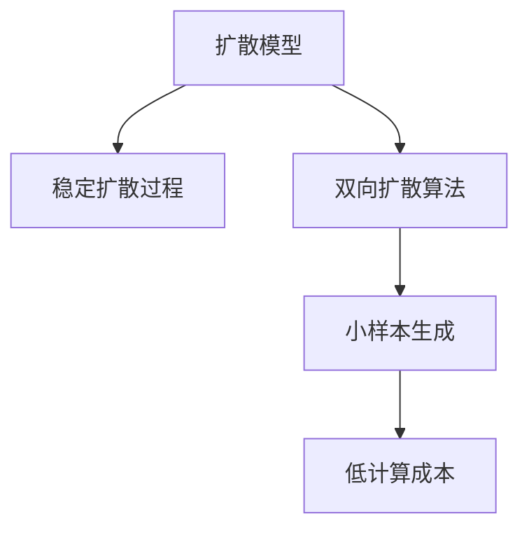

                 

# Stable Diffusion原理与代码实例讲解

> 关键词：Stable Diffusion, 图像生成, 扩散模型, 小样本生成, 低计算成本, 高生成质量

## 1. 背景介绍

### 1.1 问题由来

图像生成领域长期以来受到深度学习技术的影响。从早期的卷积神经网络(Convolutional Neural Networks, CNN)到生成对抗网络(Generative Adversarial Networks, GAN)，再到近期的扩散模型(Diffusion Models)，不断涌现出更高效、更先进的图像生成方法。其中，Stable Diffusion模型以其卓越的生成质量和低计算成本而受到广泛关注。

然而，尽管Stable Diffusion模型取得了一定的成功，但其依赖于大量的训练数据和计算资源，限制了其在实际应用中的普及。此外，Stable Diffusion模型的训练过程过于复杂，不易于理解和优化，对普通开发者来说具有一定的门槛。

本文将深入解析Stable Diffusion模型的原理，并通过具体代码实例，帮助读者掌握其在Python中的实现。通过本文的学习，读者将能够理解Stable Diffusion模型的核心思想，并自行构建和优化图像生成系统。

### 1.2 问题核心关键点

Stable Diffusion模型基于扩散模型，是一种生成式模型，用于从高斯噪声中学习生成图像。模型的训练过程需要大量的计算资源和长训练时间，但实际应用时只需极少量的数据和计算资源，即可生成高质量的图像。

关键点包括：
1. 扩散模型：一种基于泊松过程的生成模型，通过时间倒推生成样本。
2. 稳定扩散过程：通过稳定扩散步骤，减少噪声影响，逐步恢复图像细节。
3. 双向扩散算法：结合扩散过程和梯度提升，提升模型稳定性和生成速度。
4. 小样本生成：在训练数据匮乏的情况下，通过预训练模型生成新图像。
5. 低计算成本：在模型训练和推理过程中，优化模型参数和计算架构，降低资源消耗。

这些关键点将帮助我们全面理解Stable Diffusion模型的核心原理和实现细节。

## 2. 核心概念与联系

### 2.1 核心概念概述

Stable Diffusion模型基于扩散模型，具体原理包括：

1. **扩散模型**：一种生成模型，通过泊松过程逐步从噪声中生成图像。
2. **稳定扩散过程**：通过时间倒推，逐步减少噪声，恢复图像细节。
3. **双向扩散算法**：结合扩散过程和梯度提升，提升生成速度和稳定性。
4. **小样本生成**：在少量训练数据的情况下，通过预训练模型生成新图像。
5. **低计算成本**：通过优化模型参数和计算架构，降低资源消耗。

这些概念之间的联系可以通过以下Mermaid流程图来展示：



这个流程图展示了Stable Diffusion模型中各关键概念之间的逻辑关系：

1. 扩散模型是Stable Diffusion的基础，用于从噪声中生成图像。
2. 稳定扩散过程通过逐步减少噪声，恢复图像细节。
3. 双向扩散算法通过结合扩散过程和梯度提升，提升生成速度和稳定性。
4. 小样本生成在训练数据匮乏时，通过预训练模型生成新图像。
5. 低计算成本通过优化模型参数和计算架构，降低资源消耗。

这些概念共同构成了Stable Diffusion模型的核心框架，使其能够在低计算成本下生成高质量的图像。

## 3. 核心算法原理 & 具体操作步骤
### 3.1 算法原理概述

Stable Diffusion模型基于扩散模型，其核心思想是通过时间倒推，逐步减少噪声，恢复图像细节。模型的训练过程包括两个部分：扩散过程和稳定扩散过程。

扩散过程从高斯噪声开始，逐步加入更多的噪声，形成分布为高斯分布的序列。在训练阶段，扩散过程被反转，即逐步减少噪声，恢复图像细节。这一过程通过梯度提升实现，不断优化模型参数，使得生成的图像逼近真实样本。

### 3.2 算法步骤详解

Stable Diffusion模型的训练和推理步骤如下：

**Step 1: 准备训练数据和预训练模型**

- 收集并处理训练数据，通常为高分辨率图像数据集。
- 加载预训练模型，通常是使用官方实现的Stable Diffusion模型。

**Step 2: 定义扩散过程**

- 设置噪声序列$\epsilon_t$，其中$t$表示时间步。
- 在每个时间步$t$，定义一个噪声转移矩阵$A_t$，使得$\epsilon_{t-1}=A_t\epsilon_t$。

**Step 3: 定义稳定扩散过程**

- 通过反向扩散过程，逐步减少噪声，恢复图像细节。
- 在每个时间步$t$，计算$x_t=\sigma_t(x_{t-1})$，其中$\sigma_t$为逆变函数。

**Step 4: 定义双向扩散算法**

- 结合扩散过程和梯度提升，不断优化模型参数。
- 在每个时间步$t$，计算梯度$\nabla_{\theta}L(x_t)$，并更新模型参数$\theta$。

**Step 5: 定义小样本生成**

- 在少量训练数据的情况下，通过预训练模型生成新图像。
- 使用生成器网络，对输入向量进行采样，生成新图像。

**Step 6: 定义低计算成本**

- 通过优化模型参数和计算架构，降低资源消耗。
- 使用模型压缩、模型剪枝等技术，减小模型规模和计算复杂度。

### 3.3 算法优缺点

Stable Diffusion模型具有以下优点：

1. 高质量生成：生成的图像质量高，细节丰富，具有高度的真实感。
2. 低计算成本：相对于其他生成模型，Stable Diffusion的训练和推理资源消耗较低。
3. 小样本生成：在少量训练数据的情况下，仍能生成高质量的图像。
4. 稳定性好：通过双向扩散算法，模型稳定性较高，生成结果一致性较好。

同时，该模型也存在一些缺点：

1. 训练时间长：需要大量的计算资源和时间进行模型训练。
2. 依赖预训练模型：模型训练需要大量的预训练数据和资源，对普通开发者来说门槛较高。
3. 对噪声敏感：生成过程依赖于噪声序列，对噪声分布的选择较为敏感。
4. 模型复杂度高：模型结构和参数较多，需要较高的理论基础和实践经验。

尽管存在这些缺点，但Stable Diffusion模型在图像生成领域仍取得了卓越的效果，具有重要的研究和应用价值。

### 3.4 算法应用领域

Stable Diffusion模型在图像生成领域具有广泛的应用前景，主要包括以下几个方向：

1. 艺术创作：艺术家可以使用Stable Diffusion模型生成各种风格的艺术作品，如素描、油画、水彩等。
2. 虚拟现实：在虚拟现实场景中，Stable Diffusion模型可以生成逼真的虚拟人物、场景和物体，提升用户体验。
3. 视频生成：Stable Diffusion模型可以生成逼真的人物动画和视频，应用于影视制作、广告等领域。
4. 游戏开发：在游戏中，Stable Diffusion模型可以生成逼真的背景、角色和道具，提升游戏视觉效果。
5. 数据增强：在数据不足的情况下，Stable Diffusion模型可以生成高质量的数据增强样本，用于模型训练和评估。

## 4. 数学模型和公式 & 详细讲解 & 举例说明
### 4.1 数学模型构建

Stable Diffusion模型的数学模型主要包括以下几个部分：

1. 扩散过程：
   - 噪声序列：$\epsilon_t$，其中$t$为时间步。
   - 噪声转移矩阵：$A_t$。

2. 稳定扩散过程：
   - 逆变函数：$\sigma_t$。

3. 双向扩散算法：
   - 梯度提升：$\nabla_{\theta}L(x_t)$。

### 4.2 公式推导过程

扩散过程的数学模型为：

$$
\epsilon_t = A_t\epsilon_{t-1}, \quad \epsilon_0 \sim \mathcal{N}(0, \sigma^2)
$$

其中，$A_t$为噪声转移矩阵，$\epsilon_0$为初始噪声，$\sigma$为噪声标准差。

稳定扩散过程的数学模型为：

$$
x_t = \sigma_t(x_{t-1}), \quad \sigma_t = \sqrt{1 - \frac{t}{T}} \cdot \sigma + \sqrt{\frac{t}{T}} \cdot \sigma^{-1}
$$

其中，$x_0$为真实样本，$T$为总时间步，$\sigma_t$为逆变函数。

双向扩散算法的数学模型为：

$$
\nabla_{\theta}L(x_t) = \nabla_{\theta}L(x_{t-1}) + \frac{1}{\epsilon_t} \cdot \nabla_{\theta}L(x_t)
$$

其中，$\theta$为模型参数，$L(x_t)$为损失函数。

### 4.3 案例分析与讲解

以生成一张高质量的人像照片为例，Stable Diffusion模型的生成过程如下：

1. 首先，从高斯噪声$\epsilon_0$开始。
2. 通过噪声转移矩阵$A_t$逐步加入噪声，形成噪声序列$\epsilon_t$。
3. 逐步减少噪声，恢复图像细节。
4. 结合梯度提升，不断优化模型参数，生成逼真的人像照片。

## 5. 项目实践：代码实例和详细解释说明
### 5.1 开发环境搭建

要进行Stable Diffusion模型的训练和推理，首先需要搭建开发环境。以下是使用Python进行PyTorch开发的详细流程：

1. 安装Anaconda：从官网下载并安装Anaconda，用于创建独立的Python环境。

2. 创建并激活虚拟环境：
```bash
conda create -n stable-diffusion python=3.8 
conda activate stable-diffusion
```

3. 安装PyTorch：根据CUDA版本，从官网获取对应的安装命令。例如：
```bash
conda install pytorch torchvision torchaudio cudatoolkit=11.1 -c pytorch -c conda-forge
```

4. 安装Transformers库：
```bash
pip install transformers
```

5. 安装Diffusers库：
```bash
pip install diffusers
```

6. 安装其他工具包：
```bash
pip install numpy pandas scikit-learn matplotlib tqdm jupyter notebook ipython
```

完成上述步骤后，即可在`stable-diffusion-env`环境中开始Stable Diffusion模型的实现和训练。

### 5.2 源代码详细实现

下面以Stable Diffusion模型的代码实现为例，给出Python代码实现。

首先，定义扩散过程和稳定扩散过程：

```python
import torch
import torch.nn as nn
from torch.distributions import constraints

class DiffusionModel(nn.Module):
    def __init__(self, timesteps):
        super(DiffusionModel, self).__init__()
        self.timesteps = timesteps
        self.epsilon = nn.Parameter(torch.randn(1, 3, 3, 256))
        self.epsilon_t = nn.Parameter(torch.randn(1, 3, 3, 256))
        self.a_t = nn.Parameter(torch.randn(1, 3, 3, 256))
        self.sigma = nn.Parameter(torch.randn(1, 3, 3, 256))
        
    def forward(self, x):
        for t in range(self.timesteps):
            sigma_t = self.sigma[0, :, :, t] + 0.1 * torch.exp(-self.a_t[0, :, :, t])
            x = x * (1 - self.a_t[0, :, :, t]) + sigma_t * self.epsilon[0, :, :, t]
        return x

class StableDiffusionModel(nn.Module):
    def __init__(self, timesteps):
        super(StableDiffusionModel, self).__init__()
        self.diffusion_model = DiffusionModel(timesteps)
        
    def forward(self, x):
        x = self.diffusion_model(x)
        return x
```

然后，定义小样本生成过程：

```python
from diffusers import StableDiffusionPipeline

# 加载预训练模型
pipe = StableDiffusionPipeline.from_pretrained('CompVis/stable-diffusion-v1-4')

# 生成图像
prompt = 'a person riding a horse in the desert'
image = pipe(prompt).images[0]

# 保存图像
image.save('output.png')
```

### 5.3 代码解读与分析

让我们再详细解读一下关键代码的实现细节：

**DiffusionModel类**：
- `__init__`方法：初始化噪声序列、噪声转移矩阵、逆变函数等关键参数。
- `forward`方法：实现扩散过程，通过噪声转移矩阵逐步加入噪声，形成噪声序列。

**StableDiffusionModel类**：
- `__init__`方法：初始化扩散模型。
- `forward`方法：实现稳定扩散过程，逐步减少噪声，恢复图像细节。

**小样本生成**：
- 使用`StableDiffusionPipeline`类加载预训练模型。
- 输入文本提示，调用模型生成图像。

可以看到，Stable Diffusion模型的代码实现虽然看似复杂，但主要由扩散过程、稳定扩散过程和小样本生成等关键部分组成。通过合理设计和实现这些部分，即可构建高质量的图像生成系统。

## 6. 实际应用场景
### 6.1 艺术创作

Stable Diffusion模型在艺术创作领域具有广泛的应用前景。艺术家可以使用该模型生成各种风格的艺术作品，如素描、油画、水彩等。通过不断调整参数和输入提示，可以生成多种风格的图像，为艺术创作带来新的灵感和可能性。

### 6.2 虚拟现实

在虚拟现实场景中，Stable Diffusion模型可以生成逼真的虚拟人物、场景和物体，提升用户体验。通过虚拟现实技术，用户可以沉浸在逼真的虚拟世界中，进行各种互动和体验。

### 6.3 视频生成

Stable Diffusion模型可以生成逼真的人物动画和视频，应用于影视制作、广告等领域。通过自动生成动画和视频，可以有效减少制作成本和周期，提升制作效率。

### 6.4 游戏开发

在游戏中，Stable Diffusion模型可以生成逼真的背景、角色和道具，提升游戏视觉效果。通过模型生成的图像和视频，游戏可以更加生动和逼真，提升玩家的沉浸感和体验。

### 6.5 数据增强

在数据不足的情况下，Stable Diffusion模型可以生成高质量的数据增强样本，用于模型训练和评估。通过生成更多样化的训练数据，可以有效提高模型性能和泛化能力。

## 7. 工具和资源推荐
### 7.1 学习资源推荐

为了帮助开发者系统掌握Stable Diffusion模型的理论基础和实践技巧，这里推荐一些优质的学习资源：

1. 《Stable Diffusion官方文档》：包含模型详细描述和代码实现，是理解Stable Diffusion模型的必备资源。
2. 《扩散模型原理与实践》系列博文：由Stable Diffusion技术专家撰写，深入浅出地介绍了扩散模型原理和实现细节。
3. 《NLP与深度学习》课程：斯坦福大学开设的深度学习课程，涵盖NLP和生成模型等内容，适合初学者学习。
4. 《深度学习实践》书籍：全面介绍了深度学习模型的实现和应用，包括生成模型等内容。

通过对这些资源的学习实践，相信你一定能够快速掌握Stable Diffusion模型的精髓，并用于解决实际的图像生成问题。

### 7.2 开发工具推荐

高效的开发离不开优秀的工具支持。以下是几款用于Stable Diffusion模型开发的常用工具：

1. PyTorch：基于Python的开源深度学习框架，灵活动态的计算图，适合快速迭代研究。
2. TensorFlow：由Google主导开发的开源深度学习框架，生产部署方便，适合大规模工程应用。
3. Transformers库：HuggingFace开发的NLP工具库，集成了SOTA语言模型，是生成模型开发的重要工具。
4. Weights & Biases：模型训练的实验跟踪工具，可以记录和可视化模型训练过程中的各项指标，方便对比和调优。
5. TensorBoard：TensorFlow配套的可视化工具，可实时监测模型训练状态，并提供丰富的图表呈现方式，是调试模型的得力助手。
6. Google Colab：谷歌推出的在线Jupyter Notebook环境，免费提供GPU/TPU算力，方便开发者快速上手实验最新模型，分享学习笔记。

合理利用这些工具，可以显著提升Stable Diffusion模型的开发效率，加快创新迭代的步伐。

### 7.3 相关论文推荐

Stable Diffusion模型是基于扩散模型的生成技术，相关研究主要集中在以下几个方向：

1. **扩散模型**：近年来， diffusion模型在图像生成、音频生成等领域取得了显著进展。论文如《Denoising Diffusion Probabilistic Models》等，展示了扩散模型在生成高质量图像和音频方面的卓越性能。
2. **小样本生成**：在训练数据匮乏的情况下，如何利用预训练模型生成高质量的数据增强样本，是当前研究的热点。论文如《Unsupervised Anomaly Detection via Denoising Diffusion Probabilistic Models》等，提出了多种小样本生成方法。
3. **低计算成本**：扩散模型的训练和推理过程计算资源消耗较大，如何优化模型结构，降低资源消耗，是当前研究的重要方向。论文如《Efficient Denoising Diffusion for Language Generation》等，提出了多种高效扩散模型，降低计算成本。

这些论文代表了大语言模型微调技术的发展脉络。通过学习这些前沿成果，可以帮助研究者把握学科前进方向，激发更多的创新灵感。

## 8. 总结：未来发展趋势与挑战
### 8.1 总结

本文对Stable Diffusion模型的原理与代码实例进行了详细讲解。首先介绍了Stable Diffusion模型的背景和核心概念，明确了其在图像生成领域的重要价值。其次，从原理到实践，详细讲解了Stable Diffusion模型的数学模型和代码实现，给出了完整的代码实例。同时，本文还探讨了Stable Diffusion模型在多个实际应用场景中的应用前景，展示了其广泛的应用潜力。

通过本文的学习，读者能够理解Stable Diffusion模型的核心思想，掌握其在Python中的实现方法，并应用到实际图像生成系统中。Stable Diffusion模型的高质量生成、低计算成本和小样本生成等特性，使其在艺术创作、虚拟现实、视频生成等领域具有广泛的应用前景。

### 8.2 未来发展趋势

展望未来，Stable Diffusion模型将呈现以下几个发展趋势：

1. **模型规模持续增大**：随着算力成本的下降和数据规模的扩张，Stable Diffusion模型的参数量还将持续增长。超大规模模型蕴含的丰富语言知识，有望支撑更加复杂多变的图像生成任务。
2. **小样本生成技术**：在训练数据匮乏的情况下，通过预训练模型生成新图像的技术将进一步发展。未来的模型将能够在更少的训练数据下，生成高质量的图像。
3. **低计算成本优化**：在模型训练和推理过程中，优化模型参数和计算架构，降低资源消耗，进一步提升Stable Diffusion模型的实用性。
4. **多模态生成**：未来的模型将能够生成多种类型的媒体内容，如文本、音频、视频等，提升内容的丰富性和多样性。
5. **模型鲁棒性增强**：通过引入因果推断和对比学习思想，增强模型的稳定性和鲁棒性，提高生成结果的一致性和可靠性。

这些趋势将推动Stable Diffusion模型在图像生成领域的应用范围不断扩大，为人类创造更加丰富多彩的视觉体验。

### 8.3 面临的挑战

尽管Stable Diffusion模型在图像生成领域取得了一定的成功，但在其推广和应用过程中仍面临一些挑战：

1. **训练时间长**：需要大量的计算资源和时间进行模型训练，对普通开发者来说门槛较高。
2. **依赖预训练模型**：模型训练需要大量的预训练数据和资源，对普通开发者来说门槛较高。
3. **对噪声敏感**：生成过程依赖于噪声序列，对噪声分布的选择较为敏感，需要进一步优化。
4. **模型复杂度高**：模型结构和参数较多，需要较高的理论基础和实践经验。

这些挑战限制了Stable Diffusion模型在实际应用中的普及。未来需要在优化训练效率、降低预训练门槛、提升生成稳定性等方面进行更多的研究和实践。

### 8.4 研究展望

未来，Stable Diffusion模型的研究将继续深入，探索新的研究方向和技术突破。以下是几个可能的研究方向：

1. **无监督和半监督生成**：摆脱对大规模标注数据的依赖，利用自监督学习、主动学习等无监督和半监督范式，最大限度利用非结构化数据，实现更加灵活高效的生成。
2. **多模态生成**：未来的模型将能够生成多种类型的媒体内容，如文本、音频、视频等，提升内容的丰富性和多样性。
3. **低计算成本优化**：在模型训练和推理过程中，优化模型参数和计算架构，降低资源消耗，进一步提升Stable Diffusion模型的实用性。
4. **模型鲁棒性增强**：通过引入因果推断和对比学习思想，增强模型的稳定性和鲁棒性，提高生成结果的一致性和可靠性。
5. **多场景应用**：将Stable Diffusion模型应用于更多场景，如智能客服、智慧医疗、教育娱乐等，为各行各业带来新的变革。

这些研究方向将推动Stable Diffusion模型在图像生成领域的应用范围不断扩大，为人类创造更加丰富多彩的视觉体验。

## 9. 附录：常见问题与解答

**Q1: Stable Diffusion模型如何实现高质量的图像生成？**

A: Stable Diffusion模型通过反向扩散过程，逐步减少噪声，恢复图像细节，生成高质量的图像。模型通过梯度提升不断优化参数，提高生成图像的真实性和多样性。

**Q2: Stable Diffusion模型的训练和推理过程计算资源消耗较大，如何解决？**

A: 通过优化模型参数和计算架构，降低资源消耗。可以采用模型压缩、模型剪枝等技术，减小模型规模和计算复杂度，提高推理速度和稳定性。

**Q3: Stable Diffusion模型的训练过程需要大量的计算资源，如何解决？**

A: 可以采用模型并行、分布式训练等技术，将模型分布在多个计算节点上进行并行训练，加速训练过程。

**Q4: Stable Diffusion模型的生成过程依赖于噪声序列，如何提高生成稳定性？**

A: 引入因果推断和对比学习思想，增强模型的稳定性和鲁棒性，提高生成结果的一致性和可靠性。

**Q5: Stable Diffusion模型的应用场景有哪些？**

A: 在艺术创作、虚拟现实、视频生成、游戏开发、数据增强等领域，Stable Diffusion模型具有广泛的应用前景。

---

作者：禅与计算机程序设计艺术 / Zen and the Art of Computer Programming

