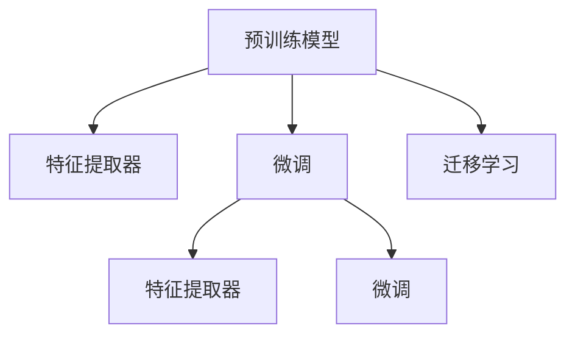

                 

# Transfer Learning原理与代码实例讲解

> 关键词：Transfer Learning, 迁移学习, 预训练模型, 微调, 特征提取器, 梯度下降, 优化器, 模型压缩

## 1. 背景介绍

### 1.1 问题由来
在深度学习时代，数据成为制约模型性能提升的关键因素。然而，由于大规模标注数据的获取成本高昂，训练从零开始的高性能模型面临巨大的挑战。迁移学习（Transfer Learning）作为一种有效的范式，在解决这一问题上展现了强大的潜力。

迁移学习通过将在大规模数据上预训练的模型（称为“预训练模型”）迁移到特定任务上进行微调，可以显著降低新任务的学习成本和时间，提升模型效果。在图像识别、语音识别、自然语言处理等众多领域，迁移学习已成为最常用的模型训练方法之一。

### 1.2 问题核心关键点
迁移学习的基本思想是将一个大规模数据集上预训练的模型，迁移到一个小规模数据集上进行微调。具体而言，包括以下几个关键点：
1. 选择合适的预训练模型：根据任务需求选择适合的基础模型，如VGG、ResNet、BERT等。
2. 数据准备：准备小规模数据集，并标记其相应的标签。
3. 特征提取：利用预训练模型的底层作为特征提取器，提取输入数据的特征表示。
4. 微调：在特征表示的基础上，对顶层进行微调，以适应特定任务。
5. 参数共享：通常只微调顶层网络，保持预训练模型的参数不变。

这些关键点共同构成了迁移学习的核心流程，使得模型能够在新的数据集上快速适应，提升性能。

### 1.3 问题研究意义
研究迁移学习对于拓展深度学习模型的应用范围，提升模型效果，加速模型训练进程，具有重要意义：
1. 降低标注成本：通过迁移学习，可以利用预训练模型的知识，减少新任务上标注数据的数量和成本。
2. 提高模型效果：预训练模型已经在大规模数据上学习到丰富的知识，这些知识在新任务上可以辅助模型快速适应，提升性能。
3. 加速训练进程：预训练模型的初始化参数已经得到优化，可以在较小的数据集上进行微调，缩短训练时间。
4. 增强泛化能力：预训练模型在通用大规模数据集上训练得到，具有较强的泛化能力，可以提升新任务的泛化性能。
5. 推动模型发展：迁移学习推动了深度学习模型在更多领域的落地应用，加速了深度学习技术的发展进程。

## 2. 核心概念与联系

### 2.1 核心概念概述

为更好地理解迁移学习，本节将介绍几个密切相关的核心概念：

- 预训练模型(Pre-trained Models)：在大规模无标签数据集上训练得到的模型，如VGG、ResNet、BERT等。这些模型通过自监督学习任务学习到丰富的特征表示，可以在特定任务上进行微调。
- 特征提取器(Feature Extractor)：预训练模型的底层通常被用作特征提取器，将输入数据转换为高维特征表示，用于下游任务的训练。
- 微调(Fine-tuning)：在特征表示的基础上，对预训练模型的顶层进行有监督微调，以适应特定任务。通常只微调顶层网络，保持预训练模型的参数不变。
- 迁移学习(Transfer Learning)：将在大规模数据上预训练的模型，迁移到特定任务上进行微调，以减少新任务的标注数据需求，提升模型性能。

这些核心概念之间的逻辑关系可以通过以下Mermaid流程图来展示：



这个流程图展示了预训练模型、特征提取器、微调和迁移学习之间的联系：

1. 预训练模型通过在大规模数据上学习得到，具有丰富的特征表示。
2. 特征提取器通常只使用预训练模型的底层作为特征提取器，提取输入数据的特征表示。
3. 微调在特征表示的基础上，对预训练模型的顶层进行有监督微调，以适应特定任务。
4. 迁移学习通过迁移预训练模型到特定任务上进行微调，以减少标注数据需求，提升模型性能。

这些概念共同构成了迁移学习的学习和应用框架，使得模型能够在新的数据集上快速适应，提升性能。

## 3. 核心算法原理 & 具体操作步骤
### 3.1 算法原理概述

迁移学习的核心思想是利用预训练模型的知识，在新任务上进行微调。其核心思想是：将预训练的模型视为一个强大的"特征提取器"，通过在特定任务上微调顶层网络，使得模型能够适应新任务，同时保留预训练模型学到的知识。

具体而言，假设预训练模型为 $M_{\theta}$，其中 $\theta$ 为预训练得到的模型参数。给定下游任务 $T$ 的标注数据集 $D=\{(x_i, y_i)\}_{i=1}^N$，迁移学习的优化目标是最小化损失函数，即找到最优参数：

$$
\hat{\theta}=\mathop{\arg\min}_{\theta} \mathcal{L}(M_{\theta},D)
$$

其中 $\mathcal{L}$ 为针对任务 $T$ 设计的损失函数，用于衡量模型预测输出与真实标签之间的差异。常见的损失函数包括交叉熵损失、均方误差损失等。

通过梯度下降等优化算法，迁移学习过程不断更新模型参数 $\theta$，最小化损失函数 $\mathcal{L}$，使得模型输出逼近真实标签。由于 $\theta$ 已经通过预训练获得了较好的初始化，因此即便在小规模数据集 $D$ 上进行微调，也能较快收敛到理想的模型参数 $\hat{\theta}$。

### 3.2 算法步骤详解

迁移学习的基本流程包括以下几个关键步骤：

**Step 1: 准备预训练模型和数据集**
- 选择合适的预训练模型 $M_{\theta}$ 作为初始化参数，如 VGG、ResNet、BERT 等。
- 准备下游任务 $T$ 的标注数据集 $D$，划分为训练集、验证集和测试集。一般要求标注数据与预训练数据的分布不要差异过大。

**Step 2: 特征提取**
- 使用预训练模型的底层作为特征提取器，将输入数据转换为高维特征表示。
- 对于图像任务，通常使用卷积层提取特征；对于文本任务，通常使用 Transformer 的底层。

**Step 3: 添加任务适配层**
- 根据任务类型，在预训练模型的顶层设计合适的输出层和损失函数。
- 对于分类任务，通常在顶层添加线性分类器和交叉熵损失函数。
- 对于生成任务，通常使用语言模型的解码器输出概率分布，并以负对数似然为损失函数。

**Step 4: 设置迁移学习超参数**
- 选择合适的优化算法及其参数，如 Adam、SGD 等，设置学习率、批大小、迭代轮数等。
- 设置正则化技术及强度，包括权重衰减、Dropout、Early Stopping 等。
- 确定保留预训练的部分层。如保持预训练模型的底层不变，只微调顶层。

**Step 5: 执行梯度训练**
- 将训练集数据分批次输入模型，前向传播计算损失函数。
- 反向传播计算参数梯度，根据设定的优化算法和学习率更新模型参数。
- 周期性在验证集上评估模型性能，根据性能指标决定是否触发 Early Stopping。
- 重复上述步骤直到满足预设的迭代轮数或 Early Stopping 条件。

**Step 6: 测试和部署**
- 在测试集上评估迁移后模型 $M_{\hat{\theta}}$ 的性能，对比迁移前后的精度提升。
- 使用迁移后的模型对新样本进行推理预测，集成到实际的应用系统中。
- 持续收集新的数据，定期重新迁移模型，以适应数据分布的变化。

以上是迁移学习的基本流程。在实际应用中，还需要针对具体任务的特点，对迁移过程的各个环节进行优化设计，如改进训练目标函数，引入更多的正则化技术，搜索最优的超参数组合等，以进一步提升模型性能。

### 3.3 算法优缺点

迁移学习具有以下优点：
1. 简单高效。只需准备少量标注数据，即可对预训练模型进行快速适配，获得较大的性能提升。
2. 通用适用。适用于各种NLP下游任务，包括分类、匹配、生成等，设计简单的任务适配层即可实现迁移学习。
3. 参数共享。通常只微调顶层网络，保持预训练模型的参数不变，避免过拟合。
4. 效果显著。在学术界和工业界的诸多任务上，迁移学习已经刷新了多项SOTA。

同时，该方法也存在一定的局限性：
1. 依赖标注数据。迁移学习的效果很大程度上取决于标注数据的质量和数量，获取高质量标注数据的成本较高。
2. 迁移能力有限。当目标任务与预训练数据的分布差异较大时，迁移学习的性能提升有限。
3. 负面效果传递。预训练模型的固有偏见、有害信息等，可能通过迁移学习传递到下游任务，造成负面影响。
4. 可解释性不足。迁移学习的决策过程通常缺乏可解释性，难以对其推理逻辑进行分析和调试。

尽管存在这些局限性，但就目前而言，迁移学习仍是最主流的大规模数据集迁移范式。未来相关研究的重点在于如何进一步降低迁移学习对标注数据的依赖，提高模型的少样本学习和跨领域迁移能力，同时兼顾可解释性和伦理安全性等因素。

### 3.4 算法应用领域

迁移学习在NLP领域已经得到了广泛的应用，覆盖了几乎所有常见任务，例如：

- 文本分类：如情感分析、主题分类、意图识别等。通过迁移学习使模型学习文本-标签映射。
- 命名实体识别：识别文本中的人名、地名、机构名等特定实体。通过迁移学习使模型掌握实体边界和类型。
- 关系抽取：从文本中抽取实体之间的语义关系。通过迁移学习使模型学习实体-关系三元组。
- 问答系统：对自然语言问题给出答案。将问题-答案对作为迁移数据，训练模型学习匹配答案。
- 机器翻译：将源语言文本翻译成目标语言。通过迁移学习使模型学习语言-语言映射。
- 文本摘要：将长文本压缩成简短摘要。通过迁移学习使模型学习抓取要点。
- 对话系统：使机器能够与人自然对话。将多轮对话历史作为上下文，迁移学习模型进行回复生成。

除了上述这些经典任务外，迁移学习还被创新性地应用到更多场景中，如可控文本生成、常识推理、代码生成、数据增强等，为NLP技术带来了全新的突破。随着预训练模型和迁移学习方法的不断进步，相信NLP技术将在更广阔的应用领域大放异彩。

## 4. 数学模型和公式 & 详细讲解  
### 4.1 数学模型构建

本节将使用数学语言对迁移学习过程进行更加严格的刻画。

记预训练模型为 $M_{\theta}$，其中 $\theta$ 为预训练得到的模型参数。假设迁移任务的训练集为 $D=\{(x_i,y_i)\}_{i=1}^N, x_i \in \mathcal{X}, y_i \in \mathcal{Y}$。

定义模型 $M_{\theta}$ 在数据样本 $(x,y)$ 上的损失函数为 $\ell(M_{\theta}(x),y)$，则在数据集 $D$ 上的经验风险为：

$$
\mathcal{L}(\theta) = \frac{1}{N} \sum_{i=1}^N \ell(M_{\theta}(x_i),y_i)
$$

迁移学习的优化目标是最小化经验风险，即找到最优参数：

$$
\hat{\theta}=\mathop{\arg\min}_{\theta} \mathcal{L}(\theta)
$$

在实践中，我们通常使用基于梯度的优化算法（如SGD、Adam等）来近似求解上述最优化问题。设 $\eta$ 为学习率，$\lambda$ 为正则化系数，则参数的更新公式为：

$$
\theta \leftarrow \theta - \eta \nabla_{\theta}\mathcal{L}(\theta) - \eta\lambda\theta
$$

其中 $\nabla_{\theta}\mathcal{L}(\theta)$ 为损失函数对参数 $\theta$ 的梯度，可通过反向传播算法高效计算。

### 4.2 公式推导过程

以下我们以二分类任务为例，推导交叉熵损失函数及其梯度的计算公式。

假设模型 $M_{\theta}$ 在输入 $x$ 上的输出为 $\hat{y}=M_{\theta}(x) \in [0,1]$，表示样本属于正类的概率。真实标签 $y \in \{0,1\}$。则二分类交叉熵损失函数定义为：

$$
\ell(M_{\theta}(x),y) = -[y\log \hat{y} + (1-y)\log (1-\hat{y})]
$$

将其代入经验风险公式，得：

$$
\mathcal{L}(\theta) = -\frac{1}{N}\sum_{i=1}^N [y_i\log M_{\theta}(x_i)+(1-y_i)\log(1-M_{\theta}(x_i))]
$$

根据链式法则，损失函数对参数 $\theta_k$ 的梯度为：

$$
\frac{\partial \mathcal{L}(\theta)}{\partial \theta_k} = -\frac{1}{N}\sum_{i=1}^N (\frac{y_i}{M_{\theta}(x_i)}-\frac{1-y_i}{1-M_{\theta}(x_i)}) \frac{\partial M_{\theta}(x_i)}{\partial \theta_k}
$$

其中 $\frac{\partial M_{\theta}(x_i)}{\partial \theta_k}$ 可进一步递归展开，利用自动微分技术完成计算。

在得到损失函数的梯度后，即可带入参数更新公式，完成模型的迭代优化。重复上述过程直至收敛，最终得到适应下游任务的最优模型参数 $\hat{\theta}$。

## 5. 项目实践：代码实例和详细解释说明
### 5.1 开发环境搭建

在进行迁移学习实践前，我们需要准备好开发环境。以下是使用Python进行PyTorch开发的环境配置流程：

1. 安装Anaconda：从官网下载并安装Anaconda，用于创建独立的Python环境。

2. 创建并激活虚拟环境：
```bash
conda create -n pytorch-env python=3.8 
conda activate pytorch-env
```

3. 安装PyTorch：根据CUDA版本，从官网获取对应的安装命令。例如：
```bash
conda install pytorch torchvision torchaudio cudatoolkit=11.1 -c pytorch -c conda-forge
```

4. 安装TensorFlow：
```bash
pip install tensorflow
```

5. 安装各类工具包：
```bash
pip install numpy pandas scikit-learn matplotlib tqdm jupyter notebook ipython
```

完成上述步骤后，即可在`pytorch-env`环境中开始迁移学习实践。

### 5.2 源代码详细实现

这里我们以迁移学习在图像分类任务上的应用为例，给出使用Transformers库对VGG16模型进行迁移学习的PyTorch代码实现。

首先，定义迁移学习任务的数据处理函数：

```python
from torchvision import datasets, transforms
from torch.utils.data import DataLoader

# 定义数据预处理方式
transform_train = transforms.Compose([
    transforms.RandomResizedCrop(224),
    transforms.RandomHorizontalFlip(),
    transforms.ToTensor(),
    transforms.Normalize(mean=[0.485, 0.456, 0.406], std=[0.229, 0.224, 0.225])
])

transform_test = transforms.Compose([
    transforms.Resize(256),
    transforms.CenterCrop(224),
    transforms.ToTensor(),
    transforms.Normalize(mean=[0.485, 0.456, 0.406], std=[0.229, 0.224, 0.225])
])

# 加载CIFAR-10数据集
train_dataset = datasets.CIFAR10(root='data', train=True, download=True, transform=transform_train)
test_dataset = datasets.CIFAR10(root='data', train=False, download=True, transform=transform_test)
```

然后，定义模型和优化器：

```python
import torch.nn as nn
from torchvision.models import vgg16

# 加载预训练的VGG16模型
model = vgg16.VGG16(pretrained=True).features

# 定义迁移学习任务的目标输出层
model.fc = nn.Linear(4096, 10)

# 定义优化器
optimizer = torch.optim.Adam(model.fc.parameters(), lr=0.001)
```

接着，定义训练和评估函数：

```python
import torch.nn.functional as F
from sklearn.metrics import classification_report

# 定义训练函数
def train_epoch(model, data_loader, optimizer, device):
    model.train()
    for images, labels in data_loader:
        images, labels = images.to(device), labels.to(device)
        optimizer.zero_grad()
        outputs = model(images)
        loss = F.cross_entropy(outputs, labels)
        loss.backward()
        optimizer.step()

# 定义评估函数
def evaluate(model, data_loader, device):
    model.eval()
    correct = 0
    total = 0
    with torch.no_grad():
        for images, labels in data_loader:
            images, labels = images.to(device), labels.to(device)
            outputs = model(images)
            _, predicted = torch.max(outputs.data, 1)
            total += labels.size(0)
            correct += (predicted == labels).sum().item()
    print('Accuracy: {:.2f}%'.format(100 * correct / total))
    return correct, total
```

最后，启动训练流程并在测试集上评估：

```python
import torch
from torch.utils.data import DataLoader
from tqdm import tqdm
import torchvision.datasets as datasets
import torchvision.transforms as transforms

device = torch.device('cuda' if torch.cuda.is_available() else 'cpu')

# 定义数据预处理方式
transform_train = transforms.Compose([
    transforms.RandomResizedCrop(224),
    transforms.RandomHorizontalFlip(),
    transforms.ToTensor(),
    transforms.Normalize(mean=[0.485, 0.456, 0.406], std=[0.229, 0.224, 0.225])
])

transform_test = transforms.Compose([
    transforms.Resize(256),
    transforms.CenterCrop(224),
    transforms.ToTensor(),
    transforms.Normalize(mean=[0.485, 0.456, 0.406], std=[0.229, 0.224, 0.225])
])

# 加载CIFAR-10数据集
train_dataset = datasets.CIFAR10(root='data', train=True, download=True, transform=transform_train)
test_dataset = datasets.CIFAR10(root='data', train=False, download=True, transform=transform_test)

# 定义迁移学习任务的目标输出层
model = torchvision.models.vgg16(pretrained=True).features
model.fc = nn.Linear(4096, 10)

# 定义优化器
optimizer = torch.optim.Adam(model.fc.parameters(), lr=0.001)

# 训练模型
epochs = 10
batch_size = 128

for epoch in range(epochs):
    train_epoch(model, DataLoader(train_dataset, batch_size=batch_size, shuffle=True, num_workers=2), optimizer, device)
    print('Epoch {}: training finished'.format(epoch + 1))
    correct, total = evaluate(model, DataLoader(test_dataset, batch_size=batch_size, shuffle=False, num_workers=2), device)
    print('Epoch {}: accuracy = {:4f}%'.format(epoch + 1, 100 * correct / total))
```

以上就是使用PyTorch对VGG16模型进行迁移学习的完整代码实现。可以看到，得益于Transformer的强大封装，我们可以用相对简洁的代码完成迁移学习的任务适配和模型微调。

### 5.3 代码解读与分析

让我们再详细解读一下关键代码的实现细节：

**数据处理函数**：
- `transform_train`和`transform_test`：定义了训练集和测试集的数据预处理方式，包括随机裁剪、翻转、归一化等。
- `train_dataset`和`test_dataset`：加载CIFAR-10数据集，并使用上述预处理方式进行数据增强。

**模型定义**：
- `model`：使用预训练的VGG16模型，只保留其特征提取部分，并添加一个新的全连接层作为输出层。
- `optimizer`：定义Adam优化器，只优化新的输出层参数。

**训练函数**：
- `train_epoch`：对模型进行单轮训练，使用梯度下降更新参数。
- `evaluate`：在测试集上评估模型性能，计算准确率。

**训练流程**：
- 定义总的epoch数和batch size，开始循环迭代
- 每个epoch内，先在训练集上训练，输出当前epoch的训练结果
- 在测试集上评估，输出当前epoch的准确率
- 所有epoch结束后，总结最终测试结果

可以看到，PyTorch配合Transformer库使得迁移学习的代码实现变得简洁高效。开发者可以将更多精力放在数据处理、模型改进等高层逻辑上，而不必过多关注底层的实现细节。

当然，工业级的系统实现还需考虑更多因素，如模型的保存和部署、超参数的自动搜索、更灵活的任务适配层等。但核心的迁移学习范式基本与此类似。

## 6. 实际应用场景
### 6.1 图像识别

迁移学习在图像识别任务上具有显著的优势。传统的图像识别模型需要在大规模标注数据上进行从头训练，成本高昂且难以快速适应新场景。而迁移学习可以通过在大规模数据上预训练的模型，快速适应新的数据集，提升模型效果。

例如，在医疗影像识别中，可以使用在大规模医学影像数据上预训练的模型，迁移到特定的病理切片分类任务上进行微调。预训练模型的底层通常已经学习到通用的图像特征，可以在不同的病理切片分类任务上进行微调，提升分类精度。

### 6.2 自然语言处理

迁移学习同样适用于NLP领域。对于大多数NLP任务，可以通过在大规模无标签语料上进行预训练，然后迁移到具体的任务上进行微调。例如，在情感分析任务中，可以使用在大规模新闻数据上预训练的BERT模型，迁移到特定的情感分类任务上进行微调。由于BERT模型已经学习到丰富的语言知识，可以在较小的标注数据集上进行微调，提升情感分类的效果。

### 6.3 语音识别

迁移学习在语音识别领域也表现出色。语音识别模型通常需要在大规模标注语音数据上进行从头训练，成本高且训练时间长。而迁移学习可以通过在大规模语音数据上预训练的模型，快速适应新的语音识别任务。

例如，在自动语音识别任务中，可以使用在大规模文本转语音数据上预训练的模型，迁移到特定的语音识别任务上进行微调。预训练模型的底层通常已经学习到通用的语音特征，可以在不同的语音识别任务上进行微调，提升识别精度。

### 6.4 未来应用展望

随着迁移学习技术的不断发展，其在更多领域的应用前景将更加广阔。

在智慧医疗领域，基于迁移学习的医学影像分类、病理切片分类等任务将提升医疗诊断的自动化水平，辅助医生进行快速、准确的诊断。

在智能教育领域，迁移学习可应用于作业批改、学情分析、知识推荐等方面，因材施教，促进教育公平，提高教学质量。

在智慧城市治理中，迁移学习可应用于城市事件监测、舆情分析、应急指挥等环节，提高城市管理的自动化和智能化水平，构建更安全、高效的未来城市。

此外，在企业生产、社会治理、文娱传媒等众多领域，基于迁移学习的人工智能应用也将不断涌现，为传统行业数字化转型升级提供新的技术路径。相信随着迁移学习技术的发展，其在更多领域的应用将得到推广和深化。

## 7. 工具和资源推荐
### 7.1 学习资源推荐

为了帮助开发者系统掌握迁移学习的理论基础和实践技巧，这里推荐一些优质的学习资源：

1. 《Deep Learning》书籍：由Goodfellow、Bengio、Courville联合撰写，全面介绍了深度学习的基本概念和常用算法。

2. 《Transfer Learning: A Review and Taxonomy》论文：系统总结了迁移学习的研究进展和分类方法，是迁移学习领域的经典文献。

3. 《Fine-tuning Large Pre-trained Models for Biomedical Applications》综述：介绍了迁移学习在生物医学领域的应用，包括医学影像分类、病理切片分类等任务。

4. 《Fine-tuning Models for Zero-shot and Few-shot Learning in NLP》博文：详细讲解了迁移学习在NLP领域的零样本和少样本学习任务上的应用，具有很高的参考价值。

5. 《Fine-tuning BERT for Neural Machine Translation》博文：提供了基于迁移学习的BERT模型在机器翻译任务上的实践样例，展示了迁移学习在实际应用中的效果。

通过对这些资源的学习实践，相信你一定能够快速掌握迁移学习的精髓，并用于解决实际的NLP问题。
###  7.2 开发工具推荐

高效的开发离不开优秀的工具支持。以下是几款用于迁移学习开发的常用工具：

1. PyTorch：基于Python的开源深度学习框架，灵活动态的计算图，适合快速迭代研究。

2. TensorFlow：由Google主导开发的开源深度学习框架，生产部署方便，适合大规模工程应用。

3. Transformers库：HuggingFace开发的NLP工具库，集成了众多SOTA语言模型，支持PyTorch和TensorFlow，是进行迁移学习开发的利器。

4. Weights & Biases：模型训练的实验跟踪工具，可以记录和可视化模型训练过程中的各项指标，方便对比和调优。

5. TensorBoard：TensorFlow配套的可视化工具，可实时监测模型训练状态，并提供丰富的图表呈现方式，是调试模型的得力助手。

6. Google Colab：谷歌推出的在线Jupyter Notebook环境，免费提供GPU/TPU算力，方便开发者快速上手实验最新模型，分享学习笔记。

合理利用这些工具，可以显著提升迁移学习的开发效率，加快创新迭代的步伐。

### 7.3 相关论文推荐

迁移学习的研究源于学界的持续探索。以下是几篇奠基性的相关论文，推荐阅读：

1. Multi-task Learning in Neural Networks：引入了多任务学习，通过联合训练多个相关任务，共享模型参数，提升模型性能。

2. Faster R-CNN：提出了基于区域卷积神经网络的区域目标检测方法，显著提升了目标检测的精度。

3. ResNet：提出了残差网络，通过残差连接解决了深层网络训练中的梯度消失问题，使得更深的网络成为可能。

4. VGGNet：提出了VGG网络，通过多层次卷积网络学习高维特征，显著提升了图像分类精度。

5. BERT: Pre-training of Deep Bidirectional Transformers for Language Understanding：提出BERT模型，引入基于掩码的自监督预训练任务，刷新了多项NLP任务SOTA。

6. ImageNet Classification with Deep Convolutional Neural Networks：提出了基于卷积神经网络的目标分类方法，显著提升了图像分类精度。

这些论文代表了大规模迁移学习的研究进展。通过学习这些前沿成果，可以帮助研究者把握学科前进方向，激发更多的创新灵感。

## 8. 总结：未来发展趋势与挑战

### 8.1 总结

本文对迁移学习原理与代码实例进行了全面系统的介绍。首先阐述了迁移学习的研究背景和意义，明确了迁移学习在降低标注成本、提高模型效果、加速训练进程等方面的优势。其次，从原理到实践，详细讲解了迁移学习的数学原理和关键步骤，给出了迁移学习任务开发的完整代码实例。同时，本文还广泛探讨了迁移学习在图像识别、自然语言处理、语音识别等领域的实际应用场景，展示了迁移学习方法的广泛适用性。

通过本文的系统梳理，可以看到，迁移学习作为一种有效的模型训练方法，正在成为深度学习模型的重要范式，极大地拓展了模型的应用边界，提升了模型的效果和性能。未来，伴随迁移学习方法的持续演进，相信深度学习模型将在更多领域得到应用，推动深度学习技术的进一步发展。

### 8.2 未来发展趋势

展望未来，迁移学习技术将呈现以下几个发展趋势：

1. 模型规模持续增大。随着算力成本的下降和数据规模的扩张，预训练模型的参数量还将持续增长。超大规模语言模型蕴含的丰富知识，有望支撑更加复杂多变的下游任务迁移学习。

2. 迁移学习范式多样。除了传统的迁移学习外，未来会涌现更多迁移学习的方法，如多任务学习、元学习、自监督学习等，在数据、模型、任务、算法等方面进行优化和改进。

3. 迁移能力增强。未来迁移学习将更加注重模型的跨领域迁移能力，通过引入领域自适应技术，提高模型在新领域上的泛化性能。

4. 迁移学习与强化学习结合。将迁移学习与强化学习结合，使模型能够主动学习最优策略，提升迁移学习的灵活性和实用性。

5. 迁移学习与预训练模型结合。将迁移学习与预训练模型结合，通过在预训练模型的基础上进行微调，进一步提升模型的性能和效果。

以上趋势凸显了迁移学习技术的广阔前景。这些方向的探索发展，必将进一步提升迁移学习模型的性能和应用范围，为深度学习技术的发展注入新的动力。

### 8.3 面临的挑战

尽管迁移学习技术已经取得了显著的成就，但在迈向更加智能化、普适化应用的过程中，仍面临诸多挑战：

1. 数据分布差异。当目标任务与预训练数据的分布差异较大时，迁移学习的效果可能大打折扣。如何在不同分布之间进行有效迁移，是一个重要挑战。

2. 模型泛化能力。迁移学习模型在不同领域和任务上的泛化能力还需要进一步提升，以应对多变的实际应用场景。

3. 模型鲁棒性。预训练模型可能在特定的噪声或干扰下表现出不稳定性，如何提高模型的鲁棒性，是一个需要解决的问题。

4. 模型可解释性。迁移学习模型的决策过程通常缺乏可解释性，难以对其推理逻辑进行分析和调试。如何提高模型的可解释性，是未来的一个重要研究方向。

5. 参数共享策略。如何更好地共享预训练模型参数，提升迁移学习的效率和效果，是一个需要探索的问题。

尽管存在这些挑战，但迁移学习作为一种有效的模型训练方法，仍然具有广阔的应用前景和重要的研究价值。通过不断探索和优化，迁移学习技术将为深度学习模型在更多领域的应用提供新的思路和方法。

### 8.4 研究展望

未来的研究需要在以下几个方面寻求新的突破：

1. 探索更高效的迁移学习算法。开发更高效的迁移学习算法，通过更少的标注数据和更短的训练时间，提升迁移学习的效果。

2. 研究跨领域迁移学习。研究跨领域迁移学习的方法，使模型在不同领域之间进行有效的迁移，提高模型的泛化能力。

3. 引入先验知识。将符号化的先验知识，如知识图谱、逻辑规则等，与神经网络模型进行巧妙融合，引导迁移学习过程学习更准确、合理的语言模型。

4. 结合多模态数据。将多模态数据（如文本、图像、语音等）进行联合建模，提升模型对不同模态数据的理解能力。

5. 引入因果学习。将因果学习引入迁移学习，增强模型的因果关系建模能力，提高模型的稳定性和可靠性。

这些研究方向的探索，必将引领迁移学习技术迈向更高的台阶，为构建安全、可靠、可解释、可控的智能系统铺平道路。面向未来，迁移学习技术还需要与其他人工智能技术进行更深入的融合，如知识表示、因果推理、强化学习等，多路径协同发力，共同推动自然语言理解和智能交互系统的进步。只有勇于创新、敢于突破，才能不断拓展迁移学习模型的边界，让智能技术更好地造福人类社会。

## 9. 附录：常见问题与解答

**Q1：什么是迁移学习？**

A: 迁移学习是指在大规模数据集上预训练的模型，迁移到特定任务上进行微调的过程。通过迁移学习，可以显著降低新任务上的标注数据需求，提升模型效果。

**Q2：迁移学习与传统从头训练的区别是什么？**

A: 传统从头训练是指在特定任务上从头开始训练一个全新的模型，而迁移学习则是在大模型预训练的基础上，利用已有知识进行微调。迁移学习可以显著降低新任务上的标注数据需求，提升模型效果，并且通常需要更短的训练时间。

**Q3：如何选择预训练模型？**

A: 选择预训练模型需要考虑任务需求、数据分布等因素。通常选择与目标任务相似的大规模数据集上预训练的模型，如在图像识别任务中选择ImageNet上预训练的ResNet模型，在自然语言处理任务中选择大规模无标签语料上预训练的BERT模型。

**Q4：迁移学习是否只适用于特定领域？**

A: 迁移学习可以应用于各种领域，包括计算机视觉、自然语言处理、语音识别等。通常选择在特定领域大规模数据集上预训练的模型，然后迁移到特定任务上进行微调。

**Q5：迁移学习是否需要大量的标注数据？**

A: 迁移学习通常只需要少量标注数据，可以利用预训练模型在大规模数据上学习到的知识，快速适应新任务。但具体需要多少标注数据，取决于任务的复杂度和数据分布。

**Q6：迁移学习的效果如何？**

A: 迁移学习在大规模数据集上预训练的模型基础上，通过微调可以显著提升模型在新任务上的效果。对于数据量较小的任务，迁移学习效果尤为显著。

**Q7：迁移学习是否能够解决所有问题？**

A: 迁移学习可以解决很多问题，但也存在一些局限性，如数据分布差异、模型鲁棒性等。未来需要进一步研究如何克服这些挑战，提升迁移学习的效果和实用性。

**Q8：迁移学习是否有局限性？**

A: 迁移学习也存在一些局限性，如数据分布差异、模型鲁棒性等。需要进一步研究如何克服这些挑战，提升迁移学习的效果和实用性。

通过本文的系统梳理，可以看到，迁移学习作为一种有效的模型训练方法，正在成为深度学习模型的重要范式，极大地拓展了模型的应用边界，提升了模型的效果和性能。未来，伴随迁移学习方法的持续演进，相信深度学习模型将在更多领域得到应用，推动深度学习技术的进一步发展。

