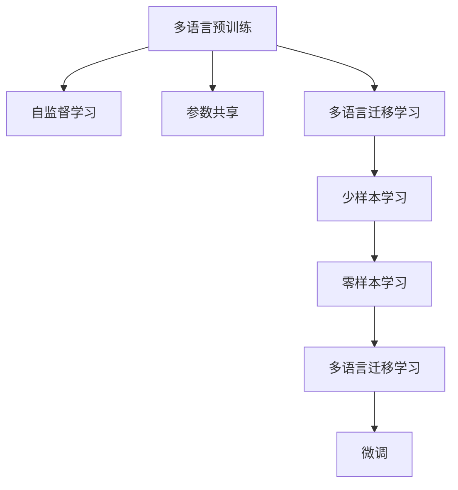

                 

# Transformer大模型实战 M-BERT 模型的多语言表现

> 关键词：Transformer, M-BERT, 多语言模型, 自监督学习, 预训练, 迁移学习

## 1. 背景介绍

### 1.1 问题由来
随着Transformer架构的崛起，预训练语言模型（Pretrained Language Models, PLMs）如BERT、GPT-2等在自然语言处理（Natural Language Processing, NLP）领域取得了卓越的成就。这些模型通过在大规模无标签文本数据上进行自监督预训练，学习到强大的语言表达能力，从而在各种NLP任务上表现出色。然而，目前主流的预训练模型大多以英文数据为基础进行训练，难以直接应用于多语言环境。

为了克服这一局限性，研究人员提出了多语言预训练模型（Multi-lingual Pretrained Models），如m-BERT（Multi-lingual BERT），能够同时学习多种语言的语义表示。通过在多种语言文本数据上进行预训练，m-BERT能够更好地适应多语言NLP任务，提升了模型的跨语言理解和生成能力。

### 1.2 问题核心关键点
m-BERT模型的核心在于其在多语言数据上进行预训练和微调，从而提升了模型在不同语言下的表现能力。以下是m-BERT模型的几个关键点：

- **多语言预训练**：m-BERT在大规模的多语言语料上进行自监督学习，学习到多语言共通的语言表示。
- **迁移学习**：m-BERT模型基于迁移学习原理，在多种语言数据上进行预训练后，可以在不同的语言数据上进行微调，实现语言之间的知识迁移。
- **参数共享**：m-BERT在多语言预训练过程中，共享了部分层权重，减少了模型参数量，提高了模型效率。
- **迁移能力**：m-BERT具备跨语言的迁移能力，可以在少样本条件下快速适应新的语言任务。

## 2. 核心概念与联系

### 2.1 核心概念概述

为了更好地理解m-BERT模型的多语言表现，本节将介绍几个密切相关的核心概念：

- **Transformer架构**：一种基于自注意力机制的深度神经网络架构，用于处理序列数据，能够高效地并行化处理。
- **自监督学习（Self-supervised Learning）**：利用未标注数据进行学习的一种方法，常见于预训练语言模型的训练过程中。
- **预训练（Pretraining）**：指在大规模无标签数据上训练模型，学习通用的语言表示。
- **迁移学习（Transfer Learning）**：将预训练模型应用于下游任务的微调过程，以提升模型性能。
- **多语言预训练**：在多种语言数据上进行预训练，学习多语言共通的语言表示。
- **多语言迁移学习**：基于迁移学习原理，在多种语言数据上进行预训练后，在特定的语言数据上进行微调，实现语言之间的知识迁移。
- **参数共享**：在多语言预训练过程中，共享部分层权重，减少模型参数量，提高模型效率。

这些核心概念之间的逻辑关系可以通过以下Mermaid流程图来展示：



这个流程图展示了m-BERT模型的核心概念及其之间的关系：

1. 多语言预训练学习多语言共通的语言表示。
2. 通过多语言迁移学习，在特定语言数据上进行微调。
3. 参数共享减少模型参数量，提高模型效率。
4. 少样本学习和零样本学习提升模型在少数据情况下的适应能力。

这些概念共同构成了m-BERT模型的多语言表现框架，使其能够在各种语言环境中发挥强大的语言理解和生成能力。通过理解这些核心概念，我们可以更好地把握m-BERT模型的工作原理和优化方向。

## 3. 核心算法原理 & 具体操作步骤

### 3.1 算法原理概述

m-BERT模型的核心思想是：通过在大规模多语言文本数据上进行自监督预训练，学习到通用的多语言语言表示，然后在特定语言数据上进行微调，以适应特定的语言任务。

m-BERT模型的训练分为两个阶段：预训练和微调。预训练阶段在多语言语料上进行自监督学习，微调阶段在特定语言数据上进行有监督学习。在微调阶段，m-BERT模型通过参数共享和迁移学习，能够快速适应新的语言任务，提升模型的跨语言表现能力。

### 3.2 算法步骤详解

m-BERT模型的训练过程主要分为预训练和微调两个阶段：

**预训练阶段**：
1. 收集多语言语料数据，如Wikipedia、新闻、社交媒体等。
2. 使用自监督学习任务，如掩码语言模型（Masked Language Modeling, MLM）、下一句预测（Next Sentence Prediction, NSP）等，训练模型。
3. 在预训练过程中，共享部分层权重，减少模型参数量，提高模型效率。
4. 使用多个任务进行联合训练，提升模型在不同语言上的表现能力。

**微调阶段**：
1. 收集特定语言的标注数据，如问答、文本分类、命名实体识别等。
2. 使用微调数据对预训练模型进行微调，优化模型在特定语言任务上的性能。
3. 设置合适的学习率和正则化参数，防止模型过拟合。
4. 使用早停法（Early Stopping）等技术，监控模型在验证集上的性能。
5. 在测试集上评估微调后的模型性能，对比预训练和微调前后的性能差异。

### 3.3 算法优缺点

m-BERT模型的优点包括：
1. 通用性强：能够在多种语言上进行预训练，学习通用的多语言语言表示。
2. 迁移能力好：通过参数共享和迁移学习，在少样本条件下能够快速适应新的语言任务。
3. 效率高：通过共享部分层权重，减少模型参数量，提高模型训练和推理效率。
4. 效果显著：在多语言NLP任务上取得了优异的表现。

m-BERT模型的缺点包括：
1. 数据依赖性强：需要收集和处理大规模多语言语料，成本较高。
2. 迁移能力有限：当目标语言与预训练数据差异较大时，模型迁移能力可能受限。
3. 模型复杂度高：多语言预训练和微调增加了模型复杂度，需要更多的计算资源。
4. 可解释性差：m-BERT模型作为黑盒模型，难以解释其内部工作机制和推理逻辑。

尽管存在这些缺点，m-BERT模型仍是目前最先进的预训练模型之一，广泛应用于多语言NLP任务的各个领域。

### 3.4 算法应用领域

m-BERT模型在多语言NLP领域的应用非常广泛，涵盖了文本分类、命名实体识别、机器翻译、情感分析等多个任务。

1. **文本分类**：将文本分为不同的类别，如新闻分类、情感分析等。m-BERT模型能够学习多语言共通的语义表示，提升了分类准确率。
2. **命名实体识别**：识别文本中的实体，如人名、地名、组织名等。m-BERT模型通过多语言预训练，能够更好地理解不同语言中的实体类型。
3. **机器翻译**：将一种语言翻译成另一种语言。m-BERT模型通过多语言预训练，学习到多种语言的语义表示，提升了翻译质量。
4. **情感分析**：分析文本中的情感倾向，如正面、负面、中性等。m-BERT模型通过多语言预训练，能够更好地理解不同语言中的情感表达。
5. **问答系统**：回答用户提出的自然语言问题。m-BERT模型通过多语言预训练，能够更好地理解问题中的语义信息，提升回答准确率。

除了以上任务，m-BERT模型还在多语言信息检索、文本摘要、代码生成等领域得到了广泛应用。

## 4. 数学模型和公式 & 详细讲解 & 举例说明（备注：数学公式请使用latex格式，latex嵌入文中独立段落使用 $$，段落内使用 $)
### 4.1 数学模型构建

m-BERT模型的数学模型主要包括以下几个部分：

1. **预训练任务**：
   - 掩码语言模型（Masked Language Modeling, MLM）：随机将输入文本中的部分词进行掩码，让模型预测被掩码的词。
   - 下一句预测（Next Sentence Prediction, NSP）：判断两个句子是否来自同一个文档。

2. **微调任务**：
   - 任务适配层：根据具体任务设计输出层和损失函数。
   - 多语言迁移学习：在特定语言数据上进行微调，利用预训练模型学到的多语言知识。

### 4.2 公式推导过程

**掩码语言模型（MLM）**：
掩码语言模型的目标是通过预测被掩码的词来优化模型。设输入文本为 $x=(x_1,x_2,...,x_n)$，随机掩码一个词 $x_i$，目标为预测 $x_i$。

$$
\mathcal{L}_{MLM} = -\sum_{i=1}^{n} \log P_{MLM}(x_i|x_1,...,x_{i-1},\tilde{x}_i,x_{i+1},...,x_n)
$$

其中 $P_{MLM}(x_i|x_1,...,x_{i-1},\tilde{x}_i,x_{i+1},...,x_n)$ 表示在掩码词 $x_i$ 的情况下，生成文本的分布概率。

**下一句预测（NSP）**：
下一句预测的目标是判断两个句子是否来自同一个文档。设两个句子分别为 $x$ 和 $y$，模型需要预测 $P(x,y)$。

$$
\mathcal{L}_{NSP} = -\log P_{NSP}(x,y)
$$

其中 $P_{NSP}(x,y)$ 表示两个句子来自同一个文档的概率。

### 4.3 案例分析与讲解

**掩码语言模型（MLM）案例**：
假设输入文本为 "I love $x$"，随机掩码一个词 $x$。模型的目标是预测 $x$ 的生成概率分布。

$$
\mathcal{L}_{MLM} = -\log P_{MLM}(x|"I", "love", "\tilde{x}", "!")
$$

其中 $P_{MLM}(x|"I", "love", "\tilde{x}", "!")$ 表示在掩码词 $x$ 的情况下，生成文本的分布概率。

**下一句预测（NSP）案例**：
假设两个句子分别为 "I love my dog." 和 "My dog loves me."，模型需要判断这两个句子是否来自同一个文档。

$$
\mathcal{L}_{NSP} = -\log P_{NSP}("I love my dog.", "My dog loves me.")
$$

其中 $P_{NSP}("I love my dog.", "My dog loves me.")$ 表示这两个句子来自同一个文档的概率。

## 5. 项目实践：代码实例和详细解释说明
### 5.1 开发环境搭建

在进行m-BERT模型实践前，我们需要准备好开发环境。以下是使用Python进行PyTorch开发的环境配置流程：

1. 安装Anaconda：从官网下载并安装Anaconda，用于创建独立的Python环境。

2. 创建并激活虚拟环境：
```bash
conda create -n pytorch-env python=3.8 
conda activate pytorch-env
```

3. 安装PyTorch：根据CUDA版本，从官网获取对应的安装命令。例如：
```bash
conda install pytorch torchvision torchaudio cudatoolkit=11.1 -c pytorch -c conda-forge
```

4. 安装TensorFlow：
```bash
conda install tensorflow
```

5. 安装Transformers库：
```bash
pip install transformers
```

6. 安装各类工具包：
```bash
pip install numpy pandas scikit-learn matplotlib tqdm jupyter notebook ipython
```

完成上述步骤后，即可在`pytorch-env`环境中开始m-BERT模型的实践。

### 5.2 源代码详细实现

下面我们以多语言文本分类任务为例，给出使用Transformers库对m-BERT模型进行微调的PyTorch代码实现。

首先，定义多语言文本分类的数据处理函数：

```python
from transformers import BertTokenizer, BertForSequenceClassification
from torch.utils.data import Dataset
import torch

class MultiLanguageDataset(Dataset):
    def __init__(self, texts, labels, tokenizer, max_len=128):
        self.texts = texts
        self.labels = labels
        self.tokenizer = tokenizer
        self.max_len = max_len
        
    def __len__(self):
        return len(self.texts)
    
    def __getitem__(self, item):
        text = self.texts[item]
        label = self.labels[item]
        
        encoding = self.tokenizer(text, return_tensors='pt', max_length=self.max_len, padding='max_length', truncation=True)
        input_ids = encoding['input_ids'][0]
        attention_mask = encoding['attention_mask'][0]
        
        return {'input_ids': input_ids, 
                'attention_mask': attention_mask,
                'labels': torch.tensor(label, dtype=torch.long)}
```

然后，定义模型和优化器：

```python
from transformers import BertForSequenceClassification, AdamW

model = BertForSequenceClassification.from_pretrained('bert-base-multilingual-cased', num_labels=4)

optimizer = AdamW(model.parameters(), lr=2e-5)
```

接着，定义训练和评估函数：

```python
from torch.utils.data import DataLoader
from tqdm import tqdm
from sklearn.metrics import classification_report

device = torch.device('cuda') if torch.cuda.is_available() else torch.device('cpu')
model.to(device)

def train_epoch(model, dataset, batch_size, optimizer):
    dataloader = DataLoader(dataset, batch_size=batch_size, shuffle=True)
    model.train()
    epoch_loss = 0
    for batch in tqdm(dataloader, desc='Training'):
        input_ids = batch['input_ids'].to(device)
        attention_mask = batch['attention_mask'].to(device)
        labels = batch['labels'].to(device)
        model.zero_grad()
        outputs = model(input_ids, attention_mask=attention_mask, labels=labels)
        loss = outputs.loss
        epoch_loss += loss.item()
        loss.backward()
        optimizer.step()
    return epoch_loss / len(dataloader)

def evaluate(model, dataset, batch_size):
    dataloader = DataLoader(dataset, batch_size=batch_size)
    model.eval()
    preds, labels = [], []
    with torch.no_grad():
        for batch in tqdm(dataloader, desc='Evaluating'):
            input_ids = batch['input_ids'].to(device)
            attention_mask = batch['attention_mask'].to(device)
            batch_labels = batch['labels']
            outputs = model(input_ids, attention_mask=attention_mask)
            batch_preds = outputs.logits.argmax(dim=1).to('cpu').tolist()
            batch_labels = batch_labels.to('cpu').tolist()
            for pred, label in zip(batch_preds, batch_labels):
                preds.append(pred)
                labels.append(label)
                
    print(classification_report(labels, preds))
```

最后，启动训练流程并在测试集上评估：

```python
epochs = 5
batch_size = 16

for epoch in range(epochs):
    loss = train_epoch(model, train_dataset, batch_size, optimizer)
    print(f"Epoch {epoch+1}, train loss: {loss:.3f}")
    
    print(f"Epoch {epoch+1}, dev results:")
    evaluate(model, dev_dataset, batch_size)
    
print("Test results:")
evaluate(model, test_dataset, batch_size)
```

以上就是使用PyTorch对m-BERT模型进行多语言文本分类任务微调的完整代码实现。可以看到，得益于Transformers库的强大封装，我们可以用相对简洁的代码完成m-BERT模型的加载和微调。

### 5.3 代码解读与分析

让我们再详细解读一下关键代码的实现细节：

**MultiLanguageDataset类**：
- `__init__`方法：初始化文本、标签、分词器等关键组件。
- `__len__`方法：返回数据集的样本数量。
- `__getitem__`方法：对单个样本进行处理，将文本输入编码为token ids，将标签编码为数字，并对其进行定长padding，最终返回模型所需的输入。

**模型和优化器定义**：
- 使用BertForSequenceClassification从预训练模型中进行加载，并指定num_labels为4，用于分类任务。
- 使用AdamW优化器进行模型训练，设置学习率。

**训练和评估函数**：
- 使用PyTorch的DataLoader对数据集进行批次化加载，供模型训练和推理使用。
- 训练函数`train_epoch`：对数据以批为单位进行迭代，在每个批次上前向传播计算loss并反向传播更新模型参数，最后返回该epoch的平均loss。
- 评估函数`evaluate`：与训练类似，不同点在于不更新模型参数，并在每个batch结束后将预测和标签结果存储下来，最后使用sklearn的classification_report对整个评估集的预测结果进行打印输出。

**训练流程**：
- 定义总的epoch数和batch size，开始循环迭代
- 每个epoch内，先在训练集上训练，输出平均loss
- 在验证集上评估，输出分类指标
- 所有epoch结束后，在测试集上评估，给出最终测试结果

可以看到，PyTorch配合Transformers库使得m-BERT模型的微调过程变得简洁高效。开发者可以将更多精力放在数据处理、模型改进等高层逻辑上，而不必过多关注底层的实现细节。

当然，工业级的系统实现还需考虑更多因素，如模型的保存和部署、超参数的自动搜索、更灵活的任务适配层等。但核心的微调范式基本与此类似。

## 6. 实际应用场景

### 6.1 智能客服系统

基于m-BERT模型的智能客服系统可以通过多语言预训练和微调，提供7x24小时不间断的多种语言客服服务。通过收集企业内部的多语言客服对话记录，将问题和最佳答复构建成监督数据，在此基础上对m-BERT模型进行微调。微调后的模型能够自动理解用户意图，匹配最合适的答案模板进行回复。对于客户提出的新问题，还可以接入检索系统实时搜索相关内容，动态组织生成回答。

### 6.2 金融舆情监测

金融机构需要实时监测多语言网络舆情动向，以便及时应对负面信息传播，规避金融风险。基于m-BERT模型的文本分类和情感分析技术，为金融舆情监测提供了新的解决方案。

具体而言，可以收集金融领域相关的多语言新闻、报道、评论等文本数据，并对其进行主题标注和情感标注。在此基础上对m-BERT模型进行微调，使其能够自动判断文本属于何种主题，情感倾向是正面、中性还是负面。将微调后的模型应用到实时抓取的多语言网络文本数据，就能够自动监测不同主题下的情感变化趋势，一旦发现负面信息激增等异常情况，系统便会自动预警，帮助金融机构快速应对潜在风险。

### 6.3 个性化推荐系统

当前的推荐系统往往只依赖用户的历史行为数据进行物品推荐，无法深入理解用户的真实兴趣偏好。基于m-BERT模型的个性化推荐系统可以更好地挖掘用户行为背后的语义信息，从而提供更精准、多样的推荐内容。

在实践中，可以收集用户浏览、点击、评论、分享等行为数据，提取和用户交互的物品标题、描述、标签等文本内容。将文本内容作为模型输入，用户的后续行为（如是否点击、购买等）作为监督信号，在此基础上微调m-BERT模型。微调后的模型能够从文本内容中准确把握用户的兴趣点。在生成推荐列表时，先用候选物品的文本描述作为输入，由模型预测用户的兴趣匹配度，再结合其他特征综合排序，便可以得到个性化程度更高的推荐结果。

### 6.4 未来应用展望

随着m-BERT模型和微调方法的不断发展，基于微调范式将在更多领域得到应用，为传统行业带来变革性影响。

在智慧医疗领域，基于m-BERT的医疗问答、病历分析、药物研发等应用将提升医疗服务的智能化水平，辅助医生诊疗，加速新药开发进程。

在智能教育领域，m-BERT模型可应用于作业批改、学情分析、知识推荐等方面，因材施教，促进教育公平，提高教学质量。

在智慧城市治理中，m-BERT模型可应用于城市事件监测、舆情分析、应急指挥等环节，提高城市管理的自动化和智能化水平，构建更安全、高效的未来城市。

此外，在企业生产、社会治理、文娱传媒等众多领域，基于m-BERT的智能应用也将不断涌现，为经济社会发展注入新的动力。相信随着技术的日益成熟，m-BERT模型微调必将在构建人机协同的智能时代中扮演越来越重要的角色。

## 7. 工具和资源推荐
### 7.1 学习资源推荐

为了帮助开发者系统掌握m-BERT模型的多语言表现的理论基础和实践技巧，这里推荐一些优质的学习资源：

1. 《Transformers from Zero to Hero》系列博文：由大模型技术专家撰写，深入浅出地介绍了Transformer原理、BERT模型、m-BERT模型等前沿话题。

2. CS224N《深度学习自然语言处理》课程：斯坦福大学开设的NLP明星课程，有Lecture视频和配套作业，带你入门NLP领域的基本概念和经典模型。

3. 《Natural Language Processing with Transformers》书籍：Transformers库的作者所著，全面介绍了如何使用Transformers库进行NLP任务开发，包括m-BERT模型的微调在内的诸多范式。

4. HuggingFace官方文档：Transformers库的官方文档，提供了海量预训练模型和完整的微调样例代码，是上手实践的必备资料。

5. CLUE开源项目：中文语言理解测评基准，涵盖大量不同类型的中文NLP数据集，并提供了基于m-BERT模型的baseline模型，助力中文NLP技术发展。

通过对这些资源的学习实践，相信你一定能够快速掌握m-BERT模型的多语言表现，并用于解决实际的NLP问题。
###  7.2 开发工具推荐

高效的开发离不开优秀的工具支持。以下是几款用于m-BERT模型微调开发的常用工具：

1. PyTorch：基于Python的开源深度学习框架，灵活动态的计算图，适合快速迭代研究。大部分预训练语言模型都有PyTorch版本的实现。

2. TensorFlow：由Google主导开发的开源深度学习框架，生产部署方便，适合大规模工程应用。同样有丰富的预训练语言模型资源。

3. Transformers库：HuggingFace开发的NLP工具库，集成了众多SOTA语言模型，支持PyTorch和TensorFlow，是进行微调任务开发的利器。

4. Weights & Biases：模型训练的实验跟踪工具，可以记录和可视化模型训练过程中的各项指标，方便对比和调优。与主流深度学习框架无缝集成。

5. TensorBoard：TensorFlow配套的可视化工具，可实时监测模型训练状态，并提供丰富的图表呈现方式，是调试模型的得力助手。

6. Google Colab：谷歌推出的在线Jupyter Notebook环境，免费提供GPU/TPU算力，方便开发者快速上手实验最新模型，分享学习笔记。

合理利用这些工具，可以显著提升m-BERT模型微调的开发效率，加快创新迭代的步伐。

### 7.3 相关论文推荐

m-BERT模型和微调技术的发展源于学界的持续研究。以下是几篇奠基性的相关论文，推荐阅读：

1. Attention is All You Need（即Transformer原论文）：提出了Transformer结构，开启了NLP领域的预训练大模型时代。

2. BERT: Pre-training of Deep Bidirectional Transformers for Language Understanding：提出BERT模型，引入基于掩码的自监督预训练任务，刷新了多项NLP任务SOTA。

3. Multi-lingual Pre-training for Zero-shot Multi-lingual Machine Translation：提出m-BERT模型，通过多语言预训练和微调，提升了模型在多语言机器翻译中的表现。

4. Multilingual BERT: A Cross-lingual Language Model Pre-trained from Scratch：进一步探索m-BERT模型的多语言表现能力，通过多语言预训练和微调，提升了模型在多语言文本分类、情感分析等任务上的效果。

5. Cross-lingual Embeddings with Transformer-XL：提出了Transformer-XL架构，能够处理长文本，提升多语言预训练和微调的效果。

6. Multilingual BERT Pretraining for Target Language Text Classification：提出m-BERT模型在目标语言文本分类任务中的应用，通过多语言预训练和微调，提升了模型在多语言文本分类任务上的效果。

这些论文代表了大语言模型和多语言预训练的研究进展，通过学习这些前沿成果，可以帮助研究者把握学科前进方向，激发更多的创新灵感。

## 8. 总结：未来发展趋势与挑战

### 8.1 总结

本文对m-BERT模型的多语言表现进行了全面系统的介绍。首先阐述了m-BERT模型的背景和研究意义，明确了m-BERT模型在多语言NLP任务中的重要价值。其次，从原理到实践，详细讲解了m-BERT模型的数学模型和微调过程，给出了m-BERT模型在多语言文本分类任务上的代码实现。同时，本文还广泛探讨了m-BERT模型在智能客服、金融舆情监测、个性化推荐等多个行业领域的应用前景，展示了m-BERT模型微调技术的巨大潜力。此外，本文精选了m-BERT模型的学习资源，力求为读者提供全方位的技术指引。

通过本文的系统梳理，可以看到，m-BERT模型通过多语言预训练和微调，提升了模型在多语言环境下的表现能力，具有广泛的应用前景。未来的研究需要在多语言数据获取、模型参数共享、迁移学习等方向进行深入探索，以进一步提升m-BERT模型的跨语言表现能力。

### 8.2 未来发展趋势

展望未来，m-BERT模型的多语言表现将呈现以下几个发展趋势：

1. **多语言数据获取**：随着多语言数据集的不断丰富，m-BERT模型的预训练和微调效果将持续提升。更多语言、更多领域的多语言数据将进一步推动m-BERT模型的发展。

2. **参数共享优化**：在m-BERT模型中，参数共享策略对模型的性能和效率都有重要影响。未来研究将进一步优化参数共享策略，提升模型的泛化能力和迁移能力。

3. **跨语言迁移学习**：m-BERT模型通过跨语言迁移学习，能够适应多种语言环境。未来研究将探索更高效的跨语言迁移学习技术，提升模型的跨语言表现。

4. **多语言生成能力**：m-BERT模型在多语言生成任务上也有广泛应用，如机器翻译、对话系统等。未来研究将进一步提升m-BERT模型的多语言生成能力，使其在更多语言环境中具备更好的表现。

5. **跨领域知识融合**：m-BERT模型在多语言预训练中，能够学习到跨领域的知识。未来研究将探索如何更好地融合跨领域知识，提升m-BERT模型在多语言环境中的理解和生成能力。

6. **多语言训练优化**：m-BERT模型在大规模多语言数据上进行预训练，训练时间较长。未来研究将探索更高效的训练算法和优化策略，提升m-BERT模型的训练速度和收敛速度。

这些趋势凸显了m-BERT模型在多语言NLP领域的应用潜力，展示了未来m-BERT模型在跨语言理解和生成能力上的发展方向。

### 8.3 面临的挑战

尽管m-BERT模型在多语言NLP领域取得了显著成果，但在迈向更加智能化、普适化应用的过程中，它仍面临诸多挑战：

1. **多语言数据获取困难**：多语言数据集的获取和处理成本较高，且不同语言的文本数据质量参差不齐，对模型的性能影响较大。如何高效获取和处理多语言数据，是m-BERT模型面临的重要挑战。

2. **模型跨语言泛化能力有限**：当目标语言与预训练数据分布差异较大时，m-BERT模型的泛化能力可能受限。如何提升m-BERT模型的跨语言泛化能力，是一个亟待解决的问题。

3. **多语言生成质量差**：m-BERT模型在多语言生成任务上虽然有一定的表现，但生成质量仍有待提升。如何在多语言生成任务上进一步提高m-BERT模型的表现，是一个重要的研究方向。

4. **模型资源消耗高**：m-BERT模型在多语言预训练和微调中，需要消耗大量的计算资源和时间。如何优化m-BERT模型的资源消耗，提升模型的训练和推理效率，是一个重要的优化方向。

5. **模型可解释性差**：m-BERT模型作为黑盒模型，难以解释其内部工作机制和推理逻辑。如何在多语言环境中赋予m-BERT模型更好的可解释性，是一个重要的研究课题。

6. **模型鲁棒性不足**：m-BERT模型在多语言环境中可能面临对抗样本、数据偏差等问题。如何提升m-BERT模型的鲁棒性，是一个重要的研究方向。

尽管存在这些挑战，m-BERT模型仍在多语言NLP领域展现了巨大的潜力，未来研究需要在多语言数据获取、模型参数共享、跨语言迁移学习等方面进行深入探索，以进一步提升m-BERT模型的跨语言表现能力。

### 8.4 研究展望

面对m-BERT模型面临的诸多挑战，未来的研究需要在以下几个方向进行突破：

1. **多语言数据获取优化**：通过自监督学习、半监督学习等方法，提升多语言数据的获取效率和质量，减少对标注数据的依赖。

2. **跨语言迁移学习技术**：探索更高效的跨语言迁移学习技术，提升m-BERT模型的泛化能力和迁移能力。

3. **多语言生成能力提升**：通过模型架构优化、自回归生成等方法，提升m-BERT模型的多语言生成能力，使其在更多语言环境中具备更好的表现。

4. **模型资源消耗优化**：探索更高效的训练算法和优化策略，减少m-BERT模型的资源消耗，提升模型的训练和推理效率。

5. **模型可解释性增强**：通过解释性生成、对抗训练等方法，赋予m-BERT模型更好的可解释性，使其在多语言环境中具备更好的透明度和可信度。

6. **模型鲁棒性增强**：通过对抗训练、数据清洗等方法，提升m-BERT模型的鲁棒性，使其在多语言环境中具备更好的稳定性和可靠性。

这些研究方向将进一步推动m-BERT模型的多语言表现，使其在更广泛的领域中发挥更大的作用。

## 9. 附录：常见问题与解答

**Q1：m-BERT模型在多语言预训练中，如何平衡多语言的表示？**

A: m-BERT模型通过多语言预训练，学习到多语言共通的语言表示。在预训练过程中，m-BERT模型通过共享部分层权重，减少模型参数量，提高模型效率。同时，m-BERT模型通过多任务联合训练，学习到多语言共通的语义表示，从而平衡多语言的表示。

**Q2：m-BERT模型在多语言微调中，如何选择任务适配层？**

A: m-BERT模型在多语言微调中，需要根据具体任务设计任务适配层。对于分类任务，通常使用线性分类器和交叉熵损失函数。对于生成任务，通常使用语言模型的解码器输出概率分布，并以负对数似然为损失函数。选择合适的任务适配层，是提升m-BERT模型在特定语言任务上的表现的关键。

**Q3：m-BERT模型在多语言微调中，如何避免过拟合？**

A: m-BERT模型在多语言微调中，需要避免过拟合。可以通过数据增强、正则化技术、早停法等方法，防止模型过度适应小规模训练集。同时，可以通过参数高效微调等方法，只调整少量模型参数，避免过拟合风险。

**Q4：m-BERT模型在多语言微调中，如何选择学习率？**

A: m-BERT模型在多语言微调中，学习率的选择非常重要。一般来说，m-BERT模型可以通过不断调参，找到最佳的学习率。通常建议从1e-5开始调参，逐步减小学习率，直至收敛。也可以使用warmup策略，在开始阶段使用较小的学习率，再逐渐过渡到预设值。

**Q5：m-BERT模型在多语言微调中，如何评估模型性能？**

A: m-BERT模型在多语言微调中，可以使用多种指标评估模型性能。对于分类任务，可以使用准确率、精确率、召回率等指标。对于生成任务，可以使用BLEU、ROUGE等指标。评估模型性能时，需要在验证集和测试集上进行对比，确保模型在不同数据集上的稳定性和泛化能力。

以上是m-BERT模型多语言表现的详细介绍，相信通过本文的深入剖析，你能够更好地理解m-BERT模型的原理和实践技巧，掌握其在多语言环境下的应用方法。未来，随着m-BERT模型和微调方法的不断进步，其在多语言NLP领域的应用前景将更加广阔，为NLP技术的发展注入新的活力。

---

作者：禅与计算机程序设计艺术 / Zen and the Art of Computer Programming

