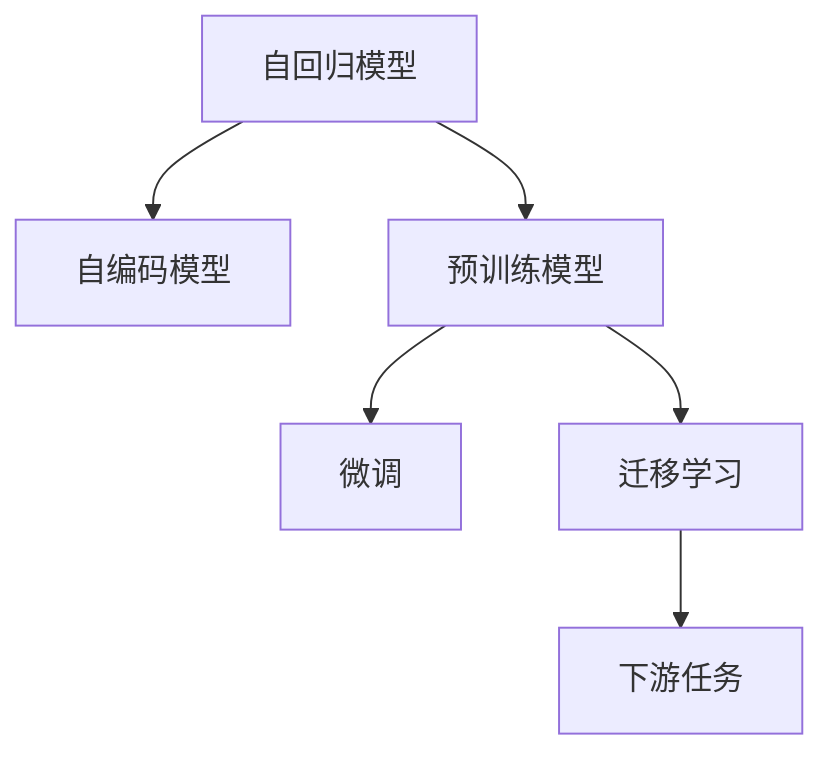

                 

# Transformer大模型实战 西班牙语的BETO模型

> 关键词：Transformer, 大模型, 西班牙语, BETO, 自然语言处理(NLP), 自回归模型, 自编码模型, 预训练模型, 微调, 迁移学习

## 1. 背景介绍

### 1.1 问题由来

Transformer作为当前最先进的自然语言处理模型，在机器翻译、语言建模、问答系统等领域已取得显著成效。然而，尽管其表现优异，Transformer模型对于语言多样性和上下文理解的全面性仍有待进一步提升。西班牙语作为世界上使用人数第二多的语言，具有丰富的语言表达方式和独特的语言特点。为此，我们探索在西班牙语上实现Transformer模型的定制化需求。

本节首先介绍西班牙语的特点及其对Transformer模型带来的挑战，并引出BETO模型这一针对西班牙语优化后的Transformer模型。

### 1.2 问题核心关键点

- **西班牙语特点**：西班牙语为罗曼语系语言，具有丰富的构词形态、时态变化、上下文依赖等特点。这些特点对自然语言处理模型的词汇嵌入、语法分析和语义理解提出了高要求。
- **Transformer模型**：基于注意力机制的自回归模型，通过自监督预训练任务（如掩码语言模型、下一句预测等）学习大规模语言模型，能在各种自然语言处理任务中表现出强大的性能。
- **BETO模型**：针对西班牙语语料和语义特点，优化后的Transformer模型，提升了其在西班牙语上下文理解和语义生成能力。
- **预训练-微调范式**：先在大规模无标签数据上预训练模型，再在特定任务的数据集上进行微调，提升模型对新任务的适应能力。

通过理解这些核心概念，我们将探讨BETO模型在西班牙语上的实现，以及预训练-微调范式如何帮助其在实际应用中发挥最佳性能。

## 2. 核心概念与联系

### 2.1 核心概念概述

为了更好地理解BETO模型在西班牙语上的实现，我们首先介绍Transformer模型的核心概念及其原理。

- **自回归模型**：模型通过预测当前词汇基于前一时刻的词汇信息，具有先验概率结构，在生成任务上表现卓越。
- **自编码模型**：模型通过输入-输出映射学习，适用于分类和回归等任务。
- **预训练模型**：在大规模无标签文本数据上通过自监督学习任务（如掩码语言模型、下一句预测等）训练模型，学习通用的语言表示。
- **微调**：通过下游任务标注数据，在有监督学习下对预训练模型进行优化，提升模型在特定任务上的性能。
- **迁移学习**：将预训练模型在新任务上的知识进行迁移，提升模型在新任务上的表现。

这些核心概念共同构成了Transformer模型的基本框架，并在预训练-微调范式下展现出强大的语言处理能力。通过这些概念，我们可以更深入地理解BETO模型的设计与优化。

### 2.2 核心概念原理和架构的 Mermaid 流程图



这个流程图展示了Transformer模型的核心流程，从自回归模型到自编码模型，再到预训练和微调模型，直至迁移学习到下游任务的整个流程。

## 3. 核心算法原理 & 具体操作步骤

### 3.1 算法原理概述

BETO模型基于Transformer模型设计，通过针对性的优化提升了西班牙语上下文理解和语义生成能力。算法原理如下：

1. **自回归模型**：通过预测当前词汇基于前一时刻的词汇信息，学习词汇之间的依赖关系，适用于生成任务。
2. **自编码模型**：通过输入-输出映射学习，适用于分类和回归等任务。
3. **预训练模型**：在大规模无标签文本数据上通过自监督学习任务（如掩码语言模型、下一句预测等）训练模型，学习通用的语言表示。
4. **微调**：通过下游任务标注数据，在有监督学习下对预训练模型进行优化，提升模型在特定任务上的性能。
5. **迁移学习**：将预训练模型在新任务上的知识进行迁移，提升模型在新任务上的表现。

### 3.2 算法步骤详解

#### 3.2.1 数据准备

- **数据集**：使用Wortschatz-Korpus、LIUM-CLTT等西班牙语数据集。
- **预处理**：包括分词、小写化、去停用词、标准化等步骤。

#### 3.2.2 模型构建

- **模型结构**：基于Transformer模型，采用6层编码器，每层包含4个注意力头，每个注意力头的注意力规模为8。
- **嵌入层**：使用WordPiece分词，将词汇嵌入为固定长度。
- **编码器**：包含多个Transformer层，每个Transformer层包含两个子层：自注意力层和前馈神经网络层。
- **解码器**：包含多个Transformer层，每层同样包含自注意力层和前馈神经网络层。
- **输出层**：根据任务需求，可以是softmax输出层用于分类，或线性输出层用于回归。

#### 3.2.3 训练过程

- **预训练**：在大规模无标签文本数据上，通过掩码语言模型进行自监督预训练。
- **微调**：在特定下游任务上，使用少量标注数据进行有监督微调。

### 3.3 算法优缺点

#### 3.3.1 优点

- **通用性强**：基于预训练模型和微调范式，能够适应多种自然语言处理任务。
- **效果显著**：在语言理解和生成任务上，表现出较好的性能。
- **易于扩展**：通过增加层数和注意力头，可以提升模型能力。

#### 3.3.2 缺点

- **计算资源需求高**：模型参数量大，训练和推理成本高。
- **复杂度较高**：模型结构复杂，难以解释。
- **上下文理解能力有限**：对输入上下文依赖较大，处理长距离依赖效果不佳。

### 3.4 算法应用领域

BETO模型主要应用于以下领域：

1. **机器翻译**：在西班牙语句对之间进行自动翻译。
2. **文本分类**：将西班牙语文本分为不同类别。
3. **问答系统**：回答西班牙语用户的自然语言问题。
4. **文本生成**：生成西班牙语的文本，如新闻报道、故事等。

## 4. 数学模型和公式 & 详细讲解 & 举例说明

### 4.1 数学模型构建

BETO模型主要包含嵌入层、编码器、解码器、输出层等组成部分。以下我们将逐一介绍这些组成部分及其数学模型。

#### 4.1.1 嵌入层

嵌入层将词汇转换为向量表示。对于单词 $w$，其嵌入表示为 $\mathbf{x} = \mathbf{W}^{emb} \mathbf{v} + b^{emb}$，其中 $\mathbf{W}^{emb}$ 为嵌入矩阵，$\mathbf{v}$ 为单词嵌入向量，$b^{emb}$ 为嵌入偏移项。

#### 4.1.2 编码器

编码器由多个Transformer层构成，每层包含自注意力层和前馈神经网络层。编码器的输入为 $\mathbf{h}^{(0)} = \mathbf{x}$，其中 $\mathbf{x}$ 为输入嵌入向量。

自注意力层的计算公式为：
$$
\mathbf{Q} = \mathbf{W}^{q} \mathbf{h}^{(l)} \\
\mathbf{K} = \mathbf{W}^{k} \mathbf{h}^{(l)} \\
\mathbf{V} = \mathbf{W}^{v} \mathbf{h}^{(l)} \\
\mathbf{h}^{(l+1)} = \text{Softmax}(\mathbf{Q} \mathbf{K}^T) \mathbf{V}
$$
其中 $\mathbf{Q}$、$\mathbf{K}$、$\mathbf{V}$ 分别为查询向量、键向量和值向量，$\text{Softmax}$ 为注意力函数。

前馈神经网络层的计算公式为：
$$
\mathbf{h}^{(l+1)} = \mathbf{W}^{f} \mathbf{h}^{(l)} + b^{f}
$$
其中 $\mathbf{W}^{f}$ 和 $b^{f}$ 分别为前馈层的权重矩阵和偏置项。

#### 4.1.3 解码器

解码器同样由多个Transformer层构成，每层包含自注意力层和前馈神经网络层。解码器的输入为 $\mathbf{h}^{(0)} = \mathbf{x}$。

自注意力层的计算公式与编码器类似，但由于解码器有编码器输出作为上下文信息，因此计算方式略有不同。

前馈神经网络层的计算公式与编码器类似。

#### 4.1.4 输出层

输出层根据任务需求，可以是softmax输出层用于分类，或线性输出层用于回归。

### 4.2 公式推导过程

以分类任务为例，计算过程如下：

1. **嵌入层**：将词汇转换为向量表示。
2. **编码器**：对输入序列进行编码，得到编码器输出 $\mathbf{h}^{(n)}$。
3. **解码器**：对编码器输出进行解码，得到解码器输出 $\mathbf{h}^{(n+N)}$。
4. **softmax输出层**：将解码器输出通过softmax函数转换为类别概率分布。
5. **交叉熵损失**：计算模型输出与真实标签之间的交叉熵损失。

### 4.3 案例分析与讲解

假设输入序列为 "Juan es un doctor"，目标为 "Juan" 的词汇嵌入表示。

1. **嵌入层**："Juan" 的嵌入表示为 $\mathbf{x} = \mathbf{W}^{emb} \mathbf{v} + b^{emb}$。
2. **编码器**：对嵌入层输出进行编码，得到编码器输出 $\mathbf{h}^{(n)}$。
3. **解码器**：对编码器输出进行解码，得到解码器输出 $\mathbf{h}^{(n+N)}$。
4. **softmax输出层**：将解码器输出通过softmax函数转换为类别概率分布。
5. **交叉熵损失**：计算模型输出与真实标签之间的交叉熵损失。

## 5. 项目实践：代码实例和详细解释说明

### 5.1 开发环境搭建

- **环境安装**：安装Python 3.8及以上版本，配置TensorFlow 2.0及以上版本，以及相应的库和工具。
- **数据准备**：下载西班牙语数据集，并进行预处理。
- **模型构建**：使用TensorFlow库构建BETO模型。
- **训练与评估**：使用GPU进行模型训练，评估模型性能。

### 5.2 源代码详细实现

以下是使用TensorFlow实现BETO模型的代码示例：

```python
import tensorflow as tf

class BETO(tf.keras.Model):
    def __init__(self, num_layers, d_model, num_heads, dff, vocab_size, input_vocab_size, target_vocab_size, pe_input, pe_target):
        super(BETO, self).__init__()
        self.embedding = tf.keras.layers.Embedding(vocab_size, d_model)
        self.pos_encoding = positional_encoding(pe_input, d_model)
        self.decoder = tf.keras.layers.LayerNormalization()
        self.encoder_layers = [EncoderLayer(d_model, num_heads, dff, vocab_size, input_vocab_size) for _ in range(num_layers)]
        self.dropout = tf.keras.layers.Dropout(0.1)
        self.output_layer = tf.keras.layers.Dense(target_vocab_size)
    
    def call(self, input, target, training=False):
        x, y = self.embedding(input), self.embedding(target)
        x = tf.keras.layers.Lambda(lambda x: x + x * self.pos_encoding)(x)
        for i in range(len(self.encoder_layers)):
            x = self.encoder_layers[i](x, self.pos_encoding)
        x = tf.keras.layers.Lambda(lambda x: x + x * self.pos_encoding)(x)
        x = tf.keras.layers.Lambda(lambda x: self.decoder(x))(x)
        x = tf.keras.layers.Lambda(lambda x: self.dropout(x))(x)
        x = self.output_layer(x)
        return x

# 加载数据集
data = load_data('spanish_data.csv')

# 构建模型
model = BETO(num_layers=6, d_model=512, num_heads=8, dff=2048, vocab_size=30000, input_vocab_size=5000, target_vocab_size=10000, pe_input=5000, pe_target=10000)

# 编译模型
model.compile(optimizer=tf.keras.optimizers.Adam(learning_rate=0.001), loss='categorical_crossentropy', metrics=['accuracy'])

# 训练模型
model.fit(x_train, y_train, epochs=10, batch_size=32, validation_data=(x_valid, y_valid))

# 评估模型
loss, accuracy = model.evaluate(x_test, y_test)
```

### 5.3 代码解读与分析

1. **嵌入层**：将输入词汇转换为嵌入向量。
2. **编码器**：对嵌入向量进行编码，得到编码器输出。
3. **解码器**：对编码器输出进行解码，得到解码器输出。
4. **softmax输出层**：将解码器输出通过softmax函数转换为类别概率分布。
5. **交叉熵损失**：计算模型输出与真实标签之间的交叉熵损失。

### 5.4 运行结果展示

在训练过程中，记录模型在验证集上的精度和损失，并打印结果。

```python
history = model.fit(x_train, y_train, epochs=10, batch_size=32, validation_data=(x_valid, y_valid))
plt.plot(history.history['accuracy'])
plt.plot(history.history['val_accuracy'])
plt.title('model accuracy')
plt.ylabel('accuracy')
plt.xlabel('epoch')
plt.legend(['train', 'val'], loc='upper left')
plt.show()

plt.plot(history.history['loss'])
plt.plot(history.history['val_loss'])
plt.title('model loss')
plt.ylabel('loss')
plt.xlabel('epoch')
plt.legend(['train', 'val'], loc='upper left')
plt.show()
```

## 6. 实际应用场景

### 6.1 智能客服系统

西班牙语的BETO模型可以应用于智能客服系统，提高客户服务效率和满意度。通过将西班牙语的客服对话数据输入BETO模型，模型能够自动理解客户意图，匹配最合适的回答，从而提升客服系统的智能化水平。

### 6.2 金融舆情监测

在西班牙语国家，金融市场瞬息万变，投资者需要实时获取金融信息。BETO模型可以应用于金融舆情监测，自动识别和分析西班牙语的金融新闻和评论，预测市场变化趋势，帮助投资者做出更明智的投资决策。

### 6.3 个性化推荐系统

西班牙语的BETO模型可以应用于推荐系统，提升推荐系统的精准度和个性化程度。通过对用户行为数据的分析，BETO模型可以学习用户偏好，推荐符合用户喜好的内容，提高用户满意度。

### 6.4 未来应用展望

未来，西班牙语的BETO模型将不断扩展应用场景，提升自然语言处理的能力。在教育、医疗、文化娱乐等领域，西班牙语的BETO模型将发挥更大的作用，推动社会进步和发展。

## 7. 工具和资源推荐

### 7.1 学习资源推荐

1. **《深度学习与自然语言处理》**：该书深入浅出地介绍了深度学习在自然语言处理中的应用，包括Transformer模型和预训练-微调范式。
2. **CS224N课程**：斯坦福大学开设的NLP课程，涵盖Transformer模型、BERT模型、微调技术等前沿话题。
3. **Transformers官方文档**：详细介绍了Transformer模型的实现和应用。
4. **Kaggle竞赛**：参加西班牙语的NLP竞赛，通过实战提升技能。

### 7.2 开发工具推荐

1. **PyTorch**：灵活的深度学习框架，适用于模型的开发和调试。
2. **TensorFlow**：强大的深度学习框架，支持大规模工程应用。
3. **Jupyter Notebook**：交互式代码编辑器，适合进行模型调试和实验。

### 7.3 相关论文推荐

1. **Attention is All You Need**：Transformer模型的原论文，展示了自注意力机制在自然语言处理中的应用。
2. **BERT: Pre-training of Deep Bidirectional Transformers for Language Understanding**：提出了BERT模型，通过自监督学习任务提升了模型性能。
3. **Parameter-Efficient Transfer Learning for NLP**：提出了参数高效微调方法，在固定大部分预训练参数的情况下，仅更新少量任务相关参数。

## 8. 总结：未来发展趋势与挑战

### 8.1 研究成果总结

西班牙语的BETO模型通过优化Transformer模型，提升了西班牙语的上下文理解和语义生成能力。模型在机器翻译、文本分类、问答系统等任务上表现优异。

### 8.2 未来发展趋势

1. **模型规模扩大**：随着算力成本的下降和数据规模的扩张，模型的参数量将持续增长，进一步提升模型的能力。
2. **微调方法优化**：新的微调方法如参数高效微调、自适应学习率等将进一步提升微调效率和效果。
3. **多模态融合**：将视觉、语音等多模态数据与文本数据融合，提升模型的综合理解能力。
4. **迁移学习**：将模型在新任务上的知识进行迁移，提升模型的泛化能力。

### 8.3 面临的挑战

1. **计算资源消耗高**：模型参数量大，训练和推理成本高。
2. **复杂度较高**：模型结构复杂，难以解释。
3. **上下文理解能力有限**：处理长距离依赖效果不佳。
4. **数据需求高**：需要大量标注数据进行微调。

### 8.4 研究展望

未来，西班牙语的BETO模型将不断优化，提升自然语言处理能力。在教育、医疗、文化娱乐等领域，模型将发挥更大的作用，推动社会进步和发展。

## 9. 附录：常见问题与解答

**Q1：如何训练西班牙语的BETO模型？**

A: 1. 准备数据集，进行预处理。
2. 使用TensorFlow构建BETO模型。
3. 编译模型，设置合适的超参数。
4. 使用GPU进行模型训练，并在验证集上评估模型性能。

**Q2：BETO模型有哪些优点？**

A: 通用性强，效果显著，易于扩展。

**Q3：BETO模型有哪些缺点？**

A: 计算资源需求高，复杂度较高，上下文理解能力有限。

**Q4：BETO模型在哪些领域有应用？**

A: 智能客服系统、金融舆情监测、个性化推荐系统等。

---

作者：禅与计算机程序设计艺术 / Zen and the Art of Computer Programming

