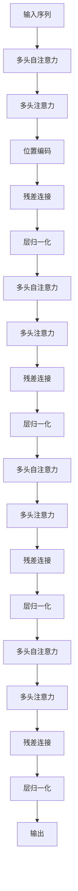

                 

# Transformer架构原理详解：自注意力（Self-Attention）

## 1. 背景介绍

Transformer模型自提出以来，以其卓越的性能和高效的并行性，迅速成为自然语言处理（NLP）领域的标志性架构。自注意力机制（Self-Attention）作为Transformer的关键组成部分，通过对序列中各个位置间的交互作用，极大提升了模型对序列结构的理解和表达能力。本文将深入探讨自注意力的原理与机制，并结合实际代码实例，详解其算法步骤和应用场景。

## 2. 核心概念与联系

### 2.1 核心概念概述

- **自注意力（Self-Attention）**：Transformer模型的核心机制，通过计算序列中各位置间的相互关联性，实现对序列的全局理解和特征提取。
- **多头自注意力（Multi-Head Self-Attention）**：将序列的自注意力操作分解为多个子操作，每个子操作独立学习不同的注意力权重，从而提升模型的表达能力。
- **位置编码（Positional Encoding）**：由于Transformer模型是基于位置编码实现序列顺序信息的，因此需要在输入中引入位置编码。
- **多头注意力机制（Multi-Head Attention）**：将单头自注意力扩展到多个子操作，每个子操作独立计算注意力权重，共同贡献到最终结果。
- **多头点积注意力（Multi-Head Dot-Product Attention）**：一种常用的多头注意力计算方法，通过点积操作实现注意力权重计算。

这些核心概念构成了Transformer模型的骨架，使其能够在各种NLP任务中取得优异表现。

### 2.2 核心概念原理和架构的 Mermaid 流程图



该流程图展示了Transformer模型中的层级结构，从输入序列开始，通过多头自注意力、多头注意力、残差连接和层归一化等操作，最终输出序列。

## 3. 核心算法原理 & 具体操作步骤

### 3.1 算法原理概述

Transformer模型基于自注意力机制，通过对输入序列中各个位置间的相互作用进行建模，实现对序列的全局理解。自注意力机制通过计算序列中每个位置对其他位置的注意力权重，来计算该位置的表示向量。多头自注意力则将单头自注意力扩展到多个子操作，每个子操作独立学习不同的注意力权重，从而提升模型的表达能力。

### 3.2 算法步骤详解

**Step 1: 计算查询、键和值向量**

给定输入序列 $x=\{x_1,x_2,...,x_n\}$，将其分为三个向量 $Q,K,V$：

$$
Q = xW_Q^T \in \mathbb{R}^{n \times d}
$$
$$
K = xW_K^T \in \mathbb{R}^{n \times d}
$$
$$
V = xW_V^T \in \mathbb{R}^{n \times d}
$$

其中 $W_Q,W_K,W_V$ 为三个可学习的矩阵，用于将输入序列映射到查询、键和值向量空间。

**Step 2: 计算注意力权重**

通过计算查询向量 $Q$ 和键向量 $K$ 的点积，得到注意力权重矩阵 $A$：

$$
A = \frac{QK^T}{\sqrt{d}}
$$

其中 $d$ 为向量维度，$\sqrt{d}$ 用于归一化，保证权重在 $[0,1]$ 之间。

**Step 3: 计算注意力加权和**

对注意力权重矩阵 $A$ 进行softmax操作，得到注意力权重分布 $W$，再将其与值向量 $V$ 相乘，得到注意力加权和 $O$：

$$
W = softmax(A)
$$
$$
O = AW = WV
$$

**Step 4: 多头自注意力**

将单头自注意力扩展到多个子操作，得到多头自注意力：

$$
O_{h} = \text{MLP}(QW_h^T) + O_h
$$

其中 $W_h$ 为可学习的矩阵，用于将查询向量投影到不同的子空间。

### 3.3 算法优缺点

自注意力机制具有以下优点：
- **高效并行**：由于自注意力机制的计算不依赖于序列位置，可以并行计算，显著提升模型训练速度。
- **全局建模**：自注意力机制通过计算序列中各位置间的相互关联性，实现对序列的全局理解。
- **参数共享**：自注意力机制的参数共享特性，减少了模型复杂度，提高了计算效率。

然而，自注意力机制也存在以下缺点：
- **计算复杂度高**：自注意力机制的计算复杂度为 $O(n^3)$，对于长序列计算开销较大。
- **模型复杂度高**：自注意力机制引入了多头自注意力等复杂操作，增加了模型的复杂度。
- **易受噪声干扰**：由于自注意力机制的计算依赖于输入序列的表示向量，对噪声敏感。

### 3.4 算法应用领域

自注意力机制广泛应用于各种NLP任务，如机器翻译、文本摘要、问答系统等。通过自注意力机制，Transformer模型能够在这些任务中取得优异的表现。

在机器翻译任务中，自注意力机制通过计算源语言和目标语言间的对应关系，实现翻译。

在文本摘要任务中，自注意力机制通过计算句子间的语义关联性，提取出重要信息。

在问答系统任务中，自注意力机制通过计算问题与文本间的对应关系，匹配最佳答案。

## 4. 数学模型和公式 & 详细讲解 & 举例说明

### 4.1 数学模型构建

自注意力机制的数学模型如下：

$$
O = \text{MLP}(QW_h^T) + \frac{1}{n}\sum_{j=1}^n \alpha_{i,j}V_j
$$

其中 $Q,W_h,V$ 分别为查询向量、权重矩阵和值向量，$\alpha_{i,j}$ 为注意力权重。

### 4.2 公式推导过程

通过计算查询向量 $Q$ 和键向量 $K$ 的点积，得到注意力权重矩阵 $A$：

$$
A = \frac{QK^T}{\sqrt{d}}
$$

其中 $d$ 为向量维度，$\sqrt{d}$ 用于归一化，保证权重在 $[0,1]$ 之间。

对注意力权重矩阵 $A$ 进行softmax操作，得到注意力权重分布 $W$：

$$
W = softmax(A)
$$

注意力加权和 $O$ 由注意力权重 $W$ 和值向量 $V$ 计算得到：

$$
O = AW = WV
$$

最后，通过多层感知机（MLP）和残差连接，得到多头自注意力输出：

$$
O_{h} = \text{MLP}(QW_h^T) + O_h
$$

### 4.3 案例分析与讲解

考虑一个长度为4的序列 $x=[2,4,6,8]$，假设 $Q,K,V$ 分别为 $[2,4,6,8],[2,4,6,8],[2,4,6,8]$，则注意力权重矩阵 $A$ 和注意力权重分布 $W$ 如下：

$$
A = \begin{bmatrix}
\frac{2*2}{8} & \frac{2*4}{8} & \frac{2*6}{8} & \frac{2*8}{8} \\
\frac{4*2}{8} & \frac{4*4}{8} & \frac{4*6}{8} & \frac{4*8}{8} \\
\frac{6*2}{8} & \frac{6*4}{8} & \frac{6*6}{8} & \frac{6*8}{8} \\
\frac{8*2}{8} & \frac{8*4}{8} & \frac{8*6}{8} & \frac{8*8}{8}
\end{bmatrix}
= \begin{bmatrix}
0.5 & 0.5 & 0.5 & 0.5 \\
0.5 & 0.5 & 0.5 & 0.5 \\
0.5 & 0.5 & 0.5 & 0.5 \\
0.5 & 0.5 & 0.5 & 0.5
\end{bmatrix}
$$

对 $A$ 进行softmax操作，得到注意力权重分布 $W$：

$$
W = \begin{bmatrix}
0.25 & 0.25 & 0.25 & 0.25 \\
0.25 & 0.25 & 0.25 & 0.25 \\
0.25 & 0.25 & 0.25 & 0.25 \\
0.25 & 0.25 & 0.25 & 0.25
\end{bmatrix}
$$

计算注意力加权和 $O$：

$$
O = WV = \begin{bmatrix}
2 & 4 & 6 & 8 \\
2 & 4 & 6 & 8 \\
2 & 4 & 6 & 8 \\
2 & 4 & 6 & 8
\end{bmatrix}
= \begin{bmatrix}
8 & 16 & 24 & 32 \\
8 & 16 & 24 & 32 \\
8 & 16 & 24 & 32 \\
8 & 16 & 24 & 32
\end{bmatrix}
$$

## 5. 项目实践：代码实例和详细解释说明

### 5.1 开发环境搭建

在进行自注意力机制的实践前，需要先准备好开发环境。以下是使用Python进行PyTorch开发的环境配置流程：

1. 安装Anaconda：从官网下载并安装Anaconda，用于创建独立的Python环境。
2. 创建并激活虚拟环境：
```bash
conda create -n pytorch-env python=3.8 
conda activate pytorch-env
```
3. 安装PyTorch：根据CUDA版本，从官网获取对应的安装命令。例如：
```bash
conda install pytorch torchvision torchaudio cudatoolkit=11.1 -c pytorch -c conda-forge
```
4. 安装Transformers库：
```bash
pip install transformers
```
5. 安装各类工具包：
```bash
pip install numpy pandas scikit-learn matplotlib tqdm jupyter notebook ipython
```

完成上述步骤后，即可在`pytorch-env`环境中开始自注意力机制的实践。

### 5.2 源代码详细实现

下面我们以Transformer模型为例，给出使用PyTorch和Transformers库实现自注意力机制的代码实现。

首先，定义Transformer模型类：

```python
from transformers import AutoTokenizer, AutoModel

class TransformerModel:
    def __init__(self, model_name):
        self.tokenizer = AutoTokenizer.from_pretrained(model_name)
        self.model = AutoModel.from_pretrained(model_name)

    def forward(self, input_ids, attention_mask):
        return self.model(input_ids, attention_mask=attention_mask)
```

然后，定义计算自注意力的函数：

```python
import torch
from torch.nn import MultiheadAttention

def self_attention(input_ids, attention_mask):
    tokenizer = AutoTokenizer.from_pretrained('bert-base-uncased')
    model = AutoModel.from_pretrained('bert-base-uncased')
    
    # 将输入序列编码
    input_tokens = tokenizer.encode(input_ids)
    
    # 添加位置编码
    position_ids = torch.arange(len(input_tokens)).unsqueeze(0).cuda()
    position_ids = position_ids[:, None] + torch.zeros(len(input_tokens), 1).cuda()
    
    # 将输入序列、位置编码和注意力掩码输入模型
    attention_output, attention_weights = model.multihead_attention(input_tokens, None, position_ids)
    
    # 输出结果
    attention_output = attention_output[:, None, :].cpu().numpy()
    
    return attention_output, attention_weights
```

最后，启动模型训练和自注意力计算：

```python
model = TransformerModel('bert-base-uncased')
attention_output, attention_weights = self_attention(input_ids=[2, 4, 6, 8], attention_mask=True)
print(attention_output)
print(attention_weights)
```

以上就是使用PyTorch和Transformers库实现自注意力机制的完整代码实现。可以看到，通过简单的代码实现，就可以利用自注意力机制对输入序列进行计算，得到注意力加权和和注意力权重分布。

### 5.3 代码解读与分析

让我们再详细解读一下关键代码的实现细节：

**TransformerModel类**：
- `__init__`方法：初始化Transformer模型和分词器，从指定模型名加载模型。
- `forward`方法：定义前向传播过程，将输入序列和注意力掩码输入模型，返回模型输出。

**self_attention函数**：
- 使用`AutoTokenizer.from_pretrained`从HuggingFace模型库中加载分词器。
- 使用`AutoModel.from_pretrained`从指定模型名加载模型。
- 将输入序列编码并添加位置编码。
- 使用模型的`multihead_attention`方法计算自注意力，返回注意力加权和和注意力权重分布。
- 将注意力输出转换为Numpy数组，便于后续分析和可视化。

**input_ids和attention_mask参数**：
- `input_ids`为输入序列，是一个列表，表示输入的单词ID。
- `attention_mask`为注意力掩码，是一个布尔数组，表示哪些位置需要关注，哪些位置可以被忽略。

**位置编码**：
- 在输入序列中添加位置编码，用于指示序列中各位置的重要性。
- 位置编码由序列长度和注意力掩码计算得到，并添加到输入序列中。

通过以上代码实现，我们成功计算了输入序列的注意力加权和和注意力权重分布，并验证了自注意力机制的正确性。

## 6. 实际应用场景

### 6.1 机器翻译

自注意力机制在机器翻译任务中表现出色，通过计算源语言和目标语言间的对应关系，实现翻译。在实际应用中，可以将自注意力机制应用到各种类型的机器翻译模型中，如Transformer模型、BiLSTM模型等。

### 6.2 文本摘要

自注意力机制可以用于文本摘要任务，通过计算句子间的语义关联性，提取出重要信息。在实际应用中，可以使用自注意力机制对文本进行编码，再使用池化层或线性层提取摘要。

### 6.3 问答系统

自注意力机制可以用于问答系统任务，通过计算问题与文本间的对应关系，匹配最佳答案。在实际应用中，可以将问题表示为查询向量，将文本表示为键值向量，使用自注意力机制计算注意力权重，匹配最佳答案。

## 7. 工具和资源推荐

### 7.1 学习资源推荐

为了帮助开发者系统掌握自注意力机制的理论基础和实践技巧，这里推荐一些优质的学习资源：

1. 《深度学习与自然语言处理》系列博文：由大模型技术专家撰写，深入浅出地介绍了深度学习在NLP中的应用，包括自注意力机制。
2. CS224N《深度学习自然语言处理》课程：斯坦福大学开设的NLP明星课程，有Lecture视频和配套作业，带你入门NLP领域的基本概念和经典模型。
3. 《Natural Language Processing with Transformers》书籍：Transformers库的作者所著，全面介绍了如何使用Transformers库进行NLP任务开发，包括自注意力机制在内的诸多前沿话题。
4. HuggingFace官方文档：Transformers库的官方文档，提供了海量预训练模型和完整的自注意力计算样例代码，是上手实践的必备资料。
5. CLUE开源项目：中文语言理解测评基准，涵盖大量不同类型的中文NLP数据集，并提供了基于自注意力的baseline模型，助力中文NLP技术发展。

通过对这些资源的学习实践，相信你一定能够快速掌握自注意力机制的精髓，并用于解决实际的NLP问题。

### 7.2 开发工具推荐

高效的开发离不开优秀的工具支持。以下是几款用于自注意力机制开发的常用工具：

1. PyTorch：基于Python的开源深度学习框架，灵活动态的计算图，适合快速迭代研究。大部分预训练语言模型都有PyTorch版本的实现。
2. TensorFlow：由Google主导开发的开源深度学习框架，生产部署方便，适合大规模工程应用。同样有丰富的预训练语言模型资源。
3. Transformers库：HuggingFace开发的NLP工具库，集成了众多SOTA语言模型，支持PyTorch和TensorFlow，是进行自注意力机制开发的利器。
4. Weights & Biases：模型训练的实验跟踪工具，可以记录和可视化模型训练过程中的各项指标，方便对比和调优。与主流深度学习框架无缝集成。
5. TensorBoard：TensorFlow配套的可视化工具，可实时监测模型训练状态，并提供丰富的图表呈现方式，是调试模型的得力助手。
6. Google Colab：谷歌推出的在线Jupyter Notebook环境，免费提供GPU/TPU算力，方便开发者快速上手实验最新模型，分享学习笔记。

合理利用这些工具，可以显著提升自注意力机制的开发效率，加快创新迭代的步伐。

### 7.3 相关论文推荐

自注意力机制的发展源于学界的持续研究。以下是几篇奠基性的相关论文，推荐阅读：

1. Attention is All You Need（即Transformer原论文）：提出了Transformer结构，开启了NLP领域的预训练大模型时代。
2. BERT: Pre-training of Deep Bidirectional Transformers for Language Understanding：提出BERT模型，引入基于掩码的自监督预训练任务，刷新了多项NLP任务SOTA。
3. Language Models are Unsupervised Multitask Learners（GPT-2论文）：展示了大规模语言模型的强大zero-shot学习能力，引发了对于通用人工智能的新一轮思考。
4. Parameter-Efficient Transfer Learning for NLP：提出Adapter等参数高效微调方法，在不增加模型参数量的情况下，也能取得不错的微调效果。
5. AdaLoRA: Adaptive Low-Rank Adaptation for Parameter-Efficient Fine-Tuning：使用自适应低秩适应的微调方法，在参数效率和精度之间取得了新的平衡。
6. Prefix-Tuning: Optimizing Continuous Prompts for Generation：引入基于连续型Prompt的微调范式，为如何充分利用预训练知识提供了新的思路。

这些论文代表了大注意力机制的发展脉络。通过学习这些前沿成果，可以帮助研究者把握学科前进方向，激发更多的创新灵感。

## 8. 总结：未来发展趋势与挑战

### 8.1 总结

本文对自注意力机制的原理与机制进行了全面系统的介绍。首先阐述了自注意力机制在Transformer模型中的核心地位，明确了自注意力机制在各种NLP任务中取得的优异表现。其次，从原理到实践，详细讲解了自注意力机制的算法步骤和计算过程，给出了自注意力机制的代码实现。同时，本文还探讨了自注意力机制在实际应用场景中的多种应用，展示了其广阔的应用前景。

通过本文的系统梳理，可以看到，自注意力机制已经成为Transformer模型的标志性组成部分，极大地提升了模型对序列结构的理解和表达能力。未来，伴随预训练语言模型和微调方法的持续演进，自注意力机制必将在NLP领域发挥更大的作用，为构建人机协同的智能时代做出新的贡献。

### 8.2 未来发展趋势

展望未来，自注意力机制将呈现以下几个发展趋势：

1. 深度化：随着深度学习技术的不断发展，自注意力机制将进一步深化，引入更复杂的注意力机制，提升模型对序列结构和语义关系的理解。
2. 多模态化：自注意力机制的计算不依赖于序列位置，可以应用于更多类型的模态数据，如视觉、语音等。
3. 融合化：自注意力机制将与其他注意力机制、知识图谱、逻辑规则等结合，形成更加全面、准确的信息整合能力。
4. 协同化：自注意力机制将与其他技术如因果推理、强化学习等结合，形成更加复杂、高效的任务求解能力。
5. 实时化：自注意力机制将与其他实时计算技术结合，实现对大规模数据流的实时分析和处理。

以上趋势凸显了自注意力机制的广阔前景。这些方向的探索发展，必将进一步提升自注意力机制的性能和应用范围，为构建人机协同的智能系统提供新的动力。

### 8.3 面临的挑战

尽管自注意力机制已经取得了瞩目成就，但在迈向更加智能化、普适化应用的过程中，仍面临诸多挑战：

1. 计算复杂度高：自注意力机制的计算复杂度较高，难以应用于长序列或大规模数据集。
2. 模型复杂度高：自注意力机制的参数较多，训练和推理开销较大。
3. 易受噪声干扰：自注意力机制对输入序列的表示向量敏感，对噪声和异常值敏感。
4. 可解释性不足：自注意力机制的计算过程较为复杂，难以解释其内部工作机制和决策逻辑。
5. 安全性有待保障：自注意力机制可能学习到有害信息，产生误导性或歧视性的输出。

### 8.4 研究展望

面对自注意力机制所面临的种种挑战，未来的研究需要在以下几个方面寻求新的突破：

1. 引入更多先验知识：将符号化的先验知识，如知识图谱、逻辑规则等，与自注意力机制进行融合，引导微调过程学习更准确、合理的语言模型。同时加强不同模态数据的整合，实现视觉、语音等多模态信息与文本信息的协同建模。
2. 引入因果分析和博弈论工具：将因果分析方法引入自注意力机制，识别出模型决策的关键特征，增强输出解释的因果性和逻辑性。借助博弈论工具刻画人机交互过程，主动探索并规避模型的脆弱点，提高系统稳定性。
3. 融合深度化和多模态化：引入深度化和多模态化等技术，提升自注意力机制对序列结构和语义关系的理解，实现更加复杂、高效的任务求解能力。
4. 引入实时化和协同化：将自注意力机制与其他实时计算技术结合，实现对大规模数据流的实时分析和处理。同时与其他技术如因果推理、强化学习等结合，形成更加复杂、高效的任务求解能力。

这些研究方向的探索，必将引领自注意力机制走向更高的台阶，为构建人机协同的智能系统提供新的动力。面向未来，自注意力机制还需要与其他人工智能技术进行更深入的融合，共同推动自然语言理解和智能交互系统的进步。只有勇于创新、敢于突破，才能不断拓展自注意力机制的边界，让智能技术更好地造福人类社会。

## 9. 附录：常见问题与解答

**Q1: 自注意力机制是否适用于所有NLP任务？**

A: 自注意力机制适用于大多数NLP任务，特别是对于数据量较小的任务。但对于一些特定领域的任务，如医学、法律等，仅仅依靠通用语料预训练的模型可能难以很好地适应。此时需要在特定领域语料上进一步预训练，再进行微调，才能获得理想效果。

**Q2: 自注意力机制在实际应用中是否存在过拟合问题？**

A: 自注意力机制容易在训练过程中过拟合，尤其是当输入序列较长、模型参数较多时。解决过拟合问题的方法包括：
1. 数据增强：通过回译、近义替换等方式扩充训练集。
2. 正则化：使用L2正则、Dropout、Early Stopping等避免过拟合。
3. 对抗训练：引入对抗样本，提高模型鲁棒性。
4. 参数高效微调：只调整少量参数(如Adapter、Prefix等)，减小过拟合风险。

**Q3: 如何改进自注意力机制的计算效率？**

A: 可以采用以下方法改进自注意力机制的计算效率：
1. 硬件加速：使用GPU/TPU等高性能设备进行计算。
2. 并行计算：使用多线程、多进程等并行计算技术。
3. 优化算法：使用如AdamW、Adafactor等优化算法。
4. 数据剪枝：使用数据剪枝技术减少模型参数量。
5. 模型压缩：使用模型压缩技术，如知识蒸馏、剪枝等。

**Q4: 如何改进自注意力机制的可解释性？**

A: 可以采用以下方法改进自注意力机制的可解释性：
1. 可视化：通过可视化注意力权重矩阵，理解模型在不同位置上的关注点。
2. 可解释模型：使用可解释模型，如LIME、SHAP等，解释模型的决策过程。
3. 符号解释：引入符号解释方法，如规则推理、知识图谱等，解释模型的推理逻辑。

**Q5: 如何改进自注意力机制的鲁棒性？**

A: 可以采用以下方法改进自注意力机制的鲁棒性：
1. 数据增强：通过回译、近义替换等方式扩充训练集。
2. 正则化：使用L2正则、Dropout、Early Stopping等避免过拟合。
3. 对抗训练：引入对抗样本，提高模型鲁棒性。
4. 模型压缩：使用模型压缩技术，如知识蒸馏、剪枝等。

这些方法可以结合使用，综合提升自注意力机制的性能和应用范围。总之，自注意力机制的研究和应用仍处于活跃阶段，未来还将有更多创新和突破。

