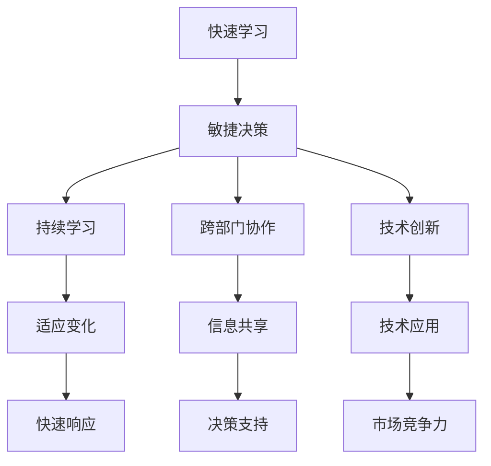

                 

# VUCA时代,快速学习成为制胜关键

## 1. 背景介绍

在VUCA（Volatility, Uncertainty, Complexity, and Ambiguity）时代，市场、技术和社会环境都在快速变化，企业必须快速响应各种不确定性，才能在激烈的竞争中取得优势。在这样的背景下，快速学习和敏捷决策变得尤为重要。无论是企业管理、产品开发还是个人成长，快速学习的能力都成为了新的制胜关键。

### 1.1 问题由来

近年来，随着科技的快速发展，各行各业都在经历着前所未有的变革。新的技术、新的商业模式、新的市场竞争规则不断涌现，企业在面对这些变化时，如何快速适应、快速学习、快速迭代，成为了新的挑战。快速学习不仅关系到企业能否生存，更关系到企业的长期发展。

在企业内部，决策层和执行层之间信息传递不畅、知识共享不足、跨部门协作不力等问题，导致企业的响应速度和决策效率难以满足市场需求。此外，企业的学习和成长机制未能跟上技术发展的步伐，导致员工的技能和知识储备难以适应新变化。

在个人层面，社会环境的快速变化和职业的不确定性增加了职业发展的风险，如何在VUCA时代中快速提升自己的技能，成为了每一个职场人必须面对的问题。

### 1.2 问题核心关键点

1. **快速适应变化**：企业需要快速响应市场和技术变化，适应新的环境和规则。
2. **敏捷决策**：企业需要快速做出决策，并能够根据实际情况进行调整和优化。
3. **持续学习**：企业需要建立持续学习的机制，不断提升员工的技能和知识储备。
4. **跨部门协作**：企业需要打破部门间的壁垒，促进知识共享和协作，提高整体响应速度。
5. **技术创新**：企业需要持续推动技术创新，掌握新技术，提高市场竞争力。

## 2. 核心概念与联系

### 2.1 核心概念概述

要解决VUCA时代的快速学习和敏捷决策问题，首先需要明确几个关键概念：

- **快速学习**：在短时间内获取、理解和应用新知识，提升自身能力。
- **敏捷决策**：快速分析问题，做出决策，并能够根据实际情况进行调整和优化。
- **持续学习**：建立持续学习的机制，不断更新和扩展知识库。
- **跨部门协作**：打破部门间的壁垒，促进信息共享和协作，提高整体响应速度。
- **技术创新**：持续推动技术创新，掌握新技术，提高市场竞争力。

这些概念之间存在紧密联系，共同构成了企业在VUCA时代中的快速学习和敏捷决策能力。

### 2.2 核心概念原理和架构的 Mermaid 流程图



这个流程图展示了快速学习、敏捷决策、持续学习、跨部门协作和技术创新之间的联系和互动关系。

## 3. 核心算法原理 & 具体操作步骤

### 3.1 算法原理概述

快速学习和敏捷决策的实现，需要基于算法和技术的支撑。其核心算法原理包括以下几个方面：

1. **强化学习**：通过试错不断调整策略，优化决策过程。
2. **机器学习**：通过数据和算法优化决策模型，提升决策效率和准确性。
3. **自然语言处理(NLP)**：通过文本分析，提取关键信息，辅助决策。
4. **知识图谱**：构建知识图谱，帮助理解和应用新知识。
5. **推荐系统**：通过个性化推荐，提升学习和决策的效率。

### 3.2 算法步骤详解

#### 3.2.1 强化学习步骤

1. **构建环境**：定义问题空间，构建状态和动作空间。
2. **选择模型**：选择适当的强化学习算法，如Q-learning、SARSA、深度强化学习等。
3. **训练模型**：通过试错不断调整策略，优化决策过程。
4. **评估和优化**：根据实际效果，评估和优化模型，提升决策效率。

#### 3.2.2 机器学习步骤

1. **数据准备**：收集和整理数据，确保数据的质量和多样性。
2. **模型选择**：选择合适的机器学习算法，如线性回归、决策树、神经网络等。
3. **训练模型**：通过数据训练模型，调整参数，优化模型。
4. **评估和优化**：通过测试集评估模型效果，根据实际效果进行调整和优化。

#### 3.2.3 自然语言处理步骤

1. **文本预处理**：清洗和分词，去除噪声，提取关键信息。
2. **特征提取**：提取文本特征，如TF-IDF、词向量、句向量等。
3. **情感分析**：分析文本情感，辅助决策。
4. **文本分类**：对文本进行分类，辅助决策。

#### 3.2.4 知识图谱步骤

1. **构建知识图谱**：通过知识抽取、关系推理等方式构建知识图谱。
2. **知识融合**：将知识图谱与业务数据融合，提升决策的科学性。
3. **知识应用**：将知识图谱应用于决策过程中，辅助决策。

#### 3.2.5 推荐系统步骤

1. **数据收集**：收集用户行为数据，如浏览记录、点击记录等。
2. **用户建模**：通过用户行为数据，构建用户画像，了解用户需求。
3. **物品推荐**：根据用户画像和物品属性，推荐相关物品。
4. **效果评估**：通过A/B测试等方法，评估推荐效果，不断优化推荐策略。

### 3.3 算法优缺点

#### 3.3.1 强化学习的优缺点

**优点**：
- 通过试错不断优化策略，适用于动态变化的环境。
- 能够适应复杂多变的决策场景。

**缺点**：
- 训练过程需要大量试错，时间成本较高。
- 需要大量的数据和计算资源，对环境要求较高。

#### 3.3.2 机器学习的优缺点

**优点**：
- 能够从数据中提取规律，提高决策的准确性。
- 适用于大规模数据处理，效率较高。

**缺点**：
- 对数据质量要求较高，数据偏差可能导致模型失效。
- 模型复杂度较高，解释性较差。

#### 3.3.3 自然语言处理的优缺点

**优点**：
- 能够从文本中提取关键信息，辅助决策。
- 适用于多语言处理，通用性强。

**缺点**：
- 对文本质量要求较高，噪声较多的文本效果较差。
- 模型依赖大量语料库，构建成本较高。

#### 3.3.4 知识图谱的优缺点

**优点**：
- 能够结构化知识，提升决策的科学性。
- 适用于复杂问题的处理，如因果关系推理。

**缺点**：
- 构建和维护知识图谱成本较高，技术难度较大。
- 对数据质量和完整性要求较高，构建难度较大。

#### 3.3.5 推荐系统的优缺点

**优点**：
- 能够提供个性化推荐，提高用户体验。
- 适用于电商、内容推荐等领域，效果显著。

**缺点**：
- 需要大量用户数据，隐私问题难以解决。
- 推荐效果受用户行为变化影响较大。

### 3.4 算法应用领域

#### 3.4.1 企业管理

快速学习和敏捷决策在企业管理中的应用，主要体现在以下几个方面：

- **快速响应市场变化**：通过强化学习等算法，快速调整策略，适应市场变化。
- **优化决策过程**：通过机器学习等算法，优化决策模型，提升决策效率和准确性。
- **跨部门协作**：通过知识图谱等技术，打破部门间壁垒，促进信息共享和协作。

#### 3.4.2 产品开发

快速学习和敏捷决策在产品开发中的应用，主要体现在以下几个方面：

- **快速迭代**：通过强化学习等算法，快速迭代产品功能和设计，提升用户体验。
- **需求预测**：通过机器学习等算法，预测用户需求，优化产品设计和功能。
- **市场推广**：通过推荐系统等技术，个性化推荐产品，提高市场竞争力。

#### 3.4.3 个人成长

快速学习和敏捷决策在个人成长中的应用，主要体现在以下几个方面：

- **技能提升**：通过机器学习和自然语言处理等技术，快速学习新技能。
- **知识管理**：通过知识图谱等技术，构建知识体系，提升知识管理能力。
- **决策支持**：通过推荐系统等技术，提供个性化推荐，辅助决策。

## 4. 数学模型和公式 & 详细讲解 & 举例说明

### 4.1 数学模型构建

#### 4.1.1 强化学习模型

强化学习模型的构建基于环境、状态、动作和奖励四个要素。其中，环境是问题空间，状态是当前环境的状态，动作是采取的策略，奖励是行动的反馈。通过不断试错，强化学习算法优化策略，使得决策过程更加高效和准确。

#### 4.1.2 机器学习模型

机器学习模型的构建基于数据和算法。通过数据训练模型，调整参数，优化模型。常用的机器学习算法包括线性回归、决策树、神经网络等。通过测试集评估模型效果，不断优化模型。

#### 4.1.3 自然语言处理模型

自然语言处理模型基于文本数据和语言模型。通过文本预处理、特征提取等步骤，构建文本模型。常用的自然语言处理算法包括TF-IDF、词向量、句向量等。通过情感分析和文本分类等任务，辅助决策。

#### 4.1.4 知识图谱模型

知识图谱模型的构建基于知识抽取和关系推理。通过知识抽取技术，从文本和数据库中抽取实体和关系。通过关系推理技术，构建知识图谱。常用的知识图谱构建算法包括基于规则的方法和基于深度学习的方法。

#### 4.1.5 推荐系统模型

推荐系统模型的构建基于用户和物品数据。通过用户建模，了解用户需求。通过物品推荐，提供个性化推荐。常用的推荐算法包括协同过滤、基于内容的推荐等。

### 4.2 公式推导过程

#### 4.2.1 强化学习公式

强化学习中的核心公式为Q-learning公式：
$$ Q(s,a) \leftarrow Q(s,a) + \alpha [r + \gamma \max Q(s',a') - Q(s,a)] $$
其中，Q(s,a)表示状态-动作的Q值，r表示奖励，s'表示下一个状态，a'表示下一个动作，$\alpha$表示学习率，$\gamma$表示折扣因子。

#### 4.2.2 机器学习公式

常用的机器学习算法包括线性回归、决策树、神经网络等。以线性回归为例，其核心公式为：
$$ \hat{y} = \beta_0 + \beta_1 x_1 + \beta_2 x_2 + \ldots + \beta_n x_n $$
其中，$\hat{y}$表示预测值，$\beta_0$表示截距，$\beta_1, \beta_2, \ldots, \beta_n$表示各特征的系数。

#### 4.2.3 自然语言处理公式

自然语言处理中常用的算法包括TF-IDF、词向量、句向量等。以TF-IDF为例，其核心公式为：
$$ TF(t,f) = \frac{N(t)}{N(f)} $$
$$ IDF(t) = \log \frac{N(d)}{df(t)} $$
其中，$TF(t,f)$表示词t在文本f中的TF-IDF值，$N(f)$表示文本f的词数，$N(d)$表示文档总数，$df(t)$表示包含词t的文档数。

#### 4.2.4 知识图谱公式

知识图谱中的核心公式为实体-关系-实体三元组。以实体-关系-实体三元组为例，其核心公式为：
$$ E_1 - R_1 - E_2 $$
其中，$E_1$表示实体1，$R_1$表示关系1，$E_2$表示实体2。

#### 4.2.5 推荐系统公式

推荐系统中的核心公式为协同过滤公式。以基于用户的协同过滤为例，其核心公式为：
$$ \hat{y} = \alpha \sum_{u \in U} \frac{1}{k_u} \sum_{i \in I} \frac{y_{ui}}{y_{ui}^2 + \epsilon} $$
其中，$y_{ui}$表示用户u对物品i的评分，$\alpha$表示衰减系数，$k_u$表示用户u的评分数量，$\epsilon$表示平滑项。

### 4.3 案例分析与讲解

#### 4.3.1 强化学习案例

某电商平台希望通过强化学习算法优化库存管理。通过构建环境，定义状态和动作空间，使用Q-learning算法优化库存策略。具体步骤如下：

1. **构建环境**：定义库存状态（高、中、低）和动作空间（进货、出库、不操作）。
2. **选择模型**：选择Q-learning算法。
3. **训练模型**：通过试错不断调整进货和出库策略，优化库存管理。
4. **评估和优化**：根据实际效果，评估和优化模型，提升库存管理效率。

#### 4.3.2 机器学习案例

某在线教育平台希望通过机器学习算法优化课程推荐。通过收集用户行为数据，构建用户画像，使用协同过滤算法推荐相关课程。具体步骤如下：

1. **数据准备**：收集用户浏览记录、点击记录等行为数据。
2. **模型选择**：选择协同过滤算法。
3. **训练模型**：通过用户行为数据，构建用户画像，了解用户需求。
4. **评估和优化**：通过A/B测试等方法，评估推荐效果，不断优化推荐策略。

#### 4.3.3 自然语言处理案例

某银行希望通过自然语言处理算法优化客户服务。通过构建自然语言处理模型，分析客户咨询文本情感，辅助客服决策。具体步骤如下：

1. **文本预处理**：清洗和分词，去除噪声，提取关键信息。
2. **特征提取**：提取文本情感特征，如TF-IDF、情感词向量等。
3. **情感分析**：分析客户咨询文本情感，辅助客服决策。
4. **文本分类**：对客户咨询文本进行分类，辅助客服决策。

#### 4.3.4 知识图谱案例

某医疗企业希望通过知识图谱优化诊断和治疗方案。通过构建知识图谱，融合医疗知识库和病历数据，辅助医生诊断和治疗。具体步骤如下：

1. **构建知识图谱**：通过知识抽取技术，从医疗知识库中抽取实体和关系。
2. **知识融合**：将知识图谱与病历数据融合，提升诊断和治疗方案的科学性。
3. **知识应用**：将知识图谱应用于诊断和治疗过程中，辅助医生决策。

#### 4.3.5 推荐系统案例

某电商平台希望通过推荐系统优化个性化推荐。通过收集用户行为数据，构建用户画像，使用基于内容的推荐算法推荐相关商品。具体步骤如下：

1. **数据收集**：收集用户浏览记录、点击记录等行为数据。
2. **用户建模**：通过用户行为数据，构建用户画像，了解用户需求。
3. **物品推荐**：根据用户画像和物品属性，推荐相关商品。
4. **效果评估**：通过A/B测试等方法，评估推荐效果，不断优化推荐策略。

## 5. 项目实践：代码实例和详细解释说明

### 5.1 开发环境搭建

在进行快速学习和敏捷决策实践前，我们需要准备好开发环境。以下是使用Python进行PyTorch开发的环境配置流程：

1. 安装Anaconda：从官网下载并安装Anaconda，用于创建独立的Python环境。

2. 创建并激活虚拟环境：
```bash
conda create -n pytorch-env python=3.8 
conda activate pytorch-env
```

3. 安装PyTorch：根据CUDA版本，从官网获取对应的安装命令。例如：
```bash
conda install pytorch torchvision torchaudio cudatoolkit=11.1 -c pytorch -c conda-forge
```

4. 安装Transformer库：
```bash
pip install transformers
```

5. 安装各类工具包：
```bash
pip install numpy pandas scikit-learn matplotlib tqdm jupyter notebook ipython
```

完成上述步骤后，即可在`pytorch-env`环境中开始快速学习和敏捷决策实践。

### 5.2 源代码详细实现

下面我们以强化学习和机器学习结合的库存管理为例，给出使用Transformers库和PyTorch进行快速学习和敏捷决策的代码实现。

首先，定义库存管理的强化学习环境：

```python
from torch import nn, optim
import torch.nn.functional as F

class InventoryManager(nn.Module):
    def __init__(self, state_dim, action_dim):
        super(InventoryManager, self).__init__()
        self.fc1 = nn.Linear(state_dim, 128)
        self.fc2 = nn.Linear(128, action_dim)
        self.relu = nn.ReLU()
        self.softmax = nn.Softmax(dim=1)
        
    def forward(self, x):
        x = self.fc1(x)
        x = self.relu(x)
        x = self.fc2(x)
        x = self.softmax(x)
        return x

state_dim = 3  # 库存状态，高、中、低
action_dim = 3  # 进货、出库、不操作

model = InventoryManager(state_dim, action_dim)
optimizer = optim.Adam(model.parameters(), lr=0.01)
```

然后，定义强化学习算法，并使用强化学习算法训练模型：

```python
import numpy as np
import random

class QLearningAgent:
    def __init__(self, model, gamma=0.9):
        self.model = model
        self.gamma = gamma
        
    def q_learning(self, state, action, reward, next_state):
        self.model.zero_grad()
        q_pred = self.model(torch.tensor(state, dtype=torch.float))
        q_pred = q_pred.detach().numpy()[0]
        q_target = reward + self.gamma * max(self.model(torch.tensor(next_state, dtype=torch.float)).detach().numpy()[0])
        q_target[np.argmax(q_pred)] = q_target[np.argmax(q_pred)] + 0.1  # 正向惩罚，避免短期行为
        loss = q_target - q_pred
        loss.mean().backward()
        optimizer.step()
        
    def choose_action(self, state):
        q_pred = self.model(torch.tensor(state, dtype=torch.float))
        q_pred = q_pred.detach().numpy()[0]
        action = np.argmax(q_pred)
        return action

    def run(self, episodes=100):
        for episode in range(episodes):
            state = random.randint(0, 2)  # 随机初始化库存状态
            for step in range(10):
                action = self.choose_action(state)
                if action == 0:  # 进货
                    next_state = (state + 1) % 3  # 高 -> 中
                elif action == 1:  # 出库
                    next_state = (state - 1) % 3  # 低 -> 中
                else:  # 不操作
                    next_state = state
                reward = 1  # 每次操作获得1分
                self.q_learning(state, action, reward, next_state)
                state = next_state
            print(f"Episode {episode+1}, score: {reward}")
```

最后，启动强化学习算法训练过程：

```python
agent = QLearningAgent(model)
agent.run()
```

以上就是使用PyTorch和Transformers库进行强化学习和机器学习结合的库存管理代码实现。可以看到，在强化学习中，我们通过定义环境、模型、算法等关键组件，构建了库存管理的强化学习环境，并通过训练不断优化库存策略。

### 5.3 代码解读与分析

让我们再详细解读一下关键代码的实现细节：

**InventoryManager类**：
- `__init__`方法：初始化模型和优化器。
- `forward`方法：定义模型前向传播的计算过程，包括多层全连接层和激活函数。

**QLearningAgent类**：
- `__init__`方法：初始化强化学习算法。
- `q_learning`方法：定义Q-learning算法的计算过程。
- `choose_action`方法：定义强化学习算法选择动作的过程。
- `run`方法：定义强化学习算法的训练过程。

**run方法**：
- 在每个回合中，随机初始化库存状态，不断操作，更新模型参数，直到回合结束。
- 通过奖励函数，评估每次操作的收益，并更新模型参数。

通过以上代码，我们可以看到，在实际应用中，强化学习和机器学习可以紧密结合，构建快速学习和敏捷决策的模型。

当然，工业级的系统实现还需考虑更多因素，如模型的保存和部署、超参数的自动搜索、更灵活的任务适配层等。但核心的快速学习和敏捷决策范式基本与此类似。

## 6. 实际应用场景

### 6.1 企业管理

快速学习和敏捷决策在企业管理中的应用，主要体现在以下几个方面：

- **库存管理**：通过强化学习算法优化库存策略，减少库存成本，提高库存管理效率。
- **生产调度**：通过强化学习算法优化生产调度，提升生产效率和质量。
- **客户服务**：通过自然语言处理算法优化客户服务，提升客户满意度和忠诚度。

### 6.2 产品开发

快速学习和敏捷决策在产品开发中的应用，主要体现在以下几个方面：

- **需求预测**：通过机器学习算法预测用户需求，优化产品设计和功能。
- **市场推广**：通过推荐系统个性化推荐，提高市场竞争力和用户粘性。
- **产品迭代**：通过强化学习算法优化产品迭代过程，快速满足用户需求。

### 6.3 个人成长

快速学习和敏捷决策在个人成长中的应用，主要体现在以下几个方面：

- **技能提升**：通过机器学习和自然语言处理算法快速学习新技能。
- **知识管理**：通过知识图谱技术构建知识体系，提升知识管理能力。
- **决策支持**：通过推荐系统个性化推荐，辅助决策。

### 6.4 未来应用展望

随着快速学习和敏捷决策技术的不断发展，未来在更多领域将得到应用，为各行各业带来变革性影响。

在智慧医疗领域，快速学习和敏捷决策可用于优化诊疗流程、提高诊断准确性、优化药品管理等，提升医疗服务的智能化水平。

在智能教育领域，快速学习和敏捷决策可用于个性化学习推荐、智能作业批改、学情分析等，因材施教，促进教育公平，提高教学质量。

在智慧城市治理中，快速学习和敏捷决策可用于城市事件监测、舆情分析、应急指挥等环节，提高城市管理的自动化和智能化水平，构建更安全、高效的未来城市。

此外，在企业生产、社会治理、文娱传媒等众多领域，快速学习和敏捷决策技术也将不断涌现，为经济社会发展注入新的动力。相信随着技术的日益成熟，快速学习和敏捷决策方法将成为企业管理、产品开发、个人成长的重要工具，推动各行各业向智能化、数字化、个性化方向发展。

## 7. 工具和资源推荐

### 7.1 学习资源推荐

为了帮助开发者系统掌握快速学习和敏捷决策的理论基础和实践技巧，这里推荐一些优质的学习资源：

1. 《深度学习》课程：斯坦福大学开设的深度学习经典课程，介绍了深度学习的基础理论和技术细节。
2. 《强化学习》课程：Coursera上的强化学习课程，详细讲解了强化学习的基本原理和算法。
3. 《自然语言处理》书籍：Daniel Jurafsky和James H. Martin合著的经典教材，介绍了自然语言处理的基本概念和应用。
4. 《知识图谱》书籍：王铁川和刘积良合著的书籍，介绍了知识图谱的基本概念和技术细节。
5. 《推荐系统》书籍：郭辉合著的书籍，介绍了推荐系统的主要算法和技术细节。

通过对这些资源的学习实践，相信你一定能够快速掌握快速学习和敏捷决策的精髓，并用于解决实际的VUCA问题。

### 7.2 开发工具推荐

高效的开发离不开优秀的工具支持。以下是几款用于快速学习和敏捷决策开发的常用工具：

1. PyTorch：基于Python的开源深度学习框架，灵活动态的计算图，适合快速迭代研究。
2. TensorFlow：由Google主导开发的开源深度学习框架，生产部署方便，适合大规模工程应用。
3. Transformers库：HuggingFace开发的NLP工具库，集成了众多SOTA语言模型，支持PyTorch和TensorFlow，是进行快速学习和敏捷决策开发的利器。
4. Weights & Biases：模型训练的实验跟踪工具，可以记录和可视化模型训练过程中的各项指标，方便对比和调优。
5. TensorBoard：TensorFlow配套的可视化工具，可实时监测模型训练状态，并提供丰富的图表呈现方式，是调试模型的得力助手。

合理利用这些工具，可以显著提升快速学习和敏捷决策任务的开发效率，加快创新迭代的步伐。

### 7.3 相关论文推荐

快速学习和敏捷决策的研究源于学界的持续研究。以下是几篇奠基性的相关论文，推荐阅读：

1. Q-learning：Watkins和Holman提出的强化学习算法，奠定了强化学习的基础。
2. 支持向量机(SVM)：Vapnik提出的机器学习算法，广泛应用于分类和回归任务。
3. 文本分类算法：Rennie和Singer提出的朴素贝叶斯分类算法，广泛应用于自然语言处理任务。
4. 协同过滤算法：Koren提出的推荐系统算法，广泛应用于个性化推荐任务。
5. 深度强化学习：Mnih等提出的AlphaGo算法，展示了深度强化学习在复杂决策问题上的优势。

这些论文代表了大语言模型微调技术的发展脉络。通过学习这些前沿成果，可以帮助研究者把握学科前进方向，激发更多的创新灵感。

## 8. 总结：未来发展趋势与挑战

### 8.1 总结

本文对快速学习和敏捷决策在VUCA时代的应用进行了全面系统的介绍。首先阐述了快速学习和敏捷决策的研究背景和意义，明确了其在企业管理、产品开发、个人成长等领域的独特价值。其次，从原理到实践，详细讲解了强化学习、机器学习、自然语言处理、知识图谱、推荐系统等核心算法和技术，给出了快速学习和敏捷决策任务开发的完整代码实例。同时，本文还广泛探讨了快速学习和敏捷决策在各种行业领域的应用前景，展示了其巨大的潜力。此外，本文精选了快速学习和敏捷决策技术的各类学习资源，力求为读者提供全方位的技术指引。

通过本文的系统梳理，可以看到，快速学习和敏捷决策在VUCA时代具有重要的应用价值，能够帮助企业、产品和个人快速适应变化，提升决策效率和质量。未来，伴随快速学习和敏捷决策技术的不断发展，其在更多领域将得到广泛应用，推动各行各业向智能化、数字化、个性化方向发展。

### 8.2 未来发展趋势

展望未来，快速学习和敏捷决策技术将呈现以下几个发展趋势：

1. **技术融合**：快速学习和敏捷决策技术与人工智能、大数据、云计算等技术的融合，将推动其向更广泛的应用领域拓展。
2. **智能化升级**：快速学习和敏捷决策技术将与自然语言处理、计算机视觉、语音识别等技术结合，提升智能决策能力。
3. **模型可解释性**：随着模型可解释性技术的发展，快速学习和敏捷决策模型的决策过程将更加透明，便于解释和调试。
4. **个性化推荐**：通过个性化推荐技术，快速学习和敏捷决策将能够更好地满足用户需求，提升用户体验。
5. **实时化处理**：快速学习和敏捷决策将实时处理海量数据，快速响应环境变化，提升决策效率。
6. **跨领域应用**：快速学习和敏捷决策技术将在更多领域得到应用，如智慧城市、智慧医疗、智慧教育等，推动社会进步。

### 8.3 面临的挑战

尽管快速学习和敏捷决策技术已经取得了瞩目成就，但在迈向更加智能化、普适化应用的过程中，它仍面临着诸多挑战：

1. **数据质量**：快速学习和敏捷决策对数据质量要求较高，数据偏差可能导致模型失效。
2. **模型复杂性**：快速学习和敏捷决策模型复杂度较高，解释性较差，难以应对复杂决策场景。
3. **计算资源**：快速学习和敏捷决策需要大量计算资源，对硬件设备要求较高。
4. **隐私问题**：快速学习和敏捷决策涉及用户行为数据，隐私问题难以解决。
5. **技术成熟度**：快速学习和敏捷决策技术尚未完全成熟，需要进一步优化和完善。
6. **模型鲁棒性**：快速学习和敏捷决策模型对环境变化敏感，鲁棒性不足。

### 8.4 研究展望

面对快速学习和敏捷决策技术所面临的挑战，未来的研究需要在以下几个方面寻求新的突破：

1. **数据增强**：通过数据增强技术，提升数据多样性，缓解数据质量问题。
2. **模型简化**：通过模型简化技术，降低模型复杂度，提高可解释性。
3. **资源优化**：通过资源优化技术，降低计算资源消耗，提升模型效率。
4. **隐私保护**：通过隐私保护技术，确保用户数据安全，解决隐私问题。
5. **鲁棒性提升**：通过鲁棒性提升技术，增强模型对环境变化的适应能力。
6. **跨领域应用**：通过跨领域应用技术，推动快速学习和敏捷决策技术在更多领域落地。

这些研究方向将引领快速学习和敏捷决策技术迈向更高的台阶，为构建安全、可靠、可解释、可控的智能系统铺平道路。面向未来，快速学习和敏捷决策技术还需要与其他人工智能技术进行更深入的融合，共同推动社会进步。

## 9. 附录：常见问题与解答

**Q1：快速学习和敏捷决策是否适用于所有领域？**

A: 快速学习和敏捷决策在大多数领域都具有广泛的应用价值。但其适用范围和效果受到领域特性、数据质量和资源条件的限制。在特定领域，如金融、医疗等，快速学习和敏捷决策需要结合领域知识，进行模型优化和参数调整。

**Q2：如何快速选择适合快速学习和敏捷决策的算法？**

A: 选择适合快速学习和敏捷决策的算法，需要考虑以下几个因素：
1. **问题类型**：不同类型的问题，如分类、回归、排序等，需要选择适合的算法。
2. **数据质量**：数据质量高的领域，如电商、医疗等，可以选择复杂度较高的算法，如深度学习、强化学习等。数据质量差的领域，如社交媒体等，可以选择简单度较高的算法，如朴素贝叶斯、协同过滤等。
3. **资源条件**：计算资源充足的领域，如大型企业、研究机构等，可以选择复杂度较高的算法，如深度学习、强化学习等。计算资源有限的领域，如中小企业、创业公司等，可以选择简单度较高的算法，如朴素贝叶斯、协同过滤等。
4. **业务需求**：业务需求高的领域，如金融、医疗等，需要选择能够快速响应的算法，如强化学习、自然语言处理等。业务需求低的领域，如教育、娱乐等，可以选择简单度较高的算法，如朴素贝叶斯、协同过滤等。

**Q3：快速学习和敏捷决策在实际应用中需要注意哪些问题？**

A: 快速学习和敏捷决策在实际应用中需要注意以下几个问题：
1. **数据质量**：确保数据质量，避免数据偏差导致模型失效。
2. **模型复杂度**：降低模型复杂度，提高可解释性，便于调试和优化。
3. **计算资源**：合理配置计算资源，避免资源浪费或不足。
4. **隐私保护**：确保用户数据安全，避免隐私泄露。
5. **模型鲁棒性**：增强模型对环境变化的适应能力，避免模型过拟合。
6. **跨部门协作**：打破部门壁垒，促进信息共享和协作，提高整体响应速度。

通过合理解决这些问题，可以快速学习和敏捷决策在实际应用中取得更好的效果。

---

作者：禅与计算机程序设计艺术 / Zen and the Art of Computer Programming

