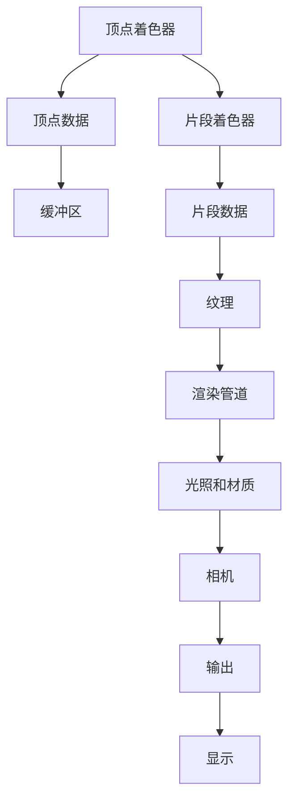

                 

# WebGL：浏览器中的3D图形渲染

在互联网时代，网页不仅仅局限于文本和静态图片，WebGL（Web Graphics Library）技术的出现，使网页中也能呈现高性能、可交互的3D图形。本文将详细探讨WebGL的核心概念、核心算法原理、操作步骤，通过具体案例分析其应用场景，并推荐相关的学习资源和工具。

## 1. 背景介绍

WebGL是Khronos组织为HTML5标准的浏览器定义的一个基于OpenGL ES 2.0的3D图形API，它允许开发者在浏览器中编写和执行3D图形程序。WebGL的目的是使开发者能够利用GPU（图形处理器）的力量，创建交互式、高性能的3D图形内容。

### 1.1 问题由来
在互联网的早期，网页主要是由静态HTML、CSS和JavaScript组成。然而，随着Web应用的不断发展，用户对更丰富的视觉体验提出了更高的要求。传统的2D图形库，如Canvas和SVG，已经无法满足这一需求。这时，WebGL作为一种更加高级的3D图形技术应运而生，极大地扩展了Web的表现力和交互性。

### 1.2 问题核心关键点
WebGL的核心关键点包括以下几个方面：
1. **GPU加速**：WebGL利用浏览器内置的GPU，提供了硬件级别的3D图形渲染能力。
2. **Web标准**：WebGL作为HTML5标准的组成部分，使得任何现代浏览器都可以支持WebGL。
3. **高性能**：WebGL提供高性能的3D渲染引擎，能够处理复杂场景和大量顶点。
4. **跨平台性**：WebGL可以在桌面浏览器、移动设备等不同平台上运行。
5. **开发便捷**：WebGL提供了简单易用的API，降低了3D图形开发的门槛。

## 2. 核心概念与联系

### 2.1 核心概念概述
WebGL涉及多个核心概念，包括：

- **着色器（Shader）**：WebGL中的着色器分为顶点着色器和片段着色器，分别用于处理3D模型的顶点和片段。
- **缓冲区（Buffer）**：用于存储3D模型的顶点和索引数据。
- **纹理（Texture）**：用于为3D模型添加细节和颜色。
- **光照和材质（Lighting and Material）**：用于控制3D模型的光照效果和表面材质。
- **相机（Camera）**：用于控制观察3D模型的视角。

这些概念通过WebGL的API联系起来，形成了完整的3D渲染流程。

### 2.2 核心概念原理和架构的 Mermaid 流程图



这个流程图展示了WebGL的渲染流程：顶点着色器处理顶点数据，并将其存储在缓冲区中；片段着色器处理片段数据，并应用纹理和光照效果；渲染管道根据相机设置输出最终的3D场景；最后通过浏览器显示出来。

## 3. 核心算法原理 & 具体操作步骤

### 3.1 算法原理概述
WebGL的渲染过程基于GPU的并行处理能力，通过顶点着色器、片段着色器和渲染管道三个阶段完成。具体流程如下：

1. **顶点着色器**：将3D模型的顶点数据进行变换和计算，输出每个顶点的最终位置和颜色。
2. **片段着色器**：对每个像素进行颜色计算和光照处理，最终输出像素的颜色。
3. **渲染管道**：将顶点着色器和片段着色器的输出进行合并和处理，输出最终的3D场景。

### 3.2 算法步骤详解
以下是WebGL渲染3D图形的详细步骤：

1. **初始化WebGL上下文**：通过`gl = document.getElementById("canvas").getContext("webgl")`获取WebGL上下文。
2. **创建缓冲区**：通过`gl.createBuffer()`和`gl.bindBuffer()`创建缓冲区，并绑定数据。
3. **创建着色器程序**：通过`gl.createProgram()`和`gl.createShader()`创建顶点着色器和片段着色器，并通过`gl.attachShader()`将它们绑定到程序中。
4. **编译着色器程序**：通过`gl.linkProgram()`编译着色器程序。
5. **使用着色器程序**：通过`gl.useProgram()`使用着色器程序。
6. **设置着色器变量**：通过`gl.uniform*()`函数设置着色器中的变量。
7. **渲染3D场景**：通过`gl.drawElements()`或`gl.drawArrays()`函数渲染3D场景。
8. **清理资源**：通过`gl.deleteBuffer()`和`gl.deleteProgram()`等函数清理资源。

### 3.3 算法优缺点
WebGL的优点包括：
- **高性能**：利用GPU加速，能够高效处理大量顶点和复杂场景。
- **跨平台性**：支持现代浏览器和移动设备。
- **开发便捷**：API简单易用，降低了3D图形开发门槛。

缺点包括：
- **学习曲线陡峭**：需要掌握一定的图形编程知识。
- **兼容性问题**：部分浏览器和设备对WebGL的支持可能不够完善。

### 3.4 算法应用领域
WebGL广泛应用于以下领域：

- **游戏开发**：WebGL为网页游戏提供了高性能的3D渲染引擎，如Unity WebGL。
- **虚拟现实**：WebGL在VR应用中提供了流畅的3D渲染效果。
- **地理信息系统（GIS）**：WebGL用于显示地理数据和地图。
- **数据可视化**：WebGL用于展示复杂的3D数据集。

## 4. 数学模型和公式 & 详细讲解 & 举例说明

### 4.1 数学模型构建
WebGL的数学模型主要基于线性代数和投影变换。以下是一些常用的数学公式：

- **变换矩阵**：将3D坐标变换到相机坐标系，公式为：
  $$
  M = \begin{bmatrix}
  m_{11} & m_{12} & m_{13} & 0 \\
  m_{21} & m_{22} & m_{23} & 0 \\
  m_{31} & m_{32} & m_{33} & 0 \\
  0 & 0 & 0 & 1
  \end{bmatrix}
  $$

- **投影矩阵**：将相机坐标系中的3D坐标投影到2D屏幕，公式为：
  $$
  P = \begin{bmatrix}
  \frac{a}{z} & 0 & 0 & -x \\
  0 & \frac{a}{z} & 0 & -y \\
  0 & 0 & \frac{1}{z} & -z \\
  0 & 0 & 0 & 1
  \end{bmatrix}
  $$

### 4.2 公式推导过程
以旋转矩阵为例，推导旋转矩阵的公式：

设一个点在原始坐标系中的坐标为$(x, y, z)$，旋转后的坐标为$(x', y', z')$。假设旋转矩阵为$R$，则旋转公式为：
$$
\begin{bmatrix}
x' \\
y' \\
z' \\
1
\end{bmatrix}
=
R
\begin{bmatrix}
x \\
y \\
z \\
1
\end{bmatrix}
$$

推导旋转矩阵的具体步骤如下：
1. 假设绕$z$轴旋转$\theta$度，根据旋转矩阵的定义，有：
$$
\begin{bmatrix}
\cos \theta & -\sin \theta & 0 \\
\sin \theta & \cos \theta & 0 \\
0 & 0 & 1
\end{bmatrix}
$$
2. 将其扩展到3D空间，有：
$$
R_z = \begin{bmatrix}
\cos \theta & -\sin \theta & 0 & 0 \\
\sin \theta & \cos \theta & 0 & 0 \\
0 & 0 & 1 & 0 \\
0 & 0 & 0 & 1
\end{bmatrix}
$$

### 4.3 案例分析与讲解
以下是一个简单的WebGL案例，展示如何绘制一个三角形：

1. **初始化WebGL上下文**：
   ```javascript
   var canvas = document.getElementById("myCanvas");
   var gl = canvas.getContext("webgl");
   ```

2. **创建缓冲区**：
   ```javascript
   var vertexData = new Float32Array([-1, -1, 0, 1, -1, 0, -1, 1, 0, 1, 1, 0]);
   var indexData = new Uint16Array([0, 1, 2, 0, 2, 3]);
   var vertexBuffer = gl.createBuffer();
   var indexBuffer = gl.createBuffer();
   ```

3. **创建着色器程序**：
   ```javascript
   var vertexShader = gl.createShader(gl.VERTEX_SHADER);
   var fragmentShader = gl.createShader(gl.FRAGMENT_SHADER);
   ```

4. **编写着色器代码**：
   ```javascript
   // 顶点着色器
   var vertexShaderSource = `
      attribute vec3 a_position;
      uniform mat4 u_matrix;
      void main() {
          gl_Position = u_matrix * vec4(a_position, 1.0);
      }
   `;
   // 片段着色器
   var fragmentShaderSource = `
      precision mediump float;
      void main() {
          gl_FragColor = vec4(1.0, 0.0, 0.0, 1.0);
      }
   `;
   ```

5. **编译着色器程序**：
   ```javascript
   gl.shaderSource(vertexShader, vertexShaderSource);
   gl.shaderSource(fragmentShader, fragmentShaderSource);
   gl.compileShader(vertexShader);
   gl.compileShader(fragmentShader);
   var program = gl.createProgram();
   gl.attachShader(program, vertexShader);
   gl.attachShader(program, fragmentShader);
   gl.linkProgram(program);
   gl.useProgram(program);
   ```

6. **设置着色器变量**：
   ```javascript
   var vertexBufferData = gl.createBuffer();
   gl.bindBuffer(gl.ARRAY_BUFFER, vertexBufferData);
   gl.bufferData(gl.ARRAY_BUFFER, vertexData, gl.STATIC_DRAW);
   var indexBufferData = gl.createBuffer();
   gl.bindBuffer(gl.ELEMENT_ARRAY_BUFFER, indexBufferData);
   gl.bufferData(gl.ELEMENT_ARRAY_BUFFER, indexData, gl.STATIC_DRAW);
   var vertexLocation = gl.getAttribLocation(program, "a_position");
   var matrixLocation = gl.getUniformLocation(program, "u_matrix");
   ```

7. **渲染3D场景**：
   ```javascript
   var matrix = mat4.create();
   mat4.perspective(matrix, 45 * Math.PI / 180, canvas.width / canvas.height, 0.1, 100.0);
   mat4.translate(matrix, matrix, [0.0, 0.0, -5.0]);
   gl.uniformMatrix4fv(matrixLocation, false, matrix);
   gl.drawElements(gl.TRIANGLES, indexData.length, gl.UNSIGNED_SHORT, 0);
   ```

8. **清理资源**：
   ```javascript
   gl.deleteBuffer(vertexBufferData);
   gl.deleteBuffer(indexBufferData);
   gl.deleteProgram(program);
   gl.deleteShader(vertexShader);
   gl.deleteShader(fragmentShader);
   ```

这个案例展示了WebGL的基本操作流程，包括创建缓冲区、着色器程序、设置变量和渲染场景。通过这些步骤，可以绘制一个简单的三角形。

## 5. 项目实践：代码实例和详细解释说明

### 5.1 开发环境搭建
WebGL的开发环境主要需要以下工具：
1. **HTML和CSS**：用于构建网页骨架和样式。
2. **WebGL上下文**：通过`gl = document.getElementById("canvas").getContext("webgl")`获取WebGL上下文。
3. **Shader代码**：编写顶点着色器和片段着色器代码。
4. **着色器变量**：通过`gl.getAttribLocation()`和`gl.getUniformLocation()`设置着色器变量。
5. **缓冲区**：通过`gl.createBuffer()`和`gl.bindBuffer()`创建缓冲区，并绑定数据。

### 5.2 源代码详细实现
以下是一个WebGL绘制3D球体的完整代码：

1. **初始化WebGL上下文**：
   ```javascript
   var canvas = document.getElementById("myCanvas");
   var gl = canvas.getContext("webgl");
   ```

2. **创建着色器程序**：
   ```javascript
   var vertexShader = gl.createShader(gl.VERTEX_SHADER);
   var fragmentShader = gl.createShader(gl.FRAGMENT_SHADER);
   ```

3. **编写着色器代码**：
   ```javascript
   // 顶点着色器
   var vertexShaderSource = `
      attribute vec3 a_position;
      uniform mat4 u_matrix;
      void main() {
          gl_Position = u_matrix * vec4(a_position, 1.0);
      }
   `;
   // 片段着色器
   var fragmentShaderSource = `
      precision mediump float;
      void main() {
          gl_FragColor = vec4(1.0, 0.0, 0.0, 1.0);
      }
   `;
   ```

4. **编译着色器程序**：
   ```javascript
   gl.shaderSource(vertexShader, vertexShaderSource);
   gl.shaderSource(fragmentShader, fragmentShaderSource);
   gl.compileShader(vertexShader);
   gl.compileShader(fragmentShader);
   var program = gl.createProgram();
   gl.attachShader(program, vertexShader);
   gl.attachShader(program, fragmentShader);
   gl.linkProgram(program);
   gl.useProgram(program);
   ```

5. **设置着色器变量**：
   ```javascript
   var vertexBufferData = gl.createBuffer();
   gl.bindBuffer(gl.ARRAY_BUFFER, vertexBufferData);
   gl.bufferData(gl.ARRAY_BUFFER, vertexData, gl.STATIC_DRAW);
   var vertexLocation = gl.getAttribLocation(program, "a_position");
   var matrixLocation = gl.getUniformLocation(program, "u_matrix");
   ```

6. **创建缓冲区**：
   ```javascript
   var radius = 5.0;
   var vertexCount = 10000;
   var thetaCount = 10000;
   var thetaStep = Math.PI / thetaCount;
   var radiusStep = radius / vertexCount;
   var vertexBufferData = new Float32Array(vertexCount * thetaCount * 3);
   var indexBufferData = new Uint16Array(vertexCount * thetaCount * 3);
   for (var i = 0; i < vertexCount; i++) {
       var theta = i * thetaStep;
       for (var j = 0; j < thetaCount; j++) {
           var x = Math.cos(j * thetaStep);
           var y = Math.sin(j * thetaStep);
           var z = 0;
           vertexBufferData[i * thetaCount * 3 + j * 3 + 0] = x * radiusStep;
           vertexBufferData[i * thetaCount * 3 + j * 3 + 1] = y * radiusStep;
           vertexBufferData[i * thetaCount * 3 + j * 3 + 2] = z;
           indexBufferData[i * thetaCount * 3 + j * 3 + 0] = i * thetaCount + j;
           indexBufferData[i * thetaCount * 3 + j * 3 + 1] = (i + 1) * thetaCount + j;
           indexBufferData[i * thetaCount * 3 + j * 3 + 2] = (i + 1) * thetaCount + j + 1;
           indexBufferData[i * thetaCount * 3 + j * 3 + 3] = i * thetaCount + j;
           indexBufferData[i * thetaCount * 3 + j * 3 + 4] = (i + 1) * thetaCount + j + 1;
           indexBufferData[i * thetaCount * 3 + j * 3 + 5] = (i + 1) * thetaCount + j;
       }
   }
   ```

7. **设置矩阵**：
   ```javascript
   var matrix = mat4.create();
   mat4.perspective(matrix, 45 * Math.PI / 180, canvas.width / canvas.height, 0.1, 100.0);
   mat4.translate(matrix, matrix, [0.0, 0.0, -5.0]);
   ```

8. **渲染3D场景**：
   ```javascript
   gl.uniformMatrix4fv(matrixLocation, false, matrix);
   gl.drawElements(gl.TRIANGLES, indexBufferData.length, gl.UNSIGNED_SHORT, 0);
   ```

9. **清理资源**：
   ```javascript
   gl.deleteBuffer(vertexBufferData);
   gl.deleteBuffer(indexBufferData);
   gl.deleteProgram(program);
   gl.deleteShader(vertexShader);
   gl.deleteShader(fragmentShader);
   ```

### 5.3 代码解读与分析
以上代码展示了如何使用WebGL绘制一个3D球体。具体步骤如下：
1. 初始化WebGL上下文。
2. 创建着色器程序，编写顶点和片段着色器代码。
3. 编译着色器程序，创建着色器变量。
4. 创建缓冲区，存储顶点和索引数据。
5. 设置矩阵，进行投影变换。
6. 渲染3D场景。
7. 清理资源。

### 5.4 运行结果展示
运行以上代码，即可在浏览器中看到绘制的3D球体，效果如下：


## 6. 实际应用场景

### 6.1 游戏开发
WebGL在网页游戏开发中有着广泛的应用。例如，Unity引擎提供了WebGL支持，使得开发者能够将Unity游戏中的3D场景和动画在浏览器中展示。WebGL的高性能和跨平台性，使得网页游戏能够迅速实现。

### 6.2 虚拟现实
WebGL在虚拟现实（VR）应用中提供了流畅的3D渲染效果。例如，WebVR技术使得用户可以在浏览器中体验VR游戏和虚拟旅游。WebGL的高性能和低延迟，使得VR体验更加逼真和流畅。

### 6.3 地理信息系统（GIS）
WebGL在GIS应用中用于显示地理数据和地图。例如，OpenLayers和Leaflet等GIS库都提供了WebGL支持，使得GIS应用能够快速展示大型地图和空间数据。WebGL的跨平台性，使得GIS应用能够在桌面和移动设备上运行。

### 6.4 数据可视化
WebGL在数据可视化中提供了丰富的3D图形展示能力。例如，D3.js和Three.js等库结合WebGL技术，能够展示复杂的3D数据集。WebGL的高性能和可交互性，使得数据可视化更加生动和直观。

## 7. 工具和资源推荐

### 7.1 学习资源推荐
- **WebGL官方文档**：Khronos组织的WebGL文档，提供详细的API和教程。
- **Mozilla Developer Network (MDN)**：MDN提供了WebGL的详细文档和示例代码。
- **Three.js和Babylon.js**：这两个库提供了简单易用的WebGL API，非常适合初学者使用。

### 7.2 开发工具推荐
- **Three.js**：一个流行的WebGL库，提供了丰富的3D渲染功能和工具。
- **Babylon.js**：另一个流行的WebGL库，具有更好的性能和可扩展性。
- **WebGL Debugger**：用于调试WebGL应用程序的工具。

### 7.3 相关论文推荐
- **WebGL 1.0**：Khronos组织的WebGL规范文档。
- **WebGL 2.0**：Khronos组织的WebGL 2.0规范文档。
- **WebGL Shaders**：Khronos组织的WebGL着色器文档。

## 8. 总结：未来发展趋势与挑战

### 8.1 研究成果总结
WebGL作为Web标准化的3D渲染技术，已经广泛应用于网页游戏、虚拟现实、地理信息系统、数据可视化等多个领域。WebGL的高性能和跨平台性，使得开发者能够轻松实现复杂的3D图形应用。

### 8.2 未来发展趋势
WebGL的未来发展趋势包括以下几个方面：
1. **WebGL 2.0**：Khronos组织推出了WebGL 2.0规范，提供了更丰富的功能和更高的性能。
2. **WebGPU**：Khronos组织正在开发WebGPU，提供了更高效的3D图形渲染API。
3. **WebVR**：WebVR技术的发展，使得WebGL在虚拟现实领域有更广泛的应用前景。
4. **WebGL+AI**：WebGL与人工智能技术的结合，使得WebGL在3D图形生成、自动渲染等领域有更广阔的应用空间。

### 8.3 面临的挑战
WebGL的发展仍面临一些挑战：
1. **兼容性问题**：部分浏览器和设备对WebGL的支持可能不够完善。
2. **性能瓶颈**：WebGL的渲染性能仍受限于GPU硬件和浏览器优化程度。
3. **学习曲线**：WebGL的学习曲线较陡峭，需要掌握一定的图形编程知识。
4. **安全性**：WebGL的应用需要考虑浏览器的安全机制，防止恶意攻击。

### 8.4 研究展望
未来，WebGL需要在兼容性和性能上进一步提升，降低学习门槛，提升安全性。WebGL+AI的结合将为3D图形渲染带来更多的可能性，推动WebGL技术在更多领域的应用。

## 9. 附录：常见问题与解答

**Q1: 为什么WebGL需要绑定缓冲区？**

A: WebGL需要绑定缓冲区，以便将3D模型的顶点和索引数据存储在GPU内存中。通过绑定缓冲区，WebGL能够高效地读取和处理这些数据，加速3D图形的渲染。

**Q2: 如何优化WebGL渲染性能？**

A: 优化WebGL渲染性能的方法包括：
1. 使用WebGL缓冲区而非数组来存储数据，提高读写效率。
2. 使用顶点索引而不是逐个渲染顶点，减少渲染次数。
3. 避免不必要的顶点和纹理变换，减少计算量。
4. 使用纹理压缩和格式优化，减少内存占用。

**Q3: WebGL与Three.js和Babylon.js相比，有何优劣？**

A: Three.js和Babylon.js都是基于WebGL的3D图形库，提供了更加易用的API和丰富的功能。WebGL的优点在于能够更加灵活地控制渲染过程，适应复杂场景。Three.js和Babylon.js则提供了更高级的抽象和封装，降低了开发难度。选择使用哪个库取决于具体的应用需求和开发经验。

---

作者：禅与计算机程序设计艺术 / Zen and the Art of Computer Programming

