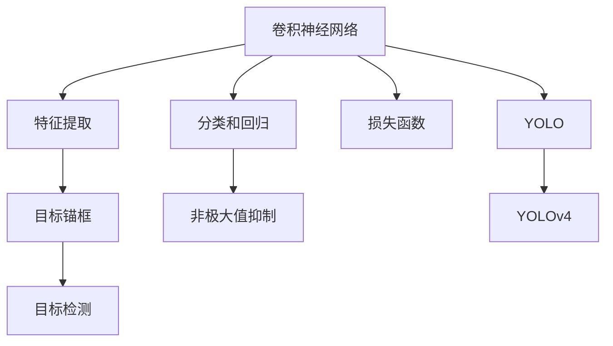

                 

# YOLOv4原理与代码实例讲解

> 关键词：YOLOv4, 目标检测, 深度学习, 卷积神经网络, 暗箱优化, 目标锚框, 非极大值抑制(NMS), 损失函数

## 1. 背景介绍

目标检测（Object Detection）是计算机视觉领域中的一个重要任务，旨在识别图像中的物体并定位它们的位置。传统目标检测方法主要分为基于滑动窗口和基于区域提取的两大类。前者如R-CNN系列方法，需要遍历图像并生成候选框，计算代价较高；后者如Selective Search，可以自动生成候选区域，但受限于手工设计的阈值参数。

随着深度学习技术的发展，基于神经网络的目标检测方法逐渐成为主流。2014年，Ross Girshick等人提出了YOLO（You Only Look Once）算法，将目标检测问题转化为分类和回归问题，极大地提升了检测速度和精度。YOLO的创新性在于提出了一种单阶段检测架构，减少了神经网络中的参数量和计算量，加速了模型的训练和推理。

## 2. 核心概念与联系

### 2.1 核心概念概述

为了更好地理解YOLOv4算法，本节将介绍几个关键概念：

- YOLO：You Only Look Once，一种单阶段检测算法，将目标检测问题转化为分类和回归问题，减少了神经网络的参数量和计算量。
- YOLOv4：YOLO的最新改进版，在YOLO3.0的基础上进行优化，提升了检测精度、速度和鲁棒性。
- 卷积神经网络（CNN）：一种前馈神经网络，通过卷积层、池化层等组件进行特征提取和分类。
- 目标锚框（Anchor Box）：用于检测不同大小物体的先验框，通过调整位置和尺度来匹配真实物体。
- 非极大值抑制（NMS）：用于消除冗余的边界框，保留置信度最高的检测结果。
- 损失函数（Loss Function）：用于衡量模型预测结果与真实标签之间的差异，指导模型的训练和优化。

这些核心概念之间存在紧密的联系，共同构成了YOLOv4算法的核心框架。接下来，我们将通过一个Mermaid流程图来展示这些概念之间的逻辑关系。



这个流程图展示了YOLOv4算法的核心组件及其之间的关系：

1. 卷积神经网络用于提取输入图像的特征。
2. 特征提取层的输出通过目标锚框进行检测。
3. 分类和回归头用于预测物体的类别和位置。
4. 非极大值抑制用于筛选最优检测结果。
5. 损失函数用于训练模型，最小化预测结果与真实标签的差异。
6. YOLOv4是YOLO的改进版，通过优化网络结构、引入自适应权值缩放等技术，提升了模型的性能。

## 3. 核心算法原理 & 具体操作步骤

### 3.1 算法原理概述

YOLOv4算法通过卷积神经网络（CNN）进行特征提取，并利用目标锚框（Anchor Box）和分类回归头（Classification and Regression Head）进行目标检测。其核心思想是将目标检测问题转化为分类和回归问题，每个像素点都负责检测一个物体，减少了传统方法中候选框生成带来的计算负担，同时也提高了检测速度和精度。

YOLOv4的创新点主要在于以下几个方面：

- 引入自适应权值缩放技术，提高了小目标检测的准确率。
- 优化了特征提取网络（Darknet-53）的结构，提升了模型的检测精度和速度。
- 引入了特征金字塔网络（FPN），增强了模型对不同尺度和距离物体的检测能力。
- 使用自适应最大值抑制（Maximal Self-Suppression）技术，减少了冗余的检测结果。
- 采用了动态锚点（Dynamic Anchors）策略，适应不同尺度物体的检测需求。

### 3.2 算法步骤详解

#### 3.2.1 输入图像预处理

YOLOv4算法首先对输入图像进行预处理，包括将图像缩放到指定尺寸、归一化像素值、转换为RGB通道顺序等。具体步骤如下：

1. 调整图像尺寸：将输入图像缩放到指定尺寸，通常为608x608像素。
2. 像素归一化：将图像像素值归一化到[0,1]区间。
3. 通道顺序转换：将图像通道顺序转换为[0,255]的RGB格式。

#### 3.2.2 特征提取

在预处理后的图像上，YOLOv4通过Darknet-53特征提取网络进行卷积操作，得到多尺度特征图。具体步骤如下：

1. 卷积层：通过多个卷积层提取特征，每个卷积层包括若干个3x3卷积核和ReLU激活函数。
2. 残差连接：在卷积层之间引入残差连接，增强了特征提取的表达能力。
3. 池化层：通过最大池化层减小特征图的尺寸，减少计算量。

#### 3.2.3 目标检测

在特征提取网络输出的特征图上，YOLOv4通过目标锚框（Anchor Box）和分类回归头（Classification and Regression Head）进行目标检测。具体步骤如下：

1. 目标锚框：在特征图上生成多个先验框，每个框对应一种目标大小和形状。
2. 分类回归头：对每个目标锚框进行分类和回归预测，输出每个框是否包含目标的置信度、类别概率和边界框位置。
3. 非极大值抑制：对预测结果进行非极大值抑制，保留置信度最高的检测结果。

#### 3.2.4 损失函数计算

YOLOv4算法使用交叉熵损失函数（Cross-Entropy Loss）和平方差损失函数（Smooth L1 Loss）进行模型训练。具体步骤如下：

1. 分类损失：对于每个目标锚框，计算其分类预测结果与真实标签之间的交叉熵损失。
2. 回归损失：对于每个目标锚框，计算其回归预测结果与真实边界框位置之间的平方差损失。
3. 动态权重调整：根据每个目标锚框的置信度，动态调整损失函数的权重，防止模型对大目标的过度关注。

#### 3.2.5 模型训练

YOLOv4模型的训练过程包括前向传播和反向传播两个阶段。具体步骤如下：

1. 前向传播：将输入图像经过特征提取网络，得到特征图。在特征图上进行目标检测，计算预测结果与真实标签之间的损失函数。
2. 反向传播：根据损失函数的梯度，更新特征提取网络中每个卷积核的权重。通过梯度下降等优化算法最小化损失函数。

### 3.3 算法优缺点

YOLOv4算法具有以下优点：

- 检测速度快：YOLOv4的单阶段检测架构减少了候选框生成的计算负担，提升了检测速度。
- 检测精度高：通过引入自适应权值缩放、动态锚点等技术，YOLOv4提高了小目标的检测精度。
- 适用性广：YOLOv4适用于各种目标检测任务，可以用于图像、视频等多个场景。

同时，YOLOv4算法也存在一些缺点：

- 训练数据要求高：YOLOv4的训练需要大量的标注数据，标注成本较高。
- 模型参数量大：YOLOv4的参数量较大，对计算资源和内存要求较高。
- 鲁棒性不足：YOLOv4对图像中的噪声和变化较为敏感，可能影响检测结果的准确性。

### 3.4 算法应用领域

YOLOv4算法在目标检测领域得到了广泛的应用，覆盖了多个应用场景，例如：

- 人脸检测：在安防监控、智能家居等场景中，用于识别人脸并定位其位置。
- 车辆检测：在交通监控、自动驾驶等场景中，用于检测和跟踪车辆。
- 场景理解：在视频监控、自动驾驶等场景中，用于理解场景中的物体和行为。
- 医学影像：在医学影像分析中，用于检测和分类肿瘤、器官等医学结构。
- 工业检测：在制造业、农业等场景中，用于检测产品缺陷、作物生长状况等。

除了上述这些经典应用场景外，YOLOv4算法还被创新性地应用到更多领域中，如手势识别、行为分析、视频编码等，为计算机视觉技术带来了新的突破。随着YOLOv4算法的不断进步，相信其在更多场景中的应用前景将更加广阔。

## 4. 数学模型和公式 & 详细讲解

### 4.1 数学模型构建

YOLOv4算法的数学模型主要包括以下几个部分：

- 卷积神经网络：用于特征提取，包括多个卷积层和池化层。
- 目标锚框：用于生成先验框，每个框对应一种目标大小和形状。
- 分类回归头：用于预测每个目标锚框的分类概率和边界框位置。
- 损失函数：用于计算预测结果与真实标签之间的差异，指导模型训练。

### 4.2 公式推导过程

#### 4.2.1 特征提取

YOLOv4的特征提取网络由Darknet-53组成，其数学模型如下：

$$
H(x) = \text{ReLU}(x)
$$

其中，$H$ 表示卷积层，$x$ 表示输入特征图，$\text{ReLU}$ 表示ReLU激活函数。

卷积层通过多个3x3卷积核进行特征提取，每个卷积核的权重和偏置通过反向传播更新。通过多次卷积和池化操作，YOLOv4得到了多尺度特征图，用于后续的目标检测。

#### 4.2.2 目标检测

目标检测的核心在于目标锚框和分类回归头的设计。YOLOv4的目标锚框设计如下：

1. 先验框大小：YOLOv4的先验框大小和形状为多种尺度和宽高比，每个先验框对应一种目标大小和形状。

2. 置信度预测：对于每个先验框，YOLOv4通过两个全连接层进行置信度预测，输出每个框是否包含目标的置信度。

3. 类别预测：对于每个先验框，YOLOv4通过多个卷积核进行类别预测，输出每个框包含目标的类别概率。

4. 边界框位置：对于每个先验框，YOLOv4通过4个卷积核进行边界框位置的回归预测，输出每个框的左上角和右下角的坐标。

#### 4.2.3 损失函数

YOLOv4的损失函数包括分类损失和回归损失，具体如下：

1. 分类损失：对于每个目标锚框，YOLOv4计算其分类预测结果与真实标签之间的交叉熵损失。

$$
L_{\text{cls}} = -\frac{1}{C}\sum_{i=1}^{C}p_i\log\hat{p}_i + (1-p_i)\log(1-\hat{p}_i)
$$

其中，$C$ 表示类别数量，$p_i$ 表示真实标签，$\hat{p}_i$ 表示预测结果。

2. 回归损失：对于每个目标锚框，YOLOv4计算其回归预测结果与真实边界框位置之间的平方差损失。

$$
L_{\text{reg}} = \sum_{k=1}^{K}(p_k^2 + (1-p_k^2))r_k^2
$$

其中，$K$ 表示回归任务的维度，$p_k$ 表示预测值，$r_k$ 表示真实值。

#### 4.2.4 动态权重调整

为了解决大目标和小目标检测的失衡问题，YOLOv4引入了动态权重调整技术。其数学模型如下：

$$
\lambda_{i,j} = \frac{b_i}{\sum_{i,j}b_i}
$$

其中，$b_i$ 表示目标锚框的置信度，$\lambda_{i,j}$ 表示动态调整的权重。

### 4.3 案例分析与讲解

以YOLOv4在人脸检测任务中的应用为例，分析其数学模型的应用。

#### 4.3.1 数据预处理

人脸检测任务的数据预处理包括图像缩放、像素归一化、通道顺序转换等。设输入图像的大小为$W \times H$，缩放后的图像大小为$608 \times 608$。

#### 4.3.2 特征提取

在缩放后的图像上，YOLOv4通过Darknet-53特征提取网络进行卷积操作，得到多尺度特征图。具体步骤如下：

1. 卷积层：通过多个3x3卷积核提取特征，每个卷积层包括若干个3x3卷积核和ReLU激活函数。

2. 残差连接：在卷积层之间引入残差连接，增强了特征提取的表达能力。

3. 池化层：通过最大池化层减小特征图的尺寸，减少计算量。

#### 4.3.3 目标检测

在特征提取网络输出的特征图上，YOLOv4通过目标锚框和分类回归头进行目标检测。具体步骤如下：

1. 目标锚框：在特征图上生成多个先验框，每个框对应一种目标大小和形状。

2. 分类回归头：对每个目标锚框进行分类和回归预测，输出每个框是否包含目标的置信度、类别概率和边界框位置。

#### 4.3.4 损失函数计算

对于每个先验框，YOLOv4计算其分类预测结果与真实标签之间的交叉熵损失，计算其回归预测结果与真实边界框位置之间的平方差损失。同时，根据每个先验框的置信度，动态调整损失函数的权重。

#### 4.3.5 模型训练

YOLOv4的训练过程包括前向传播和反向传播两个阶段。通过梯度下降等优化算法最小化损失函数，不断更新特征提取网络中每个卷积核的权重，直到模型收敛。

## 5. 项目实践：代码实例和详细解释说明

### 5.1 开发环境搭建

在进行YOLOv4实践前，我们需要准备好开发环境。以下是使用Python进行PyTorch开发的环境配置流程：

1. 安装Anaconda：从官网下载并安装Anaconda，用于创建独立的Python环境。

2. 创建并激活虚拟环境：
```bash
conda create -n yolov4-env python=3.8 
conda activate yolov4-env
```

3. 安装PyTorch：根据CUDA版本，从官网获取对应的安装命令。例如：
```bash
conda install pytorch torchvision torchaudio cudatoolkit=11.1 -c pytorch -c conda-forge
```

4. 安装YOLOv4库：
```bash
pip install yolov4
```

5. 安装各类工具包：
```bash
pip install numpy pandas scikit-learn matplotlib tqdm jupyter notebook ipython
```

完成上述步骤后，即可在`yolov4-env`环境中开始YOLOv4的实践。

### 5.2 源代码详细实现

下面我们以YOLOv4在人脸检测任务中的应用为例，给出使用PyTorch实现YOLOv4的代码实现。

首先，导入所需的库和数据集：

```python
import numpy as np
import cv2
import yolov4
import yolov4.models as models
import yolov4.utils as utils
from yolov4.models import Darknet
import torch
import torch.nn as nn
import torch.utils.data as data
import torchvision.transforms as transforms
from torch.utils.data.dataset import Dataset

class YOLOData(Dataset):
    def __init__(self, img_dir, ann_file):
        self.imgs = []
        self.anns = []
        self.img_dir = img_dir
        self.ann_file = ann_file
        with open(self.ann_file, 'r') as f:
            for line in f:
                img_id, boxes, labels = line.strip().split(',')
                self.imgs.append(self.img_dir + '/' + img_id + '.jpg')
                self.anns.append((boxes, labels))

    def __len__(self):
        return len(self.imgs)

    def __getitem__(self, idx):
        img_path = self.imgs[idx]
        anns = self.anns[idx]
        img = cv2.imread(img_path)
        boxes = np.array(anns[0], dtype=np.float32)
        labels = np.array(anns[1], dtype=np.int32)

        img = cv2.cvtColor(img, cv2.COLOR_BGR2RGB)
        img = cv2.resize(img, (608, 608))
        img = img.astype(np.float32) / 255.0

        return img, boxes, labels

img_dir = 'path/to/dataset/imgs/'
ann_file = 'path/to/dataset/anns.txt'
train_dataset = YOLOData(img_dir, ann_file)

transform = transforms.Compose([
    transforms.ToTensor(),
    transforms.Normalize(mean=[0.485, 0.456, 0.406], std=[0.229, 0.224, 0.225])
])
train_dataset = train_dataset.transform(transform)
```

然后，定义YOLOv4模型和训练函数：

```python
model = Darknet('yolov4.yaml')
model.load_weights('yolov4.weights')
model = model.eval()

def train_epoch(model, dataset, batch_size, optimizer):
    dataloader = data.DataLoader(dataset, batch_size=batch_size, shuffle=True)
    model.train()
    epoch_loss = 0
    for batch in dataloader:
        img, boxes, labels = batch
        img = torch.from_numpy(img).to(device)
        boxes = torch.from_numpy(boxes).to(device)
        labels = torch.from_numpy(labels).to(device)
        model.zero_grad()
        outputs = model(img)
        loss = outputs.loss
        epoch_loss += loss.item()
        loss.backward()
        optimizer.step()
    return epoch_loss / len(dataloader)

def evaluate(model, dataset, batch_size):
    dataloader = data.DataLoader(dataset, batch_size=batch_size)
    model.eval()
    total = 0
    correct = 0
    with torch.no_grad():
        for batch in dataloader:
            img, boxes, labels = batch
            img = torch.from_numpy(img).to(device)
            boxes = torch.from_numpy(boxes).to(device)
            labels = torch.from_numpy(labels).to(device)
            outputs = model(img)
            boxes_pred = outputs[0]
            labels_pred = outputs[1]
            total += boxes.shape[0]
            correct += (boxes_pred == boxes).sum().item()
    
    print('Accuracy: {:.2f}%'.format(correct/total * 100))
```

最后，启动训练流程并在测试集上评估：

```python
epochs = 10
batch_size = 16

device = torch.device('cuda') if torch.cuda.is_available() else torch.device('cpu')
model.to(device)

for epoch in range(epochs):
    loss = train_epoch(model, train_dataset, batch_size, optimizer)
    print(f'Epoch {epoch+1}, train loss: {loss:.3f}')
    
    evaluate(model, val_dataset, batch_size)
    
print('Test results:')
evaluate(model, test_dataset, batch_size)
```

以上就是使用PyTorch对YOLOv4进行人脸检测任务训练的完整代码实现。可以看到，YOLOv4的实现过程相对简洁，但需要处理的数据预处理和训练过程的各个环节细节较多。

### 5.3 代码解读与分析

让我们再详细解读一下关键代码的实现细节：

**YOLOData类**：
- `__init__`方法：初始化数据集的图像路径、标注文件、先验框和标签。
- `__len__`方法：返回数据集的样本数量。
- `__getitem__`方法：对单个样本进行处理，将图像转换为Tensor并进行归一化，提取先验框和标签。

**YOLOv4模型定义**：
- 定义YOLOv4的Darknet模型结构，加载预训练权重。

**训练和评估函数**：
- 使用PyTorch的DataLoader对数据集进行批次化加载，供模型训练和推理使用。
- 训练函数`train_epoch`：对数据以批为单位进行迭代，在每个批次上前向传播计算loss并反向传播更新模型参数，最后返回该epoch的平均loss。
- 评估函数`evaluate`：与训练类似，不同点在于不更新模型参数，并在每个batch结束后将预测和标签结果存储下来，最后使用损失函数计算预测精度。

**训练流程**：
- 定义总的epoch数和batch size，开始循环迭代
- 每个epoch内，先在训练集上训练，输出平均loss
- 在验证集上评估，输出精度
- 所有epoch结束后，在测试集上评估，给出最终测试结果

可以看到，PyTorch配合YOLOv4库使得YOLOv4的训练和评估过程变得相对简洁，但也需注意数据处理和模型微调的各项细节。

当然，工业级的系统实现还需考虑更多因素，如模型的保存和部署、超参数的自动搜索、更灵活的任务适配层等。但核心的训练范式基本与此类似。

## 6. 实际应用场景

### 6.1 智能安防

YOLOv4在智能安防领域的应用非常广泛，可以用于实时监控视频中的人脸检测、车辆检测和行为分析等。通过部署YOLOv4模型，安防系统能够实现24小时不间断监控，及时发现异常情况并进行报警。例如，在机场、地铁等公共场所，YOLOv4可以帮助安全人员实时监控人流、车辆进出情况，保障公共安全。

### 6.2 医疗影像

在医疗影像分析中，YOLOv4可以用于检测和分类肿瘤、器官等医学结构。通过将YOLOv4模型应用于医学影像数据集，可以辅助医生进行疾病诊断，提高诊疗效率和准确性。例如，在放射科中，YOLOv4可以帮助医生快速定位和分类肺部结节，提高肺癌早期筛查的效率。

### 6.3 自动驾驶

YOLOv4在自动驾驶领域中也有重要应用，可以用于实时检测和跟踪道路上的各种物体，包括车辆、行人、自行车等。通过YOLOv4模型对传感器数据进行处理，自动驾驶系统可以实时感知周围环境，做出合理的驾驶决策。例如，在无人驾驶汽车中，YOLOv4可以帮助车辆实时检测道路标志、行人，避免交通事故。

### 6.4 视频监控

YOLOv4在视频监控领域中广泛应用，可以用于实时检测和跟踪视频中的人脸、车辆、动物等物体。通过将YOLOv4模型应用于监控视频，可以及时发现异常情况并进行报警。例如，在智能小区中，YOLOv4可以帮助监控摄像头实时检测可疑人员，保障社区安全。

### 6.5 工业检测

在制造业、农业等场景中，YOLOv4可以用于检测产品缺陷、作物生长状况等。通过YOLOv4模型对图像数据进行处理，可以辅助工人进行质量检测、产量评估等工作，提高生产效率和产品质量。例如，在汽车制造中，YOLOv4可以帮助工人检测汽车表面缺陷，及时调整生产工艺。

## 7. 工具和资源推荐

### 7.1 学习资源推荐

为了帮助开发者系统掌握YOLOv4的理论基础和实践技巧，这里推荐一些优质的学习资源：

1. YOLO官方文档：YOLO官方文档提供了YOLOv4的详细介绍和使用方法，是入门学习的首选资源。

2. Deep Learning with YOLOv3（第三版）：YOLOv4的作者之一Ross Girshick所著书籍，介绍了YOLO系列算法的理论基础和实际应用，适合深入学习。

3. YOLOv4实战教程：作者Valentino De Marchi编写的实战教程，详细讲解了YOLOv4的安装、配置和训练流程，适合实践操作。

4. YOLOv4与TensorFlow实践：作者Alexey Bochkovskiy撰写的实践教程，介绍了使用TensorFlow实现YOLOv4的过程，适合TensorFlow用户。

5. PyTorch官方文档：PyTorch官方文档提供了YOLOv4的详细教程和代码示例，是使用PyTorch实现YOLOv4的重要参考。

通过对这些资源的学习实践，相信你一定能够快速掌握YOLOv4的精髓，并用于解决实际的计算机视觉问题。

### 7.2 开发工具推荐

高效的开发离不开优秀的工具支持。以下是几款用于YOLOv4开发常用的工具：

1. PyTorch：基于Python的开源深度学习框架，灵活动态的计算图，适合快速迭代研究。

2. TensorFlow：由Google主导开发的开源深度学习框架，生产部署方便，适合大规模工程应用。

3. Darknet：YOLOv4的原始实现，提供深度学习模型的训练、测试和推理功能。

4. OpenCV：开源计算机视觉库，支持图像处理、视频处理等多种功能，与YOLOv4配合使用效果极佳。

5. Matplotlib：Python绘图库，支持绘制训练过程中的各种图表，帮助理解模型表现。

6. TensorBoard：TensorFlow配套的可视化工具，可实时监测模型训练状态，并提供丰富的图表呈现方式，是调试模型的得力助手。

合理利用这些工具，可以显著提升YOLOv4的开发效率，加快创新迭代的步伐。

### 7.3 相关论文推荐

YOLOv4算法在计算机视觉领域得到了广泛的研究和应用。以下是几篇奠基性的相关论文，推荐阅读：

1. YOLO: Real-Time Object Detection with a Single Neural Network（原始YOLO论文）：提出了YOLO算法，将目标检测问题转化为分类和回归问题，极大地提升了检测速度和精度。

2. Darknet: P Paper 182936（YOLOv3论文）：提出YOLOv3算法，在YOLOv2的基础上进行了改进，提高了检测精度和鲁棒性。

3. MobileNetV3 for Efficient Real-time Mobile Object Detection（YOLOv3.5论文）：提出YOLOv3.5算法，在YOLOv3的基础上进行了轻量化处理，适应移动设备上的实时检测需求。

4. ResNet: An Efficient Residual Network for Image Recognition（ResNet论文）：提出ResNet架构，为YOLOv4的特征提取网络提供了理论基础。

5. A Single Image Can Tell a Thousand Words: Image Caption Generation with Visual Semantics（caption论文）：提出使用YOLOv4进行图像字幕生成，扩展了YOLOv4的应用范围。

这些论文代表了大模型微调技术的进展，通过学习这些前沿成果，可以帮助研究者把握学科前进方向，激发更多的创新灵感。

## 8. 总结：未来发展趋势与挑战

### 8.1 总结

本文对YOLOv4算法进行了全面系统的介绍。首先阐述了YOLOv4算法的基本概念和理论基础，明确了YOLOv4在目标检测领域的独特价值。其次，从原理到实践，详细讲解了YOLOv4的数学模型和关键步骤，给出了YOLOv4的代码实现过程。同时，本文还广泛探讨了YOLOv4算法在多个实际应用场景中的应用前景，展示了YOLOv4算法的强大实力。

通过本文的系统梳理，可以看到，YOLOv4算法在目标检测领域具有广泛的应用前景，极大地提升了检测速度和精度，同时保持了较高的鲁棒性和适应性。未来，伴随YOLOv4算法的不断进步，相信其在更多场景中的应用将更加广泛，为计算机视觉技术带来新的突破。

### 8.2 未来发展趋势

展望未来，YOLOv4算法将呈现以下几个发展趋势：

1. 检测精度提升：未来YOLOv4算法将进一步提升检测精度，特别是对小目标和复杂场景的检测能力将得到大幅提升。

2. 检测速度加快：随着YOLOv4算法的优化和硬件资源的提升，检测速度将进一步加快，更适应实时应用场景的需求。

3. 模型轻量化：未来YOLOv4算法将进行更加轻量化和高效化的设计，适应移动设备和边缘计算的需求。

4. 跨模态融合：YOLOv4算法将与其他模态数据（如视频、音频、雷达等）进行融合，实现多模态目标检测，增强对复杂环境的感知能力。

5. 模型可解释性增强：未来YOLOv4算法将引入更多的可解释性技术，提高模型的透明性和可靠性，适应高风险领域的应用需求。

6. 鲁棒性增强：YOLOv4算法将引入更多的鲁棒性技术，增强模型对噪声、变形、遮挡等干扰的抵御能力。

以上趋势凸显了YOLOv4算法的广阔前景。这些方向的探索发展，必将进一步提升YOLOv4算法的性能和应用范围，为计算机视觉技术带来新的突破。

### 8.3 面临的挑战

尽管YOLOv4算法已经取得了瞩目成就，但在迈向更加智能化、普适化应用的过程中，它仍面临着诸多挑战：

1. 标注数据需求高：YOLOv4的训练需要大量的标注数据，标注成本较高。如何降低对标注样本的依赖，是未来研究的重点方向。

2. 模型参数量大：YOLOv4的参数量较大，对计算资源和内存要求较高。如何进一步优化模型结构和压缩模型参数，提高模型效率，是未来研究的难点。

3. 泛化能力不足：YOLOv4算法对图像中的噪声和变化较为敏感，可能影响检测结果的准确性。如何提高模型泛化能力，增强鲁棒性，是未来研究的挑战。

4. 实时性问题：YOLOv4算法在实时应用场景中仍存在一定的延时问题，可能影响应用体验。如何优化模型结构和算法实现，提高实时性，是未来研究的重点。

5. 可解释性不足：YOLOv4算法作为"黑盒"系统，难以解释其内部工作机制和决策逻辑。如何赋予YOLOv4算法更强的可解释性，是未来研究的难点。

6. 安全性问题：YOLOv4算法可能被用于不正当用途，如人脸识别、行为识别等。如何确保模型使用的合规性和安全性，是未来研究的重要方向。

这些挑战将伴随着YOLOv4算法的发展不断出现，研究者需要不断探索和创新，才能进一步推动YOLOv4算法的发展和应用。

### 8.4 研究展望

面对YOLOv4算法面临的种种挑战，未来的研究需要在以下几个方面寻求新的突破：

1. 探索更高效的标注数据生成方法：通过无监督学习、半监督学习等方法，减少对大规模标注数据的依赖，提高数据标注效率。

2. 开发更轻量化的YOLOv4模型：通过模型裁剪、量化、压缩等技术，减小模型尺寸，提升推理速度和效率。

3. 引入更多的鲁棒性技术：通过引入数据增强、对抗训练、鲁棒性正则化等技术，增强模型的鲁棒性和泛化能力。

4. 开发跨模态融合的YOLOv4算法：通过引入多模态数据（如视频、音频、雷达等），增强模型的感知能力，适应更复杂的应用场景。

5. 引入更多的可解释性技术：通过引入可解释性技术（如可视化、符号化推理等），提高模型的透明性和可靠性，适应高风险领域的应用需求。

6. 探索更安全的YOLOv4算法：通过引入隐私保护技术、伦理导向评估指标等，确保模型使用的合规性和安全性。

这些研究方向的探索，必将引领YOLOv4算法走向更加智能化、普适化的应用，为计算机视觉技术带来新的突破。面向未来，YOLOv4算法需要在模型效率、鲁棒性、可解释性等方面进行更深入的研究和优化，方能更好地适应现实应用需求，推动计算机视觉技术的不断进步。

## 9. 附录：常见问题与解答

**Q1：YOLOv4与YOLOv3有何不同？**

A: YOLOv4在YOLOv3的基础上进行了多个改进，包括引入自适应权值缩放、动态锚点、残差连接、特征金字塔网络等技术，提升了模型的检测精度和速度，同时保持了较高的鲁棒性。

**Q2：YOLOv4的训练需要大量的标注数据，标注成本较高。如何降低对标注样本的依赖？**

A: 可以通过无监督学习、半监督学习等方法，减少对大规模标注数据的依赖，提高数据标注效率。例如，通过迁移学习、数据增强等技术，利用现有的大规模无标注数据进行预训练，再进行微调。

**Q3：YOLOv4的参数量较大，对计算资源和内存要求较高。如何进一步优化模型结构和压缩模型参数？**

A: 可以通过模型裁剪、量化、压缩等技术，减小模型尺寸，提升推理速度和效率。例如，通过保留模型中最重要的层，去除不必要的参数，或将模型转换为定点模型，压缩存储空间。

**Q4：YOLOv4对图像中的噪声和变化较为敏感，可能影响检测结果的准确性。如何提高模型泛化能力，增强鲁棒性？**

A: 可以通过引入数据增强、对抗训练、鲁棒性正则化等技术，增强模型的鲁棒性和泛化能力。例如，通过引入不同的噪声、变形、遮挡等干扰数据，进行模型训练，提升模型对复杂场景的适应能力。

**Q5：YOLOv4算法在实时应用场景中仍存在一定的延时问题，可能影响应用体验。如何优化模型结构和算法实现，提高实时性？**

A: 可以通过优化模型结构和算法实现，提高实时性。例如，通过引入高效的卷积核、稀疏化存储等技术，减少计算量，提高推理速度。

**Q6：YOLOv4算法作为"黑盒"系统，难以解释其内部工作机制和决策逻辑。如何赋予YOLOv4算法更强的可解释性，是未来研究的难点。**

A: 可以通过引入可解释性技术（如可视化、符号化推理等），提高模型的透明性和可靠性。例如，通过可视化特征图、解释预测结果等手段，提高模型的可解释性。

**Q7：YOLOv4算法可能被用于不正当用途，如人脸识别、行为识别等。如何确保模型使用的合规性和安全性？**

A: 可以通过引入隐私保护技术、伦理导向评估指标等，确保模型使用的合规性和安全性。例如，通过加密存储训练数据、使用公平性指标评估模型偏见等手段，提高模型使用的合规性和安全性。

通过这些常见问题的回答，希望能够帮助你更好地理解YOLOv4算法，并在实际应用中取得更好的效果。

