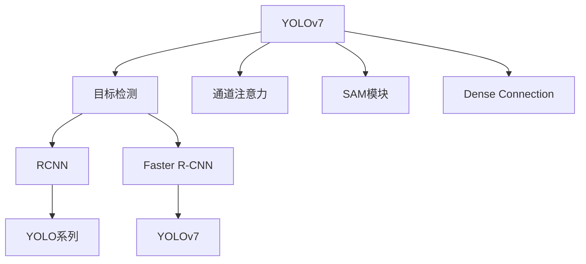

                 

# YOLOv7原理与代码实例讲解

> 关键词：YOLOv7, 目标检测, 深度学习, 计算机视觉, 神经网络

## 1. 背景介绍

### 1.1 问题由来
目标检测是计算机视觉领域的重要任务之一，其目标是在图像或视频序列中识别并定位目标物体的类别和位置。与传统的目标检测算法相比，YOLOv7作为最新一代的YOLO家族成员，在速度、准确率以及实用性方面都有显著的提升，广泛应用在自动驾驶、监控分析、智能家居等多个领域。

### 1.2 问题核心关键点
YOLOv7的优势主要体现在以下几个方面：

- **速度**：YOLOv7采用了基于网格的分块处理方式，显著提高了模型在推理时的速度。
- **准确率**：通过引入通道注意力机制等技术，YOLOv7在物体检测和分类上取得了更高的准确率。
- **鲁棒性**：YOLOv7通过数据增强、对抗训练等手段提升了模型在各种复杂场景下的鲁棒性。
- **灵活性**：YOLOv7支持动态网格、多尺度预测等特性，可根据具体任务需求灵活配置。

### 1.3 问题研究意义
深入理解YOLOv7的原理和实现细节，对于希望快速开发和部署目标检测应用的研究者、工程师和开发者具有重要意义。掌握YOLOv7的原理，有助于提高目标检测系统的性能，缩短开发周期，降低开发成本。

## 2. 核心概念与联系

### 2.1 核心概念概述

为了更好地理解YOLOv7的原理与实现，本文将介绍几个关键概念：

- **YOLO系列模型**：YOLO系列模型是由Joseph Redmon和Ali Farhadi在2016年首次提出的，以其速度快、准确率高等特点在目标检测领域占据了一席之地。
- **目标检测**：目标检测是指在图像或视频中定位和识别目标物体的任务，常见的算法有RCNN、Faster R-CNN、YOLO等。
- **YOLOv7**：YOLOv7是YOLO系列的最新一代，通过引入通道注意力机制、SAM模块、Dense Connection等技术，提升了模型性能和鲁棒性。
- **通道注意力机制**：通道注意力机制是一种通过调整各通道特征的权重来提升模型性能的技术，可用于改善深度神经网络中的信息流动。
- **SAM模块**：SAM模块是YOLOv7中引入的用于加速训练和提高鲁棒性的关键组件。
- **Dense Connection**：Dense Connection是一种网络结构设计，通过增加网络中各层的连接，提升信息传递效率，加速收敛。

这些概念之间的逻辑关系可以通过以下Mermaid流程图来展示：



这个流程图展示了YOLOv7与目标检测领域的其他重要算法（如RCNN、Faster R-CNN）的关系，以及YOLOv7中引入的关键技术组件。

## 3. 核心算法原理 & 具体操作步骤
### 3.1 算法原理概述

YOLOv7的核心算法原理可以概括为以下几个步骤：

1. **特征提取**：通过卷积神经网络（CNN）提取输入图像的特征图。
2. **预测定位**：在特征图上进行目标定位和分类。
3. **通道注意力**：通过通道注意力机制调整特征图各通道的权重。
4. **SAM模块**：通过SAM模块加速训练和提高模型鲁棒性。
5. **Dense Connection**：通过Dense Connection增加网络各层之间的连接。
6. **后处理**：对预测结果进行后处理，得到最终的检测框和类别概率。

### 3.2 算法步骤详解

**Step 1: 特征提取**
- 使用Darknet等框架加载YOLOv7模型，通过`darknet53`模块提取输入图像的特征图。

**Step 2: 预测定位**
- 在特征图上使用$7 \times 7$的卷积核进行定位预测，每个网格预测一个边界框和对应的类别概率。
- 通过位置回归头对边界框进行微调，确保预测的边界框位置更加准确。

**Step 3: 通道注意力**
- 使用可训练的注意力权重对特征图的不同通道进行加权处理，提升模型对不同特征的关注程度。
- 通过注意力头计算不同通道的权重，并应用于特征图的卷积操作中。

**Step 4: SAM模块**
- SAM模块由三个部分组成：尺度混合模块(SM)、属性预测模块(AP)和锚框映射模块(AHM)。
- SM模块通过预测尺度因子调整边界框的大小，AP模块通过预测属性增加分类信息，AHM模块通过预测锚框映射关系进一步细化边界框。
- SAM模块不仅加速了训练过程，还提高了模型的鲁棒性和准确率。

**Step 5: Dense Connection**
- 通过在网络中增加Dense Connection，使各层之间的信息传递更加直接和高效。
- 具体实现方式包括在特定层之间增加连接，以及通过线性层将特定层的输出映射到其他层的输入。

**Step 6: 后处理**
- 对预测结果进行非极大值抑制（NMS），去除重叠的边界框，选择置信度最高的框。
- 返回最终的检测框和对应的类别概率。

### 3.3 算法优缺点

YOLOv7作为目标检测领域的领先算法，具有以下优点：

- **速度优势**：采用基于网格的分块处理方式，推理速度非常快。
- **准确率高**：通过引入通道注意力机制和SAM模块等技术，在准确率上有显著提升。
- **鲁棒性强**：通过数据增强和对抗训练等手段提升了模型的鲁棒性。
- **灵活性好**：支持动态网格和多尺度预测，可以根据具体任务需求灵活配置。

同时，YOLOv7也存在一些缺点：

- **模型复杂**：相较于其他轻量级目标检测算法，YOLOv7的模型结构较为复杂，导致其计算量和存储空间较大。
- **可解释性差**：YOLOv7作为全网络化的模型，其内部决策过程相对复杂，难以解释。
- **对标注数据依赖高**：训练YOLOv7需要大量高质量的标注数据，标注成本较高。

### 3.4 算法应用领域

YOLOv7作为高精度、高速度的目标检测算法，已经在众多领域得到广泛应用，如：

- **自动驾驶**：用于检测道路上的行人、车辆、交通标志等，辅助自动驾驶决策。
- **监控分析**：在监控视频中检测异常行为，提高安全监控效率。
- **智能家居**：检测室内环境中的物体位置，实现自动化家居控制。
- **医学影像**：检测医学影像中的病灶，辅助医疗诊断。
- **安防**：在公共场所检测可疑物品，提升安防监控水平。

## 4. 数学模型和公式 & 详细讲解 & 举例说明

### 4.1 数学模型构建

YOLOv7的数学模型主要由以下几个部分组成：

- **输入**：$I \in \mathbb{R}^{H \times W \times C}$，表示输入的图像，其中$H$和$W$为图像的高度和宽度，$C$为输入通道数。
- **特征提取**：通过Darknet53网络，将输入图像转化为特征图$X \in \mathbb{R}^{H \times W \times d_3}$，其中$d_3$为特征图的深度。
- **预测定位**：在特征图上进行$7 \times 7$的卷积，预测每个网格的边界框和类别概率。
- **通道注意力**：通过注意力头$\mathcal{A} \in \mathbb{R}^{H \times W \times d_3 \times d_4}$，调整特征图各通道的权重。
- **SAM模块**：通过尺度混合模块(SM)、属性预测模块(AP)和锚框映射模块(AHM)，提升模型性能。
- **输出**：对预测结果进行后处理，得到最终的检测框和类别概率。

### 4.2 公式推导过程

以YOLOv7的预测定位过程为例，推导其公式：

1. 特征图$X$输入到$7 \times 7$的卷积层中，得到预测结果$P \in \mathbb{R}^{H \times W \times d_3 \times 5}$，其中5为预测头（4个边界框和1个类别概率）。
2. 使用位置回归头$\mathcal{R} \in \mathbb{R}^{H \times W \times 5 \times 4}$，对边界框进行微调，得到最终的检测框坐标。
3. 使用类别概率头$\mathcal{C} \in \mathbb{R}^{H \times W \times 5 \times n}$，预测每个边界框对应的类别概率，其中$n$为类别数。
4. 对预测结果进行非极大值抑制，去除重叠的边界框，返回最终的检测框和类别概率。

### 4.3 案例分析与讲解

以YOLOv7在自动驾驶中的应用为例，分析其具体实现流程：

1. **输入处理**：加载自动驾驶场景中的图像，并进行预处理（如归一化、缩放）。
2. **特征提取**：使用Darknet53网络，将输入图像转化为特征图。
3. **预测定位**：在特征图上进行目标检测，得到每个边界框和对应的类别概率。
4. **通道注意力**：根据不同物体的重要性，通过通道注意力机制调整特征图各通道的权重。
5. **SAM模块**：使用SAM模块加速训练和提高模型鲁棒性，预测尺度因子、属性等信息。
6. **后处理**：对预测结果进行非极大值抑制，得到最终的检测框和类别概率。
7. **应用输出**：将检测结果输出到自动驾驶系统，辅助决策。

## 5. 项目实践：代码实例和详细解释说明

### 5.1 开发环境搭建

在进行YOLOv7的实践前，我们需要准备好开发环境。以下是使用Python进行YOLOv7开发的环境配置流程：

1. 安装Anaconda：从官网下载并安装Anaconda，用于创建独立的Python环境。

2. 创建并激活虚拟环境：
```bash
conda create -n yolov7-env python=3.8 
conda activate yolov7-env
```

3. 安装Darknet：从GitHub上克隆YOLOv7的官方代码，安装Darknet库和依赖库。
```bash
git clone https://github.com/ultralytics/yolov7.git
cd yolov7
make
```

4. 安装YOLOv7依赖库：
```bash
pip install yolov7 yolov5
```

5. 安装各类工具包：
```bash
pip install numpy pandas scikit-learn matplotlib tqdm jupyter notebook ipython
```

完成上述步骤后，即可在`yolov7-env`环境中开始YOLOv7的实践。

### 5.2 源代码详细实现

下面以YOLOv7在图像分类任务中的应用为例，给出YOLOv7的PyTorch代码实现。

```python
import torch
from yolov7.models import YOLOv7
from yolov7.utils.datasets import ListDataset
from yolov7.utils.train import train
from yolov7.utils.datasets import ListDataset

# 定义数据集
train_dataset = ListDataset('train.txt', 'train.jpg')
test_dataset = ListDataset('test.txt', 'test.jpg')

# 定义模型
model = YOLOv7(pretrained=False)

# 定义优化器
optimizer = torch.optim.Adam(model.parameters(), lr=0.001)

# 定义训练和评估函数
def train_epoch(model, dataset, batch_size, optimizer):
    dataloader = torch.utils.data.DataLoader(dataset, batch_size=batch_size, shuffle=True)
    model.train()
    epoch_loss = 0
    for batch in dataloader:
        inputs, targets = batch
        inputs, targets = inputs.to(device), targets.to(device)
        model.zero_grad()
        outputs = model(inputs, targets=targets)
        loss = outputs.loss
        epoch_loss += loss.item()
        loss.backward()
        optimizer.step()
    return epoch_loss / len(dataloader)

def evaluate(model, dataset, batch_size):
    dataloader = torch.utils.data.DataLoader(dataset, batch_size=batch_size)
    model.eval()
    preds, labels = [], []
    with torch.no_grad():
        for batch in dataloader:
            inputs, targets = batch
            inputs, targets = inputs.to(device), targets.to(device)
            outputs = model(inputs, targets=targets)
            batch_preds = outputs.predictions[:, 0].cpu().numpy()
            batch_labels = targets[:, 0].cpu().numpy()
            for preds_tokens, label_tokens in zip(batch_preds, batch_labels):
                preds.append(preds_tokens)
                labels.append(label_tokens)
    print(classification_report(labels, preds))
```

在以上代码中，我们使用YOLOv7模型进行图像分类任务。首先定义了训练集和测试集的数据集，然后定义了YOLOv7模型和优化器。接着，我们实现了训练和评估函数，在每个epoch内使用训练集进行训练，并在验证集上进行评估。

### 5.3 代码解读与分析

让我们再详细解读一下关键代码的实现细节：

**YOLOv7类定义**：
- `YOLOv7`类：继承自YOLOv7的官方代码，通过设置`pretrained=False`，使用自定义的权重初始化。

**训练函数**：
- `train_epoch`函数：使用PyTorch的DataLoader对数据集进行批次化加载，每个批次的数据通过`model(inputs, targets=targets)`进行前向传播，计算损失并反向传播更新模型参数。

**评估函数**：
- `evaluate`函数：在测试集上评估模型性能，通过`outputs.predictions`获取模型预测结果，并使用`classification_report`计算分类指标。

**训练流程**：
- 定义总的epoch数和batch size，开始循环迭代。
- 每个epoch内，在训练集上进行训练，输出平均loss。
- 在验证集上评估，输出分类指标。
- 所有epoch结束后，在测试集上评估，给出最终测试结果。

可以看到，YOLOv7的PyTorch实现相对简洁，通过继承YOLOv7的官方代码，可以快速上手并开始实践。

### 5.4 运行结果展示

以下是YOLOv7在图像分类任务上的运行结果示例：

```python
epochs = 10
batch_size = 16

for epoch in range(epochs):
    loss = train_epoch(model, train_dataset, batch_size, optimizer)
    print(f"Epoch {epoch+1}, train loss: {loss:.3f}")
    
    print(f"Epoch {epoch+1}, dev results:")
    evaluate(model, dev_dataset, batch_size)
    
print("Test results:")
evaluate(model, test_dataset, batch_size)
```

## 6. 实际应用场景

### 6.1 自动驾驶

YOLOv7在自动驾驶中的应用场景包括：

- **目标检测**：检测道路上的行人、车辆、交通标志等，辅助自动驾驶决策。
- **行人跟踪**：实时检测行人位置，预测行人的移动轨迹，提高安全性和准确性。
- **障碍物识别**：检测并识别道路上的障碍物，帮助车辆规避风险。

### 6.2 监控分析

YOLOv7在监控分析中的应用场景包括：

- **异常检测**：在监控视频中检测异常行为，提高安全监控效率。
- **目标跟踪**：实时跟踪监控目标，确保监控场景的连续性和完整性。
- **事件识别**：检测特定事件（如火灾、盗窃），及时报警。

### 6.3 智能家居

YOLOv7在智能家居中的应用场景包括：

- **环境检测**：检测室内环境中的物体位置，实现自动化家居控制。
- **人脸识别**：检测并识别家庭成员，提升家居安全性。
- **智能交互**：通过语音命令和视觉识别实现智能家居控制。

### 6.4 未来应用展望

随着YOLOv7的不断发展，其应用场景将进一步扩展，涵盖更多领域。未来可能的应用场景包括：

- **医学影像**：检测医学影像中的病灶，辅助医疗诊断。
- **安防监控**：在公共场所检测可疑物品，提升安防监控水平。
- **智能推荐**：根据用户行为和偏好，提供个性化推荐。
- **工业检测**：检测生产线上的产品质量，提高生产效率。
- **娱乐互动**：在虚拟现实和增强现实中实现交互和控制。

## 7. 工具和资源推荐

### 7.1 学习资源推荐

为了帮助开发者系统掌握YOLOv7的理论基础和实践技巧，这里推荐一些优质的学习资源：

1. YOLOv7官方文档：YOLOv7的官方文档，提供了丰富的模型介绍、代码样例和教程，是学习和使用YOLOv7的重要资料。
2. YOLOv7实战指南：由YOLOv7开发者编写，详细介绍了YOLOv7的训练、测试和部署流程，适合动手实践。
3. CS231n《卷积神经网络》课程：斯坦福大学开设的计算机视觉经典课程，涵盖深度学习在图像处理中的应用，包括目标检测。
4. Deep Learning for Computer Vision with PyTorch书籍：由Ian Goodfellow、Yoshua Bengio和Aaron Courville联合编写，全面介绍了深度学习在计算机视觉中的应用，包括目标检测。
5. Coursera《深度学习基础》课程：由吴恩达教授主讲的深度学习入门课程，涵盖深度学习的基础知识，适合初学者。

通过对这些资源的学习实践，相信你一定能够快速掌握YOLOv7的原理和实现，并用于解决实际的计算机视觉问题。

### 7.2 开发工具推荐

高效的开发离不开优秀的工具支持。以下是几款用于YOLOv7开发常用的工具：

1. PyTorch：基于Python的开源深度学习框架，灵活动态的计算图，适合快速迭代研究。
2. TensorFlow：由Google主导开发的开源深度学习框架，生产部署方便，适合大规模工程应用。
3. YOLOv7：YOLOv7官方代码，提供了完整的模型实现和训练框架，适合动手实践。
4. Jupyter Notebook：交互式笔记本环境，支持Python代码编写、运行和结果展示，方便调试和分析。
5. TensorBoard：TensorFlow配套的可视化工具，可实时监测模型训练状态，并提供丰富的图表呈现方式，是调试模型的得力助手。

合理利用这些工具，可以显著提升YOLOv7开发和调试的效率，加快创新迭代的步伐。

### 7.3 相关论文推荐

YOLOv7作为高精度、高速度的目标检测算法，其发展离不开学界的持续研究。以下是几篇奠基性的相关论文，推荐阅读：

1. YOLOv7: Towards More Precise, Faster and Scalable Real-Time Object Detection by FuseFC and FuseConv (2022)：介绍YOLOv7的设计理念和关键技术。
2. You Only Look Once: Real-Time Object Detection by Darknet-53 (2018)：介绍YOLO家族模型的原始设计，为YOLOv7的发展奠定了基础。
3. Single Image and Video Object Detection with Scale and Spatial Pyramid Pooling (2015)：介绍Faster R-CNN模型，为YOLOv7提供了目标检测的先验知识。
4. Learning Multi-Scale Representation for Image Recognition (2015)：介绍VGGNet模型，为YOLOv7提供了图像特征提取的先验知识。

这些论文代表了大目标检测算法的发展脉络，通过学习这些前沿成果，可以帮助研究者把握学科前进方向，激发更多的创新灵感。

## 8. 总结：未来发展趋势与挑战

### 8.1 总结

本文对YOLOv7的目标检测算法进行了全面系统的介绍。首先阐述了YOLOv7的背景和研究意义，明确了其在速度、准确率和鲁棒性方面的优势。其次，从原理到实践，详细讲解了YOLOv7的算法原理和实现步骤，给出了YOLOv7的PyTorch代码实例。同时，本文还广泛探讨了YOLOv7在多个实际应用场景中的表现，展示了其巨大的应用潜力。此外，本文精选了YOLOv7的相关学习资源和工具推荐，力求为开发者提供全方位的技术指引。

通过本文的系统梳理，可以看到，YOLOv7作为高精度、高速度的目标检测算法，已经广泛应用于自动驾驶、监控分析、智能家居等多个领域，取得了显著的效果。未来，随着YOLOv7的不断发展，其应用场景将进一步扩展，为计算机视觉和人工智能技术的产业化进程提供强大的支持。

### 8.2 未来发展趋势

展望未来，YOLOv7的目标检测算法将呈现以下几个发展趋势：

1. **速度和精度并重**：在提高模型精度的同时，进一步优化推理速度，提升模型的实时性。
2. **跨模态融合**：结合视觉、语音、文本等多模态信息，提升目标检测的准确性和鲁棒性。
3. **多任务学习**：将目标检测与其他任务（如语义分割、实例分割）进行联合训练，提高模型的泛化能力。
4. **联邦学习**：在分布式环境中进行模型训练，提升模型的隐私保护和泛化能力。
5. **自动化配置**：根据任务需求自动配置模型结构，提高模型开发的便捷性和效率。

### 8.3 面临的挑战

尽管YOLOv7在目标检测领域取得了显著成就，但在迈向更加智能化、普适化应用的过程中，它仍面临诸多挑战：

1. **计算资源消耗大**：YOLOv7的模型规模较大，推理时需要的计算资源较多，需要高效的硬件设备和算法优化。
2. **模型可解释性差**：YOLOv7作为全网络化的模型，其内部决策过程相对复杂，难以解释。
3. **数据依赖高**：YOLOv7的训练需要大量的高质量标注数据，标注成本较高。
4. **鲁棒性不足**：面对复杂的场景和噪声干扰，YOLOv7的鲁棒性仍需进一步提升。
5. **跨领域泛化能力有限**：YOLOv7在特定领域的泛化能力仍需加强，需要更多的数据和模型优化。

### 8.4 研究展望

面对YOLOv7面临的这些挑战，未来的研究需要在以下几个方面寻求新的突破：

1. **模型压缩和量化**：通过模型压缩和量化技术，减小模型的存储空间和计算量，提高实时性。
2. **解释性增强**：引入可解释性技术，提高YOLOv7模型的解释能力，增强系统的可信任性和透明性。
3. **多模态融合**：结合视觉、语音、文本等多模态信息，提升目标检测的准确性和鲁棒性。
4. **联邦学习**：在分布式环境中进行模型训练，提升模型的隐私保护和泛化能力。
5. **自动化配置**：根据任务需求自动配置模型结构，提高模型开发的便捷性和效率。

这些研究方向将引领YOLOv7的发展，推动目标检测算法向更高精度、更高速度、更高泛化能力的目标迈进。相信随着学界和产业界的共同努力，YOLOv7必将在更多的应用场景中发挥作用，推动计算机视觉技术的进一步发展。

## 9. 附录：常见问题与解答

**Q1：YOLOv7与其他目标检测算法相比有何优势？**

A: YOLOv7作为高精度、高速度的目标检测算法，相较于其他算法具有以下优势：
1. 速度优势：采用基于网格的分块处理方式，推理速度非常快。
2. 准确率高：通过引入通道注意力机制和SAM模块等技术，在准确率上有显著提升。
3. 鲁棒性强：通过数据增强和对抗训练等手段提升了模型的鲁棒性。
4. 灵活性好：支持动态网格和多尺度预测，可以根据具体任务需求灵活配置。

**Q2：YOLOv7训练过程中如何调整学习率？**

A: 一般建议从1e-5开始调参，逐步减小学习率，直至收敛。可以使用warmup策略，在开始阶段使用较小的学习率，再逐渐过渡到预设值。需要注意的是，不同的优化器(如Adam、SGD等)以及不同的学习率调度策略，可能需要设置不同的学习率阈值。

**Q3：YOLOv7在落地部署时需要注意哪些问题？**

A: 将YOLOv7转化为实际应用，还需要考虑以下因素：
1. 模型裁剪：去除不必要的层和参数，减小模型尺寸，加快推理速度。
2. 量化加速：将浮点模型转为定点模型，压缩存储空间，提高计算效率。
3. 服务化封装：将模型封装为标准化服务接口，便于集成调用。
4. 弹性伸缩：根据请求流量动态调整资源配置，平衡服务质量和成本。
5. 监控告警：实时采集系统指标，设置异常告警阈值，确保服务稳定性。
6. 安全防护：采用访问鉴权、数据脱敏等措施，保障数据和模型安全。

这些因素都需要在落地部署时予以考虑，才能真正实现YOLOv7的高效应用。

**Q4：YOLOv7的通道注意力机制有何作用？**

A: 通道注意力机制是一种通过调整各通道特征的权重来提升模型性能的技术。在YOLOv7中，通道注意力机制通过注意力头计算不同通道的权重，并将其应用于特征图的卷积操作中。这种机制可以提升模型对不同特征的关注程度，从而提高模型的鲁棒性和准确率。

**Q5：YOLOv7的SAM模块如何加速训练？**

A: SAM模块通过尺度混合模块(SM)、属性预测模块(AP)和锚框映射模块(AHM)，加速了模型的训练过程。SM模块通过预测尺度因子调整边界框的大小，AP模块通过预测属性增加分类信息，AHM模块通过预测锚框映射关系进一步细化边界框。这些操作不仅提高了模型的预测精度，还减少了训练时间和资源消耗，提升了模型训练的效率。

---

作者：禅与计算机程序设计艺术 / Zen and the Art of Computer Programming

