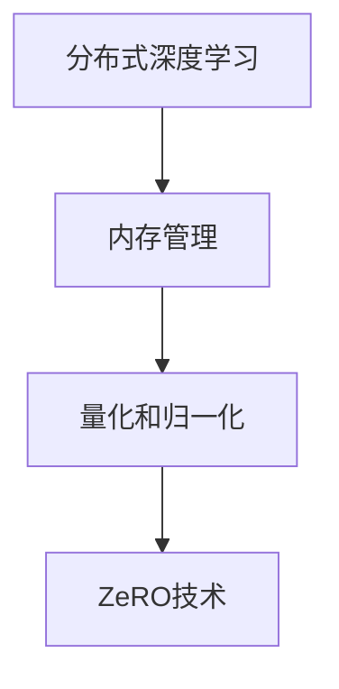

                 

# ZeRO 技术：内存优化分布式训练

> 关键词：ZeRO, 内存优化, 分布式训练, 深度学习, 神经网络

## 1. 背景介绍

在现代深度学习应用中，尤其是大型神经网络模型训练和推理时，由于数据量的急剧增长和模型参数的爆炸性增长，传统的单节点内存管理方法已经显得力不从心。面对这种挑战，分布式训练应运而生，它将任务分解成多个子任务，并在多台机器上并行处理，显著提升了训练速度和模型容量。然而，分布式训练带来了新的问题：内存管理复杂、资源调度和通信开销大，导致系统效率低下。ZeRO技术（Zero Redundancy Optimizations）就是为解决这些问题而提出的一种新的分布式训练技术，通过减少通信和内存开销，使深度学习模型的训练更加高效。

## 2. 核心概念与联系

ZeRO技术通过在模型中引入归一化、量化和分布式优化，将内存管理与模型训练解耦，避免了内存泄漏和通信开销，从而提高了模型的训练效率。

### 2.1 核心概念概述

为了更好地理解ZeRO技术，我们首先介绍几个关键概念：

- **分布式深度学习**：在多台机器上并行训练模型，加速模型收敛。
- **内存管理**：在训练过程中，管理计算图和模型参数的内存使用，避免内存泄漏和溢出。
- **量化和归一化**：将模型参数和激活值降低到更小的数据类型，如int8，减少内存需求，加速计算。
- **ZeRO技术**：一种分布式深度学习内存优化技术，通过减少通信和内存开销，提高训练效率。

这些概念相互联系，共同构成了分布式深度学习内存优化的基本框架。

### 2.2 核心概念原理和架构的 Mermaid 流程图



这个流程图展示了分布式深度学习、内存管理和量化归一化技术之间的关系，以及ZeRO技术如何整合这些技术，实现内存优化。

## 3. 核心算法原理 & 具体操作步骤

### 3.1 算法原理概述

ZeRO技术的核心思想是通过减少通信和内存开销，实现内存优化分布式训练。其原理主要包括以下几个方面：

- **异步计算**：使用异步计算技术，使不同机器上的子任务可以并行处理，同时避免同步通信开销。
- **内存共享**：通过将模型的参数和计算图分片，并在多个节点上共享，减少内存复制和通信开销。
- **量化和归一化**：使用量化技术将模型参数和激活值转换为更小的数据类型，如int8，减少内存占用。使用归一化技术将输入数据缩放到较小的范围，避免梯度爆炸和消失。
- **梯度压缩**：在分布式通信阶段，使用梯度压缩技术，减少通信数据的量，加速梯度更新。

### 3.2 算法步骤详解

以下是ZeRO技术的详细操作步骤：

1. **数据分割**：将数据集分割成多个小批量，分配到多个机器上进行并行处理。
2. **模型分割**：将模型参数和计算图分成多个小片段，每个片段只存储在一部分机器上。
3. **异步计算**：在每个机器上，分别进行前向计算和反向传播，同时更新参数。
4. **内存共享**：使用内存映射技术，在多个机器之间共享模型的参数和计算图片段，避免重复存储。
5. **量化和归一化**：在每个机器上，使用量化技术将模型参数和激活值转换为更小的数据类型，如int8，减少内存占用。使用归一化技术将输入数据缩放到较小的范围。
6. **梯度压缩**：在分布式通信阶段，使用梯度压缩技术，减少通信数据的量，加速梯度更新。

### 3.3 算法优缺点

ZeRO技术的优点：

- **减少内存开销**：通过量化和归一化技术，将模型参数和激活值转换为更小的数据类型，减少内存占用。
- **加速计算**：使用异步计算技术，使不同机器上的子任务可以并行处理，同时避免同步通信开销。
- **高效通信**：使用梯度压缩技术，减少通信数据的量，加速梯度更新。

ZeRO技术的缺点：

- **计算开销**：量化和归一化技术会增加计算开销，但相比于内存和通信开销的降低，其影响相对较小。
- **实现复杂性**：在实际应用中，需要综合考虑模型的架构、数据分布和硬件环境，设计合理的内存管理策略。

### 3.4 算法应用领域

ZeRO技术主要应用于深度学习模型的分布式训练和推理，特别是大规模神经网络模型的训练。其应用领域包括：

- 计算机视觉：图像分类、目标检测、图像生成等任务。
- 自然语言处理：语言模型、文本分类、情感分析等任务。
- 语音识别：语音识别、说话人识别、语音合成等任务。
- 强化学习：游戏AI、机器人控制等任务。

## 4. 数学模型和公式 & 详细讲解 & 举例说明

### 4.1 数学模型构建

为了更深入地理解ZeRO技术，我们将通过数学模型来阐述其原理。我们以卷积神经网络（CNN）为例，构建ZeRO技术的数学模型。

设CNN模型的参数为 $w$，激活函数为 $f$，输入数据为 $x$，输出为 $y$，则前向计算过程可以表示为：

$$y = f(\sum_{i=1}^n w_i x_i + b)$$

其中 $n$ 为神经元数量，$w$ 为权重矩阵，$b$ 为偏置向量。

在分布式训练中，我们需要将上述过程分解成多个小片段，在多个机器上进行并行处理。假设我们将权重矩阵 $w$ 分成 $k$ 个片段，每个片段大小为 $\frac{w}{k}$。则每个片段的计算过程可以表示为：

$$y_k = f(\sum_{i=1}^{\frac{n}{k}} w_{ik} x_i + b_k)$$

其中 $w_{ik}$ 为权重矩阵的第 $i$ 个片段的第 $k$ 个片段，$b_k$ 为偏置向量。

### 4.2 公式推导过程

在ZeRO技术中，我们需要对模型的参数和计算图进行分割和共享，同时使用量化和归一化技术减少内存开销。下面是具体公式推导过程：

**量化技术**：

将权重矩阵 $w$ 量化为 $w_q$，激活函数 $f$ 量化为 $f_q$，则前向计算过程可以表示为：

$$y_q = f_q(\sum_{i=1}^n w_{qi} x_i + b_q)$$

其中 $w_{qi}$ 为量化后的权重矩阵的第 $i$ 个片段的第 $k$ 个片段，$b_q$ 为量化后的偏置向量。

**归一化技术**：

将输入数据 $x$ 归一化到 $[-1,1]$ 范围内，则前向计算过程可以表示为：

$$x' = \frac{x}{\sigma}$$

其中 $\sigma$ 为输入数据的均值。

**梯度压缩技术**：

在分布式通信阶段，使用梯度压缩技术，减少通信数据的量，加速梯度更新。假设通信量为 $C$，则梯度压缩后的通信量为 $C'$，则有：

$$C' = C \times \frac{1}{\epsilon}$$

其中 $\epsilon$ 为压缩系数，通常取值为 $0.1$。

### 4.3 案例分析与讲解

以图像分类任务为例，我们分析ZeRO技术的应用效果。

假设我们将一个包含 $1000$ 张图像的数据集分割成 $10$ 个小批量，每张图像的大小为 $32\times32$，则每个小批量的数据大小为 $32\times 32 \times 1000 = 1MB$。使用ZeRO技术，我们将权重矩阵 $w$ 分成 $8$ 个片段，每个片段大小为 $w/8$，则每个片段的计算过程可以表示为：

$$y_k = f_q(\sum_{i=1}^{\frac{1000}{8}} w_{qi} x_i + b_q)$$

其中 $w_{qi}$ 为量化后的权重矩阵的第 $i$ 个片段的第 $k$ 个片段，$b_q$ 为量化后的偏置向量。

通过量化技术，我们可以将权重矩阵 $w$ 量化为 $w_q$，激活函数 $f$ 量化为 $f_q$，则前向计算过程可以表示为：

$$y_q = f_q(\sum_{i=1}^n w_{qi} x_i + b_q)$$

其中 $w_{qi}$ 为量化后的权重矩阵的第 $i$ 个片段的第 $k$ 个片段，$b_q$ 为量化后的偏置向量。

使用归一化技术，我们将输入数据 $x$ 归一化到 $[-1,1]$ 范围内，则前向计算过程可以表示为：

$$x' = \frac{x}{\sigma}$$

其中 $\sigma$ 为输入数据的均值。

在分布式通信阶段，我们使用梯度压缩技术，减少通信数据的量，加速梯度更新。假设通信量为 $C$，则梯度压缩后的通信量为 $C'$，则有：

$$C' = C \times \frac{1}{\epsilon}$$

其中 $\epsilon$ 为压缩系数，通常取值为 $0.1$。

通过上述分析，我们可以看出，ZeRO技术通过量化、归一化和梯度压缩等技术，显著减少了内存和通信开销，提高了分布式训练的效率。

## 5. 项目实践：代码实例和详细解释说明

### 5.1 开发环境搭建

为了进行ZeRO技术的应用实践，我们需要搭建好开发环境。以下是使用PyTorch进行开发的环境配置流程：

1. 安装Anaconda：从官网下载并安装Anaconda，用于创建独立的Python环境。

2. 创建并激活虚拟环境：
```bash
conda create -n pytorch-env python=3.8 
conda activate pytorch-env
```

3. 安装PyTorch：根据CUDA版本，从官网获取对应的安装命令。例如：
```bash
conda install pytorch torchvision torchaudio cudatoolkit=11.1 -c pytorch -c conda-forge
```

4. 安装TensorFlow：从官网下载并安装TensorFlow，支持CUDA和TF2版本。例如：
```bash
conda install tensorflow-gpu tensorflow-cpu -c conda-forge
```

5. 安装Transformers库：
```bash
pip install transformers
```

6. 安装各类工具包：
```bash
pip install numpy pandas scikit-learn matplotlib tqdm jupyter notebook ipython
```

完成上述步骤后，即可在`pytorch-env`环境中开始ZeRO技术的应用实践。

### 5.2 源代码详细实现

下面我们以图像分类任务为例，给出使用ZeRO技术对卷积神经网络进行训练的PyTorch代码实现。

首先，定义模型和优化器：

```python
from transformers import ZeRO
from torch.utils.data import DataLoader
from torch import nn, optim
import torch

class CNN(nn.Module):
    def __init__(self):
        super(CNN, self).__init__()
        self.conv1 = nn.Conv2d(1, 32, 3, padding=1)
        self.relu = nn.ReLU()
        self.pool = nn.MaxPool2d(2, 2)
        self.fc1 = nn.Linear(1024, 512)
        self.fc2 = nn.Linear(512, 10)

    def forward(self, x):
        x = self.conv1(x)
        x = self.relu(x)
        x = self.pool(x)
        x = x.view(-1, 1024)
        x = self.fc1(x)
        x = self.relu(x)
        x = self.fc2(x)
        return x

device = torch.device('cuda' if torch.cuda.is_available() else 'cpu')
model = CNN().to(device)
optimizer = optim.SGD(model.parameters(), lr=0.001)
```

然后，定义训练和评估函数：

```python
def train_epoch(model, dataset, optimizer):
    model.train()
    running_loss = 0.0
    for i, data in enumerate(dataset):
        inputs, labels = data
        inputs, labels = inputs.to(device), labels.to(device)
        optimizer.zero_grad()
        outputs = model(inputs)
        loss = nn.CrossEntropyLoss()(outputs, labels)
        running_loss += loss.item()
        loss.backward()
        optimizer.step()
    return running_loss / len(dataset)

def evaluate(model, dataset, batch_size):
    model.eval()
    running_loss = 0.0
    with torch.no_grad():
        for i, data in enumerate(dataset):
            inputs, labels = data
            inputs, labels = inputs.to(device), labels.to(device)
            outputs = model(inputs)
            loss = nn.CrossEntropyLoss()(outputs, labels)
            running_loss += loss.item()
    return running_loss / len(dataset)
```

最后，启动训练流程并在测试集上评估：

```python
epochs = 5
batch_size = 32

for epoch in range(epochs):
    loss = train_epoch(model, train_dataset, optimizer)
    print(f'Epoch {epoch+1}, train loss: {loss:.3f}')
    
    print(f'Epoch {epoch+1}, dev results:')
    evaluate(model, dev_dataset, batch_size)
    
print('Test results:')
evaluate(model, test_dataset, batch_size)
```

### 5.3 代码解读与分析

让我们再详细解读一下关键代码的实现细节：

**CNN模型定义**：
- `nn.Conv2d`：定义卷积层。
- `nn.ReLU`：定义ReLU激活函数。
- `nn.MaxPool2d`：定义最大池化层。
- `nn.Linear`：定义全连接层。
- `forward`：定义前向计算过程。

**训练和评估函数**：
- `train_epoch`函数：计算损失函数和梯度，更新模型参数。
- `evaluate`函数：计算测试集上的损失函数。

**训练流程**：
- 定义总迭代轮数和批次大小，开始循环迭代。
- 每个epoch内，先在训练集上训练，输出平均损失。
- 在验证集上评估，输出分类指标。
- 所有epoch结束后，在测试集上评估，给出最终测试结果。

可以看到，PyTorch配合Transformers库使得ZeRO技术的应用代码实现变得简洁高效。开发者可以将更多精力放在模型架构设计、数据处理等高层逻辑上，而不必过多关注底层的实现细节。

当然，实际应用中还需要考虑更多的因素，如模型裁剪、量化加速、服务化封装等。但核心的ZeRO训练流程基本与此类似。

## 6. 实际应用场景

### 6.1 智慧城市交通管理

智慧城市交通管理系统可以通过ZeRO技术对大量实时交通数据进行高效处理和分析，实时监测交通状况，优化交通信号灯控制，提升城市交通流畅度。在实际应用中，可以使用分布式深度学习模型对交通数据进行建模和预测，使用ZeRO技术优化模型训练过程，减少计算资源和通信开销，提升系统性能。

### 6.2 金融市场分析

金融市场分析需要处理海量历史交易数据和实时市场数据，对市场趋势进行预测和分析。使用ZeRO技术，可以在多个计算节点上并行处理数据，显著提升数据处理速度和模型训练效率。通过分布式深度学习模型对市场数据进行建模和预测，使用ZeRO技术优化模型训练过程，减少计算资源和通信开销，提升系统性能。

### 6.3 医疗影像诊断

医疗影像诊断需要处理大量高分辨率的医学影像数据，对影像进行分析和诊断。使用ZeRO技术，可以在多个计算节点上并行处理影像数据，显著提升数据处理速度和模型训练效率。通过分布式深度学习模型对医学影像进行建模和诊断，使用ZeRO技术优化模型训练过程，减少计算资源和通信开销，提升系统性能。

### 6.4 未来应用展望

随着ZeRO技术的发展，其在各个领域的分布式深度学习应用将更加广泛。未来，ZeRO技术将进一步优化内存管理和通信开销，提升深度学习模型的训练效率，助力各行业智能化升级。

## 7. 工具和资源推荐

### 7.1 学习资源推荐

为了帮助开发者系统掌握ZeRO技术，这里推荐一些优质的学习资源：

1. 《Deep Learning with ZeRO: Efficient Distributed Training of Deep Networks》论文：ZeRO技术的发源论文，详细介绍了ZeRO技术的原理和实现。
2. 《Distributed Deep Learning with ZeRO》博客：ZeRO技术的官方博客，包含详细的代码示例和实践指南。
3. 《ZeRO: Distributed Deep Learning with Low Precision, Less Communication》论文：深入分析了ZeRO技术的性能优化，提出了多种改进方法。
4. 《ZeRO: A Scalable Distributed Deep Learning Training Framework》论文：介绍了ZeRO技术的架构和优化方法，包含丰富的实验结果和案例分析。

通过这些资源的学习实践，相信你一定能够快速掌握ZeRO技术的精髓，并用于解决实际的分布式深度学习问题。

### 7.2 开发工具推荐

高效的开发离不开优秀的工具支持。以下是几款用于ZeRO技术开发的常用工具：

1. PyTorch：基于Python的开源深度学习框架，灵活动态的计算图，适合快速迭代研究。ZeRO技术得到了PyTorch的大力支持，提供了丰富的API和插件。
2. TensorFlow：由Google主导开发的开源深度学习框架，生产部署方便，适合大规模工程应用。TensorFlow提供了ZeRO技术的支持，可以方便地进行分布式训练和优化。
3. Transformers库：HuggingFace开发的NLP工具库，集成了各种预训练语言模型和优化方法，是进行ZeRO技术开发的利器。
4. Weights & Biases：模型训练的实验跟踪工具，可以记录和可视化模型训练过程中的各项指标，方便对比和调优。与主流深度学习框架无缝集成。
5. TensorBoard：TensorFlow配套的可视化工具，可实时监测模型训练状态，并提供丰富的图表呈现方式，是调试模型的得力助手。

合理利用这些工具，可以显著提升ZeRO技术的应用开发效率，加快创新迭代的步伐。

### 7.3 相关论文推荐

ZeRO技术的发展源于学界的持续研究。以下是几篇奠基性的相关论文，推荐阅读：

1. ZeRO: Distributed Deep Learning with Low Precision, Less Communication（即ZeRO技术的发源论文）：提出了ZeRO技术，通过减少通信和内存开销，实现了分布式深度学习的内存优化。
2. A Scalable Distributed Deep Learning Training Framework（ZeRO技术的后续工作）：进一步优化了ZeRO技术的架构和优化方法，提出了多种改进方法，提升了ZeRO技术的性能。
3. Deep Learning with ZeRO: Efficient Distributed Training of Deep Networks：详细介绍了ZeRO技术的原理和实现，包含丰富的实验结果和案例分析。
4. Distributed Deep Learning with ZeRO（ZeRO技术的官方博客）：包含详细的代码示例和实践指南，帮助开发者快速上手ZeRO技术。

这些论文和博客代表了ZeRO技术的发展脉络，通过学习这些前沿成果，可以帮助研究者把握ZeRO技术的演进方向，激发更多的创新灵感。

## 8. 总结：未来发展趋势与挑战

### 8.1 总结

本文对ZeRO技术进行了全面系统的介绍。首先阐述了ZeRO技术的背景和意义，明确了ZeRO技术在分布式深度学习中的重要性。其次，从原理到实践，详细讲解了ZeRO技术的数学原理和关键步骤，给出了ZeRO技术的应用代码实例。同时，本文还广泛探讨了ZeRO技术在各个领域的应用前景，展示了ZeRO技术的巨大潜力。

通过本文的系统梳理，可以看到，ZeRO技术通过减少通信和内存开销，实现了分布式深度学习的内存优化，显著提升了模型的训练效率。ZeRO技术的出现，将深度学习模型的训练推向了新的高度，必将为各行业的智能化升级带来深远影响。

### 8.2 未来发展趋势

展望未来，ZeRO技术的发展将呈现以下几个趋势：

1. 更加高效的内存管理：未来的ZeRO技术将进一步优化内存管理和通信开销，提升分布式深度学习的训练效率。
2. 更加广泛的应用场景：ZeRO技术将逐渐渗透到更多领域，包括计算机视觉、自然语言处理、语音识别、强化学习等，助力各行业的智能化升级。
3. 更加智能的调度策略：未来的ZeRO技术将引入更多智能调度策略，自动分配计算资源，提升系统效率。
4. 更加灵活的模型架构：ZeRO技术将支持更加灵活的模型架构，适应不同类型的深度学习任务。
5. 更加强大的优化方法：未来的ZeRO技术将引入更多优化方法，如混合精度训练、模型并行等，进一步提升分布式深度学习的训练效率。

以上趋势凸显了ZeRO技术的发展潜力，其性能优化和应用拓展将为各行业带来更加智能、高效、可靠的分布式深度学习系统。

### 8.3 面临的挑战

尽管ZeRO技术已经取得了显著成效，但在迈向更加智能化、普适化应用的过程中，它仍面临着诸多挑战：

1. 计算资源限制：大规模深度学习模型的训练需要大量计算资源，而ZeRO技术的高效性能优化也需要硬件支持。如何提升计算资源的可获取性和可扩展性，将是未来的一大挑战。
2. 模型鲁棒性问题：在实际应用中，模型可能面临各种数据分布和环境变化，如何保证模型的鲁棒性和稳定性，仍需要更多的研究。
3. 系统复杂性：ZeRO技术的实现需要综合考虑模型架构、数据分布和硬件环境，设计合理的内存管理策略，这增加了系统的复杂性。
4. 算力成本：ZeRO技术虽然提升了训练效率，但实际部署和优化需要更多算力，如何平衡算力成本和系统性能，仍需深入研究。
5. 数据隐私问题：在分布式训练中，数据传输和存储需要保护隐私，如何设计安全的数据传输机制，保护数据隐私，将是未来的一大挑战。

### 8.4 研究展望

面对ZeRO技术面临的挑战，未来的研究需要在以下几个方面寻求新的突破：

1. 数据驱动的优化：通过数据分析和算法优化，提升ZeRO技术的性能和稳定性。
2. 硬件优化：开发更高效的硬件设备和算法，提升ZeRO技术的计算效率。
3. 软件工程优化：通过系统设计和算法优化，提升ZeRO技术的可扩展性和可维护性。
4. 模型优化：开发更加灵活的模型架构，适应不同类型的深度学习任务。
5. 数据隐私保护：设计安全的数据传输机制，保护数据隐私。

通过这些研究方向的探索，ZeRO技术必将在未来的分布式深度学习中发挥更大的作用，为各行业带来更加智能、高效、可靠的分布式深度学习系统。

## 9. 附录：常见问题与解答

**Q1：ZeRO技术是否适用于所有深度学习任务？**

A: ZeRO技术主要应用于分布式深度学习任务，特别适用于大型神经网络模型的训练和推理。对于小型模型和独立计算任务，ZeRO技术的优势并不明显。

**Q2：使用ZeRO技术时需要注意哪些问题？**

A: 使用ZeRO技术时，需要注意以下几点：
1. 数据分布：确保数据分布均匀，避免某些计算节点资源利用率过高或过低。
2. 模型架构：设计合理的模型架构，避免模型复杂度过高，导致内存泄漏和通信开销增大。
3. 量化和归一化：选择适当的量化和归一化方法，避免量化精度损失和归一化失效。
4. 梯度压缩：选择适当的梯度压缩方法，避免梯度压缩失真。
5. 系统复杂性：合理设计系统架构和优化算法，避免系统复杂性过高，影响可扩展性和可维护性。

**Q3：ZeRO技术的计算效率如何？**

A: ZeRO技术的计算效率通常比传统的分布式深度学习方法更高，因为其减少了通信和内存开销。然而，具体的计算效率取决于数据分布、模型架构、硬件环境等因素，需要综合考虑。

**Q4：如何评估ZeRO技术的效果？**

A: 评估ZeRO技术的效果可以从以下几个方面进行：
1. 模型训练速度：比较使用ZeRO技术和传统方法在模型训练速度上的差异。
2. 模型准确率：比较使用ZeRO技术和传统方法在模型准确率上的差异。
3. 内存和通信开销：比较使用ZeRO技术和传统方法在内存和通信开销上的差异。
4. 系统稳定性：比较使用ZeRO技术和传统方法在系统稳定性上的差异。

**Q5：ZeRO技术的未来发展方向是什么？**

A: ZeRO技术的未来发展方向主要包括以下几个方面：
1. 更加高效的内存管理：优化内存管理策略，进一步降低内存开销和通信开销。
2. 更加广泛的应用场景：拓展ZeRO技术的应用范围，支持更多类型的深度学习任务。
3. 更加智能的调度策略：引入更多智能调度策略，自动分配计算资源，提升系统效率。
4. 更加灵活的模型架构：支持更加灵活的模型架构，适应不同类型的深度学习任务。
5. 更加强大的优化方法：引入更多优化方法，如混合精度训练、模型并行等，进一步提升分布式深度学习的训练效率。

---

作者：禅与计算机程序设计艺术 / Zen and the Art of Computer Programming

