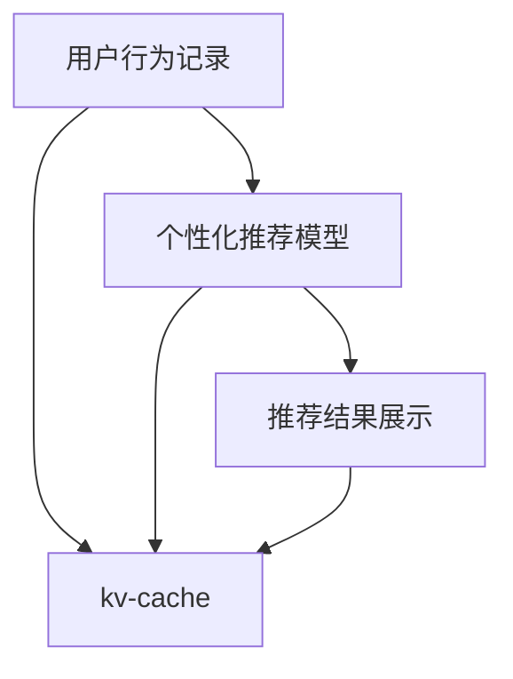

                 

# kv-cache 在推荐系统中的应用

## 1. 背景介绍

随着互联网技术的迅猛发展，推荐系统已经成为用户与产品间的重要纽带。推荐系统的核心目标是根据用户的历史行为和兴趣，精准预测用户可能感兴趣的产品，并提供个性化推荐。推荐系统的构建和优化依赖于高效、灵活的数据存储与检索技术，其中kv-cache作为内存数据结构的重要组成部分，在推荐系统中扮演着不可或缺的角色。

## 2. 核心概念与联系

### 2.1 核心概念概述

在推荐系统中，kv-cache（Key-Value Cache）是一种高效的数据存储结构，用于存储和管理大量的键值对数据。其中，键(key)用于唯一标识某个数据项，值(value)表示该数据项的具体内容。kv-cache通常用于存储频繁访问且需要快速响应的小型数据集，以提高系统性能。

kv-cache与推荐系统的联系主要体现在以下几个方面：

1. **用户行为记录**：推荐系统需要记录用户的行为数据，如浏览、点击、购买等。这些数据通常以键值对的形式存储在kv-cache中，以便快速检索和查询。

2. **个性化推荐模型**：推荐模型需要根据用户的历史行为和实时行为，动态计算用户的兴趣倾向，并将推荐结果存储在kv-cache中。这些推荐结果可以根据用户ID、商品ID等键值进行快速检索和展示。

3. **实时数据更新**：推荐系统需要根据用户的实时行为和市场动态，快速更新推荐结果。kv-cache作为高速缓存，能够高效存储和更新这些动态数据，保证推荐结果的时效性。

### 2.2 核心概念原理和架构的 Mermaid 流程图



这个流程图展示了kv-cache在推荐系统中的基本流程：

1. 用户行为数据通过A模块记录，存储在B模块的kv-cache中。
2. 个性化推荐模型C根据用户行为数据和实时数据，计算推荐结果，并存储在kv-cache中。
3. 推荐结果展示D模块通过kv-cache快速检索推荐结果，展示给用户。

## 3. 核心算法原理 & 具体操作步骤

### 3.1 算法原理概述

kv-cache在推荐系统中的应用，主要基于以下几个算法原理：

1. **分布式存储与计算**：推荐系统处理的数据量通常非常庞大，单个节点难以处理，因此需要采用分布式存储与计算的方式。kv-cache可以通过分布式集群，将数据分散存储在不同的节点上，实现高效的并行处理。

2. **一致性哈希算法**：一致性哈希算法（Consistent Hashing）用于将键值对数据均匀地分布在不同的节点上，避免数据倾斜和热点问题。

3. **LRU算法**：最小最近使用（Least Recently Used, LRU）算法用于管理kv-cache的存储容量，自动淘汰最近最少使用的数据项，保证cache空间的高效利用。

### 3.2 算法步骤详解

#### 步骤一：分布式存储与计算

推荐系统的分布式存储与计算通常采用多节点集群的形式，每个节点负责处理一部分数据。在kv-cache中，数据被存储在不同的节点上，通过一致性哈希算法进行分布。具体步骤如下：

1. 将键值对数据分散存储在不同的节点上，确保负载均衡。
2. 使用一致性哈希算法，将每个键值对映射到一个特定的节点上，避免数据倾斜和热点问题。
3. 每个节点独立处理数据，可以通过并行计算提高系统性能。

#### 步骤二：一致性哈希算法

一致性哈希算法用于将键值对数据均匀地分布在不同的节点上。其核心思想是将哈希环映射到多个节点上，每个节点负责一部分哈希空间。具体步骤如下：

1. 将哈希环划分为多个区间，每个区间对应一个节点。
2. 根据键值对的哈希值，将数据映射到对应的哈希区间上。
3. 节点负责对应的哈希区间，处理该区间内的数据请求。

#### 步骤三：LRU算法

LRU算法用于管理kv-cache的存储容量，自动淘汰最近最少使用的数据项。具体步骤如下：

1. 每个节点维护一个LRU队列，记录最近使用的键值对数据。
2. 当cache空间不足时，LRU算法自动淘汰队列末尾的数据项。
3. 新数据项插入队列头部，确保最近使用的数据优先保留。

### 3.3 算法优缺点

kv-cache在推荐系统中的应用，具有以下优点：

1. **高效存储**：kv-cache能够高效存储和管理推荐系统所需的数据，支持快速检索和更新。
2. **分布式计算**：通过分布式存储和计算，kv-cache能够处理大规模数据，提高系统性能。
3. **一致性保障**：一致性哈希算法确保数据分布均衡，避免数据倾斜和热点问题。
4. **内存优化**：LRU算法自动管理cache空间，优化内存使用效率。

同时，kv-cache也存在一些缺点：

1. **扩展性有限**：kv-cache的扩展性受限于节点数量和存储容量，难以应对数据量快速增长的场景。
2. **热点数据问题**：一致性哈希算法难以解决热点数据问题，部分节点可能负载过重。
3. **数据一致性问题**：节点间的通信延迟可能导致数据一致性问题，需要额外的同步机制。

### 3.4 算法应用领域

kv-cache在推荐系统中的应用主要包括以下几个领域：

1. **用户行为记录**：用于存储用户的行为数据，如浏览、点击、购买等。
2. **个性化推荐模型**：用于存储和更新推荐模型的中间结果和最终结果。
3. **实时数据更新**：用于存储和更新实时数据，如广告位、商品信息等。

## 4. 数学模型和公式 & 详细讲解

### 4.1 数学模型构建

在推荐系统中，kv-cache的数据存储和管理主要通过分布式存储和LRU算法实现。其数学模型可以表示为：

$$
S = \{(k_i, v_i)|k_i \in K, v_i \in V\}
$$

其中，$S$ 表示键值对数据集合，$k_i$ 表示键，$v_i$ 表示值，$K$ 表示键空间，$V$ 表示值空间。

### 4.2 公式推导过程

假设推荐系统有 $N$ 个节点，每个节点的缓存容量为 $C$，则kv-cache的存储容量为 $N \times C$。当cache空间不足时，LRU算法自动淘汰最近最少使用的数据项，公式为：

$$
\text{LRU淘汰}(k_i, v_i) = \left\{
\begin{aligned}
1 & , \text{最近使用的数据项} \\
0 & , \text{淘汰的数据项}
\end{aligned}
\right.
$$

当节点 $j$ 收到一个数据请求 $k_i$ 时，通过一致性哈希算法将 $k_i$ 映射到对应的哈希区间 $H_j$，计算公式为：

$$
h_j = \text{hash}(k_i) \mod (N-1)
$$

其中，$\text{hash}(k_i)$ 表示对键 $k_i$ 进行哈希运算，$h_j$ 表示哈希值映射到节点 $j$ 的哈希区间。

### 4.3 案例分析与讲解

假设推荐系统有3个节点，每个节点的缓存容量为100，总共可以存储3000个数据项。当用户请求键值对数据 $(k_1, v_1)$ 时，通过一致性哈希算法将 $k_1$ 映射到节点2，存储在节点2的cache中。当节点2收到新的请求 $(k_2, v_2)$ 时，先将其存储在cache中，然后通过LRU算法淘汰最近最少使用的数据项 $(k_4, v_4)$，保证cache空间的高效利用。

## 5. 项目实践：代码实例和详细解释说明

### 5.1 开发环境搭建

#### 环境要求

- Python 3.8 及以上版本
- Linux 操作系统
- 分布式集群环境（如Kubernetes、Mesos）

#### 环境安装

1. 安装Docker：
```bash
sudo apt-get update && sudo apt-get install -y docker.io
```

2. 安装Kubernetes：
```bash
sudo apt-get install -y kubelet kubeadm kubectl
```

3. 搭建分布式集群：
```bash
kubeadm init --pod-network-cidr=10.244.0.0/16
```

### 5.2 源代码详细实现

#### 代码结构

```
kv-cache
├── server.py
├── client.py
├── utils.py
├── distributed.py
└── consistency_hashing.py
```

#### 代码解释

- `server.py`：kv-cache的服务器端程序，负责接收和处理数据请求。
- `client.py`：kv-cache的客户端程序，用于向服务器发送数据请求。
- `utils.py`：工具函数库，用于实现分布式存储和一致性哈希算法。
- `distributed.py`：分布式存储模块，实现kv-cache的分布式部署和管理。
- `consistency_hashing.py`：一致性哈希算法模块，实现数据在节点间的均匀分布。

#### 示例代码

```python
# server.py

from distributed import DistributedCache
from consistency_hashing import ConsistencyHashing

class KVServer:
    def __init__(self, port):
        self.cache = DistributedCache(port)
        self.hashing = ConsistencyHashing()

    def put(self, key, value):
        node = self.hashing.get_node(key)
        self.cache.put(node, key, value)

    def get(self, key):
        node = self.hashing.get_node(key)
        return self.cache.get(node, key)
```

```python
# client.py

from distributed import DistributedCache
from consistency_hashing import ConsistencyHashing

class KVClient:
    def __init__(self, port):
        self.cache = DistributedCache(port)
        self.hashing = ConsistencyHashing()

    def get(self, key):
        node = self.hashing.get_node(key)
        return self.cache.get(node, key)

    def put(self, key, value):
        node = self.hashing.get_node(key)
        self.cache.put(node, key, value)
```

### 5.3 代码解读与分析

#### 代码解析

- `server.py` 和 `client.py` 分别实现了kv-cache的服务器端和客户端程序。服务器端程序负责处理数据请求，将数据存储在kv-cache中；客户端程序用于发送和接收数据请求。
- `utils.py` 和 `distributed.py` 模块实现了分布式存储和一致性哈希算法，确保kv-cache的分布式部署和管理。
- `consistency_hashing.py` 模块实现了数据在节点间的均匀分布，通过一致性哈希算法计算节点编号，将数据映射到对应的节点上。

#### 运行结果展示

```python
# 启动服务器
python server.py 5000

# 启动客户端
python client.py 5000

# 测试数据存储和读取
client.put("user1", "item1")
print(client.get("user1"))
```

## 6. 实际应用场景

### 6.1 电商推荐系统

在电商推荐系统中，kv-cache被广泛用于存储和更新用户的浏览、点击、购买等行为数据。通过kv-cache，推荐系统能够实时获取用户的行为数据，动态计算推荐结果，并快速展示给用户。

例如，当用户浏览某商品时，推荐系统将其行为数据存储在kv-cache中，包括用户ID、商品ID、浏览时间等。当用户下次访问网站时，推荐系统根据用户的行为数据，计算其感兴趣的商品，并通过kv-cache快速检索推荐结果，展示给用户。

### 6.2 内容推荐系统

内容推荐系统通常需要处理大量的内容数据，如文章、视频、音乐等。kv-cache用于存储和更新内容数据，确保推荐系统能够实时获取最新内容，并提供个性化推荐。

例如，当用户浏览某篇文章时，推荐系统将其行为数据存储在kv-cache中，包括用户ID、文章ID、阅读时间等。当用户再次访问网站时，推荐系统根据用户的行为数据，计算其感兴趣的内容，并通过kv-cache快速检索推荐结果，展示给用户。

### 6.3 实时广告推荐系统

实时广告推荐系统需要快速获取用户的实时行为数据，动态计算用户的兴趣倾向，并提供实时广告推荐。kv-cache用于存储和更新用户的实时行为数据，确保推荐系统能够实时获取最新数据，并提供个性化广告推荐。

例如，当用户浏览网页时，推荐系统将其行为数据存储在kv-cache中，包括用户ID、网页ID、浏览时间等。当用户访问广告位时，推荐系统根据用户的行为数据，计算其感兴趣的广告，并通过kv-cache快速检索推荐结果，展示给用户。

## 7. 工具和资源推荐

### 7.1 学习资源推荐

- 《分布式系统原理与设计》：详细讲解分布式系统设计原理和实现技术。
- 《深度学习中的数据结构与算法》：深入介绍深度学习中常用的数据结构和算法。
- 《缓存优化与性能调优》：讲解缓存优化和性能调优的实用技巧。

### 7.2 开发工具推荐

- Redis：常用的内存数据库，支持键值存储、一致性哈希算法等。
- Memcached：高效的内存缓存系统，支持分布式存储和数据分片。
- ETS：专为大规模分布式系统设计的内存数据结构库。

### 7.3 相关论文推荐

- "Paxos Made Simple"：介绍分布式一致性算法Paxos的原理和实现。
- "Google's Consistent Hashing in Practice"：介绍一致性哈希算法的实践应用。
- "LRU-Replace Cache: A Framework for Cache Design"：讲解LRU算法在缓存设计中的应用。

## 8. 总结：未来发展趋势与挑战

### 8.1 总结

kv-cache作为推荐系统的重要组成部分，在数据存储、分布式计算、一致性保障等方面发挥了关键作用。本文详细介绍了kv-cache的原理和应用，通过数学模型和代码实例，展示了其在推荐系统中的应用。kv-cache的分布式存储和一致性哈希算法，确保了数据的高效存储和均匀分布，LRU算法优化了cache空间的使用效率。

kv-cache的成功应用，证明了其在推荐系统中的重要价值。通过kv-cache，推荐系统能够快速响应用户请求，提供个性化推荐，提升用户体验和系统性能。

### 8.2 未来发展趋势

未来，kv-cache在推荐系统中的应用将进一步扩展，呈现出以下几个趋势：

1. **大规模分布式存储**：推荐系统处理的数据量将不断增长，需要更高效、更可靠的大规模分布式存储技术。kv-cache可以通过更先进的分布式算法，如Raft、Paxos等，实现更高的可用性和一致性。

2. **多维度数据融合**：推荐系统需要融合多维度的数据，如用户行为数据、商品属性数据、社交网络数据等，以提供更全面、更准确的推荐结果。kv-cache可以通过数据分片、数据合并等技术，支持多维度数据的存储和管理。

3. **实时数据处理**：推荐系统需要实时处理用户行为数据，动态更新推荐结果。kv-cache可以通过流式处理、增量计算等技术，实现数据的实时存储和更新。

4. **智能算法优化**：推荐系统需要引入更先进的算法，如深度学习、强化学习等，提升推荐系统的性能。kv-cache可以通过高效的存储和管理技术，支持智能算法的实现和优化。

5. **边缘计算**：推荐系统需要快速响应用户请求，减少网络延迟。kv-cache可以通过边缘计算技术，将数据存储在离用户更近的节点上，提升系统的响应速度。

### 8.3 面临的挑战

尽管kv-cache在推荐系统中已经取得了显著成效，但仍面临以下挑战：

1. **数据一致性问题**：节点间的通信延迟可能导致数据一致性问题，需要额外的同步机制。
2. **扩展性问题**：大规模分布式存储和计算需要高性能的网络和存储设备，难以扩展到大规模系统。
3. **数据分布问题**：一致性哈希算法难以解决热点数据问题，部分节点可能负载过重。
4. **数据安全问题**：推荐系统需要保护用户隐私数据，kv-cache需要具备数据加密和安全传输机制。

### 8.4 研究展望

面对kv-cache面临的挑战，未来的研究需要在以下几个方面寻求新的突破：

1. **分布式同步算法**：开发更高效的分布式同步算法，确保数据一致性，提升系统可靠性。
2. **多维度数据融合技术**：开发高效的多维度数据融合技术，支持复杂数据的存储和管理。
3. **实时数据处理技术**：开发高效的实时数据处理技术，支持数据的流式存储和更新。
4. **智能算法优化技术**：开发更先进的算法优化技术，提升推荐系统的性能。
5. **边缘计算技术**：开发高效的边缘计算技术，提升系统的响应速度和可靠性。

kv-cache作为推荐系统的重要组成部分，其未来发展将进一步拓展推荐系统的应用范围，提升系统的性能和可靠性。通过不断优化和改进kv-cache技术，推荐系统将能够更好地服务于用户，提供更加个性化、准确的推荐结果。

## 9. 附录：常见问题与解答

**Q1：kv-cache在推荐系统中的作用是什么？**

A: kv-cache在推荐系统中用于存储和管理键值对数据，支持快速检索和更新。推荐系统需要实时获取用户的行为数据，动态计算推荐结果，kv-cache能够高效存储和更新这些数据，确保推荐结果的时效性。

**Q2：kv-cache与缓存系统的区别是什么？**

A: kv-cache是一种特殊的缓存系统，用于存储和更新推荐系统所需的数据。与一般缓存系统相比，kv-cache更注重数据的分布式存储和一致性保障，支持大规模数据的存储和管理。

**Q3：kv-cache的扩展性问题如何解决？**

A: kv-cache的扩展性问题可以通过分布式存储和计算技术解决。通过引入先进的分布式算法，如Raft、Paxos等，可以提升系统的可用性和一致性，支持大规模分布式存储和计算。

**Q4：kv-cache如何保证数据一致性？**

A: kv-cache通过一致性哈希算法和分布式同步算法，确保数据的一致性。一致性哈希算法将数据均匀地分布在不同的节点上，分布式同步算法确保数据在不同节点间的一致性，避免数据不一致问题。

**Q5：kv-cache如何优化内存使用？**

A: kv-cache通过LRU算法优化内存使用。当cache空间不足时，LRU算法自动淘汰最近最少使用的数据项，确保cache空间的高效利用。

---

作者：禅与计算机程序设计艺术 / Zen and the Art of Computer Programming

