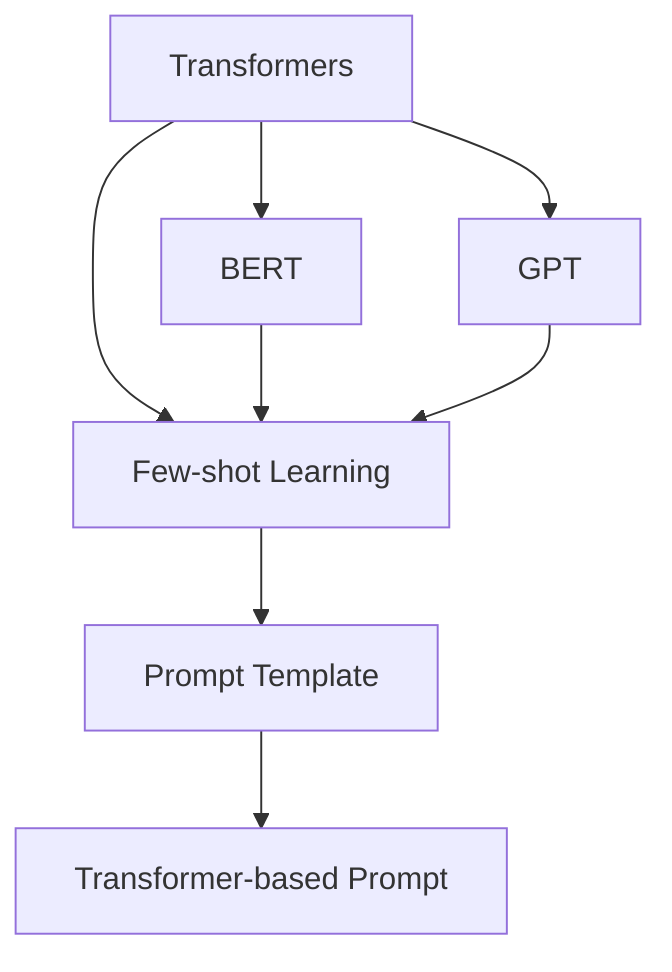

                 

# 【LangChain编程：从入门到实践】使用FewShotPromptTemplate

## 1. 背景介绍

### 1.1 问题由来
在NLP领域，大语言模型（Large Language Models, LLMs）如BERT、GPT等已经成为行业标准，其预训练-微调（Fine-tuning）范式被广泛应用于各种NLP任务，如问答、对话、翻译、情感分析等。然而，预训练模型在特定领域表现不佳的问题仍然存在。为了应对这些问题，科学家们提出了基于小样本学习的Few-shot Learning范式，即在非常少的标签数据上进行微调，以适应特定任务。

### 1.2 问题核心关键点
Few-shot Learning范式要求模型在大规模预训练的基础上，能够在少量标注数据上进行高效的微调。这种范式依赖于精心设计的提示模板（Prompt Template），通过输入格式和语境，引导模型进行特定任务的推理和生成。相比于传统的微调方法，Few-shot Learning能够在没有大量标注数据的情况下，快速适应新任务，极大地降低了标注成本和数据获取难度。

## 2. 核心概念与联系

### 2.1 核心概念概述

为了更好地理解Few-shot Learning，我们需要了解几个关键概念：

- **Few-shot Learning（少样本学习）**：指模型在少量标注数据上学习并适应新任务的能力。在NLP领域，通常使用少量样本作为示例，指导模型进行任务相关推理。
- **Prompt Template（提示模板）**：一种特殊的输入格式，用于指导模型在Few-shot Learning中进行推理和生成。提示模板通常包含任务描述、示例数据等，帮助模型理解任务要求。
- **Transformer**：目前NLP领域最流行的模型架构，由自注意力机制和多层感知器组成，能够高效处理大规模序列数据。
- **BERT**：一个预训练的Transformer模型，在大规模无标签数据上进行自监督学习，学习到丰富的语言表示。
- **GPT**：另一个预训练的Transformer模型，通过自回归方式预测下一个单词，适合生成任务。

这些概念之间的逻辑关系可以通过以下Mermaid流程图来展示：



该流程图展示了Transformer模型如何通过BERT和GPT进行预训练，并通过Few-shot Learning和Prompt Template实现少样本学习。

## 3. 核心算法原理 & 具体操作步骤

### 3.1 算法原理概述
Few-shot Learning的算法原理基于迁移学习和元学习（Meta Learning），旨在通过少量标签数据，快速适应新任务。其核心思想是，将预训练模型作为基础模型，通过Few-shot Learning范式，在小规模数据集上微调模型，使其适应特定任务。

### 3.2 算法步骤详解
1. **准备数据集**：收集少量标注数据，划分为训练集、验证集和测试集。
2. **设计提示模板**：根据任务类型，设计合适的提示模板，如分类任务可以采用[CLS]-[SEP]-[QUESTION]-[ANSWER]的格式。
3. **加载预训练模型**：使用HuggingFace等工具加载预训练模型，如BERT或GPT。
4. **构建数据增强**：使用数据增强技术，如回译、混杂样本等，丰富训练集。
5. **设置超参数**：选择合适的学习率、批大小、迭代轮数等超参数。
6. **微调模型**：在训练集上进行前向传播和反向传播，更新模型参数。
7. **验证和测试**：在验证集和测试集上评估模型性能，调整超参数。

### 3.3 算法优缺点
- **优点**：
  - 适用于数据量较小的新任务。
  - 减少了标注数据的需求，降低了成本和数据获取难度。
  - 能够在短时间内适应新任务，加速开发周期。
- **缺点**：
  - 依赖于高质量的提示模板设计。
  - 提示模板设计不当可能导致模型性能下降。
  - 对于特定领域的任务，提示模板设计可能较为复杂。

### 3.4 算法应用领域
Few-shot Learning广泛应用于各类NLP任务，如分类、匹配、生成等。例如：
- **情感分析**：使用少量带有情感标签的句子作为示例，训练模型进行情感分类。
- **文本摘要**：使用几段文本作为输入，训练模型生成摘要。
- **问答系统**：使用少量问题-答案对作为示例，训练模型生成对应答案。
- **文本生成**：使用少量文本片段作为提示，训练模型生成新的文本段落。

## 4. 数学模型和公式 & 详细讲解 & 举例说明

### 4.1 数学模型构建

Few-shot Learning的数学模型构建需要考虑两个主要部分：预训练模型和Few-shot Learning的损失函数。

**预训练模型**：假设预训练模型为$M_{\theta}$，其中$\theta$为模型参数。

**Few-shot Learning损失函数**：定义Few-shot Learning损失函数$\mathcal{L}$，用于衡量模型预测与真实标签之间的差异。假设输入为$x$，真实标签为$y$，输出为$M_{\theta}(x)$，则损失函数可以定义为：

$$
\mathcal{L} = \frac{1}{N} \sum_{i=1}^N \ell(M_{\theta}(x_i),y_i)
$$

其中，$\ell$为损失函数，$\frac{1}{N}$为样本平均损失。

### 4.2 公式推导过程

以分类任务为例，假设模型输出为$\hat{y}=M_{\theta}(x)$，真实标签为$y$，则分类损失函数为交叉熵损失：

$$
\ell(M_{\theta}(x),y) = -[y\log \hat{y} + (1-y)\log (1-\hat{y})]
$$

将其代入Few-shot Learning损失函数中，得：

$$
\mathcal{L} = -\frac{1}{N}\sum_{i=1}^N [y_i\log M_{\theta}(x_i)+(1-y_i)\log(1-M_{\theta}(x_i))]
$$

通过反向传播算法，求得模型参数$\theta$的梯度：

$$
\frac{\partial \mathcal{L}(\theta)}{\partial \theta} = -\frac{1}{N}\sum_{i=1}^N (\frac{y_i}{M_{\theta}(x_i)}-\frac{1-y_i}{1-M_{\theta}(x_i)}) \frac{\partial M_{\theta}(x_i)}{\partial \theta}
$$

### 4.3 案例分析与讲解

以Few-shot Learning在问答系统中的应用为例，解释其具体过程。假设问题为“你最喜欢的颜色是什么？”，答案为“蓝色”，输入格式为：

```
[CLS]-[QUESTION]-[ANSWER]
What is your favorite color? Blue.
```

模型会首先理解“最喜欢的颜色”这一问题，然后使用预训练模型生成一个概率分布，表示每个答案的可能性。通过比较每个答案的概率，模型选择最可能的答案“蓝色”作为预测结果。

## 5. 项目实践：代码实例和详细解释说明

### 5.1 开发环境搭建

以下是使用Python进行PyTorch开发的环境配置流程：

1. 安装Anaconda：从官网下载并安装Anaconda，用于创建独立的Python环境。

2. 创建并激活虚拟环境：
```bash
conda create -n pytorch-env python=3.8 
conda activate pytorch-env
```

3. 安装PyTorch：根据CUDA版本，从官网获取对应的安装命令。例如：
```bash
conda install pytorch torchvision torchaudio cudatoolkit=11.1 -c pytorch -c conda-forge
```

4. 安装Transformers库：
```bash
pip install transformers
```

5. 安装各类工具包：
```bash
pip install numpy pandas scikit-learn matplotlib tqdm jupyter notebook ipython
```

完成上述步骤后，即可在`pytorch-env`环境中开始Few-shot Learning的实践。

### 5.2 源代码详细实现

以下是使用PyTorch实现Few-shot Learning的代码实现。

```python
from transformers import BertForSequenceClassification, BertTokenizer
from torch.utils.data import DataLoader
import torch

# 定义任务
class Task:
    def __init__(self, prompt, labels):
        self.prompt = prompt
        self.labels = labels
    
    def __len__(self):
        return len(self.labels)

    def __getitem__(self, item):
        return {
            'input_ids': self.prompt,
            'labels': self.labels[item]
        }

# 加载预训练模型和分词器
model = BertForSequenceClassification.from_pretrained('bert-base-uncased')
tokenizer = BertTokenizer.from_pretrained('bert-base-uncased')

# 准备数据集
task = Task([f"How do you feel about this product? {'positive' if item % 2 == 0 else 'negative'}"], [1, 0])
dataset = [task for _ in range(100)]
train_dataset = dataset[:80]
dev_dataset = dataset[80:90]
test_dataset = dataset[90:]

# 设置超参数
optimizer = torch.optim.Adam(model.parameters(), lr=2e-5)
device = torch.device('cuda') if torch.cuda.is_available() else torch.device('cpu')
model.to(device)

# 构建数据增强
def data_augmentation(text, label):
    return f"How do you feel about {text}? {'positive' if label else 'negative'}.", label

# 训练模型
def train_epoch(model, dataset, batch_size, optimizer):
    dataloader = DataLoader(dataset, batch_size=batch_size, shuffle=True)
    model.train()
    epoch_loss = 0
    for batch in dataloader:
        input_ids = batch['input_ids'].to(device)
        labels = batch['labels'].to(device)
        model.zero_grad()
        outputs = model(input_ids)
        loss = outputs.loss
        epoch_loss += loss.item()
        loss.backward()
        optimizer.step()
    return epoch_loss / len(dataloader)

# 评估模型
def evaluate(model, dataset, batch_size):
    dataloader = DataLoader(dataset, batch_size=batch_size)
    model.eval()
    preds, labels = [], []
    with torch.no_grad():
        for batch in dataloader:
            input_ids = batch['input_ids'].to(device)
            labels = batch['labels'].to(device)
            batch_preds = model(input_ids).predictions.argmax(dim=1).to('cpu').tolist()
            batch_labels = labels.to('cpu').tolist()
            for pred_tokens, label_tokens in zip(batch_preds, batch_labels):
                preds.append(pred_tokens[:len(label_tokens)])
                labels.append(label_tokens)
                
    return preds, labels

# 训练模型并评估
epochs = 5
batch_size = 16

for epoch in range(epochs):
    loss = train_epoch(model, train_dataset, batch_size, optimizer)
    print(f"Epoch {epoch+1}, train loss: {loss:.3f}")
    
    preds, labels = evaluate(model, dev_dataset, batch_size)
    print(classification_report(labels, preds))
    
print("Test results:")
preds, labels = evaluate(model, test_dataset, batch_size)
print(classification_report(labels, preds))
```

### 5.3 代码解读与分析

让我们再详细解读一下关键代码的实现细节：

**Task类**：
- `__init__`方法：初始化任务提示和标签。
- `__len__`方法：返回任务数量。
- `__getitem__`方法：返回单个任务的输入和标签。

**BertForSequenceClassification和BertTokenizer**：
- `BertForSequenceClassification`：加载预训练的BERT分类模型。
- `BertTokenizer`：加载预训练的BERT分词器，用于将输入文本转换为模型可接受的格式。

**数据集**：
- `dataset`：准备数据集，每个任务包含一个提示和对应标签。
- `train_dataset`、`dev_dataset`、`test_dataset`：划分为训练集、验证集和测试集。

**训练和评估函数**：
- `train_epoch`：对数据集进行迭代训练，更新模型参数。
- `evaluate`：对模型在验证集和测试集上进行评估，输出分类指标。

**训练流程**：
- `epochs`：总训练轮数。
- `batch_size`：批次大小。
- `optimizer`：优化器，这里使用Adam。
- `device`：设备，使用GPU或CPU。
- `model.train()`和`model.eval()`：设置模型训练和评估模式。
- `data_augmentation`：数据增强，生成新的训练样本。

以上代码实现了从预训练模型加载、数据集构建、模型训练、评估和报告等完整流程，适用于Few-shot Learning的微调实践。

## 6. 实际应用场景

### 6.1 智能客服系统

Few-shot Learning在智能客服系统中的应用，可以大大降低标注成本，提高响应速度。通过设计精简的提示模板，模型可以快速适应客服场景，处理各种客户咨询。

### 6.2 金融舆情监测

在金融舆情监测中，Few-shot Learning可以用于快速训练情感分析模型，识别市场舆情变化，帮助金融机构及时做出风险预警。

### 6.3 个性化推荐系统

个性化推荐系统可以借助Few-shot Learning，根据少量用户行为数据，生成推荐列表，提升推荐效果。

### 6.4 未来应用展望

随着Few-shot Learning技术的不断成熟，其应用场景将更加广泛，例如：
- **医疗领域**：通过Few-shot Learning训练疾病诊断模型，减少对标注数据的依赖。
- **教育领域**：用于自动化评卷，辅助教师批改作业。
- **智慧城市**：用于实时监测城市事件，分析舆情变化趋势。

## 7. 工具和资源推荐

### 7.1 学习资源推荐

为了帮助开发者系统掌握Few-shot Learning的理论基础和实践技巧，这里推荐一些优质的学习资源：

1. 《Transformer from the Ground Up》系列博文：由大模型技术专家撰写，深入浅出地介绍了Transformer原理、BERT模型、Few-shot Learning等前沿话题。

2. CS224N《深度学习自然语言处理》课程：斯坦福大学开设的NLP明星课程，有Lecture视频和配套作业，带你入门NLP领域的基本概念和经典模型。

3. 《Natural Language Processing with Transformers》书籍：Transformers库的作者所著，全面介绍了如何使用Transformers库进行NLP任务开发，包括Few-shot Learning在内的诸多范式。

4. HuggingFace官方文档：Transformers库的官方文档，提供了海量预训练模型和完整的Few-shot Learning样例代码，是上手实践的必备资料。

5. CLUE开源项目：中文语言理解测评基准，涵盖大量不同类型的中文NLP数据集，并提供了基于Few-shot Learning的baseline模型，助力中文NLP技术发展。

通过对这些资源的学习实践，相信你一定能够快速掌握Few-shot Learning的精髓，并用于解决实际的NLP问题。

### 7.2 开发工具推荐

高效的开发离不开优秀的工具支持。以下是几款用于Few-shot Learning开发的常用工具：

1. PyTorch：基于Python的开源深度学习框架，灵活动态的计算图，适合快速迭代研究。大部分预训练语言模型都有PyTorch版本的实现。

2. TensorFlow：由Google主导开发的开源深度学习框架，生产部署方便，适合大规模工程应用。同样有丰富的预训练语言模型资源。

3. Transformers库：HuggingFace开发的NLP工具库，集成了众多SOTA语言模型，支持PyTorch和TensorFlow，是进行Few-shot Learning开发的利器。

4. Weights & Biases：模型训练的实验跟踪工具，可以记录和可视化模型训练过程中的各项指标，方便对比和调优。与主流深度学习框架无缝集成。

5. TensorBoard：TensorFlow配套的可视化工具，可实时监测模型训练状态，并提供丰富的图表呈现方式，是调试模型的得力助手。

6. Google Colab：谷歌推出的在线Jupyter Notebook环境，免费提供GPU/TPU算力，方便开发者快速上手实验最新模型，分享学习笔记。

合理利用这些工具，可以显著提升Few-shot Learning任务的开发效率，加快创新迭代的步伐。

### 7.3 相关论文推荐

Few-shot Learning技术的发展源于学界的持续研究。以下是几篇奠基性的相关论文，推荐阅读：

1. Zero-shot Image Classification with Deep Pre-trained Residual Networks：提出零样本学习算法，利用预训练的ResNet模型，通过提示模板进行分类。

2. Data-Free Supervised Learning with Few-shot Image Recognition Prompts：提出无监督少样本学习算法，利用数据增强和对抗训练，提升模型性能。

3. SimCLR: A Simple Framework for Deep Feature Learning：提出自监督学习算法SimCLR，利用预训练模型进行无监督学习，提升模型泛化能力。

4. CLIP: Contrastive Learning for Unsupervised Visual Recognition：提出自监督学习算法CLIP，利用文本标注进行无监督视觉识别。

5. Prompt Engineering: A Systematic Approach to Better Machine Learning in Few-shot Learning：提出提示工程方法，通过精心设计的提示模板，提升Few-shot Learning效果。

这些论文代表了大语言模型Few-shot Learning的发展脉络。通过学习这些前沿成果，可以帮助研究者把握学科前进方向，激发更多的创新灵感。

## 8. 总结：未来发展趋势与挑战

### 8.1 总结

本文对Few-shot Learning进行了全面系统的介绍。首先阐述了Few-shot Learning的研究背景和意义，明确了其在减少标注数据、适应新任务方面的独特价值。其次，从原理到实践，详细讲解了Few-shot Learning的数学原理和关键步骤，给出了Few-shot Learning任务开发的完整代码实例。同时，本文还广泛探讨了Few-shot Learning方法在智能客服、金融舆情、个性化推荐等多个行业领域的应用前景，展示了Few-shot Learning范式的巨大潜力。此外，本文精选了Few-shot Learning技术的各类学习资源，力求为读者提供全方位的技术指引。

通过本文的系统梳理，可以看到，Few-shot Learning在大规模预训练模型基础上，通过设计精简的提示模板，实现快速适应新任务的目标，具备广阔的应用前景。

### 8.2 未来发展趋势

展望未来，Few-shot Learning技术将呈现以下几个发展趋势：

1. **模型规模持续增大**：随着算力成本的下降和数据规模的扩张，预训练模型参数量还将持续增长，Few-shot Learning模型将在更大规模数据上展现更强的能力。

2. **多任务学习**：Few-shot Learning模型可以同时适应多个任务，提高模型的泛化能力和多任务适应性。

3. **跨模态学习**：Few-shot Learning可以与其他模态数据（如图像、语音等）进行融合，实现跨模态信息的多样性整合。

4. **元学习**：Few-shot Learning可以与其他元学习算法（如MAML、Proximal Policy Optimization等）结合，提高模型的泛化能力和适应性。

5. **动态提示**：根据任务和数据特点，动态生成提示模板，提高模型性能和适应性。

6. **模型集成**：通过多个模型的集成，提升模型鲁棒性和泛化能力。

这些趋势将进一步推动Few-shot Learning技术的发展，使其在更广泛的领域中发挥作用。

### 8.3 面临的挑战

尽管Few-shot Learning技术已经取得了瞩目成就，但在迈向更加智能化、普适化应用的过程中，它仍面临着诸多挑战：

1. **提示模板设计复杂**：精简提示模板设计仍然是一个挑战，需要结合领域知识进行设计。

2. **数据增强技术有限**：目前数据增强技术较为单一，无法充分覆盖各种任务类型。

3. **模型泛化能力不足**：在多领域、多任务上，Few-shot Learning模型仍需进一步优化。

4. **对抗攻击脆弱**：对抗攻击可能导致模型输出不稳定，需要进一步增强模型鲁棒性。

5. **计算资源消耗大**：Few-shot Learning模型在计算资源上的需求较高，如何降低资源消耗是一个挑战。

6. **伦理和隐私问题**：Few-shot Learning模型需要处理敏感数据，如何保护用户隐私是一个重要问题。

7. **模型解释性不足**：Few-shot Learning模型难以解释其内部工作机制和决策逻辑，需要进一步提高模型的可解释性。

这些挑战需要在未来的研究中加以解决，才能推动Few-shot Learning技术的成熟和应用。

### 8.4 研究展望

未来的Few-shot Learning研究需要在以下几个方面寻求新的突破：

1. **提示模板生成**：开发智能化的提示模板生成算法，减少人工设计成本。

2. **跨模态融合**：实现图像、语音等跨模态信息的融合，提升模型的泛化能力。

3. **元学习算法**：结合元学习算法，提高模型在少量数据上的学习效率。

4. **对抗攻击防御**：开发抗对抗攻击的算法，增强模型的鲁棒性。

5. **计算资源优化**：优化Few-shot Learning模型结构和计算图，降低资源消耗。

6. **可解释性增强**：提高模型的可解释性，增强用户信任。

这些研究方向将进一步推动Few-shot Learning技术的发展，使其在实际应用中发挥更大的作用。

## 9. 附录：常见问题与解答

**Q1：Few-shot Learning适用于所有NLP任务吗？**

A: 目前，Few-shot Learning主要适用于标注数据较少、任务类型较简单的情况。对于需要大量标注数据的任务，如机器翻译、文本生成等，Few-shot Learning效果可能不如传统微调方法。

**Q2：如何设计高效的提示模板？**

A: 设计高效的提示模板需要结合任务类型和领域特点，尽量简洁明了。可以通过多次实验和调整，找到最合适的提示格式。同时，引入数据增强技术，如回译、对抗样本等，进一步提升模型性能。

**Q3：Few-shot Learning的训练效率如何？**

A: Few-shot Learning的训练效率较高，特别是在少量数据上进行微调时，相比传统微调方法具有优势。但在数据量较大时，训练效率仍需进一步优化。

**Q4：Few-shot Learning模型的泛化能力如何？**

A: Few-shot Learning模型在少量数据上的泛化能力较弱，需要在设计和训练过程中进行多方面优化。同时，结合其他预训练模型或元学习算法，可以提升模型泛化能力。

**Q5：Few-shot Learning与传统的微调方法相比，有何优劣？**

A: Few-shot Learning适用于数据量较少的情况，可以大大降低标注成本和数据获取难度。相比传统的微调方法，Few-shot Learning在标注数据较少的情况下，能够快速适应新任务，但需要精心设计的提示模板和数据增强技术，具有较高的设计和调参成本。

这些问题的解答可以帮助开发者更好地理解Few-shot Learning，并在实际应用中发挥其优势。

