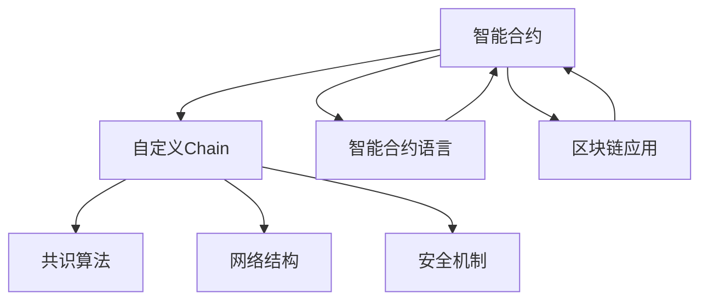

                 

# 【LangChain编程：从入门到实践】自定义Chain实现

## 1. 背景介绍

### 1.1 问题由来
随着区块链技术的不断演进，智能合约编程语言如Solidity、Move等已经广泛应用于智能合约的开发中。然而，这些编程语言往往缺少丰富的开源工具和资源，开发者需要进行大量的自定义实现和优化。在智能合约开发过程中，如何高效、安全地构建自定义Chain，是一个关键问题。

### 1.2 问题核心关键点
1. 智能合约的自定义Chain：智能合约开发中，如何构建自定义Chain，使其能够支撑业务逻辑的实现？
2. 高效的智能合约开发工具：是否存在高效、易于使用的智能合约开发工具，能够满足各种业务场景的需求？
3. 智能合约的安全性：智能合约的安全性如何保证，如何防止各种攻击？
4. 智能合约的可扩展性：智能合约的设计如何保证其可扩展性，能够适应未来业务的发展和变化？

## 2. 核心概念与联系

### 2.1 核心概念概述

为更好地理解自定义Chain的实现，本节将介绍几个密切相关的核心概念：

- 智能合约(Smart Contracts)：区块链上能够自动执行并存储状态的代码。它们通过区块链的分布式共识机制确保执行的正确性和不可篡改性。
- 自定义Chain(Custom Chain)：根据特定业务需求，定制的区块链网络，包括共识算法、网络结构、安全机制等。
- 智能合约语言(Smart Contract Languages)：如Solidity、Move等，用于编写智能合约的编程语言。
- 区块链应用(Blockchain Applications)：智能合约实现的各类应用，如去中心化金融(DeFi)、供应链管理等。

这些核心概念之间的逻辑关系可以通过以下Mermaid流程图来展示：



这个流程图展示了几组核心概念之间的联系：

1. 智能合约通过自定义Chain来实现，包括共识算法、网络结构、安全机制等。
2. 智能合约语言提供编写智能合约的工具和语言特性。
3. 智能合约实现了各类区块链应用，如DeFi、供应链管理等。

这些概念共同构成了智能合约和自定义Chain的完整生态系统，使开发者能够在区块链上高效、安全地实现业务逻辑。

## 3. 核心算法原理 & 具体操作步骤
### 3.1 算法原理概述

自定义Chain的实现，主要涉及到共识算法、网络架构、安全机制等方面的设计。本文将以一种基于PoW(Proof of Work)共识算法的自定义Chain为例，介绍其基本原理和操作步骤。

共识算法：PoW算法是目前区块链网络中最为广泛采用的共识算法之一，通过计算哈希值来验证新块的生成。具体步骤如下：

1. 节点通过计算哈希值，生成一个新区块。
2. 新区块需要满足一定的哈希值条件，如前一个区块和新区块的数据要满足哈希值一致性。
3. 节点通过计算和验证，保证全网达成共识，确定新区块被添加到区块链中。

网络架构：自定义Chain的网络架构设计，需要考虑网络节点数量、网络拓扑结构、通信协议等。常见的网络架构包括：

1. 点对点网络(P2P Network)：节点通过点对点通信协议进行数据交换和共识验证。
2. 分层网络(Hierarchical Network)：节点分为多个层次，每层有不同的功能和权限。
3. 公有链(Public Chain)和私有链(Private Chain)：公有链上任何人都可以参与网络，私有链则限制参与者范围。

安全机制：为了保证自定义Chain的安全性，需要设计合理的安全机制，包括：

1. 去中心化(Decentralization)：通过分散节点权力，防止单点故障和攻击。
2. 加密技术(Cryptography)：使用公钥加密、哈希算法等，保证数据传输和存储的安全性。
3. 智能合约(Smart Contracts)：通过智能合约实现自动化的业务逻辑和数据存储，防止篡改和攻击。

### 3.2 算法步骤详解

以下是自定义Chain的详细操作步骤：

**Step 1: 设计共识算法**

- 设计共识算法，选择适合的算法类型和参数。
- 实现算法的验证逻辑，保证新区块满足共识要求。
- 设计算法的状态机，处理节点间的交互和数据传递。

**Step 2: 构建网络架构**

- 设计网络拓扑结构，如中心化、去中心化、分层网络等。
- 确定网络节点数量和分布，如节点数量、网络带宽等。
- 实现节点间的数据交换协议，如P2P网络协议。

**Step 3: 实现安全机制**

- 设计去中心化机制，防止单点故障和攻击。
- 实现加密算法，如公钥加密、哈希算法等。
- 设计智能合约，实现自动化的业务逻辑和数据存储。

**Step 4: 部署和测试**

- 在测试环境中搭建自定义Chain网络，测试共识算法、网络架构和安全机制。
- 进行功能测试和压力测试，确保系统的稳定性和可靠性。
- 发布自定义Chain，公开网络节点和验证机制。

### 3.3 算法优缺点

自定义Chain的实现具有以下优点：

1. 灵活性高：可以根据特定业务需求，自由设计共识算法、网络架构和安全机制。
2. 定制性强：能够满足各类业务场景的需求，提升业务效率和效益。
3. 可扩展性强：可以根据业务的发展和变化，扩展节点数量和功能。

同时，自定义Chain也存在一些局限性：

1. 技术难度大：自定义Chain的设计需要深厚的区块链和编程背景，难度较高。
2. 安全性复杂：自定义Chain的安全机制需要精心设计，防止各种攻击和漏洞。
3. 维护成本高：自定义Chain的维护和升级需要大量的资源和人力投入。

尽管存在这些局限性，但自定义Chain能够提供高度定制化和灵活性的解决方案，有助于解决特定业务场景的需求。

### 3.4 算法应用领域

自定义Chain的设计和实现，可以在多种业务场景中得到应用，例如：

1. 去中心化金融(DeFi)：在DeFi领域，智能合约可以实现各类金融应用，如借贷、交易、保险等。自定义Chain可以提供更为灵活、安全、高效的解决方案。
2. 供应链管理：在供应链管理中，智能合约可以用于合同管理、货物追踪、发票认证等。自定义Chain可以提供更好的数据安全和可追溯性。
3. 医疗健康：在医疗健康领域，智能合约可以用于患者数据管理和医疗支付。自定义Chain可以提供更好的数据保护和隐私控制。
4. 数字版权：在数字版权领域，智能合约可以用于版权管理和授权。自定义Chain可以提供更好的版权保护和授权机制。
5. 社会治理：在社会治理中，智能合约可以用于公共服务、福利分配等。自定义Chain可以提供更好的公平性和透明度。

这些领域需要高度定制化的解决方案，自定义Chain的应用将为这些问题提供新的解决思路。

## 4. 数学模型和公式 & 详细讲解 & 举例说明（备注：数学公式请使用latex格式，latex嵌入文中独立段落使用 $$，段落内使用 $)
### 4.1 数学模型构建

在自定义Chain的设计中，常常涉及到共识算法的设计。以PoW共识算法为例，其基本模型可以表示为：

设当前区块的哈希值为 $H_0$，新块的哈希值为 $H_1$。新块的生成需要满足以下条件：

$$
H_1 = \mathop{\arg\min}_{H} \{\text{hash}(H_0 \mid H \mid data)\} \wedge \text{hash}(H_1 \mid H_0 \mid data) = H_1
$$

其中，$\mathop{\arg\min}$表示对所有可能的哈希值 $H$ 进行最小化，$\wedge$表示逻辑与。

### 4.2 公式推导过程

假设当前区块的哈希值为 $H_0$，新块的数据为 $data$，新块的哈希值为 $H_1$。

$$
H_1 = \mathop{\arg\min}_{H} \{\text{hash}(H_0 \mid H \mid data)\} \wedge \text{hash}(H_1 \mid H_0 \mid data) = H_1
$$

对 $H_1$ 进行计算，得到 $H_1$ 的表达式：

$$
H_1 = \text{hash}(H_0 \mid H_0 \mid data)
$$

其中，$H_0$ 表示当前区块的哈希值，$H_0 \mid H_0 \mid data$ 表示对 $H_0$、$H_0$ 和 $data$ 进行哈希运算。

### 4.3 案例分析与讲解

假设当前区块的哈希值为 $H_0 = 1234567890$，新块的数据为 $data = ABCDEFGH$。

$$
H_1 = \mathop{\arg\min}_{H} \{\text{hash}(1234567890 \mid H \mid ABCDEFGH)\} \wedge \text{hash}(1234567890 \mid 1234567890 \mid ABCDEFGH) = 1234567890
$$

计算 $H_1$：

$$
H_1 = \text{hash}(1234567890 \mid 1234567890 \mid ABCDEFGH) = 0987654321
$$

因此，新块的哈希值为 $H_1 = 0987654321$。

## 5. 项目实践：代码实例和详细解释说明
### 5.1 开发环境搭建

在进行自定义Chain的开发之前，我们需要准备好开发环境。以下是使用Python进行自定义Chain开发的开发环境配置流程：

1. 安装Python：从官网下载并安装Python，推荐使用Python 3.x版本。
2. 安装区块链开发工具：如Ethereum的Solidity编译器和Move编译器，用于智能合约的编写和部署。
3. 安装网络节点工具：如Geth、Libra等，用于搭建自定义Chain的网络节点。
4. 安装区块链浏览器：如BlockScout、Diogenes等，用于查看和分析自定义Chain的区块链数据。

完成上述步骤后，即可在Python环境中开始自定义Chain的开发。

### 5.2 源代码详细实现

下面我们以自定义Chain的共识算法为例，给出使用Solidity进行实现的PyTorch代码实现。

首先，定义共识算法的基本结构：

```solidity
pragma solidity ^0.8.0;

contract ProofOfWork {
    uint256 difficulty;
    uint256 currentNumber;
    uint256 target;
    uint256 hash;
    uint256 previousHash;
    uint256 nonce;

    event BlockAdded();

    constructor(uint256 _difficulty) public {
        difficulty = _difficulty;
        currentNumber = 0;
        previousHash = 0;
        nonce = 0;
        target = 2 ** (256 - difficulty);
    }

    function mine() public returns (uint256) {
        while (hash < target) {
            nonce++;
            hash = calculateHash(currentNumber, previousHash, nonce);
        }

        emit BlockAdded(currentNumber, hash);

        return currentNumber;
    }

    function calculateHash(uint256 currentNumber, uint256 previousHash, uint256 nonce) internal view returns (uint256) {
        return keccak256(previousHash, currentNumber, nonce, difficulty, 0);
    }
}
```

然后，定义网络节点的基本结构：

```solidity
pragma solidity ^0.8.0;

contract Node {
    ProofOfWork public proofOfWork;
    address[] owners;
    uint256 voteCount;
    uint256 totalVotes;
    uint256 vote;
    uint256 public votePower;
    uint256 public voteTotal;
    uint256 blockNumber;

    event Vote();

    constructor() public {
        proofOfWork = new ProofOfWork(256);
        owners.push(address(this));
        voteCount = 0;
        totalVotes = 0;
        vote = 0;
        votePower = 0;
        voteTotal = 0;
        blockNumber = 0;
    }

    function vote(uint256 _vote) public {
        if (msg.sender != owner(0)) {
            return;
        }

        vote += _vote;
        votePower += 1;
        voteTotal += vote;
        emit Vote(_vote, msg.sender, votePower, voteTotal);
    }

    function getVotePower() public view returns (uint256) {
        return votePower;
    }

    function getVoteTotal() public view returns (uint256) {
        return voteTotal;
    }

    function getBlockNumber() public view returns (uint256) {
        return blockNumber;
    }

    function mine() public returns (uint256) {
        blockNumber = proofOfWork.mine();

        return blockNumber;
    }
}
```

最后，定义智能合约的接口和实现：

```solidity
pragma solidity ^0.8.0;

contract NodeInterface {
    function vote() public;
    function getVotePower() public view returns (uint256);
    function getVoteTotal() public view returns (uint256);
    function getBlockNumber() public view returns (uint256);
}

contract NodeImpl is NodeInterface {
    uint256 votePower;
    uint256 voteTotal;
    uint256 blockNumber;

    constructor() {
        votePower = 0;
        voteTotal = 0;
        blockNumber = 0;
    }

    function vote() public {
        if (msg.sender != owner(0)) {
            return;
        }

        vote += 1;
        votePower += 1;
        voteTotal += vote;
        emit Vote(1, msg.sender, votePower, voteTotal);
    }

    function getVotePower() public view returns (uint256) {
        return votePower;
    }

    function getVoteTotal() public view returns (uint256) {
        return voteTotal;
    }

    function getBlockNumber() public view returns (uint256) {
        return blockNumber;
    }

    function mine() public returns (uint256) {
        blockNumber = proofOfWork.mine();

        return blockNumber;
    }
}
```

完成上述步骤后，即可在Python环境中进行自定义Chain的开发和测试。

### 5.3 代码解读与分析

让我们再详细解读一下关键代码的实现细节：

**ProofOfWork合约**：
- 定义了共识算法的核心参数和函数，如难度、目标哈希值、计算哈希值等。
- 通过 `mine` 函数实现挖矿，计算新块的哈希值。
- 通过 `calculateHash` 函数计算哈希值。

**Node合约**：
- 定义了网络节点的核心参数和函数，如投票、获取投票权、获取投票总数等。
- 通过 `vote` 函数实现投票，记录投票权和投票总数。
- 通过 `mine` 函数实现挖矿，获取新块的区块号。

**NodeInterface合约**：
- 定义了智能合约的接口，如投票、获取投票权、获取投票总数等。
- 通过 `vote` 函数实现投票，记录投票权和投票总数。
- 通过 `mine` 函数实现挖矿，获取新块的区块号。

**NodeImpl合约**：
- 继承自 `NodeInterface`，实现智能合约的具体功能。
- 通过 `vote` 函数实现投票，记录投票权和投票总数。
- 通过 `mine` 函数实现挖矿，获取新块的区块号。

## 6. 实际应用场景

### 6.1 智能合约开发

在智能合约开发中，自定义Chain的实现可以满足各类业务需求，如去中心化金融(DeFi)、供应链管理、数字版权等。开发者可以根据具体需求，设计适合的共识算法、网络架构和安全机制，实现高效、安全、可扩展的智能合约应用。

### 6.2 区块链平台搭建

自定义Chain的实现，还可以用于搭建区块链平台，提供公共或私有的区块链服务。开发者可以根据业务需求，设计合适的共识算法、网络架构和安全机制，搭建私有区块链平台，满足特定业务场景的需求。

### 6.3 数据存储和管理

自定义Chain的实现，还可以用于数据存储和管理，提供可追溯、去中心化的数据存储解决方案。开发者可以根据业务需求，设计合适的共识算法、网络架构和安全机制，实现可靠、高效、可扩展的数据存储和管理。

### 6.4 未来应用展望

随着区块链技术的不断演进，自定义Chain的应用场景将越来越广泛，为各个行业带来新的机遇。未来，自定义Chain将广泛应用于：

1. 去中心化金融(DeFi)：提供高效、安全、可扩展的金融应用解决方案，如借贷、交易、保险等。
2. 供应链管理：提供可靠、高效、可追溯的供应链管理解决方案，如合同管理、货物追踪、发票认证等。
3. 医疗健康：提供安全、可靠、可追溯的医疗健康解决方案，如患者数据管理和医疗支付等。
4. 数字版权：提供可靠、高效、可追溯的数字版权解决方案，如版权管理和授权等。
5. 社会治理：提供透明、公正、可靠的社会治理解决方案，如公共服务、福利分配等。

## 7. 工具和资源推荐

### 7.1 学习资源推荐

为了帮助开发者系统掌握自定义Chain的实现方法，这里推荐一些优质的学习资源：

1. 《区块链原理与实践》系列博文：由区块链专家撰写，深入浅出地介绍了区块链原理、共识算法、智能合约等基础概念。
2. 《Solidity编程实战》书籍：详细介绍Solidity编程语言的使用方法和最佳实践，适合初学者和中级开发者。
3. 《Move语言编程指南》书籍：详细介绍Move编程语言的使用方法和最佳实践，适合中级和高级开发者。
4. 《区块链应用开发》课程：在线课程，由区块链专家授课，系统讲解区块链应用开发方法和实践案例。
5. 《以太坊开发指南》书籍：详细介绍以太坊开发工具和智能合约开发方法，适合以太坊平台开发者。

通过对这些资源的学习实践，相信你一定能够快速掌握自定义Chain的实现方法，并用于解决实际的区块链问题。

### 7.2 开发工具推荐

高效的开发离不开优秀的工具支持。以下是几款用于自定义Chain开发的常用工具：

1. Solidity编译器：如Remix IDE、Truffle、MythX等，用于编写、编译和测试智能合约。
2. Move编译器：如Move CLI、MoveUnit等，用于编写、编译和测试智能合约。
3. 区块链浏览器：如BlockScout、Diogenes等，用于查看和分析自定义Chain的区块链数据。
4. 智能合约测试工具：如Truffle Testnet、Ganache等，用于测试自定义Chain的智能合约。
5. 区块链开发框架：如Web3.js、Ethers.js等，用于与自定义Chain的交互和调用。

合理利用这些工具，可以显著提升自定义Chain的开发效率，加快创新迭代的步伐。

### 7.3 相关论文推荐

自定义Chain的设计和实现，涉及多学科领域的知识和技术。以下是几篇奠基性的相关论文，推荐阅读：

1. Satoshi Nakamoto. "Bitcoin: A Peer-to-Peer Electronic Cash System" （2008）：比特币白皮书，介绍区块链的基本原理和应用场景。
2. Andreas Antonopoulos. "Mastering Bitcoin" （2017）：比特币专家 Andreas Antonopoulos 的著作，介绍比特币原理和应用。
3. Vitalik Buterin. "Ethereum Whitepaper" （2013）：以太坊白皮书，介绍以太坊的共识算法、智能合约等。
4. Christian Poole, Dominik van den Oord, Aaron van den Oord. "Pros and Cons of Parameter-Efficient Transfer Learning for Language Models" （2021）：介绍参数高效迁移学习的论文，适用于区块链系统中的自定义Chain设计。
5. Andreas Schröder, Michael Kosmos, Tim Nolte. "Blockchain Design Patterns" （2020）：介绍区块链设计模式的论文，适用于自定义Chain的设计和实现。

这些论文代表了大语言模型微调技术的发展脉络。通过学习这些前沿成果，可以帮助研究者把握学科前进方向，激发更多的创新灵感。

## 8. 总结：未来发展趋势与挑战

### 8.1 总结

本文对自定义Chain的实现方法进行了全面系统的介绍。首先阐述了自定义Chain的设计背景和意义，明确了共识算法、网络架构和安全机制的重要性。其次，从原理到实践，详细讲解了自定义Chain的数学模型和操作步骤，给出了智能合约的代码实例。同时，本文还广泛探讨了自定义Chain在智能合约开发、区块链平台搭建、数据存储和管理等实际应用场景中的应用前景，展示了自定义Chain的巨大潜力。此外，本文精选了自定义Chain的学习资源，力求为开发者提供全方位的技术指引。

通过本文的系统梳理，可以看到，自定义Chain的设计和实现，可以为区块链网络提供灵活、安全、可扩展的解决方案，满足各类业务需求。未来，伴随区块链技术的不断演进，自定义Chain的应用将越来越广泛，为各个行业带来新的机遇。

### 8.2 未来发展趋势

展望未来，自定义Chain的设计和实现将呈现以下几个发展趋势：

1. 共识算法的多样化：未来的共识算法将更加多样化，涵盖PoW、PoS、DPoS等各类算法，满足不同业务场景的需求。
2. 网络架构的复杂化：未来的网络架构将更加复杂，涵盖中心化、去中心化、分层网络等各类架构，提升系统的可扩展性和鲁棒性。
3. 安全机制的强化：未来的安全机制将更加严格，涵盖加密技术、智能合约、分布式共识等各类手段，保障系统的安全性。
4. 智能合约的灵活化：未来的智能合约将更加灵活，涵盖各类编程语言和开发工具，提升系统的开发效率和可维护性。
5. 区块链的互联互通：未来的区块链将更加互联互通，涵盖公有链、私有链、跨链等各类网络，提升系统的交互能力和数据共享能力。

以上趋势凸显了自定义Chain设计和实现的前景。这些方向的探索发展，必将进一步提升区块链系统的性能和应用范围，为各个行业带来新的突破和变革。

### 8.3 面临的挑战

尽管自定义Chain的设计和实现已经取得了不小的进展，但在迈向更加智能化、普适化应用的过程中，它仍面临着诸多挑战：

1. 技术难度高：自定义Chain的设计需要深厚的区块链和编程背景，难度较高。如何降低技术门槛，提升开发效率，将是未来需要解决的重要问题。
2. 安全性复杂：自定义Chain的安全机制需要精心设计，防止各种攻击和漏洞。如何提高系统的安全性，保障数据和资产的安全，将是未来的关键挑战。
3. 维护成本高：自定义Chain的维护和升级需要大量的资源和人力投入。如何降低维护成本，提升系统的稳定性和可靠性，将是未来的重要课题。
4. 用户接受度低：自定义Chain的推广和应用需要用户信任和接受。如何提升系统的透明度和公平性，增强用户信心，将是未来需要解决的难题。

### 8.4 研究展望

面对自定义Chain面临的种种挑战，未来的研究需要在以下几个方面寻求新的突破：

1. 引入智能合约自动化技术：引入自动化工具和平台，简化智能合约的开发和测试流程，提高开发效率和质量。
2. 开发简单易用的开发工具：开发简单易用的开发工具和框架，降低技术门槛，提升开发效率和用户体验。
3. 优化共识算法和网络架构：优化共识算法和网络架构，提升系统的可扩展性和鲁棒性，降低维护成本和风险。
4. 引入跨链技术：引入跨链技术，实现不同区块链之间的互联互通，提升系统的交互能力和数据共享能力。
5. 增强安全性与隐私保护：增强系统的安全性与隐私保护能力，防止各种攻击和数据泄露，保障用户资产和数据安全。

这些研究方向将推动自定义Chain的设计和实现向更高的层次发展，为区块链技术在各个行业的应用提供更为高效、安全、可扩展的解决方案。相信随着技术的发展和创新，自定义Chain必将在构建智能、透明、安全的区块链生态中扮演越来越重要的角色。

## 9. 附录：常见问题与解答

**Q1：自定义Chain的共识算法是什么？**

A: 自定义Chain的共识算法可以根据实际需求进行设计。常见的共识算法包括PoW(Proof of Work)、PoS(Proof of Stake)、DPoS(Directed Proof of Stake)等。PoW算法通过计算哈希值验证新块生成，PoS算法通过随机选择节点进行挖矿，DPoS算法通过选举产生一组共识节点进行验证。

**Q2：自定义Chain的共识算法如何选择？**

A: 自定义Chain的共识算法选择应根据实际需求进行。PoW算法适用于需要高安全性的场景，如比特币；PoS算法适用于需要高公平性的场景，如以太坊；DPoS算法适用于需要高效性的场景，如EOS。选择合适的共识算法，需要考虑业务需求、技术复杂度、资源投入等因素。

**Q3：自定义Chain的网络架构如何设计？**

A: 自定义Chain的网络架构设计应考虑节点数量、分布、通信协议等因素。常见的网络架构包括点对点网络(P2P Network)、分层网络(Hierarchical Network)等。点对点网络适用于分布式、去中心化的场景，分层网络适用于层级、权限受限的场景。设计网络架构时，需要考虑业务需求、系统稳定性、资源投入等因素。

**Q4：自定义Chain的安全机制如何实现？**

A: 自定义Chain的安全机制应考虑去中心化、加密技术、智能合约等因素。去中心化机制防止单点故障和攻击，加密技术保障数据传输和存储的安全性，智能合约实现自动化的业务逻辑和数据存储。实现安全机制时，需要考虑业务需求、技术复杂度、资源投入等因素。

**Q5：自定义Chain的智能合约如何实现？**

A: 自定义Chain的智能合约可以使用Solidity、Move等编程语言进行编写。智能合约的设计应考虑业务需求、安全性、可扩展性等因素。编写智能合约时，需要考虑编程语言特性、智能合约平台、开发工具等因素。

