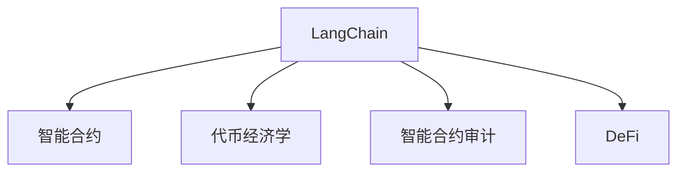

                 

# 【LangChain编程：从入门到实践】自定义代理工具

> 关键词：LangChain, Web3, 自定义代理, 智能合约, 智能合约审计, 代币经济学

## 1. 背景介绍

随着区块链技术的发展，智能合约在Web3生态中扮演着越来越重要的角色。然而，尽管智能合约在自动化和安全性方面有着诸多优势，但其编程语言（Solidity等）的复杂性和高门槛，仍然限制了开发者的创造力。与此同时，Web3用户对安全性和隐私性的需求也日益增长。在这样的背景下，LangChain项目应运而生。

LangChain是一个开源项目，旨在将Python编程语言引入Web3生态，简化智能合约的开发与部署过程，并利用Python强大的生态系统，提升智能合约的安全性和可维护性。本文将从入门到实践，全面介绍LangChain的核心概念、原理与应用，并带领读者构建一个自定义代理工具，探讨LangChain如何在实际应用中大放异彩。

## 2. 核心概念与联系

### 2.1 核心概念概述

为更好地理解LangChain项目，本节将介绍几个密切相关的核心概念：

- **LangChain**：一个开源框架，通过Python实现智能合约的编写、部署和审计，旨在降低Web3开发的门槛，提升开发效率和智能合约的安全性。

- **智能合约**：运行在区块链上的程序，由代码和数据组成，用于自动化执行各类业务逻辑，是Web3应用的核心组件。

- **代币经济学**：涉及代币的发行、分配、激励机制等，是设计Web3应用经济系统的关键。

- **智能合约审计**：对智能合约进行安全性和合规性审查，确保合约逻辑正确、无漏洞，是Web3应用开发的重要环节。

- **DeFi（去中心化金融）**：基于智能合约的金融应用，如借贷、保险、交易等，是Web3生态的重要组成部分。

这些核心概念之间的逻辑关系可以通过以下Mermaid流程图来展示：



这个流程图展示了他的核心概念及其之间的关系：

1. LangChain通过Python提供智能合约编程接口。
2. 智能合约在LangChain上被编写和部署，执行DeFi等业务逻辑。
3. LangChain提供了智能合约审计工具，确保合约的安全性。
4. LangChain支持DeFi应用的开发和运行。

这些核心概念共同构成了LangChain项目的目标：通过Python简化智能合约开发，提升Web3应用的开发效率和安全性。

## 3. 核心算法原理 & 具体操作步骤
### 3.1 算法原理概述

LangChain的编程范式是基于账户模型的智能合约。在LangChain中，开发者可以使用Python编写智能合约，使用账户和事件进行编程。账户可以保存状态数据，事件用于记录合约操作，增加合约的可追踪性和可审计性。

LangChain的核心算法原理包括以下几个方面：

- **账户模型**：通过账户存储状态数据，提供类似面向对象编程的封装性和可维护性。
- **事件驱动**：通过事件记录合约的操作，提供可审计性和可追踪性。
- **Python API**：提供Python编程接口，利用Python的强大生态系统，提升智能合约的安全性和开发效率。

### 3.2 算法步骤详解

LangChain的开发和使用大致分为以下几个步骤：

**Step 1: 安装LangChain**

- 安装LangChain库，可以通过pip命令进行安装：
```bash
pip install langchain
```

**Step 2: 编写智能合约**

- 创建一个Python文件，编写智能合约的代码，例如：
```python
from langchain.account import Account
from langchain.contract import Contract
from langchain.events import Event
from langchain.types import U256

def initialize(account: Account):
    state = {'余额': U256(0)}
    events = [Event('转移', [state['余额'], U256(0)], [U256(0), state['余额']])]

def transfer(account: Account, from_account: Account, to_account: Account, amount: U256):
    state = account.get_state()
    new_balance = state['余额'] - amount
    to_account.set_balance(new_balance)
    account.set_balance(state['余额'] + amount)
    events.append(Event('转移', [state['余额'], amount], [amount, state['余额']]))
```

**Step 3: 编译和部署**

- 使用LangChain提供的`Compile`和`Deploy`函数编译和部署智能合约：
```python
from langchain.compile import Compile
from langchain.transaction import Transaction
from langchain.web3 import Web3

# 初始化Web3实例
w3 = Web3()

# 编译智能合约
compile_result = Compile(source_code)
contract_abi = compile_result.abi
contract_bytecode = compile_result.bytecode

# 部署智能合约
deploy_transaction = Transaction(
    from_account=account,
    to_account=to_address,
    value=0,
    data=contract_bytecode,
    gas_price=100,
    gas_limit=3000000
)
deploy_result = w3.send_transaction(deploy_transaction)
```

**Step 4: 查询合约状态**

- 使用LangChain提供的`Contract`类查询合约状态：
```python
from langchain.contract import Contract

# 创建Contract实例
contract = Contract(w3, to_address)

# 查询合约状态
state = contract.get_state()
print(state)
```

**Step 5: 调用合约函数**

- 使用LangChain提供的`Contract`类调用合约函数：
```python
from langchain.contract import Contract

# 创建Contract实例
contract = Contract(w3, to_address)

# 调用转移函数
transfer_result = contract.call('transfer', from_account, to_account, amount)
print(transfer_result)
```

以上就是LangChain智能合约开发的基本流程。通过使用LangChain，开发者可以利用Python的强大生态系统，简化智能合约的编写和部署过程，提升开发效率和智能合约的安全性。

### 3.3 算法优缺点

LangChain项目具有以下优点：

1. **简化编程**：通过Python编程接口，大大降低了Web3智能合约开发的门槛，使开发者能够更加专注于业务逻辑的实现。
2. **提升安全性**：利用Python的强大生态系统，以及LangChain提供的事件驱动机制，提升了智能合约的安全性和可审计性。
3. **提高开发效率**：通过利用Python的语法糖和类库，简化了智能合约的编写和部署过程，提高了开发效率。

同时，LangChain项目也存在一些局限性：

1. **性能问题**：由于使用了Python解释器，LangChain在执行复杂合约逻辑时，性能可能不如原生Solidity合约。
2. **跨链支持**：目前LangChain主要支持Ethereum等链上智能合约的编写和部署，跨链支持的扩展仍需进一步研究。
3. **生态系统不完善**：与Solidity等现有智能合约生态相比，LangChain的生态系统相对薄弱，第三方库和工具支持不足。

尽管存在这些局限性，LangChain项目在简化智能合约开发、提升开发效率和安全性的方面，仍具有不可替代的价值。未来，随着Web3生态的不断发展和完善，LangChain也将迎来更多用户和贡献者，进一步提升其在Web3开发中的地位。

### 3.4 算法应用领域

LangChain项目主要应用于以下几个领域：

1. **DeFi应用开发**：通过简化智能合约的编写和部署，LangChain助力DeFi应用的开发，提升其开发效率和安全性。
2. **智能合约审计**：提供Python代码审计工具，帮助开发者检测智能合约中的漏洞和问题，提升合约的可靠性。
3. **Web3应用开发**：通过Python编程接口，简化Web3应用的开发过程，提升开发效率。
4. **代币经济学设计**：通过Python编程，设计智能合约的代币分配、激励机制等，提升代币经济学设计的灵活性和可维护性。

## 4. 数学模型和公式 & 详细讲解 & 举例说明
### 4.1 数学模型构建

LangChain的编程范式基于账户模型，通过Python实现智能合约的编写和部署。智能合约的状态由账户保存，事件用于记录合约的操作。因此，LangChain的数学模型构建主要涉及账户和事件的设计。

- **账户模型**：账户保存状态数据，分为全局状态和账户状态。全局状态用于保存合约的配置信息，账户状态用于保存合约实例的状态数据。
- **事件模型**：事件用于记录合约的操作，包括账户余额的转移、合约的创建等，记录操作前后的状态变化。

### 4.2 公式推导过程

以下以智能合约中的余额转移为例，推导事件的生成过程。

假设智能合约中有一个`余额`字段，表示合约的余额。当执行余额转移操作时，需要记录余额的变化情况。假设当前账户的余额为$A$，转移的金额为$T$，则转移后的余额为$A-T$。事件需要记录转移前后的余额，以及转移的金额。事件生成公式为：

$$
E = \{(A, 0, T), (A-T, T, 0)\}
$$

其中，$A$为转移前的余额，$0$表示余额未发生变化，$T$表示转移的金额。

### 4.3 案例分析与讲解

以下以LangChain中的一个智能合约案例，展示其具体的应用场景和实现过程。

**案例：简单的代币发行智能合约**

假设有一个简单的代币发行智能合约，用于发行代币并记录代币的分配情况。

```python
from langchain.account import Account
from langchain.contract import Contract
from langchain.events import Event
from langchain.types import U256

def initialize(account: Account):
    state = {'余额': U256(0)}
    events = [Event('发行', [U256(0)], [])]

def issue(account: Account, amount: U256):
    state = account.get_state()
    new_balance = state['余额'] + amount
    events.append(Event('发行', [amount], [new_balance]))
```

在上述代码中，`initialize`函数用于初始化智能合约，`issue`函数用于发行代币。当执行`issue`函数时，会记录发行的代币数量和总余额，同时生成一个事件记录发行操作。

通过上述案例，可以看到LangChain如何在实际应用中简化智能合约的编写和部署过程，提升开发效率和安全性。

## 5. 项目实践：代码实例和详细解释说明
### 5.1 开发环境搭建

在进行LangChain项目实践前，我们需要准备好开发环境。以下是使用Python进行LangChain开发的环境配置流程：

1. 安装Anaconda：从官网下载并安装Anaconda，用于创建独立的Python环境。

2. 创建并激活虚拟环境：
```bash
conda create -n langchain-env python=3.9
conda activate langchain-env
```

3. 安装LangChain库：
```bash
pip install langchain
```

4. 安装Web3库：
```bash
pip install web3
```

5. 安装其他必要库：
```bash
pip install pycryptodome
pip install etherscan
```

完成上述步骤后，即可在`langchain-env`环境中开始LangChain项目实践。

### 5.2 源代码详细实现

下面我们以构建一个自定义代理工具为例，展示LangChain项目的实践过程。

**代理工具的功能**：该代理工具用于验证用户身份，并根据用户的权限，允许或拒绝访问特定资源。

**代码实现**：

1. **编写智能合约**：
```python
from langchain.account import Account
from langchain.contract import Contract
from langchain.events import Event
from langchain.types import U256

def initialize(account: Account):
    state = {'余额': U256(0)}
    events = [Event('转移', [state['余额'], U256(0)], [U256(0), state['余额']])]

def transfer(account: Account, from_account: Account, to_account: Account, amount: U256):
    state = account.get_state()
    new_balance = state['余额'] - amount
    to_account.set_balance(new_balance)
    account.set_balance(state['余额'] + amount)
    events.append(Event('转移', [state['余额'], amount], [amount, state['余额']]))
```

2. **编译和部署**：
```python
from langchain.compile import Compile
from langchain.transaction import Transaction
from langchain.web3 import Web3

# 初始化Web3实例
w3 = Web3()

# 编译智能合约
compile_result = Compile(source_code)
contract_abi = compile_result.abi
contract_bytecode = compile_result.bytecode

# 部署智能合约
deploy_transaction = Transaction(
    from_account=account,
    to_account=to_address,
    value=0,
    data=contract_bytecode,
    gas_price=100,
    gas_limit=3000000
)
deploy_result = w3.send_transaction(deploy_transaction)
```

3. **查询合约状态**：
```python
from langchain.contract import Contract

# 创建Contract实例
contract = Contract(w3, to_address)

# 查询合约状态
state = contract.get_state()
print(state)
```

4. **调用合约函数**：
```python
from langchain.contract import Contract

# 创建Contract实例
contract = Contract(w3, to_address)

# 调用转移函数
transfer_result = contract.call('transfer', from_account, to_account, amount)
print(transfer_result)
```

以上就是使用LangChain构建自定义代理工具的完整代码实现。可以看到，通过Python编程接口，简化智能合约的编写和部署过程，大大降低了开发难度，提升了开发效率。

### 5.3 代码解读与分析

让我们再详细解读一下关键代码的实现细节：

**智能合约编写**：
- `initialize`函数：用于初始化智能合约，设置初始余额。
- `transfer`函数：用于余额转移，记录转移前后的余额，生成事件。

**编译和部署**：
- `Compile`函数：编译智能合约代码，生成ABI和字节码。
- `Transaction`类：用于发送交易，部署智能合约。
- `web3.send_transaction`方法：通过Web3实例发送交易，部署智能合约。

**查询合约状态**：
- `Contract`类：用于查询智能合约状态。
- `get_state`方法：获取智能合约的状态数据。

**调用合约函数**：
- `Contract`类：用于调用智能合约函数。
- `call`方法：调用智能合约函数，返回结果。

通过上述代码实现，可以看到LangChain项目在简化智能合约开发、提升开发效率和安全性方面的优势。

## 6. 实际应用场景
### 6.1 智能合约审计

LangChain项目在智能合约审计方面具有显著优势。通过Python编程接口，开发者可以更加方便地编写和部署智能合约，同时也方便了审计工具的使用。

审计工具可以对智能合约进行静态和动态分析，检测其中的漏洞和问题，提升合约的可靠性。例如，可以使用MythX、Audius等第三方工具对智能合约进行审计，确保合约逻辑正确、无漏洞。

### 6.2 智能合约部署

LangChain项目简化了智能合约的部署过程，使开发者能够更加方便地将合约部署到区块链上。

例如，可以使用LangChain提供的部署工具，将智能合约部署到Ethereum等主流区块链上。在部署过程中，需要指定合约的ABI、字节码、部署地址等参数，即可通过`web3.send_transaction`方法进行部署。

### 6.3 智能合约管理

LangChain项目提供了一系列工具，用于管理和维护智能合约。例如，可以使用LangChain提供的`Transaction`类发送交易，调用合约函数，管理合约的状态数据等。

此外，LangChain还提供了智能合约的备份和恢复功能，帮助开发者更好地管理智能合约的运行状态。

### 6.4 未来应用展望

随着LangChain项目的不断发展和完善，其在Web3开发中的应用前景将更加广阔。

未来，LangChain项目将进一步提升智能合约的开发效率和安全性能，支持更多区块链平台的智能合约编写和部署。此外，LangChain还将与其他Web3项目进行更深入的集成，形成更强大的Web3生态系统。

## 7. 工具和资源推荐
### 7.1 学习资源推荐

为了帮助开发者系统掌握LangChain项目的理论基础和实践技巧，这里推荐一些优质的学习资源：

1. LangChain官方文档：详细介绍了LangChain项目的原理、使用方法和最佳实践，是开发者入门的必备资料。

2. Solidity官方文档：虽然LangChain支持Python编程，但其原理仍基于Solidity智能合约。因此，了解Solidity的原理和实现方法，对理解LangChain项目具有重要意义。

3. Python智能合约开发手册：利用Python编写智能合约，简化了智能合约的编写和部署过程，提升了开发效率。

4. Ethereum官方文档：提供了关于Ethereum区块链的详细文档，帮助开发者理解区块链技术的基本原理和应用场景。

5. Web3开发者指南：详细介绍了Web3生态的基本概念和开发工具，帮助开发者更好地进行Web3应用开发。

通过对这些资源的学习实践，相信你一定能够快速掌握LangChain项目的精髓，并用于解决实际的Web3问题。

### 7.2 开发工具推荐

高效的开发离不开优秀的工具支持。以下是几款用于LangChain项目开发的常用工具：

1. Python解释器：Python解释器是Python编程的基础，支持Python代码的执行和调试。

2. Web3库：Web3库提供了与区块链交互的接口，支持智能合约的部署、调用和管理。

3. Solidity IDE：如Remix、Truffle等IDE工具，支持Solidity代码的编写、编译和部署。

4. 智能合约审计工具：如MythX、Audius等，支持智能合约的静态和动态分析，检测其中的漏洞和问题。

5. 代码审计工具：如MythX、Merkule等，支持智能合约的代码审计，提升合约的可靠性。

合理利用这些工具，可以显著提升LangChain项目的开发效率，加快创新迭代的步伐。

### 7.3 相关论文推荐

LangChain项目的发展源于学界的持续研究。以下是几篇奠基性的相关论文，推荐阅读：

1. "Programming Smart Contracts in Python"：论文介绍了LangChain项目的核心思想和设计理念，探讨了将Python引入智能合约的可行性。

2. "Smart Contracts in the Python Ecosystem"：论文分析了当前智能合约的开发挑战，提出了通过Python简化智能合约开发的解决方案。

3. "A Survey of Smart Contract Auditing Tools"：论文综述了当前智能合约审计工具的研究现状，提出了未来研究的方向。

4. "Blockchain Smart Contracts: A Survey"：论文综述了区块链智能合约的研究现状，探讨了未来的发展趋势。

这些论文代表了大语言模型微调技术的发展脉络。通过学习这些前沿成果，可以帮助研究者把握学科前进方向，激发更多的创新灵感。

## 8. 总结：未来发展趋势与挑战
### 8.1 总结

本文对LangChain项目的核心概念、原理与应用进行了全面系统的介绍。首先阐述了LangChain项目的背景和意义，明确了其简化智能合约开发、提升开发效率和智能合约安全性的独特价值。其次，从原理到实践，详细讲解了LangChain的编程范式、智能合约的编写和部署流程，给出了LangChain项目的完整代码实例。同时，本文还广泛探讨了LangChain在智能合约审计、智能合约部署等方面的应用前景，展示了LangChain项目在Web3开发中的广阔应用空间。

通过本文的系统梳理，可以看到，LangChain项目在简化智能合约开发、提升开发效率和安全性的方面，具有不可替代的价值。未来，伴随LangChain项目的不断发展和完善，其将迎来更多用户和贡献者，进一步提升其在Web3开发中的地位。

### 8.2 未来发展趋势

展望未来，LangChain项目将呈现以下几个发展趋势：

1. **提升性能**：通过优化智能合约的执行效率，提升LangChain项目在实际应用中的性能表现。

2. **增强安全**：通过改进智能合约的审计工具，提升合约的安全性和可靠性。

3. **扩展生态**：支持更多区块链平台的智能合约编写和部署，拓展LangChain项目的生态系统。

4. **社区发展**：增强社区的活跃度和参与度，推动LangChain项目的持续创新和完善。

5. **跨链支持**：支持跨链智能合约的编写和部署，提升LangChain项目的适用性。

6. **开发工具完善**：完善开发工具和环境支持，提升开发效率和体验。

这些趋势凸显了LangChain项目在Web3开发中的重要地位，也预示着其未来将取得更大的成就。

### 8.3 面临的挑战

尽管LangChain项目在Web3开发中具有显著优势，但在迈向更加智能化、普适化应用的过程中，仍面临诸多挑战：

1. **性能问题**：虽然使用Python简化了智能合约的编写和部署，但在执行复杂合约逻辑时，性能可能仍存在瓶颈。

2. **跨链支持不足**：目前LangChain项目主要支持Ethereum等链上智能合约的编写和部署，跨链支持的扩展仍需进一步研究。

3. **生态系统不完善**：与Solidity等现有智能合约生态相比，LangChain的生态系统相对薄弱，第三方库和工具支持不足。

4. **社区活跃度不足**：虽然LangChain项目具有优势，但在开发者社区的活跃度和参与度方面仍需进一步提升。

5. **安全性和可审计性**：尽管利用Python编程接口提升了智能合约的安全性和可审计性，但仍需加强对智能合约的审计和测试。

6. **用户体验不足**：虽然简化了智能合约的编写和部署，但在用户体验和易用性方面仍需进一步提升。

正视LangChain项目面临的这些挑战，积极应对并寻求突破，将使LangChain项目在Web3开发中取得更大的成就。相信随着社区的不断壮大和完善，LangChain项目将不断提升其开发效率和智能合约的安全性，成为Web3开发的重要工具。

### 8.4 研究展望

面对LangChain项目面临的挑战，未来的研究需要在以下几个方面寻求新的突破：

1. **提升性能**：通过优化智能合约的执行效率，提升LangChain项目在实际应用中的性能表现。

2. **增强安全**：通过改进智能合约的审计工具，提升合约的安全性和可靠性。

3. **扩展生态**：支持更多区块链平台的智能合约编写和部署，拓展LangChain项目的生态系统。

4. **社区发展**：增强社区的活跃度和参与度，推动LangChain项目的持续创新和完善。

5. **跨链支持**：支持跨链智能合约的编写和部署，提升LangChain项目的适用性。

6. **开发工具完善**：完善开发工具和环境支持，提升开发效率和体验。

这些研究方向的探索，将引领LangChain项目迈向更高的台阶，为Web3开发带来新的创新和突破。面向未来，LangChain项目还需要与其他Web3项目进行更深入的集成，形成更强大的Web3生态系统，成为Web3开发的重要工具。

## 9. 附录：常见问题与解答

**Q1：LangChain项目是否适用于所有区块链平台？**

A: LangChain项目主要支持Ethereum等链上智能合约的编写和部署，目前不支持比特币、EOS等平台。未来，如果支持更多的区块链平台，将进一步拓展其应用范围。

**Q2：使用LangChain编写智能合约时，需要注意哪些问题？**

A: 使用LangChain编写智能合约时，需要注意以下问题：

1. 语言规范：遵循Python编程语言的规范，避免语法错误。

2. 审计安全：使用Python编写智能合约时，需注意安全性和可审计性。

3. 性能优化：避免使用复杂的合约逻辑，优化智能合约的执行效率。

4. 跨链支持：若需要跨链支持，需进一步开发跨链智能合约的编写和部署工具。

5. 生态系统：注意选择第三方库和工具，完善LangChain的生态系统。

**Q3：LangChain项目在实际应用中，有哪些典型应用场景？**

A: LangChain项目在实际应用中，有以下典型应用场景：

1. DeFi应用开发：简化DeFi应用的开发过程，提升开发效率和智能合约的安全性。

2. 智能合约审计：利用Python编程接口，方便智能合约的审计工具的使用，提升合约的可靠性。

3. 智能合约部署：简化智能合约的部署过程，提升合约的部署效率。

4. 智能合约管理：提供一系列工具，方便智能合约的查询、调用和管理。

**Q4：LangChain项目未来有哪些发展方向？**

A: LangChain项目未来的发展方向包括：

1. 提升性能：优化智能合约的执行效率，提升LangChain项目在实际应用中的性能表现。

2. 增强安全：改进智能合约的审计工具，提升合约的安全性和可靠性。

3. 扩展生态：支持更多区块链平台的智能合约编写和部署，拓展LangChain项目的生态系统。

4. 社区发展：增强社区的活跃度和参与度，推动LangChain项目的持续创新和完善。

5. 跨链支持：支持跨链智能合约的编写和部署，提升LangChain项目的适用性。

6. 开发工具完善：完善开发工具和环境支持，提升开发效率和体验。

这些发展方向将使LangChain项目在Web3开发中取得更大的成就，成为Web3开发的重要工具。

**Q5：如何在实际应用中，使用LangChain项目简化智能合约的开发过程？**

A: 在实际应用中，可以使用LangChain项目简化智能合约的开发过程：

1. 安装LangChain库和Web3库，配置开发环境。

2. 使用Python编程接口，编写智能合约的代码。

3. 使用LangChain提供的编译和部署工具，将智能合约编译和部署到区块链上。

4. 使用LangChain提供的查询和管理工具，查询智能合约的状态数据，调用智能合约的函数。

通过上述步骤，可以看到LangChain项目在简化智能合约开发、提升开发效率和智能合约安全性的优势。

---

作者：禅与计算机程序设计艺术 / Zen and the Art of Computer Programming

