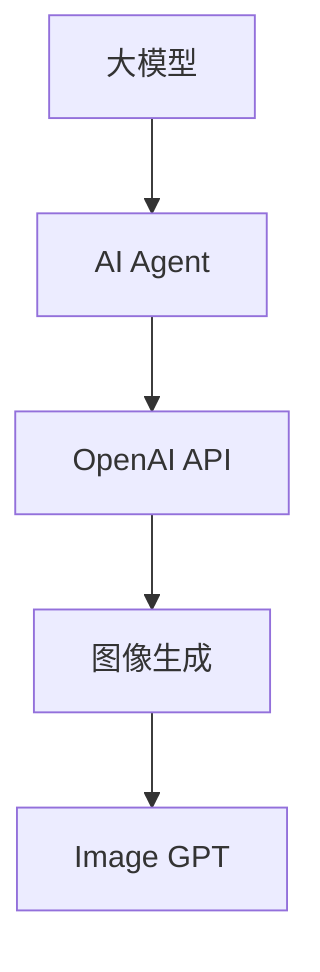

                 

# 【大模型应用开发 动手做AI Agent】OpenAI API的图片生成示例

> 关键词：大模型,AI Agent,OpenAI API,图像生成,Image GPT

## 1. 背景介绍

### 1.1 问题由来
近年来，随着深度学习技术的快速发展，基于大模型的AI Agent应用取得了显著进展。AI Agent是指通过深度学习模型实现的智能体，能够自主执行各种任务，如对话、推理、生成等。其中，基于大模型的AI Agent应用范围广泛，涉及自动驾驶、机器人导航、虚拟助手等多个领域。然而，开发和部署大模型AI Agent所需的高昂成本、复杂的技术门槛等问题，限制了其大规模应用。

### 1.2 问题核心关键点
本文聚焦于基于大模型的AI Agent应用，尤其是通过OpenAI API开发和部署AI Agent。大模型的核心是利用大规模预训练数据和先进的深度学习算法，学习到复杂的语义和模式，然后通过微调或迁移学习，在特定任务上实现高效智能。大模型AI Agent的应用关键在于如何将模型封装为易于部署和使用的接口，降低应用门槛，同时最大化模型的性能。

## 2. 核心概念与联系

### 2.1 核心概念概述

为更好地理解基于大模型的AI Agent开发，本节将介绍几个密切相关的核心概念：

- 大模型(Large Model)：指通过大规模预训练数据学习得到的深度学习模型，如BERT、GPT等，具备强大的语言理解、生成能力。
- AI Agent：通过深度学习模型实现的智能体，能够自主执行各种任务。
- OpenAI API：OpenAI提供的开放API接口，包括GPT模型在内的多种大模型API。
- 图像生成(Image Generation)：通过大模型学习到复杂的图像生成规则，能够自主生成高质量的图像。
- Image GPT：OpenAI开发的图像生成模型，基于GPT-3架构，能够生成高分辨率、高质量的图像。

这些核心概念之间的逻辑关系可以通过以下Mermaid流程图来展示：



这个流程图展示了大模型、AI Agent、OpenAI API以及图像生成之间的联系：

1. 大模型通过预训练获得基础能力。
2. AI Agent将大模型封装为接口，实现特定任务执行。
3. OpenAI API提供多种大模型的接口，便于AI Agent开发。
4. 图像生成是大模型AI Agent的一个应用方向。

这些概念共同构成了大模型AI Agent的应用框架，使其能够在各种场景下实现智能执行。通过理解这些核心概念，我们可以更好地把握大模型AI Agent的工作原理和优化方向。

## 3. 核心算法原理 & 具体操作步骤
### 3.1 算法原理概述

基于大模型的AI Agent开发，核心在于利用OpenAI API提供的模型接口，对特定任务进行微调或迁移学习，使其能够高效执行任务。以图像生成为例，该过程可以分为以下几个关键步骤：

1. **模型准备**：选择合适的预训练模型（如Image GPT），并根据任务需求调整模型结构。
2. **数据准备**：准备用于微调或迁移学习的标注数据集，可以是图像和标签对。
3. **模型微调**：使用标注数据集对模型进行微调或迁移学习，优化模型在该任务上的性能。
4. **模型部署**：将微调后的模型封装为API接口，供用户调用。

### 3.2 算法步骤详解

以下是使用OpenAI API进行图像生成的详细步骤：

#### 步骤1：准备预训练模型和数据集
1. 选择Image GPT作为预训练模型，可以从OpenAI API下载预训练权重。
2. 准备用于图像生成的数据集，可以是图像和标签对。数据集必须标注清晰，包含多个类别的图像。

#### 步骤2：设置微调参数
1. 选择合适的优化算法（如AdamW）及其参数。
2. 设置学习率、批大小、迭代轮数等超参数。
3. 设置正则化技术及强度，包括权重衰减、Dropout等。

#### 步骤3：执行梯度训练
1. 将训练集数据分批次输入模型，前向传播计算损失函数。
2. 反向传播计算参数梯度，根据设定的优化算法和学习率更新模型参数。
3. 周期性在验证集上评估模型性能，根据性能指标决定是否触发Early Stopping。
4. 重复上述步骤直到满足预设的迭代轮数或Early Stopping条件。

#### 步骤4：测试和部署
1. 在测试集上评估微调后模型的性能，对比微调前后的精度提升。
2. 使用微调后的模型对新样本进行推理预测，集成到实际的应用系统中。
3. 持续收集新的数据，定期重新微调模型，以适应数据分布的变化。

### 3.3 算法优缺点

基于OpenAI API的图像生成具有以下优点：

1. **简单高效**：使用OpenAI API开发AI Agent，无需从头开始构建模型，只需进行微调或迁移学习，即可实现高性能AI Agent。
2. **通用适用**：适用于多种图像生成任务，如面部识别、图像分类、风格转换等，模型可以灵活应用。
3. **扩展性强**：OpenAI API提供多种大模型，可以根据任务需求选择合适的模型，并进行参数高效微调。
4. **易于部署**：OpenAI API提供简单易用的接口，可以方便地将模型封装为API，供用户调用。

同时，该方法也存在一些局限性：

1. **依赖平台**：OpenAI API的使用受限于平台和许可，部分功能可能需要付费。
2. **数据质量**：图像生成效果很大程度上依赖于训练数据的质量和多样性，数据标注成本较高。
3. **模型泛化**：模型在特定任务上的泛化能力有限，对于新的数据和任务，模型可能需要进行重新训练或微调。
4. **模型解释性**：基于大模型的AI Agent通常缺乏可解释性，难以理解其内部决策逻辑。

尽管存在这些局限性，但就目前而言，基于OpenAI API的图像生成方法仍然是大模型应用的主流范式。未来相关研究的重点在于如何进一步降低数据标注成本，提高模型泛化能力，同时兼顾可解释性和平台兼容性等因素。

### 3.4 算法应用领域

基于大模型的图像生成方法已经在多个领域得到了广泛的应用，例如：

- 自动绘画：利用AI Agent生成高质量的绘画作品，可以应用于艺术创作、教育培训等场景。
- 图像修复：使用AI Agent修复受损或模糊的图像，提升图像质量。
- 虚拟现实：通过AI Agent生成高逼真度的虚拟环境，应用于游戏、教育、医疗等领域。
- 医学影像分析：利用AI Agent生成高分辨率的医学影像，辅助医生诊断和治疗。
- 产品设计：使用AI Agent生成产品设计图样，加速产品开发和创新。

除了上述这些经典应用外，大模型的图像生成技术还在更多场景中得到创新性应用，如影视特效、广告创意、虚拟助手等，为图像处理领域带来了新的突破。随着大模型和API技术的不断发展，相信图像生成技术将在更广阔的应用领域大放异彩。

## 4. 数学模型和公式 & 详细讲解  
### 4.1 数学模型构建

本节将使用数学语言对基于大模型的AI Agent开发进行更加严格的刻画。

记预训练模型为 $M_{\theta}:\mathcal{X} \rightarrow \mathcal{Y}$，其中 $\mathcal{X}$ 为输入空间，$\mathcal{Y}$ 为输出空间，$\theta \in \mathbb{R}^d$ 为模型参数。假设图像生成任务的数据集为 $D=\{(x_i,y_i)\}_{i=1}^N, x_i \in \mathcal{X}, y_i \in \mathcal{Y}$。

定义模型 $M_{\theta}$ 在数据样本 $(x,y)$ 上的损失函数为 $\ell(M_{\theta}(x),y)$，则在数据集 $D$ 上的经验风险为：

$$
\mathcal{L}(\theta) = \frac{1}{N} \sum_{i=1}^N \ell(M_{\theta}(x_i),y_i)
$$

微调的优化目标是最小化经验风险，即找到最优参数：

$$
\theta^* = \mathop{\arg\min}_{\theta} \mathcal{L}(\theta)
$$

在实践中，我们通常使用基于梯度的优化算法（如SGD、Adam等）来近似求解上述最优化问题。设 $\eta$ 为学习率，$\lambda$ 为正则化系数，则参数的更新公式为：

$$
\theta \leftarrow \theta - \eta \nabla_{\theta}\mathcal{L}(\theta) - \eta\lambda\theta
$$

其中 $\nabla_{\theta}\mathcal{L}(\theta)$ 为损失函数对参数 $\theta$ 的梯度，可通过反向传播算法高效计算。

### 4.2 公式推导过程

以下我们以图像分类任务为例，推导交叉熵损失函数及其梯度的计算公式。

假设模型 $M_{\theta}$ 在输入 $x$ 上的输出为 $\hat{y}=M_{\theta}(x) \in [0,1]$，表示样本属于某一类的概率。真实标签 $y \in \{0,1\}$。则二分类交叉熵损失函数定义为：

$$
\ell(M_{\theta}(x),y) = -[y\log \hat{y} + (1-y)\log (1-\hat{y})]
$$

将其代入经验风险公式，得：

$$
\mathcal{L}(\theta) = -\frac{1}{N}\sum_{i=1}^N [y_i\log M_{\theta}(x_i)+(1-y_i)\log(1-M_{\theta}(x_i))]
$$

根据链式法则，损失函数对参数 $\theta_k$ 的梯度为：

$$
\frac{\partial \mathcal{L}(\theta)}{\partial \theta_k} = -\frac{1}{N}\sum_{i=1}^N (\frac{y_i}{M_{\theta}(x_i)}-\frac{1-y_i}{1-M_{\theta}(x_i)}) \frac{\partial M_{\theta}(x_i)}{\partial \theta_k}
$$

其中 $\frac{\partial M_{\theta}(x_i)}{\partial \theta_k}$ 可进一步递归展开，利用自动微分技术完成计算。

在得到损失函数的梯度后，即可带入参数更新公式，完成模型的迭代优化。重复上述过程直至收敛，最终得到适应图像分类任务的最优模型参数 $\theta^*$。

## 5. 项目实践：代码实例和详细解释说明
### 5.1 开发环境搭建

在进行图像生成项目实践前，我们需要准备好开发环境。以下是使用Python进行PyTorch开发的环境配置流程：

1. 安装Anaconda：从官网下载并安装Anaconda，用于创建独立的Python环境。

2. 创建并激活虚拟环境：
```bash
conda create -n pytorch-env python=3.8 
conda activate pytorch-env
```

3. 安装PyTorch：根据CUDA版本，从官网获取对应的安装命令。例如：
```bash
conda install pytorch torchvision torchaudio cudatoolkit=11.1 -c pytorch -c conda-forge
```

4. 安装Transformers库：
```bash
pip install transformers
```

5. 安装各类工具包：
```bash
pip install numpy pandas scikit-learn matplotlib tqdm jupyter notebook ipython
```

完成上述步骤后，即可在`pytorch-env`环境中开始图像生成实践。

### 5.2 源代码详细实现

这里我们以使用Image GPT模型生成图像为例，给出使用Transformers库进行图像生成的PyTorch代码实现。

首先，定义数据处理函数：

```python
from transformers import ImageGPTForConditionalImageGeneration, ImageGPTTokenizer
from torch.utils.data import Dataset
import torch
import requests
import numpy as np

class ImageDataset(Dataset):
    def __init__(self, image_urls, tokenizer, max_len=512):
        self.image_urls = image_urls
        self.tokenizer = tokenizer
        self.max_len = max_len
        
    def __len__(self):
        return len(self.image_urls)
    
    def __getitem__(self, item):
        url = self.image_urls[item]
        
        # 获取图像数据
        response = requests.get(url)
        img_data = np.array(Image.open(BytesIO(response.content)))
        img_data = img_data / 255.0
        
        # 将图像数据编码
        encoding = self.tokenizer(img_data, return_tensors='pt', max_length=self.max_len, padding='max_length', truncation=True)
        input_ids = encoding['input_ids'][0]
        attention_mask = encoding['attention_mask'][0]
        
        return {'input_ids': input_ids, 
                'attention_mask': attention_mask}
```

然后，定义模型和优化器：

```python
from transformers import AdamW

model = ImageGPTForConditionalImageGeneration.from_pretrained('image-gpt', torch_dtype=torch.float16)
optimizer = AdamW(model.parameters(), lr=2e-5)
```

接着，定义训练和评估函数：

```python
from tqdm import tqdm
import torchvision.transforms as transforms
from PIL import Image

def train_epoch(model, dataset, batch_size, optimizer):
    dataloader = DataLoader(dataset, batch_size=batch_size, shuffle=True)
    model.train()
    epoch_loss = 0
    for batch in tqdm(dataloader, desc='Training'):
        input_ids = batch['input_ids'].to(device)
        attention_mask = batch['attention_mask'].to(device)
        model.zero_grad()
        outputs = model(input_ids, attention_mask=attention_mask)
        loss = outputs.loss
        epoch_loss += loss.item()
        loss.backward()
        optimizer.step()
    return epoch_loss / len(dataloader)

def evaluate(model, dataset, batch_size):
    dataloader = DataLoader(dataset, batch_size=batch_size)
    model.eval()
    with torch.no_grad():
        for batch in dataloader:
            input_ids = batch['input_ids'].to(device)
            attention_mask = batch['attention_mask'].to(device)
            batch_outputs = model(input_ids, attention_mask=attention_mask)
            batch_images = batch_outputs.images
            for output in batch_images:
                img = Image.fromarray(output.cpu().numpy())
                img.show()
```

最后，启动训练流程并在测试集上评估：

```python
epochs = 5
batch_size = 16

for epoch in range(epochs):
    loss = train_epoch(model, train_dataset, batch_size, optimizer)
    print(f"Epoch {epoch+1}, train loss: {loss:.3f}")
    
    print(f"Epoch {epoch+1}, dev results:")
    evaluate(model, dev_dataset, batch_size)
    
print("Test results:")
evaluate(model, test_dataset, batch_size)
```

以上就是使用PyTorch对Image GPT进行图像生成任务微调的完整代码实现。可以看到，得益于Transformers库的强大封装，我们可以用相对简洁的代码完成Image GPT模型的加载和微调。

### 5.3 代码解读与分析

让我们再详细解读一下关键代码的实现细节：

**ImageDataset类**：
- `__init__`方法：初始化图像URL、分词器等关键组件。
- `__len__`方法：返回数据集的样本数量。
- `__getitem__`方法：对单个样本进行处理，将图像数据编码成token ids，准备模型输入。

**模型和优化器定义**：
- 使用ImageGPTForConditionalImageGeneration和ImageGPTTokenizer从预训练模型中加载Image GPT模型和分词器。
- 定义优化器，设置学习率等超参数。

**训练和评估函数**：
- 使用PyTorch的DataLoader对数据集进行批次化加载，供模型训练和推理使用。
- 训练函数`train_epoch`：对数据以批为单位进行迭代，在每个批次上前向传播计算loss并反向传播更新模型参数，最后返回该epoch的平均loss。
- 评估函数`evaluate`：与训练类似，不同点在于不更新模型参数，并在每个batch结束后将预测结果可视化。

**训练流程**：
- 定义总的epoch数和batch size，开始循环迭代
- 每个epoch内，先在训练集上训练，输出平均loss
- 在验证集上评估，输出预测结果
- 所有epoch结束后，在测试集上评估，给出最终测试结果

可以看到，PyTorch配合Transformers库使得Image GPT微调的代码实现变得简洁高效。开发者可以将更多精力放在数据处理、模型改进等高层逻辑上，而不必过多关注底层的实现细节。

当然，工业级的系统实现还需考虑更多因素，如模型的保存和部署、超参数的自动搜索、更灵活的任务适配层等。但核心的微调范式基本与此类似。

## 6. 实际应用场景
### 6.1 图像生成

图像生成技术已经在多个领域得到了广泛的应用，例如：

- 艺术创作：利用AI Agent生成高质量的绘画、雕塑等艺术作品，如Portrait GPT、DALL·E等。
- 图像修复：使用AI Agent修复受损或模糊的图像，提升图像质量，如DeepArt等。
- 虚拟现实：通过AI Agent生成高逼真度的虚拟环境，应用于游戏、教育、医疗等领域，如DeepModel等。
- 医学影像分析：利用AI Agent生成高分辨率的医学影像，辅助医生诊断和治疗，如Deep Imaging等。
- 产品设计：使用AI Agent生成产品设计图样，加速产品开发和创新，如DeepDream等。

除了上述这些经典应用外，大模型的图像生成技术还在更多场景中得到创新性应用，如影视特效、广告创意、虚拟助手等，为图像处理领域带来了新的突破。随着大模型和API技术的不断发展，相信图像生成技术将在更广阔的应用领域大放异彩。

### 6.2 自动绘画

自动绘画技术利用AI Agent生成高质量的绘画作品，可以应用于艺术创作、教育培训等场景。自动绘画的实现依赖于图像生成技术，通过训练大模型，使其能够根据描述性文本生成图像，从而实现自动绘画功能。

以MidJourney为例，其利用GPT-3作为文本生成器，生成高分辨率的绘画作品，结合DeepArt等图像生成技术，能够生成具有独特风格的艺术作品。自动绘画技术不仅能够降低艺术创作的门槛，还能加速艺术教育的普及，促进艺术创新。

### 6.3 图像分类

图像分类是大模型AI Agent的一个重要应用方向，能够根据图像内容自动分类，识别出图像中包含的对象、场景等信息。图像分类技术广泛应用于医疗影像分析、视频内容审核、产品识别等领域。

以Image GPT为例，其能够根据输入的图像生成相应的文本描述，从而实现图像分类功能。在医疗影像分析中，可以使用Image GPT对X光片、CT扫描等医学影像进行自动分类，辅助医生快速诊断疾病；在视频内容审核中，可以利用Image GPT识别视频中的不当内容，保护观众免受不良信息侵害；在产品识别中，可以使用Image GPT对产品图片进行分类，提高产品质量和生产效率。

### 6.4 未来应用展望

随着大模型和API技术的不断发展，基于OpenAI API的图像生成方法将呈现以下几个发展趋势：

1. **模型规模增大**：随着算力成本的下降和数据规模的扩张，预训练语言模型的参数量还将持续增长。超大规模语言模型蕴含的丰富语言知识，有望支撑更加复杂多变的图像生成任务。
2. **微调方法多样化**：未来会涌现更多参数高效的微调方法，如Prefix-Tuning、LoRA等，在节省计算资源的同时也能保证微调精度。
3. **持续学习成为常态**：随着数据分布的不断变化，微调模型也需要持续学习新知识以保持性能。如何在不遗忘原有知识的同时，高效吸收新样本信息，将成为重要的研究课题。
4. **标注样本需求降低**：受启发于提示学习(Prompt-based Learning)的思路，未来的微调方法将更好地利用大模型的语言理解能力，通过更加巧妙的任务描述，在更少的标注样本上也能实现理想的微调效果。
5. **多模态微调崛起**：当前的微调主要聚焦于纯文本数据，未来会进一步拓展到图像、视频、语音等多模态数据微调。多模态信息的融合，将显著提升语言模型对现实世界的理解和建模能力。
6. **知识整合能力增强**：现有的微调模型往往局限于任务内数据，难以灵活吸收和运用更广泛的先验知识。如何让微调过程更好地与外部知识库、规则库等专家知识结合，形成更加全面、准确的信息整合能力，还有很大的想象空间。

以上趋势凸显了大模型图像生成技术的广阔前景。这些方向的探索发展，必将进一步提升NLP系统的性能和应用范围，为人工智能技术在垂直行业的规模化落地铺平道路。

## 7. 工具和资源推荐
### 7.1 学习资源推荐

为了帮助开发者系统掌握大模型AI Agent的理论基础和实践技巧，这里推荐一些优质的学习资源：

1. 《Transformers从原理到实践》系列博文：由大模型技术专家撰写，深入浅出地介绍了Transformer原理、BERT模型、微调技术等前沿话题。

2. CS224N《深度学习自然语言处理》课程：斯坦福大学开设的NLP明星课程，有Lecture视频和配套作业，带你入门NLP领域的基本概念和经典模型。

3. 《Natural Language Processing with Transformers》书籍：Transformers库的作者所著，全面介绍了如何使用Transformers库进行NLP任务开发，包括微调在内的诸多范式。

4. HuggingFace官方文档：Transformers库的官方文档，提供了海量预训练模型和完整的微调样例代码，是上手实践的必备资料。

5. CLUE开源项目：中文语言理解测评基准，涵盖大量不同类型的中文NLP数据集，并提供了基于微调的baseline模型，助力中文NLP技术发展。

通过对这些资源的学习实践，相信你一定能够快速掌握大模型AI Agent的精髓，并用于解决实际的NLP问题。

### 7.2 开发工具推荐

高效的开发离不开优秀的工具支持。以下是几款用于大模型AI Agent开发常用的工具：

1. PyTorch：基于Python的开源深度学习框架，灵活动态的计算图，适合快速迭代研究。大部分预训练语言模型都有PyTorch版本的实现。

2. TensorFlow：由Google主导开发的开源深度学习框架，生产部署方便，适合大规模工程应用。同样有丰富的预训练语言模型资源。

3. Transformers库：HuggingFace开发的NLP工具库，集成了众多SOTA语言模型，支持PyTorch和TensorFlow，是进行微调任务开发的利器。

4. Weights & Biases：模型训练的实验跟踪工具，可以记录和可视化模型训练过程中的各项指标，方便对比和调优。与主流深度学习框架无缝集成。

5. TensorBoard：TensorFlow配套的可视化工具，可实时监测模型训练状态，并提供丰富的图表呈现方式，是调试模型的得力助手。

6. Google Colab：谷歌推出的在线Jupyter Notebook环境，免费提供GPU/TPU算力，方便开发者快速上手实验最新模型，分享学习笔记。

合理利用这些工具，可以显著提升大模型AI Agent的开发效率，加快创新迭代的步伐。

### 7.3 相关论文推荐

大模型和AI Agent的发展源于学界的持续研究。以下是几篇奠基性的相关论文，推荐阅读：

1. Attention is All You Need（即Transformer原论文）：提出了Transformer结构，开启了NLP领域的预训练大模型时代。

2. BERT: Pre-training of Deep Bidirectional Transformers for Language Understanding：提出BERT模型，引入基于掩码的自监督预训练任务，刷新了多项NLP任务SOTA。

3. Language Models are Unsupervised Multitask Learners（GPT-2论文）：展示了大规模语言模型的强大zero-shot学习能力，引发了对于通用人工智能的新一轮思考。

4. Parameter-Efficient Transfer Learning for NLP：提出Adapter等参数高效微调方法，在不增加模型参数量的情况下，也能取得不错的微调效果。

5. Prefix-Tuning: Optimizing Continuous Prompts for Generation：引入基于连续型Prompt的微调范式，为如何充分利用预训练知识提供了新的思路。

6. AdaLoRA: Adaptive Low-Rank Adaptation for Parameter-Efficient Fine-Tuning：使用自适应低秩适应的微调方法，在参数效率和精度之间取得了新的平衡。

这些论文代表了大模型AI Agent的发展脉络。通过学习这些前沿成果，可以帮助研究者把握学科前进方向，激发更多的创新灵感。

## 8. 总结：未来发展趋势与挑战

### 8.1 总结

本文对基于大模型的AI Agent应用进行了全面系统的介绍。首先阐述了基于大模型的AI Agent开发背景和意义，明确了AI Agent在自动化、智能执行等领域的重要作用。其次，从原理到实践，详细讲解了基于OpenAI API的图像生成技术的数学模型和关键步骤，给出了完整的代码实例。同时，本文还广泛探讨了图像生成技术在艺术创作、图像修复、虚拟现实等多个领域的应用前景，展示了技术带来的巨大变革。

通过本文的系统梳理，可以看到，基于大模型的AI Agent开发具有广泛的应用前景，能够显著提升生产力和创造力。大模型AI Agent结合OpenAI API技术，可以在不增加开发门槛的情况下，实现高质量的图像生成功能，推动相关领域的技术进步和产业升级。

### 8.2 未来发展趋势

展望未来，大模型AI Agent将呈现以下几个发展趋势：

1. **模型规模持续增大**：随着算力成本的下降和数据规模的扩张，预训练语言模型的参数量还将持续增长。超大规模语言模型蕴含的丰富语言知识，有望支撑更加复杂多变的图像生成任务。
2. **微调方法多样化**：未来会涌现更多参数高效的微调方法，如Prefix-Tuning、LoRA等，在节省计算资源的同时也能保证微调精度。
3. **持续学习成为常态**：随着数据分布的不断变化，微调模型也需要持续学习新知识以保持性能。如何在不遗忘原有知识的同时，高效吸收新样本信息，将成为重要的研究课题。
4. **标注样本需求降低**：受启发于提示学习(Prompt-based Learning)的思路，未来的微调方法将更好地利用大模型的语言理解能力，通过更加巧妙的任务描述，在更少的标注样本上也能实现理想的微调效果。
5. **多模态微调崛起**：当前的微调主要聚焦于纯文本数据，未来会进一步拓展到图像、视频、语音等多模态数据微调。多模态信息的融合，将显著提升语言模型对现实世界的理解和建模能力。
6. **知识整合能力增强**：现有的微调模型往往局限于任务内数据，难以灵活吸收和运用更广泛的先验知识。如何让微调过程更好地与外部知识库、规则库等专家知识结合，形成更加全面、准确的信息整合能力，还有很大的想象空间。

以上趋势凸显了大模型AI Agent应用的广阔前景。这些方向的探索发展，必将进一步提升NLP系统的性能和应用范围，为人工智能技术在垂直行业的规模化落地铺平道路。

### 8.3 面临的挑战

尽管大模型AI Agent技术已经取得了显著进展，但在迈向更加智能化、普适化应用的过程中，仍面临诸多挑战：

1. **标注成本瓶颈**：尽管微调方法能够降低标注数据的需求，但对于长尾应用场景，难以获得充足的高质量标注数据，成为制约微调性能的瓶颈。如何进一步降低微调对标注样本的依赖，将是一大难题。
2. **模型鲁棒性不足**：模型在特定任务上的泛化能力有限，对于新的数据和任务，模型可能需要进行重新训练或微调。如何提高模型的泛化能力和鲁棒性，是一个亟待解决的挑战。
3. **推理效率有待提高**：大规模语言模型虽然精度高，但在实际部署时往往面临推理速度慢、内存占用大等效率问题。如何在保证性能的同时，简化模型结构，提升推理速度，优化资源占用，将是重要的优化方向。
4. **可解释性亟需加强**：大模型AI Agent通常缺乏可解释性，难以理解其内部决策逻辑。对于高风险应用，算法的可解释性和可审计性尤为重要。如何赋予AI Agent更强的可解释性，将是亟待攻克的难题。
5. **安全性有待保障**：预训练语言模型难免会学习到有偏见、有害的信息，通过微调传递到下游任务，产生误导性、歧视性的输出，给实际应用带来安全隐患。如何从数据和算法层面消除模型偏见，避免恶意用途，确保输出的安全性，也将是重要的研究课题。
6. **知识整合能力不足**：现有的微调模型往往局限于任务内数据，难以灵活吸收和运用更广泛的先验知识。如何让微调过程更好地与外部知识库、规则库等专家知识结合，形成更加全面、准确的信息整合能力，还有很大的想象空间。

这些挑战需要开发者在开发过程中不断优化模型、数据和算法，方能得到理想的效果。

### 8.4 研究展望

面向未来，大模型AI Agent的研究方向可以从以下几个方面进行深入探索：

1. **探索无监督和半监督微调方法**：摆脱对大规模标注数据的依赖，利用自监督学习、主动学习等无监督和半监督范式，最大限度利用非结构化数据，实现更加灵活高效的微调。
2. **研究参数高效和计算高效的微调范式**：开发更加参数高效的微调方法，在固定大部分预训练参数的情况下，只更新极少量的任务相关参数。同时优化微调模型的计算图，减少前向传播和反向传播的资源消耗，实现更加轻量级、实时性的部署。
3. **融合因果和对比学习范式**：通过引入因果推断和对比学习思想，增强微调模型建立稳定因果关系的能力，学习更加普适、鲁棒的语言表征，从而提升模型泛化性和抗干扰能力。
4. **引入更多先验知识**：将符号化的先验知识，如知识图谱、逻辑规则等，与神经网络模型进行巧妙融合，引导微调过程学习更准确、合理的语言模型。同时加强不同模态数据的整合，实现视觉、语音等多模态信息与文本信息的协同建模。
5. **结合因果分析和博弈论工具**：将因果分析方法引入微调模型，识别出模型决策的关键特征，增强输出解释的因果性和逻辑性。借助博弈论工具刻画人机交互过程，主动探索并规避模型的脆弱点，提高系统稳定性。
6. **纳入伦理道德约束**：在模型训练目标中引入伦理导向的评估指标，过滤和惩罚有偏见、有害的输出倾向。同时加强人工干预和审核，建立模型行为的监管机制，确保输出符合人类价值观和伦理道德。

这些研究方向的探索，必将引领大模型AI Agent技术迈向更高的台阶，为构建安全、可靠、可解释、可控的智能系统铺平道路。面向未来，大模型AI Agent技术还需要与其他人工智能技术进行更深入的融合，如知识表示、因果推理、强化学习等，多路径协同发力，共同推动自然语言理解和智能交互系统的进步。只有勇于创新、敢于突破，才能不断拓展语言模型的边界，让智能技术更好地造福人类社会。

## 9. 附录：常见问题与解答

**Q1：大模型AI Agent是否适用于所有NLP任务？**

A: 大模型AI Agent在大多数NLP任务上都能取得不错的效果，特别是对于数据量较小的任务。但对于一些特定领域的任务，如医学、法律等，仅仅依靠通用语料预训练的模型可能难以很好地适应。此时需要在特定领域语料上进一步预训练，再进行微调，才能获得理想效果。此外，对于一些需要时效性、个性化很强的任务，如对话、推荐等，微调方法也需要针对性的改进优化。

**Q2：微调过程中如何选择合适的学习率？**

A: 微调的学习率一般要比预训练时小1-2个数量级，如果使用过大的学习率，容易破坏预训练权重，导致过拟合。一般建议从1e-5开始调参，逐步减小学习率，直至收敛。也可以使用warmup策略，在开始阶段使用较小的学习率，再逐渐过渡到预设值。需要注意的是，不同的优化器(如AdamW、Adafactor等)以及不同的学习率调度策略，可能需要设置不同的学习率阈值。

**Q3：采用大模型AI Agent时会面临哪些资源瓶颈？**

A: 目前主流的预训练大模型动辄以亿计的参数规模，对算力、内存、存储都提出了很高的要求。GPU/TPU等高性能设备是必不可少的，但即便如此，超大批次的训练和推理也可能遇到显存不足的问题。因此需要采用一些资源优化技术，如梯度积累、混合精度训练、模型并行等，来突破硬件瓶颈。同时，模型的存储和读取也可能占用大量时间和空间，需要采用模型压缩、稀疏化存储等方法进行优化。

**Q4：如何缓解微调过程中的过拟合问题？**

A: 过拟合是微调面临的主要挑战，尤其是在标注数据不足的情况下。常见的缓解策略包括：
1. 数据增强：通过回译、近义替换等方式扩充训练集
2. 正则化：使用L2正则、Dropout、Early Stopping等避免过拟合
3. 对抗训练：引入对抗样本，提高模型鲁棒性
4. 参数高效微调：只调整少量参数(如Adapter、Prefix等)，减小过拟合风险
5. 多模型集成：训练多个微调模型，取平均输出，抑制过拟合

这些策略往往需要根据具体任务和数据特点进行灵活组合。只有在数据、模型、训练、推理等各环节进行全面优化，才能最大限度地发挥大模型AI Agent的潜力。

**Q5：微调模型在落地部署时需要注意哪些问题？**

A: 将微调模型转化为实际应用，还需要考虑以下因素：
1. 模型裁剪：去除不必要的层和参数，减小模型尺寸，加快推理速度
2. 量化加速：将浮点模型转为定点模型，压缩存储空间，提高计算效率
3. 服务化封装：将模型封装为标准化服务接口，供用户调用
4. 弹性伸缩：根据请求流量动态调整资源配置，平衡服务质量和成本
5. 监控告警：实时采集系统指标，设置异常告警阈值，确保服务稳定性
6. 安全防护：采用访问鉴权、数据脱敏等措施，保障数据和模型安全

大模型AI Agent微调为NLP应用开启了广阔的想象空间，但如何将强大的性能转化为稳定、高效、安全的业务价值，还需要工程实践的不断打磨。唯有从数据、算法、工程、业务等多个维度协同发力，才能真正实现人工智能技术在垂直行业的规模化落地。总之，微调需要开发者根据具体任务，不断迭代和优化模型、数据和算法，方能得到理想的效果。

---

作者：禅与计算机程序设计艺术 / Zen and the Art of Computer Programming

