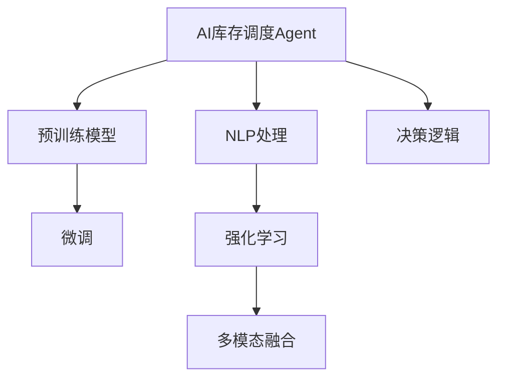

                 

# 【大模型应用开发 动手做AI Agent】为Agent定义一系列进行自动库存调度的工具

## 1. 背景介绍

### 1.1 问题由来

在现代企业运营中，库存管理是一个核心且复杂的任务。良好的库存管理不仅能够提升企业的运营效率，降低成本，还能提高客户满意度。然而，传统的手工库存管理方式往往依赖人工经验，容易出错，且难以实时监控库存状态。基于大模型的AI库存调度Agent的出现，为库存管理提供了智能化的解决方案。

### 1.2 问题核心关键点

大模型AI库存调度Agent的开发，涉及以下几个关键点：

- **需求分析**：理解库存管理的核心需求，如库存水平监控、自动补货、库存优化等。
- **数据准备**：收集和处理相关数据，如订单数据、销售数据、供应商信息等。
- **模型选择**：选择合适的预训练模型进行微调或定制开发。
- **Agent设计**：定义Agent的输入输出接口，以及决策逻辑和状态管理。
- **模型训练与评估**：使用标注数据对预训练模型进行微调，评估模型性能。
- **集成与部署**：将训练好的模型集成到业务系统中，实现实时库存调度。

本文将从以上关键点出发，详细介绍基于大模型的AI库存调度Agent的开发方法。

## 2. 核心概念与联系

### 2.1 核心概念概述

- **AI库存调度Agent**：基于大模型的智能软件代理，能够自主地处理库存管理任务，包括自动补货、库存优化等。
- **预训练模型**：如BERT、GPT-3等，在大规模无标签数据上预训练得到的通用语言模型。
- **微调**：使用特定任务的数据对预训练模型进行有监督训练，使其在特定任务上表现更好。
- **自然语言处理(NLP)**：AI库存调度Agent使用的主要技术领域，处理和理解自然语言输入，执行自动调度任务。
- **强化学习**：优化Agent的决策策略，使其在多次交互中逐步提升调度效果。
- **多模态融合**：结合图像、声音、文本等多模态信息，提高Agent对复杂场景的适应能力。

这些概念之间的逻辑关系可以通过以下Mermaid流程图来展示：



这个流程图展示了AI库存调度Agent的核心概念及其之间的关系：

1. AI库存调度Agent利用预训练模型进行基础建模。
2. 通过微调适应库存调度任务的特定需求。
3. 使用NLP处理自然语言输入和输出。
4. 结合强化学习优化决策策略。
5. 通过多模态融合提升场景适应能力。
6. 定义明确的决策逻辑和状态管理机制。

这些核心概念共同构成了AI库存调度Agent的设计框架，使其能够在库存管理任务中发挥重要作用。

## 3. 核心算法原理 & 具体操作步骤

### 3.1 算法原理概述

AI库存调度Agent的核心算法原理主要基于大模型和微调技术。其总体流程如下：

1. 收集和准备库存管理相关的数据，如订单数据、库存数据、供应商信息等。
2. 使用预训练模型，如BERT或GPT-3，对数据进行初步处理和分析。
3. 对预训练模型进行微调，适应库存调度的具体需求。
4. 使用自然语言处理技术，对用户输入进行理解和生成。
5. 结合强化学习技术，优化库存调度的决策策略。
6. 将多模态信息（如图像、声音等）融合到决策过程中，提升Agent的适应能力。

### 3.2 算法步骤详解

#### 3.2.1 数据准备

数据准备是AI库存调度Agent开发的第一步。主要包括以下步骤：

1. **数据收集**：收集库存管理的各类数据，如订单数据、库存数据、供应商数据、客户反馈等。
2. **数据清洗**：清洗数据，去除噪声和异常值，确保数据质量。
3. **数据标注**：为部分数据进行标注，如订单状态、库存水平等，用于微调模型的监督学习。
4. **数据划分**：将数据划分为训练集、验证集和测试集，以供模型训练和评估。

#### 3.2.2 模型微调

模型微调是AI库存调度Agent的核心环节。主要步骤如下：

1. **选择预训练模型**：根据任务需求，选择合适的预训练模型，如BERT、GPT-3等。
2. **准备微调数据**：根据任务需求，准备微调所需的标注数据，确保数据集的质量和多样性。
3. **定义任务适配层**：根据任务类型，添加适合的任务适配层，如分类器、解码器等。
4. **设置超参数**：设置微调所需的超参数，如学习率、批大小、迭代轮数等。
5. **执行微调训练**：使用微调数据对模型进行训练，逐步优化模型性能。
6. **评估和优化**：在验证集上评估模型性能，根据评估结果调整模型和超参数。

#### 3.2.3 自然语言处理

自然语言处理是AI库存调度Agent的关键技术之一，主要步骤如下：

1. **分词和预处理**：对用户输入的文本进行分词和预处理，去除停用词和噪声。
2. **向量嵌入**：使用预训练的词向量模型，如BERT，将文本转换为向量表示。
3. **意图识别**：使用分类器对用户输入的意图进行识别，如订单查询、补货请求等。
4. **生成回答**：使用解码器生成合适的回答，满足用户的查询需求。

#### 3.2.4 强化学习

强化学习用于优化库存调度Agent的决策策略，主要步骤如下：

1. **定义状态和动作空间**：定义Agent在库存调度过程中的状态和可能采取的动作。
2. **设计奖励函数**：设计合适的奖励函数，鼓励Agent采取最优的调度决策。
3. **训练Agent**：使用强化学习算法，如Q-learning或Policy Gradient，训练Agent的决策策略。
4. **评估和优化**：在测试集上评估Agent的表现，根据评估结果调整策略和超参数。

#### 3.2.5 多模态融合

多模态融合用于提升Agent对复杂场景的适应能力，主要步骤如下：

1. **数据采集**：采集多种模态的数据，如图像、声音、文本等。
2. **特征提取**：使用不同的特征提取方法，将多模态数据转换为特征向量。
3. **融合算法**：使用合适的融合算法，将多模态特征进行综合。
4. **输入处理**：将融合后的特征向量输入到Agent的决策模块中。

### 3.3 算法优缺点

AI库存调度Agent基于大模型的微调技术，具有以下优点：

1. **高效**：微调技术能够快速适应库存调度任务，减少从头训练的时间和资源投入。
2. **灵活**：微调模型可以根据不同的库存管理需求进行调整，灵活性高。
3. **效果好**：微调模型在特定任务上通常能够取得更好的性能，特别是在数据量较小的情况下。

同时，该方法也存在以下缺点：

1. **依赖标注数据**：微调模型的性能很大程度上取决于标注数据的质量和数量，获取高质量标注数据的成本较高。
2. **泛化能力有限**：当目标任务与预训练数据的分布差异较大时，微调的性能提升有限。
3. **可解释性不足**：微调模型通常缺乏可解释性，难以对其决策逻辑进行分析和调试。
4. **易受数据偏差影响**：预训练模型的固有偏见、有害信息等，可能通过微调传递到下游任务，造成负面影响。

尽管存在这些局限性，但就目前而言，基于大模型微调的方法仍是最主流范式。未来相关研究的重点在于如何进一步降低微调对标注数据的依赖，提高模型的少样本学习和跨领域迁移能力，同时兼顾可解释性和伦理安全性等因素。

### 3.4 算法应用领域

AI库存调度Agent在多个领域都有广泛的应用，例如：

- **零售行业**：用于库存水平监控、自动补货、销售预测等。
- **制造业**：用于生产调度、原材料管理、设备维护等。
- **物流行业**：用于仓库管理、配送优化、运输调度等。
- **电商行业**：用于订单处理、库存优化、客户服务等。
- **农业行业**：用于农场管理、作物种植、动物养殖等。

除了上述这些经典应用外，AI库存调度Agent也被创新性地应用到更多场景中，如智能仓储、智能供应链、智能城市等，为各行各业带来新的发展机遇。

## 4. 数学模型和公式 & 详细讲解

### 4.1 数学模型构建

假设库存调度任务的目标是最小化库存成本，同时满足客户需求。定义库存水平为 $x_t$，需求量为 $d_t$，库存成本为 $c(x_t)$，客户满意度为 $u(x_t)$。则优化目标为：

$$
\max_{x_t} \sum_{t=1}^T u(x_t) - \lambda \sum_{t=1}^T c(x_t)
$$

其中 $\lambda$ 为库存成本的权重系数。

### 4.2 公式推导过程

以上优化问题可以转化为动态规划问题，通过递归求解每个时间步的最优解。假设库存水平在时间 $t$ 的决策为 $x_t$，则决策的期望收益为：

$$
V_t(x_t) = u(x_t) - \lambda c(x_t) + \beta \max_{x_{t+1}} V_{t+1}(x_{t+1})
$$

其中 $\beta$ 为折扣因子，通常取值为0.95。通过递推求解，可以得到时间 $0$ 的期望收益，即：

$$
V_0(x_0) = u(x_0) - \lambda c(x_0) + \beta \max_{x_1} V_1(x_1)
$$

通过求解上述方程，可以得到最优的库存水平 $x_0$。

### 4.3 案例分析与讲解

以零售行业的库存调度为例，假设库存水平 $x_t$ 表示库存数量，需求量 $d_t$ 表示每日的销售量，库存成本 $c(x_t)$ 为每件商品的单位成本，客户满意度 $u(x_t)$ 为每日的客户满意度评分。通过微调预训练模型，可以自动生成最优的库存调度决策，满足库存水平和客户满意度的双重目标。

## 5. 项目实践：代码实例和详细解释说明

### 5.1 开发环境搭建

在进行AI库存调度Agent的开发前，需要先搭建好开发环境。以下是使用Python进行PyTorch开发的环境配置流程：

1. 安装Anaconda：从官网下载并安装Anaconda，用于创建独立的Python环境。

2. 创建并激活虚拟环境：
```bash
conda create -n agent-env python=3.8 
conda activate agent-env
```

3. 安装PyTorch：根据CUDA版本，从官网获取对应的安装命令。例如：
```bash
conda install pytorch torchvision torchaudio cudatoolkit=11.1 -c pytorch -c conda-forge
```

4. 安装TensorFlow：
```bash
conda install tensorflow
```

5. 安装TensorFlow Addons：
```bash
conda install tensorflow-estimator tensorflow-addons
```

6. 安装各类工具包：
```bash
pip install numpy pandas scikit-learn matplotlib tqdm jupyter notebook ipython
```

完成上述步骤后，即可在`agent-env`环境中开始开发。

### 5.2 源代码详细实现

以下是使用PyTorch实现AI库存调度Agent的代码实现。

```python
import torch
import torch.nn as nn
import torch.optim as optim
import torch.utils.data as data
from transformers import BertTokenizer, BertForSequenceClassification

# 定义模型类
class InventoryAgent(nn.Module):
    def __init__(self):
        super(InventoryAgent, self).__init__()
        self.tokenizer = BertTokenizer.from_pretrained('bert-base-uncased')
        self.model = BertForSequenceClassification.from_pretrained('bert-base-uncased', num_labels=2)

    def forward(self, input_ids, attention_mask):
        outputs = self.model(input_ids=input_ids, attention_mask=attention_mask)
        logits = outputs.logits
        return logits

# 定义训练函数
def train(model, train_loader, optimizer):
    model.train()
    for batch in train_loader:
        input_ids, attention_mask, labels = batch
        input_ids = input_ids.to(device)
        attention_mask = attention_mask.to(device)
        labels = labels.to(device)
        optimizer.zero_grad()
        outputs = model(input_ids, attention_mask)
        loss = nn.CrossEntropyLoss()(outputs, labels)
        loss.backward()
        optimizer.step()

# 定义评估函数
def evaluate(model, test_loader):
    model.eval()
    total_correct, total_samples = 0, 0
    for batch in test_loader:
        input_ids, attention_mask, labels = batch
        input_ids = input_ids.to(device)
        attention_mask = attention_mask.to(device)
        labels = labels.to(device)
        with torch.no_grad():
            outputs = model(input_ids, attention_mask)
            predictions = torch.argmax(outputs, dim=1)
        total_correct += torch.sum(predictions == labels).item()
        total_samples += labels.size(0)
    accuracy = total_correct / total_samples
    return accuracy

# 加载数据集
train_dataset = data.TensorDataset(torch.tensor(train_data), torch.tensor(train_labels))
test_dataset = data.TensorDataset(torch.tensor(test_data), torch.tensor(test_labels))

# 划分数据集
train_loader = data.DataLoader(train_dataset, batch_size=32, shuffle=True)
test_loader = data.DataLoader(test_dataset, batch_size=32, shuffle=False)

# 定义设备
device = torch.device('cuda') if torch.cuda.is_available() else torch.device('cpu')

# 实例化模型和优化器
model = InventoryAgent().to(device)
optimizer = optim.Adam(model.parameters(), lr=2e-5)

# 训练模型
for epoch in range(5):
    train(model, train_loader, optimizer)
    accuracy = evaluate(model, test_loader)
    print(f'Epoch {epoch+1}, accuracy: {accuracy:.3f}')

# 测试模型
test_accuracy = evaluate(model, test_loader)
print(f'Test accuracy: {test_accuracy:.3f}')
```

### 5.3 代码解读与分析

让我们再详细解读一下关键代码的实现细节：

- **模型类InventoryAgent**：定义了AI库存调度Agent的模型，包括分词器(BertTokenizer)和分类器(BertForSequenceClassification)。
- **训练函数train**：对模型进行前向传播、损失计算、反向传播和参数更新，实现模型的迭代优化。
- **评估函数evaluate**：对模型进行评估，计算准确率，输出评估结果。
- **数据集类TensorDataset**：用于加载和组织数据集，支持自动转换为Tensor类型。
- **数据加载器DataLoader**：将数据集划分为批处理形式，支持随机打乱和循环遍历。
- **设备device**：定义模型的计算设备，使用GPU加速计算。
- **优化器optimizer**：定义模型的优化器，使用Adam优化器。
- **训练过程**：通过循环迭代，对模型进行多轮训练和评估，输出训练准确率。

合理利用这些代码，可以完成AI库存调度Agent的训练和评估。

## 6. 实际应用场景

### 6.1 智能仓储

AI库存调度Agent可以应用于智能仓储系统，优化仓库内的库存管理。通过实时监控库存水平，自动生成补货和库存调整决策，可以减少库存积压和缺货情况，提高仓库管理效率。

### 6.2 智能供应链

AI库存调度Agent可以应用于智能供应链管理，优化供应链的各个环节。通过预测市场需求，自动生成采购和生产计划，可以实现供应链的灵活调整和资源优化，降低供应链成本。

### 6.3 智能城市

AI库存调度Agent可以应用于智能城市管理，优化城市物资的调度和分配。通过实时监控城市物资库存，自动生成调度决策，可以实现物资的精准分配和优化，提升城市管理水平。

### 6.4 未来应用展望

随着AI库存调度Agent技术的不断发展，未来将在更多领域得到应用，为各行各业带来新的变革：

- **智慧农业**：用于农作物的智能管理，优化种植、收获等环节，提高农业生产效率。
- **智慧医疗**：用于医院物资的调度和分配，优化医疗资源的使用，提升医疗服务质量。
- **智慧教育**：用于教材和教学资源的分配，优化教育资源的利用，提升教育水平。
- **智慧能源**：用于能源的调度和分配，优化能源使用，提升能源效率。

## 7. 工具和资源推荐

### 7.1 学习资源推荐

为了帮助开发者系统掌握AI库存调度Agent的理论基础和实践技巧，这里推荐一些优质的学习资源：

1. **自然语言处理(NLP)课程**：如斯坦福大学的CS224N《深度学习自然语言处理》课程，提供NLP领域的经典课程资源和实践指南。
2. **强化学习(RL)课程**：如DeepMind的《强化学习》课程，涵盖强化学习的基本理论和实践技巧。
3. **TensorFlow官方文档**：TensorFlow的官方文档，提供详细的API文档和开发指南，支持从入门到进阶的学习。
4. **Kaggle竞赛**：参加Kaggle的NLP和强化学习竞赛，提升实战经验和解决问题的能力。
5. **GitHub开源项目**：GitHub上丰富的开源项目，提供NLP和强化学习的代码实现和应用案例。

通过对这些资源的学习实践，相信你一定能够快速掌握AI库存调度Agent的开发方法，并应用于实际的库存管理任务中。

### 7.2 开发工具推荐

高效的开发离不开优秀的工具支持。以下是几款用于AI库存调度Agent开发的常用工具：

1. **PyTorch**：基于Python的开源深度学习框架，灵活动态，支持快速的迭代研究。
2. **TensorFlow**：由Google主导开发的开源深度学习框架，生产部署方便，适合大规模工程应用。
3. **TensorFlow Addons**：TensorFlow的官方扩展库，提供更丰富的API和算法支持，提升开发效率。
4. **Jupyter Notebook**：免费的交互式开发环境，支持代码编写和实时展示结果，便于协作和调试。
5. **Google Colab**：谷歌推出的在线Jupyter Notebook环境，免费提供GPU/TPU算力，方便快速实验。

合理利用这些工具，可以显著提升AI库存调度Agent的开发效率，加快创新迭代的步伐。

### 7.3 相关论文推荐

AI库存调度Agent的发展源于学界的持续研究。以下是几篇奠基性的相关论文，推荐阅读：

1. **Dynamic Inventory Control in the Logistics Sector**：介绍动态库存控制模型，解决库存优化问题。
2. **A Survey of Inventory Management Systems**：综述库存管理系统的研究进展，涵盖多种库存管理技术和方法。
3. **Optimization and Estimation of Inventory Systems**：探讨库存管理中的优化和估计问题，提出多种优化算法和评估方法。
4. **Inventory Control and Decision Making**：介绍库存控制和决策制定的基本理论和实践方法，涵盖多种库存管理技术和方法。
5. **Supply Chain Management in Smart Cities**：探讨智能城市中的供应链管理，提出多种优化算法和实践方法。

这些论文代表了大模型微调技术的发展脉络。通过学习这些前沿成果，可以帮助研究者把握学科前进方向，激发更多的创新灵感。

## 8. 总结：未来发展趋势与挑战

### 8.1 研究成果总结

本文对基于大模型的AI库存调度Agent开发方法进行了全面系统的介绍。首先，阐述了AI库存调度Agent在库存管理中的重要性，明确了其开发的核心关键点。其次，从原理到实践，详细讲解了微调、NLP、强化学习等核心技术的应用，给出了完整的开发流程和代码实现。同时，本文还探讨了AI库存调度Agent在多个行业领域的应用场景，展示了其广泛的适用性和潜在的价值。最后，精选了学习资源和开发工具，为读者提供了全面的技术指引。

### 8.2 未来发展趋势

展望未来，AI库存调度Agent技术将呈现以下几个发展趋势：

1. **智能程度提升**：未来的AI库存调度Agent将具有更高的智能水平，能够自动处理更复杂和多变的库存管理任务。
2. **多模态融合**：AI库存调度Agent将结合图像、声音、文本等多模态信息，提升对复杂场景的适应能力。
3. **实时性提升**：AI库存调度Agent将具备更高的实时处理能力，能够实时监控库存状态，快速生成调度决策。
4. **自适应能力增强**：AI库存调度Agent将具备更强的自适应能力，能够自动适应环境变化，优化库存管理策略。
5. **可解释性提升**：未来的AI库存调度Agent将具备更强的可解释性，能够清晰地解释其决策过程，提升用户信任度。
6. **伦理和安全保障**：AI库存调度Agent将更加注重伦理和安全性，避免模型偏见和有害信息，保障系统安全稳定。

以上趋势凸显了AI库存调度Agent技术的广阔前景。这些方向的探索发展，必将进一步提升库存管理的智能化水平，为各行各业带来新的变革。

### 8.3 面临的挑战

尽管AI库存调度Agent技术已经取得了一定的进展，但在迈向更加智能化、普适化应用的过程中，仍面临诸多挑战：

1. **数据质量问题**：AI库存调度Agent对数据质量要求较高，如何获取和处理高质量的库存管理数据，是一个关键问题。
2. **模型泛化能力不足**：现有模型的泛化能力有限，难以应对大规模和复杂的数据分布。
3. **实时计算需求**：AI库存调度Agent需要实时计算和决策，这对计算资源和算法效率提出了较高要求。
4. **模型复杂度控制**：大模型的复杂度较高，如何控制模型规模，提升模型性能和计算效率，是一个重要问题。
5. **多模态融合难度**：多模态融合技术尚不成熟，如何高效融合多模态信息，提升系统性能，是一个挑战。
6. **伦理和安全问题**：AI库存调度Agent需要考虑伦理和安全性问题，如何避免偏见和有害信息，保障系统安全，是一个重要课题。

正视这些挑战，积极应对并寻求突破，将是大模型微调技术走向成熟的必由之路。相信随着学界和产业界的共同努力，这些挑战终将一一被克服，AI库存调度Agent必将在构建人机协同的智能时代中扮演越来越重要的角色。

### 8.4 研究展望

面对AI库存调度Agent所面临的种种挑战，未来的研究需要在以下几个方面寻求新的突破：

1. **数据驱动的模型训练**：探索数据驱动的模型训练方法，利用大规模无标注数据进行预训练，提升模型的泛化能力。
2. **实时计算技术**：研究高效的实时计算技术，提升系统的计算速度和响应速度，满足实时性需求。
3. **多模态融合算法**：开发高效的多模态融合算法，提升系统对复杂场景的适应能力。
4. **可解释性技术**：引入可解释性技术，增强模型的可解释性，提升用户信任度。
5. **伦理和安全机制**：建立模型伦理和安全机制，避免偏见和有害信息，保障系统安全稳定。

这些研究方向的探索，必将引领AI库存调度Agent技术迈向更高的台阶，为构建人机协同的智能系统铺平道路。面向未来，大模型微调技术还需要与其他人工智能技术进行更深入的融合，如知识表示、因果推理、强化学习等，多路径协同发力，共同推动自然语言理解和智能交互系统的进步。只有勇于创新、敢于突破，才能不断拓展语言模型的边界，让智能技术更好地造福人类社会。

## 9. 附录：常见问题与解答

**Q1：AI库存调度Agent与传统库存管理系统的区别是什么？**

A: AI库存调度Agent与传统库存管理系统的主要区别在于其智能化和自动化水平。传统系统往往依赖人工经验，容易出错且无法实时监控库存状态。而AI库存调度Agent基于大模型和微调技术，能够自动处理库存管理任务，提升效率和准确性，且具备实时监控和自动调度的能力。

**Q2：AI库存调度Agent在多模态融合方面有哪些挑战？**

A: AI库存调度Agent在多模态融合方面面临以下挑战：

1. **数据获取难度**：多模态数据的获取和预处理难度较大，需要投入大量人力和资源。
2. **特征融合方法**：不同模态的数据特征不同，如何有效地融合这些特征，是一个关键问题。
3. **模型复杂度增加**：多模态融合模型的复杂度较高，需要高效的融合算法和计算资源。
4. **实时处理要求**：多模态融合系统需要实时处理和决策，对计算效率和实时性提出了较高要求。

这些挑战需要进一步研究多模态融合技术，提升系统的处理能力和性能。

**Q3：AI库存调度Agent如何实现库存水平监控？**

A: AI库存调度Agent可以通过实时监控库存数据，生成库存水平报告，帮助管理层了解库存状况。具体实现步骤如下：

1. **数据采集**：采集库存管理系统中的实时数据，如库存水平、销售数据、供应商信息等。
2. **数据预处理**：对采集到的数据进行清洗和处理，去除噪声和异常值。
3. **模型训练**：使用历史数据对模型进行训练，学习库存水平与相关因素之间的关系。
4. **实时监控**：将实时数据输入模型，生成库存水平预测和警报，帮助管理层及时调整库存策略。

通过上述步骤，AI库存调度Agent可以实现对库存水平的实时监控和优化。

**Q4：AI库存调度Agent在智能仓储中的应用场景有哪些？**

A: AI库存调度Agent在智能仓储中的应用场景包括：

1. **自动补货**：根据库存水平和销售情况，自动生成补货计划，减少人工干预。
2. **库存优化**：通过优化库存策略，减少库存积压和缺货情况，提高仓储管理效率。
3. **配送优化**：根据库存和订单数据，优化配送路线和货物分配，降低配送成本。
4. **安全管理**：监控库存区域的安全状态，及时发现和处理异常情况，保障仓库安全。

这些应用场景展示了AI库存调度Agent在智能仓储中的广泛应用，能够显著提升仓储管理的智能化水平。

---

作者：禅与计算机程序设计艺术 / Zen and the Art of Computer Programming

