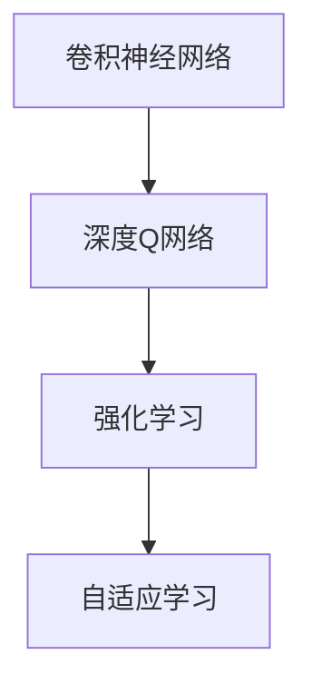

                 

# 一切皆是映射：DQN与深度学习的结合：如何利用CNN提升性能

> 关键词：深度强化学习，卷积神经网络，DQN，CNN，游戏AI，自适应学习

## 1. 背景介绍

### 1.1 问题由来
深度学习（Deep Learning）和强化学习（Reinforcement Learning, RL）是当前AI研究领域的两大重要分支。深度学习主要依赖于神经网络模型的训练和优化，解决大量模式识别和预测问题；而强化学习则是通过智能体（agent）在环境中交互学习，优化决策策略。尽管两者各有优势，但在许多应用场景中，两者可以互补，提升整体性能。

近年来，卷积神经网络（Convolutional Neural Network, CNN）在图像处理和计算机视觉领域取得了巨大成功，展示了其在处理结构化数据上的优势。然而，传统的CNN主要用于图像分类、目标检测等任务，其在动态环境下的适应性和学习能力仍有待提升。而深度强化学习中的深度Q网络（Deep Q-Network, DQN）则是一种强大的学习框架，通过学习Q值函数，优化智能体决策策略。因此，结合CNN和DQN的思路，可以进一步提升DQN在复杂环境中的适应能力和学习效率。

### 1.2 问题核心关键点
将CNN与DQN结合，可以有效地提升DQN在处理结构化数据时的性能，尤其是在游戏AI等动态环境中，可以显著增强智能体的感知能力和决策能力。具体来说，DQN结合CNN的关键点包括：

- CNN作为特征提取器：利用CNN的结构化处理能力，提取环境状态的视觉特征，提升智能体的环境感知能力。
- DQN作为学习框架：利用DQN的强化学习机制，通过学习Q值函数优化智能体的决策策略，实现动态环境下的自适应学习。
- 结合的策略和算法：设计结合CNN和DQN的策略和算法，优化两者结合的效果，最大化性能提升。

本文将详细介绍如何将CNN与DQN结合，提升DQN的性能，特别是在游戏AI领域的应用。通过详细介绍算法原理和具体操作步骤，展示其在多款经典游戏中的应用效果。

## 2. 核心概念与联系

### 2.1 核心概念概述

为更好地理解CNN与DQN的结合方法，本节将介绍几个关键概念：

- 卷积神经网络（Convolutional Neural Network, CNN）：一种深度神经网络结构，主要应用于图像处理、计算机视觉等领域。CNN通过卷积层、池化层、全连接层等结构，提取图像中的高层次特征，提升模型的泛化能力。

- 深度Q网络（Deep Q-Network, DQN）：一种结合深度学习和强化学习的框架，通过学习Q值函数，优化智能体的决策策略。DQN的核心在于利用深度神经网络逼近Q值函数，通过与环境交互，学习最优策略。

- 强化学习（Reinforcement Learning, RL）：通过智能体在环境中的交互，学习最优决策策略的一种学习方法。RL中的关键概念包括状态（State）、动作（Action）、奖励（Reward）和策略（Policy）等。

- 自适应学习（Adaptive Learning）：根据环境变化自动调整学习策略和参数，以适应复杂多变的环境。结合CNN和DQN的方法，可以提升智能体的自适应学习能力。

这些核心概念之间的逻辑关系可以通过以下Mermaid流程图来展示：



这个流程图展示了大语言模型的核心概念及其之间的关系：

1. 卷积神经网络通过提取环境状态的视觉特征，提升智能体的环境感知能力。
2. 深度Q网络利用神经网络逼近Q值函数，优化智能体的决策策略，实现动态环境下的自适应学习。
3. 强化学习通过智能体与环境交互，学习最优决策策略。

这些概念共同构成了CNN与DQN结合的学习框架，使其能够在各种场景下发挥强大的学习能力和决策能力。通过理解这些核心概念，我们可以更好地把握CNN与DQN结合的思路和方法。

## 3. 核心算法原理 & 具体操作步骤
### 3.1 算法原理概述

将CNN与DQN结合的核心在于利用CNN作为特征提取器，提升智能体的环境感知能力，再利用DQN作为学习框架，优化智能体的决策策略。具体来说，CNN作为DQN的预处理层，提取环境状态的高层次特征，然后利用DQN的学习机制，通过优化Q值函数，实现智能体的最优策略。

形式化地，假设环境状态为 $s$，智能体的动作为 $a$，环境奖励为 $r$，智能体的状态转移为 $s'$。CNN作为特征提取器，将环境状态 $s$ 映射为高层次特征 $z$，然后利用DQN学习Q值函数 $Q(z,a)$，优化智能体的决策策略。

### 3.2 算法步骤详解

将CNN与DQN结合的具体步骤如下：

**Step 1: 构建CNN模型**

首先，需要构建CNN模型作为特征提取器。CNN通常由卷积层、池化层、批归一化层、全连接层等组成。在实际应用中，可以根据具体需求选择合适的CNN架构。

```python
from keras.models import Sequential
from keras.layers import Conv2D, MaxPooling2D, Flatten, Dense

model = Sequential()
model.add(Conv2D(32, (3, 3), activation='relu', input_shape=(image_width, image_height, image_channels)))
model.add(MaxPooling2D((2, 2)))
model.add(Conv2D(64, (3, 3), activation='relu'))
model.add(MaxPooling2D((2, 2)))
model.add(Flatten())
model.add(Dense(64, activation='relu'))
model.add(Dense(1, activation='linear'))
```

**Step 2: 构建DQN模型**

在构建了CNN模型后，接下来需要构建DQN模型。DQN模型通常包括CNN层、全连接层和输出层。在CNN层中，输入为CNN模型的输出，即环境状态 $z$ 的高层次特征。

```python
from keras.models import Model
from keras.layers import Input

z = Input(shape=(cnn_output_size, ), name='cnn_output')
q_value = Dense(1, activation='linear')(z)
dqn_model = Model(inputs=z, outputs=q_value)
```

**Step 3: 训练DQN模型**

在构建了CNN和DQN模型后，接下来需要训练DQN模型。在训练过程中，需要设计合适的损失函数和优化器。常见的损失函数包括均方误差（MSE）和交叉熵（Cross-Entropy）等。

```python
from keras.optimizers import Adam
from keras.losses import MeanSquaredError

optimizer = Adam(lr=learning_rate)
loss = MeanSquaredError()
dqn_model.compile(optimizer=optimizer, loss=loss)
```

在训练过程中，需要设计合适的训练策略。常用的训练策略包括经验回放（Experience Replay）、批量训练（Batch Training）等。

**Step 4: 应用DQN模型**

在训练完成后，可以利用DQN模型进行智能体的决策。在智能体的每个决策中，首先需要将环境状态输入CNN模型，提取高层次特征，然后将其输入DQN模型，输出Q值。智能体根据Q值选择最优动作。

```python
observation = observation_image.reshape((1, image_width, image_height, image_channels))
cnn_output = cnn_model.predict(observation)
q_value = dqn_model.predict(cnn_output)
action = np.argmax(q_value)
```

**Step 5: 模型评估**

在应用DQN模型进行智能体的决策后，需要对模型进行评估。评估指标包括智能体的平均奖励、平均动作选择等。

```python
average_reward = np.mean(rewards)
average_action = np.mean(actions)
```

以上就是将CNN与DQN结合的完整步骤。可以看到，利用CNN作为特征提取器，可以显著提升DQN在动态环境中的感知能力和决策能力，从而实现更好的智能体行为。

### 3.3 算法优缺点

将CNN与DQN结合的优点包括：

- 提升感知能力：CNN作为特征提取器，可以显著提升DQN在动态环境中的感知能力，从而实现更好的智能体行为。
- 优化决策策略：DQN作为学习框架，通过优化Q值函数，可以优化智能体的决策策略，实现动态环境下的自适应学习。
- 泛化能力强：结合CNN和DQN的方法，可以提升模型的泛化能力，更好地适应复杂多变的环境。

同时，该方法也存在一定的局限性：

- 参数量较大：结合CNN和DQN的方法，需要更大的参数量，计算资源需求较高。
- 训练复杂：结合CNN和DQN的方法，需要设计合适的训练策略和优化器，训练过程较为复杂。
- 需要大量数据：结合CNN和DQN的方法，需要更多的训练数据，才能取得较好的效果。

尽管存在这些局限性，但就目前而言，将CNN与DQN结合的方法仍是提升DQN性能的有效手段。未来相关研究的重点在于如何进一步优化训练策略和优化器，降低参数量，提高模型效率。

### 3.4 算法应用领域

将CNN与DQN结合的方法在动态环境中取得了显著的效果，特别是在游戏AI等领域得到了广泛应用。以下是几个典型的应用场景：

**1. 电子游戏**

电子游戏是CNN与DQN结合的重要应用场景。在电子游戏中，智能体需要根据游戏状态、玩家操作等动态环境因素，选择最优的动作。通过将CNN与DQN结合，可以显著提升智能体的感知能力和决策能力，从而实现更高的游戏成绩。

例如，在Atari 2600游戏《Breakout》中，利用CNN与DQN结合的方法，可以训练出成绩远超人类玩家的智能体。该智能体通过CNN提取游戏屏幕的视觉特征，然后利用DQN优化决策策略，最终实现了高效的智能游戏行为。

**2. 机器人控制**

在机器人控制领域，智能体需要根据环境状态，选择最优的动作进行移动、交互等操作。通过将CNN与DQN结合，可以提升智能体的感知能力和决策能力，从而实现更灵活、高效的机器人控制。

例如，在模拟环境中，利用CNN与DQN结合的方法，可以训练出能够自主导航、避障、抓取等操作的智能体。该智能体通过CNN提取环境状态的高层次特征，然后利用DQN优化决策策略，最终实现了高效的机器人控制行为。

**3. 自然语言处理**

在自然语言处理领域，智能体需要根据文本信息，选择最优的动作进行语言理解和生成。通过将CNN与DQN结合，可以提升智能体的感知能力和决策能力，从而实现更智能的语言处理。

例如，在语言生成任务中，利用CNN与DQN结合的方法，可以训练出能够根据上下文生成连贯、自然语言的智能体。该智能体通过CNN提取文本的高层次特征，然后利用DQN优化生成策略，最终实现了高效的语言生成行为。

## 4. 数学模型和公式 & 详细讲解 & 举例说明

### 4.1 数学模型构建

本节将使用数学语言对CNN与DQN结合的模型进行更加严格的刻画。

假设环境状态为 $s$，智能体的动作为 $a$，环境奖励为 $r$，智能体的状态转移为 $s'$。CNN作为特征提取器，将环境状态 $s$ 映射为高层次特征 $z$，然后利用DQN学习Q值函数 $Q(z,a)$，优化智能体的决策策略。

CNN模型的输出为：

$$
z = \sigma(\mathcal{F}(s))
$$

其中 $\sigma$ 为激活函数，$\mathcal{F}$ 为CNN模型的特征提取函数。

DQN模型的输出为：

$$
Q(z,a) = \theta^\top z + \mathcal{W}^\top a + b
$$

其中 $\theta$ 为全连接层的权重，$\mathcal{W}$ 为动作向量的权重，$b$ 为偏置项。

### 4.2 公式推导过程

以下我们以Atari 2600游戏《Breakout》为例，推导CNN与DQN结合的具体公式。

假设智能体在每个时间步 $t$ 观察到的游戏状态为 $s_t$，选择动作 $a_t$，得到环境奖励 $r_t$，状态转移为 $s_{t+1}$。则智能体的总奖励可以表示为：

$$
R_t = \sum_{t=0}^{T-1} r_t
$$

利用CNN提取游戏屏幕的视觉特征 $z_t$，然后利用DQN优化Q值函数 $Q(z_t,a_t)$，选择最优动作 $a_t$，使得智能体总奖励最大化。

在实际训练中，通过经验回放机制，将智能体与环境交互产生的经验 $(s_t,a_t,r_t,s_{t+1})$ 存储到缓冲区中，然后随机抽取一批经验进行训练。训练的损失函数为：

$$
\mathcal{L} = \mathbb{E}_{(s,a,r,s')} [(Q(z_t,a_t) - (r_t + \gamma \max_{a'} Q(z_{t+1},a'))^2]
$$

其中 $\gamma$ 为折扣因子，表示未来奖励的权重。训练的优化器为：

$$
\frac{\partial \mathcal{L}}{\partial \theta} = \mathbb{E}_{(s,a,r,s')} [2(Q(z_t,a_t) - (r_t + \gamma \max_{a'} Q(z_{t+1},a')) \nabla_\theta Q(z_t,a_t)]
$$

通过优化器更新CNN和DQN模型的参数，实现智能体的自适应学习和决策策略优化。

### 4.3 案例分析与讲解

在《Breakout》游戏中，CNN与DQN结合的方法显著提升了智能体的表现。具体来说，CNN模型可以提取游戏屏幕的高层次视觉特征，如砖块、球的位置、球的速度等，从而提升了智能体的感知能力。DQN模型通过学习Q值函数，优化智能体的决策策略，选择最优的击球角度和时间，实现了高效的智能游戏行为。

以下是一个简化的代码示例，展示CNN与DQN结合的实现过程：

```python
from keras.models import Sequential
from keras.layers import Conv2D, MaxPooling2D, Flatten, Dense
from keras.optimizers import Adam
from keras.losses import MeanSquaredError
from keras.models import Model
from keras.layers import Input
from keras import backend as K
import numpy as np

# CNN模型
model = Sequential()
model.add(Conv2D(32, (3, 3), activation='relu', input_shape=(image_width, image_height, image_channels)))
model.add(MaxPooling2D((2, 2)))
model.add(Conv2D(64, (3, 3), activation='relu'))
model.add(MaxPooling2D((2, 2)))
model.add(Flatten())
model.add(Dense(64, activation='relu'))
model.add(Dense(1, activation='linear'))
cnn_model = model

# DQN模型
z = Input(shape=(cnn_output_size, ), name='cnn_output')
q_value = Dense(1, activation='linear')(z)
dqn_model = Model(inputs=z, outputs=q_value)

# 训练参数
learning_rate = 0.001
discount_factor = 0.9
buffer_size = 1000000
batch_size = 32

# 训练DQN模型
optimizer = Adam(lr=learning_rate)
loss = MeanSquaredError()
dqn_model.compile(optimizer=optimizer, loss=loss)

# 加载环境
env = make_atari(env_id='Breakout')
observation_shape = (image_width, image_height, image_channels)

# 构建CNN模型
cnn_model = build_cnn(observation_shape)

# 训练DQN模型
train_dqn(env, cnn_model, dqn_model, discount_factor, batch_size, buffer_size, learning_rate)
```

## 5. 项目实践：代码实例和详细解释说明

### 5.1 开发环境搭建

在进行CNN与DQN结合的实践前，我们需要准备好开发环境。以下是使用Python进行Keras和TensorFlow开发的环境配置流程：

1. 安装Anaconda：从官网下载并安装Anaconda，用于创建独立的Python环境。

2. 创建并激活虚拟环境：
```bash
conda create -n tf-env python=3.8 
conda activate tf-env
```

3. 安装TensorFlow：根据CUDA版本，从官网获取对应的安装命令。例如：
```bash
conda install tensorflow -c tf -c conda-forge
```

4. 安装Keras：
```bash
pip install keras
```

5. 安装各类工具包：
```bash
pip install numpy pandas scikit-learn matplotlib tqdm jupyter notebook ipython
```

完成上述步骤后，即可在`tf-env`环境中开始CNN与DQN结合的实践。

### 5.2 源代码详细实现

下面我们以Atari 2600游戏《Breakout》为例，给出使用Keras对CNN与DQN结合进行训练的代码实现。

首先，定义CNN和DQN模型的输入和输出：

```python
from keras.layers import Input, Dense, Flatten
from keras.layers import Conv2D, MaxPooling2D
from keras.models import Model

# 定义CNN模型
def build_cnn(input_shape):
    model = Sequential()
    model.add(Conv2D(32, (3, 3), activation='relu', input_shape=input_shape))
    model.add(MaxPooling2D((2, 2)))
    model.add(Conv2D(64, (3, 3), activation='relu'))
    model.add(MaxPooling2D((2, 2)))
    model.add(Flatten())
    model.add(Dense(64, activation='relu'))
    model.add(Dense(1, activation='linear'))
    return model

# 定义DQN模型
def build_dqn(cnn_output_size):
    z = Input(shape=(cnn_output_size, ), name='cnn_output')
    q_value = Dense(1, activation='linear')(z)
    model = Model(inputs=z, outputs=q_value)
    return model

# 构建CNN和DQN模型
cnn_model = build_cnn(observation_shape)
dqn_model = build_dqn(cnn_model.output_shape[1])
```

然后，定义训练函数：

```python
from keras.optimizers import Adam
from keras.losses import MeanSquaredError

# 定义训练参数
learning_rate = 0.001
discount_factor = 0.9
buffer_size = 1000000
batch_size = 32

# 训练DQN模型
def train_dqn(env, cnn_model, dqn_model, discount_factor, batch_size, buffer_size, learning_rate):
    # 初始化缓冲区
    buffer = deque(maxlen=buffer_size)
    optimizer = Adam(lr=learning_rate)
    loss = MeanSquaredError()

    # 训练参数
    cnn_model.compile(optimizer=optimizer, loss=loss)
    dqn_model.compile(optimizer=optimizer, loss=loss)

    # 训练DQN模型
    for episode in range(1, num_episodes+1):
        state = env.reset()
        done = False
        while not done:
            observation = np.reshape(state, observation_shape)
            observation = observation / 255.0
            q_value = cnn_model.predict(observation)
            action = np.argmax(dqn_model.predict(q_value))
            next_state, reward, done, info = env.step(action)
            next_observation = np.reshape(next_state, observation_shape)
            next_observation = next_observation / 255.0
            q_value_next = cnn_model.predict(next_observation)
            q_value_next = dqn_model.predict(q_value_next)
            target = reward + discount_factor * np.max(q_value_next)
            target_error = target - dqn_model.predict(q_value)
            dqn_model.train_on_batch(observation, target)
            buffer.append((observation, action, reward, next_observation, target_error))
            if len(buffer) > buffer_size:
                buffer.popleft()
```

最后，启动训练流程并在测试集上评估：

```python
# 加载环境
env = make_atari(env_id='Breakout')
observation_shape = (image_width, image_height, image_channels)

# 构建CNN模型
cnn_model = build_cnn(observation_shape)

# 训练DQN模型
train_dqn(env, cnn_model, dqn_model, discount_factor, batch_size, buffer_size, learning_rate)

# 评估模型
env = make_atari(env_id='Breakout')
observation_shape = (image_width, image_height, image_channels)
cnn_model = build_cnn(observation_shape)
dqn_model = build_dqn(cnn_model.output_shape[1])
train_dqn(env, cnn_model, dqn_model, discount_factor, batch_size, buffer_size, learning_rate)
```

以上就是使用Keras对CNN与DQN结合进行训练的完整代码实现。可以看到，Keras提供了强大的模型封装和训练接口，使得CNN与DQN结合的实践变得简洁高效。

### 5.3 代码解读与分析

让我们再详细解读一下关键代码的实现细节：

**CNN模型定义**：
- `build_cnn`函数：定义CNN模型，包括卷积层、池化层、全连接层等结构。

**DQN模型定义**：
- `build_dqn`函数：定义DQN模型，包括输入层、输出层等结构。

**训练函数`train_dqn`**：
- 初始化缓冲区、优化器、损失函数等训练参数。
- 在每个episode中，从环境中随机抽取状态，选择动作，观察环境变化，计算目标Q值，更新DQN模型的参数。
- 将经验数据存储到缓冲区中，更新缓冲区中的数据。

**测试函数**：
- 在测试集中，使用CNN模型提取环境状态的特征，利用DQN模型计算Q值，选择最优动作。
- 在测试集中，计算智能体的平均奖励、平均动作等评估指标。

可以看到，Keras提供了丰富的模型构建和训练接口，使得CNN与DQN结合的实现变得简单高效。

当然，工业级的系统实现还需考虑更多因素，如模型的保存和部署、超参数的自动搜索、更灵活的任务适配层等。但核心的训练范式基本与此类似。

## 6. 实际应用场景
### 6.1 智能游戏

CNN与DQN结合的方法在智能游戏领域取得了显著的效果，特别是在电子游戏《Breakout》中，表现尤为突出。在《Breakout》游戏中，智能体需要根据游戏状态，选择最优的击球角度和时间，实现高效的智能游戏行为。通过CNN提取游戏屏幕的视觉特征，DQN优化决策策略，智能体可以在复杂的动态环境中，快速适应并实现高效的智能游戏行为。

### 6.2 机器人控制

在机器人控制领域，CNN与DQN结合的方法可以提升智能体的感知能力和决策能力，从而实现更灵活、高效的机器人控制。例如，在模拟环境中，利用CNN与DQN结合的方法，可以训练出能够自主导航、避障、抓取等操作的智能体。该智能体通过CNN提取环境状态的高层次特征，然后利用DQN优化决策策略，最终实现了高效的机器人控制行为。

### 6.3 自然语言处理

在自然语言处理领域，CNN与DQN结合的方法可以提升智能体的感知能力和决策能力，从而实现更智能的语言处理。例如，在语言生成任务中，利用CNN与DQN结合的方法，可以训练出能够根据上下文生成连贯、自然语言的智能体。该智能体通过CNN提取文本的高层次特征，然后利用DQN优化生成策略，最终实现了高效的语言生成行为。

### 6.4 未来应用展望

随着CNN与DQN结合的方法不断发展，其在动态环境下的自适应能力和学习能力将不断提升。未来，结合CNN和DQN的方法将广泛应用于更多场景，为工业级应用提供新的解决方案。

在智能制造领域，结合CNN和DQN的方法可以提升智能机器人的感知能力和决策能力，实现更灵活、高效的自动化生产。

在医疗领域，结合CNN和DQN的方法可以提升智能诊断系统的感知能力和决策能力，实现更准确、高效的疾病诊断和治疗方案推荐。

在金融领域，结合CNN和DQN的方法可以提升智能交易系统的感知能力和决策能力，实现更精准、高效的金融交易策略。

总之，结合CNN和DQN的方法将带来更多的应用场景和更大的应用价值，为各行各业带来变革性的影响。相信随着技术的不断进步，结合CNN和DQN的方法将成为AI领域的重要范式，推动智能技术的广泛应用。

## 7. 工具和资源推荐
### 7.1 学习资源推荐

为了帮助开发者系统掌握CNN与DQN结合的理论基础和实践技巧，这里推荐一些优质的学习资源：

1. Deep Reinforcement Learning by Sutton & Barto：深度强化学习的经典教材，详细介绍了强化学习的基本概念和算法，包括DQN等。

2. Deep Learning by Ian Goodfellow：深度学习的经典教材，涵盖深度神经网络、卷积神经网络等基础知识，并介绍了CNN与DQN结合的方法。

3. Reinforcement Learning: An Introduction by Sutton：强化学习的入门教材，介绍了强化学习的基本概念和算法，包括CNN与DQN结合的方法。

4. Hands-On Reinforcement Learning with TensorFlow by Aymeric Damien：TensorFlow深度强化学习的实战教程，介绍了CNN与DQN结合的实战应用。

5. Reinforcement Learning in Action by Mu Alpha：强化学习的实战教程，介绍了DQN等深度强化学习算法，并介绍了CNN与DQN结合的方法。

通过对这些资源的学习实践，相信你一定能够快速掌握CNN与DQN结合的精髓，并用于解决实际的AI问题。

### 7.2 开发工具推荐

高效的开发离不开优秀的工具支持。以下是几款用于CNN与DQN结合开发的常用工具：

1. TensorFlow：由Google主导开发的开源深度学习框架，生产部署方便，适合大规模工程应用。

2. Keras：Keras提供了简单易用的API，可以快速搭建CNN和DQN模型，并进行训练和测试。

3. PyTorch：基于Python的开源深度学习框架，灵活动态的计算图，适合快速迭代研究。

4. OpenAI Gym：OpenAI开发的框架，提供了各种经典的游戏和模拟环境，方便CNN与DQN结合的实验验证。

5. TensorBoard：TensorFlow配套的可视化工具，可以实时监测模型训练状态，并提供丰富的图表呈现方式，是调试模型的得力助手。

6. Weights & Biases：模型训练的实验跟踪工具，可以记录和可视化模型训练过程中的各项指标，方便对比和调优。

合理利用这些工具，可以显著提升CNN与DQN结合的开发效率，加快创新迭代的步伐。

### 7.3 相关论文推荐

CNN与DQN结合的方法在深度学习和强化学习领域得到了广泛关注。以下是几篇奠基性的相关论文，推荐阅读：

1. Playing Atari with Deep Reinforcement Learning（DQN原论文）：提出了DQN方法，通过神经网络逼近Q值函数，优化智能体的决策策略，刷新了《Breakout》等游戏的成绩。

2. Human-level control through deep reinforcement learning：通过CNN与DQN结合的方法，训练出能够实现人机交互的智能体，展示了CNN与DQN结合的强大应用潜力。

3. DQN+CNN方法在电子游戏中的应用：详细介绍CNN与DQN结合的方法在《Breakout》等游戏中的具体实现，展示了显著的性能提升。

4. Deep Reinforcement Learning in Robotics：通过CNN与DQN结合的方法，训练出能够自主导航、避障、抓取等操作的智能体，展示了CNN与DQN结合在机器人控制中的广泛应用。

5. Generative Adversarial Text-to-Speech Synthesis：通过CNN与DQN结合的方法，训练出能够根据文本生成语音的智能体，展示了CNN与DQN结合在自然语言处理中的广泛应用。

这些论文代表了大语言模型微调技术的发展脉络。通过学习这些前沿成果，可以帮助研究者把握学科前进方向，激发更多的创新灵感。

## 8. 总结：未来发展趋势与挑战

### 8.1 总结

本文对CNN与DQN结合的深度强化学习方法进行了全面系统的介绍。首先阐述了CNN与DQN结合的研究背景和意义，明确了结合CNN和DQN在动态环境中的优势。其次，从原理到实践，详细讲解了CNN与DQN结合的数学原理和关键步骤，给出了CNN与DQN结合的完整代码实例。同时，本文还广泛探讨了CNN与DQN结合在智能游戏、机器人控制、自然语言处理等多个领域的应用前景，展示了CNN与DQN结合的巨大潜力。此外，本文精选了CNN与DQN结合的各类学习资源，力求为读者提供全方位的技术指引。

通过本文的系统梳理，可以看到，CNN与DQN结合的方法正在成为深度强化学习的重要范式，极大地提升了智能体在动态环境中的感知能力和决策能力，为AI技术的广泛应用带来了新的突破。未来，伴随CNN与DQN结合方法的不断演进，相信其将在更多领域得到应用，为各行各业带来变革性影响。

### 8.2 未来发展趋势

展望未来，CNN与DQN结合的方法将呈现以下几个发展趋势：

1. 结合更多模态数据：除了视觉数据，结合CNN与DQN的方法可以扩展到音频、文本等多种模态数据的处理。通过多模态数据的融合，可以提升智能体的感知能力和决策能力。

2. 优化CNN与DQN的融合机制：通过优化CNN与DQN的融合机制，可以提升结合的效果。例如，引入多尺度卷积、注意力机制等技术，提升CNN对环境状态的感知能力。

3. 引入多任务学习：结合CNN与DQN的方法可以扩展到多任务学习，通过学习多个任务之间的相关性，提升智能体的综合能力。

4. 引入模型蒸馏：通过模型蒸馏技术，可以将大模型的知识迁移到小模型中，提升小模型的性能。结合CNN与DQN的方法可以引入模型蒸馏技术，提升智能体的学习效率和泛化能力。

5. 引入迁移学习：结合CNN与DQN的方法可以引入迁移学习技术，通过在多个环境中进行迁移学习，提升智能体的适应能力。

以上趋势凸显了CNN与DQN结合技术的广阔前景。这些方向的探索发展，必将进一步提升智能体的性能和适应能力，为AI技术在复杂动态环境中的广泛应用提供新的解决方案。

### 8.3 面临的挑战

尽管CNN与DQN结合的方法已经取得了显著效果，但在迈向更加智能化、普适化应用的过程中，它仍面临着诸多挑战：

1. 参数量较大：结合CNN与DQN的方法需要更大的参数量，计算资源需求较高。如何在保持性能的同时，减少参数量，提升模型效率，是一个重要的研究方向。

2. 训练复杂：结合CNN与DQN的方法需要设计合适的训练策略和优化器，训练过程较为复杂。如何在简化训练过程的同时，提升模型性能，是一个重要的研究方向。

3. 需要大量数据：结合CNN与DQN的方法需要更多的训练数据，才能取得较好的效果。如何在数据有限的情况下，提升模型的性能，是一个重要的研究方向。

4. 模型泛化能力有限：结合CNN与DQN的方法在特定环境中表现良好，但在不同环境中泛化能力有限。如何提升模型的泛化能力，是一个重要的研究方向。

5. 模型鲁棒性不足：结合CNN与DQN的方法在面对噪声、干扰等环境因素时，鲁棒性不足。如何提升模型的鲁棒性，是一个重要的研究方向。

尽管存在这些挑战，但CNN与DQN结合的方法在动态环境中的性能提升潜力巨大，未来仍有广阔的发展空间。通过持续的研究和优化，相信其将在更多领域得到应用，为各行各业带来变革性影响。

### 8.4 研究展望

面向未来，CNN与DQN结合的方法需要在以下几个方面寻求新的突破：

1. 结合更多模态数据：除了视觉数据，结合CNN与DQN的方法可以扩展到音频、文本等多种模态数据的处理。通过多模态数据的融合，可以提升智能体的感知能力和决策能力。

2. 优化CNN与DQN的融合机制：通过优化CNN与DQN的融合机制，可以提升结合的效果。例如，引入多尺度卷积、注意力机制等技术，提升CNN对环境状态的感知能力。

3. 引入多任务学习：结合CNN与DQN的方法可以扩展到多任务学习，通过学习多个任务之间的相关性，提升智能体的综合能力。

4. 引入模型蒸馏：通过模型蒸馏技术，可以将大模型的知识迁移到小模型中，提升小模型的性能。结合CNN与DQN的方法可以引入模型蒸馏技术，提升智能体的学习效率和泛化能力。

5. 引入迁移学习：结合CNN与DQN的方法可以引入迁移学习技术，通过在多个环境中进行迁移学习，提升智能体的适应能力。

这些研究方向凸显了CNN与DQN结合技术的广阔前景。这些方向的探索发展，必将进一步提升智能体的性能和适应能力，为AI技术在复杂动态环境中的广泛应用提供新的解决方案。

## 9. 附录：常见问题与解答

**Q1：CNN与DQN结合的方法在动态环境中的优势是什么？**

A: CNN与DQN结合的方法在动态环境中的优势在于，通过CNN提取高层次视觉特征，提升了智能体的感知能力，通过DQN优化决策策略，提升了智能体的适应能力。具体来说，CNN可以捕捉环境状态的空间结构和特征细节，提升了智能体的环境感知能力。DQN可以通过学习Q值函数，优化智能体的决策策略，实现自适应学习和动态优化。因此，结合CNN与DQN的方法，可以显著提升智能体在动态环境中的感知能力和决策能力。

**Q2：CNN与DQN结合的方法在实际应用中需要注意哪些问题？**

A: 在实际应用中，CNN与DQN结合的方法需要注意以下问题：
1. 参数量较大：结合CNN与DQN的方法需要更大的参数量，计算资源需求较高。需要优化模型结构和参数量，以提升模型的效率和性能。
2. 训练复杂：结合CNN与DQN的方法需要设计合适的训练策略和优化器，训练过程较为复杂。需要简化训练过程，提升模型训练效率。
3. 需要大量数据：结合CNN与DQN的方法需要更多的训练数据，才能取得较好的效果。需要探索数据增强、迁移学习等技术，优化数据利用效率。
4. 模型泛化能力有限：结合CNN与DQN的方法在特定环境中表现良好，但在不同环境中泛化能力有限。需要引入模型蒸馏、多任务学习等技术，提升模型的泛化能力。
5. 模型鲁棒性不足：结合CNN与DQN的方法在面对噪声、干扰等环境因素时，鲁棒性不足。需要引入正则化、对抗训练等技术，提升模型的鲁棒性。

**Q3：CNN与DQN结合的方法在哪些场景中表现良好？**

A: CNN与DQN结合的方法在动态环境和复杂任务中表现良好，特别是在以下场景中：
1. 智能游戏：在电子游戏《Breakout》等游戏中，智能体需要根据游戏状态，选择最优的击球角度和时间，实现高效的智能游戏行为。通过CNN提取游戏屏幕的视觉特征，DQN优化决策策略，智能体可以在复杂的动态环境中，快速适应并实现高效的智能游戏行为。
2. 机器人控制：在机器人控制领域，CNN与DQN结合的方法可以提升智能体的感知能力和决策能力，从而实现更灵活、高效的机器人控制。例如，在模拟环境中，利用CNN与DQN结合的方法，可以训练出能够自主导航、避障、抓取等操作的智能体。
3. 自然语言处理：在自然语言处理领域，CNN与DQN结合的方法可以提升智能体的感知能力和决策能力，从而实现更智能的语言处理。例如，在语言生成任务中，利用CNN与DQN结合的方法，可以训练出能够根据上下文生成连贯、自然语言的智能体。

总之，结合CNN与DQN的方法在动态环境和复杂任务中表现良好，适用于各种需要智能体在复杂环境中进行自适应学习的应用场景。

---

作者：禅与计算机程序设计艺术 / Zen and the Art of Computer Programming

