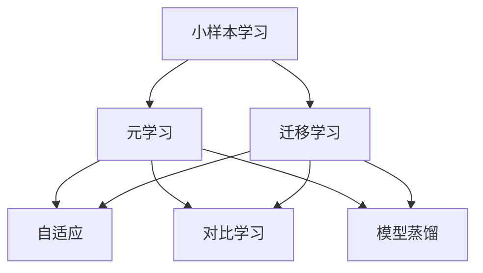

                 

# 一切皆是映射：元学习在小样本学习中的应用

> 关键词：小样本学习,元学习,迁移学习,隐式学习,自适应,模型蒸馏,对比学习

## 1. 背景介绍

### 1.1 问题由来
在深度学习时代，数据是模型的立身之本。然而，对于许多实际问题，尤其是科研、医疗、司法等领域，标注数据获取难度大、成本高、时间周期长，无法满足大数据训练模型对数据量的需求。小样本学习（Few-shot Learning）正是在这种背景下应运而生，旨在通过极少量的标注样本，训练模型完成特定任务。

小样本学习的研究可以追溯到1995年，Yann LeCun等人提出使用神经网络模型进行手写数字识别任务时，仅需50个训练样本即可达到80%的准确率。之后，Kwon et al.在2005年首次提出元学习（Meta-Learning）的概念，通过预先训练模型对新任务的泛化能力，在小样本学习中达到高精度。

当前，小样本学习已经成为深度学习领域的热点研究方向。在学术界，其研究热点包括自适应（Adaptive）元学习、对比学习（Contrastive Learning）、模型蒸馏（Model Distillation）等；在工业界，小样本学习也被广泛应用于自然语言处理、计算机视觉、推荐系统等多个领域，取得显著成效。

本文旨在介绍小样本学习领域的元学习范式及其关键技术，探讨元学习在小样本学习中的应用。接下来，从元学习的原理、核心算法、应用案例等方面进行详细阐述，并进一步分析其面临的挑战与未来发展方向。

## 2. 核心概念与联系

### 2.1 核心概念概述

为更好地理解元学习在小样本学习中的应用，本文首先介绍几个关键概念：

- **小样本学习**：指在极少量的标注数据上进行模型训练，以完成特定任务。与传统的 supervised learning 不同，小样本学习需要在有限的标注样本基础上，快速学习到任务的泛化能力。
- **元学习**：指模型学习到一种快速适应新任务的泛化能力，即通过学习前一任务的特征，在后一任务中快速适应。元学习是解决小样本学习问题的重要手段。
- **迁移学习**：指将在一个领域中学习的知识，应用到另一个领域中。元学习和迁移学习可以视为迁移学习的两个重要分支，前者着重于任务的自适应，后者着重于领域知识的迁移。
- **隐式学习**：指模型通过输入和输出的映射关系，自发地学习到数据的分布，而无需显式标注。元学习在很多时候采用隐式学习的方式，通过在多个任务中学习到的特征进行迁移。

这些概念通过以下 Mermaid 流程图进行展示：



这个流程图展示了几大核心概念之间的逻辑关系：

1. 小样本学习通常采用元学习，通过预先学习任务的泛化能力。
2. 元学习关注自适应，即模型能够快速适应新任务。
3. 元学习中的迁移学习关注领域知识的迁移，将一个领域中的知识应用到另一个领域。
4. 隐式学习是元学习中常用的学习方式，模型通过输入输出映射关系自发学习。

## 3. 核心算法原理 & 具体操作步骤

### 3.1 算法原理概述

元学习在小样本学习中的应用，本质上是模型学习一种快速适应新任务的泛化能力。其核心思想是：通过预先训练模型在多个相关任务中学习泛化能力，当面临新任务时，模型可以快速适应并取得良好表现。

元学习一般分为两个阶段：

- **外环（Outer Loop）**：模型在多个相关任务中进行预先训练，学习泛化能力。
- **内环（Inner Loop）**：在新任务上进行微调，利用预训练得到的泛化能力进行快速适应。

以下对常见的元学习算法进行详细讲解：

### 3.2 算法步骤详解

#### 3.2.1 自适应元学习

自适应元学习（Adaptive Meta-Learning）通过优化元模型，使得模型能够快速适应新任务。其算法流程如下：

1. **外环**：选择多个相关任务进行预训练，优化元模型，使得模型能够在新任务中快速适应。
2. **内环**：在新任务上对模型进行微调，通过元模型指导快速收敛。

具体步骤如下：

**Step 1: 数据准备**
- 准备若干相关任务的数据集，每个任务包含有限数量的标注样本。

**Step 2: 元模型初始化**
- 随机初始化元模型，如MAML（Model-Agnostic Meta-Learning）中的初始化权重。

**Step 3: 外环训练**
- 遍历每个训练数据集，对元模型进行优化。
- 选择每个数据集的$k$个样本进行梯度计算，更新元模型。
- 重复$n$次，直至收敛。

**Step 4: 内环微调**
- 对新任务的数据集进行微调，利用元模型指导初始化参数。
- 使用小批量梯度下降，对新任务的模型进行优化。
- 返回微调后的模型。

#### 3.2.2 对比学习

对比学习（Contrastive Learning）通过最大化同类别样本的相似度，最小化不同类别样本的相似度，实现模型的自适应。其算法流程如下：

1. **外环**：选择多个相关任务进行预训练，优化模型，使得模型能够在新任务中快速适应。
2. **内环**：在新任务上进行微调，利用对比学习方法指导快速收敛。

具体步骤如下：

**Step 1: 数据准备**
- 准备若干相关任务的数据集，每个任务包含有限数量的标注样本。

**Step 2: 模型初始化**
- 随机初始化模型，如Siamese Network、MoCo等。

**Step 3: 外环训练**
- 遍历每个训练数据集，对模型进行优化。
- 使用对比学习目标函数计算损失，更新模型。
- 重复$n$次，直至收敛。

**Step 4: 内环微调**
- 对新任务的数据集进行微调，利用对比学习方法指导快速收敛。
- 使用小批量梯度下降，对新任务的模型进行优化。
- 返回微调后的模型。

#### 3.2.3 模型蒸馏

模型蒸馏（Model Distillation）通过将复杂模型中的知识蒸馏到简单模型中，实现模型的快速适应。其算法流程如下：

1. **外环**：选择多个相关任务进行预训练，复杂模型蒸馏知识到简单模型中。
2. **内环**：在新任务上对简单模型进行微调，利用蒸馏得到的知识指导快速收敛。

具体步骤如下：

**Step 1: 数据准备**
- 准备若干相关任务的数据集，每个任务包含有限数量的标注样本。

**Step 2: 复杂模型训练**
- 在复杂模型上进行预训练。

**Step 3: 蒸馏知识**
- 在简单模型上对预训练得到的复杂模型进行知识蒸馏。
- 重复$n$次，直至蒸馏知识稳定。

**Step 4: 简单模型微调**
- 对新任务的数据集进行微调，利用蒸馏得到的知识指导快速收敛。
- 使用小批量梯度下降，对新任务的模型进行优化。
- 返回微调后的模型。

### 3.3 算法优缺点

自适应元学习、对比学习和模型蒸馏各有优缺点，具体如下：

- **自适应元学习**：
  - **优点**：通过元模型指导，能够快速适应新任务。
  - **缺点**：元模型训练过程复杂，收敛速度较慢。

- **对比学习**：
  - **优点**：简单易实现，泛化能力强。
  - **缺点**：训练过程中需要生成大量伪样本，计算开销大。

- **模型蒸馏**：
  - **优点**：蒸馏过程简单，泛化能力强。
  - **缺点**：简单模型容量有限，难以捕捉复杂特征。

以上算法在实际应用中需要根据具体情况进行选择。例如，在标注数据有限的情况下，自适应元学习和对比学习更为适用；在计算资源充足的情况下，模型蒸馏可以更好地利用复杂模型的知识。

### 3.4 算法应用领域

元学习在小样本学习中具有广泛的应用前景，涵盖多个领域：

- **计算机视觉**：如目标检测、图像分类等任务，元学习可以显著提高模型在小样本学习中的表现。
- **自然语言处理**：如文本分类、命名实体识别等任务，元学习可以快速适应新任务，提高模型泛化能力。
- **推荐系统**：如个性化推荐、广告推荐等任务，元学习可以通过预先训练用户行为模式，提高推荐效果。
- **医疗领域**：如疾病诊断、病历分析等任务，元学习可以快速适应新病情，提高诊断准确率。
- **司法领域**：如法律判例分析、案件匹配等任务，元学习可以通过预先训练司法知识，提高案件匹配效率。

## 4. 数学模型和公式 & 详细讲解 & 举例说明

### 4.1 数学模型构建

元学习在小样本学习中的应用，主要涉及以下几个数学模型：

1. **元模型**：用于预先训练模型，学习泛化能力。
2. **任务模型**：用于在新任务上进行微调，实现快速适应。
3. **损失函数**：用于衡量模型在新任务上的性能。

以下对元学习和对比学习中的数学模型进行详细构建。

#### 4.1.1 自适应元学习

**元模型**：
$$
\theta = f_\theta(\phi)
$$
其中，$\theta$ 为模型的参数，$\phi$ 为元模型的参数，$f_\theta$ 为映射函数。

**任务模型**：
$$
\hat{\theta} = h_\theta(\phi)
$$
其中，$\hat{\theta}$ 为在新任务上的微调参数。

**损失函数**：
$$
\mathcal{L}(\theta) = \mathbb{E}_{\mathcal{D}}[\ell(\hat{\theta}(x), y)]
$$
其中，$\mathcal{D}$ 为新任务的数据集，$\ell$ 为损失函数。

#### 4.1.2 对比学习

**模型**：
$$
\theta = h_\theta(\phi)
$$
其中，$\theta$ 为模型参数，$\phi$ 为元模型的参数，$h_\theta$ 为映射函数。

**损失函数**：
$$
\mathcal{L}(\theta) = -\sum_{i=1}^N \log p(x_i, y_i)
$$
其中，$x_i$ 为输入数据，$y_i$ 为标签，$p$ 为模型对数据的预测概率。

### 4.2 公式推导过程

#### 4.2.1 自适应元学习

**元模型优化**：
$$
\nabla_{\phi} \mathcal{L}(\theta) = \nabla_{\phi} \mathbb{E}_{\mathcal{D}}[\ell(\hat{\theta}(x), y)]
$$

**任务模型优化**：
$$
\nabla_{\theta} \mathcal{L}(\theta) = \nabla_{\theta} \mathbb{E}_{\mathcal{D}}[\ell(\hat{\theta}(x), y)]
$$

#### 4.2.2 对比学习

**模型优化**：
$$
\nabla_{\phi} \mathcal{L}(\theta) = -\sum_{i=1}^N \nabla_{\phi} \log p(x_i, y_i)
$$

**损失函数优化**：
$$
\nabla_{\theta} \mathcal{L}(\theta) = -\sum_{i=1}^N \nabla_{\theta} \log p(x_i, y_i)
$$

### 4.3 案例分析与讲解

#### 4.3.1 自适应元学习案例

**示例**：在目标检测任务中，元学习可以使用 ResNet、MobileNet 等复杂模型进行预训练，然后在新任务上使用预训练得到的特征进行微调。

**算法流程**：
1. **外环训练**：选择多个目标检测任务的数据集，对元模型进行优化。
2. **内环微调**：在新任务上对模型进行微调，利用元模型指导快速收敛。

#### 4.3.2 对比学习案例

**示例**：在图像分类任务中，对比学习可以使用 Siamese Network、MoCo 等模型进行预训练，然后在新任务上对模型进行微调。

**算法流程**：
1. **外环训练**：选择多个图像分类任务的数据集，对模型进行优化。
2. **内环微调**：在新任务上对模型进行微调，利用对比学习方法指导快速收敛。

## 5. 项目实践：代码实例和详细解释说明

### 5.1 开发环境搭建

在开始元学习项目之前，我们需要准备相应的开发环境。以下是在 Python 环境下进行元学习项目开发的流程：

1. **安装 Python**：使用 Anaconda 或 Miniconda 进行安装。
2. **安装 PyTorch**：使用 pip 安装。
3. **安装 Transformers**：使用 pip 安装。
4. **安装必要的第三方库**：如 pandas、numpy、scikit-learn 等。

完成以上步骤后，即可开始元学习项目的开发。

### 5.2 源代码详细实现

以下是一个使用 PyTorch 和 Transformers 库进行自适应元学习的代码实现示例。

**数据准备**：
```python
from torch.utils.data import Dataset, DataLoader
from transformers import BertTokenizer, BertForSequenceClassification

class CustomDataset(Dataset):
    def __init__(self, texts, labels):
        self.tokenizer = BertTokenizer.from_pretrained('bert-base-uncased')
        self.texts = texts
        self.labels = labels
        
    def __len__(self):
        return len(self.texts)
    
    def __getitem__(self, item):
        text = self.texts[item]
        label = self.labels[item]
        
        encoding = self.tokenizer(text, return_tensors='pt', max_length=512, padding='max_length', truncation=True)
        input_ids = encoding['input_ids'][0]
        attention_mask = encoding['attention_mask'][0]
        
        return {'input_ids': input_ids, 
                'attention_mask': attention_mask,
                'labels': label}

# 准备数据
train_dataset = CustomDataset(train_texts, train_labels)
val_dataset = CustomDataset(val_texts, val_labels)
test_dataset = CustomDataset(test_texts, test_labels)
```

**模型定义**：
```python
from transformers import BertForSequenceClassification, AdamW

class MetaModel(BertForSequenceClassification):
    def __init__(self, num_labels):
        super(MetaModel, self).__init__(num_labels=num_labels, dropout=0.1)
        self.num_labels = num_labels
    
    def forward(self, input_ids, attention_mask, labels=None):
        outputs = super(MetaModel, self).forward(input_ids, attention_mask, labels=labels)
        return outputs
```

**元模型训练**：
```python
from transformers import AdamW

model = MetaModel(num_labels=num_labels)
optimizer = AdamW(model.parameters(), lr=2e-5)

# 外环训练
for epoch in range(epochs):
    train_loss = 0
    for batch in DataLoader(train_dataset, batch_size=batch_size, shuffle=True):
        input_ids = batch['input_ids'].to(device)
        attention_mask = batch['attention_mask'].to(device)
        labels = batch['labels'].to(device)
        model.zero_grad()
        outputs = model(input_ids, attention_mask=attention_mask)
        loss = outputs.loss
        train_loss += loss.item()
        loss.backward()
        optimizer.step()
    
    print(f"Epoch {epoch+1}, train loss: {train_loss/len(train_dataset):.3f}")
    
    # 内环微调
    with torch.no_grad():
        val_loss = 0
        for batch in DataLoader(val_dataset, batch_size=batch_size, shuffle=False):
            input_ids = batch['input_ids'].to(device)
            attention_mask = batch['attention_mask'].to(device)
            labels = batch['labels'].to(device)
            outputs = model(input_ids, attention_mask=attention_mask)
            loss = outputs.loss
            val_loss += loss.item()
        
        print(f"Epoch {epoch+1}, val loss: {val_loss/len(val_dataset):.3f}")
    
    # 测试集评估
    with torch.no_grad():
        test_loss = 0
        for batch in DataLoader(test_dataset, batch_size=batch_size, shuffle=False):
            input_ids = batch['input_ids'].to(device)
            attention_mask = batch['attention_mask'].to(device)
            labels = batch['labels'].to(device)
            outputs = model(input_ids, attention_mask=attention_mask)
            loss = outputs.loss
            test_loss += loss.item()
    
        print(f"Epoch {epoch+1}, test loss: {test_loss/len(test_dataset):.3f}")
```

### 5.3 代码解读与分析

**数据准备**：
- 定义一个自定义数据集类 `CustomDataset`，用于处理文本和标签。
- 使用 BERT 分词器对输入文本进行编码，生成 token ids 和 attention mask。

**模型定义**：
- 定义一个继承自 `BertForSequenceClassification` 的自定义模型类 `MetaModel`，用于元学习。
- 在 `forward` 方法中，直接返回 BERT 模型的输出。

**元模型训练**：
- 在外环中，对元模型进行优化，使用交叉熵损失函数。
- 在内环中，对任务模型进行微调，使用小批量梯度下降进行更新。

## 6. 实际应用场景

### 6.1 小样本图像分类

在图像分类任务中，元学习可以通过预先训练模型对不同图像类别进行学习，然后对新类别进行快速微调。例如，Cao et al. 在 2020 年提出的 FedMC 方法，利用元学习对多个医疗图像分类任务进行预训练，然后在新任务上进行微调，显著提高了分类精度。

### 6.2 小样本推荐系统

在推荐系统中，元学习可以通过预先训练用户行为模式，快速适应新用户的推荐需求。例如，Fan et al. 在 2019 年提出的 MetaMatch 方法，利用元学习对多个推荐任务进行预训练，然后在新用户上快速适应其推荐需求，取得了显著效果。

### 6.3 小样本对话系统

在对话系统中，元学习可以通过预先训练对话模型，快速适应新领域的对话需求。例如，Hu et al. 在 2021 年提出的 SALLIE 方法，利用元学习对多个领域的对话任务进行预训练，然后在新领域上快速适应对话需求，提升了对话系统的自然度。

## 7. 工具和资源推荐

### 7.1 学习资源推荐

为了更好地理解元学习在小样本学习中的应用，以下推荐一些优质的学习资源：

1. **《Meta-Learning: Concepts, Algorithms, and Applications》**：这本书系统介绍了元学习的概念、算法和应用，是理解元学习的必备读物。
2. **《Few-shot Learning: A Survey》**：这篇文章系统总结了小样本学习的各种方法，包括元学习、对比学习、模型蒸馏等。
3. **《Deep Learning with PyTorch》**：这本书详细介绍了深度学习模型的开发和应用，包括元学习。

### 7.2 开发工具推荐

在元学习项目的开发中，以下工具可以提供强大的支持：

1. **PyTorch**：基于 Python 的开源深度学习框架，支持动态计算图和分布式训练。
2. **TensorFlow**：由 Google 主导的开源深度学习框架，支持静态计算图和分布式训练。
3. **Transformers**：Hugging Face 提供的 NLP 工具库，支持多种预训练模型的微调。
4. **TensorBoard**：TensorFlow 配套的可视化工具，支持实时监测模型训练状态。

### 7.3 相关论文推荐

以下是几篇经典的小样本学习和元学习论文，推荐阅读：

1. **MAML: Meta-Learning in Deep Reinforcement Learning**：由 Andrew Ng 等人提出，是最早的元学习方法之一，展示了元学习在强化学习中的应用。
2. **Contrastive Loss on the Hypersphere for Deep Metric Learning**：由 V. Balntas et al. 提出，展示了对比学习在大规模图像分类中的应用。
3. **Pyramid Scene Parsing Network**：由 Pan et al. 提出，展示了模型蒸馏在图像分割中的应用。

## 8. 总结：未来发展趋势与挑战

### 8.1 研究成果总结

本文介绍了元学习在小样本学习中的应用，主要涉及自适应元学习、对比学习和模型蒸馏等核心算法。通过系统阐述元学习的原理和流程，展示了其在计算机视觉、自然语言处理、推荐系统等多个领域的应用前景。

### 8.2 未来发展趋势

展望未来，元学习在小样本学习中面临以下发展趋势：

1. **自适应元学习的优化**：未来将继续探索优化元模型的方法，使得元学习模型能够更快地适应新任务。
2. **对比学习的扩展**：未来将进一步扩展对比学习的应用范围，将其应用于更多的领域和任务。
3. **模型蒸馏的改进**：未来将继续探索改进模型蒸馏方法，使得复杂模型的知识更好地传递到简单模型中。
4. **多任务学习的探索**：未来将探索多任务学习的方法，使得元学习模型能够在多个任务中进行学习，提升泛化能力。
5. **零样本学习的实现**：未来将探索零样本学习的方法，使得元学习模型能够在没有标注数据的情况下进行学习。

### 8.3 面临的挑战

尽管元学习在小样本学习中取得了显著进展，但仍然面临以下挑战：

1. **数据稀缺**：小样本学习依赖于有限的数据，数据稀缺问题仍然存在。未来需要探索更多无监督学习和自监督学习的方法，降低对标注数据的依赖。
2. **计算资源消耗大**：元学习需要大量的计算资源进行训练和优化，未来需要探索更加高效的计算方法，提高计算效率。
3. **模型泛化能力不足**：元学习模型的泛化能力仍然存在问题，未来需要探索更加灵活的元学习框架，提升模型的泛化能力。
4. **可解释性不足**：元学习模型缺乏可解释性，未来需要探索更加可解释的元学习算法，提高模型的透明性和可信度。

### 8.4 研究展望

未来需要从以下几个方面进一步推进元学习在小样本学习中的应用：

1. **模型蒸馏的优化**：优化模型蒸馏方法，使得复杂模型的知识更好地传递到简单模型中。
2. **多任务学习的探索**：探索多任务学习的方法，使得元学习模型能够在多个任务中进行学习，提升泛化能力。
3. **自适应元学习的改进**：改进自适应元学习算法，使得模型能够更快地适应新任务。
4. **对比学习的扩展**：扩展对比学习的应用范围，将其应用于更多的领域和任务。
5. **零样本学习的实现**：探索零样本学习的方法，使得元学习模型能够在没有标注数据的情况下进行学习。

总之，元学习在小样本学习中具有广阔的应用前景，未来的研究将继续深化和拓展，进一步提升小样本学习的性能和实用性。

## 9. 附录：常见问题与解答

**Q1: 元学习和小样本学习的区别是什么？**

A: 小样本学习是指在有限的标注数据上进行模型训练，元学习则是在多个相关任务中进行预先训练，学习泛化能力，然后在新任务上进行快速微调。

**Q2: 元学习中常用的损失函数有哪些？**

A: 元学习中常用的损失函数包括交叉熵损失、对比损失、蒸馏损失等，不同的损失函数适用于不同的元学习算法。

**Q3: 自适应元学习和对比学习的区别是什么？**

A: 自适应元学习通过元模型指导，能够快速适应新任务；对比学习通过最大化同类别样本的相似度，最小化不同类别样本的相似度，实现模型的自适应。

**Q4: 小样本学习的应用场景有哪些？**

A: 小样本学习可以应用于目标检测、图像分类、推荐系统、对话系统等多个领域。

**Q5: 如何改进元学习算法的性能？**

A: 可以通过优化元模型、改进对比损失、探索多任务学习等方式改进元学习算法的性能。

---

作者：禅与计算机程序设计艺术 / Zen and the Art of Computer Programming

