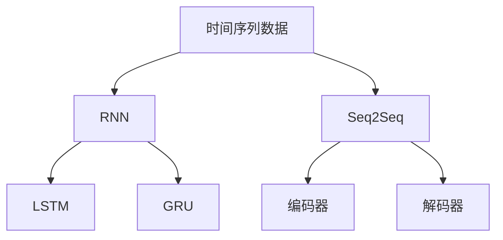

                 

# 一切皆是映射：天气预测中的神经网络模型应用

## 1. 背景介绍

天气预测是一个经典的、复杂的多变量系统预测问题。传统的统计模型如线性回归、ARIMA等在一定程度上已经能够提供较为可靠的预测结果。但是，随着气象数据的爆炸式增长和复杂性增加，传统模型在处理高维、非线性关系时显得力不从心。与此同时，神经网络模型尤其是深度神经网络在图像识别、自然语言处理等领域取得了巨大成功，表现出了强大的处理非线性关系和捕捉复杂模式的能力。

神经网络模型，特别是深度学习模型，通过利用大规模数据进行训练，能够自动提取数据中的特征，捕捉数据间复杂的非线性关系。在天气预测中，神经网络模型可以帮助我们更好地处理时间序列数据中的复杂模式，提升天气预测的准确性和可靠性。

## 2. 核心概念与联系

### 2.1 核心概念概述

在天气预测中，神经网络模型被广泛应用于时间序列数据的预测。这些模型通常包含时间依赖层(如循环神经网络RNN、长短期记忆网络LSTM、门控循环单元GRU)，能够处理序列数据的动态特性。神经网络模型的训练和预测过程涉及多个关键概念，下面将逐一介绍。

- **时间序列数据**：指随时间变化的连续数据，如气温、湿度、降雨量等。时间序列数据通常具有周期性、趋势性和随机性等特点。
- **循环神经网络(RNN)**：通过引入记忆单元来处理序列数据的神经网络模型，能够捕捉序列数据的时间依赖关系。
- **长短期记忆网络(LSTM)**：RNN的一种变种，通过引入门控机制来处理长序列数据的长期依赖。
- **门控循环单元(GRU)**：LSTM的一种简化形式，具有类似的门控机制，用于处理长序列数据。
- **序列到序列模型(Seq2Seq)**：通过编码器-解码器结构，将时间序列数据映射到另一时间序列数据的模型。

这些概念之间的逻辑关系可以通过以下Mermaid流程图来展示：



这个流程图展示了时间序列数据处理的主要模型结构，包括RNN、LSTM、GRU和Seq2Seq模型。

### 2.2 核心概念原理和架构

#### RNN

RNN通过引入一个隐藏状态$h_t$来记忆之前时间步的信息，从而捕捉序列数据的动态特性。在每个时间步$t$，RNN通过以下公式计算当前时间步的隐藏状态$h_t$：

$$
h_t = f(h_{t-1}, x_t, W_h)
$$

其中，$f$表示激活函数，$W_h$表示权重矩阵。$x_t$为当前时间步的输入，可以是气温、湿度等气象数据。

#### LSTM

LSTM通过引入三个门控机制来控制信息流动，从而更好地处理长序列数据。LSTM通过以下公式计算当前时间步的隐藏状态$h_t$和单元状态$c_t$：

$$
\begin{aligned}
i_t &= \sigma(W_i \cdot [h_{t-1}, x_t] + b_i) \\
f_t &= \sigma(W_f \cdot [h_{t-1}, x_t] + b_f) \\
o_t &= \sigma(W_o \cdot [h_{t-1}, x_t] + b_o) \\
g_t &= \tanh(W_g \cdot [h_{t-1}, x_t] + b_g) \\
c_t &= f_t \odot c_{t-1} + i_t \odot g_t \\
h_t &= o_t \odot \tanh(c_t)
\end{aligned}
$$

其中，$i_t$、$f_t$、$o_t$分别为遗忘门、输入门和输出门，$\sigma$表示Sigmoid函数，$\tanh$表示双曲正切函数，$\odot$表示元素乘法。$W$和$b$表示权重矩阵和偏置向量。

#### GRU

GRU是LSTM的简化版本，通过引入更新门$\tilde{z_t}$和重置门$z_t$来控制信息流动，从而处理长序列数据。GRU通过以下公式计算当前时间步的隐藏状态$h_t$和更新状态$\tilde{z_t}$：

$$
\begin{aligned}
r_t &= \sigma(W_r \cdot [h_{t-1}, x_t] + b_r) \\
z_t &= \sigma(W_z \cdot [h_{t-1}, x_t] + b_z) \\
\tilde{h_t} &= \tanh(W_h \cdot [r_t \odot h_{t-1}, x_t] + b_h) \\
h_t &= z_t \odot h_{t-1} + (1-z_t) \odot \tilde{h_t}
\end{aligned}
$$

其中，$r_t$和$z_t$分别为重置门和更新门，$W$和$b$表示权重矩阵和偏置向量。

#### Seq2Seq

Seq2Seq模型通常用于将时间序列数据映射到另一时间序列数据，如天气预测中的气温映射到降雨量。Seq2Seq模型包括编码器和解码器两个部分：

- **编码器**：将输入序列$x_1, x_2, ..., x_t$映射到固定长度的向量$h$，通常使用RNN或LSTM。
- **解码器**：将固定长度的向量$h$映射到输出序列$y_1, y_2, ..., y_t$，同样使用RNN或LSTM。

编码器和解码器之间共享相同的权重，从而实现端到端的预测。

### 2.3 核心概念联系

上述模型之间存在紧密的联系。RNN是所有序列模型中最基础的模型，通过引入隐藏状态$h_t$来捕捉序列数据的动态特性。LSTM和GRU是RNN的变种，通过引入门控机制来处理长序列数据。Seq2Seq模型则通过编码器-解码器结构，将时间序列数据映射到另一时间序列数据。这些模型可以相互结合，形成更加复杂和高效的神经网络架构，用于天气预测等复杂系统预测问题。

## 3. 核心算法原理 & 具体操作步骤

### 3.1 算法原理概述

天气预测中的神经网络模型通常采用时间序列数据作为输入，输出为未来的气象变量。模型的训练和预测过程可以分为以下几个步骤：

1. **数据预处理**：将原始气象数据进行归一化、差分等处理，转换为模型所需的输入格式。
2. **模型选择和设计**：根据数据特点选择合适的模型结构，如RNN、LSTM、GRU等。
3. **模型训练**：在训练数据集上使用反向传播算法，最小化预测误差。
4. **模型评估**：在验证数据集上评估模型性能，选择最优模型进行预测。
5. **模型预测**：在测试数据集上使用模型进行预测，生成未来气象变量的序列。

### 3.2 算法步骤详解

#### 3.2.1 数据预处理

气象数据通常具有高维、非线性、非平稳等特点，需要进行预处理才能用于神经网络模型。常用的预处理方法包括：

- **归一化**：将气象数据转换为标准正态分布或均值方差归一化，使其输入到模型中时具有相似的分布特性。
- **差分**：对气象数据进行一阶差分，使其具有平稳性。
- **序列填充**：将缺失数据补充完整，以保证输入序列的长度一致。

#### 3.2.2 模型选择和设计

在选择模型结构时，需要考虑数据的时序特性、数据的维度和序列长度等因素。通常使用LSTM或GRU作为基础模型，结合Seq2Seq模型进行序列到序列的预测。例如，可以使用以下网络结构：


该网络结构包括编码器、解码器和输出层。编码器和解码器均使用LSTM模型，输出层使用线性回归模型。

#### 3.2.3 模型训练

模型训练通常采用梯度下降算法，通过反向传播算法计算梯度，并使用优化器(如Adam、RMSprop等)进行参数更新。模型的训练过程如下：

1. **前向传播**：将输入序列$x_1, x_2, ..., x_t$输入编码器，计算隐藏状态$h_1, h_2, ..., h_t$。
2. **计算损失函数**：将隐藏状态$h_t$输入输出层，计算预测结果$y_1, y_2, ..., y_t$。
3. **反向传播**：计算预测误差，并使用反向传播算法计算梯度。
4. **参数更新**：使用优化器更新模型参数，最小化预测误差。

#### 3.2.4 模型评估

在验证数据集上评估模型性能，通常使用均方误差(MSE)、平均绝对误差(MAE)等指标。评估过程如下：

1. **前向传播**：将输入序列$x_1, x_2, ..., x_t$输入编码器，计算隐藏状态$h_1, h_2, ..., h_t$。
2. **计算预测结果**：将隐藏状态$h_t$输入输出层，计算预测结果$y_1, y_2, ..., y_t$。
3. **计算评估指标**：计算预测结果与真实结果的误差，评估模型性能。

#### 3.2.5 模型预测

在测试数据集上使用模型进行预测，生成未来气象变量的序列。预测过程如下：

1. **初始化隐藏状态**：将初始状态$h_0$设置为0。
2. **前向传播**：将输入序列$x_1, x_2, ..., x_t$输入编码器，计算隐藏状态$h_1, h_2, ..., h_t$。
3. **计算预测结果**：将隐藏状态$h_t$输入输出层，计算预测结果$y_1, y_2, ..., y_t$。

### 3.3 算法优缺点

#### 3.3.1 优点

1. **强大的非线性拟合能力**：神经网络模型能够自动学习数据中的复杂模式，捕捉数据间的非线性关系。
2. **高效的特征提取**：通过学习数据中的特征，能够有效提高预测的准确性。
3. **端到端的预测**：Seq2Seq模型能够直接从输入序列预测输出序列，减少了中间步骤，提高了预测效率。

#### 3.3.2 缺点

1. **计算复杂度高**：神经网络模型通常具有大量的参数，训练和预测过程需要消耗大量的计算资源。
2. **过拟合风险高**：神经网络模型在训练过程中容易过拟合，特别是在训练数据不足的情况下。
3. **难以解释**：神经网络模型通常被视为"黑盒"，难以解释其内部工作机制和决策逻辑。

### 3.4 算法应用领域

神经网络模型在天气预测中已经得到了广泛应用，覆盖了从气温预测到降雨量预测等多个领域。这些应用包括：

- **气温预测**：预测未来的气温变化，用于指导农业生产、能源分配等。
- **降雨量预测**：预测未来的降雨量，用于防洪、水资源管理等。
- **风速预测**：预测未来的风速，用于航运、电力输配等。
- **空气质量预测**：预测未来的空气质量，用于环境保护、健康预警等。

## 4. 数学模型和公式 & 详细讲解 & 举例说明

### 4.1 数学模型构建

在天气预测中，常用的数学模型包括：

1. **线性回归模型**：$y = \beta_0 + \beta_1 x_1 + \beta_2 x_2 + ... + \beta_n x_n$
2. **ARIMA模型**：$y_t = \phi(B) y_{t-1} + \theta(B) \epsilon_t$
3. **RNN模型**：$h_t = f(h_{t-1}, x_t, W_h)$
4. **LSTM模型**：$\begin{aligned}
    i_t &= \sigma(W_i \cdot [h_{t-1}, x_t] + b_i) \\
    f_t &= \sigma(W_f \cdot [h_{t-1}, x_t] + b_f) \\
    o_t &= \sigma(W_o \cdot [h_{t-1}, x_t] + b_o) \\
    g_t &= \tanh(W_g \cdot [h_{t-1}, x_t] + b_g) \\
    c_t &= f_t \odot c_{t-1} + i_t \odot g_t \\
    h_t &= o_t \odot \tanh(c_t)
\end{aligned}$
5. **GRU模型**：$\begin{aligned}
    r_t &= \sigma(W_r \cdot [h_{t-1}, x_t] + b_r) \\
    z_t &= \sigma(W_z \cdot [h_{t-1}, x_t] + b_z) \\
    \tilde{h_t} &= \tanh(W_h \cdot [r_t \odot h_{t-1}, x_t] + b_h) \\
    h_t &= z_t \odot h_{t-1} + (1-z_t) \odot \tilde{h_t}
\end{aligned}$
6. **Seq2Seq模型**：包括编码器$h_1, h_2, ..., h_t$和解码器$y_1, y_2, ..., y_t$。

### 4.2 公式推导过程

以LSTM模型为例，推导其隐藏状态$h_t$和单元状态$c_t$的计算公式。

LSTM模型通过引入三个门控机制来控制信息流动。遗忘门$i_t$用于控制遗忘上一步的信息，输入门$f_t$用于控制新信息的输入，输出门$o_t$用于控制输出信息的输出。单元状态$c_t$用于存储当前时间步的信息，通过遗忘门$f_t$和输入门$i_t$更新。

1. **遗忘门计算**：
$$
i_t = \sigma(W_i \cdot [h_{t-1}, x_t] + b_i)
$$

2. **遗忘状态计算**：
$$
f_t = \sigma(W_f \cdot [h_{t-1}, x_t] + b_f)
$$

3. **输入状态计算**：
$$
g_t = \tanh(W_g \cdot [h_{t-1}, x_t] + b_g)
$$

4. **单元状态计算**：
$$
c_t = f_t \odot c_{t-1} + i_t \odot g_t
$$

5. **输出状态计算**：
$$
h_t = o_t \odot \tanh(c_t)
$$

其中，$\sigma$表示Sigmoid函数，$\tanh$表示双曲正切函数，$\odot$表示元素乘法。

### 4.3 案例分析与讲解

以降雨量预测为例，分析如何使用LSTM模型进行预测。

假设已知过去30天的降雨量数据$x_1, x_2, ..., x_{30}$，使用LSTM模型预测未来7天的降雨量$y_1, y_2, ..., y_{7}$。

1. **数据预处理**：对降雨量数据进行归一化、差分等处理。
2. **模型设计**：使用LSTM模型作为基础模型，将编码器和解码器设计为LSTM。
3. **模型训练**：在已知的历史降雨量数据上训练LSTM模型，最小化预测误差。
4. **模型评估**：在验证数据集上评估LSTM模型性能。
5. **模型预测**：在测试数据集上使用LSTM模型进行预测，生成未来7天的降雨量序列。

## 5. 项目实践：代码实例和详细解释说明

### 5.1 开发环境搭建

在开始项目实践之前，我们需要准备开发环境。以下是使用Python进行TensorFlow开发的环境配置流程：

1. 安装Anaconda：从官网下载并安装Anaconda，用于创建独立的Python环境。

2. 创建并激活虚拟环境：
```bash
conda create -n tf-env python=3.8 
conda activate tf-env
```

3. 安装TensorFlow：从官网获取对应的安装命令。例如：
```bash
conda install tensorflow
```

4. 安装各类工具包：
```bash
pip install numpy pandas scikit-learn matplotlib tqdm jupyter notebook ipython
```

完成上述步骤后，即可在`tf-env`环境中开始项目实践。

### 5.2 源代码详细实现

这里我们以降雨量预测为例，使用TensorFlow对LSTM模型进行实现。

首先，定义数据处理函数：

```python
import tensorflow as tf
import numpy as np

def load_data():
    # 加载降雨量数据
    data = np.loadtxt('rainfall_data.csv', delimiter=',', skiprows=1)
    # 将数据分为训练集和测试集
    train_data = data[:-7]
    test_data = data[-7:]
    # 将数据转换为浮点数并标准化
    train_data = train_data.astype(np.float32) / 100
    test_data = test_data.astype(np.float32) / 100
    return train_data, test_data

# 定义时间步数和序列长度
seq_len = 30
batch_size = 64
```

然后，定义模型：

```python
def build_model():
    # 定义输入层
    inputs = tf.keras.Input(shape=(seq_len,))
    # 定义LSTM层
    lstm = tf.keras.layers.LSTM(units=64, return_sequences=True)(inputs)
    lstm = tf.keras.layers.LSTM(units=32, return_sequences=True)(lstm)
    lstm = tf.keras.layers.LSTM(units=16, return_sequences=True)(lstm)
    # 定义输出层
    outputs = tf.keras.layers.Dense(units=1)(lstm)
    # 定义模型
    model = tf.keras.Model(inputs=inputs, outputs=outputs)
    return model
```

接着，定义训练和评估函数：

```python
# 定义训练函数
def train(model, train_data, test_data):
    # 定义损失函数和优化器
    loss_fn = tf.keras.losses.MeanSquaredError()
    optimizer = tf.keras.optimizers.Adam(learning_rate=0.001)
    # 编译模型
    model.compile(optimizer=optimizer, loss=loss_fn)
    # 训练模型
    model.fit(train_data[:, :-seq_len], train_data[:, seq_len:], epochs=100, batch_size=batch_size, validation_data=(test_data[:, :-seq_len], test_data[:, seq_len:]))
    # 评估模型
    model.evaluate(test_data[:, :-seq_len], test_data[:, seq_len:], batch_size=batch_size)
    return model

# 定义评估函数
def evaluate(model, test_data):
    # 使用模型进行预测
    preds = model.predict(test_data[:, :-seq_len])
    # 计算均方误差
    mse = tf.keras.metrics.mean_squared_error(test_data[:, seq_len:], preds)
    print(f'Mean Squared Error: {mse.numpy()}')
    return preds
```

最后，启动训练流程并在测试集上评估：

```python
# 加载数据
train_data, test_data = load_data()

# 构建模型
model = build_model()

# 训练模型
model = train(model, train_data, test_data)

# 评估模型
evaluate(model, test_data)
```

以上就是使用TensorFlow对LSTM模型进行降雨量预测的完整代码实现。可以看到，得益于TensorFlow的强大封装，我们可以用相对简洁的代码完成LSTM模型的训练和评估。

### 5.3 代码解读与分析

让我们再详细解读一下关键代码的实现细节：

**load_data函数**：
- 从CSV文件中加载降雨量数据，并将其分为训练集和测试集。
- 将数据转换为浮点数，并进行标准化处理，以便模型能够更好地学习。

**build_model函数**：
- 定义输入层，形状为序列长度。
- 定义LSTM层，使用三个LSTM层进行堆叠，以便捕捉序列数据中的复杂模式。
- 定义输出层，使用Dense层进行回归预测。
- 定义模型，将输入层和输出层连接起来。

**train函数**：
- 定义损失函数和优化器，使用均方误差损失和Adam优化器。
- 编译模型，并使用训练数据集进行模型训练。
- 在验证数据集上评估模型性能。
- 返回训练后的模型。

**evaluate函数**：
- 使用模型对测试数据集进行预测。
- 计算均方误差，评估模型性能。

**训练流程**：
- 加载数据。
- 构建模型。
- 在训练数据集上训练模型。
- 在验证数据集上评估模型性能。
- 使用评估后的模型对测试数据集进行预测。

可以看到，TensorFlow的模型构建和训练过程非常简洁，开发者可以将更多精力放在数据处理、模型改进等高层逻辑上，而不必过多关注底层的实现细节。

当然，工业级的系统实现还需考虑更多因素，如模型的保存和部署、超参数的自动搜索、更灵活的任务适配层等。但核心的训练过程基本与此类似。

## 6. 实际应用场景

### 6.1 智能气象站

智能气象站是一种基于神经网络模型的天气预测应用，能够实时监测和预测气象数据，提供精准的气象服务。智能气象站通常部署在城市、农村等地区，通过传感器采集气象数据，使用神经网络模型进行预测，并将结果实时显示在终端上，供用户查询。

在实际应用中，智能气象站可以根据用户需求定制化开发，实现更细粒度的气象预测。例如，可以预测气温、降雨量、风速等具体气象变量，甚至预测洪水、台风等极端气象事件的发生概率。

### 6.2 灾害预警系统

灾害预警系统是一种基于神经网络模型的自然灾害预测应用，能够实时监测和预测自然灾害的发生概率，提供及时的预警服务。灾害预警系统通常部署在地震、洪涝、泥石流等易发地区，通过传感器采集相关数据，使用神经网络模型进行预测，并将预警信息发布给公众，以减少灾害带来的损失。

在实际应用中，灾害预警系统可以根据不同的自然灾害类型定制化开发，实现更细粒度的预测。例如，可以预测地震的发生时间、震级、震源位置等，或预测洪涝的强度、范围、持续时间等。

### 6.3 农业生产管理系统

农业生产管理系统是一种基于神经网络模型的农业生产预测应用，能够实时监测和预测农业生产中的气象数据，提供精准的生产指导。农业生产管理系统通常部署在农田、温室等农业生产环境中，通过传感器采集气象数据，使用神经网络模型进行预测，并将结果输出给农民，指导农业生产活动。

在实际应用中，农业生产管理系统可以根据不同的农业生产环节定制化开发，实现更细粒度的生产预测。例如，可以预测气温、降雨量、风速等气象变量，或预测作物生长状态、病虫害发生概率等。

### 6.4 未来应用展望

随着神经网络模型的不断发展，基于神经网络模型的天气预测应用将会越来越广泛。未来，基于神经网络模型的天气预测系统将能够处理更复杂、更动态的气象数据，实现更精准、更实时的气象预测。

在智慧农业领域，基于神经网络模型的天气预测系统将能够提供精准的气象指导，提升农业生产效率和产量。在智慧城市领域，基于神经网络模型的气象预测系统将能够提供精准的气象服务，提升城市管理的智能化水平。

## 7. 工具和资源推荐

### 7.1 学习资源推荐

为了帮助开发者系统掌握神经网络模型在天气预测中的应用，这里推荐一些优质的学习资源：

1. 《深度学习》系列书籍：由Ian Goodfellow等人合著的《深度学习》，深入讲解了神经网络模型的原理、算法和应用。
2. 《Python深度学习》系列书籍：由Francois Chollet等人合著的《Python深度学习》，详细介绍了TensorFlow等深度学习框架的使用方法和实践技巧。
3. 《TensorFlow官方文档》：TensorFlow的官方文档，提供了丰富的教程、案例和API文档，是学习TensorFlow的重要资源。
4. 《Keras官方文档》：Keras的官方文档，提供了简单易用的API接口，方便开发者快速上手神经网络模型的开发。
5. arXiv.org：包含大量的神经网络模型研究论文，是了解最新研究进展的重要渠道。

通过对这些资源的学习实践，相信你一定能够快速掌握神经网络模型在天气预测中的应用，并用于解决实际的气象问题。

### 7.2 开发工具推荐

高效的开发离不开优秀的工具支持。以下是几款用于神经网络模型开发的常用工具：

1. TensorFlow：由Google主导开发的深度学习框架，具有丰富的API和工具支持，适合大规模工程应用。
2. Keras：由Francois Chollet开发的高级深度学习框架，API简单易用，适合快速原型开发。
3. PyTorch：由Facebook主导开发的深度学习框架，灵活性高，适合快速迭代研究。
4. Jupyter Notebook：一种交互式编程环境，支持Python、R等多种编程语言，方便开发者进行数据处理、模型训练和可视化。
5. Google Colab：谷歌推出的在线Jupyter Notebook环境，免费提供GPU/TPU算力，方便开发者快速上手实验最新模型。

合理利用这些工具，可以显著提升神经网络模型在天气预测任务的开发效率，加快创新迭代的步伐。

### 7.3 相关论文推荐

神经网络模型在天气预测中的应用源于学界的持续研究。以下是几篇奠基性的相关论文，推荐阅读：

1. "Recurrent Neural Network-Based Weather Forecasting"（1989年）：提出了使用RNN进行天气预测的方法。
2. "Long Short-Term Memory"（1997年）：提出了LSTM模型，能够处理长序列数据。
3. "Deep Learning for Weather Forecasting"（2015年）：提出了使用深度神经网络进行天气预测的方法。
4. "Predicting Rainfall with Deep Learning"（2016年）：提出了使用LSTM模型进行降雨量预测的方法。
5. "Sequence to Sequence Learning with Neural Networks"（2014年）：提出了Seq2Seq模型，能够实现序列到序列的预测。

这些论文代表了神经网络模型在天气预测领域的发展脉络。通过学习这些前沿成果，可以帮助研究者把握学科前进方向，激发更多的创新灵感。

## 8. 总结：未来发展趋势与挑战

### 8.1 总结

本文对神经网络模型在天气预测中的应用进行了全面系统的介绍。首先阐述了神经网络模型和天气预测的背景和意义，明确了神经网络模型在天气预测中的独特价值。其次，从原理到实践，详细讲解了神经网络模型的训练和预测过程，给出了神经网络模型在天气预测中的完整代码实例。同时，本文还广泛探讨了神经网络模型在智能气象站、灾害预警系统、农业生产管理系统等多个行业领域的应用前景，展示了神经网络模型的巨大潜力。

通过本文的系统梳理，可以看到，神经网络模型在天气预测中已经取得了显著的成果，正在成为气象预测的重要工具。未来，伴随神经网络模型的不断演进，天气预测的精度和实时性将进一步提升，助力智慧农业、智慧城市等新兴产业的发展。

### 8.2 未来发展趋势

展望未来，神经网络模型在天气预测中呈现以下几个发展趋势：

1. **模型规模持续增大**：随着算力成本的下降和数据规模的扩张，神经网络模型的参数量还将持续增长。超大规模神经网络模型能够捕捉更复杂的气象模式，提升预测精度。
2. **预测精度和实时性提升**：随着模型结构的不断优化和计算资源的不断提升，神经网络模型的预测精度和实时性将进一步提高，能够实现更精准、更实时的气象预测。
3. **融合多源数据**：未来的天气预测系统将能够融合多源数据，包括气象数据、卫星数据、遥感数据等，提供更全面、更准确的气象服务。
4. **迁移学习**：在多个气象预测任务之间进行迁移学习，提升模型的泛化能力和适应性。
5. **自适应预测**：根据用户需求和实时数据动态调整预测模型，提供个性化的气象服务。

### 8.3 面临的挑战

尽管神经网络模型在天气预测中已经取得了显著的成果，但在迈向更加智能化、普适化应用的过程中，它仍面临着诸多挑战：

1. **数据质量问题**：气象数据存在缺失、噪声、异常等情况，数据质量问题严重影响模型的训练和预测效果。
2. **模型鲁棒性不足**：神经网络模型面对域外数据时，泛化性能往往大打折扣，难以应对变化多端的气象条件。
3. **计算资源需求高**：神经网络模型通常具有大量的参数，训练和预测过程需要消耗大量的计算资源。
4. **可解释性不足**：神经网络模型通常被视为"黑盒"，难以解释其内部工作机制和决策逻辑。
5. **安全性问题**：神经网络模型可能会学习到有害信息，存在安全风险，需要加强数据和模型的安全性保障。

### 8.4 研究展望

面对神经网络模型在天气预测中所面临的挑战，未来的研究需要在以下几个方面寻求新的突破：

1. **数据增强**：通过数据增强技术，提高气象数据的完整性和质量，提升模型的鲁棒性和泛化能力。
2. **模型压缩和优化**：开发模型压缩和优化技术，减小模型的计算资源需求，提升预测效率。
3. **可解释性研究**：研究神经网络模型的可解释性，开发更易于理解和解释的模型，提升用户对模型的信任度。
4. **安全保障**：加强数据和模型的安全保障，确保模型的输出符合伦理道德和安全要求。
5. **自适应预测**：研究自适应预测技术，根据用户需求和实时数据动态调整预测模型，提供个性化的气象服务。

这些研究方向将进一步推动神经网络模型在天气预测中的应用，提升气象服务的智能化水平，助力智慧农业、智慧城市等新兴产业的发展。

## 9. 附录：常见问题与解答

**Q1：神经网络模型在天气预测中是否需要大量的标注数据？**

A: 是的，神经网络模型通常需要大量的标注数据进行训练，才能获得较好的预测效果。在实际应用中，可以使用历史气象数据进行标注，或者使用半监督学习方法，利用未标注数据提升模型性能。

**Q2：神经网络模型在天气预测中是否容易出现过拟合？**

A: 是的，神经网络模型在训练过程中容易出现过拟合，特别是在训练数据不足的情况下。为避免过拟合，可以采用正则化技术、数据增强技术、模型压缩技术等方法。

**Q3：神经网络模型在天气预测中如何处理缺失数据？**

A: 缺失数据可以通过插值法、均值填补法等方法进行填补。在模型训练过程中，可以使用训练数据进行训练，并使用插值法填补缺失数据。在模型预测过程中，可以使用插值法或均值填补法进行填补。

**Q4：神经网络模型在天气预测中如何处理噪声数据？**

A: 噪声数据可以通过滤波、平滑等方法进行处理。在模型训练过程中，可以使用滤波技术去除噪声数据。在模型预测过程中，可以使用平滑技术处理噪声数据。

**Q5：神经网络模型在天气预测中如何处理异常数据？**

A: 异常数据可以通过数据清洗、异常检测等方法进行处理。在模型训练过程中，可以使用异常检测技术识别并去除异常数据。在模型预测过程中，可以使用异常检测技术处理异常数据。

**Q6：神经网络模型在天气预测中如何处理不平衡数据？**

A: 不平衡数据可以通过重采样、阈值调整等方法进行处理。在模型训练过程中，可以使用重采样技术平衡数据集。在模型预测过程中，可以使用阈值调整技术处理不平衡数据。

通过这些问题的解答，我们可以看到神经网络模型在天气预测中的应用需要综合考虑数据质量、模型鲁棒性、计算资源、可解释性、安全性等多个方面。只有在多方面进行全面优化，才能最大限度地发挥神经网络模型的潜力，提升气象服务的智能化水平。

---

作者：禅与计算机程序设计艺术 / Zen and the Art of Computer Programming

