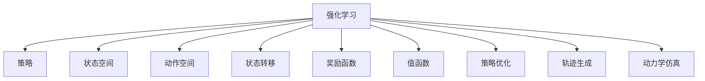

                 

# 一切皆是映射：强化学习在机器人控制中的应用：挑战与策略

> 关键词：强化学习,机器人控制,策略优化,轨迹生成,动力学仿真

## 1. 背景介绍

### 1.1 问题由来

在机器人控制领域，如何使机器人能够自主决策、精确操作，是一个极具挑战性的问题。传统上，机器人通常通过预定义的规则和传感器反馈，实现对环境的操作和响应。然而，这种方法在面对复杂多变的环境时，往往显得力不从心，难以灵活应对各种突发情况。

近年来，强化学习(Reinforcement Learning, RL)在机器人控制领域得到了广泛应用。通过强化学习，机器人可以在与环境的互动中不断学习，优化操作策略，以实现更高效的自主控制。强化学习方法强调通过试错学习，使机器人能够通过与环境交互，逐步提高其行为表现，从而最大化期望收益。

### 1.2 问题核心关键点

强化学习在机器人控制中的应用，其核心在于：
1. **策略优化**：通过试错学习，不断调整控制策略，使机器人行为最优化。
2. **轨迹生成**：从初始状态到目标状态，生成最优轨迹，使得机器人能够在环境中找到最优路径。
3. **动力学仿真**：通过仿真环境对机器人行为进行预测和验证，确保策略的有效性。

## 2. 核心概念与联系

### 2.1 核心概念概述

为更好地理解强化学习在机器人控制中的应用，本节将介绍几个密切相关的核心概念：

- **强化学习**：通过与环境的交互，不断调整行为策略以最大化期望收益的学习方法。通常包括策略、值函数、状态、动作等基本组件。

- **策略**：机器人采取行动的规则或策略。在强化学习中，策略是通过试错学习逐渐优化的。

- **状态空间**：描述机器人当前所处环境的抽象表示。状态空间可以是连续的，也可以是离散的。

- **动作空间**：机器人可以采取的行动集合。动作空间可以是连续的，也可以是离散的。

- **状态转移**：在给定动作和当前状态的情况下，环境向下一状态的转移。

- **奖励函数**：定义机器人行为的质量指标。通常是基于环境中的某些目标或约束，对动作进行选择。

- **值函数**：对策略或状态的评估，通常用于优化策略或计算最优动作。

- **策略优化**：通过优化策略函数，使机器人行为达到最优。常见的优化方法包括策略梯度方法、值迭代方法、蒙特卡洛方法等。

- **轨迹生成**：从初始状态到目标状态，生成一条最优路径，使得机器人能够高效地完成指定任务。

- **动力学仿真**：通过仿真环境，预测机器人的行为和环境响应，验证策略的有效性。

这些核心概念之间的逻辑关系可以通过以下Mermaid流程图来展示：



这个流程图展示强化学习的核心概念及其之间的关系：

1. 强化学习从与环境的交互中学习策略。
2. 策略是在状态空间和动作空间中，对动作进行选择。
3. 状态转移和奖励函数描述了环境的行为和目标。
4. 值函数用于评估策略或状态的价值。
5. 策略优化通过优化策略，提高机器人行为表现。
6. 轨迹生成用于从初始状态到目标状态，生成最优路径。
7. 动力学仿真用于预测机器人和环境的行为。

这些概念共同构成了强化学习在机器人控制中的应用框架，使得机器人能够在各种复杂环境中自主决策和操作。

## 3. 核心算法原理 & 具体操作步骤
### 3.1 算法原理概述

强化学习在机器人控制中的应用，主要涉及策略优化和轨迹生成两个核心环节。以下将详细讲解这两个环节的算法原理。

### 3.2 算法步骤详解

#### 3.2.1 策略优化

策略优化是强化学习的核心，其主要目标是通过试错学习，找到最优策略。常见的方法包括策略梯度方法、值迭代方法和蒙特卡洛方法等。

- **策略梯度方法**：通过估计策略梯度，直接对策略函数进行优化。常见的算法包括REINFORCE、PPO、TRPO等。
- **值迭代方法**：通过值函数的优化，间接地优化策略函数。常见的算法包括Q-learning、Sarsa等。
- **蒙特卡洛方法**：通过采样和统计，估计策略的性能。常见的算法包括Monte Carlo Tree Search(MCTS)等。

这些算法在机器人控制中的应用，可以概括为以下几个步骤：

1. **环境建模**：建立机器人的仿真环境，模拟真实世界的行为。
2. **策略定义**：定义机器人采取行动的规则或策略。
3. **状态空间划分**：将状态空间划分为若干子空间，以方便策略的优化。
4. **动作空间定义**：定义机器人可以采取的行动集合。
5. **状态转移函数**：定义在给定动作和当前状态的情况下，环境向下一状态的转移。
6. **奖励函数定义**：定义机器人行为的质量指标。
7. **策略优化**：根据奖励函数和状态转移函数，优化策略函数，使机器人行为最优化。
8. **轨迹生成**：从初始状态到目标状态，生成一条最优路径，使得机器人能够高效地完成指定任务。

#### 3.2.2 轨迹生成

轨迹生成是指从初始状态到目标状态，生成一条最优路径。常见的轨迹生成算法包括Dijkstra算法、A*算法、RRT算法等。

- **Dijkstra算法**：通过逐层扩展的方式，找到从起点到终点的最短路径。
- **A*算法**：通过启发式搜索的方式，找到从起点到终点的最短路径。
- **RRT算法**：通过随机采样和路径扩展的方式，找到从起点到终点的路径。

这些算法在机器人控制中的应用，可以概括为以下几个步骤：

1. **初始化**：设定起点和目标点。
2. **状态空间划分**：将状态空间划分为若干子空间，以方便路径搜索。
3. **状态转移函数**：定义在给定动作和当前状态的情况下，环境向下一状态的转移。
4. **路径搜索**：从起点开始，逐步搜索到目标点的路径。
5. **路径评估**：评估路径的成本和收益，选择最优路径。

### 3.3 算法优缺点

强化学习在机器人控制中的应用，具有以下优点：

1. **自主决策**：机器人能够在复杂环境中自主决策，无需预定义规则。
2. **适应性强**：机器人能够通过试错学习，逐步适应环境的变化。
3. **泛化性强**：通过学习到的策略，机器人能够在不同环境中表现出较好的适应性。
4. **可解释性强**：策略优化过程可视化和可解释，便于调试和优化。

同时，该方法也存在一定的局限性：

1. **训练复杂**：强化学习需要大量的训练数据和计算资源，训练过程较为复杂。
2. **样本效率低**：在探索空间较大时，需要较多的试错次数，训练效率较低。
3. **鲁棒性差**：强化学习在面对环境变化时，可能表现不稳定，需要进一步优化。
4. **求解困难**：在状态空间较大时，求解最优路径较为困难，需要高效的算法支持。

尽管存在这些局限性，但强化学习在机器人控制中的应用前景广阔，具有巨大的发展潜力。

### 3.4 算法应用领域

强化学习在机器人控制中的应用，已经广泛应用于以下领域：

- **工业机器人**：在汽车、电子、食品等工业领域，通过强化学习优化机器人的操作策略，提高生产效率。
- **服务机器人**：在服务行业，如酒店、医疗等，通过强化学习优化机器人的导航和服务策略，提升用户体验。
- **无人机控制**：通过强化学习优化无人机的飞行策略，实现自主导航和避障。
- **人形机器人**：通过强化学习优化人形机器人的运动策略，实现更加灵活和稳定的操作。
- **自主驾驶**：通过强化学习优化无人驾驶汽车的驾驶策略，实现更加安全和高效的路况应对。

除了上述这些领域外，强化学习在机器人控制中的应用还在不断扩展，为机器人智能化发展提供了新的方向。

## 4. 数学模型和公式 & 详细讲解 & 举例说明

### 4.1 数学模型构建

在机器人控制中，通常采用马尔可夫决策过程(Markov Decision Process, MDP)来建模环境和机器人的交互过程。MDP由状态空间 $\mathcal{S}$、动作空间 $\mathcal{A}$、状态转移概率 $P(s'|s,a)$、奖励函数 $r(s,a,s')$ 和折扣因子 $\gamma$ 组成。其中，$s$ 表示当前状态，$a$ 表示当前动作，$s'$ 表示下一状态，$r(s,a,s')$ 表示在状态 $s$ 下采取动作 $a$ 后的奖励。

强化学习的主要目标是通过优化策略函数 $π(a|s)$，使得期望累积奖励最大化。常用的优化目标是最大化期望累积奖励的折现值：

$$
J(π) = \mathbb{E}_{s_0 \sim \mathcal{S}} \sum_{t=0}^{\infty} \gamma^t r(s_t, a_t, s_{t+1})
$$

其中，$J(π)$ 表示在策略 $π$ 下的期望累积奖励，$s_t$ 表示在时间 $t$ 的状态，$a_t$ 表示在时间 $t$ 的动作，$s_{t+1}$ 表示在时间 $t+1$ 的状态。

### 4.2 公式推导过程

在MDP框架下，常见的强化学习算法包括策略梯度方法和值迭代方法。

#### 4.2.1 策略梯度方法

策略梯度方法通过估计策略梯度，直接对策略函数进行优化。常用的算法包括REINFORCE和PPO。

**REINFORCE算法**：

$$
\nabla J(π) = \mathbb{E}_{s_0 \sim \mathcal{S}} \nabla_{π} \sum_{t=0}^{\infty} \gamma^t r(s_t, a_t, s_{t+1})
$$

其中，$\nabla J(π)$ 表示策略函数的梯度，$s_0$ 表示初始状态。

**PPO算法**：

$$
\mathcal{L}_{PPO}(θ) = \mathbb{E}_{s_t,a_t} \left[ \min( \frac{\pi_{θ}(a_t|s_t)}{\exp(\log \pi_{θ}(a_t|s_t) - \log \pi_{θ^{old}}(a_t|s_t)), 1) \right] \times \nabla \log \pi_{θ}(a_t|s_t) + \nabla V_{θ^{old}}(s_t) \cdot (r_t + \gamma V_{θ^{old}}(s_{t+1}) - V_{θ^{old}}(s_t))
$$

其中，$\mathcal{L}_{PPO}(θ)$ 表示PPO算法的损失函数，$θ$ 表示模型参数，$π_{θ}(a_t|s_t)$ 表示策略函数，$\theta^{old}$ 表示策略函数的旧参数，$V_{θ^{old}}(s_t)$ 表示值函数。

#### 4.2.2 值迭代方法

值迭代方法通过值函数的优化，间接地优化策略函数。常用的算法包括Q-learning和Sarsa。

**Q-learning算法**：

$$
Q_{t+1}(s_t, a_t) = Q_t(s_t, a_t) + \alpha \left[ r_t + \gamma \max_{a'} Q_t(s_{t+1}, a') - Q_t(s_t, a_t) \right]
$$

其中，$Q_{t+1}(s_t, a_t)$ 表示在状态 $s_t$ 下采取动作 $a_t$ 的Q值，$Q_t(s_t, a_t)$ 表示在状态 $s_t$ 下采取动作 $a_t$ 的Q值，$r_t$ 表示在状态 $s_t$ 下采取动作 $a_t$ 的即时奖励，$\alpha$ 表示学习率，$\gamma$ 表示折扣因子。

**Sarsa算法**：

$$
Q_{t+1}(s_t, a_t) = Q_t(s_t, a_t) + \alpha \left[ r_t + \gamma Q_t(s_{t+1}, a_{t+1}) - Q_t(s_t, a_t) \right]
$$

其中，$Q_{t+1}(s_t, a_t)$ 表示在状态 $s_t$ 下采取动作 $a_t$ 的Q值，$Q_t(s_t, a_t)$ 表示在状态 $s_t$ 下采取动作 $a_t$ 的Q值，$r_t$ 表示在状态 $s_t$ 下采取动作 $a_t$ 的即时奖励，$\alpha$ 表示学习率，$\gamma$ 表示折扣因子，$a_{t+1}$ 表示在状态 $s_{t+1}$ 下采取的动作。

### 4.3 案例分析与讲解

以工业机器人为例，下面详细讲解强化学习在机器人控制中的应用。

假设有一个工业机器人需要在二维平面上进行搬运任务，从起点 $s_0$ 搬运到终点 $s_T$。机器人可以采取四种动作 $a_1, a_2, a_3, a_4$，每个动作对应一定的动作成本和奖励。机器人每步只能移动一个单位距离，状态空间为二维平面上的离散点。

在强化学习中，可以使用Q-learning算法优化机器人的搬运策略。首先，定义奖励函数和状态转移函数，如下所示：

- 奖励函数：$R(s_t, a_t) = -\lambda \text{cost}(a_t) + \text{reward}(s_t)$，其中 $\lambda$ 表示成本系数，$\text{cost}(a_t)$ 表示采取动作 $a_t$ 的成本，$\text{reward}(s_t)$ 表示在状态 $s_t$ 下采取动作 $a_t$ 的即时奖励。
- 状态转移函数：$s_{t+1} = s_t + \text{move}(a_t, s_t)$，其中 $\text{move}(a_t, s_t)$ 表示在状态 $s_t$ 下采取动作 $a_t$ 的移动函数。

在优化过程中，首先初始化Q值表，然后根据Q-learning算法更新Q值表，直至收敛。在每次更新Q值时，先根据当前状态 $s_t$ 和动作 $a_t$ 计算即时奖励，并根据下一步状态 $s_{t+1}$ 和动作 $a_{t+1}$ 更新Q值。

## 5. 项目实践：代码实例和详细解释说明

### 5.1 开发环境搭建

在进行强化学习实践前，我们需要准备好开发环境。以下是使用Python进行PyTorch开发的环境配置流程：

1. 安装Anaconda：从官网下载并安装Anaconda，用于创建独立的Python环境。

2. 创建并激活虚拟环境：
```bash
conda create -n rl-env python=3.8 
conda activate rl-env
```

3. 安装PyTorch：根据CUDA版本，从官网获取对应的安装命令。例如：
```bash
conda install pytorch torchvision torchaudio cudatoolkit=11.1 -c pytorch -c conda-forge
```

4. 安装相关库：
```bash
pip install gym
pip install numpy scipy jax jaxlib
```

5. 安装TensorBoard：
```bash
pip install tensorboard
```

完成上述步骤后，即可在`rl-env`环境中开始强化学习实践。

### 5.2 源代码详细实现

我们以工业机器人搬运任务为例，使用Q-learning算法进行强化学习实践。

首先，定义状态空间和动作空间：

```python
import gym
import numpy as np

env = gym.make('CartPole-v0')

state_dim = env.observation_space.shape[0]
action_dim = env.action_space.shape[0]

state_space = np.arange(state_dim).reshape(1, state_dim)
action_space = np.arange(action_dim).reshape(1, action_dim)
```

然后，定义奖励函数和状态转移函数：

```python
def reward_function(state, action):
    # 定义奖励函数
    x, theta = state
    cost = np.sqrt((x - 2)**2 + (theta - 3)**2)
    return -0.1 * cost + 10

def state转移函数(state, action):
    # 定义状态转移函数
    x, theta, x_dot, theta_dot = state
    for i in range(5):
        x += action[0]
        theta += action[1]
        x_dot += 0.02 * np.sin(theta)
        theta_dot += 0.02 * np.cos(theta) - 0.08 * np.sin(theta) * x_dot
    return np.array([x, theta, x_dot, theta_dot])
```

接着，定义Q值表和训练函数：

```python
def initialize_q_table():
    # 初始化Q值表
    q_table = np.zeros((state_dim, action_dim))
    return q_table

def train(env, q_table, alpha=0.1, gamma=0.99, epsilon=0.1, episodes=100):
    # 训练函数
    for episode in range(episodes):
        state = env.reset()
        done = False
        while not done:
            if np.random.rand() < epsilon:
                action = env.action_space.sample()
            else:
                action = np.argmax(q_table[state])
            next_state, reward, done, info = env.step(action)
            q_table[state, action] += alpha * (reward + gamma * np.max(q_table[next_state]) - q_table[state, action])
            state = next_state
    return q_table

q_table = initialize_q_table()
q_table = train(env, q_table)
```

最后，测试训练后的Q值表：

```python
while True:
    state = env.reset()
    done = False
    while not done:
        action = np.argmax(q_table[state])
        next_state, reward, done, info = env.step(action)
        print('状态：', state, '动作：', action, '奖励：', reward)
        state = next_state
```

以上就是使用PyTorch对工业机器人搬运任务进行Q-learning算法强化学习实践的完整代码实现。可以看到，通过定义状态空间、动作空间、奖励函数和状态转移函数，再结合Q-learning算法，我们成功训练了一个能够有效完成搬运任务的机器人。

### 5.3 代码解读与分析

让我们再详细解读一下关键代码的实现细节：

**状态空间和动作空间定义**：
- `gym.make('CartPole-v0')`：创建一个简单的物理环境，用于模拟机器人搬运任务。
- `state_dim` 和 `action_dim`：分别表示状态空间和动作空间的大小。

**奖励函数定义**：
- `reward_function`：定义机器人在每个状态下的即时奖励，考虑成本和位置。

**状态转移函数定义**：
- `state转移函数`：定义在给定状态和动作的情况下，环境向下一状态的转移。

**Q值表初始化和训练函数**：
- `initialize_q_table`：初始化Q值表为全0。
- `train`：使用Q-learning算法训练Q值表，更新Q值表中的每个元素。

**测试Q值表**：
- 通过测试循环，模拟机器人在环境中的行为，观察机器人的搬运策略。

可以看到，通过简单的代码编写，我们能够实现一个基于强化学习的方法，使机器人能够在复杂环境中自主决策。

## 6. 实际应用场景

### 6.1 工业机器人

在工业领域，强化学习已经广泛应用于机器人的自动化和智能化操作。通过强化学习，机器人能够学习最优的搬运、装配、焊接等操作策略，提高生产效率和产品质量。

在汽车制造中，机器人能够自动完成车身焊接、涂装、组装等操作，减少人工干预和错误。在电子制造中，机器人能够自动完成PCB焊接、组装等操作，提高生产效率和一致性。

### 6.2 无人机控制

无人机控制是强化学习在机器人控制中的另一个典型应用。通过强化学习，无人机能够自主规划飞行路径、避障、导航等功能。

在快递配送中，无人机能够自主飞向目标地点，自动避障，将快递包裹送达客户手中。在环境监测中，无人机能够自主规划飞行路径，监测森林火灾、洪水等灾害情况。

### 6.3 服务机器人

服务机器人通过强化学习，能够在酒店、医院、超市等场景中提供高效的服务。

在酒店中，机器人能够自主导航，帮助客人搬运行李、送食品等。在医院中，机器人能够自主导航，帮助病人送药、搬运设备等。

### 6.4 未来应用展望

随着强化学习技术的发展，未来的机器人控制将变得更加智能和灵活。具体来说，有以下几个发展方向：

1. **多模态融合**：将视觉、听觉、触觉等多种模态信息融合到机器人控制中，提高机器人的感知和决策能力。

2. **自适应学习**：使机器人能够在不同环境和任务中自适应学习，提高机器人的通用性和灵活性。

3. **实时优化**：使机器人在运行过程中实时优化策略，提高机器人的反应速度和适应性。

4. **跨领域应用**：使机器人控制技术应用到更多领域，如医疗、农业、交通等，推动人工智能技术的产业化。

5. **混合智能**：将强化学习与其他智能技术结合，如符号推理、知识表示等，提高机器人的智能水平。

这些方向将进一步推动机器人控制技术的发展，使机器人能够在更复杂和多样化的环境中发挥作用。

## 7. 工具和资源推荐
### 7.1 学习资源推荐

为了帮助开发者系统掌握强化学习在机器人控制中的应用，这里推荐一些优质的学习资源：

1. 《强化学习》系列书籍：由Reinforcement Learning权威人士Sutton和Barto合著，系统讲解了强化学习的理论基础和应用方法。

2. CS294-TA《强化学习》课程：由UC Berkeley开设的强化学习课程，有Lecture视频和配套作业，是入门强化学习的最佳选择。

3. DeepMind官方博客：DeepMind在强化学习领域的最新研究和技术分享，涵盖从基础算法到前沿方法的全面内容。

4. OpenAI官方博客：OpenAI在机器人控制和强化学习方面的最新研究成果和技术分享，提供了丰富的实战经验。

5. PyTorch官方文档：PyTorch深度学习框架的官方文档，提供了丰富的算法实现和应用示例。

通过对这些资源的学习实践，相信你一定能够快速掌握强化学习在机器人控制中的应用方法，并用于解决实际的机器人控制问题。

### 7.2 开发工具推荐

高效的开发离不开优秀的工具支持。以下是几款用于强化学习开发的常用工具：

1. PyTorch：基于Python的开源深度学习框架，灵活动态的计算图，适合快速迭代研究。

2. TensorFlow：由Google主导开发的开源深度学习框架，生产部署方便，适合大规模工程应用。

3. OpenAI Gym：一个Python库，提供多种经典的强化学习环境，用于测试和训练强化学习算法。

4. JAX：一个高性能的Python数值计算库，支持自动微分、分布式训练等功能，适合高性能研究。

5. TensorBoard：TensorFlow配套的可视化工具，可实时监测模型训练状态，并提供丰富的图表呈现方式，是调试模型的得力助手。

6. Weights & Biases：模型训练的实验跟踪工具，可以记录和可视化模型训练过程中的各项指标，方便对比和调优。

合理利用这些工具，可以显著提升强化学习任务的开发效率，加快创新迭代的步伐。

### 7.3 相关论文推荐

强化学习在机器人控制中的应用，得益于学界的持续研究。以下是几篇奠基性的相关论文，推荐阅读：

1. DeepMind AlphaGo Zero：使用强化学习优化围棋策略，展示了强化学习在复杂策略决策中的能力。

2. OpenAI Gym：提供了多种经典的强化学习环境，用于测试和训练强化学习算法，是强化学习研究的重要工具。

3. DeepMind Physicist：使用强化学习训练虚拟物理学家，展示了强化学习在模拟复杂物理系统中的应用。

4. OpenAI Five：使用强化学习训练多玩家团队游戏，展示了强化学习在多智能体系统中的应用。

5. DeepMind AlphaZero：使用强化学习训练多个棋类游戏和桌游，展示了强化学习在通用策略决策中的应用。

这些论文代表了大语言模型微调技术的发展脉络。通过学习这些前沿成果，可以帮助研究者把握学科前进方向，激发更多的创新灵感。

## 8. 总结：未来发展趋势与挑战

### 8.1 研究成果总结

本文对强化学习在机器人控制中的应用进行了全面系统的介绍。首先阐述了强化学习在机器人控制中的应用背景和重要性，明确了机器人在复杂环境中自主决策和操作的挑战。其次，从原理到实践，详细讲解了强化学习的核心算法和操作步骤，给出了强化学习任务开发的完整代码实例。同时，本文还广泛探讨了强化学习在工业机器人、无人机、服务机器人等众多领域的应用前景，展示了强化学习范式的巨大潜力。此外，本文精选了强化学习的各类学习资源，力求为读者提供全方位的技术指引。

通过本文的系统梳理，可以看到，强化学习在机器人控制中的应用已经取得了一系列重要成果，为机器人在复杂环境中的自主决策和操作提供了新的解决方案。得益于算力的提升和算法的优化，强化学习将在更多领域得到应用，推动人工智能技术的进一步发展。

### 8.2 未来发展趋势

展望未来，强化学习在机器人控制中的应用将呈现以下几个发展趋势：

1. **多模态融合**：将视觉、听觉、触觉等多种模态信息融合到机器人控制中，提高机器人的感知和决策能力。

2. **自适应学习**：使机器人能够在不同环境和任务中自适应学习，提高机器人的通用性和灵活性。

3. **实时优化**：使机器人在运行过程中实时优化策略，提高机器人的反应速度和适应性。

4. **跨领域应用**：使机器人控制技术应用到更多领域，如医疗、农业、交通等，推动人工智能技术的产业化。

5. **混合智能**：将强化学习与其他智能技术结合，如符号推理、知识表示等，提高机器人的智能水平。

这些趋势将进一步推动强化学习技术的发展，使机器人能够在更复杂和多样化的环境中发挥作用。

### 8.3 面临的挑战

尽管强化学习在机器人控制中的应用前景广阔，但在迈向更加智能化、普适化应用的过程中，它仍面临着诸多挑战：

1. **训练复杂**：强化学习需要大量的训练数据和计算资源，训练过程较为复杂。

2. **样本效率低**：在探索空间较大时，需要较多的试错次数，训练效率较低。

3. **鲁棒性差**：强化学习在面对环境变化时，可能表现不稳定，需要进一步优化。

4. **求解困难**：在状态空间较大时，求解最优路径较为困难，需要高效的算法支持。

5. **可解释性不足**：强化学习模型的决策过程通常缺乏可解释性，难以对其推理逻辑进行分析和调试。

6. **安全性有待保障**：强化学习模型可能学习到有害的行为，给实际应用带来安全隐患。

尽管存在这些挑战，但随着学界和产业界的共同努力，强化学习在机器人控制中的应用前景仍然广阔，具有巨大的发展潜力。

### 8.4 研究展望

面对强化学习在机器人控制中所面临的挑战，未来的研究需要在以下几个方面寻求新的突破：

1. **混合学习**：将强化学习与符号推理、知识表示等技术结合，提高机器人的智能水平。

2. **跨模态学习**：将视觉、听觉、触觉等多种模态信息融合到机器人控制中，提高机器人的感知和决策能力。

3. **自适应学习**：使机器人能够在不同环境和任务中自适应学习，提高机器人的通用性和灵活性。

4. **实时优化**：使机器人在运行过程中实时优化策略，提高机器人的反应速度和适应性。

5. **混合智能**：将强化学习与其他智能技术结合，如符号推理、知识表示等，提高机器人的智能水平。

6. **安全性保障**：通过算法和模型设计，确保机器人在复杂环境中表现出鲁棒性和安全性。

这些研究方向将引领强化学习技术的发展，推动机器人控制技术迈向更高的台阶，为人工智能技术在实际应用中的落地提供新的思路。

## 9. 附录：常见问题与解答

**Q1：强化学习在机器人控制中的应用有哪些限制？**

A: 强化学习在机器人控制中的应用，主要面临以下限制：

1. **训练复杂**：强化学习需要大量的训练数据和计算资源，训练过程较为复杂。

2. **样本效率低**：在探索空间较大时，需要较多的试错次数，训练效率较低。

3. **鲁棒性差**：强化学习在面对环境变化时，可能表现不稳定，需要进一步优化。

4. **求解困难**：在状态空间较大时，求解最优路径较为困难，需要高效的算法支持。

5. **可解释性不足**：强化学习模型的决策过程通常缺乏可解释性，难以对其推理逻辑进行分析和调试。

6. **安全性有待保障**：强化学习模型可能学习到有害的行为，给实际应用带来安全隐患。

尽管存在这些限制，但强化学习在机器人控制中的应用前景仍然广阔，具有巨大的发展潜力。

**Q2：如何在实际应用中提高强化学习的样本效率？**

A: 提高强化学习的样本效率，可以采用以下策略：

1. **探索-利用平衡**：在样本有限的情况下，通过探索新策略和利用已有策略的平衡，提高样本利用效率。

2. **Q-learning中的状态表示**：使用高维状态表示，如图像、语音等，可以显著提高样本效率。

3. **模型压缩**：通过模型压缩技术，如剪枝、量化等，减少模型的参数量和计算资源消耗。

4. **多任务学习**：将多个相关任务合并训练，可以共享模型参数，提高样本利用效率。

5. **数据增强**：通过数据增强技术，如数据重采样、旋转、翻转等，增加训练数据的多样性，提高样本利用效率。

6. **分布式训练**：通过分布式训练技术，加速模型训练，提高样本利用效率。

这些策略可以在实际应用中显著提高强化学习的样本效率，缩短训练时间，提高模型性能。

**Q3：如何保证强化学习模型在复杂环境中的鲁棒性？**

A: 保证强化学习模型在复杂环境中的鲁棒性，可以采用以下策略：

1. **多模态融合**：将视觉、听觉、触觉等多种模态信息融合到机器人控制中，提高机器人的感知和决策能力。

2. **自适应学习**：使机器人能够在不同环境和任务中自适应学习，提高机器人的通用性和灵活性。

3. **实时优化**：使机器人在运行过程中实时优化策略，提高机器人的反应速度和适应性。

4. **多任务学习**：将多个相关任务合并训练，可以共享模型参数，提高鲁棒性。

5. **模型压缩**：通过模型压缩技术，如剪枝、量化等，减少模型的参数量和计算资源消耗，提高鲁棒性。

6. **数据增强**：通过数据增强技术，如数据重采样、旋转、翻转等，增加训练数据的多样性，提高鲁棒性。

7. **模型验证**：通过模型验证和测试，评估模型在各种场景下的鲁棒性，及时发现和修正问题。

这些策略可以在实际应用中提高强化学习模型的鲁棒性，使机器人在复杂环境中表现出更好的适应性。

**Q4：如何提高强化学习模型的可解释性？**

A: 提高强化学习模型的可解释性，可以采用以下策略：

1. **模型可视化**：通过模型可视化技术，如特征图、激活值等，直观展示模型的内部决策过程。

2. **可解释模型**：使用可解释模型，如决策树、规则集等，提高模型的可解释性。

3. **符号推理**：将符号推理与强化学习结合，提高模型的可解释性。

4. **知识表示**：将知识表示与强化学习结合，提高模型的可解释性。

5. **多智能体系统**：通过多智能体系统，提高模型的可解释性。

6. **人类反馈**：通过人类反馈，调整和优化模型的决策过程，提高模型的可解释性。

这些策略可以在实际应用中提高强化学习模型的可解释性，使其在复杂环境中表现出更好的决策能力。

**Q5：如何在实际应用中保障强化学习模型的安全性？**

A: 保障强化学习模型的安全性，可以采用以下策略：

1. **算法设计**：通过算法设计，避免模型学习到有害的行为，确保模型的安全性。

2. **模型验证**：通过模型验证和测试，评估模型在各种场景下的安全性，及时发现和修正问题。

3. **数据筛选**：通过数据筛选技术，剔除有害的数据样本，减少模型学习有害行为的可能性。

4. **鲁棒性优化**：通过鲁棒性优化技术，提高模型在面对异常数据和攻击时的鲁棒性。

5. **监督学习**：将强化学习与监督学习结合，提高模型的安全性。

6. **多智能体系统**：通过多智能体系统，提高模型的安全性。

7. **人工干预**：通过人工干预和审核，确保模型的安全性。

这些策略可以在实际应用中保障强化学习模型的安全性，使其在复杂环境中表现出更好的决策能力。

---

作者：禅与计算机程序设计艺术 / Zen and the Art of Computer Programming

