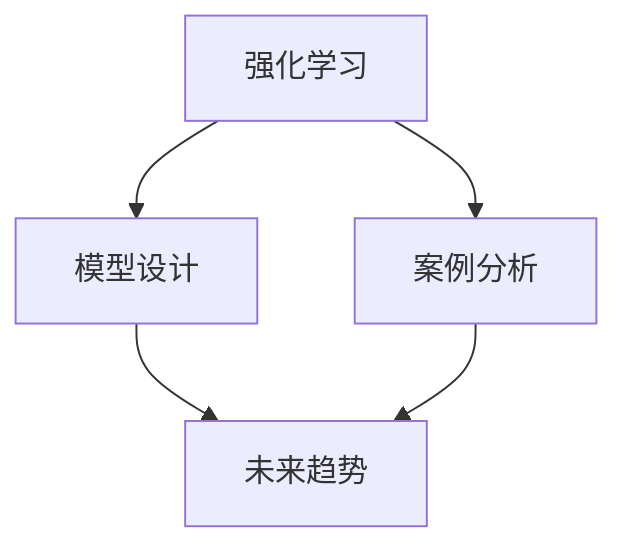

                 

## 1. 背景介绍

### 1.1 问题由来

强化学习（Reinforcement Learning, RL）作为一种自驱优化的算法，广泛应用于游戏AI、自动驾驶、机器人控制等领域。尤其在视频游戏中，由于其高度复杂性和动态变化的环境，RL技术能够有效模拟玩家行为，优化游戏策略。本文旨在探讨强化学习在游戏AI中的应用，通过具体案例和分析，展示其在不同类型的游戏中的高效应用。

### 1.2 问题核心关键点

1. **RL的原理与架构**：强化学习通过模型与环境互动，不断试错调整，以最大化累积回报。核心包括状态表示、动作策略、回报函数、学习算法等。
2. **模型的设计**：如何在RL中使用神经网络进行策略优化，以及如何优化训练过程。
3. **案例研究**：在多个实际游戏中的RL应用案例，以及分析其性能表现和优化策略。
4. **未来趋势**：强化学习在游戏AI中的未来发展方向，如多智能体、元学习和自适应模型等。

## 2. 核心概念与联系

### 2.1 核心概念概述

为更好地理解强化学习在游戏AI中的应用，本节将介绍几个密切相关的核心概念：

- **强化学习**：通过智能体与环境的交互，利用奖惩机制优化策略，从而实现目标任务的优化。核心包括状态表示、动作策略、回报函数、学习算法等。
- **模型设计**：使用神经网络作为强化学习的策略函数，通过优化网络参数实现行为策略的调整。
- **案例分析**：具体游戏的强化学习应用案例，包括游戏环境、智能体行为、学习过程等。
- **未来趋势**：强化学习在游戏AI中的未来发展方向，如多智能体学习、元学习和自适应模型等。

这些概念之间的逻辑关系可以通过以下Mermaid流程图来展示：



这个流程图展示了一切皆是映射：强化学习在游戏AI中的应用：案例与分析：

1. 强化学习通过与环境交互，不断优化智能体策略。
2. 模型设计是实现强化学习策略优化的关键，使用神经网络优化策略函数。
3. 案例分析展示了强化学习在游戏中的具体应用。
4. 未来趋势揭示了强化学习在游戏AI中的发展方向。

## 3. 核心算法原理 & 具体操作步骤

### 3.1 算法原理概述

强化学习在游戏AI中的应用，主要通过智能体与游戏环境的互动，不断调整行为策略以最大化累积回报。核心算法包括Q-learning、SARSA、深度Q网络(DQN)等。这些算法通过状态表示、动作策略和回报函数等核心组件，实现智能体的自优化过程。

### 3.2 算法步骤详解

以下是典型的强化学习在游戏AI中的具体步骤：

1. **环境设定**：确定游戏环境，包括状态空间、动作空间和回报函数。
2. **智能体设计**：选择神经网络作为智能体的策略函数，初始化模型参数。
3. **策略训练**：在训练集中，智能体通过与环境交互，不断调整策略，最大化累积回报。
4. **策略评估**：在测试集中，评估智能体的性能，确定其策略优劣。
5. **策略迭代**：通过不断迭代，优化智能体的行为策略。

### 3.3 算法优缺点

强化学习在游戏AI中的应用具有以下优点：

- **自适应性强**：通过与环境的交互，智能体能够自适应调整策略，适应不同的游戏场景。
- **高效性**：通过并行计算和深度学习，强化学习能够快速训练和优化策略。
- **泛化能力强**：通过深度学习模型，智能体能够泛化到不同类型的游戏中。

同时，强化学习也存在以下缺点：

- **数据需求高**：训练过程需要大量游戏数据，对于数据稀少的游戏，难以获得理想效果。
- **探索-利用矛盾**：智能体在探索新策略与利用已有知识之间存在矛盾，需要策略平衡。
- **计算资源消耗大**：训练深度神经网络需要大量的计算资源和时间。

### 3.4 算法应用领域

强化学习在游戏AI中的应用广泛，包括但不限于：

- **策略游戏**：如《星际争霸》《星际争霸II》等即时战略游戏，通过智能体优化资源管理和战斗策略。
- **战术游戏**：如《红警》《文明》等，通过智能体优化资源分配和单位调度。
- **沙盒游戏**：如《我的世界》，通过智能体探索和利用游戏环境进行自适应行为。
- **角色扮演游戏**：如《巫师3》《上古卷轴》等，通过智能体进行任务分配和角色决策。
- **运动游戏**：如《使命召唤》《刺客信条》等，通过智能体进行目标追踪和动态路径规划。

## 4. 数学模型和公式 & 详细讲解 & 举例说明

### 4.1 数学模型构建

强化学习的数学模型主要包括状态空间、动作空间、回报函数和策略函数等组件。以Q-learning为例，其核心数学模型为：

- **状态空间**：$S$，代表游戏环境的所有可能状态。
- **动作空间**：$A$，代表智能体可以采取的行动。
- **回报函数**：$R$，代表采取动作后获得即时回报。
- **策略函数**：$Q(s,a)$，代表在状态$s$下，采取动作$a$的累积回报。

### 4.2 公式推导过程

Q-learning的基本公式为：

$$
Q(s,a) = Q(s,a) + \alpha [R + \gamma \max_a Q(s',a')] - Q(s,a)
$$

其中：
- $\alpha$ 为学习率。
- $R$ 为即时回报。
- $\gamma$ 为折扣因子。
- $s'$ 和 $a'$ 为智能体在状态$s$下采取动作$a$后的下一个状态和最优动作。

该公式体现了强化学习的核心思想：智能体在当前状态下，采取动作$a$的累积回报，等于即时回报加上下一个状态的最大累积回报。通过不断迭代该公式，智能体能够逐步优化策略函数。

### 4.3 案例分析与讲解

以《星际争霸II》为例，智能体可以通过以下步骤进行策略优化：

1. **状态表示**：将游戏状态表示为向量形式，如游戏地图、单位数量、资源情况等。
2. **动作空间**：定义动作空间，如移动单位、攻击敌人、生产建筑等。
3. **回报函数**：设计回报函数，如单位存活数、基地建造完成度等。
4. **策略函数**：选择神经网络作为策略函数，优化单位调度、资源管理等策略。
5. **训练过程**：在训练集中，智能体通过与游戏环境的互动，不断调整策略，最大化累积回报。
6. **测试评估**：在测试集中，评估智能体的性能，确定其策略优劣。

## 5. 项目实践：代码实例和详细解释说明

### 5.1 开发环境搭建

在进行强化学习实践前，我们需要准备好开发环境。以下是使用Python进行OpenAI Gym进行游戏AI开发的的环境配置流程：

1. 安装Anaconda：从官网下载并安装Anaconda，用于创建独立的Python环境。

2. 创建并激活虚拟环境：
```bash
conda create -n reinforcement-env python=3.8 
conda activate reinforcement-env
```

3. 安装PyTorch：根据CUDA版本，从官网获取对应的安装命令。例如：
```bash
conda install pytorch torchvision torchaudio cudatoolkit=11.1 -c pytorch -c conda-forge
```

4. 安装OpenAI Gym：
```bash
pip install gym
```

5. 安装Tensorboard：用于可视化训练过程和结果。
```bash
pip install tensorboard
```

完成上述步骤后，即可在`reinforcement-env`环境中开始强化学习实践。

### 5.2 源代码详细实现

下面以《星际争霸II》为例，给出使用TensorFlow进行智能体训练的PyTorch代码实现。

首先，定义智能体的动作空间和回报函数：

```python
import gym
import numpy as np
import tensorflow as tf

env = gym.make('StarCraftII-v1')

actions = env.action_space.n
rewards = env.reward_range[0]
gamma = 0.99
alpha = 0.1

# 定义策略函数
policy = tf.keras.Sequential([
    tf.keras.layers.Dense(actions, activation='softmax')
])
```

然后，定义智能体的训练过程：

```python
def q_learning(env, policy, alpha, gamma):
    batch_size = 32
    target = tf.keras.Sequential([policy])
    optimizer = tf.keras.optimizers.Adam(learning_rate=alpha)
    
    state = env.reset()
    state_batch = []
    action_batch = []
    reward_batch = []
    
    for t in range(10000):
        action = np.random.choice(actions, p=policy(state))
        next_state, reward, done, _ = env.step(action)
        
        state_batch.append(state)
        action_batch.append(action)
        reward_batch.append(reward)
        
        if done:
            next_state = env.reset()
        
        q_next = target.predict(next_state[np.newaxis, :])
        q_target = reward + gamma * np.max(q_next)
        
        q = policy.predict(state[np.newaxis, :])
        q[0, action] = q_target
        
        policy.train_on_batch(state_batch, q)
        state_batch = []
        action_batch = []
        reward_batch = []
        
        if t % 1000 == 0:
            print(f"Episode {t+1}/{10000}, Reward: {reward_batch[-1]}")
            reward_batch = []
            state_batch = []
            action_batch = []
            
            target_weights = 1 - (t / 10000)
            target.assign(target)
            policy.train_on_batch(state_batch, q)
            state_batch = []
            action_batch = []
            reward_batch = []
        
    return policy
```

最后，启动训练流程：

```python
policy = q_learning(env, policy, alpha, gamma)
```

以上就是使用PyTorch对《星际争霸II》进行强化学习的完整代码实现。可以看到，得益于TensorFlow和OpenAI Gym的强大封装，我们能够以相对简洁的代码实现游戏AI的强化学习过程。

### 5.3 代码解读与分析

让我们再详细解读一下关键代码的实现细节：

**env = gym.make('StarCraftII-v1')**：
- 使用OpenAI Gym创建《星际争霸II》环境的实例，其中'StarCraftII-v1'表示使用官方的游戏数据集。

**actions = env.action_space.n**：
- 获取动作空间的维度，即智能体可以采取的行动数量。

**rewards = env.reward_range[0]**：
- 获取回报函数的最小值，即奖励范围的最小值。

**state = env.reset()**：
- 初始化游戏环境，重置状态。

**for t in range(10000)**：
- 循环10000次，模拟游戏过程。

**action = np.random.choice(actions, p=policy(state))**：
- 根据当前状态和智能体的策略函数，随机选择动作。

**next_state, reward, done, _ = env.step(action)**：
- 根据选定的动作，执行游戏步骤，获取下一个状态、即时回报和游戏是否结束。

**q_next = target.predict(next_state[np.newaxis, :])**：
- 使用策略函数预测下一个状态的最大累积回报。

**q_target = reward + gamma * np.max(q_next)**：
- 计算当前状态的累积回报目标值。

**q[0, action] = q_target**：
- 更新智能体的策略函数，计算当前状态和动作的累积回报。

**target.weights = 1 - (t / 10000)**：
- 调整策略函数的学习权重，平衡探索和利用。

通过上述代码，智能体能够通过与游戏环境的互动，不断调整策略，最终实现最优游戏行为。

## 6. 实际应用场景

### 6.1 智能对战平台

强化学习在游戏AI中的应用，可以扩展到智能对战平台，如《王者荣耀》《英雄联盟》等。通过智能体之间的对战，智能体能够学习对手的行为模式，并优化自身的策略。平台可以通过比赛数据进行策略迭代，提升智能体的对战能力。

### 6.2 游戏AI助手

在游戏AI中，强化学习可以用于开发智能助手，帮助玩家提升游戏水平。如《魔兽世界》中的任务提示系统，通过智能体分析玩家的行为，提供任务提示和策略建议。

### 6.3 游戏AI生成内容

强化学习还可以用于生成游戏内容，如《我的世界》中的世界生成器。智能体通过与游戏环境的互动，生成符合游戏规则的新地图或物品。

### 6.4 未来应用展望

随着强化学习在游戏AI中的应用不断深入，未来的发展方向包括：

1. **多智能体学习**：通过智能体之间的合作和竞争，学习更加复杂的策略和决策。
2. **元学习**：通过学习已有策略，快速适应新游戏环境，提升智能体的泛化能力。
3. **自适应模型**：根据游戏环境和玩家行为，动态调整智能体的策略，实现更加个性化的游戏体验。
4. **混合学习**：结合强化学习和监督学习，提升智能体的学习效率和性能。
5. **对抗训练**：通过与对手的对抗训练，提高智能体的鲁棒性和对抗能力。

## 7. 工具和资源推荐

### 7.1 学习资源推荐

为了帮助开发者系统掌握强化学习在游戏AI中的应用，这里推荐一些优质的学习资源：

1. **《强化学习》课程**：由斯坦福大学开设的强化学习课程，详细讲解强化学习的原理、算法和应用，适合初学者和进阶者。
2. **OpenAI Gym官方文档**：OpenAI Gym的官方文档，提供丰富的游戏环境实例和代码样例，是实践强化学习的必备资料。
3. **《强化学习实战》书籍**：由OpenAI的Doina Precup撰写，结合实际案例，深入浅出地介绍强化学习的理论和实践。
4. **PyTorch官方文档**：PyTorch的官方文档，提供丰富的深度学习工具和框架，适合进行游戏AI的开发和优化。

通过对这些资源的学习实践，相信你一定能够快速掌握强化学习在游戏AI中的应用，并用于解决实际的游戏问题。

### 7.2 开发工具推荐

高效的开发离不开优秀的工具支持。以下是几款用于强化学习在游戏AI开发的常用工具：

1. **OpenAI Gym**：用于创建和测试游戏环境的Python库，支持多种游戏和模拟环境。
2. **TensorFlow**：由Google主导开发的深度学习框架，支持分布式计算和自动微分。
3. **PyTorch**：由Facebook主导开发的深度学习框架，支持动态计算图和GPU加速。
4. **TensorBoard**：用于可视化训练过程和结果的工具，支持多维度数据展示。
5. **GymAtari**：在《Atari 2600》游戏中测试强化学习算法的开源项目，提供丰富的案例和分析。
6. **GymCartPole**：在《CartPole》游戏中测试强化学习算法的开源项目，提供快速入门的样例。

合理利用这些工具，可以显著提升强化学习在游戏AI中的开发效率，加快创新迭代的步伐。

### 7.3 相关论文推荐

强化学习在游戏AI中的应用源于学界的持续研究。以下是几篇奠基性的相关论文，推荐阅读：

1. **《Playing Atari with Deep Reinforcement Learning》**：DeepMind的论文，展示了使用深度Q网络在《Atari 2600》游戏中的强化学习应用。
2. **《Human-level Control through Deep Reinforcement Learning》**：DeepMind的论文，展示了使用深度强化学习实现人类级别控制任务。
3. **《Mastering the Game of Go without Human Knowledge》**：DeepMind的论文，展示了使用深度强化学习在《围棋》游戏中的应用。
4. **《Super-Mario-Bros-Playing-with-Deep-Reinforcement-Learning》**：OpenAI的论文，展示了使用强化学习在《超级马里奥兄弟》游戏中的应用。
5. **《AlphaStar: Mastering the StarCraft II Game》**：OpenAI的论文，展示了使用强化学习在《星际争霸II》游戏中的应用。

这些论文代表了大模型微调技术的发展脉络。通过学习这些前沿成果，可以帮助研究者把握学科前进方向，激发更多的创新灵感。

## 8. 总结：未来发展趋势与挑战

### 8.1 总结

本文对强化学习在游戏AI中的应用进行了全面系统的介绍。首先阐述了强化学习的原理与架构，详细讲解了模型设计、案例分析等关键步骤，展示了其在不同类型的游戏中的高效应用。通过具体案例和分析，本文深入探讨了强化学习的理论基础和实践技巧，提供了全面的技术指引。

通过本文的系统梳理，可以看到，强化学习在游戏AI中的应用具有广阔前景。从传统的即时战略游戏到复杂的策略游戏，从单智能体到多智能体，强化学习正在不断地拓展其应用边界，推动游戏AI技术的不断进步。

### 8.2 未来发展趋势

展望未来，强化学习在游戏AI中的应用将呈现以下几个发展趋势：

1. **多智能体学习**：智能体之间的合作与竞争，将提升游戏AI的策略复杂性和决策水平。
2. **元学习**：智能体通过学习已有策略，快速适应新游戏环境，提升泛化能力。
3. **自适应模型**：根据游戏环境和玩家行为，动态调整策略，实现更加个性化的游戏体验。
4. **混合学习**：结合强化学习和监督学习，提升智能体的学习效率和性能。
5. **对抗训练**：通过与对手的对抗训练，提高智能体的鲁棒性和对抗能力。
6. **跨平台应用**：强化学习将应用于更多平台和设备，如PC游戏、移动游戏等。

这些趋势凸显了强化学习在游戏AI中的巨大潜力，未来在各个领域的广泛应用将带来全新的变革。

### 8.3 面临的挑战

尽管强化学习在游戏AI中的应用已经取得了显著进展，但在迈向更加智能化、普适化应用的过程中，它仍面临诸多挑战：

1. **数据需求高**：训练过程需要大量游戏数据，对于数据稀少的游戏，难以获得理想效果。
2. **探索-利用矛盾**：智能体在探索新策略与利用已有知识之间存在矛盾，需要策略平衡。
3. **计算资源消耗大**：训练深度神经网络需要大量的计算资源和时间。
4. **鲁棒性不足**：智能体面对游戏环境的变化和不确定性，容易产生不稳定行为。
5. **安全性问题**：智能体可能出现鲁莽行为，对游戏环境和玩家造成负面影响。
6. **可解释性不足**：智能体的决策过程缺乏可解释性，难以对其行为进行分析和调试。

### 8.4 研究展望

面对强化学习在游戏AI中面临的挑战，未来的研究需要在以下几个方面寻求新的突破：

1. **数据增强技术**：通过数据增强技术，提高数据多样性，降低对特定数据集的依赖。
2. **模型压缩技术**：使用模型压缩技术，减少计算资源消耗，提高模型训练和推理效率。
3. **鲁棒性优化**：通过鲁棒性优化，提高智能体的鲁棒性和适应性，增强其在复杂环境下的稳定性和可靠性。
4. **安全机制设计**：设计安全机制，限制智能体的行为，避免对游戏环境和玩家造成负面影响。
5. **可解释性增强**：通过可解释性增强技术，提高智能体的决策透明度，便于对其行为进行分析和调试。
6. **跨平台协作**：研究跨平台协作技术，实现智能体在多平台上的协同工作。

这些研究方向的探索，必将引领强化学习在游戏AI中的不断进步，推动游戏AI技术的更加成熟和广泛应用。只有不断创新、勇于突破，才能真正实现人工智能技术在游戏领域的深远影响。

## 9. 附录：常见问题与解答

**Q1: 强化学习在游戏AI中是否适用于所有类型的游戏？**

A: 强化学习在游戏AI中的应用，需要满足游戏环境的可建模性和可交互性。对于具有明确规则和状态表示的游戏，强化学习通常能够取得不错的效果。但对于无法清晰建模的游戏，如《塞尔达传说》等开放世界游戏，强化学习的效果可能受限。

**Q2: 强化学习在游戏AI中如何处理探索-利用矛盾？**

A: 强化学习在游戏AI中，通常采用$\epsilon$-贪心策略，在探索和利用之间取得平衡。通过设置$\epsilon$，智能体在每一步有$\epsilon$的概率随机选择动作，其余概率根据当前状态和策略函数选择最优动作。

**Q3: 强化学习在游戏AI中如何提升模型的鲁棒性？**

A: 强化学习在游戏AI中，可以通过引入对抗训练、鲁棒性优化等技术提升模型的鲁棒性。对抗训练通过引入对抗样本，增强模型对扰动的鲁棒性。鲁棒性优化通过改进模型结构，提高模型对环境变化的适应能力。

**Q4: 强化学习在游戏AI中如何处理安全性问题？**

A: 强化学习在游戏AI中，可以通过设计安全机制，限制智能体的行为。例如，在决策前设置风险评估机制，评估智能体行为的潜在影响，避免鲁莽行为。

**Q5: 强化学习在游戏AI中如何提高模型的可解释性？**

A: 强化学习在游戏AI中，可以通过模型可解释性增强技术，提高模型的决策透明度。例如，使用LIME、SHAP等可解释性工具，分析智能体的决策过程和影响因素。

这些问答帮助读者深入理解强化学习在游戏AI中的应用，提供了全面的技术指引，相信对于理解强化学习在游戏AI中的实际应用具有重要意义。

