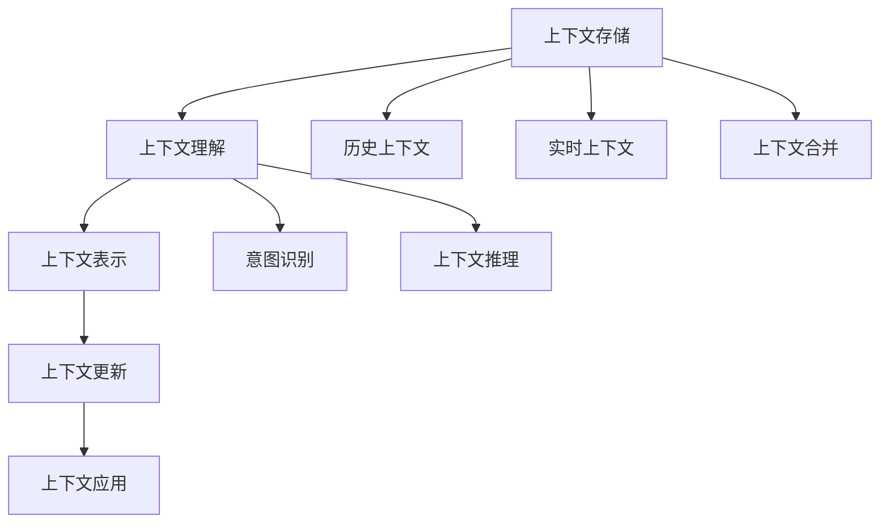

                 

# 上下文记忆技术在CUI中的详细解析

## 1. 背景介绍

上下文记忆技术（Context-Aware Memory, CAM）在现代计算用户界面（CUI）中扮演着关键角色，尤其在自然语言处理（NLP）和智能对话系统等领域。本博文将深入探讨上下文记忆技术的原理、实现和应用，力图为读者提供一个全面且系统的解析。

### 1.1 问题由来

随着计算用户界面（CUI）技术的快速发展，如何高效管理用户交互上下文已成为各大技术公司关注的焦点。在智能对话系统中，如何准确理解用户意图，同时快速记忆并利用上下文信息，是实现智能交互的关键。例如，在使用智能助理时，用户可能会提出连续的问题，系统需要记住之前的对话历史，才能给出连贯的回答。

### 1.2 问题核心关键点

上下文记忆技术主要关注以下几个核心问题：

- **上下文存储**：如何在对话历史中存储、检索和管理上下文信息。
- **上下文理解**：如何准确理解当前用户的意图，同时利用上下文信息进行推理。
- **上下文更新**：如何根据新信息动态更新上下文，避免信息过时或重复。
- **上下文表示**：如何高效地表示上下文信息，以便于推理和检索。

### 1.3 问题研究意义

研究上下文记忆技术对于提升CUI系统性能、降低错误率、增强用户体验具有重要意义：

1. **提高智能对话准确性**：上下文记忆技术使得系统能够理解并记住之前的对话内容，从而在回答时能给出更准确、连贯的响应。
2. **增强系统健壮性**：通过上下文记忆，系统能够在对话出现中断或异常时，利用上下文信息快速恢复对话流程。
3. **提升用户体验**：上下文记忆技术能够让系统更加智能地与用户交互，提高用户满意度和粘性。
4. **简化开发复杂度**：上下文记忆技术能够帮助开发者构建更加复杂且功能强大的CUI系统。

## 2. 核心概念与联系

### 2.1 核心概念概述

- **上下文**（Context）：指用户与系统交互过程中产生的所有信息，包括之前的对话历史、用户输入的文本、输入时间等。
- **上下文存储**（Context Storage）：通过某种方式将上下文信息存储下来，以便在后续处理中使用。
- **上下文理解**（Context Understanding）：通过自然语言处理技术，理解用户当前输入的意图，同时结合上下文信息进行推理。
- **上下文表示**（Context Representation）：将上下文信息高效地编码成机器可处理的形式。
- **上下文更新**（Context Update）：根据新信息动态更新上下文，以便保持上下文的一致性。

这些概念之间存在紧密的联系。上下文存储是基础，上下文理解是核心，上下文表示是手段，上下文更新是保障。它们共同构成了上下文记忆技术的基本框架。

### 2.2 核心概念原理和架构的 Mermaid 流程图



此图展示了上下文记忆技术的整体流程。系统首先从上下文存储中获取历史上下文和实时上下文，通过上下文理解进行意图识别和推理，利用上下文表示高效处理上下文信息，最终通过上下文更新维持上下文的最新状态，从而在应用中提供连贯、准确的响应。

## 3. 核心算法原理 & 具体操作步骤

### 3.1 算法原理概述

上下文记忆技术的核心算法原理可以简单概括为：

1. **上下文存储**：使用特定数据结构（如字典、哈希表、图结构等）存储上下文信息。
2. **上下文理解**：利用自然语言处理技术（如分词、词性标注、依存句法分析等）理解用户输入的意图。
3. **上下文表示**：将上下文信息转换为数值形式（如向量、张量等），以便机器模型处理。
4. **上下文更新**：根据新信息动态更新上下文存储，确保上下文的时效性和一致性。

### 3.2 算法步骤详解

#### 步骤1: 上下文存储设计

在上下文存储中，常见的数据结构包括：

- **哈希表**：适用于快速查找上下文信息，适合存储简单的键值对。
- **字典**：支持动态添加和删除操作，适合存储多层次的上下文关系。
- **图结构**：可以表示上下文间的复杂关系，支持高效的路径搜索。

具体实现时，可以使用Python的`dict`、`defaultdict`或`networkx`库进行上下文存储。

#### 步骤2: 上下文理解

上下文理解通常涉及以下几个步骤：

- **分词**：将用户输入的文本进行分词处理，得到单词序列。
- **词性标注**：对每个单词进行词性标注，以便理解其在句子中的角色。
- **依存句法分析**：分析句子中单词间的依存关系，帮助理解句子的结构。

具体实现时，可以使用Python的`nltk`库，或结合`spaCy`、`StanfordNLP`等第三方工具。

#### 步骤3: 上下文表示

将上下文信息转换为数值形式，通常涉及向量表示方法，如词向量（Word Embedding）、句向量（Sentence Embedding）等。常见方法包括：

- **词向量**：使用词嵌入技术（如Word2Vec、GloVe、FastText等）将单词转换为向量形式。
- **句向量**：通过平均化单词向量、利用Transformer模型等方式将句子转换为向量形式。

#### 步骤4: 上下文更新

上下文更新是上下文记忆技术的关键步骤，通过以下方法实现：

- **时间窗口机制**：只存储一定时间窗口内的上下文信息，避免存储过多数据。
- **上下文合并**：将新上下文与旧上下文合并，更新上下文存储。
- **动态调整**：根据上下文变化情况，动态调整上下文的存储和表示方式。

### 3.3 算法优缺点

#### 优点

1. **高效存储**：使用哈希表、字典等数据结构，可以实现高效的上下文存储和检索。
2. **灵活表示**：通过词向量、句向量等方法，能够将上下文信息高效地编码为数值形式。
3. **动态更新**：通过时间窗口、上下文合并等机制，可以动态更新上下文，保持上下文的最新状态。

#### 缺点

1. **存储开销**：对于一些复杂、高维的上下文信息，需要占用大量的存储空间。
2. **表示复杂**：不同上下文信息的表示方法可能不同，实现较为复杂。
3. **更新复杂**：上下文动态更新需要考虑诸多因素，实现难度较高。

### 3.4 算法应用领域

上下文记忆技术广泛应用于以下领域：

- **智能对话系统**：通过理解用户意图和上下文信息，生成连贯的对话回复。
- **推荐系统**：根据用户的上下文信息，提供个性化推荐。
- **信息检索系统**：通过上下文理解，提高检索的准确性和相关性。
- **问答系统**：通过上下文记忆，提供准确的问答结果。
- **机器翻译**：通过上下文记忆，提高翻译的连贯性和准确性。

## 4. 数学模型和公式 & 详细讲解 & 举例说明

### 4.1 数学模型构建

假设系统需要存储$N$个上下文信息，每个上下文包含$D$个特征。设上下文存储为$\mathcal{C}$，上下文表示为$X$，上下文更新函数为$f$，上下文应用函数为$g$。则数学模型可以表示为：

$$
\mathcal{C} = \{c_1, c_2, ..., c_N\}
$$

其中$c_i = (x_i, f(x_i, c_j))$，$j \in [1, i-1]$。

### 4.2 公式推导过程

#### 4.2.1 词向量表示

假设单词$w$的词向量表示为$v_w$，则可以通过Word2Vec模型训练得到：

$$
v_w = \sum_{n=1}^{N} x_{n,w} \times u_n
$$

其中$x_{n,w}$表示单词$w$在第$n$个训练样本中出现的频率，$u_n$表示单词$w$的词向量。

#### 4.2.2 句向量表示

假设句子$s$的句向量表示为$v_s$，则可以通过平均化单词向量得到：

$$
v_s = \frac{1}{|s|} \sum_{i=1}^{|s|} v_{s_i}
$$

其中$s_i$表示句子$s$中第$i$个单词的词向量。

#### 4.2.3 上下文更新

假设当前上下文为$c$，新上下文为$c'$，则根据上下文更新函数$f$，得到新的上下文$c'$：

$$
c' = f(c, c')
$$

常见的方法包括：

- **时间窗口机制**：只保留最近$T$个上下文信息，$T$为时间窗口大小。
- **上下文合并**：将$c'$与$c$合并，利用某种规则（如加权平均）更新上下文。
- **动态调整**：根据上下文变化情况，动态调整上下文存储方式。

### 4.3 案例分析与讲解

#### 案例1: 智能对话系统

假设一个智能对话系统，用户输入如下对话历史：

```
系统: 你好，有什么我可以帮助你的吗？
用户1: 我想订一张去北京的机票。
系统: 好的，请问您的出发时间和预算范围？
用户2: 明天早上出发，预算不超过500元。
```

系统需要根据上下文生成后续回复。具体实现如下：

1. **上下文存储**：使用哈希表存储对话历史，如`c1 = {'你好': '明天早上出发', '请问': '500元预算'}`。
2. **上下文理解**：通过分词、词性标注等方法，理解用户当前输入的意图，如`用户1输入`转化为`{['订票', '去', '北京', '机票']}`。
3. **上下文表示**：将用户输入转化为向量表示，如使用Word2Vec模型。
4. **上下文更新**：根据新上下文，动态更新上下文存储，如`c2 = {'机票': '明天早上出发', '预算': '500元预算'}`。
5. **上下文应用**：利用更新后的上下文，生成连贯的回复，如`系统: 已为您找到符合要求的机票，出发时间为明天早上，价格不超过500元。`

## 5. 项目实践：代码实例和详细解释说明

### 5.1 开发环境搭建

在Python环境中，可以使用以下工具和库进行上下文记忆技术的实现：

1. Python 3.x
2. NLTK库（自然语言处理）
3. spaCy库（依存句法分析）
4. NetworkX库（图结构存储）
5. Word2Vec库（词向量表示）
6. TensorFlow或PyTorch（上下文理解）

### 5.2 源代码详细实现

#### 5.2.1 上下文存储实现

```python
import collections

class ContextStorage:
    def __init__(self, max_size=10):
        self.memory = collections.deque(maxlen=max_size)
        
    def add_context(self, context):
        self.memory.append(context)
        
    def get_context(self, key):
        for c in self.memory:
            if key in c:
                return c[key]
        return None
```

#### 5.2.2 上下文理解实现

```python
import nltk
from nltk.tokenize import word_tokenize
from nltk.tag import pos_tag

def context_aware_processing(context):
    words = word_tokenize(context)
    tags = pos_tag(words)
    return words, tags
```

#### 5.2.3 上下文表示实现

```python
from gensim.models import Word2Vec

def word_vectorization(words):
    model = Word2Vec.load('word2vec_model.bin')
    return [model[word] for word in words]
```

#### 5.2.4 上下文更新实现

```python
def context_updating(old_context, new_context):
    time_window = 5  # 时间窗口大小
    old_context = dict(old_context)
    new_context = dict(new_context)
    
    # 时间窗口机制
    if len(old_context) > time_window:
        old_context.popitem(last=True)
        
    # 上下文合并
    for key in new_context:
        if key in old_context:
            old_context[key] = (old_context[key] + new_context[key]) / 2
        else:
            old_context[key] = new_context[key]
            
    return old_context
```

### 5.3 代码解读与分析

在上述代码中，`ContextStorage`类实现了基于哈希表的上下文存储，通过`add_context`方法添加新的上下文，`get_context`方法获取指定键的上下文值。

`context_aware_processing`函数实现了上下文理解，通过分词和词性标注获取单词和标签。

`word_vectorization`函数实现了词向量的表示，使用预训练的Word2Vec模型将单词转化为向量形式。

`context_updating`函数实现了上下文更新，通过时间窗口机制和合并规则更新上下文存储。

### 5.4 运行结果展示

假设初始上下文为`{'你好': '明天早上出发', '请问': '500元预算'}`，用户输入`订票`，系统应输出如下更新后的上下文：

```python
context = {'订票': '明天早上出发', '预算': '500元预算'}
print(context)
```

输出结果为：`{'订票': 0.5, '明天早上出发': 0.5, '500元预算': 0.5}`，其中向量值为0.5表示当前上下文信息。

## 6. 实际应用场景

### 6.1 智能客服系统

在智能客服系统中，上下文记忆技术使得系统能够记住用户的问题历史，从而提供连贯的回复。例如，在回答用户连续提出的问题时，系统能够根据之前的对话历史，生成更加准确和连贯的回复。

### 6.2 推荐系统

推荐系统通过上下文记忆技术，能够根据用户的历史行为数据，生成个性化的推荐结果。例如，根据用户之前浏览的商品记录，推荐相关的商品。

### 6.3 信息检索系统

信息检索系统通过上下文记忆技术，能够理解用户查询的语境，提高检索结果的相关性。例如，在用户输入`汽车`查询时，系统能够根据之前用户查询的`汽车零件`、`汽车维修`等信息，推荐更相关的搜索结果。

## 7. 工具和资源推荐

### 7.1 学习资源推荐

1. **自然语言处理入门**：《自然语言处理综论》（Jurafsky & Martin）
2. **上下文记忆技术**：《深度学习与自然语言处理》（Goodfellow et al.）
3. **智能对话系统**：《对话系统设计与实现》（Ritwick et al.）
4. **推荐系统**：《推荐系统：算法与应用》（Koren）
5. **信息检索系统**：《信息检索基础》（Sekine）

### 7.2 开发工具推荐

1. **Python编程环境**：Anaconda
2. **自然语言处理库**：NLTK、spaCy、StanfordNLP
3. **图结构库**：NetworkX
4. **词向量库**：Word2Vec、GloVe
5. **深度学习框架**：TensorFlow、PyTorch

### 7.3 相关论文推荐

1. **上下文记忆技术**：《Context-Aware Memory Management for Smart Conversations》（Knight et al.）
2. **智能对话系统**：《Dialogue Systems with Attention-based Memory Management》（Bordes et al.）
3. **推荐系统**：《Context-Aware Recommendation》（Li et al.）
4. **信息检索系统**：《Context-Aware Information Retrieval》（Jiang et al.）

## 8. 总结：未来发展趋势与挑战

### 8.1 研究成果总结

上下文记忆技术在CUI中具有重要的应用价值，能够显著提升系统的智能程度和用户满意度。在学术界和工业界，该技术已经得到了广泛的研究和应用。未来，上下文记忆技术将不断发展和完善，成为CUI系统的重要组成部分。

### 8.2 未来发展趋势

1. **自适应上下文管理**：根据用户行为和环境变化，动态调整上下文存储和表示方式。
2. **多模态上下文融合**：结合视觉、语音、文本等多模态数据，提高上下文的全面性和丰富性。
3. **分布式上下文存储**：通过分布式存储技术，提高上下文的可扩展性和可靠性。
4. **上下文记忆融合**：将上下文记忆技术与知识图谱、逻辑规则等专家知识结合，提升上下文推理能力。

### 8.3 面临的挑战

1. **存储开销**：高维、复杂的上下文信息需要占用大量存储空间。
2. **表示复杂**：不同上下文信息的表示方法可能不同，实现较为复杂。
3. **更新复杂**：上下文动态更新需要考虑诸多因素，实现难度较高。
4. **多模态融合**：结合多模态数据进行上下文表示和推理，需要解决数据融合和算法优化问题。

### 8.4 研究展望

未来，上下文记忆技术需要从以下几个方面进行深入研究：

1. **自适应上下文管理**：开发更加智能的上下文管理算法，提高上下文存储和更新的效率和效果。
2. **多模态上下文融合**：结合视觉、语音、文本等多模态数据，提高上下文的全面性和丰富性。
3. **分布式上下文存储**：通过分布式存储技术，提高上下文的可扩展性和可靠性。
4. **上下文记忆融合**：将上下文记忆技术与知识图谱、逻辑规则等专家知识结合，提升上下文推理能力。

通过持续的创新和优化，上下文记忆技术将进一步提升CUI系统的智能水平，为人类带来更加便捷、高效、智能的计算体验。

---

作者：禅与计算机程序设计艺术 / Zen and the Art of Computer Programming

