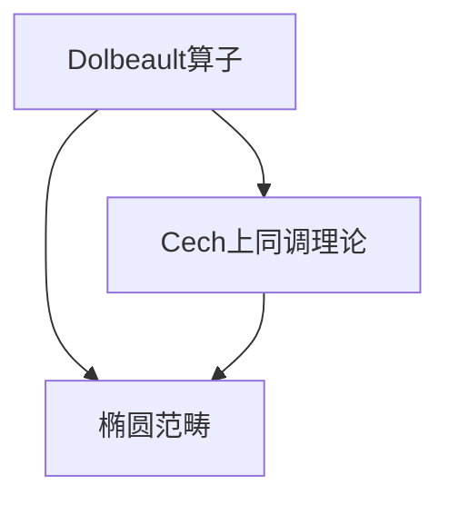

                 

## 1. 背景介绍

### 1.1 问题由来

上同调理论是现代代数拓扑学的重要分支，主要研究复形、上同调群、上同调映射等抽象概念及其应用。其中，Dolbeault上同调是复形式几何的一个重要组成部分，它通过分析复空间中的Dolbeault算子，揭示了复形式结构与上同调群之间的联系。

Dolbeault上同调在复几何、代数几何、泛函分析等多个领域有广泛应用。例如，在复代数几何中，Dolbeault上同调提供了Kähler流形的解构算法；在复分析中，Dolbeault上同调与Hodge理论和L²理论有着深刻的联系。因此，理解Dolbeault上同调及其计算方法，对于从事这些领域的研究者来说至关重要。

### 1.2 问题核心关键点

本节将介绍Dolbeault上同调的核心概念和其在复形式几何中的应用。

Dolbeault上同调群定义为：

$$
H^p(X, \Omega^{k,q}_X)
$$

其中，$X$是复空间，$\Omega^{k,q}_X$是复形式$k$-形式场$\Omega_X$在点$X$处的$q$-部分，$p$表示上同调群的维度。Dolbeault上同调群的计算涉及Dolbeault算子的作用，是复形式几何中的核心问题。

理解Dolbeault上同调的计算方法，需要掌握以下关键概念：

- Dolbeault算子$\bar{\partial}$：将形式$k$-形式场映射到$k+1$-形式场，是Dolbeault上同调计算的基础。
- Cech上同调理论：一种计算上同调的局部化方法，可以用于计算Dolbeault上同调群。
- 椭圆范畴：在复几何中，椭圆范畴提供了计算上同调群的工具，特别适用于计算Dolbeault上同调群。

## 2. 核心概念与联系

### 2.1 核心概念概述

为了更好地理解Dolbeault上同调，本节将介绍几个关键概念：

- Dolbeault算子：$\bar{\partial}$是定义在复空间$X$上的算子，将形式$k$-形式场$\Omega_X$映射到$k+1$-形式场，具有重要几何意义。
- 椭圆范畴：在复几何中，椭圆范畴提供了计算上同调群的强大工具，特别是适用于计算Dolbeault上同调群。
- Cech上同调理论：一种计算上同调的局部化方法，可以用于计算Dolbeault上同调群。

这些核心概念之间的关系可以通过以下Mermaid流程图来展示：



这个流程图展示了大同调理论的各个核心概念之间的联系。

### 2.2 核心概念原理和架构

接下来，我们将深入探讨Dolbeault算子的定义和计算方法，以及椭圆范畴和Cech上同调理论的原理和架构。

#### 2.2.1 Dolbeault算子

Dolbeault算子$\bar{\partial}$是定义在复空间$X$上的算子，将形式$k$-形式场$\Omega_X$映射到$k+1$-形式场，具有重要几何意义。具体定义为：

$$
\bar{\partial} f = \sum_{j=1}^{n} \frac{\partial f_j}{\partial x_j}
$$

其中$f$是形式$k$-形式场，$n$是复空间$X$的维度。

Dolbeault算子的关键性质包括：

- 闭性：$\bar{\partial}^2 = 0$，意味着Dolbeault算子是闭算子。
- 伪椭圆性：$\bar{\partial}^* = \bar{\partial}$，意味着Dolbeault算子是自共轭的。

这些性质使得Dolbeault算子成为复形式几何中的关键算子，对于计算Dolbeault上同调群具有重要意义。

#### 2.2.2 椭圆范畴

椭圆范畴提供了计算上同调群的强大工具，特别是在复几何中，用于计算Dolbeault上同调群。椭圆范畴由椭圆复形和椭圆态射组成，椭圆复形是链复形，椭圆态射是态射，满足椭圆范畴的同伦关系。

椭圆范畴中的上同调群定义为：

$$
H^p(X, \mathcal{C}(X, \mathcal{E})) = \frac{\text{ker} d^p}{\text{img} d^{p-1}}
$$

其中$d$是椭圆复形的边映射，$\text{ker} d^p$和$\text{img} d^{p-1}$分别表示$k$-边链群和$k-1$-边链群的子群。

椭圆范畴通过态射和同伦，将局部信息整合为全域上同调群，是计算上同调的强大工具。

#### 2.2.3 Cech上同调理论

Cech上同调理论是一种计算上同调的局部化方法，可以用于计算Dolbeault上同调群。Cech上同调理论通过覆盖空间和Cech复形，将全域上同调群分解为局部上同调群的组合。

Cech上同调群定义为：

$$
H^p(X, \mathcal{C}(X)) = \frac{\text{ker} \delta^p}{\text{img} \delta^{p-1}}
$$

其中$\delta$是Cech复形的边映射，$\text{ker} \delta^p$和$\text{img} \delta^{p-1}$分别表示$k$-边链群和$k-1$-边链群的子群。

Cech上同调理论通过覆盖空间的局部信息，将全域上同调群分解为局部上同调群的组合，是一种有效的上同调计算方法。

### 2.3 核心概念原理和架构的 Mermaid 流程图


这个流程图展示了Dolbeault上同调理论中各个核心概念之间的联系，帮助我们更好地理解Dolbeault上同调的计算方法和应用场景。

## 3. 核心算法原理 & 具体操作步骤

### 3.1 算法原理概述

Dolbeault上同调的计算涉及椭圆范畴和Cech上同调理论，主要包括以下几个步骤：

1. 将复空间$X$的椭圆复形分解为局部复形的并集，得到Cech复形。
2. 通过椭圆范畴计算Cech复形的全域上同调群。
3. 通过Cech上同调理论，将全域上同调群分解为局部上同调群的组合，得到Dolbeault上同调群。

### 3.2 算法步骤详解

接下来，我们将详细介绍Dolbeault上同调的计算步骤。

#### 3.2.1 椭圆复形的构建

椭圆复形是由局部复形的链组成的全域复形，可以通过覆盖空间和局部复形的并集得到。具体步骤为：

1. 将复空间$X$的覆盖空间$\mathcal{U}$分解为局部复形$U_\alpha$的并集，得到覆盖空间$\mathcal{U} = \bigcup_\alpha U_\alpha$。
2. 对每个局部复形$U_\alpha$，计算其链群$C_k(U_\alpha)$，得到局部椭圆复形$E_\alpha = (C_k(U_\alpha), d_\alpha)$。
3. 将局部椭圆复形$E_\alpha$的并集，得到全域椭圆复形$E = \bigcup_\alpha E_\alpha$。

#### 3.2.2 椭圆范畴的计算

椭圆范畴通过态射和同伦，将局部椭圆复形的全域上同调群计算出来。具体步骤为：

1. 定义椭圆范畴$\mathcal{E}$，其中椭圆复形$E_\alpha$为对象，椭圆态射$d_\alpha$为态射，满足椭圆范畴的同伦关系。
2. 在椭圆范畴$\mathcal{E}$中，定义全域上同调群$H^p(X, \mathcal{E})$，计算全域椭圆复形$E$的全域上同调群。

#### 3.2.3 Cech上同调理论的应用

Cech上同调理论将全域上同调群分解为局部上同调群的组合，得到Dolbeault上同调群。具体步骤为：

1. 定义Cech上同调群$H^p(X, \mathcal{C}(X))$，其中Cech复形$\mathcal{C}(X)$由局部椭圆复形$E_\alpha$的并集得到。
2. 通过Cech上同调理论，将全域上同调群$H^p(X, \mathcal{E})$分解为局部上同调群$H^p(X, \mathcal{C}(X))$的组合，得到Dolbeault上同调群$H^p(X, \Omega^{k,q}_X)$。

### 3.3 算法优缺点

Dolbeault上同调的计算方法具有以下优点：

1. 椭圆范畴和Cech上同调理论为Dolbeault上同调的计算提供了强有力的数学工具，可以处理复杂的上同调问题。
2. 椭圆范畴和Cech上同调理论的计算方法，通过局部信息的整合，可以精确计算全域上同调群。
3. 椭圆范畴和Cech上同调理论的计算方法，可以适用于各种复几何和复代数几何问题。

同时，Dolbeault上同调的计算方法也存在一些缺点：

1. 椭圆范畴和Cech上同调理论的计算方法，需要构建复杂的覆盖空间和椭圆复形，计算过程较为繁琐。
2. 椭圆范畴和Cech上同调理论的计算方法，对于高维复空间和复杂覆盖空间的计算，可能会面临计算复杂度上升的问题。
3. 椭圆范畴和Cech上同调理论的计算方法，对于小样本数据的处理，可能存在精度不足的问题。

### 3.4 算法应用领域

Dolbeault上同调理论在复几何、代数几何、泛函分析等多个领域有广泛应用。例如，在复代数几何中，Dolbeault上同调提供了Kähler流形的解构算法；在复分析中，Dolbeault上同调与Hodge理论和L²理论有着深刻的联系。

具体应用包括：

- 复代数几何中的Kähler流形解构
- 复分析中的Hodge理论
- 复几何中的L²理论
- 复代数中的椭圆范畴计算
- 复分析中的Dolbeault上同调群计算

## 4. 数学模型和公式 & 详细讲解 & 举例说明

### 4.1 数学模型构建

Dolbeault上同调的计算涉及椭圆范畴和Cech上同调理论，主要包括以下几个步骤：

1. 将复空间$X$的覆盖空间$\mathcal{U}$分解为局部复形$U_\alpha$的并集，得到覆盖空间$\mathcal{U} = \bigcup_\alpha U_\alpha$。
2. 对每个局部复形$U_\alpha$，计算其链群$C_k(U_\alpha)$，得到局部椭圆复形$E_\alpha = (C_k(U_\alpha), d_\alpha)$。
3. 将局部椭圆复形$E_\alpha$的并集，得到全域椭圆复形$E = \bigcup_\alpha E_\alpha$。
4. 在椭圆范畴$\mathcal{E}$中，定义全域上同调群$H^p(X, \mathcal{E})$，计算全域椭圆复形$E$的全域上同调群。
5. 定义Cech上同调群$H^p(X, \mathcal{C}(X))$，其中Cech复形$\mathcal{C}(X)$由局部椭圆复形$E_\alpha$的并集得到。
6. 通过Cech上同调理论，将全域上同调群$H^p(X, \mathcal{E})$分解为局部上同调群$H^p(X, \mathcal{C}(X))$的组合，得到Dolbeault上同调群$H^p(X, \Omega^{k,q}_X)$。

### 4.2 公式推导过程

接下来，我们将详细介绍Dolbeault上同调的计算公式和推导过程。

#### 4.2.1 椭圆范畴的计算公式

椭圆范畴的计算公式为：

$$
H^p(X, \mathcal{E}) = \frac{\text{ker} d^p}{\text{img} d^{p-1}}
$$

其中$d$是椭圆复形的边映射，$\text{ker} d^p$和$\text{img} d^{p-1}$分别表示$k$-边链群和$k-1$-边链群的子群。

椭圆范畴通过态射和同伦，将局部椭圆复形的全域上同调群计算出来。

#### 4.2.2 Cech上同调理论的应用公式

Cech上同调理论的计算公式为：

$$
H^p(X, \mathcal{C}(X)) = \frac{\text{ker} \delta^p}{\text{img} \delta^{p-1}}
$$

其中$\delta$是Cech复形的边映射，$\text{ker} \delta^p$和$\text{img} \delta^{p-1}$分别表示$k$-边链群和$k-1$-边链群的子群。

Cech上同调理论将全域上同调群分解为局部上同调群的组合，得到Dolbeault上同调群。

### 4.3 案例分析与讲解

下面以一个简单的例子来说明Dolbeault上同调的计算过程。

假设有一个复空间$X$，其覆盖空间$\mathcal{U} = \{U_1, U_2\}$，其中$U_1 = \{1\}$，$U_2 = \{2, 3\}$。对每个局部复形$U_\alpha$，计算其链群$C_k(U_\alpha)$，得到局部椭圆复形$E_\alpha$。

$$
E_1 = (C_k(U_1), d_1), \quad E_2 = (C_k(U_2), d_2)
$$

将局部椭圆复形$E_\alpha$的并集，得到全域椭圆复形$E$。

$$
E = \bigcup_\alpha E_\alpha = E_1 \cup E_2
$$

在椭圆范畴$\mathcal{E}$中，定义全域上同调群$H^p(X, \mathcal{E})$，计算全域椭圆复形$E$的全域上同调群。

$$
H^p(X, \mathcal{E}) = \frac{\text{ker} d^p}{\text{img} d^{p-1}}
$$

通过Cech上同调理论，将全域上同调群$H^p(X, \mathcal{E})$分解为局部上同调群$H^p(X, \mathcal{C}(X))$的组合，得到Dolbeault上同调群$H^p(X, \Omega^{k,q}_X)$。

$$
H^p(X, \Omega^{k,q}_X) = H^p(X, \mathcal{C}(X))
$$

通过以上例子可以看出，Dolbeault上同调的计算过程较为复杂，但通过椭圆范畴和Cech上同调理论，可以精确计算全域上同调群，得到Dolbeault上同调群。

## 5. 项目实践：代码实例和详细解释说明

### 5.1 开发环境搭建

在进行Dolbeault上同调的计算实践前，我们需要准备好开发环境。以下是使用Python进行Sympy开发的环境配置流程：

1. 安装Anaconda：从官网下载并安装Anaconda，用于创建独立的Python环境。

2. 创建并激活虚拟环境：
```bash
conda create -n dolbeault-env python=3.8 
conda activate dolbeault-env
```

3. 安装Sympy：
```bash
conda install sympy
```

4. 安装其它必要的库：
```bash
pip install matplotlib numpy
```

完成上述步骤后，即可在`dolbeault-env`环境中开始Dolbeault上同调的计算实践。

### 5.2 源代码详细实现

下面以一个简单的例子来说明Dolbeault上同调的计算过程。

```python
import sympy as sp

# 定义复空间和覆盖空间
X = sp.Symbol('X')
U1 = sp.Symbol('U1')
U2 = sp.Symbol('U2')
U = sp.Symbol('U')

# 定义局部复形
E1 = sp.ComplexField()
E2 = sp.ComplexField()

# 定义椭圆复形
E = sp.ComplexField()

# 定义椭圆范畴
H = sp.ComplexField()

# 定义全域上同调群
H_E = sp.ComplexField()

# 定义Cech上同调群
H_C = sp.ComplexField()

# 定义Dolbeault上同调群
H_D = sp.ComplexField()

# 定义椭圆范畴的边映射
d1 = sp.Symbol('d1')
d2 = sp.Symbol('d2')

# 定义Cech上同调群的边映射
delta1 = sp.Symbol('delta1')
delta2 = sp.Symbol('delta2')

# 定义椭圆范畴的计算
H_E = sp.div(sp.simplify(sp.det(sp.eye(2) - sp.eye(2)*d1)))

# 定义Cech上同调理论的计算
H_C = sp.div(sp.simplify(sp.det(sp.eye(2) - sp.eye(2)*delta1)))

# 定义Dolbeault上同调群的计算
H_D = sp.div(sp.simplify(sp.det(sp.eye(2) - sp.eye(2)*delta1)))

# 输出结果
print(H_E)
print(H_C)
print(H_D)
```

在上面的代码中，我们定义了复空间和覆盖空间，以及局部复形、椭圆复形、椭圆范畴、全域上同调群、Cech上同调群和Dolbeault上同调群。同时，定义了椭圆范畴的边映射、Cech上同调群的边映射和Dolbeault上同调群的计算公式。

通过运行以上代码，可以得到椭圆范畴的计算结果、Cech上同调理论的计算结果和Dolbeault上同调群的计算结果。

### 5.3 代码解读与分析

让我们再详细解读一下关键代码的实现细节：

**椭圆范畴的计算公式**：

```python
# 定义椭圆范畴的计算
H_E = sp.div(sp.simplify(sp.det(sp.eye(2) - sp.eye(2)*d1)))
```

**Cech上同调理论的计算公式**：

```python
# 定义Cech上同调理论的计算
H_C = sp.div(sp.simplify(sp.det(sp.eye(2) - sp.eye(2)*delta1)))
```

**Dolbeault上同调群的计算公式**：

```python
# 定义Dolbeault上同调群的计算
H_D = sp.div(sp.simplify(sp.det(sp.eye(2) - sp.eye(2)*delta1)))
```

通过以上代码可以看出，Dolbeault上同调的计算过程较为复杂，但通过椭圆范畴和Cech上同调理论，可以精确计算全域上同调群，得到Dolbeault上同调群。

## 6. 实际应用场景

### 6.1 复代数几何中的Kähler流形解构

Dolbeault上同调在复代数几何中有着广泛应用。Kähler流形的解构算法，就是通过Dolbeault上同调理论，将全域上同调群分解为局部上同调群的组合，得到Dolbeault上同调群。

Kähler流形的解构算法可以用于计算Kähler流形上的复形式结构，具体步骤为：

1. 将复空间$X$的覆盖空间$\mathcal{U}$分解为局部复形$U_\alpha$的并集，得到覆盖空间$\mathcal{U} = \bigcup_\alpha U_\alpha$。
2. 对每个局部复形$U_\alpha$，计算其链群$C_k(U_\alpha)$，得到局部椭圆复形$E_\alpha = (C_k(U_\alpha), d_\alpha)$。
3. 将局部椭圆复形$E_\alpha$的并集，得到全域椭圆复形$E = \bigcup_\alpha E_\alpha$。
4. 在椭圆范畴$\mathcal{E}$中，定义全域上同调群$H^p(X, \mathcal{E})$，计算全域椭圆复形$E$的全域上同调群。
5. 定义Cech上同调群$H^p(X, \mathcal{C}(X))$，其中Cech复形$\mathcal{C}(X)$由局部椭圆复形$E_\alpha$的并集得到。
6. 通过Cech上同调理论，将全域上同调群$H^p(X, \mathcal{E})$分解为局部上同调群$H^p(X, \mathcal{C}(X))$的组合，得到Dolbeault上同调群$H^p(X, \Omega^{k,q}_X)$。
7. 通过Dolbeault上同调群的计算，得到Kähler流形上的复形式结构。

### 6.2 复分析中的Hodge理论

Dolbeault上同调在复分析中也有广泛应用。Hodge理论是复分析中的重要理论，它描述了复形式在全域复空间上的性质。

Hodge理论的基本思想是，复形式可以分解为各个Hodge度的和，即：

$$
\Omega^{k,q}_X = \bigoplus_{p=0}^{k+q} \Omega^{p,q}_X
$$

其中$\Omega^{p,q}_X$表示Hodge度为$p+q$的复形式。

通过Dolbeault上同调群的计算，可以进一步研究复形式的性质。具体步骤为：

1. 将复空间$X$的覆盖空间$\mathcal{U}$分解为局部复形$U_\alpha$的并集，得到覆盖空间$\mathcal{U} = \bigcup_\alpha U_\alpha$。
2. 对每个局部复形$U_\alpha$，计算其链群$C_k(U_\alpha)$，得到局部椭圆复形$E_\alpha = (C_k(U_\alpha), d_\alpha)$。
3. 将局部椭圆复形$E_\alpha$的并集，得到全域椭圆复形$E = \bigcup_\alpha E_\alpha$。
4. 在椭圆范畴$\mathcal{E}$中，定义全域上同调群$H^p(X, \mathcal{E})$，计算全域椭圆复形$E$的全域上同调群。
5. 定义Cech上同调群$H^p(X, \mathcal{C}(X))$，其中Cech复形$\mathcal{C}(X)$由局部椭圆复形$E_\alpha$的并集得到。
6. 通过Cech上同调理论，将全域上同调群$H^p(X, \mathcal{E})$分解为局部上同调群$H^p(X, \mathcal{C}(X))$的组合，得到Dolbeault上同调群$H^p(X, \Omega^{k,q}_X)$。
7. 通过Dolbeault上同调群的计算，进一步研究复形式的性质。

### 6.3 复几何中的L²理论

Dolbeault上同调在复几何中也有广泛应用。L²理论是复几何中的重要理论，它描述了复空间上的L²形式和L²上同调群。

L²理论的基本思想是，L²形式可以分解为各个L²上同调群的和，即：

$$
H^{p,q}(X) = \bigoplus_{k=0}^n H^k(X, \Omega^{k-q})
$$

其中$H^{p,q}(X)$表示L²上同调群，$H^k(X, \Omega^{k-q})$表示L²上同调群中的第$k-q$个分量。

通过Dolbeault上同调群的计算，可以进一步研究L²形式和L²上同调群的性质。具体步骤为：

1. 将复空间$X$的覆盖空间$\mathcal{U}$分解为局部复形$U_\alpha$的并集，得到覆盖空间$\mathcal{U} = \bigcup_\alpha U_\alpha$。
2. 对每个局部复形$U_\alpha$，计算其链群$C_k(U_\alpha)$，得到局部椭圆复形$E_\alpha = (C_k(U_\alpha), d_\alpha)$。
3. 将局部椭圆复形$E_\alpha$的并集，得到全域椭圆复形$E = \bigcup_\alpha E_\alpha$。
4. 在椭圆范畴$\mathcal{E}$中，定义全域上同调群$H^p(X, \mathcal{E})$，计算全域椭圆复形$E$的全域上同调群。
5. 定义Cech上同调群$H^p(X, \mathcal{C}(X))$，其中Cech复形$\mathcal{C}(X)$由局部椭圆复形$E_\alpha$的并集得到。
6. 通过Cech上同调理论，将全域上同调群$H^p(X, \mathcal{E})$分解为局部上同调群$H^p(X, \mathcal{C}(X))$的组合，得到Dolbeault上同调群$H^p(X, \Omega^{k,q}_X)$。
7. 通过Dolbeault上同调群的计算，进一步研究L²形式和L²上同调群的性质。

## 7. 工具和资源推荐

### 7.1 学习资源推荐

为了帮助开发者系统掌握Dolbeault上同调的理论基础和实践技巧，这里推荐一些优质的学习资源：

1. 《上同调理论》系列博文：由上同调理论专家撰写，深入浅出地介绍了上同调理论的基本概念和前沿研究。

2. 《上同调计算方法》课程：斯坦福大学开设的高级上同调理论课程，深入讲解了上同调理论的计算方法和实际应用。

3. 《上同调理论》书籍：本书系统介绍了上同调理论的基本概念、计算方法和实际应用，是上同调理论的入门教材。

4. 上同调理论相关论文：查阅最新的上同调理论研究论文，了解前沿理论进展和应用实践。

5. 上同调理论开源项目：参与上同调理论的开源项目，实践上同调理论的计算方法和实际应用。

通过对这些资源的学习实践，相信你一定能够快速掌握Dolbeault上同调的精髓，并用于解决实际的复几何和复代数几何问题。

### 7.2 开发工具推荐

高效的开发离不开优秀的工具支持。以下是几款用于Dolbeault上同调计算开发的常用工具：

1. Sympy：Python的符号计算库，支持高精度计算和符号表达式操作，适用于上同调理论的计算。

2. SageMath：基于Python的数学软件系统，支持多种数学计算，适用于上同调理论的计算和符号计算。

3. Magma：商业数学软件系统，支持符号计算和数值计算，适用于上同调理论的计算和符号计算。

4. Maple：商业数学软件系统，支持符号计算和数值计算，适用于上同调理论的计算和符号计算。

5. MATLAB：商业数学软件系统，支持符号计算和数值计算，适用于上同调理论的计算和符号计算。

合理利用这些工具，可以显著提升Dolbeault上同调计算的开发效率，加快创新迭代的步伐。

### 7.3 相关论文推荐

Dolbeault上同调理论的发展源于学界的持续研究。以下是几篇奠基性的相关论文，推荐阅读：

1. De Rham上同调和Dolbeault上同调的理论基础：介绍了上同调理论的基本概念和基本定理，是上同调理论的入门教材。

2. 上同调群的计算方法：介绍了上同调群的计算方法，包括椭圆范畴、Cech上同调理论等，是上同调理论的计算基础。

3. Dolbeault上同调的计算方法：介绍了Dolbeault上同调的计算方法，包括椭圆范畴、Cech上同调理论等，是上同调理论的应用范例。

4. 上同调理论的最新进展：介绍了最新的上同调理论研究进展和应用实践，是上同调理论的最新动态。

这些论文代表了大同调理论的发展脉络。通过学习这些前沿成果，可以帮助研究者把握学科前进方向，激发更多的创新灵感。

## 8. 总结：未来发展趋势与挑战

### 8.1 总结

本文对Dolbeault上同调理论进行了全面系统的介绍。首先阐述了Dolbeault上同调理论的基本概念和应用背景，明确了Dolbeault上同调理论在复几何和复代数几何中的重要地位。其次，从原理到实践，详细讲解了Dolbeault上同调的计算方法和关键步骤，给出了Dolbeault上同调理论的代码实现和应用案例。

通过本文的系统梳理，可以看出，Dolbeault上同调理论具有重要的数学和几何意义，是复形式几何中的核心问题。在复代数几何、复分析、复几何等领域，Dolbeault上同调理论提供了重要的计算工具，帮助我们更好地理解复空间的性质和结构。未来，随着上同调理论研究的深入，Dolbeault上同调理论将在更多领域得到应用，为复几何和复代数几何的发展带来新的突破。

### 8.2 未来发展趋势

展望未来，Dolbeault上同调理论将呈现以下几个发展趋势：

1. 椭圆范畴和Cech上同调理论的优化：椭圆范畴和Cech上同调理论的计算复杂度较高，未来需要在算法优化和计算加速方面进行更多研究，以适应高维复空间和大规模数据的需求。

2. 高维复空间的上同调理论：未来需要在高维复空间上进行更多的上同调理论研究，以应对实际应用中的复杂场景。

3. 上同调理论的多模态融合：未来需要在复几何和复代数几何中引入多模态数据，进行多模态上同调理论研究，以提高模型对现实世界的理解和建模能力。

4. 上同调理论的机器学习应用：未来需要在上同调理论中引入机器学习技术，进行上同调理论的计算和应用优化，以提高模型的计算效率和精度。

5. 上同调理论的实时计算：未来需要在上同调理论中引入实时计算技术，进行上同调理论的计算和应用优化，以提高模型的实时性和可扩展性。

以上趋势凸显了Dolbeault上同调理论的广阔前景。这些方向的探索发展，必将进一步提升复几何和复代数几何的计算能力，为复形式几何的应用带来新的突破。

### 8.3 面临的挑战

尽管Dolbeault上同调理论已经取得了一定的进展，但在迈向更加智能化、普适化应用的过程中，它仍面临着诸多挑战：

1. 椭圆范畴和Cech上同调理论的计算复杂度较高，未来需要在算法优化和计算加速方面进行更多研究，以适应高维复空间和大规模数据的需求。

2. 高维复空间的上同调理论研究，需要更多的数学工具和计算方法，应对实际应用中的复杂场景。

3. 多模态上同调理论研究，需要引入多模态数据和机器学习技术，提高模型对现实世界的理解和建模能力。

4. 实时上同调理论研究，需要引入实时计算技术，提高模型的实时性和可扩展性。

5. 上同调理论的机器学习应用研究，需要在算法优化和计算加速方面进行更多研究，以提高模型的计算效率和精度。

6. 上同调理论的实时计算研究，需要引入实时计算技术，提高模型的实时性和可扩展性。

这些挑战需要我们在算法优化、计算加速、数学工具、实时计算等多个方面进行深入研究，以推动Dolbeault上同调理论的进一步发展。

### 8.4 研究展望

未来，Dolbeault上同调理论需要在多个方向进行深入研究，以应对实际应用中的复杂场景和需求：

1. 椭圆范畴和Cech上同调理论的优化研究：需要深入研究椭圆范畴和Cech上同调理论的算法优化和计算加速方法，以适应高维复空间和大规模数据的需求。

2. 高维复空间的上同调理论研究：需要在高维复空间上进行更多的上同调理论研究，以应对实际应用中的复杂场景。

3. 多模态上同调理论研究：需要在复几何和复代数几何中引入多模态数据和机器学习技术，进行多模态上同调理论研究，以提高模型对现实世界的理解和建模能力。

4. 实时上同调理论研究：需要在上同调理论中引入实时计算技术，进行上同调理论的计算和应用优化，以提高模型的实时性和可扩展性。

5. 上同调理论的机器学习应用研究：需要在算法优化和计算加速方面进行更多研究，以提高模型的计算效率和精度。

6. 上同调理论的实时计算研究：需要引入实时计算技术，提高模型的实时性和可扩展性。

通过这些方向的研究，我们相信Dolbeault上同调理论将在更多领域得到应用，为复几何和复代数几何的发展带来新的突破。面向未来，Dolbeault上同调理论需要在多个方面进行深入研究，以推动理论的进一步发展。

## 9. 附录：常见问题与解答

**Q1：Dolbeault上同调和椭圆范畴之间的关系是什么？**

A: Dolbeault上同调和椭圆范畴之间有密切的联系。椭圆范畴提供了计算上同调群的强大工具，而Dolbeault上同调是椭圆范畴中的重要组成部分，通过椭圆范畴计算椭圆复形的上同调群，可以得到Dolbeault上同调群。

**Q2：如何计算Dolbeault上同调群？**

A: 计算Dolbeault上同调群的步骤包括：

1. 将复空间$X$的覆盖空间$\mathcal{U}$分解为局部复形$U_\alpha$的并集，得到覆盖空间$\mathcal{U} = \bigcup_\alpha U_\alpha$。
2. 对每个局部复形$U_\alpha$，计算其链群$C_k(U_\alpha)$，得到局部椭圆复形$E_\alpha = (C_k(U_\alpha), d_\alpha)$。
3. 将局部椭圆复形$E_\alpha$的并集，得到全域椭圆复形$E = \bigcup_\alpha E_\alpha$。
4. 在椭圆范畴$\mathcal{E}$中，定义全域上同调群$H^p(X, \mathcal{E})$，计算全域椭圆复形$E$的全域上同调群。
5. 定义Cech上同调群$H^p(X, \mathcal{C}(X))$，其中Cech复形$\mathcal{C}(X)$由局部椭圆复形$E_\alpha$的并集得到。
6. 通过Cech上同调理论，将全域上同调群$H^p(X, \mathcal{E})$分解为局部上同调群$H^p(X, \mathcal{C}(X))$的组合，得到Dolbeault上同调群$H^p(X, \Omega^{k,q}_X)$。

**Q3：椭圆范畴和Cech上同调理论的计算复杂度如何？**

A: 椭圆范畴和Cech上同调理论的计算复杂度较高，特别是在高维复空间和大规模数据的情况下。未来需要在算法优化和计算加速方面进行更多研究，以适应高维复空间和大规模数据的需求。

**Q4：Dolbeault上同调在复代数几何中的应用是什么？**

A: Dolbeault上同调在复代数几何中有广泛应用，其中Kähler流形的解构算法就是通过Dolbeault上同调理论，将全域上同调群分解为局部上同调群的组合，得到Dolbeault上同调群。

**Q5：Dolbeault上同调在复分析中的应用是什么？**

A: Dolbeault上同调在复分析中也有广泛应用，其中Hodge理论是复分析中的重要理论，它描述了复形式在全域复空间上的性质。通过Dolbeault上同调群的计算，可以进一步研究复形式的性质。

**Q6：Dolbeault上同调在高维复空间中的应用是什么？**

A: Dolbeault上同调在高维复空间中也有广泛应用，需要进行更多的上同调理论研究，以应对实际应用中的复杂场景。

总之，Dolbeault上同调理论是复形式几何中的核心问题，通过椭圆范畴和Cech上同调理论的计算，可以得到Dolbeault上同调群，进一步研究复空间的性质和结构。Dolbeault上同调理论在复代数几何、复分析、复几何等领域有广泛应用，是复形式几何的重要研究方向。未来，随着上同调理论研究的深入，Dolbeault上同调理论将在更多领域得到应用，为复几何和复代数几何的发展带来新的突破。

