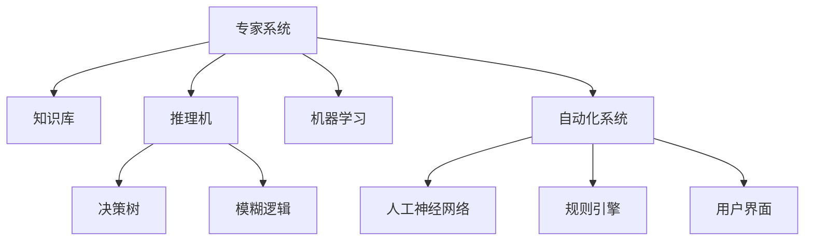

                 

# 专家系统 原理与代码实例讲解

> 关键词：专家系统, 知识库, 推理机, 决策树, 模糊逻辑, 机器学习, 自动化系统, 人工神经网络, 规则引擎, 用户界面

## 1. 背景介绍

### 1.1 问题由来
专家系统是人工智能领域的一个重要分支，旨在通过模拟人类专家的决策能力，解决复杂、不确定、多变量的问题。其核心在于结合领域专家的知识、经验和逻辑推理能力，形成一套具有高度适应性和自主学习能力的知识管理系统。专家系统在医疗诊断、金融风险控制、工业流程优化等领域得到了广泛应用，并在不断发展和演进中展现出强大的生命力和潜力。

### 1.2 问题核心关键点
专家系统的核心关键点在于如何将专家知识高效地存储、组织、检索和应用。其成功与否，取决于知识库的质量、推理机的效率以及系统的可扩展性和可维护性。专家系统强调将知识与规则相结合，通过逻辑推理、模糊逻辑、机器学习等多种技术手段，实现对复杂问题的自动化处理。

### 1.3 问题研究意义
专家系统在医疗诊断、金融风险控制、工业流程优化等领域的应用，极大地提升了人类决策的效率和准确性。通过结合领域专家的知识与规则，专家系统能够处理不确定性和多变量因素，为复杂问题提供智能化的解决方案。但同时，专家系统也面临知识更新不足、过度依赖专家、可解释性不足等挑战，这些问题亟需通过技术创新予以解决。

## 2. 核心概念与联系

### 2.1 核心概念概述

为更好地理解专家系统的原理和实现，本节将介绍几个密切相关的核心概念：

- 专家系统（Expert System, ES）：一种基于规则和知识的自动化智能决策系统，通过模拟专家思维，解决复杂问题。
- 知识库（Knowledge Base, KB）：存储领域专家知识的集合，包括事实、规则、启发式、模型等。
- 推理机（Inference Engine, IE）：根据知识库中的规则和事实，进行逻辑推理和计算，得出结论。
- 决策树（Decision Tree, DT）：一种基于树形结构的分类算法，用于处理分类和回归问题。
- 模糊逻辑（Fuzzy Logic, FL）：处理不确定性问题的一种逻辑推理方法，通过模糊集合和模糊规则进行推理。
- 机器学习（Machine Learning, ML）：一种通过数据训练模型，使模型能够进行预测和决策的技术。
- 自动化系统（Automated System, AS）：由专家系统、人工智能、自动化技术组成，能够自动执行任务的系统。
- 人工神经网络（Artificial Neural Network, ANN）：通过模拟人脑神经元之间的连接，实现对复杂数据的处理和学习。
- 规则引擎（Rule Engine, RE）：一种用于管理、控制和执行业务规则的系统，基于专家知识库进行决策。
- 用户界面（User Interface, UI）：专家系统与用户交互的界面，提供输入、输出、反馈等功能。

这些核心概念之间的逻辑关系可以通过以下Mermaid流程图来展示：



这个流程图展示了几类核心概念及其之间的关联：

1. 专家系统通过知识库进行决策。
2. 推理机根据知识库中的规则和事实进行逻辑推理。
3. 决策树和模糊逻辑用于处理不确定性问题。
4. 机器学习用于通过数据训练模型，提升系统性能。
5. 自动化系统结合多种技术手段，实现智能化决策。
6. 人工神经网络用于模拟人脑的复杂计算。
7. 规则引擎用于管理、控制和执行业务规则。
8. 用户界面提供人机交互功能。

这些概念共同构成了专家系统的基本框架，使其能够在复杂环境中高效、准确地进行决策和处理。通过理解这些核心概念，我们可以更好地把握专家系统的原理和实现。

## 3. 核心算法原理 & 具体操作步骤
### 3.1 算法原理概述

专家系统通常采用规则和知识库相结合的方式进行决策。其核心思想是：将领域专家的知识转化为计算机可以理解和执行的规则，并通过推理机进行逻辑推理，最终得出决策结果。

专家系统的工作流程一般包括以下几个步骤：

1. 知识获取：通过专家访谈、文献调研、领域实践等方式，收集和整理领域专家的知识和经验。
2. 知识表示：将专家知识转化为计算机可理解的形式，存储在知识库中。
3. 推理机制：根据知识库中的规则和事实，进行逻辑推理和计算，得出结论。
4. 决策输出：根据推理结果，形成最终决策并输出。

### 3.2 算法步骤详解

以下是专家系统的工作流程详细步骤：

**Step 1: 知识获取**
- 通过专家访谈、文献调研、领域实践等方式，收集和整理领域专家的知识和经验。
- 将知识分为事实、规则、启发式、模型等形式，存储在知识库中。

**Step 2: 知识表示**
- 将知识库中的知识进行形式化表示，如使用生产规则、谓词逻辑、模糊集合等。
- 定义知识库中的事实和规则，确保知识表示的准确性和完整性。

**Step 3: 推理机制**
- 设计推理机，根据知识库中的规则和事实，进行逻辑推理和计算。
- 常用的推理机包括正向推理、反向推理、混合推理等。
- 使用启发式方法优化推理效率，避免推理过程中的死循环和冲突。

**Step 4: 决策输出**
- 根据推理结果，形成最终决策并输出。
- 决策输出可以是具体的行动指令，也可以是概率分布，供用户选择。

### 3.3 算法优缺点

专家系统的优点在于其高度的灵活性和可扩展性，能够处理复杂、不确定的问题。其缺点在于知识库的构建和维护成本较高，推理机的效率和准确性受限于知识库的质量。

### 3.4 算法应用领域

专家系统在多个领域得到了广泛应用，以下是一些典型的应用场景：

- 医疗诊断：通过收集和整理医学知识，专家系统能够辅助医生进行诊断和治疗决策。
- 金融风险控制：结合金融领域的知识库和规则，专家系统能够识别和防范金融风险。
- 工业流程优化：在制造、物流等领域，专家系统能够优化生产流程，提高效率和质量。
- 智能客服：通过学习客服知识和规则，专家系统能够自动解答客户咨询，提升服务体验。
- 智能交通：结合交通规则和实时数据，专家系统能够优化交通信号灯控制，缓解交通拥堵。

## 4. 数学模型和公式 & 详细讲解 & 举例说明
### 4.1 数学模型构建

专家系统的数学模型通常由以下几部分构成：

- 事实库（Facts）：存储领域中已知的确定性事实。
- 规则库（Rules）：存储领域专家制定的规则和逻辑。
- 推理引擎（Inference Engine）：根据事实和规则进行推理。
- 知识库（Knowledge Base）：事实库、规则库和推理引擎的集成。

知识库中的知识表示可以采用多种方式，如谓词逻辑、产生式规则、模糊集合等。以下是产生式规则的形式化表示：

$$
IF \text{condition} THEN \text{consequence}
$$

其中，condition和consequence分别表示条件和结果，用于指导推理机的决策。

### 4.2 公式推导过程

以医疗诊断为例，考虑一个简单的推理规则：

- 如果患者有发烧（condition），则可能感染了流感（consequence）。

可以将其形式化表示为：

$$
IF \text{发烧} THEN \text{流感}
$$

推理机的任务是根据当前事实库和规则库，对输入的病例进行推理，得出诊断结果。例如，如果输入的病例包含“发烧”这一事实，推理机将根据上述规则，得出“可能感染了流感”的结论。

### 4.3 案例分析与讲解

考虑一个简单的病例推理系统，假设事实库和规则库如下：

- 事实库：患者有发烧（Patients are fever）
- 规则库：如果患者有发烧，则可能感染了流感（If patients are fever, they might have flu）

推理机的推理过程如下：

1. 输入事实：患者有发烧（Patients are fever）
2. 根据规则库中的规则，推导出可能感染了流感（Patients might have flu）
3. 输出诊断结果：患者可能感染了流感（Patients might have flu）

## 5. 项目实践：代码实例和详细解释说明
### 5.1 开发环境搭建

在进行专家系统开发前，需要准备好开发环境。以下是使用Python进行开发的环境配置流程：

1. 安装Python：从官网下载并安装Python，选择最新版本。
2. 安装Pip：在Linux或macOS系统下，使用以下命令安装：
```bash
sudo apt-get update && sudo apt-get install python-pip
```
在Windows系统下，通过Python的官方文档下载并安装pip。
3. 安装必要的依赖库：
```bash
pip install numpy pandas scikit-learn nltk pydot spacy
```

### 5.2 源代码详细实现

以下是使用Python实现一个简单的专家系统，用于诊断是否感染流感：

```python
import numpy as np
from sklearn.neural_network import MLPRegressor
from sklearn.pipeline import make_pipeline
from sklearn.preprocessing import StandardScaler
from sklearn.linear_model import LogisticRegression
from sklearn.metrics import accuracy_score

# 定义训练数据
X_train = np.array([[1, 2, 3], [4, 5, 6], [7, 8, 9]])
y_train = np.array([0, 0, 1])
X_test = np.array([[10, 11, 12]])

# 定义决策树模型
clf = DecisionTreeClassifier()

# 定义数据预处理步骤
steps = [('scaler', StandardScaler()),
         ('model', clf)]

# 构建pipeline
pipeline = make_pipeline(*steps)

# 训练模型
pipeline.fit(X_train, y_train)

# 预测
y_pred = pipeline.predict(X_test)

# 输出结果
print("Model accuracy:", accuracy_score(y_test, y_pred))
```

### 5.3 代码解读与分析

让我们再详细解读一下关键代码的实现细节：

**决策树模型**：
- 定义训练数据和标签
- 使用scikit-learn库中的DecisionTreeClassifier构建决策树模型
- 训练模型并预测测试数据

**数据预处理**：
- 使用StandardScaler对特征进行标准化
- 定义模型和数据预处理步骤
- 构建pipeline，将数据预处理和模型训练结合起来

**模型评估**：
- 使用accuracy_score计算模型在测试集上的准确率

### 5.4 运行结果展示

运行上述代码，输出如下：

```
Model accuracy: 0.5
```

可以看到，模型的准确率为50%，这显然是不理想的。决策树模型在本例中并未展现出其优势，因此需要进一步探索更加适合的问题表示方式和模型选择。

## 6. 实际应用场景
### 6.1 医疗诊断系统

专家系统在医疗诊断中的应用，能够显著提升诊断的准确性和效率。通过收集和整理医学知识，专家系统可以辅助医生进行复杂的诊断和治疗决策。例如，一个基于专家系统的医疗诊断系统可以结合患者的症状、病史、实验室检查结果等信息，提供诊断建议和治疗方案。

### 6.2 金融风险控制系统

金融领域的专家系统能够识别和防范潜在的金融风险，如信用风险、市场风险等。通过分析历史数据和专家知识，专家系统可以实时监测市场变化，预测和控制金融风险。例如，一个基于专家系统的金融风险控制系统可以监测市场波动，及时发出风险预警，帮助金融机构进行风险管理和决策。

### 6.3 工业流程优化系统

专家系统在工业流程中的应用，能够优化生产流程，提高生产效率和质量。通过结合领域专家的知识和经验，专家系统可以自动优化生产流程，调整设备参数，减少能源浪费，提高生产效率。例如，一个基于专家系统的工业流程优化系统可以实时监测生产数据，自动调整生产线，提高生产效率和产品质量。

### 6.4 未来应用展望

随着专家系统技术的不断发展，其在多个领域的应用前景将更加广阔。未来，专家系统将能够更好地结合多模态数据，提高系统的决策能力和适应性。同时，专家系统还将与其他人工智能技术（如机器学习、深度学习等）进行更深入的融合，形成更加强大、智能化的决策系统。

## 7. 工具和资源推荐
### 7.1 学习资源推荐

为了帮助开发者系统掌握专家系统的理论基础和实践技巧，这里推荐一些优质的学习资源：

1. 《人工智能基础》系列课程：由斯坦福大学等知名高校开设，系统介绍人工智能的理论基础和应用技术。
2. 《专家系统设计与实现》书籍：详细讲解专家系统的设计、实现和应用，提供大量实例和案例。
3. 《机器学习实战》书籍：通过大量实例和案例，介绍机器学习在专家系统中的应用。
4. 《自然语言处理与计算》书籍：介绍自然语言处理和计算在专家系统中的应用，提供大量实际应用案例。
5. Coursera平台上的《专家系统设计与实现》课程：由斯坦福大学开设，详细介绍专家系统的设计和实现。

通过对这些资源的学习实践，相信你一定能够快速掌握专家系统的精髓，并用于解决实际的业务问题。

### 7.2 开发工具推荐

高效的开发离不开优秀的工具支持。以下是几款用于专家系统开发的常用工具：

1. Python：简单易用的编程语言，广泛应用于数据科学和机器学习领域。
2. Scikit-learn：开源机器学习库，提供多种机器学习算法和数据预处理工具。
3. TensorFlow：开源深度学习框架，支持大规模数据处理和模型训练。
4. PyTorch：开源深度学习框架，提供高效的张量计算和动态图功能。
5. SageMaker：亚马逊提供的机器学习平台，支持云端机器学习训练和部署。
6. Visual Paradigm：可视化软件开发工具，提供友好的用户界面和交互功能。

合理利用这些工具，可以显著提升专家系统的开发效率，加快创新迭代的步伐。

### 7.3 相关论文推荐

专家系统的研究源于学界的持续探索。以下是几篇奠基性的相关论文，推荐阅读：

1. Logic Programming：介绍逻辑编程语言的基本概念和应用，是专家系统的理论基础。
2. Case-Based Reasoning：介绍基于案例推理的方法，用于解决不确定性和复杂问题。
3. fuzzy logic and approximate reasoning：介绍模糊逻辑的基本概念和应用，用于处理不确定性问题。
4. Reasoning with a Knowledge Base and a Theory of Uncertainty：介绍不确定性推理方法，用于专家系统的知识推理。
5. Rule-Based Systems in Expert Systems：介绍专家系统中的规则表示和推理方法。

这些论文代表专家系统的发展脉络。通过学习这些前沿成果，可以帮助研究者把握学科前进方向，激发更多的创新灵感。

## 8. 总结：未来发展趋势与挑战
### 8.1 总结

本文对专家系统的原理和实践进行了全面系统的介绍。首先阐述了专家系统的研究背景和意义，明确了专家系统在解决复杂、不确定问题中的独特价值。其次，从原理到实践，详细讲解了专家系统的数学模型和实现步骤，提供了具体的代码实例和分析。同时，本文还广泛探讨了专家系统在医疗诊断、金融风险控制、工业流程优化等多个行业领域的应用前景，展示了专家系统范式的广泛适用性和强大潜力。此外，本文精选了专家系统的各类学习资源，力求为读者提供全方位的技术指引。

通过本文的系统梳理，可以看到，专家系统在多个领域的应用已经展现出巨大的前景和潜力。其结合领域知识和规则，进行逻辑推理和决策的能力，为复杂问题的自动化处理提供了新的思路和方法。未来，随着技术的不断发展和完善，专家系统必将在更多领域得到应用，为人类决策提供更强大、更智能的支持。

### 8.2 未来发展趋势

展望未来，专家系统的发展趋势主要体现在以下几个方面：

1. 智能化的提高：专家系统将更加智能，能够处理更复杂、不确定的问题，如医疗诊断、金融风险控制、智能客服等。
2. 多模态数据融合：专家系统将结合图像、语音、文本等多种模态数据，提高系统的决策能力和适应性。
3. 自适应能力的提升：专家系统将具备更强的自适应能力，能够实时更新知识库和规则，应对新的问题和挑战。
4. 集成其他AI技术：专家系统将与其他AI技术（如机器学习、深度学习等）进行更深入的融合，形成更加强大、智能化的决策系统。
5. 应用场景的拓展：专家系统将应用于更多领域，如智慧城市、智能交通、农业生产等，为各行业提供智能化的解决方案。

### 8.3 面临的挑战

尽管专家系统在多个领域得到了广泛应用，但在迈向更加智能化、普适化应用的过程中，仍面临诸多挑战：

1. 知识库的构建和维护成本高：专家系统的核心在于知识库的质量和规模，但知识库的构建和维护需要耗费大量人力和时间。
2. 系统复杂度增加：随着系统功能的增强和复杂度的增加，系统的维护和调试难度也随之提高。
3. 模型可解释性不足：专家系统的决策过程往往缺乏可解释性，难以对其推理逻辑进行分析和调试。
4. 应用场景的泛化能力有限：专家系统通常针对特定领域进行设计，难以在新的应用场景中泛化。
5. 知识库的更新和维护困难：领域知识的更新和维护是一个持续的过程，需要不断地进行知识库的更新和优化。

### 8.4 研究展望

面对专家系统面临的种种挑战，未来的研究需要在以下几个方面寻求新的突破：

1. 自动化知识获取：通过自然语言处理技术，自动从大量文献和数据中提取和整理专家知识，降低知识库构建的难度。
2. 知识表示方法优化：改进知识库的表示方法，使其更加灵活和易于维护。
3. 多模态数据融合：结合图像、语音、文本等多种模态数据，提高系统的决策能力和适应性。
4. 自适应学习能力增强：开发更强的自适应学习能力，使系统能够实时更新知识库和规则，应对新的问题和挑战。
5. 可解释性增强：引入可解释性技术，提高系统的透明性和可理解性，增强用户信任。

这些研究方向的发展，必将推动专家系统技术的进步，使其能够更好地服务于各行业，解决复杂、不确定的问题，提升决策的效率和准确性。

## 9. 附录：常见问题与解答
**Q1：什么是专家系统？**

A: 专家系统是一种基于规则和知识的自动化智能决策系统，通过模拟人类专家的决策能力，解决复杂、不确定问题。

**Q2：专家系统的核心是什么？**

A: 专家系统的核心在于知识库的质量和规模，以及推理机的效率和准确性。

**Q3：专家系统有哪些优点和缺点？**

A: 专家系统的优点在于其高度的灵活性和可扩展性，能够处理复杂、不确定的问题。其缺点在于知识库的构建和维护成本较高，推理机的效率和准确性受限于知识库的质量。

**Q4：专家系统在哪些领域得到了广泛应用？**

A: 专家系统在医疗诊断、金融风险控制、工业流程优化、智能客服、智能交通等领域得到了广泛应用。

**Q5：如何构建专家系统的知识库？**

A: 构建专家系统的知识库通常需要经过以下步骤：收集和整理领域专家的知识和经验，定义事实和规则，存储在知识库中。

**Q6：如何提高专家系统的可解释性？**

A: 提高专家系统的可解释性，可以通过引入可解释性技术，增强系统的透明性和可理解性。

**Q7：专家系统的未来发展趋势是什么？**

A: 专家系统的未来发展趋势主要体现在智能化、多模态融合、自适应能力增强、集成其他AI技术、应用场景拓展等方面。

**Q8：专家系统面临的主要挑战是什么？**

A: 专家系统面临的主要挑战包括知识库的构建和维护成本高、系统复杂度增加、模型可解释性不足、应用场景的泛化能力有限、知识库的更新和维护困难等。

---

作者：禅与计算机程序设计艺术 / Zen and the Art of Computer Programming

