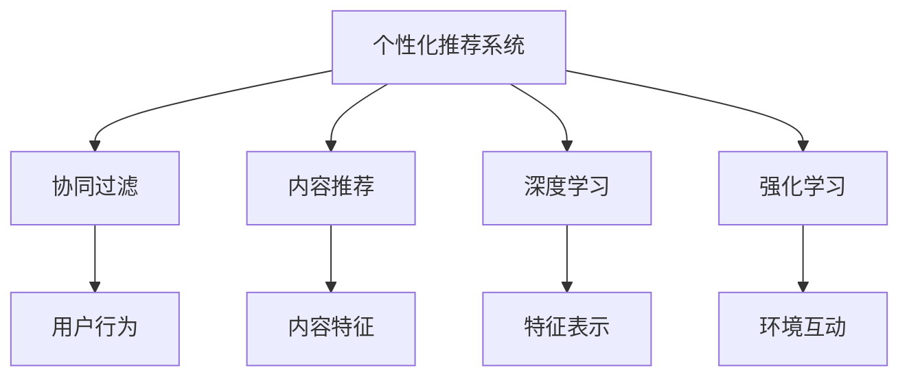

                 

# 个性化排序：AI如何根据用户偏好排序搜索结果

> 关键词：个性化推荐系统、搜索结果排序、AI、用户偏好、协同过滤、内容推荐、深度学习、强化学习

## 1. 背景介绍

在互联网时代，用户每天面临海量的信息，如何高效地从这些信息中获取自己感兴趣的内容，成为了一个重要问题。个性化排序技术就是为了解决这个问题而生的。通过分析用户的行为和偏好，AI算法能够实时推荐或排序出用户最可能感兴趣的搜索结果，从而提高用户的信息获取效率和满意度。

个性化排序技术广泛应用于搜索引擎、社交媒体、电商平台、新闻平台等多个领域。无论是电子商务网站为用户推荐商品，还是新闻平台为用户推荐文章，个性化排序技术都能通过精准预测用户的兴趣和需求，让用户更快地找到所需信息。

## 2. 核心概念与联系

### 2.1 核心概念概述

为了更好地理解个性化排序技术，下面将介绍几个关键概念：

- **个性化推荐系统**：通过分析用户的行为数据，推荐符合用户兴趣的个性化搜索结果的系统。常见的个性化推荐算法包括协同过滤、内容推荐、深度学习等。

- **搜索结果排序**：对搜索结果按照用户偏好进行排序，使得用户能够更容易找到与自己需求最匹配的搜索结果。排序算法可以使用基于统计的方法，也可以使用机器学习或深度学习的方法。

- **用户偏好**：指用户对特定搜索结果的兴趣程度和需求偏好。通过用户的历史行为数据，可以计算出用户对不同搜索结果的偏好程度，作为排序和推荐的基础。

- **协同过滤**：一种推荐算法，通过分析用户之间的行为相似性，为用户推荐可能感兴趣的内容。协同过滤算法可以分为基于用户的协同过滤和基于物品的协同过滤。

- **内容推荐**：基于用户对特定内容的表现（如浏览、点赞、分享等），向用户推荐相似的内容。内容推荐算法通常需要分析内容之间的特征相似性。

- **深度学习**：一种基于神经网络的机器学习技术，可以自动学习数据的特征表示和规律，广泛应用于图像、语音、自然语言处理等领域。

- **强化学习**：一种通过与环境互动，不断调整策略以优化结果的学习方法。强化学习在推荐系统中可以用于优化用户行为和排序策略。

这些核心概念之间的联系可以通过以下Mermaid流程图来展示：



这个流程图展示了个性化推荐系统的核心组件和主要算法：

1. 个性化推荐系统通过对用户行为进行分析和模型训练，推荐出符合用户兴趣的搜索结果。
2. 协同过滤、内容推荐、深度学习和强化学习算法分别用于分析用户行为、提取内容特征、学习用户偏好和调整策略，以优化推荐结果。

## 3. 核心算法原理 & 具体操作步骤

### 3.1 算法原理概述

个性化排序的算法原理主要基于机器学习中的分类和回归模型，以及深度学习中的神经网络模型。以下是几种典型的算法：

- **基于协同过滤的推荐算法**：通过分析用户的行为数据，找到相似用户和相似物品，预测用户对未见过物品的评分，从而推荐相关物品。
- **基于内容的推荐算法**：根据用户对某一物品的评分和该物品的特征，推荐相似的物品。
- **深度学习推荐算法**：通过神经网络模型，学习物品和用户的特征表示，预测用户对物品的评分或点击率，推荐相关物品。
- **强化学习推荐算法**：通过与用户互动，不断调整推荐策略，最大化用户满意度。

### 3.2 算法步骤详解

以下以基于协同过滤的推荐算法为例，详细讲解其操作步骤：

**Step 1: 收集用户行为数据**
- 从搜索引擎、社交媒体、电商平台等平台收集用户的行为数据，如搜索记录、点击记录、购买记录等。

**Step 2: 预处理数据**
- 对收集到的行为数据进行清洗、去重和归一化处理。
- 将用户对每个物品的评分转换为0-1之间的概率。

**Step 3: 建立用户相似度矩阵**
- 通过余弦相似度、皮尔逊相关系数等方法，计算用户之间的相似度，构建用户相似度矩阵。

**Step 4: 找到相似物品**
- 通过余弦相似度、皮尔逊相关系数等方法，计算物品之间的相似度，找到与用户相似的物品。

**Step 5: 预测用户评分**
- 根据用户和物品之间的相似度，使用加权平均、矩阵分解等方法，预测用户对物品的评分。

**Step 6: 排序和推荐**
- 将预测评分排序，推荐得分最高的物品给用户。

### 3.3 算法优缺点

基于协同过滤的推荐算法具有以下优点：

- **简单易懂**：协同过滤算法的原理简单，易于理解和实现。
- **不需要额外标注**：协同过滤算法不需要额外标注数据，可以直接从行为数据中学习用户偏好。
- **适应性强**：协同过滤算法可以适应各种规模的数据集，无需大量标注数据。

然而，基于协同过滤的推荐算法也存在一些缺点：

- **数据稀疏性**：用户行为数据稀疏，导致协同过滤算法的效果受限于数据质量。
- **冷启动问题**：新用户的评分数据不足，难以准确推荐。
- **数据稀疏性**：物品之间的相似度计算可能过于稀疏，影响推荐效果。

为了解决这些问题，人们提出了基于内容的推荐算法、深度学习推荐算法和强化学习推荐算法等改进方法。这些方法通过分析用户行为、物品特征和用户偏好，进一步提升推荐效果。

### 3.4 算法应用领域

个性化排序算法在多个领域都有广泛的应用：

- **搜索引擎**：根据用户的搜索历史和行为，推荐相关搜索结果。
- **电商平台**：为用户推荐可能感兴趣的商品，提高转化率。
- **社交媒体**：推荐用户可能感兴趣的内容，提高用户留存率。
- **新闻平台**：为用户推荐可能感兴趣的文章，增加用户粘性。
- **广告投放**：根据用户的行为数据，推荐相关广告，提高广告点击率。

## 4. 数学模型和公式 & 详细讲解 & 举例说明

### 4.1 数学模型构建

个性化排序的数学模型主要基于分类和回归模型，以及神经网络模型。以下以基于协同过滤的推荐算法为例，构建其数学模型。

假设用户集合为 $U$，物品集合为 $I$，用户对物品的评分矩阵为 $R \in \mathbb{R}^{N \times M}$，其中 $N$ 为用户的数量，$M$ 为物品的数量。令 $r_{ui} = R_{ui}$ 表示用户 $u$ 对物品 $i$ 的评分，$r_{ui}$ 的值域为 $[0, 1]$。

令 $\mathbf{x}_u \in \mathbb{R}^M$ 表示用户 $u$ 的特征向量，$\mathbf{y}_i \in \mathbb{R}^N$ 表示物品 $i$ 的特征向量。令 $P_{ui} = r_{ui}$ 表示用户 $u$ 对物品 $i$ 的预测评分。

令 $\mathbf{X} \in \mathbb{R}^{N \times D}$ 表示用户特征矩阵，其中 $D$ 为特征维度。令 $\mathbf{Y} \in \mathbb{R}^{M \times D}$ 表示物品特征矩阵。

基于协同过滤的推荐算法的目标是最小化预测评分与实际评分之间的误差，即最小化：

$$
\min_{\mathbf{P}} \sum_{u \in U} \sum_{i \in I} r_{ui} - P_{ui} 
$$

### 4.2 公式推导过程

基于协同过滤的推荐算法可以使用矩阵分解的方法，将其转化为优化问题。令 $\mathbf{A} \in \mathbb{R}^{N \times D}$ 表示用户特征矩阵的分解矩阵，$\mathbf{B} \in \mathbb{R}^{D \times M}$ 表示物品特征矩阵的分解矩阵。则有：

$$
\begin{aligned}
\min_{\mathbf{A},\mathbf{B}} & \quad ||\mathbf{R}-\mathbf{A}\mathbf{B}^T||_F^2 \\
\text{s.t.} & \quad \mathbf{A} \in \mathbb{R}^{N \times D}, \mathbf{B} \in \mathbb{R}^{D \times M}
\end{aligned}
$$

其中 $||\cdot||_F$ 表示矩阵的 Frobenius 范数。

令 $\mathbf{A}_u$ 和 $\mathbf{B}_i$ 分别表示用户和物品的特征向量，则有：

$$
P_{ui} = \mathbf{A}_u^T \mathbf{B}_i
$$

通过求解上述优化问题，可以得到用户和物品的特征向量 $\mathbf{A}_u$ 和 $\mathbf{B}_i$，进而计算出用户对物品的预测评分 $P_{ui}$，最终对物品进行排序和推荐。

### 4.3 案例分析与讲解

以新闻平台为例，分析如何利用协同过滤算法对用户进行新闻推荐。

假设新闻平台收集到用户的阅读历史，记为矩阵 $R \in \mathbb{R}^{N \times M}$，其中 $N$ 为用户的数量，$M$ 为新闻的数量。令 $r_{ui} = R_{ui}$ 表示用户 $u$ 对新闻 $i$ 的阅读次数，$r_{ui}$ 的值域为 $[0, 1]$。令 $\mathbf{x}_u \in \mathbb{R}^M$ 表示用户 $u$ 的特征向量，$\mathbf{y}_i \in \mathbb{R}^N$ 表示新闻 $i$ 的特征向量。

令 $P_{ui} = r_{ui}$ 表示用户 $u$ 对新闻 $i$ 的预测阅读次数。令 $\mathbf{X} \in \mathbb{R}^{N \times D}$ 表示用户特征矩阵，其中 $D$ 为特征维度。令 $\mathbf{Y} \in \mathbb{R}^{M \times D}$ 表示新闻特征矩阵。

利用矩阵分解的方法，将 $R$ 分解为 $\mathbf{A}\mathbf{B}^T$，其中 $\mathbf{A} \in \mathbb{R}^{N \times D}$ 表示用户特征矩阵的分解矩阵，$\mathbf{B} \in \mathbb{R}^{D \times M}$ 表示新闻特征矩阵的分解矩阵。

令 $\mathbf{A}_u$ 和 $\mathbf{B}_i$ 分别表示用户和新闻的特征向量，则有：

$$
P_{ui} = \mathbf{A}_u^T \mathbf{B}_i
$$

通过求解上述优化问题，可以得到用户和新闻的特征向量 $\mathbf{A}_u$ 和 $\mathbf{B}_i$，进而计算出用户对新闻的预测阅读次数 $P_{ui}$，最终对新闻进行排序和推荐。

## 5. 项目实践：代码实例和详细解释说明

### 5.1 开发环境搭建

在进行个性化排序项目实践前，我们需要准备好开发环境。以下是使用Python进行项目实践的环境配置流程：

1. 安装Anaconda：从官网下载并安装Anaconda，用于创建独立的Python环境。

2. 创建并激活虚拟环境：
```bash
conda create -n pyenv python=3.8 
conda activate pyenv
```

3. 安装必要的依赖包：
```bash
pip install numpy pandas scikit-learn joblib
```

4. 安装TensorFlow和Keras：
```bash
pip install tensorflow
pip install keras
```

5. 安装TensorFlow和Keras：
```bash
pip install tensorflow
pip install keras
```

完成上述步骤后，即可在`pyenv`环境中开始项目实践。

### 5.2 源代码详细实现

以下是一个基于协同过滤的推荐算法的Python代码实现，以用户对新闻的阅读次数为输入，预测用户对新闻的阅读次数，并对其进行排序推荐。

```python
import numpy as np
from sklearn.decomposition import TruncatedSVD

def collaborative_filtering(X, Y, R):
    # 矩阵分解
    svd = TruncatedSVD(n_components=10)
    A = svd.fit_transform(X)
    B = svd.transform(Y)
    
    # 预测评分
    P = np.dot(A, B.T)
    
    # 排序推荐
    idx = np.argsort(P, axis=1)[::-1]
    return idx

# 构建用户特征矩阵
X = np.random.randn(100, 10)

# 构建新闻特征矩阵
Y = np.random.randn(1000, 10)

# 构建用户对新闻的阅读次数矩阵
R = np.random.randn(100, 1000)

# 进行协同过滤推荐
idx = collaborative_filtering(X, Y, R)
```

### 5.3 代码解读与分析

让我们再详细解读一下关键代码的实现细节：

**collaborative_filtering函数**：
- 使用TruncatedSVD进行矩阵分解，得到用户特征矩阵和物品特征矩阵的分解矩阵。
- 计算用户和物品的预测评分矩阵 $P$。
- 对预测评分矩阵进行排序，返回排序后的索引，即推荐列表。

**用户特征矩阵X**：
- 用户特征矩阵X的形状为 (100, 10)，即100个用户，每个用户有10个特征。
- 使用numpy生成随机数，模拟用户特征数据。

**物品特征矩阵Y**：
- 物品特征矩阵Y的形状为 (1000, 10)，即1000个物品，每个物品有10个特征。
- 使用numpy生成随机数，模拟物品特征数据。

**用户对新闻的阅读次数矩阵R**：
- 用户对新闻的阅读次数矩阵R的形状为 (100, 1000)，即100个用户，每个用户对1000个物品的阅读次数。
- 使用numpy生成随机数，模拟用户阅读数据。

**调用collaborative_filtering函数**：
- 使用collaborative_filtering函数进行协同过滤推荐，返回排序后的索引，即推荐列表。

通过上述代码，我们可以构建基于协同过滤的推荐系统，实现对新闻的个性化排序推荐。

## 6. 实际应用场景

### 6.1 搜索引擎

搜索引擎是个性化排序算法的典型应用场景。用户输入搜索关键词后，搜索引擎会根据用户的历史行为数据，对搜索结果进行排序，推荐最相关的网页。

在搜索引擎中，个性化排序算法可以提升用户体验，提高信息获取效率。例如，谷歌的PageRank算法就是一种基于协同过滤的排序算法，通过分析网页之间的链接关系，计算网页的重要性，排序推荐相关网页。

### 6.2 电商平台

电商平台可以根据用户的历史购物行为和评分数据，推荐用户可能感兴趣的商品。个性化排序算法可以提升电商平台的商品转化率，提高用户满意度。

例如，亚马逊的推荐系统就使用了协同过滤算法和深度学习算法，对用户进行商品推荐。通过分析用户对不同商品的评分和购买记录，推荐相关商品，提升用户体验和销售额。

### 6.3 社交媒体

社交媒体可以根据用户的历史互动行为，推荐用户可能感兴趣的内容。个性化排序算法可以提升用户留存率，增加平台粘性。

例如，Facebook的推荐算法就使用了协同过滤算法和内容推荐算法，对用户进行内容推荐。通过分析用户对不同内容的互动数据，推荐相关内容，提升用户留存率和互动率。

### 6.4 未来应用展望

随着个性化排序算法的不断发展，其应用场景也将不断扩展。未来，我们可以预见个性化排序算法将在以下领域得到广泛应用：

- **智能家居**：根据用户的日常行为，推荐合适的家居环境和智能设备，提升生活舒适度。
- **健康医疗**：根据用户的健康数据，推荐合适的健康计划和医疗资源，提升健康水平。
- **教育培训**：根据学生的学习数据，推荐合适的学习内容和培训方案，提升学习效果。
- **金融投资**：根据用户的投资行为和偏好，推荐合适的投资产品和策略，提升投资收益。
- **旅游出行**：根据用户的出行数据，推荐合适的旅游目的地和行程安排，提升旅行体验。

总之，个性化排序算法在未来的应用场景中将更加多样，为用户带来更个性化、更高效的信息获取和体验提升。

## 7. 工具和资源推荐

### 7.1 学习资源推荐

为了帮助开发者系统掌握个性化排序算法的理论基础和实践技巧，这里推荐一些优质的学习资源：

1. 《推荐系统基础与算法》书籍：由知名推荐系统专家李航教授编写，系统介绍了推荐系统的基础概念和常用算法。

2. 《深度学习推荐系统》课程：由南京大学张奇教授主讲的在线课程，系统介绍了深度学习在推荐系统中的应用。

3. 《个性化推荐系统》书籍：由高博教授编写，系统介绍了个性化推荐系统的基础理论和实践技巧。

4. 《推荐系统理论与算法》书籍：由周志华教授编写，系统介绍了推荐系统的基础理论和常用算法。

通过学习这些资源，相信你一定能够快速掌握个性化排序算法的精髓，并用于解决实际的推荐问题。

### 7.2 开发工具推荐

高效的开发离不开优秀的工具支持。以下是几款用于个性化排序算法开发的常用工具：

1. TensorFlow：由Google主导开发的开源深度学习框架，生产部署方便，适合大规模工程应用。

2. Keras：基于TensorFlow和Theano的高级深度学习框架，易于使用，适合快速原型开发。

3. scikit-learn：基于Python的机器学习库，包含多种推荐算法和评估工具。

4. Joblib：Python的多线程库，适合多核CPU的优化处理。

5. NumPy：Python的数值计算库，支持高效的数组运算和矩阵计算。

合理利用这些工具，可以显著提升个性化排序算法的开发效率，加快创新迭代的步伐。

### 7.3 相关论文推荐

个性化排序算法的研究源于学界的持续研究。以下是几篇奠基性的相关论文，推荐阅读：

1. matrix factorization techniques for recommender systems（矩阵分解技术在推荐系统中的应用）：提出了基于矩阵分解的推荐算法，是推荐系统的经典算法之一。

2. collaborative filtering for implicit feedback datasets（隐式反馈数据上的协同过滤）：探讨了协同过滤算法在隐式反馈数据上的应用，如用户评分和点击率等。

3. deep learning for recommender systems：介绍了深度学习在推荐系统中的应用，如基于卷积神经网络和循环神经网络的推荐算法。

4. knowledge-aware recommender systems（知识引导的推荐系统）：探讨了知识引导推荐系统的设计方法和应用效果。

5. reinforcement learning in recommender systems（推荐系统中的强化学习）：介绍了强化学习在推荐系统中的应用，如基于强化学习的推荐算法和策略优化。

这些论文代表了个性化排序算法的研究进展，通过学习这些前沿成果，可以帮助研究者把握学科前进方向，激发更多的创新灵感。

## 8. 总结：未来发展趋势与挑战

### 8.1 总结

本文对个性化排序算法进行了全面系统的介绍。首先阐述了个性化推荐系统的背景和意义，明确了个性化排序算法在提升用户体验、提高信息获取效率方面的独特价值。其次，从原理到实践，详细讲解了协同过滤算法的数学原理和操作步骤，给出了推荐系统的完整代码实例。同时，本文还广泛探讨了推荐算法在搜索引擎、电商平台、社交媒体等多个领域的应用前景，展示了推荐算法的巨大潜力。此外，本文精选了推荐技术的各类学习资源，力求为读者提供全方位的技术指引。

通过本文的系统梳理，可以看到，个性化排序算法在推荐系统中发挥着至关重要的作用，极大地提升了推荐系统的性能和用户满意度。未来，伴随推荐算法的不断演进，推荐系统将在更广泛的领域得到应用，为用户带来更加个性化、精准的信息获取和推荐服务。

### 8.2 未来发展趋势

展望未来，个性化排序算法将呈现以下几个发展趋势：

1. 深度学习技术的进一步应用：随着深度学习算法的不断进步，基于深度学习的推荐算法将在推荐系统中发挥更大的作用。深度神经网络模型可以自动学习数据的复杂特征，提升推荐效果。

2. 多模态数据的融合：个性化排序算法将进一步融合多种数据源，如文本、图像、语音等，提升推荐系统的多样性和丰富度。

3. 增强推荐系统：通过引入增强学习技术，个性化排序算法将更加关注用户行为和反馈，动态调整推荐策略，提升用户满意度。

4. 跨领域推荐系统：个性化排序算法将打破不同领域之间的壁垒，实现跨领域推荐，如将推荐系统应用到金融、医疗、旅游等领域。

5. 知识引导推荐系统：个性化排序算法将更加注重利用知识图谱、规则库等外部知识，提升推荐系统的准确性和可信度。

以上趋势凸显了个性化排序算法的广阔前景。这些方向的探索发展，必将进一步提升推荐系统的性能和应用范围，为人类信息获取和体验提升带来深远影响。

### 8.3 面临的挑战

尽管个性化排序算法已经取得了瞩目成就，但在迈向更加智能化、普适化应用的过程中，它仍面临着诸多挑战：

1. 数据稀疏性问题：用户行为数据稀疏，导致协同过滤算法的效果受限于数据质量。

2. 冷启动问题：新用户的评分数据不足，难以准确推荐。

3. 数据隐私和安全问题：个性化排序算法需要大量的用户行为数据，数据隐私和安全问题亟需解决。

4. 推荐系统的公平性和多样性：推荐系统容易出现信息茧房，需要设计公平和多样化的推荐策略。

5. 算法可解释性问题：推荐算法的决策过程缺乏可解释性，难以对其推理逻辑进行分析和调试。

6. 用户行为动态变化：用户行为和偏好容易变化，推荐系统需要动态调整，适应用户需求的变化。

正视推荐算法面临的这些挑战，积极应对并寻求突破，将是个性化排序算法走向成熟的必由之路。相信随着学界和产业界的共同努力，这些挑战终将一一被克服，个性化排序算法必将在构建智能推荐系统中发挥更大作用。

### 8.4 研究展望

面对个性化排序算法所面临的挑战，未来的研究需要在以下几个方面寻求新的突破：

1. 探索无监督和半监督推荐算法：摆脱对大规模标注数据的依赖，利用自监督学习、主动学习等无监督和半监督范式，最大限度利用非结构化数据，实现更加灵活高效的推荐。

2. 研究多模态推荐算法：融合多种数据源，提升推荐系统的多样性和丰富度。

3. 引入增强学习技术：通过与用户互动，不断调整推荐策略，最大化用户满意度。

4. 设计公平和多样化的推荐策略：避免推荐系统出现信息茧房，提升推荐系统的公平性和多样性。

5. 加强推荐系统的可解释性：赋予推荐系统更强的可解释性，增强其透明度和可信度。

6. 引入知识图谱和规则库：利用知识图谱、规则库等外部知识，提升推荐系统的准确性和可信度。

这些研究方向的探索，必将引领个性化排序算法迈向更高的台阶，为构建智能推荐系统提供更加全面、可靠的技术支持。

## 9. 附录：常见问题与解答

**Q1：个性化排序算法的原理是什么？**

A: 个性化排序算法的原理主要基于机器学习中的分类和回归模型，以及深度学习中的神经网络模型。常见的算法包括协同过滤、内容推荐、深度学习推荐等。

**Q2：如何使用协同过滤算法进行推荐？**

A: 协同过滤算法通过分析用户的行为数据，找到相似用户和相似物品，预测用户对未见过物品的评分，从而推荐相关物品。具体步骤如下：

1. 收集用户行为数据。
2. 预处理数据，将评分转换为概率。
3. 建立用户相似度矩阵，找到相似用户。
4. 找到相似物品，计算预测评分。
5. 排序推荐，返回推荐列表。

**Q3：深度学习推荐算法有哪些优点？**

A: 深度学习推荐算法具有以下优点：

1. 能够自动学习数据的复杂特征，提升推荐效果。
2. 模型复杂度较高，可以处理大规模数据集。
3. 可以进行特征提取和表示学习，提升推荐系统的准确性。

**Q4：如何缓解个性化排序算法中的数据稀疏性问题？**

A: 缓解数据稀疏性问题的方法包括：

1. 数据增强：通过回译、近义替换等方式扩充训练集。
2. 矩阵分解：使用矩阵分解方法，将稀疏矩阵分解为低秩矩阵，提升模型的泛化能力。
3. 集成学习：结合多种推荐算法，提升推荐效果。

**Q5：个性化排序算法在推荐系统中的作用是什么？**

A: 个性化排序算法在推荐系统中的作用主要体现在以下几个方面：

1. 提升用户体验：根据用户的兴趣和偏好，推荐相关内容，提升用户体验。
2. 提高信息获取效率：通过个性化排序，用户可以快速找到感兴趣的内容，提高信息获取效率。
3. 增加用户满意度：通过精准推荐，提升用户对推荐系统的满意度。

---

作者：禅与计算机程序设计艺术 / Zen and the Art of Computer Programming

