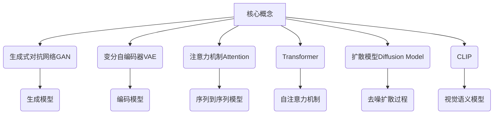
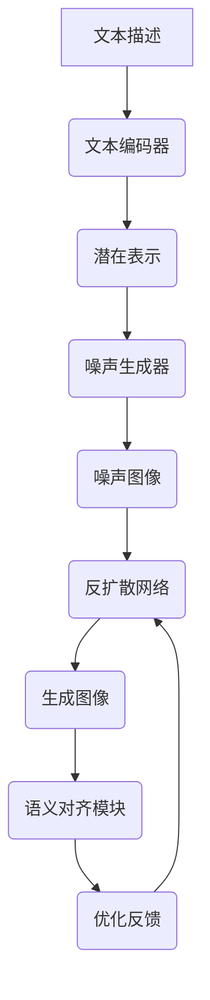

# AIGC从入门到实战：提升：Midjourney 让我们人人都能成为设计师

## 1. 背景介绍

### 1.1 问题的由来

在过去的几十年里，人工智能(AI)和计算机图形学(CG)领域取得了长足的进步,尤其是近年来生成式AI(Generative AI)的兴起,使得AI在图像、视频、音频等多媒体内容生成方面展现出了令人惊叹的能力。其中,AIGC(AI Generated Content,AI生成内容)就是一个备受瞩目的热门领域。

作为AIGC领域的佼佼者,Midjourney凭借其强大的文本到图像生成能力,让普通用户只需输入一些文字描述,就能生成出逼真的高质量图像,彻底颠覆了传统的设计流程。这不仅大大降低了图像设计的门槛,也为创意设计领域带来了全新的可能性。

### 1.2 研究现状

目前,Midjourney已经在各个领域获得了广泛的应用,例如:

- **艺术创作**:艺术家可以使用Midjourney快速生成草图,为创作提供灵感和方向。
- **产品设计**:设计师可以使用Midjourney生成各种产品的概念图和渲染图,加快设计流程。
- **营销广告**:营销人员可以使用Midjourney生成吸引眼球的广告图像,提高营销效果。
- **教育领域**:教师可以使用Midjourney生成直观的教学图像,帮助学生更好地理解抽象概念。

然而,Midjourney作为一款AI工具,其使用过程中也存在一些挑战和限制,例如:

- **语义理解**:如何精准地将文字描述转化为所需的图像,是一个值得深入研究的问题。
- **图像质量**:生成的图像质量受到训练数据和模型结构的限制,在某些场景下可能会出现失真或不自然的情况。
- **版权问题**:生成的图像可能会涉及到版权纠纷,需要明确相关法律法规。
- **伦理道德**:AI生成内容可能会被滥用,产生一些负面影响,需要制定相应的伦理准则。

### 1.3 研究意义

深入研究和探索Midjourney及其背后的AIGC技术,对于推动AI在多媒体内容生成领域的发展具有重要意义。通过本文的介绍和分析,读者可以:

1. 全面了解Midjourney的工作原理、核心算法和数学模型。
2. 掌握使用Midjourney进行图像生成的实践技巧和经验。
3. 认识到AIGC技术的应用前景,并了解其面临的挑战和发展趋势。
4. 获取相关的学习资源和工具推荐,助力自身在AIGC领域的成长。

### 1.4 本文结构

本文将从以下几个方面全面介绍Midjourney:

1. 核心概念与联系
2. 核心算法原理与具体操作步骤
3. 数学模型和公式详细讲解与案例分析
4. 项目实践:代码实例和详细解释说明
5. 实际应用场景
6. 工具和资源推荐
7. 总结:未来发展趋势与挑战
8. 附录:常见问题与解答

## 2. 核心概念与联系

在深入探讨Midjourney的细节之前,我们需要先了解一些核心概念,这些概念贯穿于Midjourney的整个工作流程中,对于理解其原理至关重要。

### 2.1 生成式对抗网络GAN

生成式对抗网络(Generative Adversarial Network, GAN)是一种由生成模型和判别模型组成的无监督学习框架。其中,生成模型的目标是生成逼真的数据样本,而判别模型则试图区分生成的数据和真实数据。通过生成模型和判别模型的对抗训练,GAN可以学习到数据的真实分布,并生成新的、逼真的数据样本。

GAN在图像生成领域有着广泛的应用,Midjourney也借鉴了GAN的思想,使用生成模型生成图像,并通过判别模型对生成结果进行评估和优化。

### 2.2 变分自编码器VAE

变分自编码器(Variational Autoencoder, VAE)是一种基于深度学习的生成模型,它可以学习数据的潜在表示,并从该潜在空间中采样生成新的数据样本。

VAE由两个主要部分组成:编码器(Encoder)和解码器(Decoder)。编码器将输入数据(如图像)映射到潜在空间的潜在表示,而解码器则从潜在表示中重构出原始数据。通过最小化重构损失和正则化潜在表示的KL散度,VAE可以学习到数据的概率分布,并生成新的样本。

在Midjourney中,VAE被用于从文本描述到图像的映射过程,将文本编码为潜在表示,然后通过解码器生成相应的图像。

### 2.3 注意力机制Attention

注意力机制(Attention Mechanism)是一种允许模型selectively关注输入数据的不同部分的技术。它通过为输入序列中的每个元素分配不同的权重,使模型能够更好地捕捉输入数据中的重要信息,从而提高模型的性能。

在Midjourney中,注意力机制被广泛应用于文本到图像的生成过程中,帮助模型更好地理解和关注文本描述中的关键信息,生成与描述相符的图像。

### 2.4 Transformer

Transformer是一种基于注意力机制的序列到序列(Sequence-to-Sequence)模型,它不仅在自然语言处理领域取得了巨大成功,在计算机视觉领域也展现出了强大的能力。

Transformer的核心是自注意力机制(Self-Attention Mechanism),它允许模型在计算目标序列的每个位置时,都可以关注到源序列的所有位置,从而捕捉长距离依赖关系。这使得Transformer能够更好地处理长序列,并在许多任务上取得了出色的表现。

在Midjourney中,Transformer被用于将文本描述编码为潜在表示,并将该潜在表示解码为图像,实现了文本到图像的高效生成。

### 2.5 扩散模型Diffusion Model

扩散模型(Diffusion Model)是一种基于马尔可夫链的生成模型,它通过一系列的扩散(噪声注入)和反扩散(去噪)步骤,从随机噪声中生成所需的数据样本。

扩散模型的工作原理可以简单概括为:首先将数据(如图像)逐步添加噪声,直到完全变为纯噪声;然后通过学习的反扩散过程,从纯噪声中逐步恢复出原始的数据。这种生成过程具有很强的理论基础,并且可以产生高质量、多样化的样本。

Midjourney采用了扩散模型的思想,通过学习文本描述和图像之间的映射关系,实现了从文本描述到图像的生成。

### 2.6 CLIP

CLIP(Contrastive Language-Image Pre-training)是一种用于视觉语义理解的双编码器模型,它通过对比学习的方式,学习将图像和文本映射到同一个潜在空间,从而实现跨模态的语义对齐。

CLIP的核心思想是:将图像和文本输入到两个独立的编码器中,然后最小化它们在潜在空间中的对比损失,使得语义相似的图像-文本对的潜在表示更接近,而不相似的对则相距较远。通过这种方式,CLIP可以学习到视觉语义的共享表示,并应用于各种视觉语言任务。

在Midjourney中,CLIP被用于评估生成图像与文本描述的语义一致性,从而指导生成模型优化图像生成过程,产生更贴合文本描述的图像结果。

上述这些核心概念相互关联、相辅相成,共同构建了Midjourney强大的文本到图像生成能力。接下来,我们将详细探讨Midjourney的核心算法原理和数学模型。

## 3. 核心算法原理与具体操作步骤

### 3.1 算法原理概述

Midjourney的核心算法原理可以概括为:首先将文本描述编码为潜在表示,然后将该潜在表示解码为初始的噪声图像;接着通过反扩散过程,从噪声图像中逐步恢复出与文本描述相符的目标图像。

整个过程可以分为以下几个主要步骤:

1. **文本编码**:使用Transformer等模型将文本描述编码为潜在表示。
2. **噪声生成**:根据潜在表示,生成初始的噪声图像。
3. **反扩散**:通过反扩散网络,逐步去除噪声图像中的噪声,恢复出目标图像。
4. **语义对齐**:使用CLIP等模型评估生成图像与文本描述的语义一致性,并根据评估结果优化生成过程。

上述算法原理结合了多种先进的深度学习技术,如Transformer、扩散模型、对比学习等,实现了高质量的文本到图像生成。接下来,我们将详细介绍每个步骤的具体操作步骤。

### 3.2 算法步骤详解

#### 3.2.1 文本编码

文本编码阶段的目标是将文本描述映射到一个连续的潜在空间中,作为后续图像生成的条件。常用的文本编码器包括Transformer、BERT等模型。

具体操作步骤如下:

1. 对文本描述进行预处理,包括分词、词嵌入等。
2. 将预处理后的文本输入到Transformer编码器中。
3. 使用自注意力机制捕捉文本中的长距离依赖关系。
4. 对编码器的最后一层输出进行平均池化,得到文本的潜在表示向量。

$$\boldsymbol{z} = \text{AvgPool}(\text{Transformer}(\boldsymbol{x}))$$

其中,$\boldsymbol{x}$表示输入文本序列,$\boldsymbol{z}$表示潜在表示向量。

#### 3.2.2 噪声生成

根据文本的潜在表示向量,我们需要生成一个初始的噪声图像,作为反扩散过程的起点。这一步通常由一个先验噪声模型(Prior Noise Model)完成。

噪声生成的具体步骤如下:

1. 将文本的潜在表示向量$\boldsymbol{z}$输入到一个全连接网络中,得到一个参数向量$\boldsymbol{\theta}$。
2. 使用参数向量$\boldsymbol{\theta}$对一个高斯噪声分布进行重参数化,得到条件噪声分布$q_{\boldsymbol{\theta}}(\boldsymbol{x}_0)$。
3. 从条件噪声分布$q_{\boldsymbol{\theta}}(\boldsymbol{x}_0)$中采样,生成初始的噪声图像$\boldsymbol{x}_0$。

$$\boldsymbol{\theta} = \text{MLP}(\boldsymbol{z})$$
$$\boldsymbol{x}_0 \sim q_{\boldsymbol{\theta}}(\boldsymbol{x}_0)$$

其中,$\text{MLP}$表示多层感知机网络,$q_{\boldsymbol{\theta}}(\boldsymbol{x}_0)$是以$\boldsymbol{\theta}$为参数的条件噪声分布。

#### 3.2.3 反扩散

反扩散阶段是整个算法的核心部分,它的目标是从噪声图像$\boldsymbol{x}_0$中