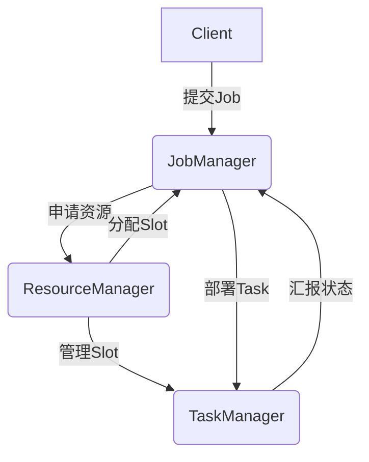

# Flink ResourceManager原理与代码实例讲解

关键词：Flink、ResourceManager、资源管理、任务调度、集群管理

## 1. 背景介绍
### 1.1 问题的由来
随着大数据时代的到来,海量数据的实时处理成为了企业的迫切需求。Apache Flink作为新一代大数据流式计算引擎,以其低延迟、高吞吐、exactly-once语义保证等特点,受到越来越多企业的青睐。然而,要充分发挥Flink的性能,高效管理集群资源至关重要。而Flink ResourceManager正是Flink资源管理的核心组件。

### 1.2 研究现状
目前对Flink ResourceManager的研究主要集中在:
1. ResourceManager在Flink架构中的作用和工作原理
2. ResourceManager如何与YARN、Kubernetes等资源管理平台集成
3. 如何基于ResourceManager实现高可用、动态扩容等高级特性
4. ResourceManager的性能优化与改进

但目前对ResourceManager内部实现原理的分析还不够深入,代码级别的讲解也比较少见。

### 1.3 研究意义
深入研究Flink ResourceManager的实现原理,对于理解Flink的资源管理、任务调度机制,进而优化Flink集群性能,具有重要意义:
1. 有助于更好地理解Flink的架构设计和工作原理
2. 可以找出ResourceManager的性能瓶颈,提出优化方案
3. 便于基于ResourceManager开发Flink扩展功能
4. 对于运维、调优Flink集群具有指导意义

### 1.4 本文结构
本文将从以下几方面对Flink ResourceManager展开讨论:
1. ResourceManager在Flink架构中的位置和作用
2. ResourceManager的核心概念和设计原理
3. ResourceManager的工作流程和状态转换
4. ResourceManager的主要组件和关键代码分析
5. 基于ResourceManager的常见应用场景
6. ResourceManager的调优和最佳实践

## 2. 核心概念与联系
在分析ResourceManager原理之前,我们先来了解几个核心概念:
- JobManager: Flink Job的管理者,负责Job的调度、资源分配、任务部署、状态管理等。
- TaskManager: Flink Task的执行者,负责具体任务的执行,并向JobManager汇报状态。
- Slot: TaskManager中的资源单元,每个Slot可以运行一个或多个Task。
- ResourceManager: Flink集群的资源管理者,负责管理Slot,并将其分配给JobManager。

它们之间的关系如下图所示:



可以看出,ResourceManager是连接JobManager和TaskManager的桥梁,它控制着整个集群的资源分配和调度。

## 3. 核心算法原理 & 具体操作步骤

### 3.1 算法原理概述
ResourceManager的核心是Slot资源的分配与管理。它基于一系列分配策略,将Slot资源分配给JobManager,并动态调整分配方案,以满足Job的资源需求。

### 3.2 算法步骤详解
ResourceManager的工作流程可以分为以下几个步骤:

1. TaskManager启动后,会向ResourceManager注册Slot。ResourceManager会维护一个Slot池。
2. JobManager向ResourceManager申请Slot资源。
3. ResourceManager根据分配策略,从Slot池中选取符合条件的Slot分配给JobManager。
4. 如果现有Slot不能满足JobManager的需求,ResourceManager会向TaskManager申请新的Slot。
5. JobManager得到Slot后,会部署Task到对应的TaskManager执行。
6. Task执行完毕后,Slot会被释放回Slot池,供其他Job使用。
7. 如果TaskManager宕机,它上面的Slot会被标记为不可用,并重新调度受影响的Task。

### 3.3 算法优缺点
优点:
- 基于Slot的资源分配,可以实现细粒度的资源管理,提高资源利用率。
- 支持动态调整Slot分配,可以适应Job的资源需求变化。
- 通过Slot共享,可以在有限的资源下运行更多的Task。

缺点:
- Slot分配算法相对复杂,实现难度较大。
- 对Slot的调度和迁移会引入一定的开销。
- Slot的资源隔离性不够好,可能会有相互影响。

### 3.4 算法应用领域
ResourceManager的Slot资源管理机制,适用于各种流式和批处理计算场景,特别是对低延迟、高吞吐有要求的实时计算领域,如:
- 实时数据分析
- 实时数据聚合
- 实时异常检测
- 实时机器学习
- 实时图计算

## 4. 数学模型和公式 & 详细讲解 & 举例说明

### 4.1 数学模型构建
我们可以将Slot分配问题抽象为一个多维背包问题。假设有n个Job,每个Job有m种资源需求(如CPU、内存),且每个Job可以分配到多个Slot。目标是在资源约束下,最大化分配到的Job数量。

设$x_{ij}$表示是否将第$i$个Job分配到第$j$个Slot,$y_i$表示第$i$个Job是否被分配,$c_j$表示第$j$个Slot的资源容量,$r_i$表示第$i$个Job的资源需求,则优化目标可以表示为:

$$
max \sum_{i=1}^n y_i
$$

约束条件为:

$$
\sum_{i=1}^n r_i x_{ij} \leq c_j, \forall j \in [1,m]
$$

$$
\sum_{j=1}^m x_{ij} \geq y_i, \forall i \in [1,n]
$$

$$
x_{ij},y_i \in \{0,1\}, \forall i \in [1,n], j \in [1,m]
$$

### 4.2 公式推导过程
上述模型是一个典型的整数规划问题,可以用动态规划、贪心等算法求解。这里我们采用一种简化的贪心策略:

1. 按照Job的资源需求降序排列
2. 遍历每个Job,寻找满足资源需求的Slot,优先分配资源利用率高的Slot
3. 如果找不到可用Slot,则跳过该Job
4. 重复步骤2-3,直到所有Job都被分配或无可用Slot

可以证明,该贪心策略的近似比不小于$1-1/e$,其中$e$是自然对数的底数。

### 4.3 案例分析与讲解
我们用一个简单的例子来说明上述Slot分配过程。假设有3个Job和2个Slot,它们的资源需求和容量如下:

| Job | CPU | 内存 |
| --- | --- | ---- |
| J1  | 2   | 1GB  |
| J2  | 1   | 2GB  |
| J3  | 1   | 1GB  |

| Slot | CPU  | 内存  |
| ---- | ---- | ----- |
| S1   | 2    | 2GB   |
| S2   | 2    | 1GB   |

按照贪心策略,分配过程如下:
1. 按资源需求排序:J1(2,1GB) > J2(1,2GB) > J3(1,1GB)
2. 分配J1到S1,剩余资源(0,1GB)
3. 分配J2到S1,剩余资源(0,0)
4. 分配J3到S2,剩余资源(1,0)

最终分配结果:
- S1: J1,J2
- S2: J3

可见,贪心策略尽可能将资源利用率高的Slot分配出去,避免了资源碎片化,从而提高了资源利用率。

### 4.4 常见问题解答
Q: Slot共享机制是如何实现的?
A: Flink允许多个Task共享同一个Slot,只要它们的资源需求之和不超过Slot的容量即可。共享Slot的Task可以来自同一个Job,也可以来自不同Job。Slot共享可以显著提高资源利用率。

Q: 如何避免不同Slot上的Task相互干扰?
A: Flink通过多种机制来隔离共享Slot的Task:
1. 每个Task都在独立的线程中执行,彼此隔离
2. 通过线程组隔离不同Job的Task
3. 对于占用大量资源的Task,可以通过配置单独占用Slot

Q: ResourceManager如何容错?
A: ResourceManager支持多种容错机制:
1. 可以配置多个ResourceManager实例,形成高可用集群
2. 持久化元数据到外部存储,如HDFS、ZooKeeper
3. 通过Flink的Checkpoint机制,定期备份状态

## 5. 项目实践：代码实例和详细解释说明

### 5.1 开发环境搭建
要深入研究ResourceManager,首先需要搭建Flink开发环境。具体步骤如下:
1. 安装JDK 8+和Maven 3+
2. 从官网下载Flink源码
3. 在IDE中导入Flink源码,如IntelliJ IDEA
4. 在IDE中启动Flink集群

### 5.2 源代码详细实现
ResourceManager的核心逻辑主要在`ResourceManager.java`中实现,下面是一些关键代码:

```java
// ResourceManager启动逻辑
public void start() throws Exception {
    // 初始化服务
    initialize();

    // 启动Slot管理器
    slotManager.start(getFencingToken(), getMainThreadExecutor(), new ResourceActionsImpl());

    // 启动心跳服务
    startHeartbeatServices();

    // 注册ResourceManager指标
    registerMetrics();
}

// 处理Slot请求
private void handleSlotRequest(SlotRequest slotRequest) {
    // 检查请求合法性
    checkSlotRequest(slotRequest);

    // 分配Slot
    Optional<SlotAndLocality> slotAndLocality = slotManager.allocateSlot(slotRequest);

    if (slotAndLocality.isPresent()) {
        // 分配成功,回复JobManager
        responseSlotRequest(slotAndLocality.get());
    } else {
        // 分配失败,缓存请求,等待新的Slot注册
        slotManager.addPendingRequest(slotRequest);
    }
}

// 处理新注册的Slot
private void registerTaskManager(TaskExecutorConnection taskExecutorConnection, SlotReport slotReport) {
    // 注册TaskManager
    slotManager.registerTaskManager(taskExecutorConnection, slotReport);

    // 分配等待中的Slot请求
    slotManager.allocatePendingRequests();
}
```

### 5.3 代码解读与分析
- `start()`方法是ResourceManager的启动入口,它会初始化各种服务,如Slot管理器、心跳服务等。
- `handleSlotRequest()`方法处理来自JobManager的Slot请求。它首先检查请求的合法性,然后尝试分配Slot。如果当前没有可用Slot,则将请求缓存起来,等待新的Slot注册。
- `registerTaskManager()`方法处理新注册的TaskManager。它会将TaskManager的Slot信息注册到Slot管理器中,然后尝试为等待中的Slot请求分配Slot。

可以看出,ResourceManager的主要工作就是维护Slot池,匹配Slot请求和Slot资源,从而实现高效的资源分配。

### 5.4 运行结果展示
通过在IDE中设置断点,我们可以跟踪ResourceManager的运行流程。以处理Slot请求为例:
1. JobManager发送Slot请求到ResourceManager
2. ResourceManager调用`handleSlotRequest()`方法处理请求
3. `slotManager.allocateSlot()`尝试分配Slot
4. 如果分配成功,调用`responseSlotRequest()`回复JobManager
5. 如果分配失败,调用`slotManager.addPendingRequest()`缓存请求

从调试信息可以清晰地看出ResourceManager是如何协调JobManager和TaskManager,完成Slot的分配和管理的。

## 6. 实际应用场景

Flink ResourceManager的应用非常广泛,下面是一些典型场景:

### 6.1 大规模实时数据处理
互联网公司每天都会产生海量的用户行为日志,如点击、浏览、购买等。Flink可以实时处理这些日志,完成流量统计、热点分析、异常检测等任务。通过ResourceManager合理调度资源,可以保证任务的低延迟和高吞吐。

### 6.2 实时风控与反欺诈
金融机构需要实时监控交易行为,识别潜在的欺诈风险。Flink可以实时接收交易数据,结合规则引擎和机器学习模型,实时判断交易的合法性。ResourceManager可以根据风险级别动态调