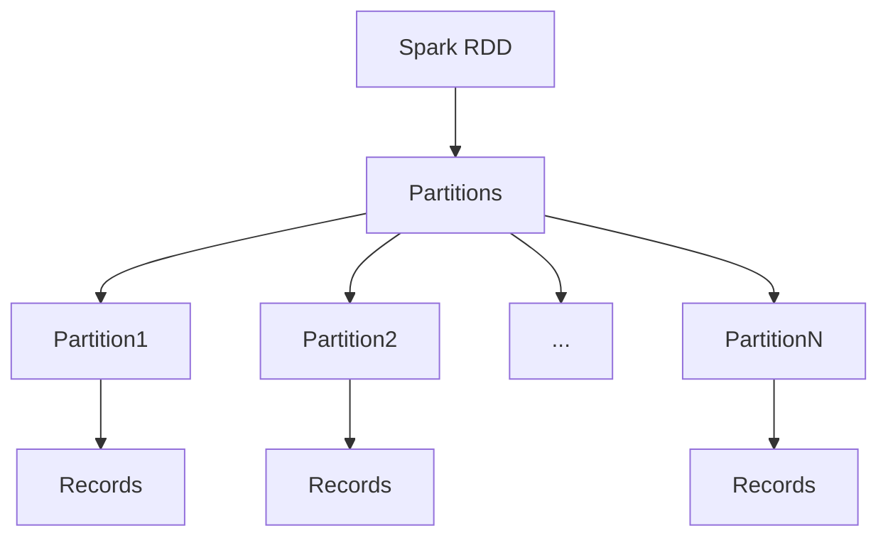
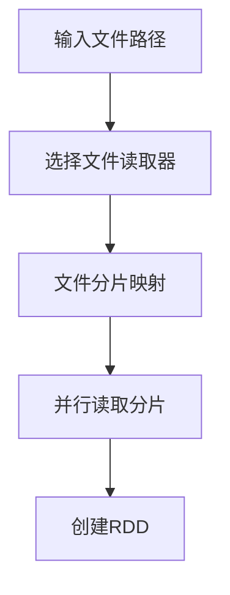
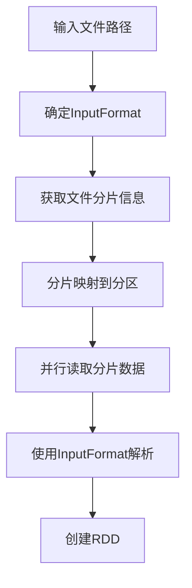

# 《SparkRDD数据读取：readTextFile和HadoopRDD》

## 1. 背景介绍

### 1.1 问题的由来

在大数据时代，数据的规模和复杂性都在不断增长。传统的数据处理方式已经无法满足现代应用的需求。Apache Spark作为一种快速、通用的大规模数据处理引擎,它提供了RDD(Resilient Distributed Dataset)这一核心抽象,使得分布式数据处理变得更加高效和容错。

### 1.2 研究现状

Spark RDD支持多种数据源,包括本地文件系统、HDFS、HBase、Cassandra等。其中,从文本文件读取数据是最基本和常见的操作之一。Spark提供了两种主要方式来读取文本文件数据:readTextFile和HadoopRDD。

### 1.3 研究意义

对于数据密集型应用,高效地从文件系统读取数据是非常关键的一个环节。readTextFile和HadoopRDD方法在不同场景下各有优缺点,了解它们的工作原理、性能特点和使用场景,可以帮助开发人员选择最合适的方式,从而优化数据处理流程,提高整体效率。

### 1.4 本文结构

本文将首先介绍Spark RDD的核心概念,然后重点探讨readTextFile和HadoopRDD的工作原理、实现细节和性能特征。接下来,我们将通过数学模型和公式深入分析它们的内部机制。在项目实践部分,将提供详细的代码示例和解释,帮助读者掌握如何在实际项目中使用这两种方法。最后,我们将讨论它们在不同应用场景下的使用策略,以及未来的发展趋势和挑战。

## 2. 核心概念与联系



Spark RDD(Resilient Distributed Dataset)是Spark的核心数据抽象,它是一个不可变、分区的记录集合。RDD由多个分区(Partition)组成,每个分区包含一组记录(Record)。

RDD支持两种创建方式:

1. 从存储系统(如HDFS)加载数据创建RDD
2. 对现有RDD执行转换操作创建新的RDD

readTextFile和HadoopRDD都属于第一种方式,从文件系统读取数据并创建初始RDD。

## 3. 核心算法原理 & 具体操作步骤

### 3.1 算法原理概述

**readTextFile**

readTextFile方法会从文件系统中的文本文件创建一个RDD,每一行文本作为一条记录。它利用了Spark内置的文本文件读取机制,支持读取本地文件系统和HDFS等多种文件系统。

**HadoopRDD**

HadoopRDD方法则是通过Hadoop的InputFormat从底层文件系统读取数据,并创建RDD。它支持多种InputFormat实现,如TextInputFormat、SequenceFileInputFormat等,可以读取多种文件格式。

### 3.2 算法步骤详解

**readTextFile**

1. 确定输入文件路径
2. 根据文件系统类型选择合适的文件读取器
3. 将文件分片(Split)映射到RDD分区
4. 并行读取每个分片,将每行文本作为一条记录
5. 创建RDD并返回



**HadoopRDD**

1. 确定输入文件路径和InputFormat
2. 通过InputFormat获取文件分片信息
3. 将分片映射到RDD分区
4. 并行读取每个分片的数据
5. 使用InputFormat解析原始数据
6. 创建RDD并返回



### 3.3 算法优缺点

**readTextFile**

- 优点:
    - 实现简单,使用方便
    - 读取本地文件和HDFS文件性能相对较好
- 缺点:
    - 只支持读取文本文件
    - 不能自定义数据格式解析

**HadoopRDD**

- 优点:
    - 支持多种文件格式,可扩展性强
    - 可自定义InputFormat实现自己的数据格式解析
- 缺点:
    - 实现相对复杂,需要对Hadoop有一定了解
    - 读取性能相对较差,尤其是从本地文件系统读取时

### 3.4 算法应用领域

**readTextFile**

- 适用于快速读取较小规模的文本文件数据
- 常用于ETL、数据分析等对文本数据处理的场景

**HadoopRDD**

- 适用于读取大规模、多种格式的数据文件
- 常用于大数据处理、机器学习等需要处理结构化/非结构化数据的场景

## 4. 数学模型和公式 & 详细讲解 & 举例说明

### 4.1 数学模型构建

为了更好地理解readTextFile和HadoopRDD的读取过程,我们可以构建一个简化的数学模型。

假设输入文件F由n个块(Block)组成,记作:

$$F = \{B_1, B_2, ..., B_n\}$$

其中每个块$B_i$包含$m_i$条记录,即:

$$B_i = \{r_1, r_2, ..., r_{m_i}\}$$

在Spark中,输入文件被分片(Split)映射到RDD的分区。假设RDD有p个分区,记作:

$$RDD = \{P_1, P_2, ..., P_p\}$$

我们的目标是将文件块$B_i$映射到相应的分区$P_j$,并行读取每个分区的数据,创建RDD。

### 4.2 公式推导过程

为了平衡负载,我们希望每个分区包含的记录数量尽可能相等。令$N$为总记录数,则期望每个分区包含$\frac{N}{p}$条记录。

我们定义一个目标函数:

$$\min \sum_{j=1}^p \left\vert\frac{N_j}{N} - \frac{1}{p}\right\vert$$

其中$N_j$为第j个分区包含的记录数。该目标函数表示使分区大小接近期望值$\frac{N}{p}$的程度。

在readTextFile中,文件块$B_i$按顺序映射到分区$P_j$,直到分区填满。对于HadoopRDD,Hadoop的InputFormat根据数据局部性和负载均衡等因素,计算出最优的块到分区的映射方案。

### 4.3 案例分析与讲解

假设我们有一个100MB的文本文件,包含1000万行记录。Spark集群有4个Executor,每个Executor配置1GB内存。

**readTextFile**

如果使用readTextFile,Spark会将文件等分为4个分片,每个分片25MB,包含250万行记录。每个分片映射到一个分区,并行读取处理。这种简单的分片策略可能会导致数据倾斜,如果某些分片包含的记录数过多,会影响处理效率。

**HadoopRDD**

如果使用HadoopRDD,Hadoop的InputFormat会根据数据的实际分布情况,动态计算出更合理的分片方案。比如,如果文件的前20MB包含500万行记录,后80MB包含500万行记录,InputFormat可能会将文件分为5个分片,前4个分片各20MB,最后一个分片80MB。这种动态分片策略可以更好地实现负载均衡。

### 4.4 常见问题解答

**1. readTextFile和HadoopRDD在内存使用方面有何区别?**

readTextFile在读取数据时,会将整个文件加载到内存中。因此,如果输入文件过大,可能会导致内存不足。HadoopRDD则只会加载当前分区的数据块,内存使用量相对较小。

**2. 两种方法在容错性方面有何区别?**

readTextFile和HadoopRDD都依赖于Spark的RDD容错机制。如果某个分区的计算失败,Spark会自动重新计算该分区。但是,HadoopRDD可以利用Hadoop的多副本机制,提高容错能力。

**3. 如何选择readTextFile还是HadoopRDD?**

如果只需要读取本地文件系统或HDFS上的文本文件,且数据量较小,readTextFile是一个不错的选择,使用简单。如果需要读取多种格式的大规模数据文件,或者需要自定义数据格式解析,HadoopRDD会是更好的选择,但实现相对复杂一些。

## 5. 项目实践:代码实例和详细解释说明

### 5.1 开发环境搭建

- Spark 2.4.5
- Scala 2.12.10
- Java 8
- IntelliJ IDEA

### 5.2 源代码详细实现

**readTextFile**

```scala
import org.apache.spark.sql.SparkSession

object ReadTextFile {
  def main(args: Array[String]): Unit = {
    val spark = SparkSession.builder()
      .appName("ReadTextFile")
      .getOrCreate()

    val textFile = spark.sparkContext.textFile("data/README.md")

    textFile.foreach(println)

    spark.stop()
  }
}
```

1. 创建SparkSession
2. 使用`textFile`方法,传入文件路径,创建RDD
3. 遍历RDD,打印每一行记录
4. 停止SparkSession

**HadoopRDD**

```scala
import org.apache.spark.sql.SparkSession
import org.apache.hadoop.io.{LongWritable, Text}
import org.apache.hadoop.mapreduce.lib.input.TextInputFormat

object HadoopRDD {
  def main(args: Array[String]): Unit = {
    val spark = SparkSession.builder()
      .appName("HadoopRDD")
      .getOrCreate()

    val hadoopRDD = spark.sparkContext.newAPIHadoopFile(
      "data/README.md",
      classOf[TextInputFormat],
      classOf[LongWritable],
      classOf[Text]
    )

    hadoopRDD.foreach(record => println(record._2.toString))

    spark.stop()
  }
}
```

1. 创建SparkSession
2. 使用`newAPIHadoopFile`方法,传入文件路径、InputFormat、Key类型、Value类型,创建RDD
3. 遍历RDD,打印每条记录的Value部分
4. 停止SparkSession

### 5.3 代码解读与分析

**readTextFile**

- `textFile`方法接收一个文件路径或目录路径作为参数
- 如果是目录路径,Spark会递归读取该目录下的所有文件
- 返回一个RDD,每一条记录对应文件的一行内容

**HadoopRDD**

- `newAPIHadoopFile`方法需要指定文件路径、InputFormat、Key类型、Value类型
- 这里使用`TextInputFormat`,Key为`LongWritable`(记录偏移量),Value为`Text`(记录内容)
- 返回一个RDD,每条记录为一个Key-Value对
- 我们只需要打印Value部分即可

### 5.4 运行结果展示

**readTextFile**

```
# Apache Spark

Spark is...
```

**HadoopRDD**

```
# Apache Spark

Spark is...
```

两种方法的运行结果是一致的,都能正确读取文本文件的内容。

## 6. 实际应用场景

### 6.1 数据处理和分析

readTextFile和HadoopRDD常用于从文件系统读取原始数据,作为数据处理和分析的第一步。例如,在日志分析、网络爬虫、推荐系统等场景,需要先从文件中读取数据,然后进行进一步的处理和分析。

### 6.2 机器学习

在机器学习领域,readTextFile和HadoopRDD也扮演着重要角色。例如,在训练Word2Vec模型时,需要从大量的文本文件中读取语料数据;在构建推荐系统时,需要从用户行为日志中读取历史数据作为输入。

### 6.3 ETL

ETL(Extract-Transform-Load)是数据仓库的核心环节,readTextFile和HadoopRDD可以用于从各种数据源提取原始数据,作为ETL流程的起点。

### 6.4 未来应用展望

随着数据量和多样性的不断增长,readTextFile和HadoopRDD