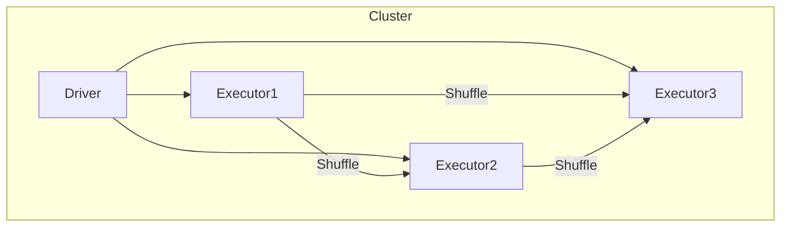
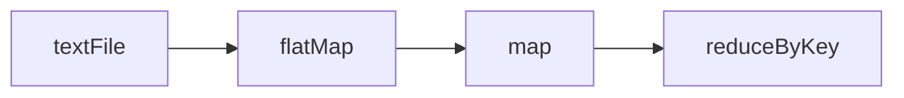

# Spark内存计算引擎原理与代码实例讲解

关键词：Spark, 内存计算, RDD, DAG, Shuffle, 容错, 分布式计算

## 1. 背景介绍
### 1.1  问题的由来
随着大数据时代的到来,传统的基于磁盘的MapReduce计算框架已经无法满足实时计算、迭代计算等场景对计算性能的要求。Spark应运而生,其基于内存的计算模型可以大幅提升计算性能,成为大数据领域最为流行的分布式计算引擎之一。
### 1.2  研究现状
目前业界对Spark的研究主要集中在其内存计算、容错机制、任务调度、Shuffle优化等方面。一些知名公司如Databricks、华为等也推出了自己优化的Spark发行版。学术界对Spark的研究还在不断深入,特别是在流式计算、图计算、机器学习等方面的应用。
### 1.3  研究意义
深入理解Spark内存计算引擎的原理,对于我们优化Spark的性能、开发基于Spark的应用程序具有重要意义。同时对于学习和研究内存计算、分布式计算等技术也很有帮助。
### 1.4  本文结构
本文将首先介绍Spark的一些核心概念,然后重点讲解Spark的内存计算原理、RDD的依赖关系与容错机制、Shuffle的原理与优化、任务调度原理等。并给出Spark核心组件的架构图和数据流图。最后通过一个实际的代码案例演示Spark程序的编写与运行。

## 2. 核心概念与联系
Spark的核心概念主要包括:
- RDD(Resilient Distributed Dataset):Spark的基本计算单元,是只读的分区记录集合,提供了一组丰富的操作API。RDD是Spark实现高效容错的核心。
- DAG(Directed Acyclic Graph):Spark任务根据RDD之间的依赖关系构建有向无环图,根据DAG划分Stage,决定任务的执行顺序。
- Executor:Spark的工作节点,负责执行计算任务。
- Driver:Spark的主控节点,负责任务的调度派发、监控。
- Stage:根据RDD宽依赖(即Shuffle依赖)对DAG进行切分得到的任务集。
- Task:被发送到Executor上的最小计算单元。
- Shuffle:Spark在Executor之间进行数据重分布的机制,是Stage之间的桥梁,但也可能成为性能瓶颈。

下图展示了Spark核心组件的架构关系:



## 3. 核心算法原理 & 具体操作步骤
### 3.1  算法原理概述
Spark的内存计算引擎基于RDD的概念。用户通过对RDD的一系列Transformation和Action操作来表达计算逻辑,Spark根据RDD之间的依赖关系构建DAG图,划分Stage,生成具体的可执行计划,由Driver分发给Executor节点执行。

### 3.2  算法步骤详解
1. 创建RDD:从数据源、内存集合或其他RDD转换而来。
2. RDD转换:通过一系列Transformation算子如map、filter等将RDD转换为新的RDD,转换过程中记录RDD之间的依赖关系。这一过程是lazy的,即不会触发真正计算。常见Transformation算子如下:
   - map(func):对RDD中每个元素执行func函数,返回新的RDD
   - filter(func):对RDD元素执行func函数,返回结果为true的元素组成的新RDD
   - flatMap(func):类似map,但每个输入元素可以映射为0到多个输出
   - groupByKey():对(K,V)类型RDD,按K分组,返回(K, Iterable)的RDD
   - reduceByKey(func):对(K,V)的RDD,按K分组,并对V使用func聚合
3. 触发Action:Action算子会触发Spark作业的执行,常见Action算子如下:
   - reduce(func):通过func函数聚合RDD中的所有元素
   - collect():以数组形式返回RDD中的所有元素到Driver
   - count():返回RDD的元素个数
   - first():返回RDD的第一个元素
   - take(n):返回RDD的前n个元素
   - foreach(func):对RDD每个元素执行func,无返回值
4. 生成DAG图:根据用户代码中的RDD依赖关系构建DAG图,如下图所示:



5. 划分Stage:Spark根据RDD之间的宽依赖将DAG图切分成不同的Stage。每个Stage包含一组窄依赖(如map、filter)的RDD操作,Stage之间以宽依赖(如reduceByKey引起的Shuffle)为边界。
6. 生成Task:Spark为每个Stage中的分区生成一个Task,分发到Executor节点执行。
7. 任务调度与执行:Driver根据特定的调度策略将Task分发给Executor,在Executor上执行计算逻辑,完成后Driver回收结果。
8. 容错处理:对于宽依赖引起的Shuffle,通过记录RDD的更新日志实现容错。窄依赖的容错通过重新计算父RDD的分区来恢复。

### 3.3  算法优缺点
Spark内存计算的优点:
- 计算速度快:得益于内存计算和DAG引擎优化
- 容错性好:通过RDD的血统(Lineage)和Checkpoint机制实现高效容错
- 易用性好:提供了丰富的算子,API使用简单
- 通用性强:支持多种类型的计算,如批处理、交互式查询、流处理、图计算、机器学习等

缺点:
- 不适合任务之间有依赖的场景,如迭代计算、图计算等,可能导致频繁的Shuffle
- 对内存要求高,内存利用率不够高效
- 调优难度大,需要对Spark原理有较深理解

### 3.4  算法应用领域
Spark被广泛应用于各种数据处理和分析场景,如:
- 批处理:ETL、数据分析等
- 交互式查询:即席查询、数据探索等
- 流处理:实时数据处理,如实时推荐、异常检测等
- 图计算:社交网络分析、欺诈检测等
- 机器学习:特征工程、模型训练等

## 4. 数学模型和公式 & 详细讲解 & 举例说明
### 4.1  数学模型构建
Spark的很多算子背后都有相应的数学模型,如PageRank算法、梯度下降算法等。这里我们以WordCount的数学模型为例。

WordCount的目标是统计文本中每个单词的出现频率。设输入文本为$D=\{d_1,d_2,...,d_n\}$,其中$d_i$表示第$i$个文档。定义单词映射函数$f_w$:

$$f_w(d_i)=\{(w_1,1),(w_2,1),...,(w_m,1)\}$$

其中$w_j$表示文档$d_i$中第$j$个不重复的单词。

WordCount可以表示为两个映射函数$f_w$和$f_c$的复合:

$$WordCount(D)=f_c \circ f_w(D)=f_c(\bigcup_{i=1}^nf_w(d_i))$$

其中$f_c$表示对相同key(单词)的value(出现次数)进行累加:

$$f_c(\{(w_1,c_1),(w_2,c_2),...\})=\{(w_1,\sum c_1),(w_2,\sum c_2),...\}$$

### 4.2  公式推导过程
根据上面的定义,WordCount的数学推导过程如下:

$$\begin{aligned}
WordCount(D) &= f_c \circ f_w(D) \\
&= f_c(\bigcup_{i=1}^nf_w(d_i)) \\
&= f_c(\bigcup_{i=1}^n\{(w_1,1),(w_2,1),...,(w_m,1)\}) \\
&= f_c(\{(w_1,c_1),(w_2,c_2),...\}) \\
&= \{(w_1,\sum c_1),(w_2,\sum c_2),...\}
\end{aligned}$$

### 4.3  案例分析与讲解
我们以一个简单的文本为例:
```
hello world
hello spark
hello hadoop
```
根据WordCount的数学模型,映射函数$f_w$将文本转换为:
```
(hello, 1), (world, 1)
(hello, 1), (spark, 1)
(hello, 1), (hadoop, 1)
```
然后$f_c$函数将结果累加:
```
(hello, 3), (world, 1), (spark, 1), (hadoop, 1)
```
这就是最终的WordCount结果。

### 4.4  常见问题解答
1. Spark能否实现词频的降序排列?
   可以,在WordCount的结果RDD上调用sortBy算子,对第二个元素(词频)进行降序排列即可。
2. 能否过滤掉出现频率低于某个阈值的单词?
   可以,对WordCount的结果RDD调用filter算子,过滤掉词频低于阈值的单词。
3. WordCount能否输出百分比形式的词频?
   可以,在WordCount的结果RDD上,使用map算子,将词频转换为占总词数的百分比。

## 5. 项目实践：代码实例和详细解释说明
### 5.1  开发环境搭建
首先需要搭建Spark开发环境,主要步骤如下:
1. 安装JDK,推荐JDK8
2. 安装Scala,推荐2.12.x版本
3. 下载Spark,推荐2.4.x版本
4. 安装IDE,推荐Intellij IDEA
5. 创建Spark项目,添加Spark依赖

### 5.2  源代码详细实现
以Scala语言为例,实现WordCount的代码如下:
```scala
val conf = new SparkConf().setAppName("WordCount")
val sc = new SparkContext(conf)

val textRDD = sc.textFile("input.txt")
val wordCountRDD = textRDD
  .flatMap(_.split(" "))
  .map((_, 1))
  .reduceByKey(_ + _)

wordCountRDD.collect().foreach(println)

sc.stop()
```

### 5.3  代码解读与分析
1. 首先创建SparkConf和SparkContext,设置应用名称
2. 读取输入文本文件,创建RDD
3. 对每一行文本进行分词,转换为单词数组
4. 将每个单词映射为(单词, 1)的二元组形式
5. 按单词进行分组,对每个组内的计数累加
6. 收集RDD结果到Driver,打印输出
7. 关闭SparkContext

可以看出,Spark代码的数据流与WordCount的数学模型完全一致:
- textFile对应读入文本集合$D$
- flatMap和map联合实现映射函数$f_w$
- reduceByKey实现映射函数$f_c$
- collect触发Action,返回结果

### 5.4  运行结果展示
假设input.txt的内容如下:
```
hello world
hello spark
hello hadoop
```
运行WordCount程序,输出结果为:
```
(hadoop,1)
(spark,1)
(world,1)
(hello,3)
```
可以看到,Spark准确地统计出了每个单词的出现频率。

## 6. 实际应用场景
Spark在实际中有非常广泛的应用,一些典型场景包括:
- 网站日志分析:分析用户访问行为、统计PV/UV等
- 电商推荐:基于用户历史行为数据进行商品推荐
- 金融风控:分析历史交易,识别欺诈行为
- 广告点击预测:分析用户特征和广告特征,预测点击概率
- 社交网络分析:分析社交网络结构,发现社区、影响力节点等
### 6.4  未来应用展望
随着大数据和AI技术的发展,Spark在更多领域将有重要应用,如:
- 知识图谱:利用Spark的图计算能力构建大规模知识图谱
- 智慧城市:利用Spark实时处理城市传感器数据,优化交通、安防等
- 基因组分析:利用Spark处理海量DNA测序数据,助力精准医疗
- 工业互联网:Spark与物联网平台集成,实现设备数据的实时分析
- 虚拟现实:Spark